--- 
title: "Aplicações práticas do software R para Agronomia"
author: "Gabriel Danilo Shimizu"
date: "2020-05-12"
site: bookdown::bookdown_site
documentclass: book
bibliography: [book.bib, packages.bib]
biblio-style: apalike
link-citations: yes
description: "Este é um livro virtual desenvolvido com a finalidade de fornecer tutoriais práticos das principais análises estatísticas e apresentação de dados utilizando o software R"
---


# Gráficos em R

<br><br>

****

# Gráfico de Colunas 

****

O gráfico em colunas consiste em construir retângulos, em que uma das dimensões é proporcional à magnitude a ser representada ($n_i$ ou $f_i$), sendo a outra arbitrária, porém igual para todas as colunas. Essas colunas são dispostas paralelamente umas às outras de forma vertical.

<br>

Além do título e fonte de referências deve-se observar o seguinte:

- as colunas devem ter todas a mesma largura;
- a distância entre as colunas deve ser constante e de preferência menor que a largura das colunas.

<br><br>


## Conjunto de dados

<br>


```r
tratamentos=rep(c(paste("T",1:5)),e=4)
resposta=c(100,120,110,90,150,145,149,165,150,144,134,139,220,206,210,210,266,249,248,260)
## Média e Desvio-padrão (Por Tratamento)
media=tapply(resposta,tratamentos, mean)
desvio=tapply(resposta,tratamentos,sd)
```

<br>


```r
barplot(media)
```

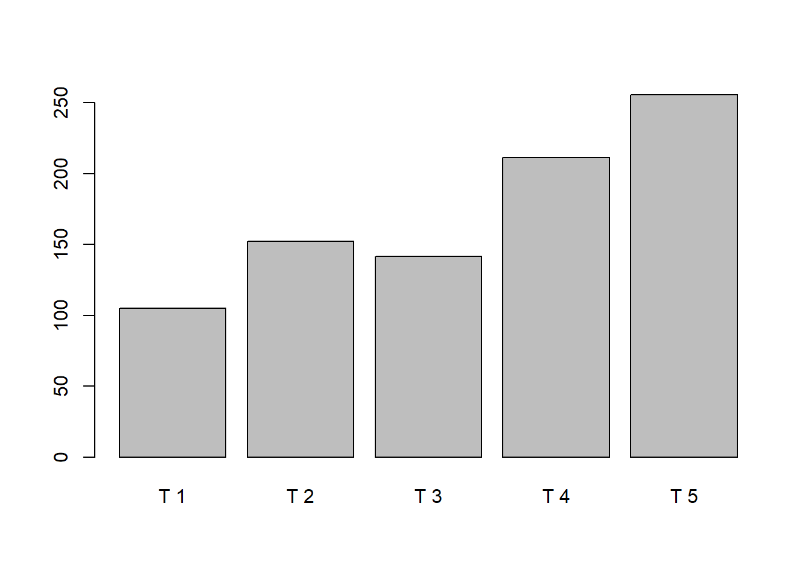

<br>

## Adicionando melhorias


```r
barplot(media, 
        las=1,
        col="lightyellow",
        ylab="Resposta",
        xlab="Tratamentos",
        ylim=c(0,300))
abline(h=0)
```

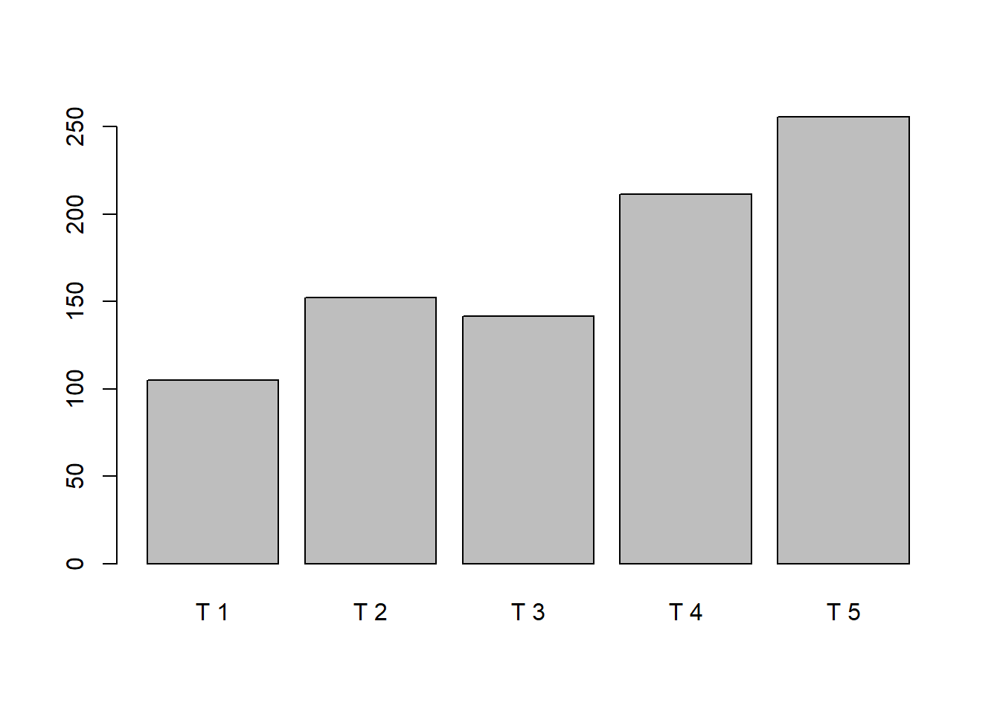

**Comandos**:

las=1: deixar escala do eixo Y na vertical

col="cor": mudar cor das barras (Ex. "red","blue","green" ou gray.colors(quantidade de tonalidades) para escala cinza ou rainbow(quantidade de cores) para escala colorida. Também é possível específicar a cor de cada barra (col=c("red","green","yellow","gray","blue"))).

xlab e ylab: nomear eixo X e Y

xlim e ylim: escala do eixo X e Y

abline(h=0): linha na horizontal em Y=0 (No caso de vertical, abline(v=0)). É possível alterar a cor pela função "col="cor"" e o tracejado pelo "lty=número" (Ver o Help do comando)

<br>

## Barras de desvio-padrão


```r
bar=barplot(media, 
        las=1,
        col="lightyellow",
        ylab="Resposta",
        xlab="Tratamentos",
        ylim=c(0,300))
abline(h=0)
arrows(bar,media+desvio,bar,media-desvio,length = 0.1,angle=90,code=3)
```


<br>

## Unidade do eixo Y 

(Ex. $Kg\ ha^{-1}$)


```r
bar=barplot(media, 
        las=1,
        col="lightyellow",
        ylab=expression("Resposta"*" "*(kg*" "*ha^-1)),
        xlab="Tratamentos",
        ylim=c(0,300))
abline(h=0)
arrows(bar,media+desvio,bar,media-desvio,length = 0.1,angle=90,code=3)
```

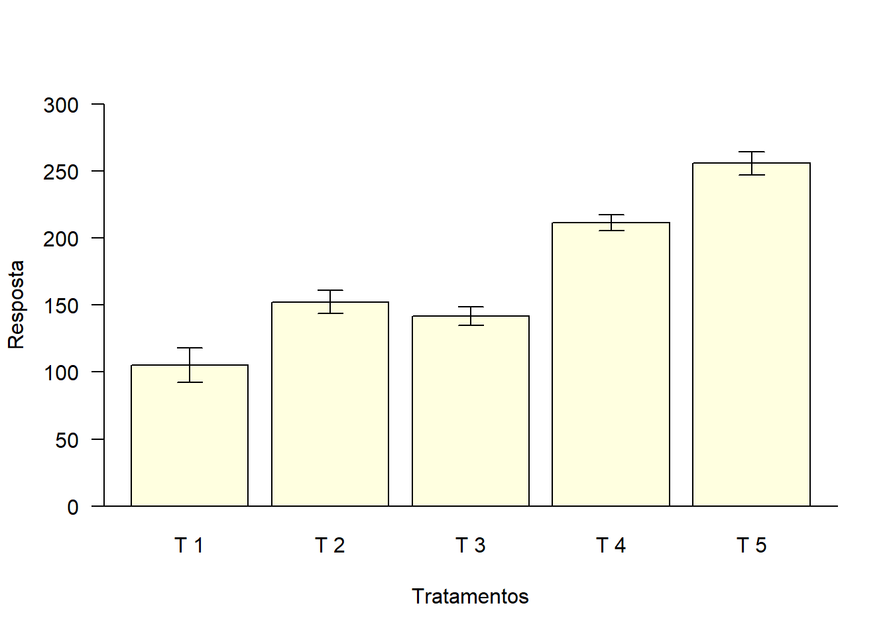

<br>

## Média dos tratamentos


```r
bar=barplot(media, 
        las=1,
        col="lightyellow",
        ylab=expression("Resposta"*" "*(kg*" "*ha^-1)),
        xlab="Tratamentos",
        ylim=c(0,300))
abline(h=0)
text(bar,media+desvio+10,media)
arrows(bar,media+desvio,bar,media-desvio,length = 0.1,angle=90,code=3)
```


<br>

## Separação de casa decimal


```r
options(OutDec=",")
bar=barplot(media, 
        las=1,
        col="lightyellow",
        ylab=expression("Resposta"*" "*(kg*" "*ha^-1)),
        xlab="Tratamentos",
        ylim=c(0,300))
abline(h=0)
text(bar,media+desvio+10,media)
arrows(bar,media+desvio,bar,media-desvio,length = 0.1,angle=90,code=3)
```


<br>

## Letras do teste de comparação


```r
tukey=c("d","c","c","b","a")
options(OutDec=",")
bar=barplot(media, 
        las=1,
        col="lightyellow",
        ylab=expression("Resposta"*" "*(kg*" "*ha^-1)),
        xlab="Tratamentos",
        ylim=c(0,300))
abline(h=0)
text(bar,media+desvio+10,paste(round(media,0),tukey))
arrows(bar,media+desvio,bar,media-desvio,length = 0.1,angle=90,code=3)
```

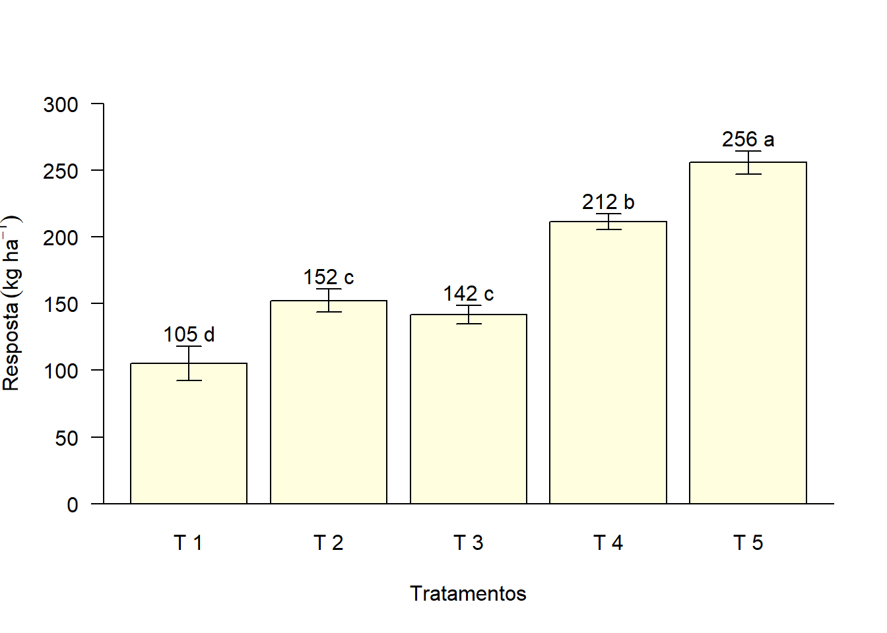

<br><br>

****

## Pacote Agricolae

****

<br>

### Conjunto de dados


```r
tratamentos=rep(c(paste("T",1:5)),e=4)
resposta=c(100,120,110,90,150,145,149,165,150,144,134,139,220,206,210,210,266,249,248,260)
```

<br>

### Modelo de Anova


```r
modelo=aov(resposta~tratamentos)
```


```r
library(agricolae)
a=HSD.test(modelo,"tratamentos", group = T)
```

<br>

### Gráfico com média 


```r
plot(a, las=1)
```

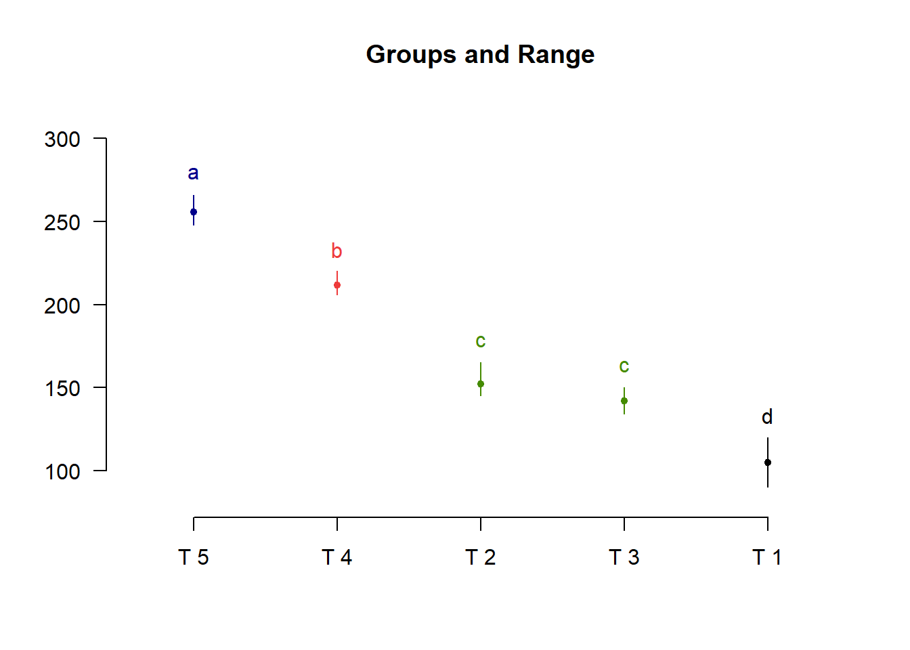

<br>

### Gráfico de barras


```r
bar.group(a$groups, col="lightblue",
          las=1, 
          ylim=c(0,300))
abline(h=0)
```

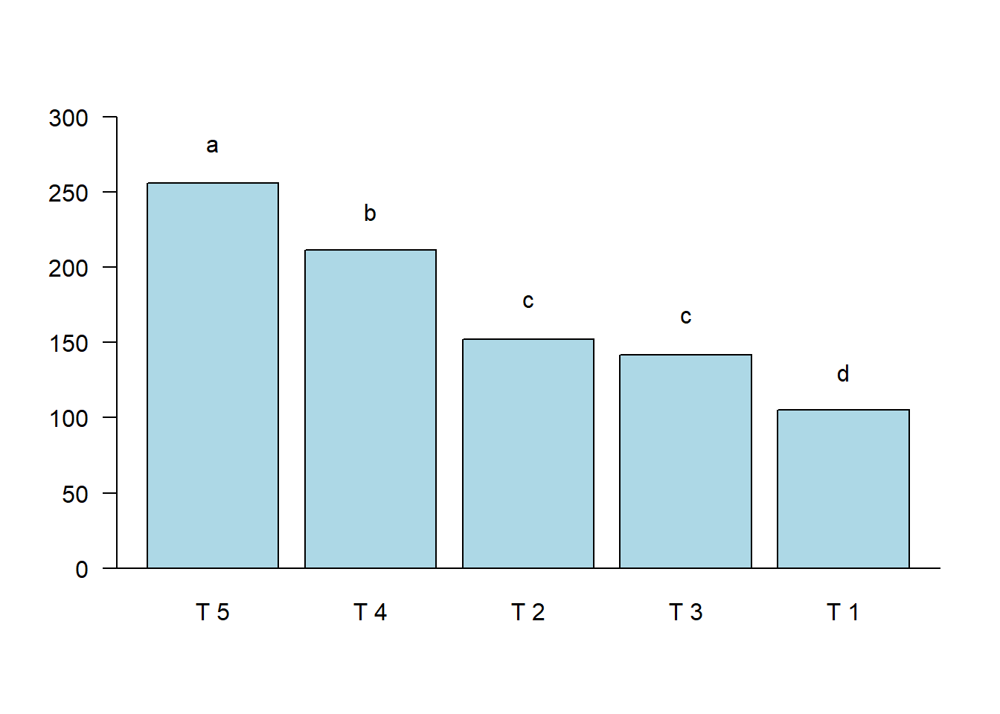

<br>

### Barras de desvio-padrão


```r
bar.err(a$means,
        variation="SD", col="lightblue",
        las=1,
        ylim=c(0,300))
abline(h=0)
```

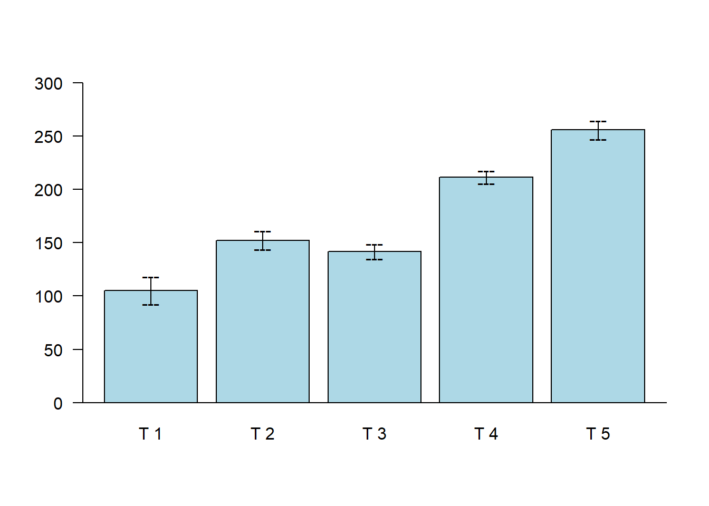

<br>

### Barras de erro padrão


```r
bar.err(a$means,
        variation="SE", col="lightblue",
        las=1,
        ylim=c(0,300))
abline(h=0)
```

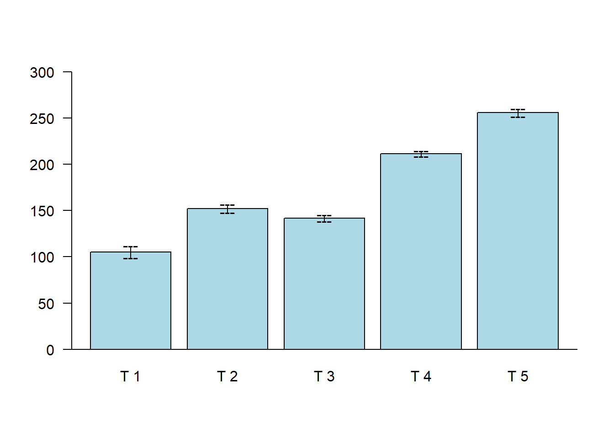

<br>

### Barras de máximo-mínimo


```r
bar.err(a$means,
        variation="range", col="lightblue",
        las=1,
        ylim=c(0,300))
abline(h=0)
```


<br>

### Barras da distância interquartil


```r
bar.err(a$means,
        variation="IQR", col="lightblue",
        las=1,
        ylim=c(0,300))
abline(h=0)
```

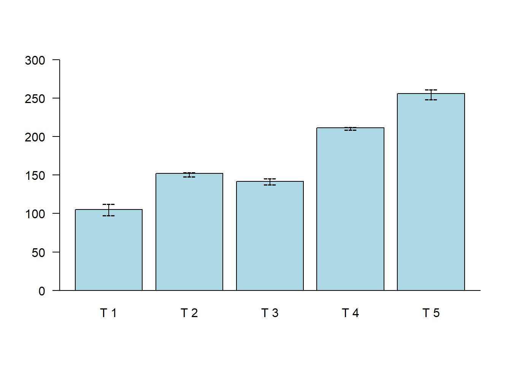

<br><br><br>

****

## Pacote ggplot2 e ggpubr

****

### Conjunto de dados

Vamos trabalhar com três experimentos em DIC com quatro tratamentos e três repetições cada. 


```r
exp1=c(10,12,13,18,19,16,5,6,5,25,26,28)
exp2=c(9,12,11,18,20,16,7,6,9,25,28,28)
exp3=c(9,12,13,18,22,15,3,6,4,25,30,28)  
Trat=rep(c(paste("T",1:4)),e=3)
dados=data.frame(Trat,exp1,exp2,exp3)
dados$Trat=as.factor(Trat)
```

Obs. Para facilitar, vamos realizar a análise direto pelo pacote ExpDes.pt (é necessário instalar o pacote)

<br>

### Análise de exp1


```r
ExpDes.pt::dic(Trat,exp1)
```

```
## ------------------------------------------------------------------------
## Quadro da analise de variancia
## ------------------------------------------------------------------------
##            GL     SQ QM     Fc      Pr>Fc
## Tratamento  3 719,58    130,83 3,8864e-07
## Residuo     8  14,67                     
## Total      11 734,25                     
## ------------------------------------------------------------------------
## CV = 8,88 %
## 
## ------------------------------------------------------------------------
## Teste de normalidade dos residuos 
## Valor-p:  0,3563889 
## De acordo com o teste de Shapiro-Wilk a 5% de significancia, os residuos podem ser considerados normais.
## ------------------------------------------------------------------------
## 
## ------------------------------------------------------------------------
## Teste de homogeneidade de variancia 
## valor-p:  0,6539247 
## De acordo com o teste de bartlett a 5% de significancia, as variancias podem ser consideradas homogeneas.
## ------------------------------------------------------------------------
## 
## Teste de Tukey
## ------------------------------------------------------------------------
## Grupos Tratamentos Medias
## a 	 T 4 	 26,33333 
##  b 	 T 2 	 17,66667 
##   c 	 T 1 	 11,66667 
##    d 	 T 3 	 5,333333 
## ------------------------------------------------------------------------
```

<br>

### Análise de exp2


```r
ExpDes.pt::dic(Trat,exp2)
```

```
## ------------------------------------------------------------------------
## Quadro da analise de variancia
## ------------------------------------------------------------------------
##            GL     SQ QM     Fc      Pr>Fc
## Tratamento  3 684,92    78,276 2,8606e-06
## Residuo     8  23,33                     
## Total      11 708,25                     
## ------------------------------------------------------------------------
## CV = 10,84 %
## 
## ------------------------------------------------------------------------
## Teste de normalidade dos residuos 
## Valor-p:  0,2365244 
## De acordo com o teste de Shapiro-Wilk a 5% de significancia, os residuos podem ser considerados normais.
## ------------------------------------------------------------------------
## 
## ------------------------------------------------------------------------
## Teste de homogeneidade de variancia 
## valor-p:  0,9823917 
## De acordo com o teste de bartlett a 5% de significancia, as variancias podem ser consideradas homogeneas.
## ------------------------------------------------------------------------
## 
## Teste de Tukey
## ------------------------------------------------------------------------
## Grupos Tratamentos Medias
## a 	 T 4 	 27 
##  b 	 T 2 	 18 
##   c 	 T 1 	 10,66667 
##   c 	 T 3 	 7,333333 
## ------------------------------------------------------------------------
```

<br>

### Análise de exp3


```r
ExpDes.pt::dic(Trat,exp3)
```

```
## ------------------------------------------------------------------------
## Quadro da analise de variancia
## ------------------------------------------------------------------------
##            GL     SQ QM     Fc      Pr>Fc
## Tratamento  3 894,25    47,066 1,9902e-05
## Residuo     8  50,67                     
## Total      11 944,92                     
## ------------------------------------------------------------------------
## CV = 16,32 %
## 
## ------------------------------------------------------------------------
## Teste de normalidade dos residuos 
## Valor-p:  0,9419794 
## De acordo com o teste de Shapiro-Wilk a 5% de significancia, os residuos podem ser considerados normais.
## ------------------------------------------------------------------------
## 
## ------------------------------------------------------------------------
## Teste de homogeneidade de variancia 
## valor-p:  0,7583526 
## De acordo com o teste de bartlett a 5% de significancia, as variancias podem ser consideradas homogeneas.
## ------------------------------------------------------------------------
## 
## Teste de Tukey
## ------------------------------------------------------------------------
## Grupos Tratamentos Medias
## a 	 T 4 	 27,66667 
##  b 	 T 2 	 18,33333 
##   c 	 T 1 	 11,33333 
##    d 	 T 3 	 4,333333 
## ------------------------------------------------------------------------
```

<br>

## Utilizando o *ggplot2*


```r
library(ggplot2)
library(gridExtra)
```

<br>

### Média e desvio-padrão


```r
media=tapply(exp1, Trat, mean)
desvio=tapply(exp1, Trat, sd)
## Construindo uma nova data.frame com a media e desvio
dados1=data.frame(Trat=rownames(media),media,desvio)
```

<br>

### Gráfico básico


```r
ggplot(dados1, 
       aes(x=Trat,y=media))+
  geom_col()
```


### Média no gráfico


```r
ggplot(dados1, 
       aes(x=Trat,y=media))+
  geom_col()+
  geom_text(label=round(media,1), vjust=-1) 
```


```r
# Obs. Round é para arrendondar o valor, neste caso estamos pedindo até a primeira casa decimal
```

<br>

### Letras do teste de comparação


```r
ggplot(dados1, 
       aes(x=Trat,y=media))+
  geom_col()+
  geom_text(label=paste(round(media,1),c("c","b","d","a")), vjust=-1)
```

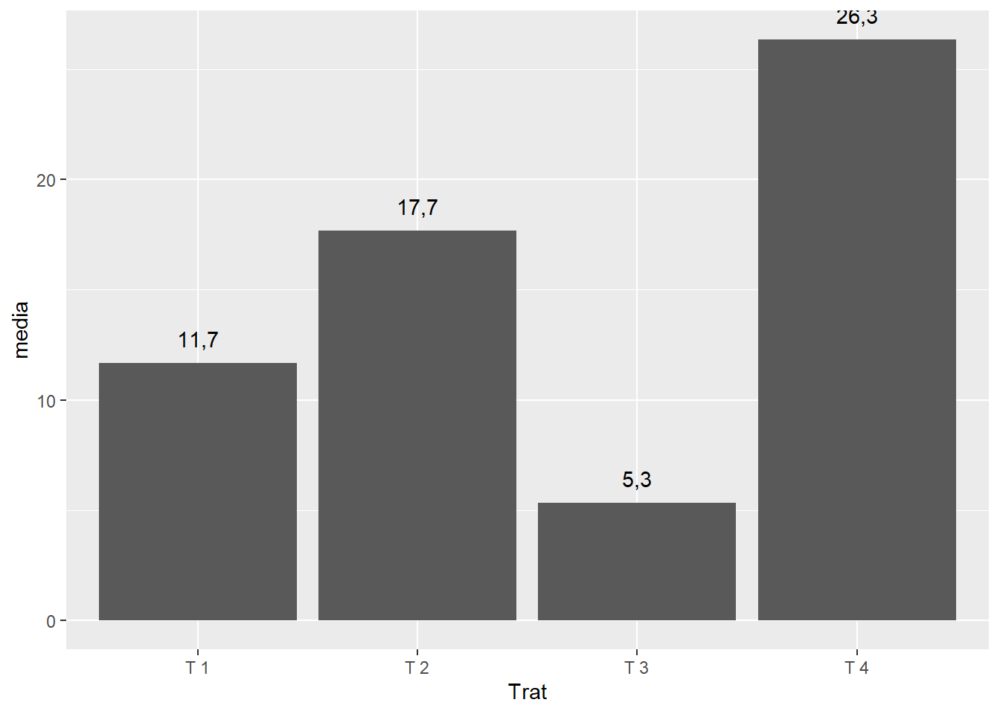

```r
#Obs. a função paste serve para juntar palavras, nesse caso está juntando cada média com suas respectivas letras do teste de comparação de médias
```

<br>

### Escala do eixo Y


```r
ggplot(dados1, 
       aes(x=Trat,y=media))+
  geom_col()+
  geom_text(label=paste(round(media,1),c("c","b","d","a")), vjust=-1)+
  ylim(c(0,40))
```


<br>

### Cor das colunas


```r
ggplot(dados1, 
       aes(x=Trat,y=media))+
  geom_col(fill=c(1,2,3,4))+
  geom_text(label=paste(round(media,1),c("c","b","d","a")), vjust=-1)+
  ylim(c(0,40))
```

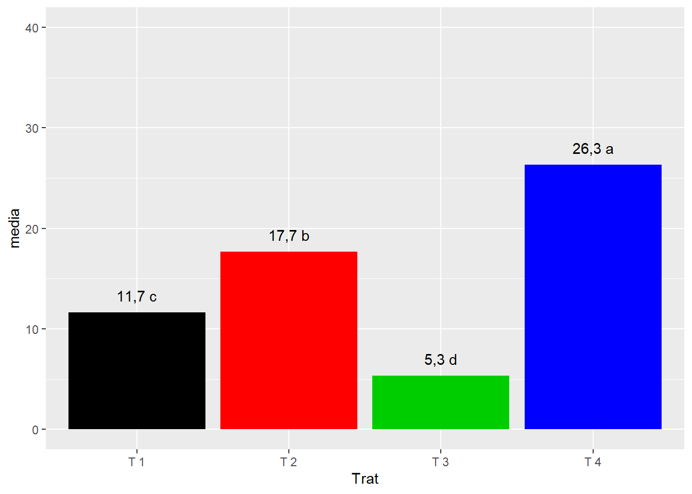

<br>

### Removendo cor de fundo


```r
ggplot(dados1, 
       aes(x=Trat,y=media))+
  geom_col(fill=c(1,2,3,4))+
  geom_text(label=paste(round(media,1),c("c","b","d","a")), vjust=-1)+
  ylim(c(0,40))+
  theme_bw()
```

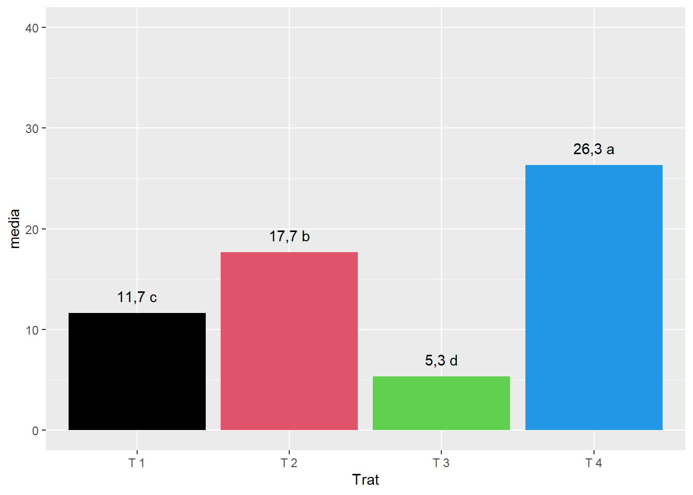

<br>

### Removendo linhas de grade


```r
ggplot(dados1, 
       aes(x=Trat,y=media))+
  geom_col(fill=c(1,2,3,4))+
  geom_text(label=paste(round(media,1),c("c","b","d","a")), vjust=-1)+
  ylim(c(0,40))+
  theme_bw()+
  theme_classic()
```


<br>

### Nome dos eixos X e Y

**Obs**. A função `expression()` funciona nesses argumentos.


```r
ggplot(dados1, aes(x=Trat,y=media))+
  geom_col(fill=c(1,2,3,4))+
  geom_text(label=paste(round(media,1),c("c","b","d","a")), vjust=-1)+
  ylim(c(0,40))+
  theme_bw()+
  theme_classic()+
  ylab("Resposta")+
  xlab(" ")
```

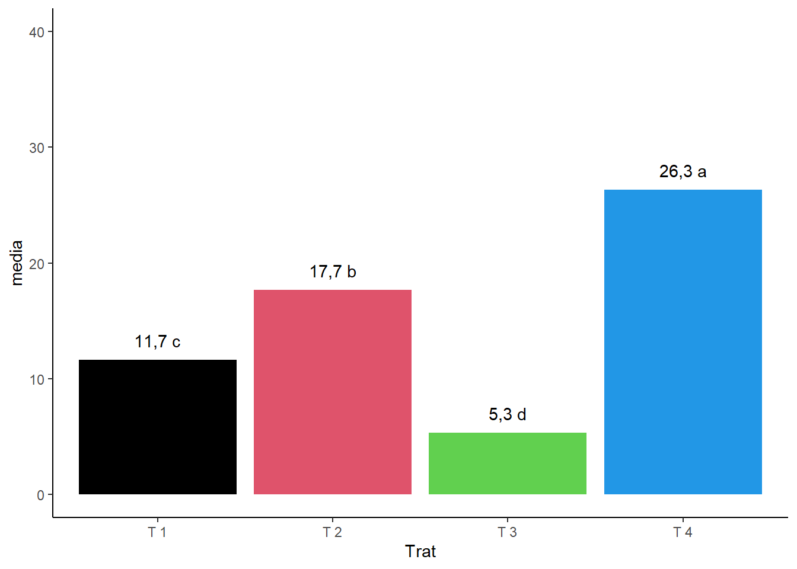

<br>

### Cor do contorno das colunas


```r
ggplot(dados1, 
       aes(x=Trat,y=media))+
  geom_col(fill=c(1,2,3,4),col="black")+     # Modifiquei aqui
  geom_text(label=paste(round(media,1),c("c","b","d","a")), vjust=-1)+
  ylim(c(0,40))+
  theme_bw()+
  theme_classic()+
  ylab("Resposta")+
  xlab(" ")
```

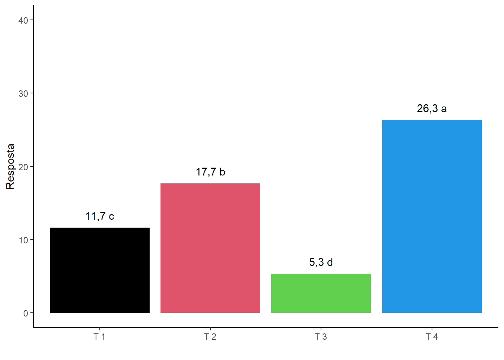

<br>

### Barras de desvio-padrão


```r
ggplot(dados1, aes(x=Trat,y=media))+
  geom_col(fill=c(1,2,3,4),col="black")+
  geom_text(label=paste(round(media,1),c("c","b","d","a")), vjust=-2)+
  ylim(c(0,40))+
  theme_bw()+
  theme_classic()+
  ylab("Resposta")+
  xlab(" ")+
  geom_errorbar(aes(ymax=media+desvio,ymin=media-desvio), width=0.25) # Width é a largura da barra
```


<br>

### Juntando os gráficos

Obs. Vamos chamar todo o plot de cada uma das variáveis de `a,b,c`, respectivamente. 

<br>

### Variável exp1


```r
media=tapply(exp1, Trat, mean)
desvio=tapply(exp1, Trat, sd)
dados1=data.frame(Trat=rownames(media),media,desvio)
a=ggplot(dados1, aes(x=Trat,y=media))+
  geom_col(fill=c(1,2,3,4),col="black")+
  geom_text(label=paste(round(media,1),
                        c("c","b","d","a")), vjust=-3)+
  ylim(c(0,40))+theme_bw()+theme_classic()+ylab("Resposta")+xlab(" ")+
  geom_errorbar(aes(ymax=media+desvio,
                   ymin=media-desvio), width=0.25)
```

<br>

### Variável exp2


```r
media=tapply(exp2, Trat, mean)
desvio=tapply(exp2, Trat, sd)
dados2=data.frame(Trat=rownames(media),media,desvio)
b=ggplot(dados2, aes(x=Trat,y=media))+
  geom_col(fill=c(1,2,3,4),col="black")+
  geom_text(label=paste(round(media,1),
                        c("c","b","c","a")), vjust=-3)+
  ylim(c(0,40))+theme_bw()+theme_classic()+ylab("Resposta")+xlab(" ")+
  geom_errorbar(aes(ymax=media+desvio,
                   ymin=media-desvio), width=0.25)
```

<br>

### Variável exp3


```r
media=tapply(exp3, Trat, mean)
desvio=tapply(exp3, Trat, sd)
dados3=data.frame(Trat=rownames(media),media,desvio)
c=ggplot(dados3, aes(x=Trat,y=media))+
  geom_col(fill=c(1,2,3,4),col="black")+
  geom_text(label=paste(round(media,1),
                        c("c","b","d","a")), vjust=-4)+
  ylim(c(0,40))+theme_bw()+theme_classic()+ylab("Resposta")+xlab(" ")+
  geom_errorbar(aes(ymax=media+desvio,
                   ymin=media-desvio), width=0.25)
```


```r
grid.arrange(a,b,c,ncol=3)
```

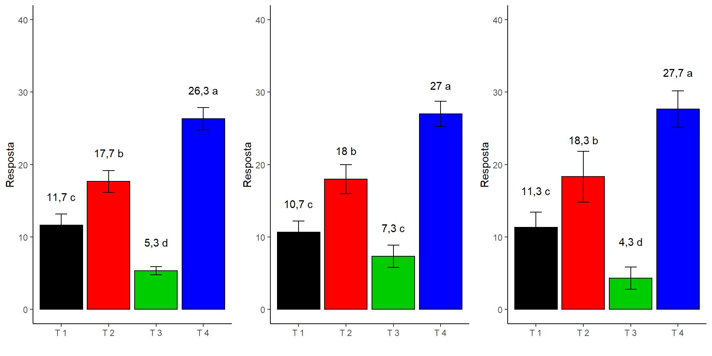

<br><br>

****

## Pacote ggpubr

****

**Obs.** Existem vários *packages* que utilizam o `ggplot2` e geram saídas similares, contudo, com argumentos dos comandos mais simples.


```r
exp1=c(10,12,13,18,19,16,5,6,5,25,26,28)
exp2=c(9,12,11,18,20,16,7,6,9,25,28,28)
exp3=c(9,12,13,18,22,15,3,6,4,25,30,28)  
Trat=rep(c(paste("T",1:4)),e=3)
dados=data.frame(Trat,exp1,exp2,exp3)
dados$Trat=as.factor(Trat)
```


```r
library(ggpubr)
library(gridExtra)
```

<br>

### Comando base 


```r
ggbarplot(dados, 
          x = "Trat", 
          y = "exp1",
          add="mean")
```

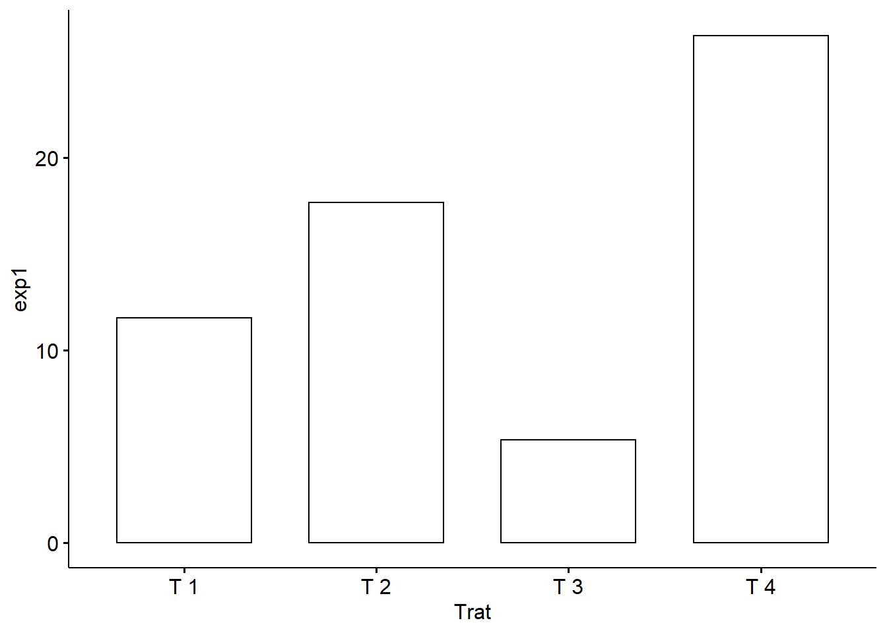

<br>

### Barras de desvio-padrão


```r
ggbarplot(dados, 
          x = "Trat", 
          y = "exp1",
          add = "mean_sd")
```

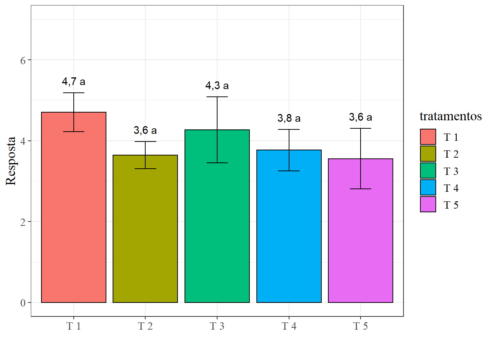

<br>

### Cor da coluna 


```r
ggbarplot(dados, 
          x = "Trat", 
          y = "exp1",
          add = "mean_sd", 
          fill = "Trat")
```

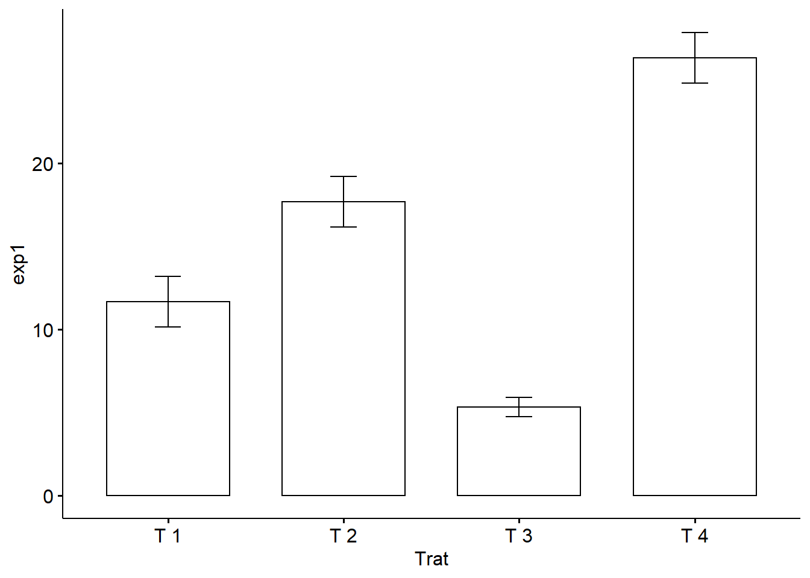


```r
ggbarplot(dados, 
          x = "Trat", 
          y = "exp1",
          add = "mean_sd", 
          fill = "Trat",
          palette = c(1,2,3,4))
```

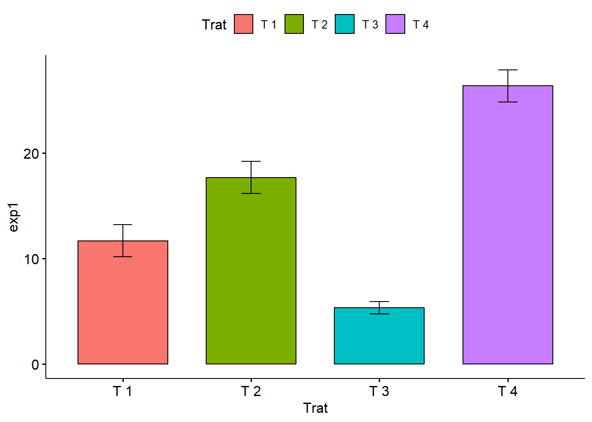

<br>

### Letra do teste de comparação


```r
ggbarplot(dados, 
          x = "Trat", 
          y = "exp1",
          add = "mean_sd", 
          fill = "Trat",
          label = c("c","b","d","a"),
          lab.vjust=-2)
```


<br>

### Adicionando a média


```r
media=tapply(exp1,Trat,mean)
ggbarplot(dados, 
          x = "Trat", 
          y = "exp1",
          add = "mean_sd", 
          fill = "Trat",
          label = paste(round(media,1),c("c","b","c","a")),
          lab.vjust=-2)
```


<br>

### Escala do eixo Y


```r
ggbarplot(dados, 
          x = "Trat", 
          y = "exp1",
          add = "mean_sd", 
          fill = "Trat",
          label = paste(round(media,1),c("c","b","d","a")),
          lab.vjust=-2)+ylim(c(0,40))
```

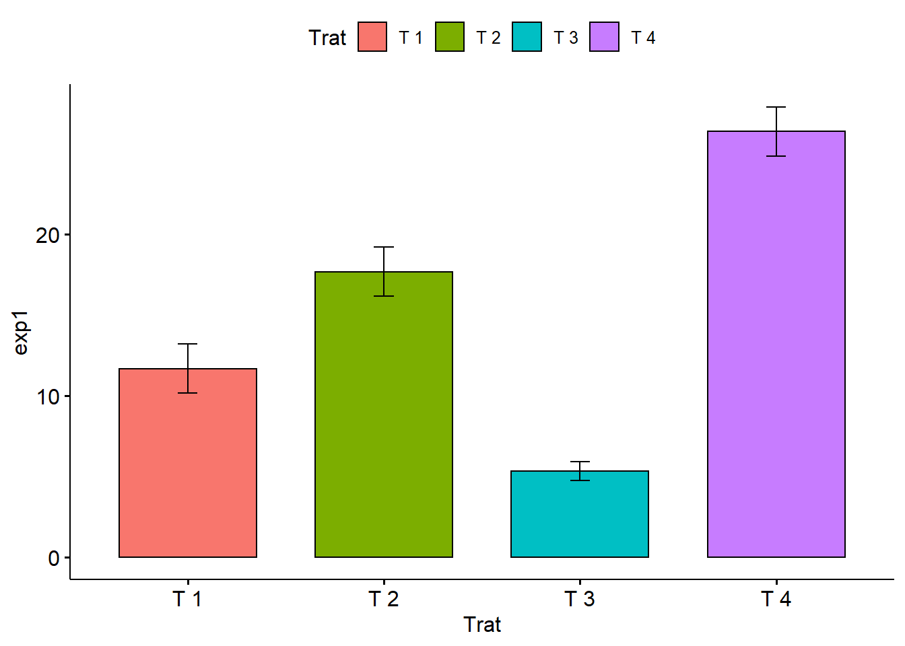

<br>

### Removendo legenda


```r
ggbarplot(dados, 
          x = "Trat", 
          y = "exp1",
          add = "mean_sd", 
          fill = "Trat",
          label = paste(round(media,1),c("c","b","d","a")),
          lab.vjust=-2,
          legend="n")+ylim(c(0,40))
```


<br>

### Juntando os gráficos

<br>

### Variável exp1


```r
media=tapply(exp1,Trat,mean)
a=ggbarplot(dados, 
          x = "Trat", 
          y = "exp1",
          add = "mean_sd", 
          fill = "Trat",
          label = paste(round(media,1),c("c","b","d","a")),
          lab.vjust=-3,
          legend="n")+ylim(c(0,40))
```

<br>

### Variável exp2


```r
media=tapply(exp2,Trat,mean)
b=ggbarplot(dados, 
          x = "Trat", 
          y = "exp2",
          add = "mean_sd", 
          fill = "Trat",
          label = paste(round(media,1),c("c","b","d","a")),
          lab.vjust=-3,
          legend="n")+ylim(c(0,40))
```

<br>

### Variável exp3


```r
media=tapply(exp3,Trat,mean)
c=ggbarplot(dados, 
          x = "Trat", 
          y = "exp3",
          add = "mean_sd", 
          fill = "Trat",
          label = paste(round(media,1),c("c","b","d","a")),
          lab.vjust=-3,
          legend="n")+ylim(c(0,40))
```


```r
grid.arrange(a,b,c,ncol=3)
```


<br>

**Como deixar apenas o gráfico a esquerda com a escala de Y?**

Existem casos em que uma mesma variável foi analisada em várias situações e dessa forma, geramos gráficos com a mesma unidade de medida. Nesse sentido, é frequente apresentar apenas uma escala de Y, geralmente o gráfico a esquerda. No pacote ggpubr, podemos efetuar da seguinte forma:

<br>


```r
media=tapply(exp1,Trat,mean)
a=ggbarplot(dados, 
          x = "Trat", 
          y = "exp1",
          add = "mean_sd", 
          fill = "Trat",
          ylab="Resposta",
          label = paste(round(media,1),c("c","b","d","a")),
          lab.vjust=-3,
          legend="n")+ylim(c(0,40))
```

<br>


```r
media=tapply(exp2,Trat,mean)
b=ggbarplot(dados, 
          x = "Trat", 
          y = "exp2",
          add = "mean_sd", 
          fill = "Trat",
          label = paste(round(media,1),c("c","b","c","a")),
          lab.vjust=-3,
          legend="n",
          yscale="n")+
  ylim(c(0,40))+
  theme(axis.text.y=element_blank())+ # Comando para remover os números da escala de Y
  ylab("") # Remover nome do eixo Y 
```

<br>


```r
media=tapply(exp3,Trat,mean)
c=ggbarplot(dados, 
          x = "Trat", 
          y = "exp3",
          add = "mean_sd", 
          fill = "Trat",
          label = paste(round(media,1),c("c","b","d","a")),
          lab.vjust=-4,
          legend="n")+
  ylim(c(0,40))+
  theme(axis.text.y=element_blank())+
  ylab("")
```


```r
grid.arrange(a,b,c,ncol=3)
```


<br><br><br>

****

## Duas variáveis categóricas

****

<br>

### Conjunto de dados


```r
Fator1=factor(rep(c(paste("F",1:2)),e=20))
Fator2=factor(c(rep(c(paste("T",1:5)),e=4),rep(c(paste("T",1:5)),e=4)))
resposta=c(100,120,110,90,150,145,149,165,250,244,220,239,220,206,210,210,266,249,248,260,110,130,120,100,160,165,169,175,160,154,144,149,230,216,220,220,276,259,258,270)
dados=data.frame(Fator1,Fator2,resposta)
## Média e Desvio-padrão (Por Tratamento)
media=with(dados, tapply(dados$resposta,list(Fator1, Fator2), mean))
desvio=with(dados, tapply(resposta,list(Fator1, Fator2), sd))
```

<br>

### Gráfico simples


```r
barplot(media, beside = T)
```

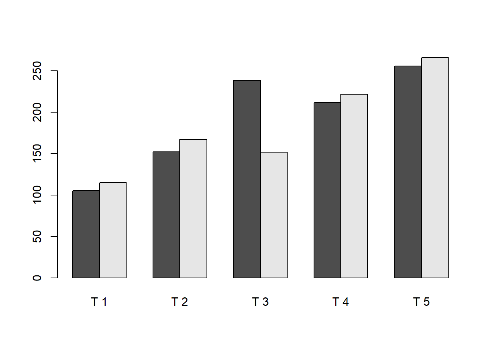

O argumento beside=T é refente a um gráfico de barras em que as barras são posicionadas lado a lado. Do contrário, as barras serão empilhadas (*stacked*). 

<br>

### Melhorias


```r
barplot(media, beside = T,
        las=1, col=c("lawngreen","gold"),
        ylab="Resposta",
        xlab="Fator2",
        ylim=c(0,300))
abline(h=0)
```


**Comandos**:

**las=1**: deixar escala do eixo Y na vertical

**col="cor"**: mudar cor das barras (Ex. "red","blue","green" ou gray.colors(quantidade de tonalidades) para escala cinza ou rainbow(quantidade de cores) para escala colorida. Também é possível específicar a cor de cada barra (col=c("red","green","yellow","gray","blue"))).

**xlab** e **ylab**: nomear eixo X e Y

**xlim** e **ylim**: escala do eixo X e Y

**abline(h=0)**: linha na horizontal em Y=0 (No caso de vertical, abline(v=0)). É possível alterar a cor pela função "col="cor"" e o tracejado pelo "lty=número" (Ver o Help do comando)

<br>

### Cores


```r
barplot(1:21, col=c("red","white","black","lightyellow","green","blue","orange",
                        "yellow","gray","pink","brown","Gainsboro", "Lavender", 
                        "DeepSkyBlue","LawnGreen", "Gold","MediumOrchid",
                        "LightSalmon", "Sienna", "Tomato", "DeepPink1"))
```


<br>

### Barras de desvio-padrão


```r
bar=barplot(media,beside=T, 
        las=1,
        ylab="Resposta",
        xlab="Tratamentos",
        ylim=c(0,300))
abline(h=0)
arrows(bar,media+desvio,bar,media-desvio,length = 0.1,angle=90,code=3)
```

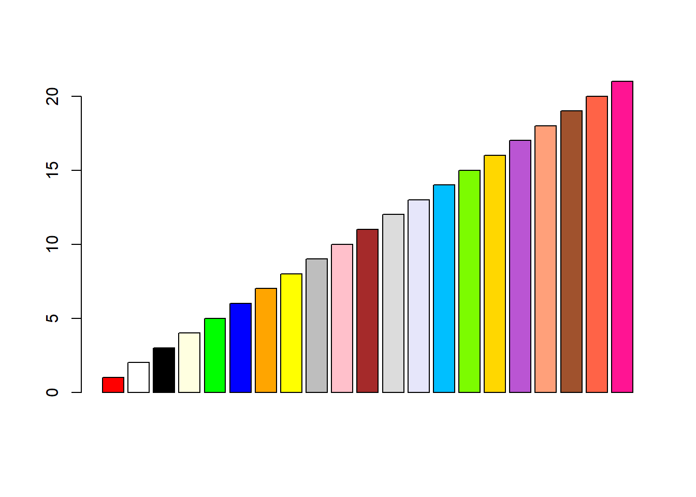

<br>

### Unidade do eixo Y 

(Ex. $Kg\ ha^{-1}$)


```r
bar=barplot(media, beside=T,
        las=1,
        ylab=expression("Resposta"*" "*(kg*" "*ha^-1)),
        xlab="Tratamentos",
        ylim=c(0,300))
abline(h=0)
arrows(bar,media+desvio,bar,media-desvio,length = 0.1,angle=90,code=3)
```

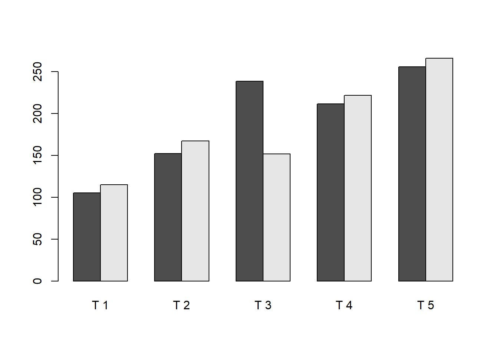

<br>

### Média acima das barras


```r
bar=barplot(media, beside=T,
        las=1,
        ylab=expression("Resposta"*" "*(kg*" "*ha^-1)),
        xlab="Tratamentos",
        ylim=c(0,300))
abline(h=0)
text(bar,media+desvio+10,media, cex=0.8)
arrows(bar,media+desvio,bar,media-desvio,length = 0.1,angle=90,code=3)
```


<br>

### Separação de casa decimal


```r
options(OutDec=",")
bar=barplot(media, beside=T,
        las=1,
        ylab=expression("Resposta"*" "*(kg*" "*ha^-1)),
        xlab="Tratamentos",
        ylim=c(0,300))
abline(h=0)
text(bar,media+desvio+10,media, cex=0.8)
arrows(bar,media+desvio,bar,media-desvio,length = 0.1,angle=90,code=3)
```

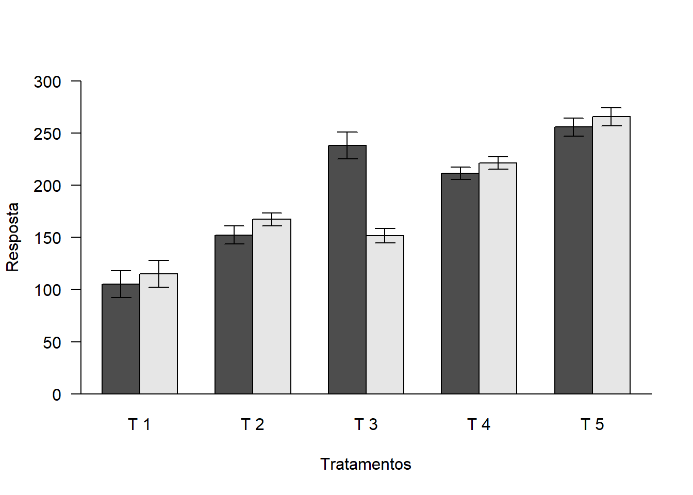

<br>

### Letras do teste de comparação


```r
tukey=c("dB","dA","cB","cA","cB","cA","bB","bA","aB","aA")
options(OutDec=",")
bar=barplot(media, beside=T,
        las=1,
        ylab=expression("Resposta"*" "*(kg*" "*ha^-1)),
        xlab="Tratamentos",
        ylim=c(0,300))
abline(h=0)
text(bar,media+desvio+10,paste(round(media,0),tukey), cex=0.8)
arrows(bar,media+desvio,bar,media-desvio,length = 0.1,angle=90,code=3)
```

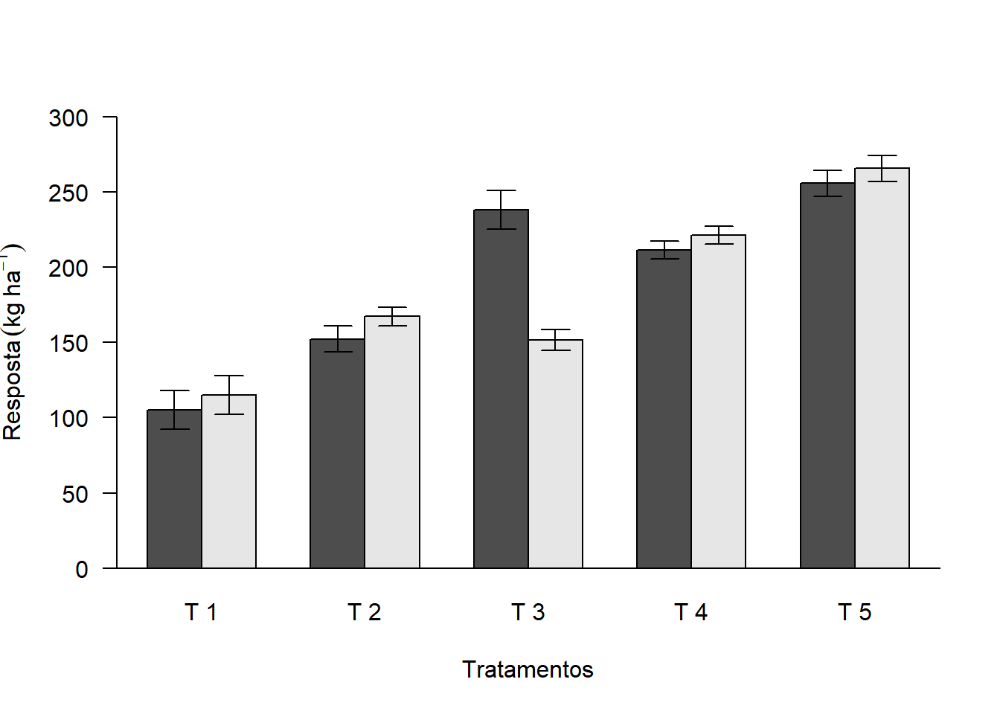

<br>

### Adicionando legenda

**legend.text=rownames(media)**: adicionar a legenda (neste caso em relação ao Fator 2)

**args.legend**: argumentos da legenda (x="topleft": legenda será adicionada no parte superior esquerda, podemos adicionar superior direito ("topright"), inferior esquerdo ("bottomleft"), inferior direito ("bottomright"), centralizado ("center"))


```r
tukey=c("dB","dA","cB","cA","cB","cA","bB","bA","aB","aA")
options(OutDec=",")
bar=barplot(media, 
            beside=T,
            legend.text = rownames(media),
            args.legend = list(x="topleft", bty="n"),
        las=1,
        ylab=expression("Resposta"*" "*(kg*" "*ha^-1)),
        xlab="Tratamentos",
        ylim=c(0,300))
abline(h=0)
text(bar,media+desvio+10,paste(round(media,0),tukey), cex=0.8)
arrows(bar,media+desvio,bar,media-desvio,length = 0.1,angle=90,code=3)
```


<br><br><br>

****

## Colunas empilhadas

****

<br>

### Conjunto de dados


```r
Fator1=factor(rep(c(paste("F",1:2)),e=20))
Fator2=factor(c(rep(c(paste("T",1:5)),e=4),rep(c(paste("T",1:5)),e=4)))
resposta=c(100,120,110,90,150,145,149,165,250,244,220,239,220,206,210,
           210,266,249,248,260,110,130,120,100,160,165,169,175,160,154,
           144,149,230,216,220,220,276,259,258,270)
dados=data.frame(Fator1,Fator2,resposta)
## Média e Desvio-padrão (Por Tratamento)
media=with(dados, tapply(dados$resposta,list(Fator1, Fator2), mean))
desvio=with(dados, tapply(resposta,list(Fator1, Fator2), sd))
```

<br>

### Gráfico básico


```r
barplot(media, beside=F)
```

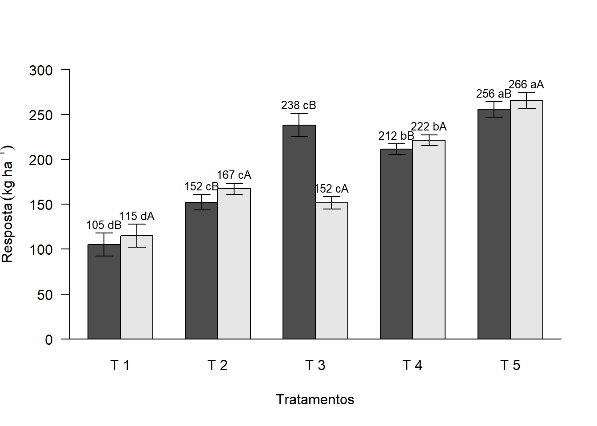

O argumento beside=F é refente a um gráfico de barras em que as barras são posicionadas lado a lado. Do contrário, as barras serão empilhadas (*stacked*). 

<br>

### Melhorias


```r
barplot(media, beside=F,
        las=1, col=c("lawngreen","gold"),
        ylab="Resposta",
        xlab="Fator2",
        ylim=c(0,600))
abline(h=0)
```


**Comandos**:

**las=1**: deixar escala do eixo Y na vertical

**col="cor"**: mudar cor das barras (Ex. "red","blue","green" ou gray.colors(quantidade de tonalidades) para escala cinza ou rainbow(quantidade de cores) para escala colorida. Também é possível específicar a cor de cada barra (col=c("red","green","yellow","gray","blue"))).

**xlab** e **ylab**: nomear eixo X e Y

**xlim** e **ylim**: escala do eixo X e Y

**abline(h=0)**: linha na horizontal em Y=0 (No caso de vertical, abline(v=0)). É possível alterar a cor pela função "col="cor"" e o tracejado pelo "lty=número" (Ver o Help do comando)

### Barras de desvio-padrão


```r
bar=barplot(media,beside=F, 
        las=1,col=c("lawngreen","gold"),
        ylab="Resposta",
        xlab="Tratamentos",
        ylim=c(0,600))
abline(h=0)
arrows(bar,media[1,]+desvio[1,],bar,media[1,]-desvio[1,],length = 0.1,angle=90,code=3)
arrows(bar,media[1,]+media[2,]+desvio[2,],bar,media[1,]+media[2,]-desvio[2,],length = 0.1,angle=90,code=3)
```

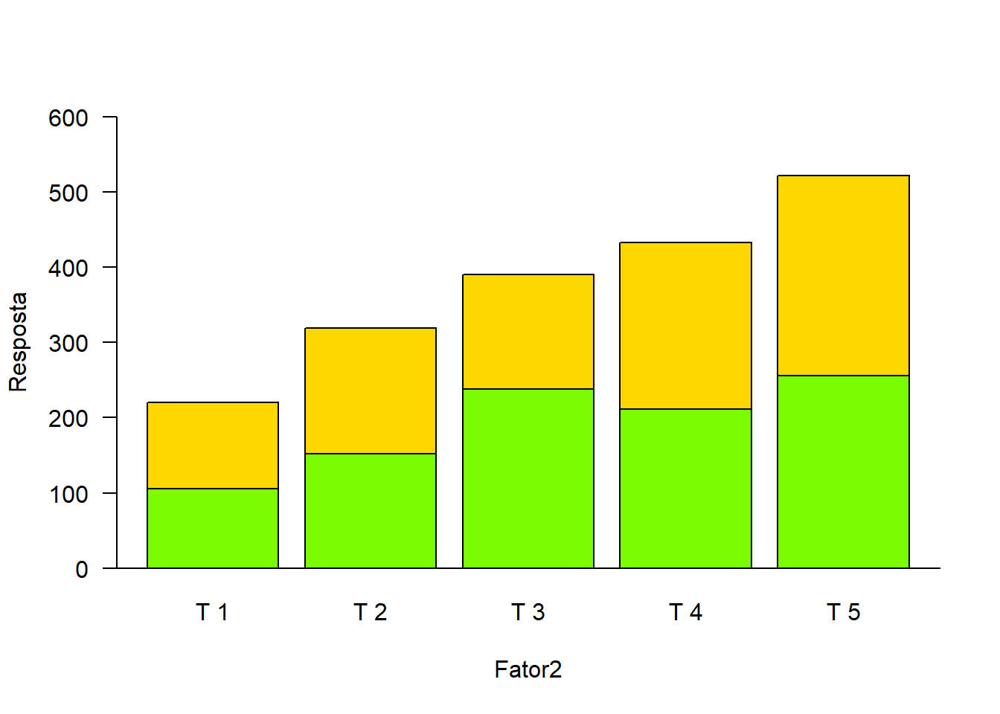

<br>

### Unidade do eixo Y 

(Ex. $Kg\ ha^{-1}$)


```r
bar=barplot(media, beside=F,
        las=1,col=c("lawngreen","gold"),
        ylab=expression(Resposta~~(kg~ha^-1)),
        xlab="Tratamentos",
        ylim=c(0,600))
abline(h=0)
arrows(bar,media[1,]+desvio[1,],bar,media[1,]-desvio[1,],length = 0.1,angle=90,code=3)
arrows(bar,media[1,]+media[2,]+desvio[2,],bar,media[1,]+media[2,]-desvio[2,],length = 0.1,angle=90,code=3)
```


### Média acima das barras


```r
bar=barplot(media, beside=F,
        las=1,col=c("lawngreen","gold"),
        ylab=expression(Resposta~~(kg~ha^-1)),
        xlab="Tratamentos",
        ylim=c(0,600))
abline(h=0)
text(bar,media[1,]+desvio[1,]+20,media[1,], cex=0.8)
text(bar,media[1,]+media[2,]+desvio[2,]+20,media[2,], cex=0.8)
arrows(bar,media[1,]+desvio[1,],bar,media[1,]-desvio[1,],length = 0.1,angle=90,code=3)
arrows(bar,media[1,]+media[2,]+desvio[2,],bar,media[1,]+media[2,]-desvio[2,],length = 0.1,angle=90,code=3)
```


<br>

### Separação de casa decimal


```r
options(OutDec=",")
bar=barplot(media, beside=F,
        las=1,col=c("lawngreen","gold"),
        ylab=expression(Resposta~~(kg~ha^-1)),
        xlab="Tratamentos",
        ylim=c(0,600))
abline(h=0)
text(bar,media[1,]+desvio[1,]+20,media[1,], cex=0.8)
text(bar,media[1,]+media[2,]+desvio[2,]+20,media[2,], cex=0.8)
arrows(bar,media[1,]+desvio[1,],bar,media[1,]-desvio[1,],length = 0.1,angle=90,code=3)
arrows(bar,media[1,]+media[2,]+desvio[2,],bar,media[1,]+media[2,]-desvio[2,],length = 0.1,angle=90,code=3)
```


<br>

### Letras do teste de comparação 


```r
tukey=c("dB","dA","cB","cA","cB","cA","bB","bA","aB","aA")
options(OutDec=",")
bar=barplot(media, beside=F,
        las=1,col=c("lawngreen","gold"),
        ylab=expression(Resposta~~(kg~ha^-1)),
        xlab="Tratamentos",
        ylim=c(0,600))
abline(h=0)
text(bar,media[1,]+desvio[1,]+20,paste(media[1,], tukey[c(1,3,6,7,9)]), cex=0.8)
text(bar,media[1,]+media[2,]+desvio[2,]+20,paste(media[2,], tukey[c(2,4,6,8,10)]), cex=0.8)
arrows(bar,media[1,]+desvio[1,],bar,media[1,]-desvio[1,],length = 0.1,angle=90,code=3)
arrows(bar,media[1,]+media[2,]+desvio[2,],bar,media[1,]+media[2,]-desvio[2,],length = 0.1,angle=90,code=3)
```


<br>

### Adicionando legenda

**legend.text=rownames(media)**: adicionar a legenda (neste caso em relação ao Fator 2)

**args.legend**: argumentos da legenda (x="topleft": legenda será adicionada no parte superior esquerda, podemos adicionar superior direito ("topright"), inferior esquerdo ("bottomleft"), inferior direito ("bottomright"), centralizado ("center"))


```r
tukey=c("dB","dA","cB","cA","cB","cA","bB","bA","aB","aA")
options(OutDec=",")
bar=barplot(media, 
            beside=F,
            legend.text = rownames(media),
            args.legend = list(x="topleft", bty="n"),
        las=1,col=c("lawngreen","gold"),
        ylab=expression(Resposta~(kg~ha^-1)),
        xlab="Tratamentos",
        ylim=c(0,600))
abline(h=0)
text(bar,media[1,]+desvio[1,]+20,paste(media[1,], tukey[c(1,3,6,7,9)]), cex=0.8)
text(bar,media[1,]+media[2,]+desvio[2,]+20,paste(media[2,], tukey[c(2,4,6,8,10)]), cex=0.8)
arrows(bar,media[1,]+desvio[1,],bar,media[1,]-desvio[1,],length = 0.1,angle=90,code=3)
arrows(bar,media[1,]+media[2,]+desvio[2,],bar,media[1,]+media[2,]-desvio[2,],length = 0.1,angle=90,code=3)
```

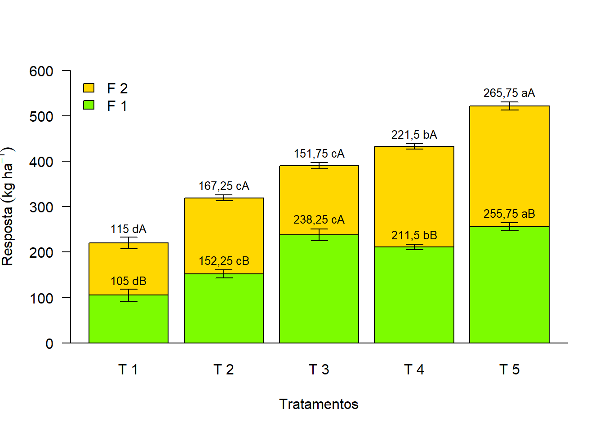

<br><br><br>

****

## Dois lados com escala positiva

****

<br>

### Conjunto de dados


```r
trat=rep(c("T1","T2","T3","T4","T5"),e=3)
mspa=c(8,10,12,18,20,22,28,30,32,38,40,42,48,50,52)
msr=c(14,15,16,19,20,21,24,25,26,29,30,31,34,35,36)
```

<br>

### Média e desvio-padrão


```r
m1=tapply(mspa, trat, mean)
m2=tapply(msr, trat, mean)
sd1=tapply(mspa, trat, sd)
sd2=tapply(msr, trat, sd)
```


```r
# alterando margem e configurando para dois plots um abaixo do outro
op <- list(mfrow = c(2,1),
          oma = c(5,4,0,0) + 0.1,
          mar = c(0,0,0,1))
```

<br>

### Somente colunas

**Obs.** Nesse caso em específico, estamos querendo que ambas as variáveis assumem respostas positivas. Todavia, queremo a coluna da variável MSPA acima e MSR abaixo. 


```r
par(op)
b1=barplot(m1, 
           axes=F, 
           col="blue",
           ylim=c(0,60),
           axisnames = F,
           las=1)
b2=barplot(m2, 
           axes=F,
           col="red",
           ylim=c(60,0),
           las=1)
```


<br>

### Escala do eixo Y


```r
par(op)
b1=barplot(m1, 
           axes=F, 
           col="blue",
           ylim=c(0,60),
           axisnames = F,
           las=1)
axis(2,seq(0,50,10),las=1)
b1=barplot(m2, 
           axes=F,
           col="red",
           ylim=c(60,0),
           axisnames = F,
           las=1)
axis(2,seq(0,50,10),las=1)
```


<br>

### Barras de desvio-padrão


```r
par(op)
b1=barplot(m1, 
           axes=F, 
           col="blue",
           ylim=c(0,60),
           axisnames = F,
           las=1)
axis(2,seq(0,50,10),las=1)
arrows(b1,m1+sd1,b1,m1-sd1,angle = 90,code=3, length = 0.05)
b2=barplot(m2, 
           axes=F,
           col="red",
           ylim=c(60,0),
           axisnames = F,
           las=1)
axis(2,seq(0,50,10),las=1)
arrows(b2,m2+sd2,b2,m2-sd2,angle = 90,code=3, length = 0.05)
```


<br>

### Linha em 0 e título de Y


```r
par(op)
b1=barplot(m1, 
           axes=F, 
           col="blue",
           ylim=c(0,60),
           axisnames = F,
           las=1)
axis(2,seq(0,50,10),las=1)
arrows(b1,m1+sd1,b1,m1-sd1,angle = 90,code=3, length = 0.05)
b2=barplot(m2, 
           axes=F,
           col="red",
           ylim=c(60,0),
           axisnames = F,
           las=1)
axis(2,seq(0,50,10),las=1)
title(ylab = "Resposta",outer=T, line = 3)
arrows(b2,m2+sd2,b2,m2-sd2,angle = 90,code=3, length = 0.05)
abline(h=0)
```


<br>

### Título para MS (g)


```r
par(op)
b1=barplot(m1, 
           axes=F, 
           col="blue",
           ylim=c(0,60),
           axisnames = F,
           las=1)
axis(2,seq(0,50,10),las=1)
arrows(b1,m1+sd1,b1,m1-sd1,angle = 90,code=3, length = 0.05)
b2=barplot(m2, 
           axes=F,
           col="red",
           ylim=c(60,0),
#           axisnames = F,
           las=1)
axis(2,seq(0,50,10),las=1)
title(ylab = expression(MS~(g)),outer=T, line = 3)
arrows(b2,m2+sd2,b2,m2-sd2,angle = 90,code=3, length = 0.05)
abline(h=0)
```

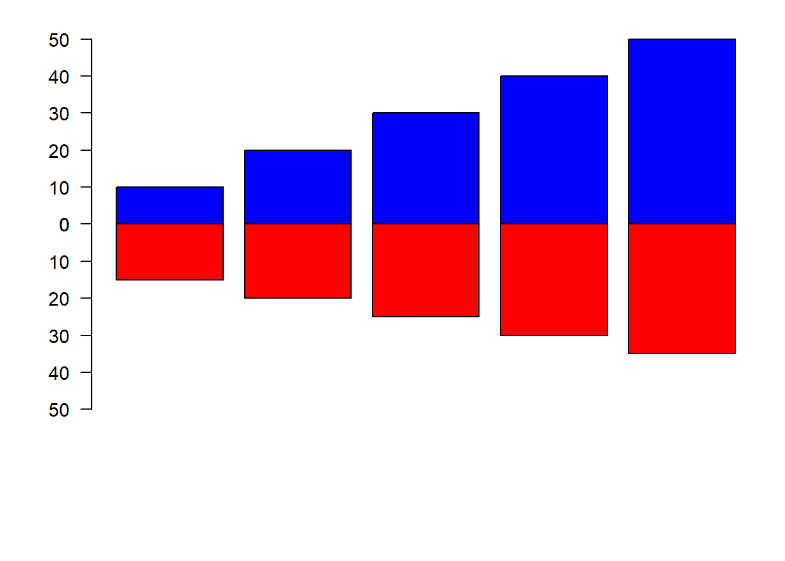

<br>

### Coluna hachurada


```r
par(op)
b1=barplot(m1, 
           axes=F, 
           col="blue",
           density = 40,
           ylim=c(0,60),
           axisnames = F,
           las=1)
axis(2,seq(0,50,10),las=1)
arrows(b1,m1+sd1,b1,m1-sd1,angle = 90,code=3, length = 0.05)
b2=barplot(m2, 
           axes=F,
           col="red",
           ylim=c(60,0),
           density = 20,
#           axisnames = F,
           las=1)
axis(2,seq(0,50,10),las=1)
title(ylab = expression(MS~(g)),outer=T, line = 3)
arrows(b2,m2+sd2,b2,m2-sd2,angle = 90,code=3, length = 0.05)
abline(h=0)
```

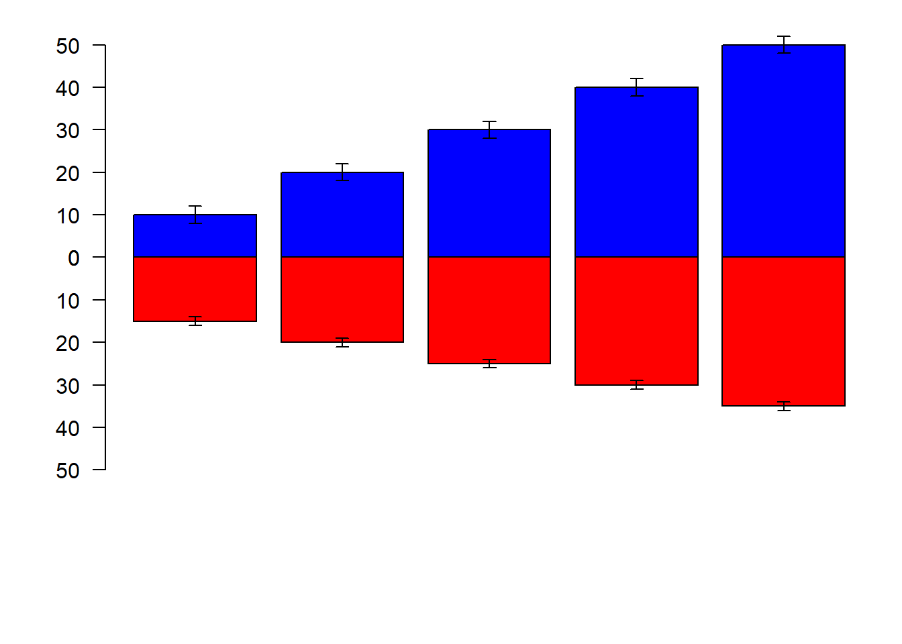

<br>

### Adicionando legenda


```r
par(op)
b1=barplot(m1, 
           axes=F, 
           col="blue",
           density = 40,
           ylim=c(0,60),
           axisnames = F,
           las=1)
axis(2,seq(0,50,10),las=1)
arrows(b1,m1+sd1,b1,m1-sd1,angle = 90,code=3, length = 0.05)
legend("topleft",
       fill=c("blue","red"),
       legend=c("MSPA","MSR"),
       density = c(40,20),
       bty="n")
b2=barplot(m2, 
           axes=F,
           col="red",
           ylim=c(60,0),
           density = 20,
#           axisnames = F,
           las=1)
axis(2,seq(0,50,10),las=1)
title(ylab = expression(MS~(g)),outer=T, line = 3)
arrows(b2,m2+sd2,b2,m2-sd2,angle = 90,code=3, length = 0.05)
abline(h=0)
```


<br>

### Teste de comparação


```r
par(op)
b1=barplot(m1, 
           axes=F, 
           col="blue",
           density = 40,
           ylim=c(0,60),
           axisnames = F,
           las=1)
axis(2,seq(0,50,10),las=1)
arrows(b1,m1+sd1,b1,m1-sd1,angle = 90,code=3, length = 0.05)
legend("topleft",
       fill=c("blue","red"),
       legend=c("MSPA","MSR"),
       density = c(40,20),
       bty="n")
text(b1,m1+sd1+5,c("e","d","c","b","a"))
b2=barplot(m2, 
           axes=F,
           col="red",
           ylim=c(60,0),
           density = 20,
#           axisnames = F,
           las=1)
axis(2,seq(0,50,10),las=1)
text(b2,m2+sd2+5,c("e","d","c","b","a"))
title(ylab = expression(MS~(g)),outer=T, line = 3)
arrows(b2,m2+sd2,b2,m2-sd2,angle = 90,code=3, length = 0.05)
abline(h=0)
```

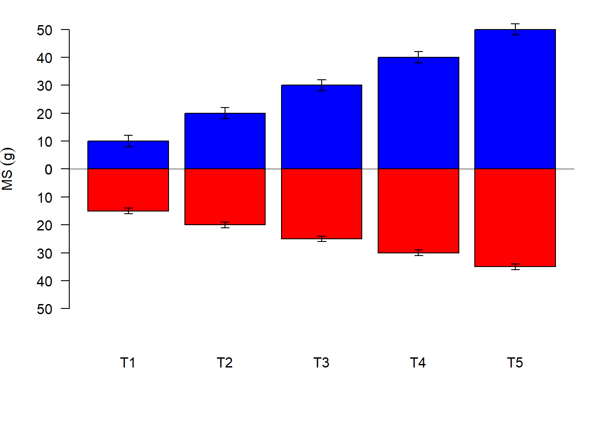

<br>

### Mudando fonte 


```r
par(family="serif")
par(op)
b1=barplot(m1, 
           axes=F, 
           col="blue",
           density = 40,
           ylim=c(0,60),
           axisnames = F,
           las=1)
axis(2,seq(0,50,10),las=1)
arrows(b1,m1+sd1,b1,m1-sd1,angle = 90,code=3, length = 0.05)
legend("topleft",
       fill=c("blue","red"),
       legend=c("MSPA","MSR"),
       density = c(40,20),
       bty="n")
text(b1,m1+sd1+5,c("e","d","c","b","a"))
b2=barplot(m2, 
           axes=F,
           col="red",
           ylim=c(60,0),
           density = 20,
#           axisnames = F,
           las=1)
axis(2,seq(0,50,10),las=1)
text(b2,m2+sd2+5,c("e","d","c","b","a"))
title(ylab = expression(MS~(g)),outer=T, line = 3)
arrows(b2,m2+sd2,b2,m2-sd2,angle = 90,code=3, length = 0.05)
abline(h=0)
```

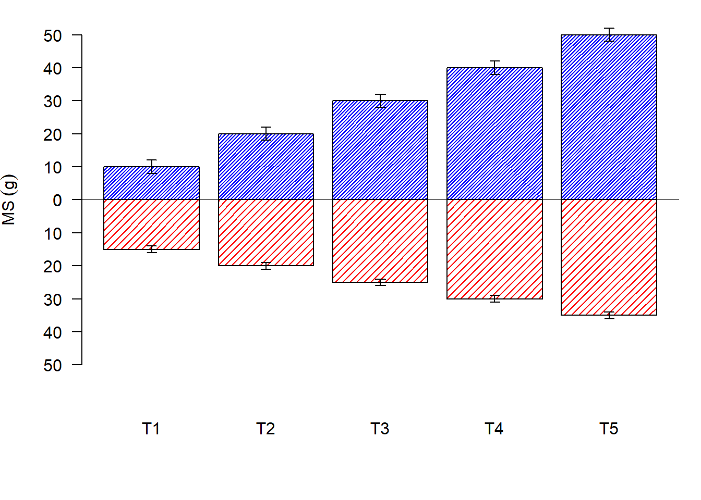

<br><br><br>

****

# Gráfico de Barras

****

<br>

O gráfico em barras consiste em construir retângulos, em que uma das dimensões é proporcional à magnitude a ser representada ($n_i$ ou $f_i$), sendo a outra arbitrária, porém igual para todas as barras. Essas colunas são dispostas paralelamente umas às outras de forma horizontal.

Além do título e fonte de referências deve-se observar o seguinte:

- as barras devem ter todas a mesma largura;
- a distância entre as barras deve ser constante e de preferência menor que a largura das barras.

<br>

### Conjunto de dados


```r
tratamentos=rep(c(paste("T",1:5)),e=4)
resposta=c(100,120,110,90,150,145,149,165,150,144,134,139,220,206,210,210,266,249,248,260)
## Média e Desvio-padrão (Por Tratamento)
media=tapply(resposta,tratamentos, mean)
desvio=tapply(resposta,tratamentos,sd)
```

<br>

### Gráfico básico


```r
barplot(media, horiz = T)
```


<br>

### Melhorias


```r
barplot(media, horiz = T, 
        las=1,
        col="lightyellow",
        ylab="Resposta",
        xlab="Tratamentos",
        xlim=c(0,300))
abline(v=0)
```

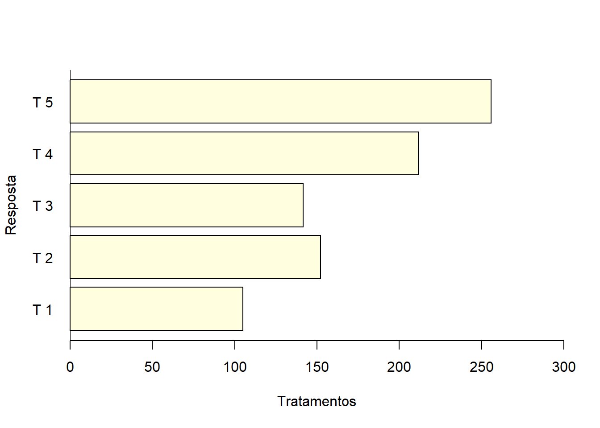

<br>

### Barras de desvio-padrão


```r
bar=barplot(media, 
        las=1,horiz = T,
        col="lightyellow",
        ylab="Resposta",
        xlab="Tratamentos",
        xlim=c(0,300))
abline(v=0)
arrows(media+desvio,bar,media-desvio,bar,length = 0.1,angle=90,code=3)
```

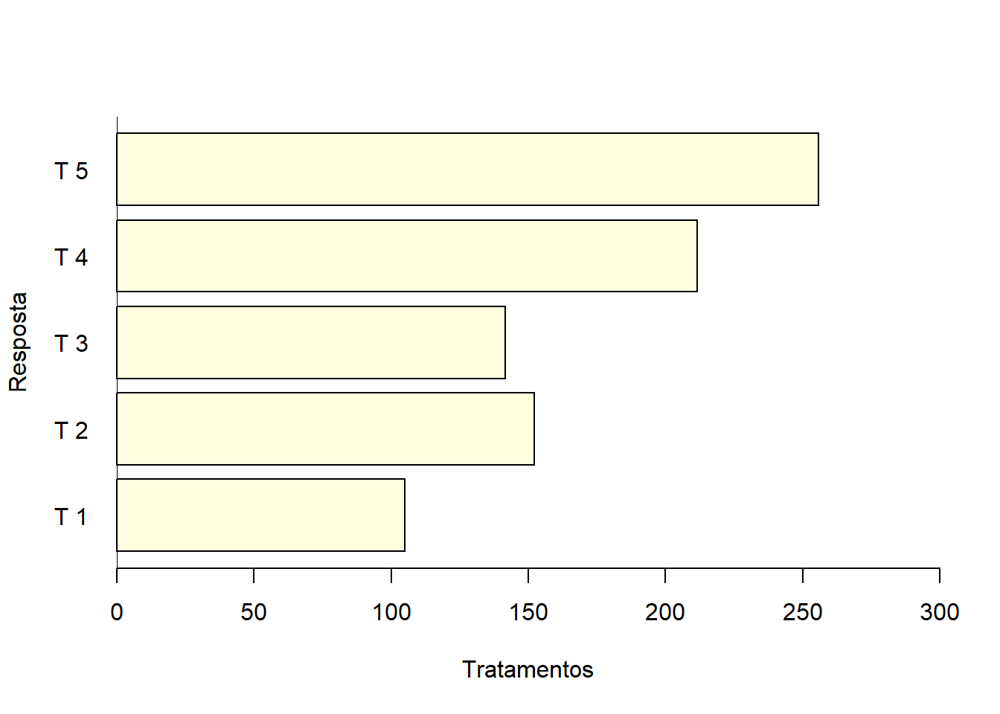

<br>

### Unidade do eixo Y 

(Ex. $Kg\ ha^{-1}$)


```r
bar=barplot(media, 
        las=1,horiz = T,
        col="lightyellow",
        ylab=expression("Resposta"*" "*(kg*" "*ha^-1)),
        xlab="Tratamentos",
        xlim=c(0,300))
abline(v=0)
arrows(media+desvio,bar,media-desvio,bar,length = 0.1,angle=90,code=3)
```

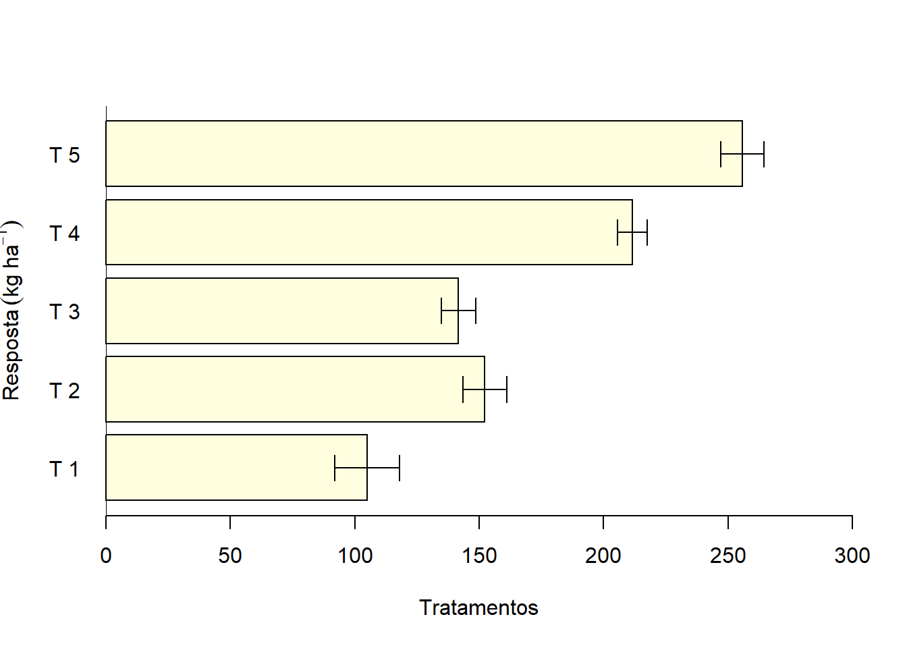

<br>

### Média acima das barras


```r
bar=barplot(media, 
        las=1,horiz = T,
        col="lightyellow",
        ylab=expression("Resposta"*" "*(kg*" "*ha^-1)),
        xlab="Tratamentos",
        xlim=c(0,300))
abline(v=0)
text(media+desvio+20,bar,media)
arrows(media+desvio,bar,media-desvio,bar,length = 0.1,angle=90,code=3)
```


<br>

### Separação de casa decimal


```r
options(OutDec=",")
bar=barplot(media, 
        las=1,horiz = T,
        col="lightyellow",
        ylab=expression("Resposta"*" "*(kg*" "*ha^-1)),
        xlab="Tratamentos",
        xlim=c(0,300))
abline(v=0)
text(media+desvio+20,bar,media)
arrows(media+desvio,bar,media-desvio,bar,length = 0.1,angle=90,code=3)
```

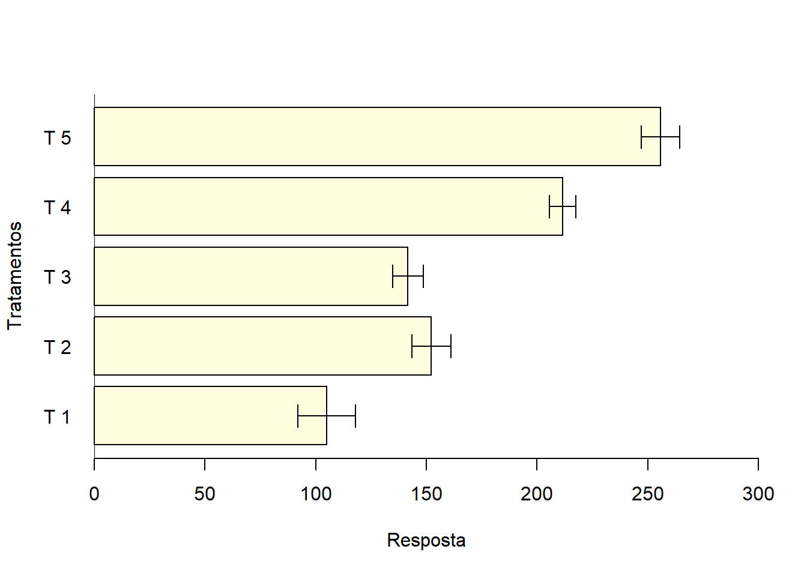

<br>

### Letras do teste de comparação 


```r
tukey=c("d","c","c","b","a")
options(OutDec=",")
bar=barplot(media, 
        las=1,horiz = T,
        col="lightyellow",
        ylab=expression("Resposta"*" "*(kg*" "*ha^-1)),
        xlab="Tratamentos",
        xlim=c(0,300))
abline(v=0)
text(media+desvio+20,bar,paste(round(media,0),tukey))
arrows(media+desvio,bar,media-desvio,bar,length = 0.1,angle=90,code=3)
```


<br><br><br>

****

# Caixas (Boxplot)

****

<br>

O *boxplot* (gráfico de caixa) é um gráfico utilizado para avaliar a distribuição empírica do dados. O *boxplot* é formado pelo primeiro e terceiro quartil e pela mediana. As hastes inferiores e superiores se estendem, respectivamente, do quartil inferior até o menor valor não inferior ao limite inferior e do quartil superior até o maior valor não superior ao limite superior. Os limites são calculados da forma abaixo

**Limite inferior**: $\max\{\min(\text{dados});Q_1-1,5(Q_3-Q_1)\}$.

**Limite superior**: $\min\{\max(\text{dados});Q_3+1,5(Q_3-Q_1)\}$.

Para este caso, os pontos fora destes limites são considerados valores discrepantes (*outliers*). A Figura  a seguir apresenta um exemplo do formato de um *boxplot*.

<center>

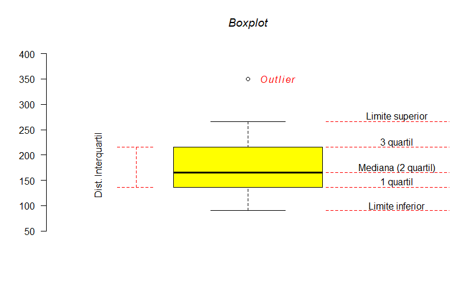

</center>


Existem várias formas de entrada ou leitura de dados no R. Para um conjunto de dados pequeno, pode-se entrar com as informações diretamente no console do programa. Considere um delineamento inteiramente ao acaso com 5 tratamentos e 4 repetições. A entrada dos dados, entre outras, poderia ser da forma:

<br>


```r
tratamentos=rep(c(paste("T", sep='', 1:5)), each=4)
resposta = c(100, 120, 110,  90, 150, 145, 149, 165, 150, 144, 134, 139, 220, 206, 210, 210, 266, 249, 248, 260)
## Médias e Desvioss-padrão (por Tratamento)
(Médias = tapply(resposta, tratamentos, mean))
```

```
##     T1     T2     T3     T4     T5 
## 105,00 152,25 141,75 211,50 255,75
```

```r
(Desvios = tapply(resposta, tratamentos, sd))
```

```
##        T1        T2        T3        T4        T5 
## 12,909944  8,770215  6,849574  5,972158  8,732125
```

<br>


```r
boxplot(resposta ~ tratamentos)
# Ou, pode-se usar o comando ``Boxplot`` do pacote ``car``
require(car)
Boxplot(resposta ~ tratamentos)
```

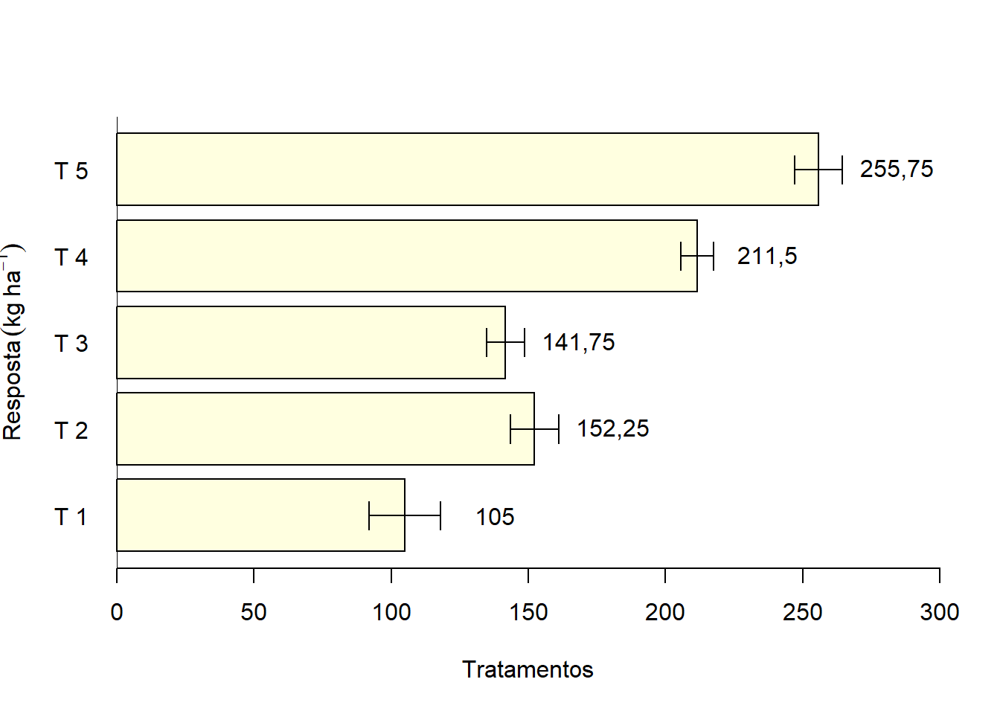

<br>

Uma vantagem do comando ``Boxplot`` é que se houver *outlier*, ele já identifica a pposição do elemento discrepante.

<br>

### Melhorias


```r
boxplot(resposta ~ tratamentos, 
        las=1,
        col="lightyellow",
        xlab="Tratamentos",
        ylab="Resposta",
        ylim=c(0,300))
```

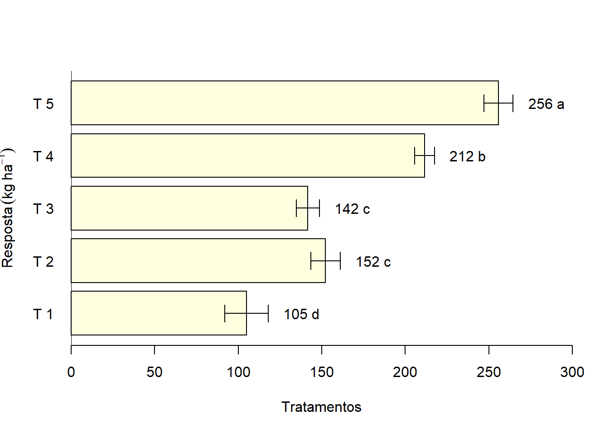

<br>

**Comandos usados**:

* ``las=1``: mostrar a escala do eixo no sentido horizontal;

* ``col="cor"``: mudar a cor das colunas (Ex. "red", "blue", "green" ou ``gray.colors``(quantidade de tonalidades) para escala cinza ou ``rainbow``(quantidade de cores) para escala colorida. Também é possível especificar a cor de cada coluna (``col``=c("red", "green", "yellow", "gray", "blue")));

* ``xlab`` e ``ylab``: nomear os eixos $X$ e $Y$;

* ``xlim`` e ``xlim``: mudar as escalas dos eixox $X$ e $Y$;

<br>

### Plotando médias


```r
boxplot(resposta ~ tratamentos, 
        las=1,
        col="lightyellow",
        xlab="Tratamentos",
        ylab="Resposta",
        ylim=c(50,300))

points(Médias, pch='+', col="red")
```

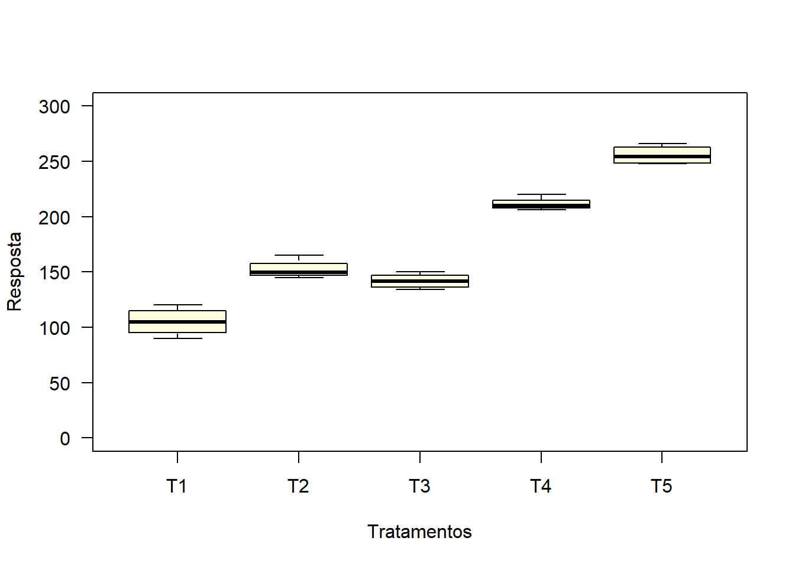

<br>

### Unidade do eixo Y 

Caso a variável resposta seja Produção ($kg/ha$), inclui-se tal informação usando-se o comando ``expression``.


```r
boxplot(resposta ~ tratamentos,
        las=1,
        col="lightyellow",
        xlab="Tratamentos",
        ylab=expression(Produção~~(kg~ha^-1)),
        ylim=c(50,300))
points(Médias, pch='+', col="red")
```

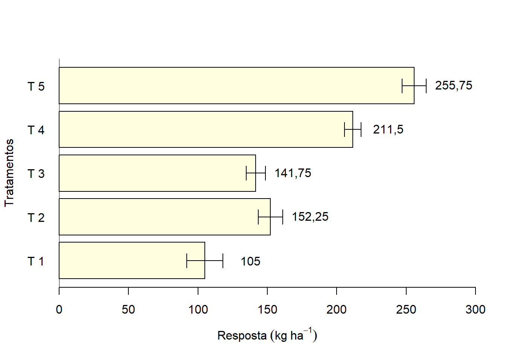

<br>

### Limites superior e inferior


```r
limites = tapply(resposta, tratamentos, boxplot.stats)
superior=c(limites$`T1`$stats[5],
           limites$`T2`$stats[5],
           limites$`T3`$stats[5],
           limites$`T4`$stats[5],
           limites$`T5`$stats[5])
```

<br>

### Média acima das barras


```r
boxplot(resposta ~ tratamentos,
        las=1,
        col="lightyellow",
        xlab="Tratamentos",
        ylab=expression("Produção"~~(kg~ha^-1)),
        ylim=c(50,300))
points(Médias, pch='+', col="red")
text(c(1:5), superior + 10, Médias)
```


<br>

### Separação de casa decimal


```r
options(OutDec=",")
boxplot(resposta ~ tratamentos,
        las=1,
        col="lightyellow",
        xlab="Tratamentos",
        ylab=expression("Produção"~~(kg~ha^-1)),
        ylim=c(50,300))
points(Médias, pch='+', col="red")
text(c(1:5), superior + 20, Médias)
```


<br>

### Letras do teste de comparação


```r
tukey=c("d","c","c","b","a")
options(OutDec=",")
boxplot(resposta ~ tratamentos,
        las=1,
        col="lightyellow",
        xlab="Tratamentos",
        ylab=expression("Produção"~(kg~ha^-1)),
        ylim=c(50,300))
points(Médias, pch='+', col="red")
text(c(1:5), superior + 20, paste(round(Médias, 0), tukey))
```

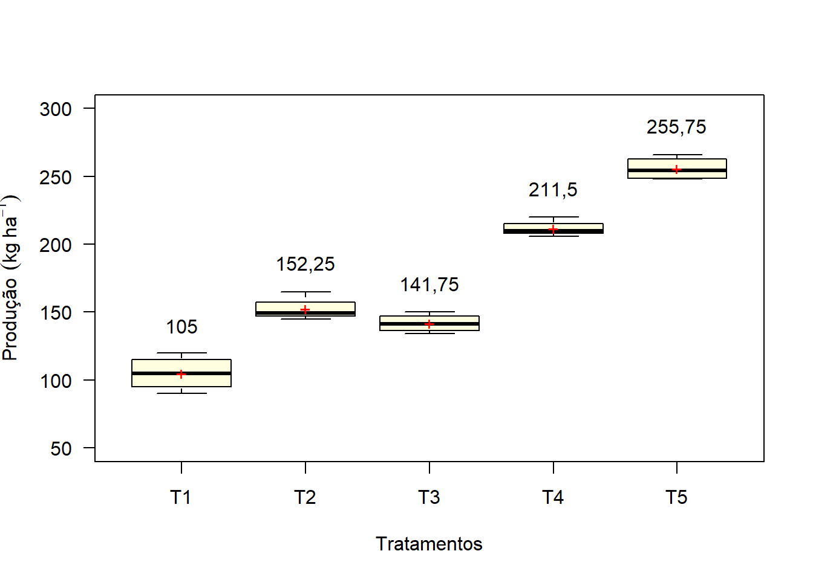

<br><br>

## Pacote ggplot2

Vamos trabalhar com um experimento em DIC com quatro tratamentos e quatro repetições cada.


```r
exp1=c(17,22,13,14,18,19,16,21,9,16,15,8,25,26,23,40)
Trat=rep(c(paste("T",1:4)),e=4)
dados=data.frame(Trat,exp1)
dados$Trat=as.factor(Trat)
```

**Obs.** Para facilitar, vamos realizar a análise direto pelo pacote ExpDes.pt (é necessário instalar o pacote)

<br>

### Análise de variância


```r
ExpDes.pt::dic(Trat,exp1)
```

```
## ------------------------------------------------------------------------
## Quadro da analise de variancia
## ------------------------------------------------------------------------
##            GL     SQ QM     Fc     Pr>Fc
## Tratamento  3 582,75    7,9556 0,0034723
## Residuo    12 293,00                    
## Total      15 875,75                    
## ------------------------------------------------------------------------
## CV = 26,18 %
## 
## ------------------------------------------------------------------------
## Teste de normalidade dos residuos 
## Valor-p:  0,06507919 
## De acordo com o teste de Shapiro-Wilk a 5% de significancia, os residuos podem ser considerados normais.
## ------------------------------------------------------------------------
## 
## ------------------------------------------------------------------------
## Teste de homogeneidade de variancia 
## valor-p:  0,237053 
## De acordo com o teste de bartlett a 5% de significancia, as variancias podem ser consideradas homogeneas.
## ------------------------------------------------------------------------
## 
## Teste de Tukey
## ------------------------------------------------------------------------
## Grupos Tratamentos Medias
## a 	 T 4 	 28,5 
## ab 	 T 2 	 18,5 
##  b 	 T 1 	 16,5 
##  b 	 T 3 	 12 
## ------------------------------------------------------------------------
```

<br>

## Utilizando o *ggplot2*


```r
library(ggplot2)
```

<br>

### Gráfico básico


```r
ggplot(dados, 
       aes(x=Trat,y=exp1))+
  geom_boxplot()
```

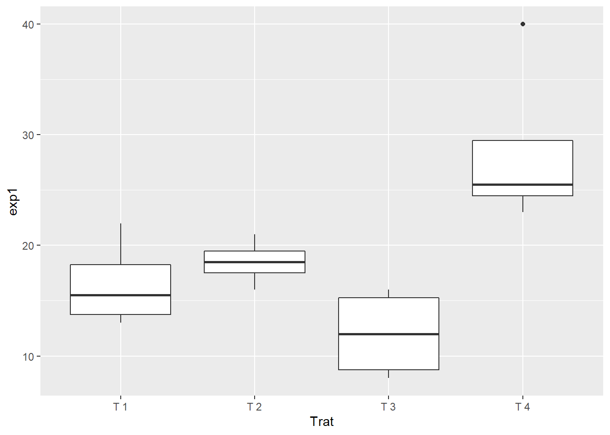

<br>

### Modificando cores


```r
ggplot(dados, 
       aes(x=Trat,y=exp1))+
  geom_boxplot(fill="lightgreen",          # Cor da caixa
               colour="red",               # cor do contorno
               outlier.colour = "blue",    # Cor do contorno do outlier
               outlier.shape = 10,          # Formato do ponto do outlier
               outlier.size = 2)           # Tamanho do outlier
```


<br>

### Cor por tratamento


```r
ggplot(dados, 
       aes(x=Trat,y=exp1))+
  geom_boxplot(aes(fill=dados$Trat))
```

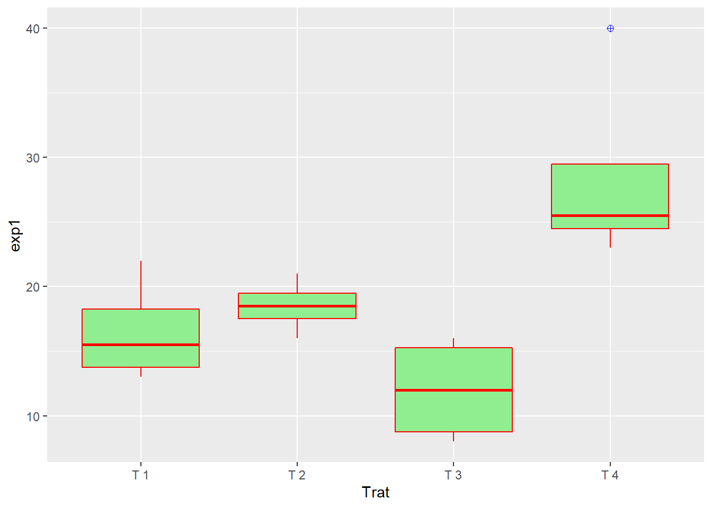

<br>

### Nome dos eixos


```r
ggplot(dados, 
       aes(x=Trat,y=exp1))+
  geom_boxplot(fill="lightgreen",          
               colour="red",               
               outlier.colour = "blue",    
               outlier.shape = 10,          
               outlier.size = 2)+      
  ylab("Resposta")+
  xlab("Tratamentos")
```

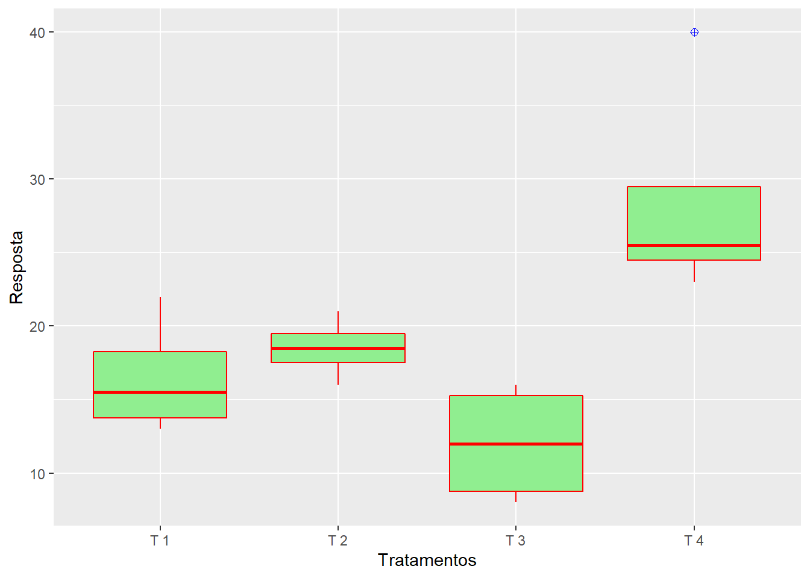

<br>

### linha de grade e cor de fundo


```r
ggplot(dados, 
       aes(x=Trat,y=exp1))+
  geom_boxplot(fill="lightgreen", 
               colour="black",    
               outlier.colour = "blue",
               outlier.shape = 10,     
               outlier.size = 2)+      
  ylab("Resposta")+
  xlab("Tratamentos")+
  theme_bw()+
  theme_classic()
```


<br>

### Letras do teste de Tukey

**Obs.** Neste exemplo vamos adicionar as letras abaixo das caixas e alinhado em y=1


```r
a=data.frame(Trat=levels(as.factor(Trat)),
             exp1=c(1,1,1,1),                # Deve ter o mesmo da variável
                                             # esse 1 é para Y=1
             letra=c("b","ab","b","a"))
ggplot(dados, 
       aes(x=Trat,y=exp1))+
  geom_boxplot(fill="lightgreen", 
               colour="black",    
               outlier.colour = "blue",
               outlier.shape = 10,     
               outlier.size = 2)+      
  ylab("Resposta")+
  xlab("Tratamentos")+
  theme_bw()+
  theme_classic()+
  geom_text(data = a, aes(label = letra))
```

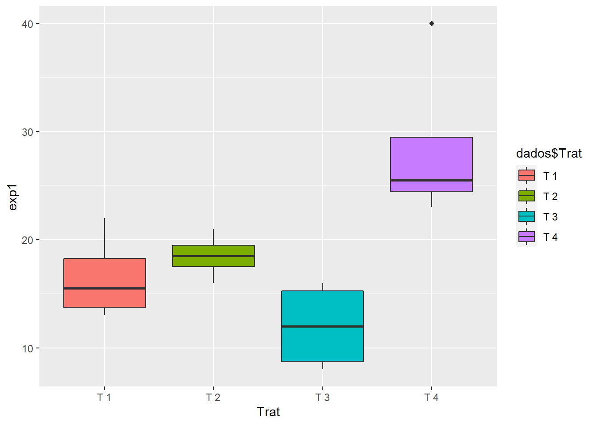

<br>

## *Package* ggpubr


```r
library(ggpubr)
ggboxplot(dados,            # data.frame com os dados e tratamentos
          'Trat',           # Nome do tratamento entre aspas
          'exp1')           # Nome da resposta
```


<br>

### Cor da caixa


```r
ggboxplot(dados,
          'Trat',
          'exp1', 
          fill="red")
```


<br>

### Cor de contorno


```r
ggboxplot(dados,
          'Trat',
          'exp1', 
          fill="red",
          color = "blue")
```


<br>

### Inserindo título


```r
ggboxplot(dados,
          'Trat',
          'exp1', 
          fill="red",
          color = "blue",
          title="(A)")
```

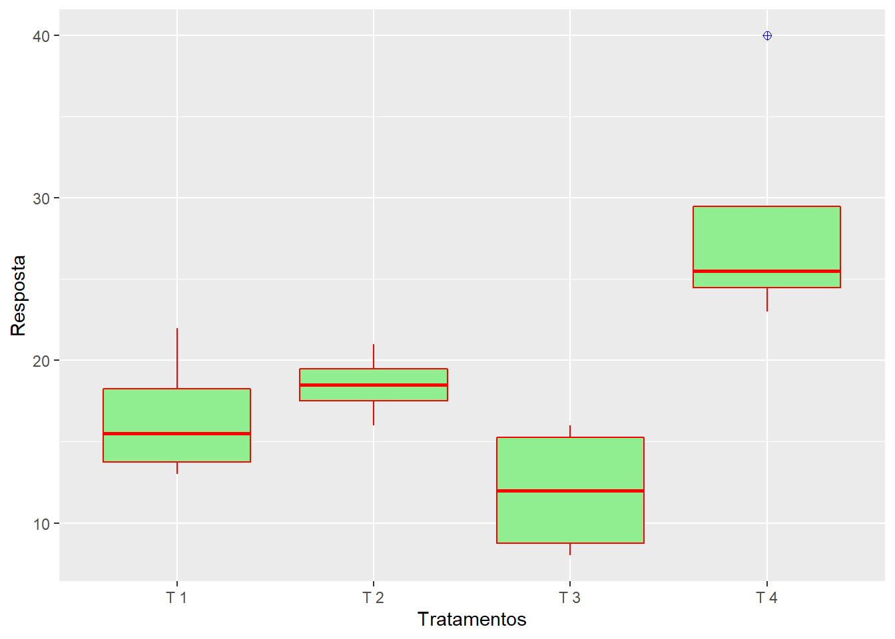

<br>

### Nome dos eixos X e Y


```r
ggboxplot(dados,
          'Trat',
          'exp1', 
          fill="red",
          color = "black",
          title="(A)",
          xlab="Tratamentos",
          ylab="Resposta")
```

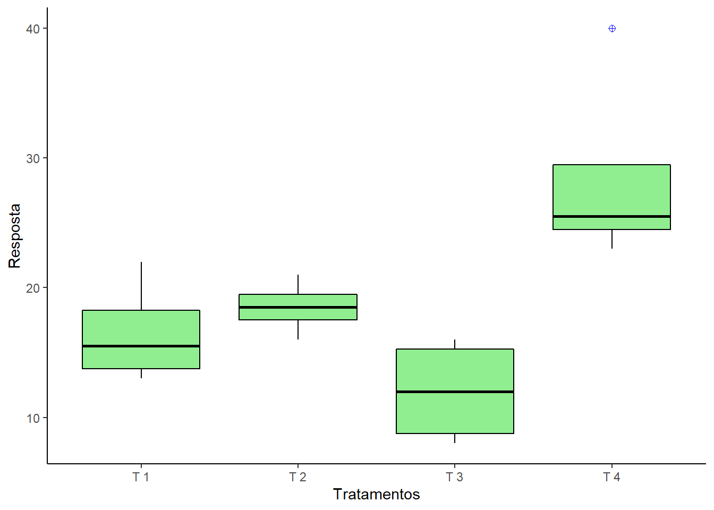

<br>

### Ponto da média


```r
ggboxplot(dados,
          'Trat',
          'exp1', 
          fill="red",
          color = "black",
          title="(A)",
          xlab="Tratamentos",
          ylab="Resposta",
          add="mean")
```


<br>

**Obs.** Podemos usar ao invés de `"mean"`, os seguintes argumentos:

- `mean_se`: Média e erro padrão
- `mean_sd`: Média e desvio-padrão
- `mean_ci`: Média e intervalo de confiança
- `median`: Mediana
- `point`: pontos referente às observações

Para mais informações consultar atráves de: `desc_stat`

<br>

### Letras do teste de Tukey


```r
a=data.frame(Trat=levels(as.factor(Trat)),
             exp1=c(1,1,1,1),                # Deve ter o mesmo da variável
                                             # esse 1 é para Y=1
             letra=c("b","ab","b","a"))
ggboxplot(dados,
          'Trat',
          'exp1', 
          fill="red",
          color = "black",
          title="(A)",
          xlab="Tratamentos",
          ylab="Resposta",
          add="mean",
          ylim=c(0,40))+
  geom_text(data = a, aes(label = letra))
```


<br><br><br>

****

# Regressão

****

O gráfico de regressão pode ser construído utilizando um gráfico de dispersão. Assim, uma análise gráfica preliminar é realizada construindo-se o gráfico de dispersão entre as variáveis em questão. Este gráfico é importante em qualquer análise de regressão já que por meio dele é possível ter uma noção do tipo de relação existente entre as variáveis (relação linear, quadrática). Esta relação na maioria das vezes não é perfeita, ou seja, os pontos não estão dispostos perfeitamente sobre a função que relaciona as duas variáveis mas deseja-se que estes pontos estejam próximos. A curva da regressão é construída sobre o gráfico de dispersão mediante às respectivas análises a serem consideradas para definir o melhor modelo.

<br>

### Conjunto de dados


```r
tratamentos=rep(c(0,2,4,8,16,32,64,128,256),e=4)
resposta=c(0,1,2,4,8,7,9,10,15,17,18,20,25,26,24,28,36,39,38,40,60,68,65,70,100,110,104,107,150,155,156,159,120,130,126,124)
## Média e Desvio-padrão (Por Tratamento)
Dose=c(0,2,4,8,16,32,64,128,256)
media=tapply(resposta,tratamentos, mean)
desvio=tapply(resposta,tratamentos,sd)
```

<br>

### Gráfico básico


```r
plot(media~Dose)
```


### Melhorias


```r
plot(media~Dose, 
        las=1,
        ylab="Resposta",
        xlab="Dose")
```


<br>

### Barras de desvio-padrão


```r
reg=plot(media~Dose, 
        las=1,
        ylab="Resposta",
        xlab="Dose")
arrows(Dose,media+desvio,Dose,media-desvio,length = 0.05,angle=90,code=3)
```


Adicionando barras de desvio-padrão de largura 0.05 (length=0.05), com angulo de 90 graus e tipo de flecha 3 (T ou T invertido)

<br>

### Unidade do eixo 

Y (Ex. $Kg\ ha^{-1}$) e X(Ex.$Kg\ ha^{-1}\ ano^{-1}$)


```r
reg=plot(media~Dose, 
        las=1,
        ylab=expression("Resposta"~~(kg~ha^-1)),
        xlab=expression("Dose"~(kg~ha^-1~ano^-1)))
arrows(Dose,media+desvio,Dose,media-desvio,length = 0.02,angle=90,code=3)
```


A função expression também pode ser usada para textos em gráficos (Função "text()" - veremos posteriormente).

<br>

### Separação de casa decimal


```r
options(OutDec=",")
reg=plot(media~Dose, 
        las=1,
        ylab=expression("Resposta"~~(kg~ha^-1)),
        xlab=expression("Dose"~~(kg~ha^-1~ano^-1)))
arrows(Dose,media+desvio,Dose,media-desvio,length = 0.02,angle=90,code=3)
```


A função "options(OutDec=",")" converte a casa decimal de todas as saídas posteriores ao comando para vírgula, entretanto a função não altera para gráficos do pacote ggplot2.

<br>

### Curva de Tendência


```r
modelo=lm(media~Dose+I(Dose^2))
summary(modelo)
```

```
## 
## Call:
## lm(formula = media ~ Dose + I(Dose^2))
## 
## Residuals:
##     Min      1Q  Median      3Q     Max 
## -6,0101 -2,3298  0,5233  2,3045  3,4953 
## 
## Coefficients:
##               Estimate Std. Error t value Pr(>|t|)    
## (Intercept)  7,7601301  1,7653406   4,396  0,00459 ** 
## Dose         1,8811023  0,0566083  33,230 4,94e-08 ***
## I(Dose^2)   -0,0055671  0,0002241 -24,847 2,80e-07 ***
## ---
## Signif. codes:  0 '***' 0,001 '**' 0,01 '*' 0,05 '.' 0,1 ' ' 1
## 
## Residual standard error: 3,709 on 6 degrees of freedom
## Multiple R-squared:  0,9967,	Adjusted R-squared:  0,9956 
## F-statistic: 899,4 on 2 and 6 DF,  p-value: 3,674e-08
```

```r
plot(media~Dose, 
     las=1,
     ylim=c(0,200),
     col="red",
     pch=16,
     ylab=expression("Resposta"~~(kg~ha^-1)),
     xlab=expression("Dose"~~(kg~ha^-1~ano^-1)))
arrows(Dose,media+desvio,Dose,media-desvio,length = 0.02,angle=90,code=3)
curve(modelo$coefficients[1]+modelo$coefficients[2]*x+modelo$coefficients[3]*x^2, add=T,col="blue")
```


<br>

### Pontos de máximo/mínimo


```r
## Para encontrar o ponto de máximo ou mínimo em equação quadrática, fazer derivada primeira de Y=0

(x=-modelo$coefficients[2]/(2*modelo$coefficients[3]))
```

```
##     Dose 
## 168,9481
```

```r
(y=modelo$coefficients[1]+modelo$coefficients[2]*x+modelo$coefficients[3]*x^2)
```

```
## (Intercept) 
##    166,6644
```


```r
plot(media~Dose, 
     las=1,
     ylim=c(0,200),
     col="red",
     pch=16,
     ylab=expression("Resposta"~~(kg~ha^-1)),
     xlab=expression("Dose"~~(kg~ha^-1~ano^-1)))
arrows(Dose,media+desvio,Dose,media-desvio,length = 0.02,angle=90,code=3)
curve(modelo$coefficients[1]+modelo$coefficients[2]*x+modelo$coefficients[3]*x^2, add=T,col="blue")
abline(h=y,col="red",lty=2)
abline(v=x,col="red",lty=2)
points(x,y,pch=8,col="black")
```

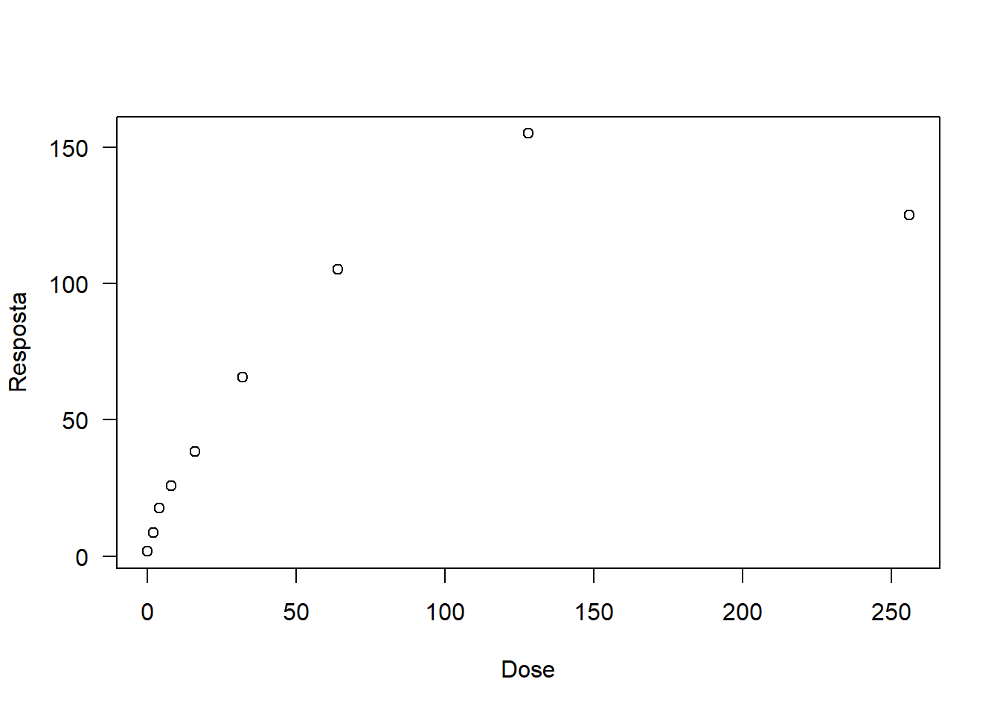

<br>

### Equação e R^2


```r
plot(media~Dose, 
     las=1,
     ylim=c(0,200),
     col="red",
     pch=16,
     ylab=expression("Resposta"~~(kg~ha^-1)),
     xlab=expression("Dose"~~(kg~ha^-1~ano^-1)))
arrows(Dose,media+desvio,Dose,media-desvio,length = 0.02,angle=90,code=3)
curve(modelo$coefficients[1]+modelo$coefficients[2]*x+modelo$coefficients[3]*x^2, add=T,col="blue")
abline(h=y,col="red",lty=2)
abline(v=x,col="red",lty=2)
points(x,y,pch=8,col="black")
text(100,50,expression(Y==7.76013+1.881102*x-0.005567102 *x^2),cex=0.8)
text(100,40,expression(R^2==1.00),cex=0.8)
```

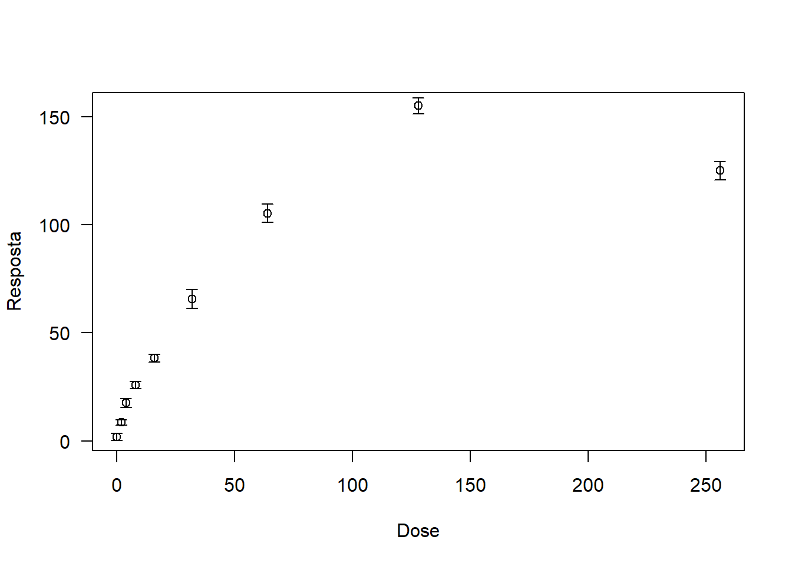

<br><br>

****

## Usando o pacote ggplot2

****

<br>

### Gráfico básico


```r
library(ggplot2)
dados=data.frame(Dose,media)
ggplot(dados, aes(x=Dose, y=media)) + geom_point()
```

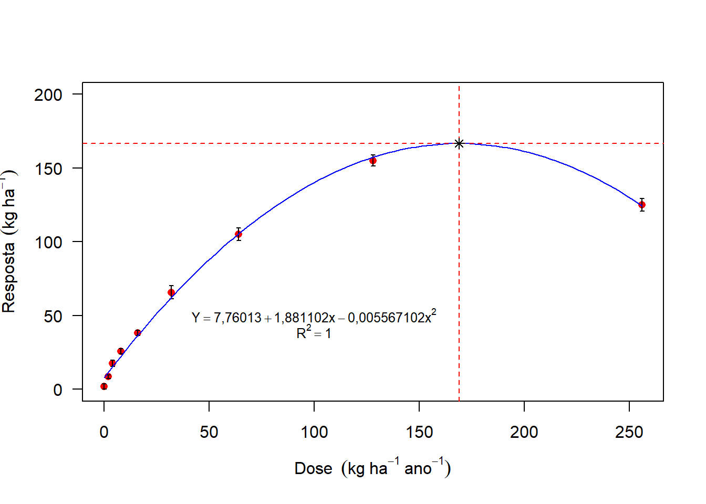

<br>

### Editando gráfico


```r
(grafico=ggplot(dados, 
                aes(x=Dose, y=media)) + 
   geom_point(colour="red", size=3, shape=1)+
   geom_smooth(method="lm", se = F, formula = y~poly(x,2), show.legend = T) +
   labs(title = "Exemplo de gráfico de regressão no ggplot2",
       y = expression(Produtividade~~(Kg~ha^-1)), x = "Dose",
       caption = "Fonte: O autor"))
```

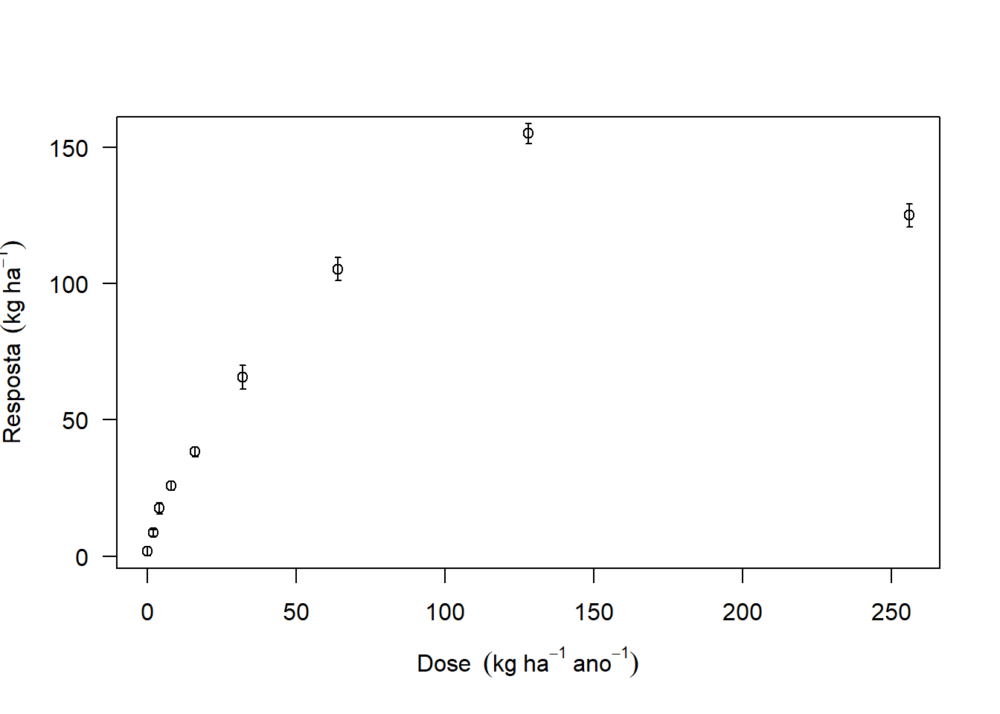

geom_point(colour="red", size=3, shape=1): gráfico de dispersão, com pontos de cor vermelha, de tamanho 3 e formato 2 (Círculo sem preenchimento interno)

geom_smooth(method="lm", se = F, formula = y~poly(x,2)): Comando para plotar curva de tendência para regressão polinomial de grau 2 (Quadrático)

labs = nomear os eixos e títulos dos gráficos

<br>

### Plotando equação


```r
texto <- sprintf('y = %.2f + %.2fx %.2fx², r² = %.2f',modelo$coefficients[1],modelo$coefficients[2],modelo$coefficients[3],summary(modelo)$r.squared)
```

<br>

### Plotando o texto 


```r
(grafico=grafico+
   geom_text(aes(x=x, y=y, label=texto), hjust=1, vjust=16))
```


<br>

### Removendo cor de fundo


```r
(grafico=grafico+
   theme_bw())
```

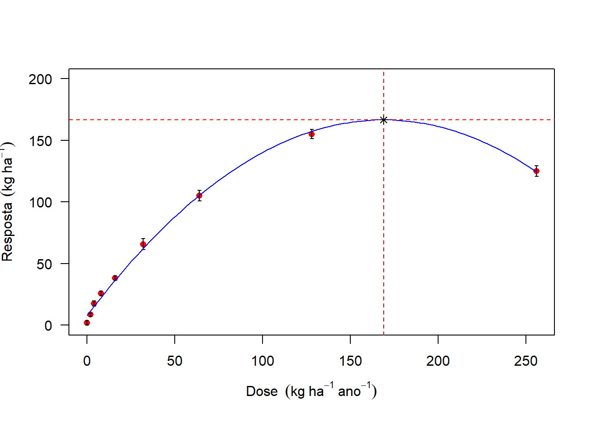

<br>

### Removendo grade


```r
(grafico=grafico+
   theme_classic())
```


```r
(grafico=grafico+
   theme(axis.title = element_text(size = 12),
          axis.text = element_text(size = 12)))
```

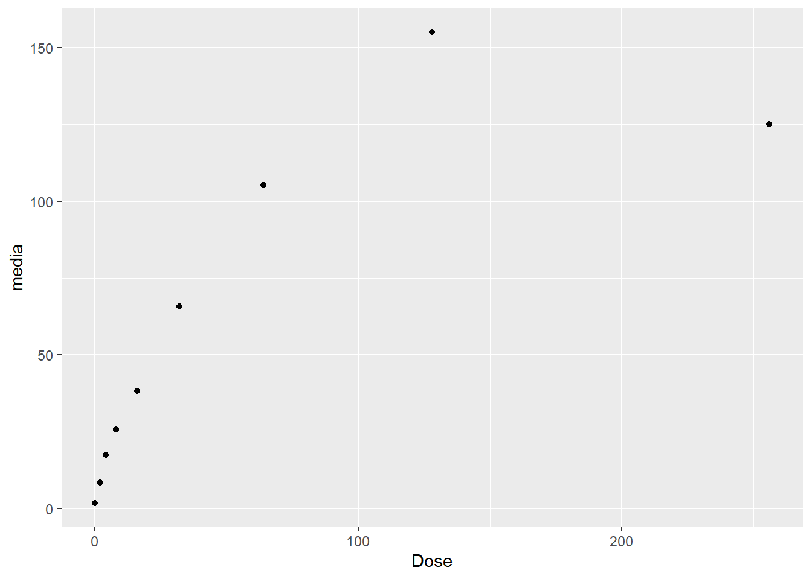

<br>

### Ponto de máximo/mínimo


```r
(grafico=grafico+
   geom_vline(xintercept = x, colour="red", linetype="dotted", size=1.2)+
   geom_hline(yintercept =y,colour='red', linetype='dotted', size=1.3))
```


<br>

### Tipos de linhas


```r
d=data.frame(lt=c("blank", "solid", "dashed", "dotted", "dotdash", "longdash", "twodash", "1F", "F1", "4C88C488", "12345678"))
ggplot()+
  scale_x_continuous(name="",limits=c(0,1))+
  scale_y_discrete(name="linetype")+
  theme_bw()+
  theme_classic()+
  scale_linetype_identity()+
  geom_segment(data=d, mapping=aes(x=0, xend=1, y=d$lt, yend=d$lt, linetype=d$lt))
```


<br><br><br>

****

## Duas curvas

****

<br>

### Conjunto de dados

**Variável**:

- **resposta**: Resposta do tratamento A
- **resposta1**: Resposta do tratamento B

**Doses**: 0,2,4,8,16,32,64,128,256


```r
dose=rep(c(0,2,4,8,16,32,64,128,256),e=4)
resposta=c(0,1,2,4,8,7,9,10,15,17,18,20,25,26,24,28,36,39,38,40,60,68,65,70,100,110,104,107,150,155,156,159,120,130,126,124)
resposta1=c(20,21,22,24,28,27,29,26,35,37,38,40,45,46,44,48,56,59,58,60,80,88,85,90,120,130,124,127,160,165,166,169,140,150,146,144)
Dose=c(0,2,4,8,16,32,64,128,256)
```

<br>

### Média e Desvio-padrão


```r
media=tapply(resposta,dose, mean)
media1=tapply(resposta1,dose, mean)
desvio=tapply(resposta,dose,sd)
desvio1=tapply(resposta,dose,sd)
```

<br>

### Tratamento A


```r
modelo=lm(media~Dose+I(Dose^2))
summary(modelo)
```

```
## 
## Call:
## lm(formula = media ~ Dose + I(Dose^2))
## 
## Residuals:
##     Min      1Q  Median      3Q     Max 
## -6,0101 -2,3298  0,5233  2,3045  3,4953 
## 
## Coefficients:
##               Estimate Std. Error t value Pr(>|t|)    
## (Intercept)  7,7601301  1,7653406   4,396  0,00459 ** 
## Dose         1,8811023  0,0566083  33,230 4,94e-08 ***
## I(Dose^2)   -0,0055671  0,0002241 -24,847 2,80e-07 ***
## ---
## Signif. codes:  0 '***' 0,001 '**' 0,01 '*' 0,05 '.' 0,1 ' ' 1
## 
## Residual standard error: 3,709 on 6 degrees of freedom
## Multiple R-squared:  0,9967,	Adjusted R-squared:  0,9956 
## F-statistic: 899,4 on 2 and 6 DF,  p-value: 3,674e-08
```

```r
plot(media~Dose, 
     main="TRATAMENTO A",
     ylim=c(0,200),
     col="red",
     ylab=expression(Resposta~(kg~ha^-1)),
     xlab=expression(Dose~(kg~ha^-1~ano^-1)))
curve(coef(modelo)[1]+coef(modelo)[2]*x+coef(modelo)[3]*x^2, add=T,col="red")
legend("topleft",expression(Y==7.76013+1.88110*x-0.00557 *x^2, R^2==1.00), bty="n")
```

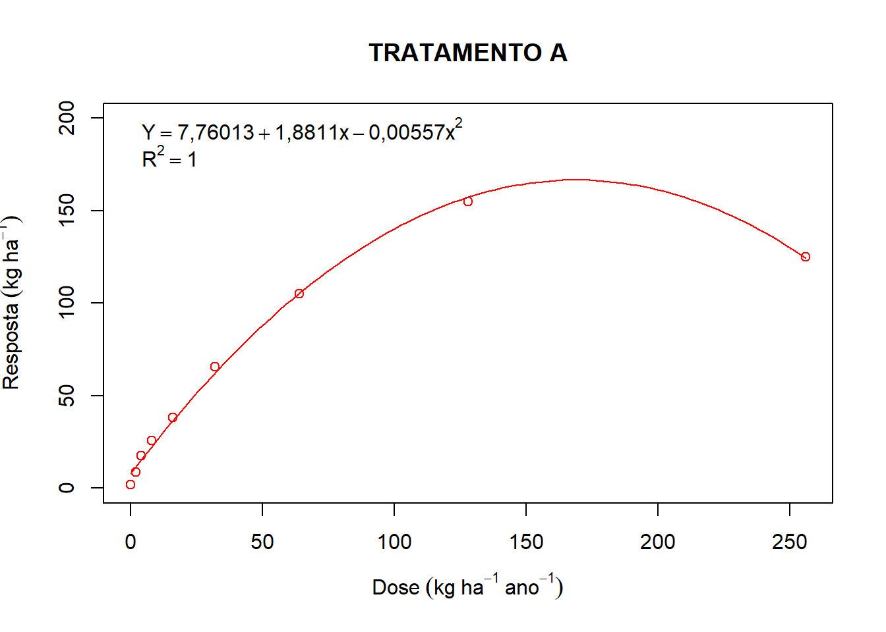

<br>

### Tratamento B


```r
modelo1=lm(media1~Dose+I(Dose^2))
summary(modelo1)
```

```
## 
## Call:
## lm(formula = media1 ~ Dose + I(Dose^2))
## 
## Residuals:
##    Min     1Q Median     3Q    Max 
## -6,959 -4,745  1,761  3,147  5,451 
## 
## Coefficients:
##               Estimate Std. Error t value Pr(>|t|)    
## (Intercept) 28,7090755  2,5811396   11,12 3,15e-05 ***
## Dose         1,7782967  0,0827680   21,48 6,63e-07 ***
## I(Dose^2)   -0,0051907  0,0003276  -15,85 4,01e-06 ***
## ---
## Signif. codes:  0 '***' 0,001 '**' 0,01 '*' 0,05 '.' 0,1 ' ' 1
## 
## Residual standard error: 5,423 on 6 degrees of freedom
## Multiple R-squared:  0,9924,	Adjusted R-squared:  0,9898 
## F-statistic: 390,2 on 2 and 6 DF,  p-value: 4,442e-07
```

```r
plot(media1~Dose, 
     main="TRATAMENTO B",
     ylim=c(0,200),
     col="blue",
     ylab=expression(Resposta~(kg~ha^-1)),
     xlab=expression(Dose~(kg~ha^-1~ano^-1)))
curve(coef(modelo1)[1]+coef(modelo1)[2]*x+coef(modelo1)[3]*x^2, add=T,col="blue")
legend("topleft",expression(Y==28.70908+1.77830*x-0.00520*x^2, R^2==0.99), bty="n")
```


<br>

### Juntando os Gráficos

### Gráfico de dispersão


```r
plot(media~Dose, 
     ylim=c(0,250),
     col="red",
     ylab=expression(Resposta~(kg~ha^-1)),
     xlab=expression(Dose~(kg~ha^-1~ano^-1)))
curve(coef(modelo)[1]+coef(modelo)[2]*x+coef(modelo)[3]*x^2, add=T,col="red")
points(media1~Dose, col="blue")
curve(coef(modelo1)[1]+coef(modelo1)[2]*x+coef(modelo1)[3]*x^2, add=T,col="blue")
```

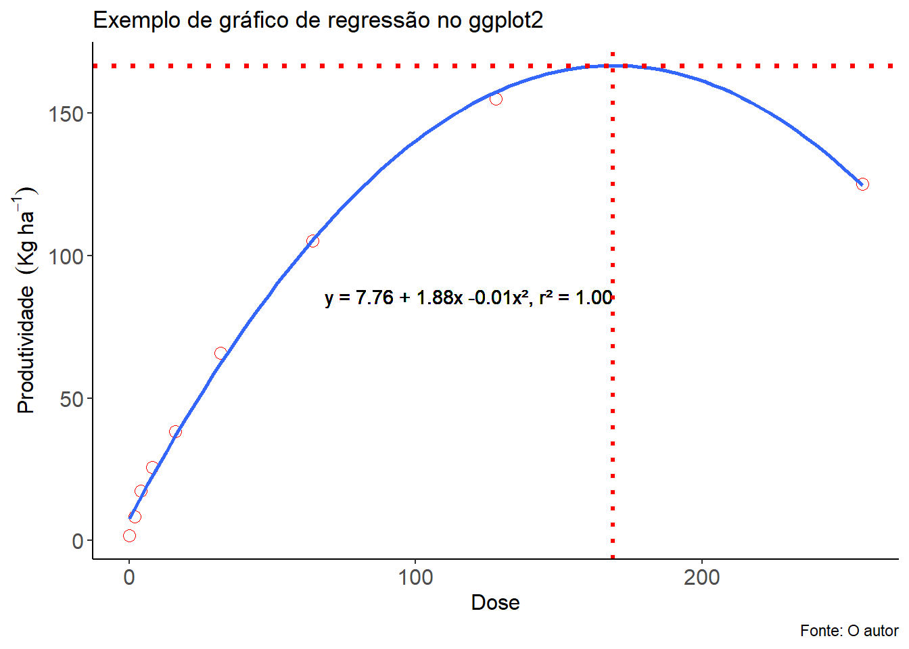


```r
plot(media~Dose, 
     ylim=c(0,250),
     col="red",
     ylab=expression(Resposta~(kg~ha^-1)),
     xlab=expression(Dose~(kg~ha^-1~ano^-1)))
curve(coef(modelo)[1]+coef(modelo)[2]*x+coef(modelo)[3]*x^2, add=T,col="red")
points(media1~Dose, col="blue")
curve(coef(modelo1)[1]+coef(modelo1)[2]*x+coef(modelo1)[3]*x^2, add=T,col="blue")
```

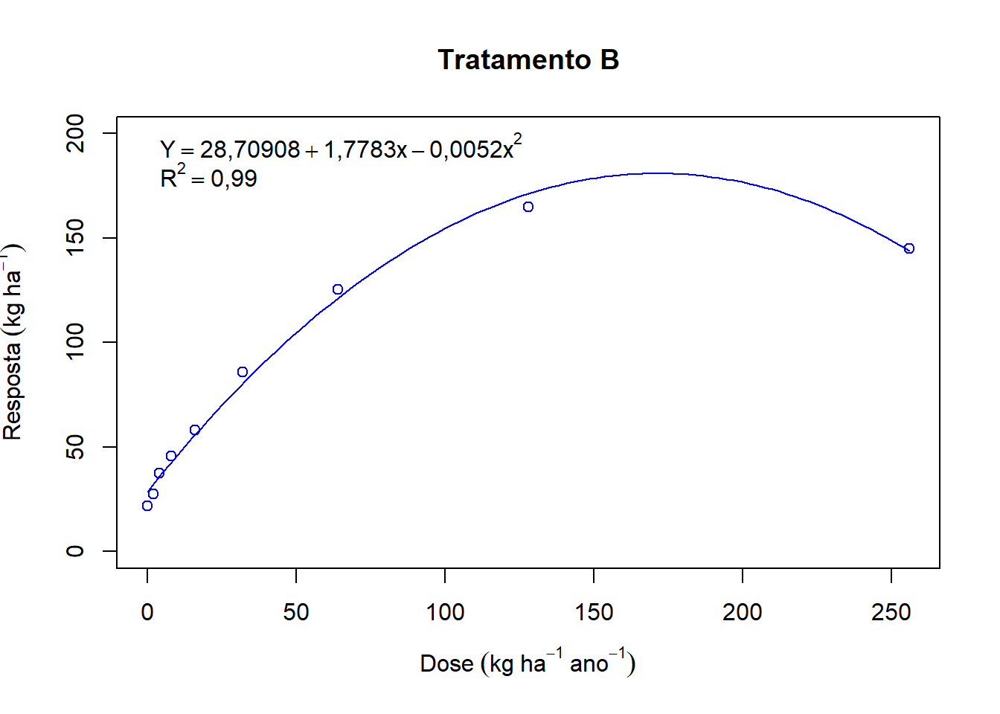

<br>

### Inserindo legenda


```r
plot(media~Dose, 
    ylim=c(0,250),
    col="red",
    ylab=expression(Resposta~(kg~ha^-1)),
    xlab=expression(Dose~(kg~ha^-1~ano^-1)))
points(media1~Dose,col="blue")
legend("topleft", 
       col=c("red","blue"), 
       bty="n", pch=1,
       c(expression(Y[A]==7.76013+1.88110*x-0.00557*x^2~~R^2*"=1,00"),
         expression(Y[B]==28.70908+1.77830*x-0.00519*x^2~~R^2*"=0,99")))
curve(coef(modelo)[1]+coef(modelo)[2]*x+coef(modelo)[3]*x^2, add=T,col="red")
curve(coef(modelo1)[1]+coef(modelo1)[2]*x+coef(modelo1)[3]*x^2, add=T,col="blue")
```


<br><br><br>

****

# Histograma

****

Histograma é uma representação gráfica (um gráfico de barras verticais ou barras horizontais) da distribuição de frequências de um conjunto de dados quantitativos contínuos. O histograma pode ser um gráfico por valores absolutos ou frequência relativa ou densidade. No caso de densidade, a frequência relativa do intervalo $i$, ($fr_i$), é representada pela área de um retângulo que é colocado acima do ponto médio da classe  i. Consequentemente, a área total do histograma (igual a soma das áreas de todos os retângulos) será igual a 1. Assim, ao construir o histograma, cada retângulo deverá ter área proporcional à frequência relativa (ou à frequência absoluta, o que é indiferente) correspondente. No caso em que os intervalos são de tamanhos (amplitudes) iguais, as alturas dos retângulos serão iguais às frequências relativas (ou iguais às frequências absolutas) dos intervalos correspondentes.

<br>

### Conjunto de dados


```r
tratamentos=rep(c(paste("T",1:5)),e=8)
resposta=c(100,170,160,90,150,145,179,165,180,144,184,139,220,206,187,210,166,235,220,190,100,120,110,190,140,145,149,165,150,144,134,139,188,206,190,140,166,224,148,160)
data=data.frame(tratamentos, resposta)
```

### Gráfico básico


```r
hist(resposta)
```


<br>

### Melhorias


```r
hist(resposta, 
        las=1,
        col="lightyellow",
        ylab="Frequência",
        xlab="Resposta",
        ylim=c(0,10),
        main="Histograma")
abline(h=0)
```


**Comandos**:

las=1: deixar escala do eixo Y na vertical

col="cor": mudar cor das barras (Ex. "red","blue","green" ou gray.colors(quantidade de tonalidades) para escala cinza ou rainbow(quantidade de cores) para escala colorida. Também é possível específicar a cor de cada barra (col=c("red","green","yellow","gray","blue"))).

xlab e ylab: nomear eixo X e Y

xlim e ylim: escala do eixo X e Y

main: Título

abline(h=0): linha na horizontal em Y=0 (No caso de vertical, abline(v=0)). É possível alterar a cor pela função "col="cor"" e o tracejado pelo "lty=número" (Ver o Help do comando)

<br>

### Plotando curva normal


```r
histograma=hist(resposta, 
        las=1,
        col="lightyellow",
        ylab="Frequência",
        xlab="Resposta",
        ylim=c(0,10),
        main="Histograma")
abline(h=0)

## Criando sequência de dados quantitativos discretos entre o mínimo e o máximo da resposta
xfit<-seq(min(resposta),max(resposta))

## dnorm (Função para encontrar os possíveis valores para Y e suas densidade de probabilidade)
yfit<-dnorm(xfit,mean=mean(resposta),sd=sd(resposta))

## diff é o comando para diferença e length para comprimento
yfit <- yfit*diff(histograma$mids[1:2])*length(resposta)

## Plotando linha da curva normal
lines(xfit, yfit, col="blue", lwd=2)
```

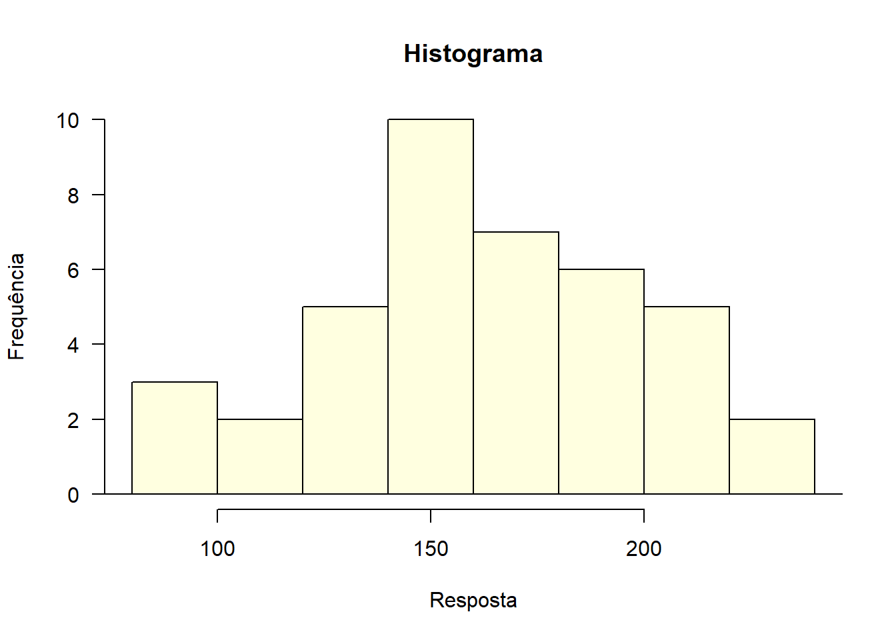

<br>

****

## Pacote ggplot2

****

<br>

instalar pacote ggplot2:

``install.packages("ggplot2")``


```r
# Carregar pacote
library(ggplot2)

# Obs. Não esquecer de criar uma data.frame (Ex. chamei de data no início do material)

# Criar histograma
mean=mean(resposta);sd= sd(resposta);n=length(resposta); largura=20
ggplot(data, aes(data$resposta))+
  geom_histogram(binwidth = 20, col="red", fill="green")+
  labs(title="Histograma")+
  labs(x="Resposta", y="Frequência")+
stat_function(fun = function(x) dnorm(x, mean = mean, sd = sd) * n * largura,
    color = "red", size = 1)
```

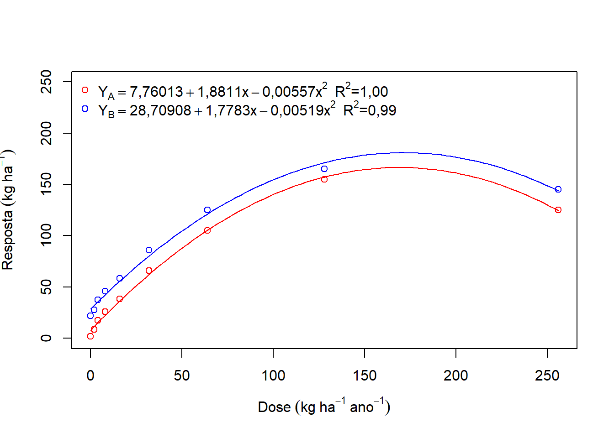

**binwidth** = largura de caixa

**col**= cor do contorno das caixas

**fill**= cor do interior das caixas

**Comando para plotar a curva normal:**

stat_function(fun = function(x) dnorm(x, mean = mean, sd = sd) \* n \* lagura,color = "red", size = 1)

<br><br>

****

## Distribuição normal padrão (Z)

****

### Simulando dados


```r
x=seq(-3,3,length=400)
y=dnorm(x,0,1)
```

<br>

### gráfico simples


```r
plot(x,
     y,
     type="l",
     xlab="",
     ylim=c(-0.1,0.5),
     ylab="")
```

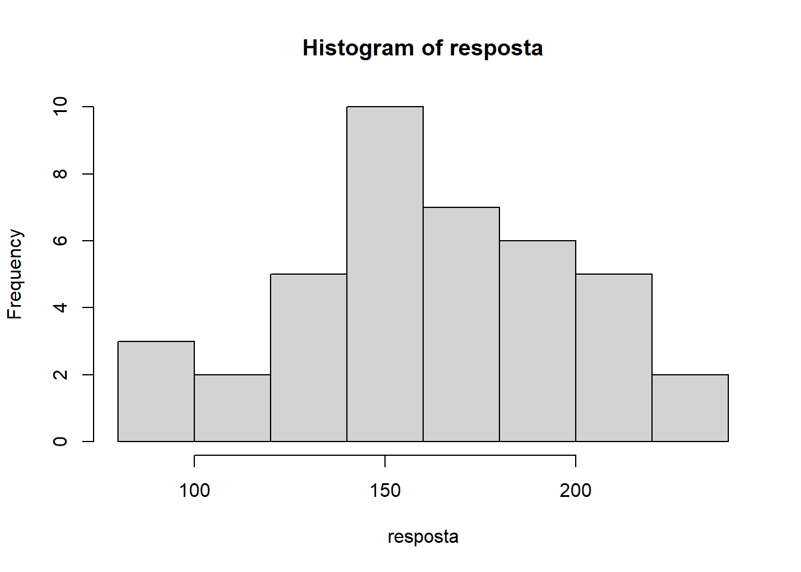

<br>

### Removendo marca da escala


```r
plot(x,y,type="l",axes=F,xlab="",ylim=c(-0.1,0.5),
     ylab="")
```

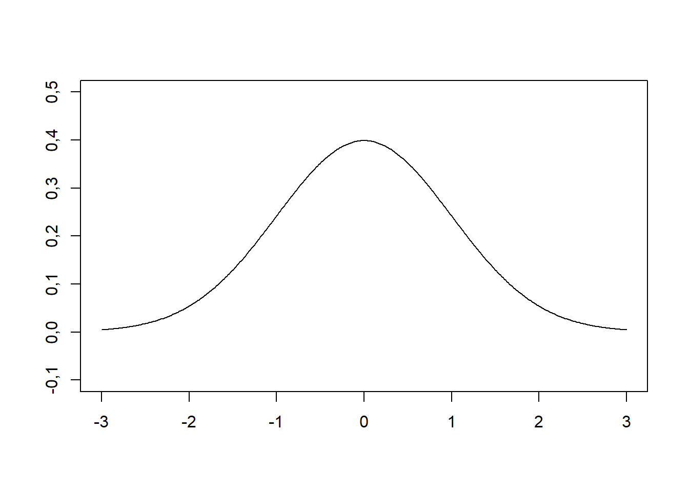

<br>

### Preenchimento tracejado


```r
plot(x,y,type="l",axes=F,xlab="",ylim=c(-0.1,0.5),
     ylab="",col="white")
polygon(c(-3,x,3),c(0,y,0),density = 30)
```

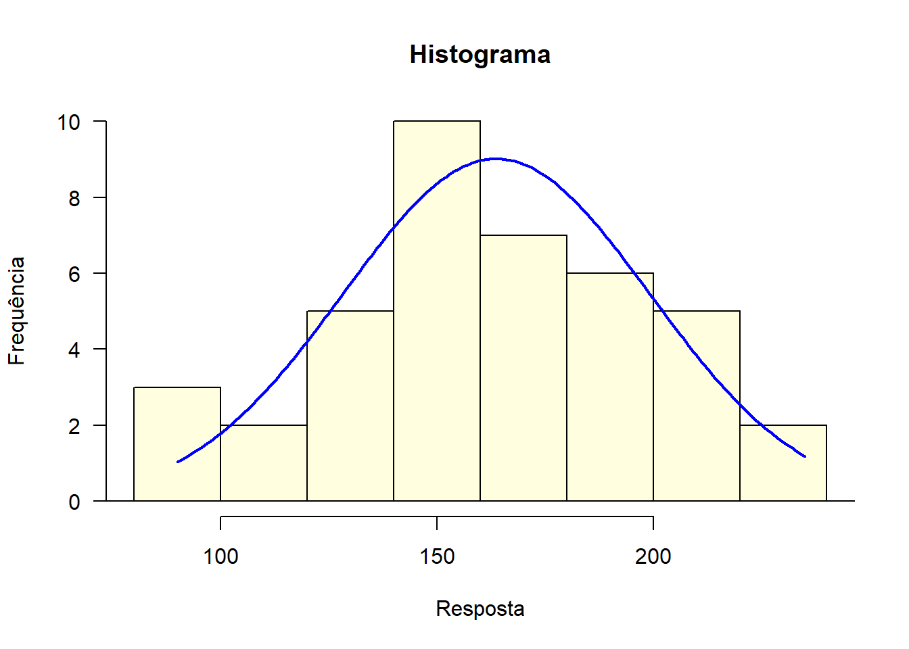

<br>

### Valor crítico (90%)


```r
plot(x,y,type="l",axes=F,xlab="",ylim=c(-0.1,0.5),
     ylab="",col="white")
polygon(c(-3,x,3),c(0,y,0),density = 30)
x1=seq(-1.645,1.645,length=100) # 90
y1=dnorm(x1)
polygon(c(-1.645,x1,1.645),c(0,y1,0),col="white")
abline(h=0);
lines(x=c(0,0),y=c(0,max(y)),lty=2)
```

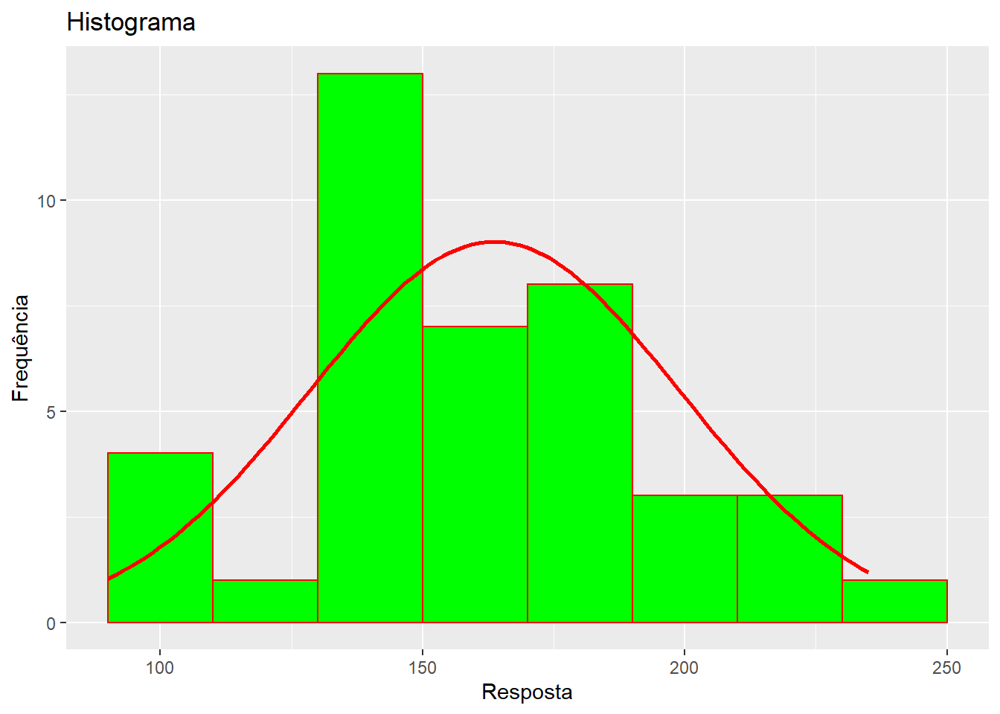

<br>

### Valor crítico (95%)


```r
plot(x,y,type="l",axes=F,xlab="",ylim=c(-0.1,0.5),
     ylab="",col="white")
polygon(c(-3,x,3),c(0,y,0),density = 30)
x1=seq(-1.96,1.96,length=100) # 95%
y1=dnorm(x1)
polygon(c(-1.96,x1,1.96),c(0,y1,0),col="white")
abline(h=0);
lines(x=c(0,0),y=c(0,max(y)),lty=2)
```

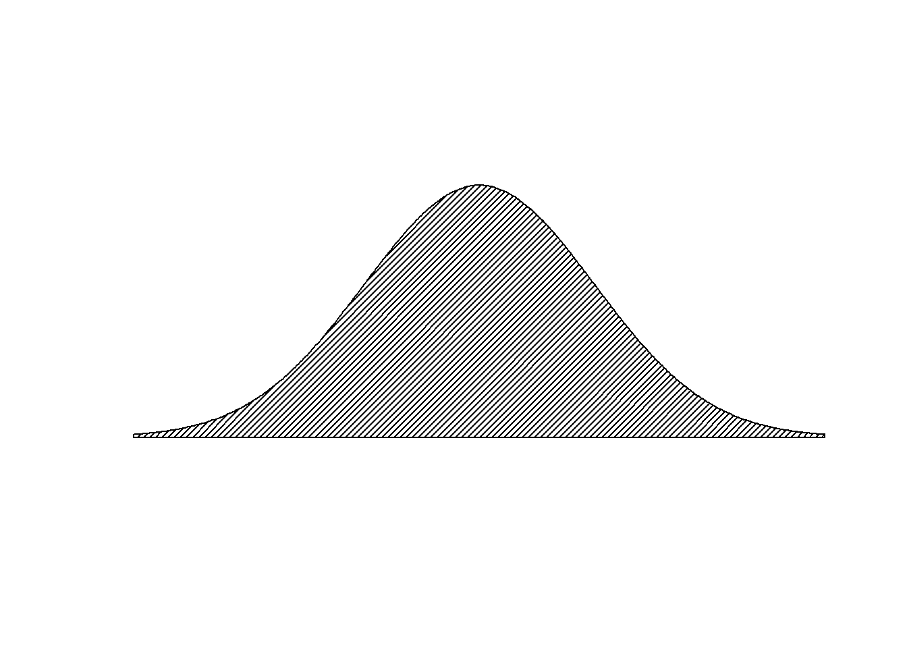

<br>

### Valor crítico (99%)


```r
plot(x,y,type="l",axes=F,xlab="",ylim=c(-0.1,0.5),
     ylab="",col="white")
polygon(c(-3,x,3),c(0,y,0),density = 30)
x1=seq(-2.575,2.575,length=100) # 99
y1=dnorm(x1)
polygon(c(-2.575,x1,2.575),c(0,y1,0),col="white")
abline(h=0);
lines(x=c(0,0),y=c(0,max(y)),lty=2)
```


<br>

### Adicionando legendas


```r
plot(x,y,type="l",axes=F,xlab="",ylim=c(-0.1,0.5),
     ylab="",col="white")
polygon(c(-3,x,3),c(0,y,0),density = 30)
x1=seq(-1.96,1.96,length=100)
y1=dnorm(x1)
polygon(c(-1.96,x1,1.96),c(0,y1,0),col="white")
abline(h=0);
lines(x=c(0,0),y=c(0,max(y)),lty=2)
text(-1.96,-.05,expression(frac(-Z,(alpha/2))))
text(+1.96,-.05,expression(frac(Z,(alpha/2))))
text(-2.5,0.1,expression(frac(alpha,2)))
text(+2.5,0.1,expression(frac(alpha,2)))
axis(1)
```

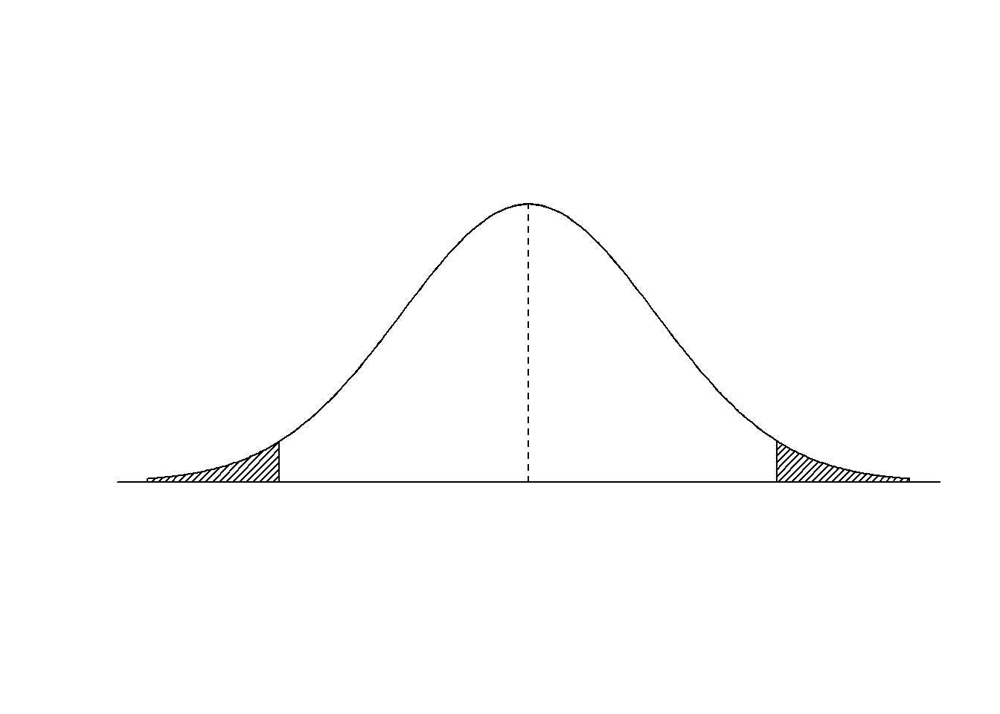

<br><br><br>

****

# Setores circulares 

****

O gráfico de Setores, também conhecido como gráfico de pizza ou gráfico circular é um diagrama circular onde os valores de cada categoria estatística representada são proporcionais às respectivas frequências. Este gráfico pode vir acompanhado de porcentagens. É utilizado para dados qualitativos nominais. Para construir um gráfico de setores é necessário determinar o ângulo dos setores circulares correspondentes à contribuição percentual de cada valor no total.

<br><br>

### Conjunto de dados


```r
variedade=c("Hass","Breda","Quintal","Geada","Margarida","Hass","Geada","Margarida","Hass","Margarida","Hass","Breda","Quintal","Breda","Quintal","Geada","Margarida","Breda","Quintal","Hass","Margarida","Hass","Breda","Hass","Margarida","Hass","Breda","Quintal","Breda","Quintal","Geada","Margarida","Breda","Quintal","Hass","Margarida","Hass","Breda","Geada","Margarida","Breda","Quintal","Hass","Margarida","Hass","Breda","Hass","Margarida","Hass","Breda","Quintal","Breda","Quintal","Geada","Margarida","Breda","Quintal","Hass","Margarida","Hass","Breda","Hass","Margarida","Hass","Breda","Quintal","Breda","Quintal","Geada","Margarida","Breda","Quintal","Quintal","Breda","Quintal")
```

<br>

### Frequências


```r
factor(variedade)
```

```
##  [1] Hass      Breda     Quintal   Geada     Margarida Hass      Geada    
##  [8] Margarida Hass      Margarida Hass      Breda     Quintal   Breda    
## [15] Quintal   Geada     Margarida Breda     Quintal   Hass      Margarida
## [22] Hass      Breda     Hass      Margarida Hass      Breda     Quintal  
## [29] Breda     Quintal   Geada     Margarida Breda     Quintal   Hass     
## [36] Margarida Hass      Breda     Geada     Margarida Breda     Quintal  
## [43] Hass      Margarida Hass      Breda     Hass      Margarida Hass     
## [50] Breda     Quintal   Breda     Quintal   Geada     Margarida Breda    
## [57] Quintal   Hass      Margarida Hass      Breda     Hass      Margarida
## [64] Hass      Breda     Quintal   Breda     Quintal   Geada     Margarida
## [71] Breda     Quintal   Quintal   Breda     Quintal  
## Levels: Breda Geada Hass Margarida Quintal
```

```r
n=length(variedade)
table(variedade)
```

```
## variedade
##     Breda     Geada      Hass Margarida   Quintal 
##        19         7        18        15        16
```

```r
proporção = prop.table(table(variedade))
```

<br>

### Gráfico básico


```r
pie(proporção*100)
```


<br>

### Melhorias


```r
pie(proporção*100, 
    edges=400, 
    radius=1, 
    col=c("red","green","yellow","blue","orange"), 
    main="Variedades de abacate")
```

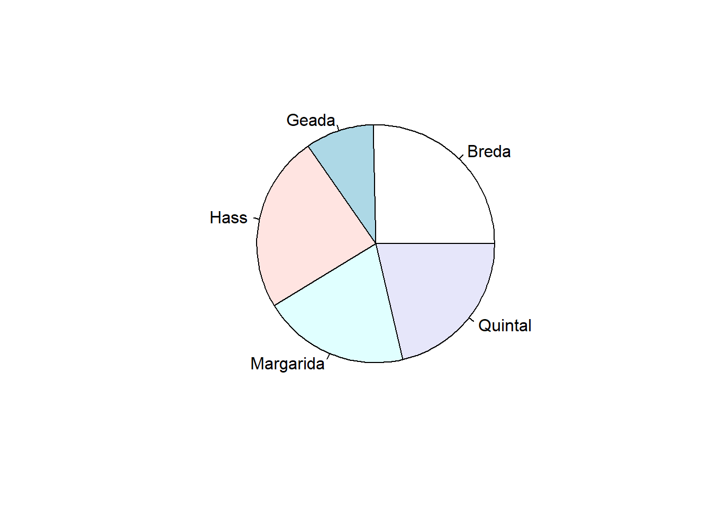

<br>

### Plotando valores

Obs. sem casa decimal


```r
pie(proporção*100, 
    edges=400, 
    radius=1, 
    labels=paste(names(proporção),"(",round(proporção*100,0),"%",")"), 
    col=c("red","green","yellow","blue","orange"), 
    main="Variedades de abacate")
```

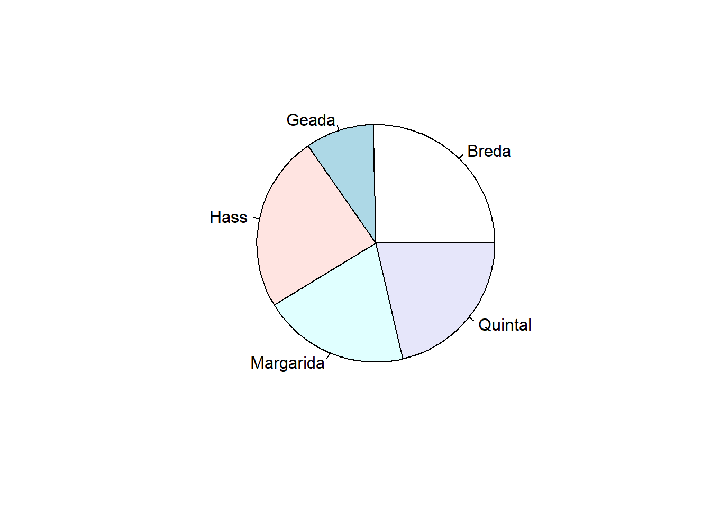

<br><br>

<br>

****

## Gráfico de Setores Circulares 3D

****

<br><br>

### Descobrindo as frequências


```r
factor(variedade)
```

```
##  [1] Hass      Breda     Quintal   Geada     Margarida Hass      Geada    
##  [8] Margarida Hass      Margarida Hass      Breda     Quintal   Breda    
## [15] Quintal   Geada     Margarida Breda     Quintal   Hass      Margarida
## [22] Hass      Breda     Hass      Margarida Hass      Breda     Quintal  
## [29] Breda     Quintal   Geada     Margarida Breda     Quintal   Hass     
## [36] Margarida Hass      Breda     Geada     Margarida Breda     Quintal  
## [43] Hass      Margarida Hass      Breda     Hass      Margarida Hass     
## [50] Breda     Quintal   Breda     Quintal   Geada     Margarida Breda    
## [57] Quintal   Hass      Margarida Hass      Breda     Hass      Margarida
## [64] Hass      Breda     Quintal   Breda     Quintal   Geada     Margarida
## [71] Breda     Quintal   Quintal   Breda     Quintal  
## Levels: Breda Geada Hass Margarida Quintal
```

```r
n=length(variedade)
table(variedade)
```

```
## variedade
##     Breda     Geada      Hass Margarida   Quintal 
##        19         7        18        15        16
```

```r
proporção = prop.table(table(variedade))
```

<br>

### Gráfico em 3D


```r
library(plotrix)
pie3D(proporção*100)
```

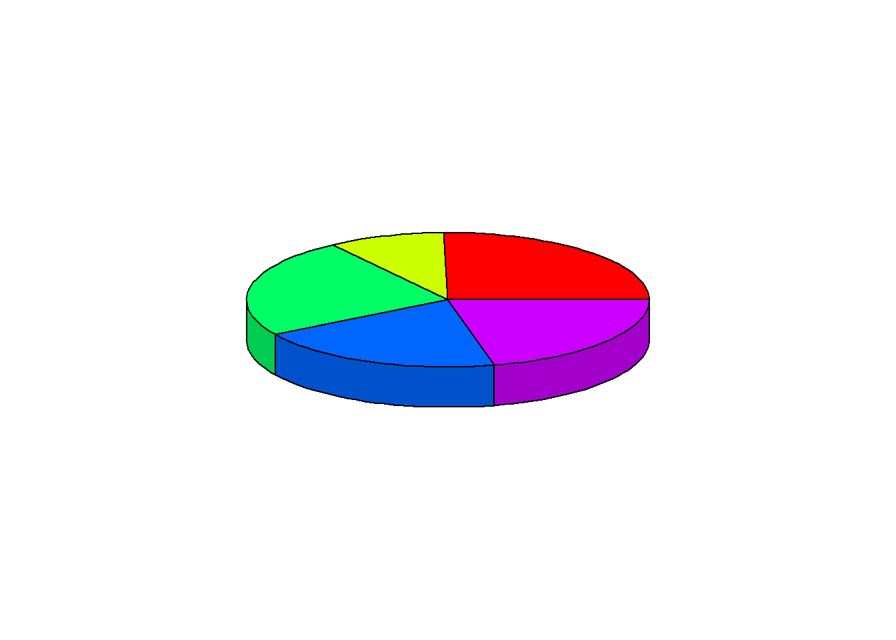

<br>

### Separando os setores


```r
pie3D(proporção*100, 
      explode=0.1, 
      main="Variedades de abacate")
```

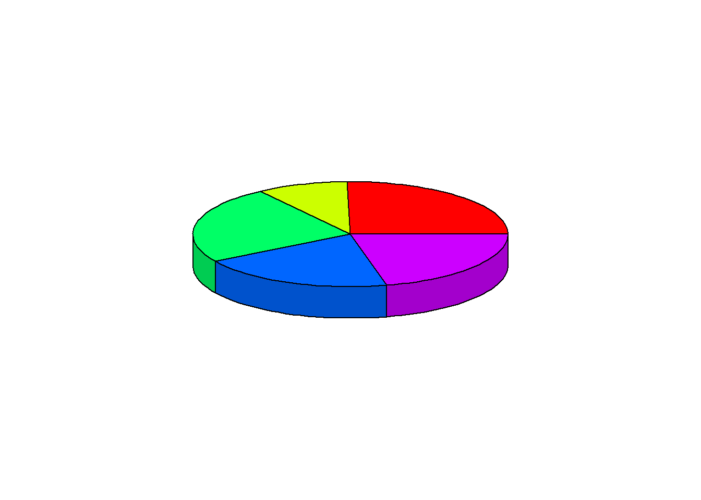

<br>

### Adicionando nomes e frequências


```r
pie3D(proporção*100, 
      explode=0.1, 
      cex=0.8,
      labels=paste(names(proporção),
                   "(",round(proporção*100,0),"%",")"), 
      main="Variedades de abacate")
```

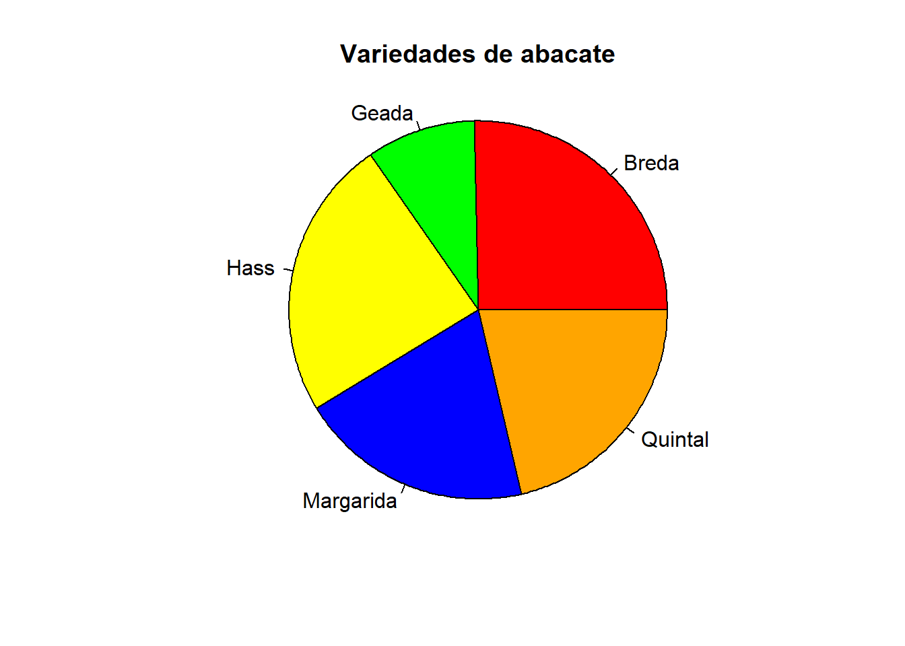

<br><br><br>

****

# Interação

****

O gráfico de interações é usado quando temos ao menos dois fatores. Tem como função identificar visualmente se os fatores apresentam efeito conjunto ou se são independentes

### Conjunto de dados

Um experimento foi realizado com o intuito de avaliar 5 manejos na entrelinha do pomar de laranja Natal e sua influência em relação a linha de plantio. O experimento foi instalado em Delineamento em blocos casualizados com 12 repetições por tratamento em esquema de parcelas subdividida (2 [linha e entrelinha] x 5[ *U. brizantha* (T1),*U. decumbens* (T2), *U. ruziziensis* (T3), *Glifosato* (T4), *Pousio* (T5). Foi analisado o carbono da biomassa microbiana (CBM).


```r
RESP=c(224.92, 180.32, 130.19, 110.31, 163.74,193.03, 211.49, 137.65, 127.15, 203.39,182.36, 124.75, 177.70, 231.01, 202.14,214.89, 198.42, 267.85, 207.67, 176.74,162.18, 124.59, 158.99, 209.12, 128.14,113.95, 215.53, 190.51, 174.58, 148.70,150.90, 209.03, 210.40, 199.03, 237.05,196.97, 176.06, 263.27, 240.19, 160.72,239.90, 188.07, 251.35, 215.45, 198.50,271.42, 226.56, 217.65, 213.69, 101.26,115.41, 140.10, 117.67, 106.45, 139.34,104.22, 206.13, 195.89, 147.11, 122.93,176.55, 173.63, 112.83, 184.82, 178.18,115.85, 183.89, 134.92, 086.49, 103.96,096.33, 091.64, 157.76, 107.45, 106.61,095.28, 152.37, 066.02, 125.75, 075.34,088.64, 104.00, 066.38, 084.74, 101.76,173.70, 101.24, 143.71, 119.88, 157.79,070.42, 152.75, 111.65, 153.08, 146.64,142.57, 098.96, 065.92, 065.62, 063.26,095.72, 084.14, 054.92, 090.49, 112.11,102.68, 144.77, 122.58, 125.14, 127.61,117.14, 147.87, 156.18, 154.82, 183.91,159.11, 155.41, 184.55, 121.39, 155.77)
FATOR1=rep(rep(c("L","EL"), e=12),5); FATOR1=factor(FATOR1)
FATOR2=rep(c(paste("T",1:5)),e=24); FATOR2=factor(FATOR2)
repe=rep(c(paste("R",1:12)),10); repe=factor(repe)
dados = data.frame(FATOR1,FATOR2,repe,RESP)
```

### Fator1 x Fator 2


```r
with(dados, interaction.plot(FATOR1, FATOR2, RESP))
```

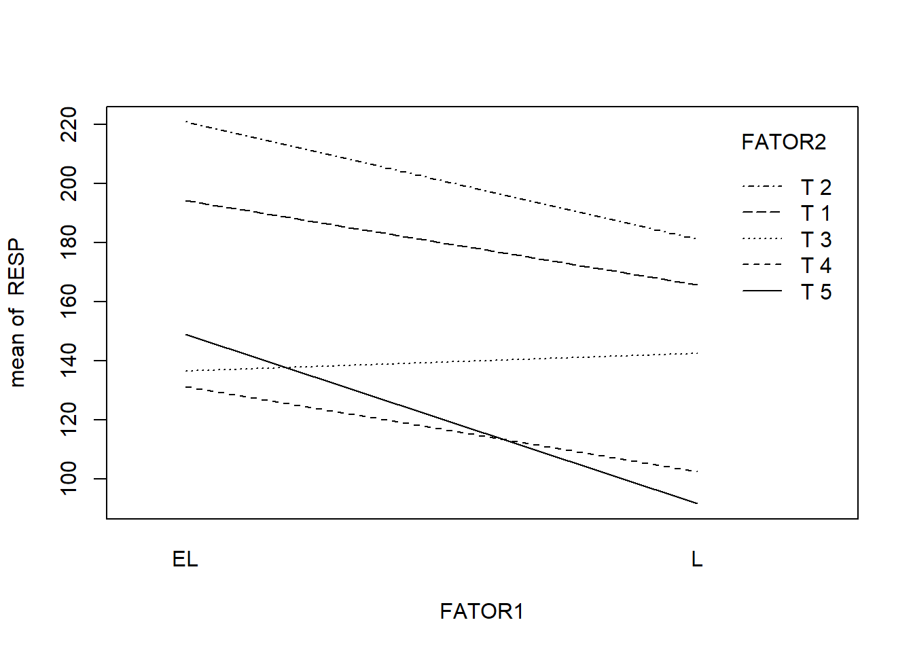

### Editando o gráfico


```r
with(dados, interaction.plot(FATOR1, FATOR2, RESP, las=1, col=1:6, bty='l', 
                             ylab='CBM', trace.label="FATOR2"))
```

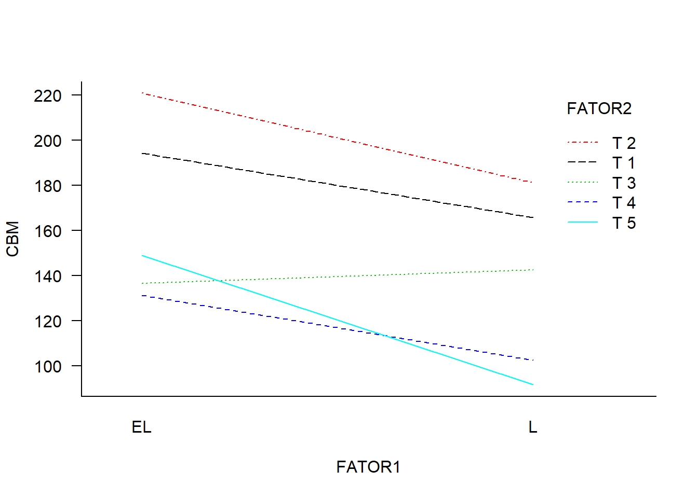

### Fator2 x Fator 1


```r
with(dados, interaction.plot(FATOR2, FATOR1, RESP))
```

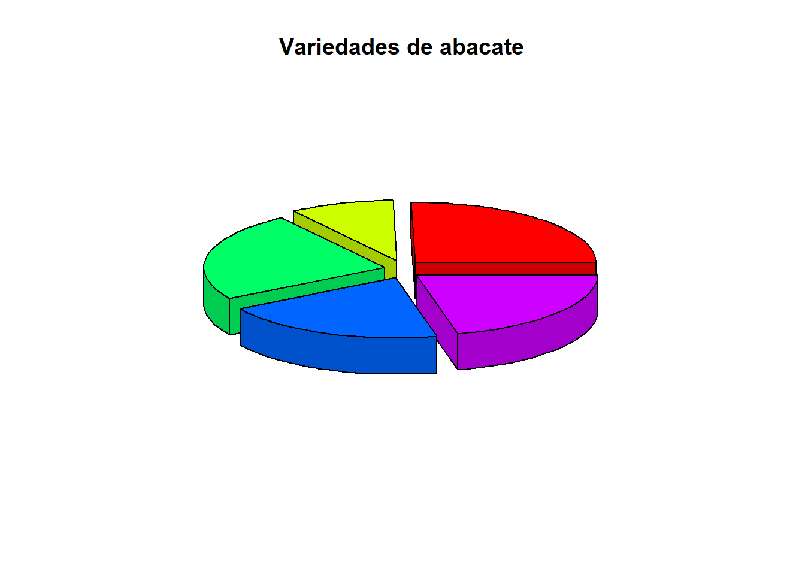

### Editando o gráfico


```r
with(dados, interaction.plot(FATOR2,FATOR1, RESP, las=1, col=c("blue","red"), bty='l',xlab='', ylab='CBM', trace.label="repe"))
```

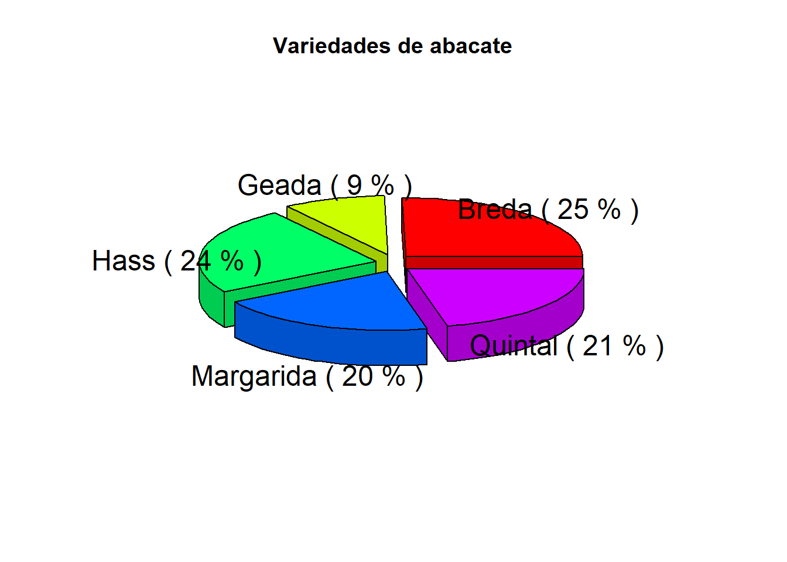

## Usando o interaction(s)

### Conjunto de dados

Este conjunto de dados pertence ao pacote ExpDes.pt (data6). Ao qual é composto de três fatores (fatorA, fatorB e fatorC), cuja resposta é nomeada como resp.


```r
x=scan(dec=",",text="
1       1      1      1   1 10,0
2       1      1      1   2 10,8
3       1      1      1   3  9,8
4       1      1      2   1 10,3
5       1      1      2   2 11,3
6       1      1      2   3 10,3
7       1      2      1   1  9,7
8       1      2      1   2 10,1
9       1      2      1   3 10,2
10      1      2      2   1  9,4
11      1      2      2   2 11,6
12      1      2      2   3  9,1
13      2      1      1   1  9,2
14      2      1      1   2  8,6
15      2      1      1   3 10,1
16      2      1      2   1  9,3
17      2      1      2   2 10,3
18      2      1      2   3  9,1
19      2      2      1   1 11,5
20      2      2      1   2  9,5
21      2      2      1   3 10,8
22      2      2      2   1 10,7
23      2      2      2   2 10,4
24      2      2      2   3  9,6
")
data=data.frame(t(matrix(x,6,24)))
colnames(data)=c("N","fatorA", "fatorB", "fatorC","rep","resp")
data
```

```
##     N fatorA fatorB fatorC rep resp
## 1   1      1      1      1   1 10,0
## 2   2      1      1      1   2 10,8
## 3   3      1      1      1   3  9,8
## 4   4      1      1      2   1 10,3
## 5   5      1      1      2   2 11,3
## 6   6      1      1      2   3 10,3
## 7   7      1      2      1   1  9,7
## 8   8      1      2      1   2 10,1
## 9   9      1      2      1   3 10,2
## 10 10      1      2      2   1  9,4
## 11 11      1      2      2   2 11,6
## 12 12      1      2      2   3  9,1
## 13 13      2      1      1   1  9,2
## 14 14      2      1      1   2  8,6
## 15 15      2      1      1   3 10,1
## 16 16      2      1      2   1  9,3
## 17 17      2      1      2   2 10,3
## 18 18      2      1      2   3  9,1
## 19 19      2      2      1   1 11,5
## 20 20      2      2      1   2  9,5
## 21 21      2      2      1   3 10,8
## 22 22      2      2      2   1 10,7
## 23 23      2      2      2   2 10,4
## 24 24      2      2      2   3  9,6
```

### Separado por Fator A


```r
par(mfrow=c(1,2))
interaction.plot(data$fatorB[data$fatorA=="1"],
                 data$fatorC[data$fatorA=="1"],
                 data$resp[data$fatorA=="1"])
interaction.plot(data$fatorB[data$fatorA=="2"],
                 data$fatorC[data$fatorA=="2"],
                 data$resp[data$fatorA=="2"])
```

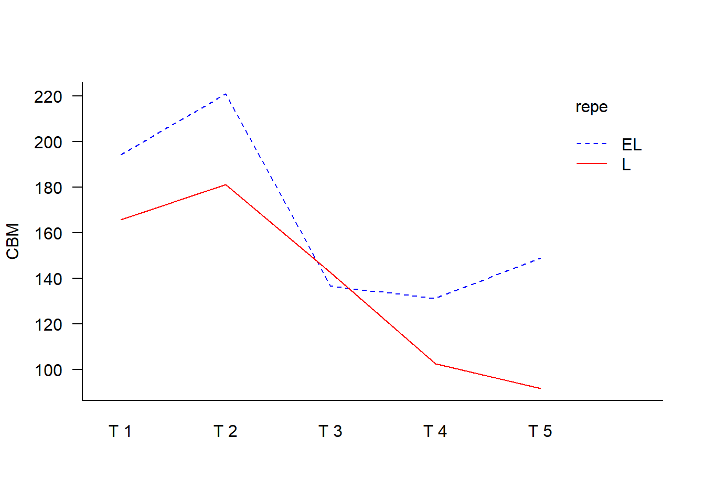

### Alterando escala do eixo Y


```r
par(mfrow=c(1,2))
interaction.plot(data$fatorB[data$fatorA=="1"],
                 data$fatorC[data$fatorA=="1"],
                 data$resp[data$fatorA=="1"], 
                 las=1)
interaction.plot(data$fatorB[data$fatorA=="2"],
                 data$fatorC[data$fatorA=="2"],
                 data$resp[data$fatorA=="2"], 
                 las=1)
```

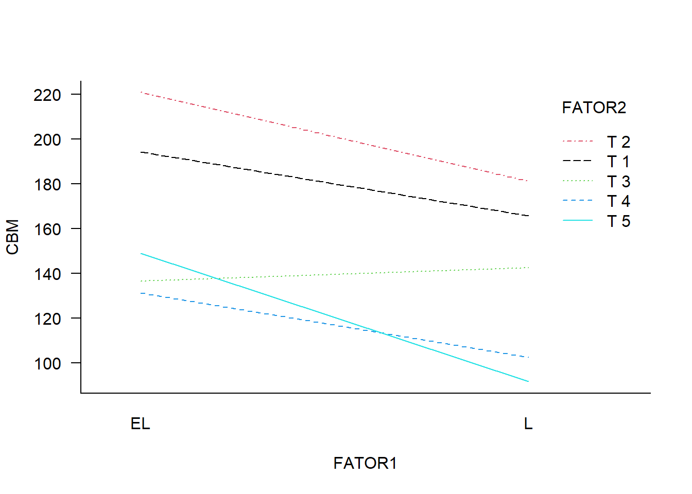

### Título do eixo x e y


```r
par(mfrow=c(1,2))
interaction.plot(data$fatorB[data$fatorA=="1"],
                 data$fatorC[data$fatorA=="1"],
                 data$resp[data$fatorA=="1"], 
                 las=1,
                 xlab="Fator B",
                 ylab="Resposta")
interaction.plot(data$fatorB[data$fatorA=="2"],
                 data$fatorC[data$fatorA=="2"],
                 data$resp[data$fatorA=="2"], 
                 las=1,
                 xlab="Fator B",
                 ylab="Resposta")
```

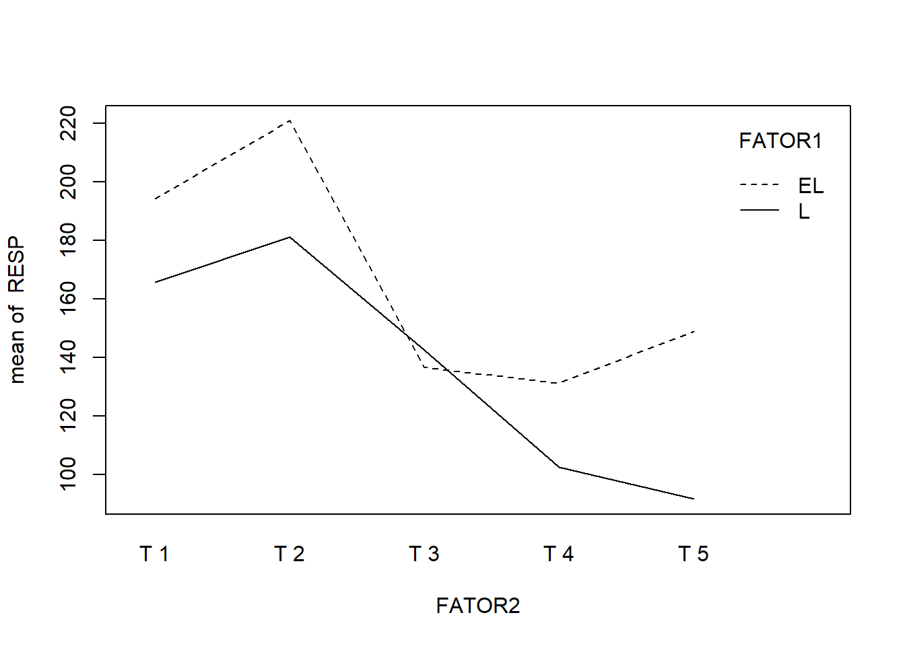

### Removendo linhas da caixa


```r
par(mfrow=c(1,2))
interaction.plot(data$fatorB[data$fatorA=="1"],
                 data$fatorC[data$fatorA=="1"],
                 data$resp[data$fatorA=="1"], 
                 las=1,
                 xlab="Fator B",
                 ylab="Resposta",
                 bty="l")
interaction.plot(data$fatorB[data$fatorA=="2"],
                 data$fatorC[data$fatorA=="2"],
                 data$resp[data$fatorA=="2"], 
                 las=1,
                 xlab="Fator B",
                 ylab="Resposta",
                 bty="l")
```

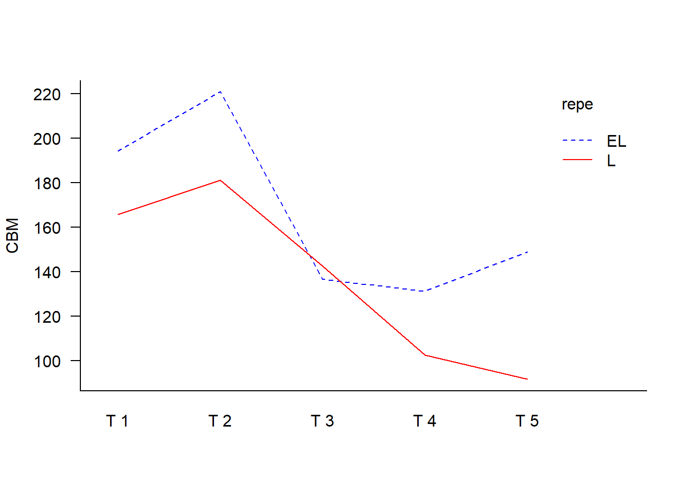

### Cor da linhas


```r
par(mfrow=c(1,2))
interaction.plot(data$fatorB[data$fatorA=="1"],
                 data$fatorC[data$fatorA=="1"],
                 data$resp[data$fatorA=="1"], 
                 las=1,
                 xlab="Fator B",
                 ylab="Resposta",
                 bty="l", 
                 col = c("red","blue"))
interaction.plot(data$fatorB[data$fatorA=="2"],
                 data$fatorC[data$fatorA=="2"],
                 data$resp[data$fatorA=="2"], 
                 las=1,
                 xlab="Fator B",
                 ylab="Resposta",
                 bty="l",
                 col = c("red","blue"))
```

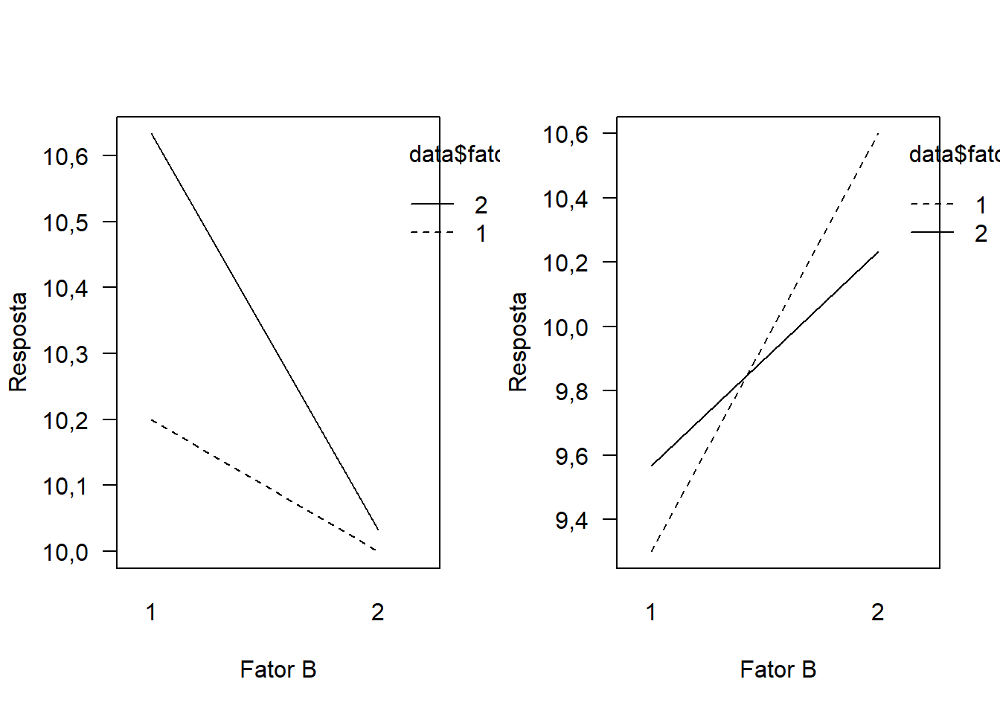

### Título dos gráficos


```r
par(mfrow=c(1,2))
interaction.plot(data$fatorB[data$fatorA=="1"],
                 data$fatorC[data$fatorA=="1"],
                 data$resp[data$fatorA=="1"], 
                 las=1,
                 xlab="Fator B",
                 ylab="Resposta",
                 bty="l", 
                 col = c("red","blue"),
                 main="Fator A = 1")
interaction.plot(data$fatorB[data$fatorA=="2"],
                 data$fatorC[data$fatorA=="2"],
                 data$resp[data$fatorA=="2"], 
                 las=1,
                 xlab="Fator B",
                 ylab="Resposta",
                 bty="l",
                 col = c("red","blue"),
                 main="Fator A = 2")
```

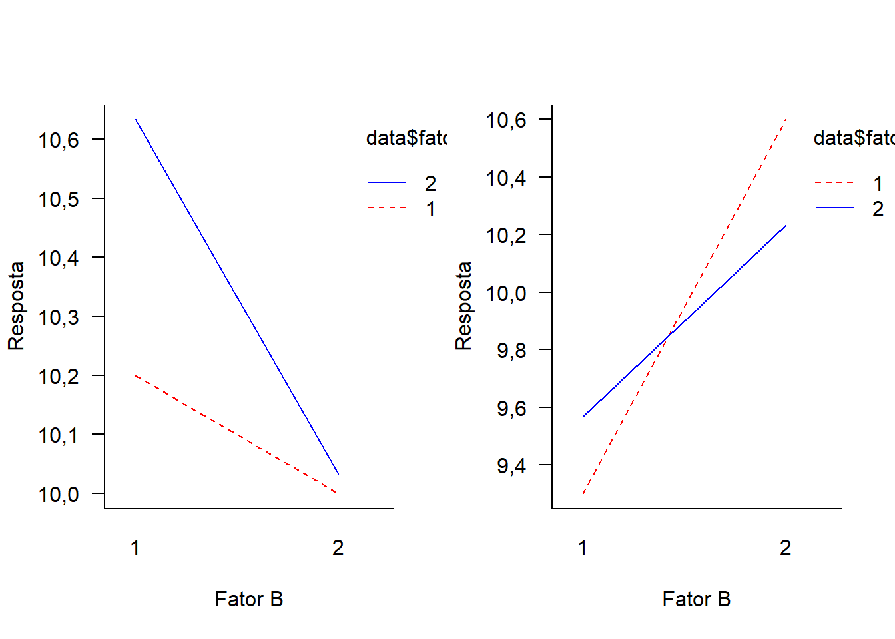

### Título da legenda


```r
par(mfrow=c(1,2))
interaction.plot(data$fatorB[data$fatorA=="1"],
                 data$fatorC[data$fatorA=="1"],
                 data$resp[data$fatorA=="1"], 
                 las=1,
                 xlab="Fator B",
                 ylab="Resposta",
                 bty="l", 
                 col = c("red","blue"),
                 main="Fator A = 1",
                 trace.label = "Fator C")
interaction.plot(data$fatorB[data$fatorA=="2"],
                 data$fatorC[data$fatorA=="2"],
                 data$resp[data$fatorA=="2"], 
                 las=1,
                 xlab="Fator B",
                 ylab="Resposta",
                 bty="l",
                 col = c("red","blue"),
                 main="Fator A = 2",
                 trace.label = "Fator C")
```

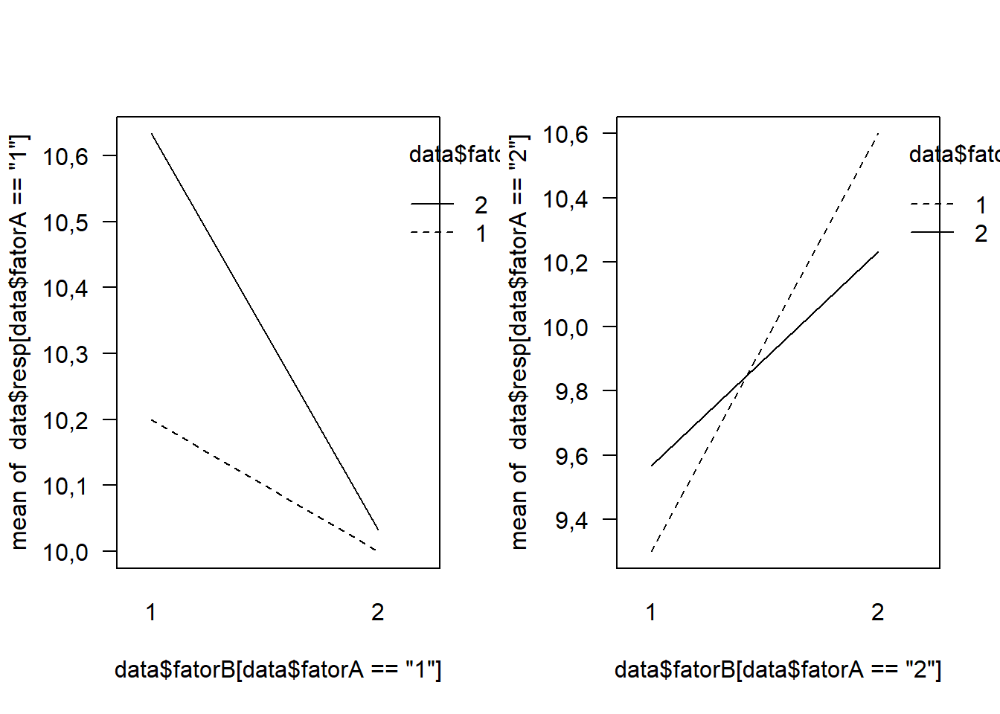


### Pontos da média

Calculando as médias


```r
# Média para nível 1 do fator A
media=with(data, 
           tapply(resp[fatorA=="1"], 
                      list(fatorB[fatorA=="1"],
                           fatorC[fatorA=="1"]), 
                  mean))

# Média e desvio-padrão para nível 2 do fator A
media1=with(data, 
            tapply(resp[fatorA=="2"], 
                      list(fatorB[fatorA=="2"],
                           fatorC[fatorA=="2"]), 
                   mean))           
```


```r
par(mfrow=c(1,2))
interaction.plot(data$fatorB[data$fatorA=="1"],
                 data$fatorC[data$fatorA=="1"],
                 data$resp[data$fatorA=="1"], 
                 las=1,
                 xlab="Fator B",
                 ylab="Resposta",
                 bty="l", 
                 col = c("red","blue"),
                 main="Fator A = 1",
                 trace.label = "Fator C")
points(c(1,2,1,2),media, col="red", pch=16)

interaction.plot(data$fatorB[data$fatorA=="2"],
                 data$fatorC[data$fatorA=="2"],
                 data$resp[data$fatorA=="2"], 
                 las=1,
                 xlab="Fator B",
                 ylab="Resposta",
                 bty="l",
                 col = c("red","blue"),
                 main="Fator A = 2",
                 trace.label = "Fator C")
points(c(1,2,1,2),media1, col="red", pch=16)
```

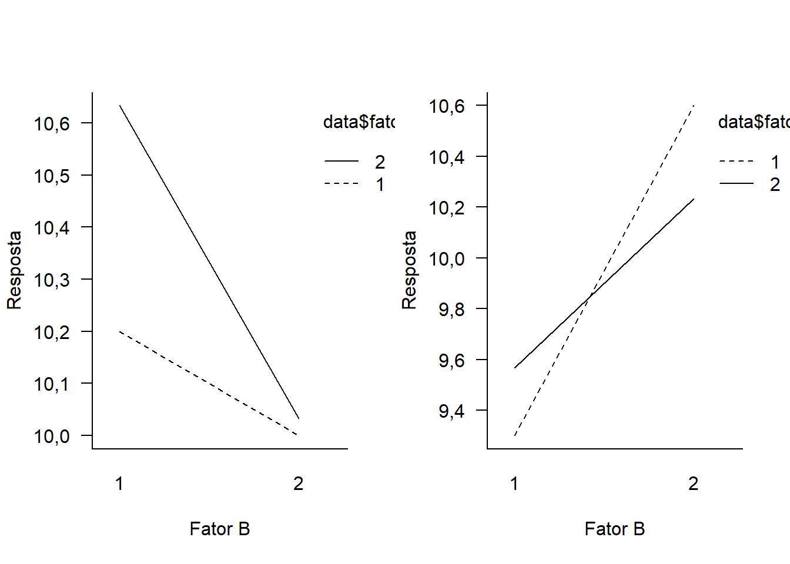

### Barras de desvio-padrão

Calculando os desvios-padrões


```r
# Desvio-padrão para nível 1 do fator A
desvio=with(data, 
            tapply(resp[fatorA=="1"], 
                      list(fatorB[fatorA=="1"],
                           fatorC[fatorA=="1"]), 
                         sd))

# Desvio-padrão para nível 2 do fator A
desvio1=with(data, 
             tapply(resp[fatorA=="2"], 
                      list(fatorB[fatorA=="2"],
                           fatorC[fatorA=="2"]), 
                    sd))
```


```r
par(mfrow=c(1,2))
interaction.plot(data$fatorB[data$fatorA=="1"],
                 data$fatorC[data$fatorA=="1"],
                 data$resp[data$fatorA=="1"], 
                 las=1, args.legend=list(x="topleft"),
                 xlab="Fator B", ylim=c(8,13),
                 ylab="Resposta", 
                 bty="l", 
                 col = c("red","blue"),
                 main="Fator A = 1",
                 trace.label = "Fator C")
points(c(1,2,1,2),media, col="red", pch=16)
arrows(c(1,2,1,2), media+desvio,c(1,2,1,2),media-desvio, code=3,angle=90,length = 0.1, col=c("red","red","blue","blue"))

interaction.plot(data$fatorB[data$fatorA=="2"],
                 data$fatorC[data$fatorA=="2"],
                 data$resp[data$fatorA=="2"], 
                 las=1,
                 xlab="Fator B", ylim=c(8,13),
                 ylab="Resposta",
                 bty="l",
                 col = c("red","blue"),
                 main="Fator A = 2",
                 trace.label = "Fator C")
points(c(1,2,1,2),media1, col="red", pch=16)
arrows(c(1,2,1,2), media1+desvio1,c(1,2,1,2),media1-desvio1, code=3,angle=90,length = 0.1, col=c("red","red","blue","blue"))
```

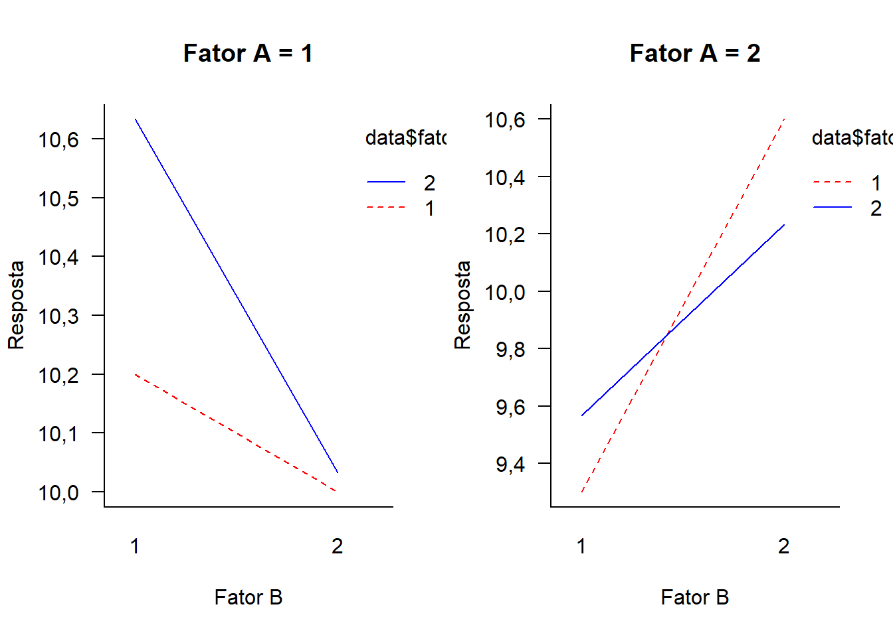

## Pacote dae

### Conjunto de dados


```r
resp=c(4599.55,6203.50,4566.02,5616.38,4978.35,5126.15,4816.23,4251.00,4106.79,
       4600.58,4012.14,4623.41,4274.16,4683.50,4433.33,4326.16,4932.66,5066.67,
       4697.29,5011.38,5156.72,4744.21,4826.80,4663.26,4807.19,4377.19,4442.07,
       4685.58,5066.90,5317.66,5144.19,4580.18,4860.37,5204.21,5146.19,5015.67,
       5801.99,4668.05,5393.16,5282.27,5369.41,5494.43,4980.32,5715.76,4754.54,
       5000.83,4664.11,4969.41,5315.43,4872.29,5546.79,4765.79,4649.63,4899.31,
       4890.89,5117.10,4942.97,4548.97,4916.97,4225.38,4820.21,4150.44,4648.46,
       4271.57,5143.54,4808.97,5459.66,4928.35,5224.70,4900.90,4770.88,4977.68,
       5816.80,5107.11,5555.80,5767.65,5117.10,5573.08,5673.87,4859.00,4687.26,
       5055.22,5235.22,4961.72,4984.93,5425.67,4978.33,5172.60,5328.07,4973.87,
       5296.55,4928.01,4528.12,5337.93,5809.20,4914.70,5191.89,5261.24,5287.53,
       5680.55,5080.06,5425.53,4949.13,5300.57,4481.23,5039.54,5223.75,4581.65)
FATOR1=rep(rep(c("A1","A2","A3"), e=12),3)
FATOR2=rep(c("B1","B2","B3"), e=36)
FATOR3=rep(rep(c("C1","c2","c3"),e=4),9)
dados=data.frame(FATOR1,FATOR2,FATOR3,resp)
```

<br>

### Gráfico com a média

Para se construir esse gráfico é necessário instalar o pacote `dae`


```r
library(dae)
interaction.ABC.plot(resp,FATOR1,FATOR2,FATOR3,data=dados)
```

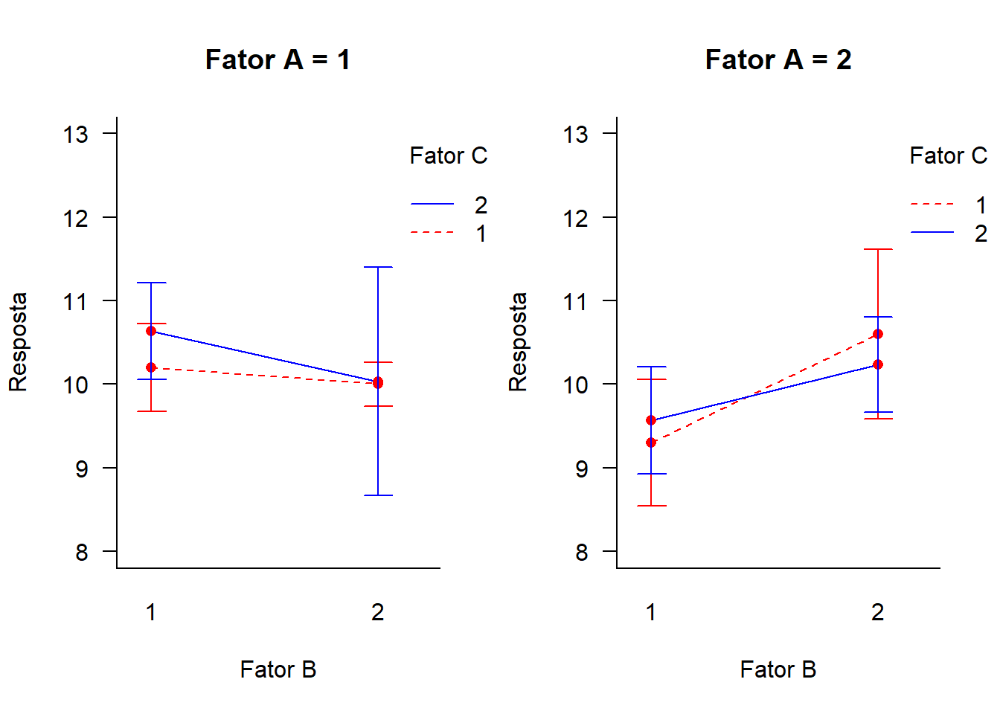

```r
interaction.ABC.plot(resp,FATOR1,FATOR3,FATOR2,data=dados)
```


```r
interaction.ABC.plot(resp,FATOR2,FATOR3,FATOR1,data=dados)
```

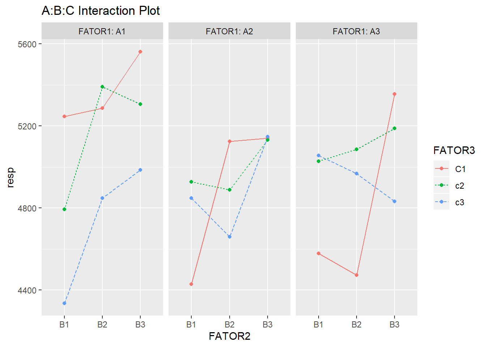

```r
interaction.ABC.plot(resp,FATOR2,FATOR1,FATOR3,data=dados)
```

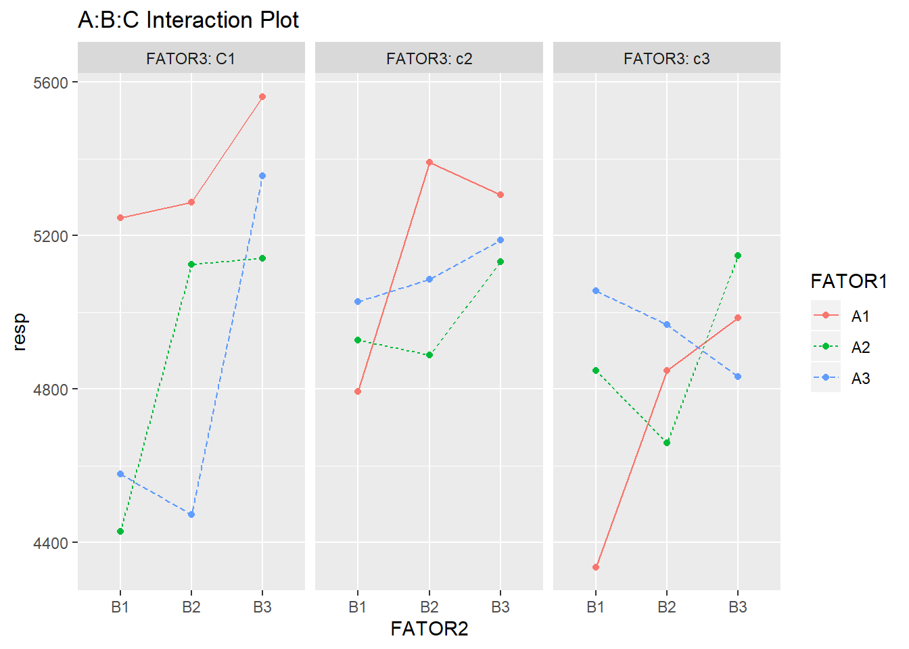

```r
interaction.ABC.plot(resp,FATOR3,FATOR2,FATOR1,data=dados)
```

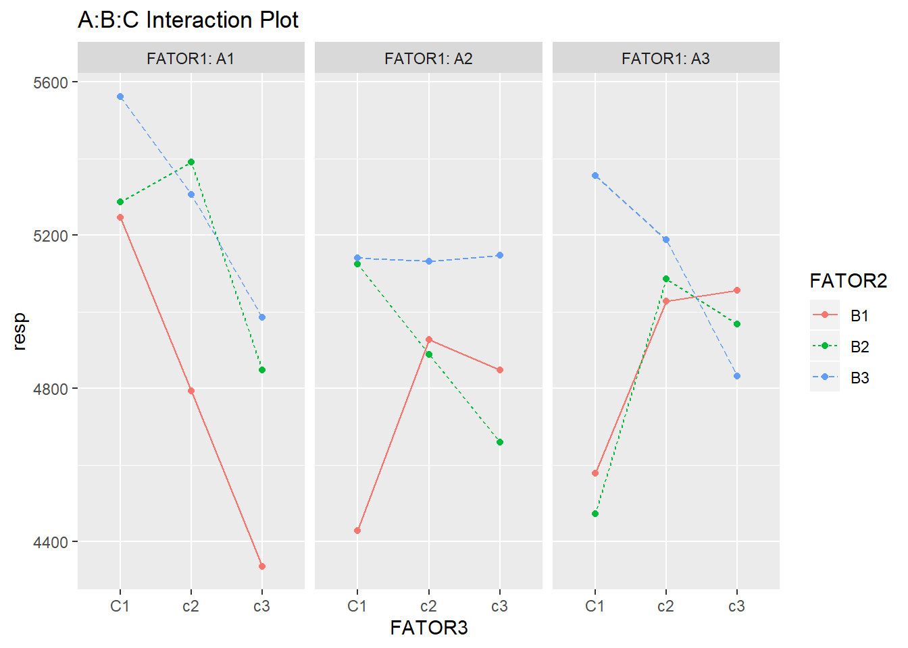

```r
interaction.ABC.plot(resp,FATOR3,FATOR1,FATOR2,data=dados)
```

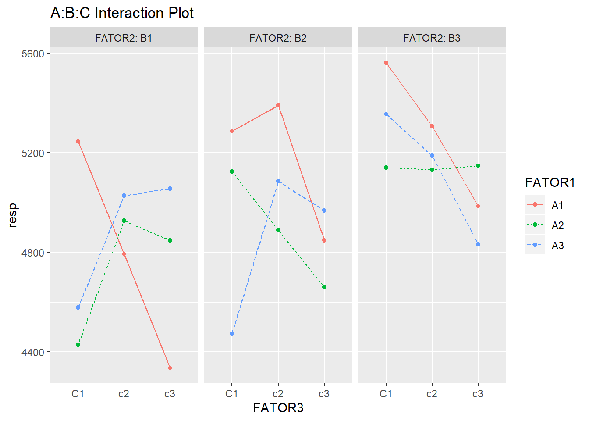

### Média e desvio-padrão


```r
media=tapply(resp, paste(FATOR1,FATOR2,FATOR3),mean)
desvio=tapply(resp, paste(FATOR1,FATOR2,FATOR3),sd)
```


```r
(F1=rep(c("A1","A2","A3"), e=9))
```

```
##  [1] "A1" "A1" "A1" "A1" "A1" "A1" "A1" "A1" "A1" "A2" "A2" "A2" "A2" "A2" "A2"
## [16] "A2" "A2" "A2" "A3" "A3" "A3" "A3" "A3" "A3" "A3" "A3" "A3"
```

```r
(F2=rep(rep(c("B1","B2","B3"), e=3),3)) 
```

```
##  [1] "B1" "B1" "B1" "B2" "B2" "B2" "B3" "B3" "B3" "B1" "B1" "B1" "B2" "B2" "B2"
## [16] "B3" "B3" "B3" "B1" "B1" "B1" "B2" "B2" "B2" "B3" "B3" "B3"
```

```r
(F3=rep(c("C1","c2","c3"),9))
```

```
##  [1] "C1" "c2" "c3" "C1" "c2" "c3" "C1" "c2" "c3" "C1" "c2" "c3" "C1" "c2" "c3"
## [16] "C1" "c2" "c3" "C1" "c2" "c3" "C1" "c2" "c3" "C1" "c2" "c3"
```

```r
paste(F1,F2,F3) # tratamentos
```

```
##  [1] "A1 B1 C1" "A1 B1 c2" "A1 B1 c3" "A1 B2 C1" "A1 B2 c2" "A1 B2 c3"
##  [7] "A1 B3 C1" "A1 B3 c2" "A1 B3 c3" "A2 B1 C1" "A2 B1 c2" "A2 B1 c3"
## [13] "A2 B2 C1" "A2 B2 c2" "A2 B2 c3" "A2 B3 C1" "A2 B3 c2" "A2 B3 c3"
## [19] "A3 B1 C1" "A3 B1 c2" "A3 B1 c3" "A3 B2 C1" "A3 B2 c2" "A3 B2 c3"
## [25] "A3 B3 C1" "A3 B3 c2" "A3 B3 c3"
```

### Criando uma data.frame


```r
data=data.frame(F1,F2,F3,media,desvio)
```

### Construindo o gráfico


```r
interaction.ABC.plot(media,F1,F2,F3,data=data,
                     ggplotFunc=
                       list(geom_errorbar(data=data,
                                          aes(ymax=media+desvio, 
                                              ymin=media-desvio), 
                                                   width=0.2)))
```


<br><br><br>

****

# Perfil Individual

****

### Conjunto de dados

Um experimento foi realizado com o intuito de avaliar 5 manejos na entrelinha do pomar de laranja Natal e sua influência em relação a linha de plantio. O experimento foi instalado em Delineamento em blocos casualizados com 12 repetições por tratamento em esquema de parcelas subdividida (2 [linha e entrelinha] x 5[ *U. brizantha* (T1),*U. decumbens* (T2), *U. ruziziensis* (T3), *Glifosato* (T4), *Pousio* (T5). Foi analisado o carbono da biomassa microbiana (CBM).


```r
RESP=c(224.92, 180.32, 130.19, 110.31, 163.74,193.03, 211.49, 137.65, 127.15, 203.39,182.36, 124.75, 177.70, 231.01, 202.14,214.89, 198.42, 267.85, 207.67, 176.74,162.18, 124.59, 158.99, 209.12, 128.14,113.95, 215.53, 190.51, 174.58, 148.70,150.90, 209.03, 210.40, 199.03, 237.05,196.97, 176.06, 263.27, 240.19, 160.72,239.90, 188.07, 251.35, 215.45, 198.50,271.42, 226.56, 217.65, 213.69, 101.26,115.41, 140.10, 117.67, 106.45, 139.34,104.22, 206.13, 195.89, 147.11, 122.93,176.55, 173.63, 112.83, 184.82, 178.18,115.85, 183.89, 134.92, 086.49, 103.96,096.33, 091.64, 157.76, 107.45, 106.61,095.28, 152.37, 066.02, 125.75, 075.34,088.64, 104.00, 066.38, 084.74, 101.76,173.70, 101.24, 143.71, 119.88, 157.79,070.42, 152.75, 111.65, 153.08, 146.64,142.57, 098.96, 065.92, 065.62, 063.26,095.72, 084.14, 054.92, 090.49, 112.11,102.68, 144.77, 122.58, 125.14, 127.61,117.14, 147.87, 156.18, 154.82, 183.91,159.11, 155.41, 184.55, 121.39, 155.77)
FATOR1=rep(rep(c("L","EL"), e=12),5); FATOR1=factor(FATOR1)
FATOR2=rep(c(paste("T",1:5)),e=24); FATOR2=factor(FATOR2)
repe=rep(c(paste("R",1:12)),10); repe=factor(repe)
dados = data.frame(FATOR1,FATOR2,repe,RESP)
```

### Fator 2 x Fator 1


```r
library(lattice)
with(dados, xyplot(RESP ~ FATOR1|FATOR2, groups=repe))
```

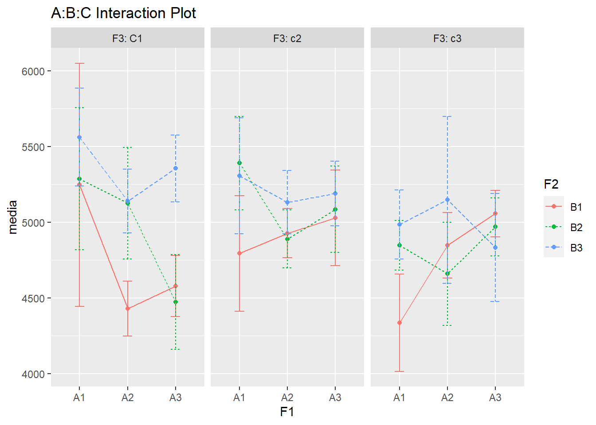


```r
with(dados, xyplot(RESP ~ FATOR1|FATOR2, groups=repe, aspect="xy"))
```


```r
with(dados, xyplot(RESP ~ FATOR1|FATOR2, groups=repe, aspect="xy", type="o"))
```

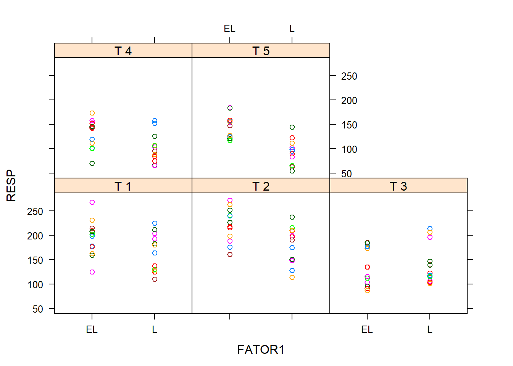


```r
with(dados, xyplot(RESP ~ FATOR1|FATOR2, groups=repe, aspect="xy", type="o", ylab='CBM',strip=strip.custom(strip.names=TRUE, strip.levels=TRUE)))
```


### Fator 1 x Fator 2


```r
with(dados, xyplot(RESP ~ FATOR2|FATOR1, groups=repe, type="o", ylab='CBM', strip=strip.custom(strip.names=TRUE,strip.levels=TRUE)))
```

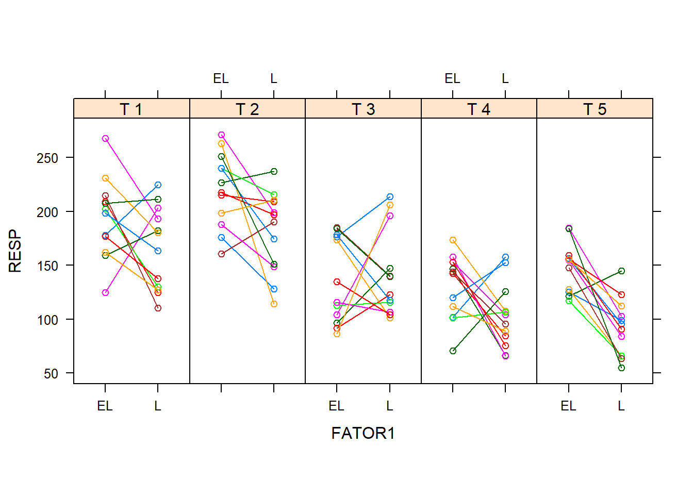

<br><br><br>

****

# Linhas

****

Gráficos de linhas ou pontos são normalmente usados para controlar alterações ao longo do tempo e para facilitar a identificação de tendências ou de anomalias.


### Conjunto de dados

Esse conjunto de dados de Umidade relativa (UR) foi obtido no site do Instituto Agronômico do Paraná  (http://www.iapar.br/modules/conteudo/conteudo.php?conteudo=1828) no período de 01/09/2018 a 21/02/2019.

<br>


```r
UR=c(68,93,86,55,54,51,45,43,55,54,58,57,64,89,73,80,96,71,86,95,74,62,49,43,51,62,86,73,64,95,68,77,86,93,76,63,69,94,88,89,88,67,76,84,71,88,83,83,74,54,51,61,74,97,94,97,66,58,65,56,82,93,66,64,67,65,67,67,63,62,76,51,57,54,80,65,65,65,93,88,63,68,65,98,83,64,67,62,59,78,75,70,63,62,53,46,42,55,60,51,51,47,42,60,62,77,74,58,63,67,66,83,81,87,95,80,71,68,74,69,75,74,75,90,86,91,91,98,84,81,74,82,69,77,84,78,74,87,75,80,89,90,77,73,82,80,82,75,79,70,61,63,74,63,58,62,76,76,74,69,64,56,61,86,94,85,78,91,82,80,81,85,89,84)
TEMPO=c(1:174)
```

<br>

### Gráfico de dispersão


```r
plot(UR~TEMPO, 
     ylab="Umidade Relativa (%)", xlab="Tempo (Dias)",
     col="blue", las=1)
```

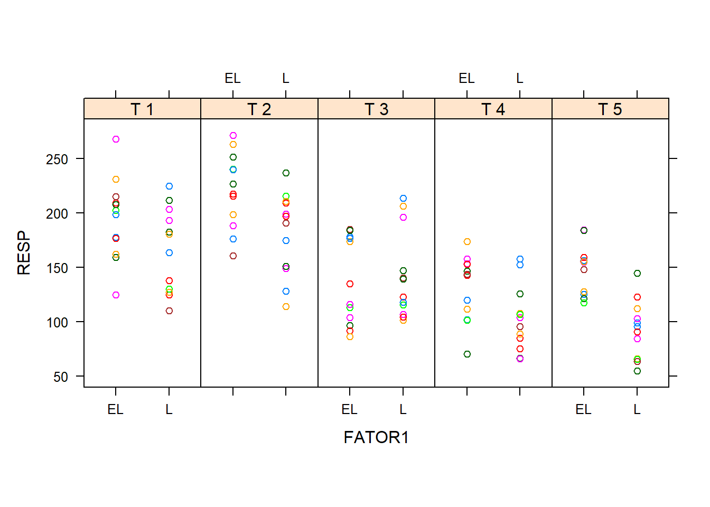

<br>

### Gráfico com as linhas


```r
plot(UR~TEMPO,
     ylab="Umidade Relativa (%)", xlab="Tempo (Dias)",
     type="lines", 
     col="blue", las=1)
```

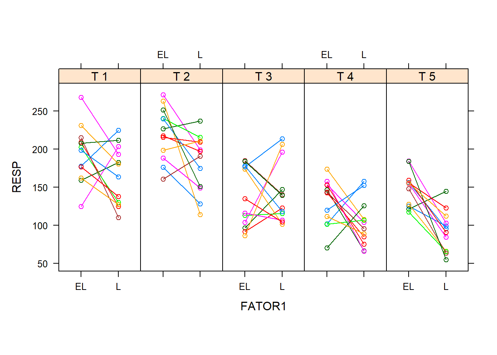

<br>

### Gráfico com linhas e pontos 


```r
plot(UR~TEMPO,
     ylab="Umidade Relativa (%)", xlab="Tempo (Dias)",
     type="b", 
     col="blue", las=1)
```


```r
plot(UR~TEMPO,
     ylab="Umidade Relativa (%)", xlab="Tempo (Dias)",
     type="o", 
     col="blue", las=1)
```


<br>

### Linhas verticais


```r
plot(UR~TEMPO,
     ylab="Umidade Relativa (%)", xlab="Tempo (Dias)",
     type="h", 
     col="blue", las=1)
```


<br>

### Formato em escada


```r
plot(UR~TEMPO,
     ylab="Umidade Relativa (%)", xlab="Tempo (Dias)",
     type="s", 
     col="blue", las=1)
```


<br>

### Juntando os 6 gráficos


```r
par(mfrow=c(2,3))
plot(UR~TEMPO,cex=0.5, 
     ylab="Umidade Relativa (%)", xlab="Tempo (Dias)",
     col="blue", las=1)
plot(UR~TEMPO,cex=0.5,
     ylab="Umidade Relativa (%)", xlab="Tempo (Dias)",
     type="lines", 
     col="blue", las=1)
plot(UR~TEMPO,cex=0.5,
     ylab="Umidade Relativa (%)", xlab="Tempo (Dias)",
     type="b", 
     col="blue", las=1)
plot(UR~TEMPO,cex=0.5,
     ylab="Umidade Relativa (%)", xlab="Tempo (Dias)",
     type="o", 
     col="blue", las=1)
plot(UR~TEMPO,cex=0.5,
     ylab="Umidade Relativa (%)", xlab="Tempo (Dias)",
     type="h", 
     col="blue", las=1)
plot(UR~TEMPO,cex=0.5,
     ylab="Umidade Relativa (%)", xlab="Tempo (Dias)",
     type="s", 
     col="blue", las=1)
```

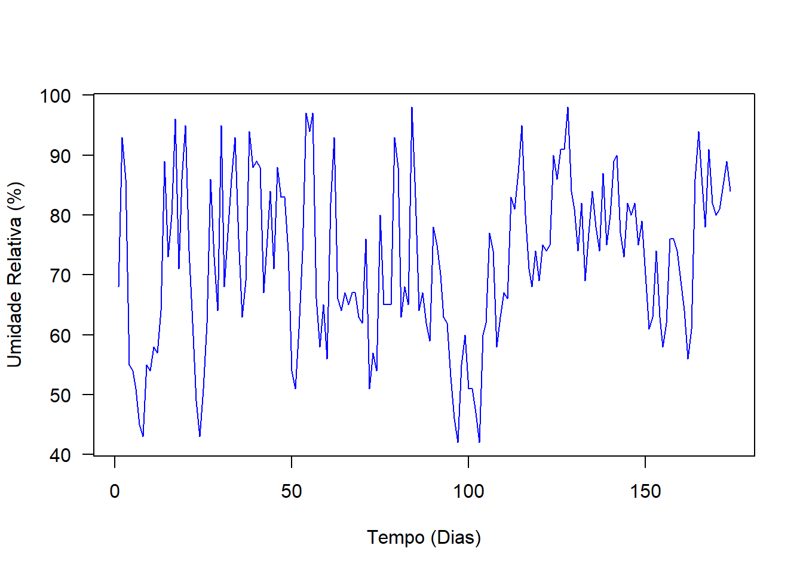

<br>

****

## Eixo secundário

****

### Conjunto de dados


```r
TM=c(23.4,19.8,12.8,16.3,20.8,17.4,20.0,21.8,21.8,20.6,20.3,20.6,20.4,18.1,20.2,19.3,17.2,20.8,20.7,17.4,21.8,23.8,25.8,26.3,25.3,24.5,21.4,23.3,24.3,21.2,24.3,23.6,23.5,22.3,21.4,19.7,22.1,20.5,22.3,21.8,18.0,21.3,24.1,23.9,23.6,23.3,23.2,22.0,22.4,20.8,20.2,22.6,23.7,19.9,19.7,21.4,22.5,21.4,20.4,24.5,22.7,20.3,23.7,24.0,23.6,21.6,22.0,22.6,21.3,22.5,22.2,26.3,27.2,28.3,25.9,25.8,26.6,24.9,20.8,19.4,21.6,22.2,23.8,20.9,22.9,25.0,23.7,23.8,24.8,24.8)
UR=c(68,93,86,55,54,51,45,43,55,54,58,57,64,89,73,80,96,71,86,95,74,62,49,43,51,62,86,73,64,95,68,77,86,93,76,63,69,94,88,89,88,67,76,84,71,88,83,83,74,54,51,61,74,97,94,97,66,58,65,56,82,93,66,64,67,65,67,67,63,62,76,51,57,54,80,65,65,65,93,88,63,68,65,98,83,64,67,62,59,78)
TEMPO=c(1:90)
```

<br>

### Linhas individuais


```r
par(mfrow=c(1,2)) # mudando parâmetro gráfico para plotar dois graficos lado a lado
plot(TM~TEMPO, ylab="Temperatura")
plot(UR~TEMPO, ylab="Umidade relativa")
```

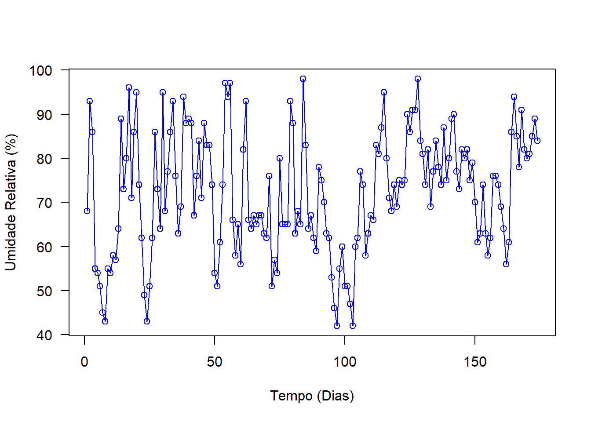

<br>

### Editando gráficos


```r
par(mfrow=c(1,2))
plot(TM~TEMPO, 
     ylim=c(0,50), # mudando escala de Y
     las=2, # deixando marcador de escala na vertical
     type="l", # mudando tipo de gráfico para linhas
     ylab='Temperatura', # modificando nome do eixo Y
     xlab="Tempo (minutos)") # modificando nome do eixo x
plot(UR~TEMPO, 
     ylim=c(0,100), 
     las=2, 
     type="l", 
     xlab="",
     ylab="",
     lty=4) # modificando formato de linha
```


<br>

### Sobrepor os gráficos


```r
par(mar=c(4,4,3,4)) # modificando a largura da margem (inferior, esquerda, superior, direita)
plot(TM~TEMPO, 
     ylim=c(0,50),
     las=2, 
     type="l",
     ylab='Temperatura', 
     xlab="Tempo (minutos)")
par(new=T) # comando para sobrepor gráficos
plot(UR~TEMPO, 
     ylim=c(0,100), 
     las=2, 
     type="l", 
     xlab="",
     ylab="",
     lty=4)
```


<br>

### Marca das escalas 


```r
par(mar=c(4,4,3,4))
plot(TM~TEMPO, 
     ylim=c(0,50),
     las=2, 
     type="l",
     axes=F, # argumento para remover as escalas 
     ylab='Temperatura', 
     xlab="Tempo (minutos)")
par(new=T)
plot(UR~TEMPO, 
     ylim=c(0,100), 
     las=2, 
     type="l", 
     axes=F, # argumento para remover as escalas
     xlab="",
     ylab="",
     lty=4)
```

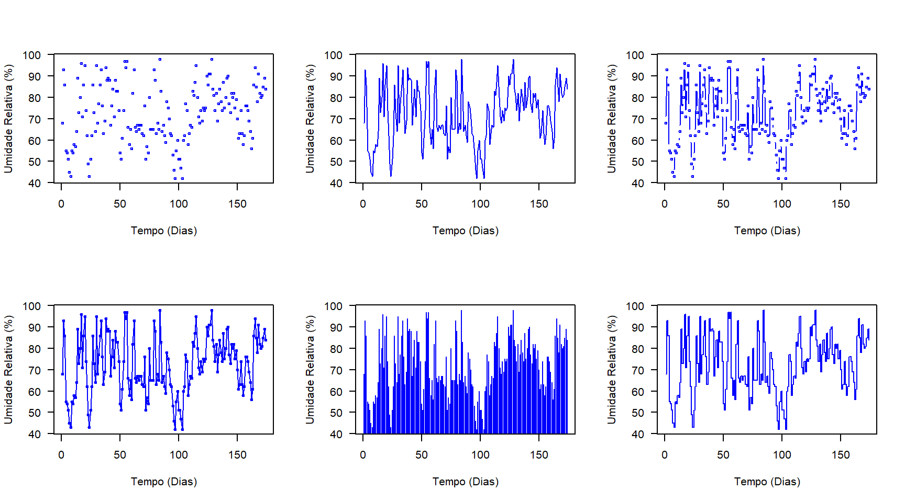


```r
par(mar=c(4,4,3,4))
plot(TM~TEMPO, 
     ylim=c(0,50),
     las=2, 
     type="l",
     axes=F, 
     lty=1, 
     ylab='Temperatura', 
     xlab="Tempo (minutos)")
par(new=T)
plot(UR~TEMPO, 
     ylim=c(0,100), 
     las=2, 
     type="l", 
     axes=F, 
     xlab="",
     ylab="",
     lty=4)
axis(2,las=2, ylim=c(0,50)) # escala do eixo y primário
axis(4,las=2) # escala do eixo y secundário
axis(side=1,las=1, at=seq(0, 100, by=10)) # escala do eixo x 
```


```r
## Obs. at=seq(0, 100, by=10) estou definindo um intervalo de 0 a 100 como marca a cada 10 unidades
```

<br>

### Nome do eixo Y secundário


```r
par(mar=c(4,4,3,4))
plot(TM~TEMPO, 
     ylim=c(0,50),
     las=2, 
     type="l",
     axes=F, 
     lty=1, 
     ylab='Temperatura', 
     xlab="Tempo (minutos)")
par(new=T)
plot(UR~TEMPO, 
     ylim=c(0,100), 
     las=2, 
     type="l", 
     axes=F, 
     xlab="",
     ylab="",
     lty=4)
axis(4,las=2)
axis(2,las=2)
axis(side=1,las=1, at=seq(0, 100, by=10))
text(par("usr")[2]*1.11,mean(par("usr")[3:4]), "UR (%)", srt = -90, xpd = TRUE, pos = 4)
```

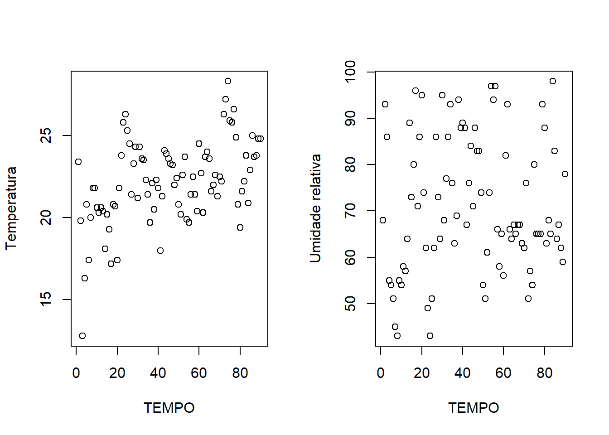

<br>

### Adicionando legenda


```r
par(mar=c(4,4,3,4))
plot(TM~TEMPO, 
     ylim=c(0,50),
     las=2, 
     type="l",
     axes=F, 
     lty=1, 
     ylab='Temperatura', 
     xlab="Tempo (minutos)")
par(new=T)
plot(UR~TEMPO, 
     ylim=c(0,100), 
     las=2, 
     type="l", 
     axes=F, 
     xlab="",
     ylab="",
     lty=4)
axis(4,las=2)
axis(2,las=2)
axis(side=1,las=1, at=seq(0, 100, by=10))
text(par("usr")[2]*1.11,mean(par("usr")[3:4]), "UR (%)", srt = -90, xpd = TRUE, pos = 4)
legend("bottomleft", # posição da legenda
       lty=c(1,4), # formato do tracejado 
       legend=c(expression("Temperatura"^"o"*C),"Umidade Relativa (%)"), 
       bty="n") # caixa da legenda sem margem
```


<br>

### Conjunto de dados

Esse conjunto de dados de temperatura média (TM) e Umidade relativa (UR) foi obtido no site do Instituto Agronômico do Paraná  (http://www.iapar.br/modules/conteudo/conteudo.php?conteudo=1828) no período de 01/09/2018 a 21/02/2019.


```r
TM=c(23.4,19.8,12.8,16.3,20.8,17.4,20.0,21.8,21.8,20.6,20.3,20.6,20.4,18.1,20.2,19.3,17.2,20.8,20.7,17.4,21.8,23.8,25.8,26.3,25.3,24.5,21.4,23.3,24.3,21.2,24.3,23.6,23.5,22.3,21.4,19.7,22.1,20.5,22.3,21.8,18.0,21.3,24.1,23.9,23.6,23.3,23.2,22.0,22.4,20.8,20.2,22.6,23.7,19.9,19.7,21.4,22.5,21.4,20.4,24.5,22.7,20.3,23.7,24.0,23.6,21.6,22.0,22.6,21.3,22.5,22.2,26.3,27.2,28.3,25.9,25.8,26.6,24.9,20.8,19.4,21.6,22.2,23.8,20.9,22.9,25.0,23.7,23.8,24.8,24.8,24.8,25.4,24.4,23.5,24.7,25.3,25.2,23.8,22.8,22.2,26.0,27.8,28.1,25.8,26.8,25.3,25.0,26.6,26.4,26.7,26.8,25.5,24.0,23.2,22.6,23.4,24.5,25.7,25.0,26.4,26.2,26.2,26.9,24.7,25.6,25.0,23.7,22.8,25.5,26.3,26.9,25.1,26.7,25.6,24.5,26.2,26.2,24.4,26.3,25.6,24.4,24.0,26.7,28.2,26.3,26.7,25.4,24.8,24.6,26.3,28.7,28.6,26.3,28.6,29.0,28.2,24.3,23.0,22.9,24.6,26.6,28.5,28.0,25.5,23.2,23.7,23.0,22.4,23.6,23.6,23.5,23.5,22.9,23.5)
UR=c(68,93,86,55,54,51,45,43,55,54,58,57,64,89,73,80,96,71,86,95,74,62,49,43,51,62,86,73,64,95,68,77,86,93,76,63,69,94,88,89,88,67,76,84,71,88,83,83,74,54,51,61,74,97,94,97,66,58,65,56,82,93,66,64,67,65,67,67,63,62,76,51,57,54,80,65,65,65,93,88,63,68,65,98,83,64,67,62,59,78,75,70,63,62,53,46,42,55,60,51,51,47,42,60,62,77,74,58,63,67,66,83,81,87,95,80,71,68,74,69,75,74,75,90,86,91,91,98,84,81,74,82,69,77,84,78,74,87,75,80,89,90,77,73,82,80,82,75,79,70,61,63,74,63,58,62,76,76,74,69,64,56,61,86,94,85,78,91,82,80,81,85,89,84)
TEMPO=c(1:174)
```

<br>

### Linhas individuais

Utilizando o comando plot do próprio pacote *stats* do R podemos fazer um gráfico de linhas para cada uma das variáveis.


```r
plot(TM~TEMPO, 
     type="lines", 
     col="red", las=1)
```

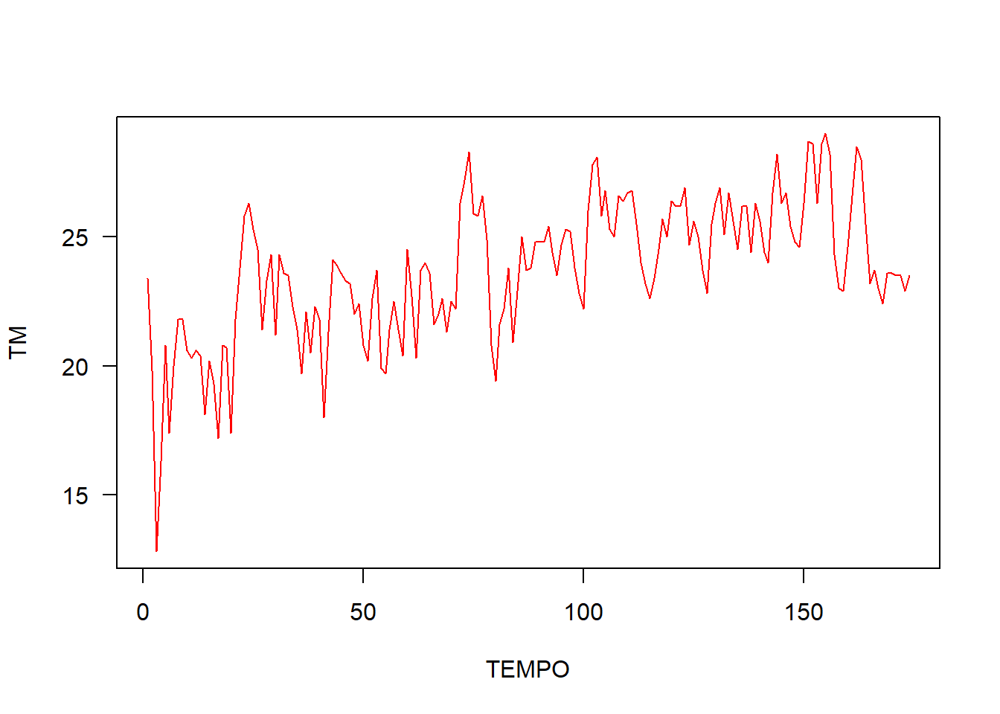


```r
plot(UR~TEMPO, 
     type="lines", 
     col="blue", 
     las=1)
```


<br>

****

## Usando o pacote ggplot2 

****

Obs. Instalar pacote

### Criando a data.frame


```r
data=data.frame(tempo=TEMPO,Umidade=UR,Temperatura=TM)
attach(data)
library(ggplot2)
```

<br>

### Gráficos individuais


```r
ggplot(data, 
       aes(x = tempo))+
  geom_line(aes(y = Temperatura, 
                colour = "Temperatura"), 
            col="red")+
  xlab("Tempo (dias)")
```

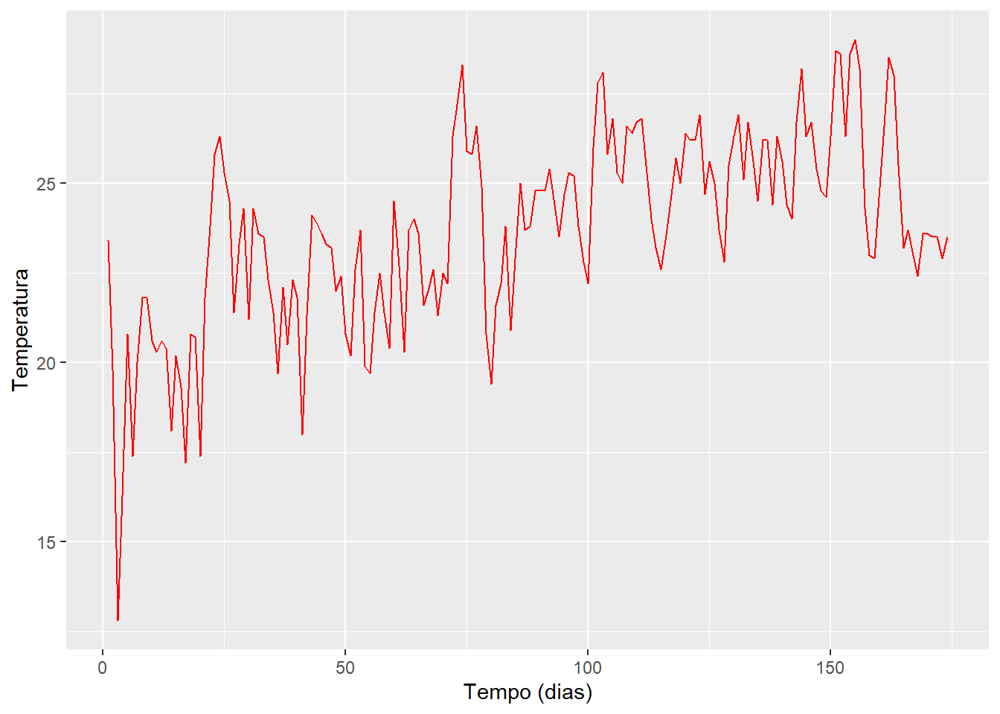


```r
ggplot(data, aes(x = tempo))+geom_line(aes(y = Umidade, colour = "Umidade"), col="blue")+ xlab("Tempo (dias)")
```


<br>

### Juntandos os gráficos


```r
(plots=ggplot(data, aes(x = tempo)) +
  geom_line(aes(y = Umidade, 
                colour = "Umidade"))+  
  scale_x_continuous() + 
  geom_line(aes(y = Temperatura, 
                colour = "Temperatura")))
```


<br>

### Eixo Y secundário


```r
(plots=plots + 
  scale_y_continuous(sec.axis = sec_axis(~ . *1 ), 
    limits = c(0, 100)))
```

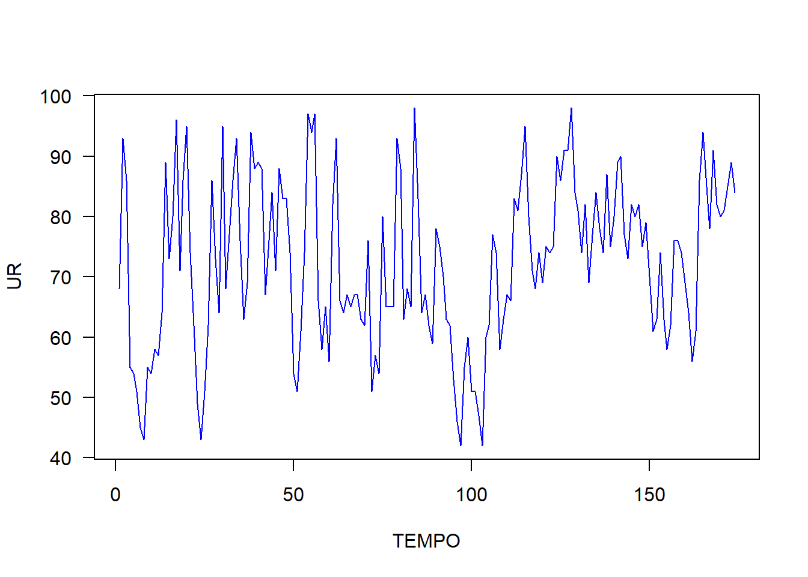

<br>

### Nomeando eixo Y 


```r
(plots=plots+ 
  scale_y_continuous(name = expression("Umidade (%)"), 
                     sec.axis = sec_axis(~ . *1 , 
                                         name = expression("Temperatura"^o*"C"))))
```

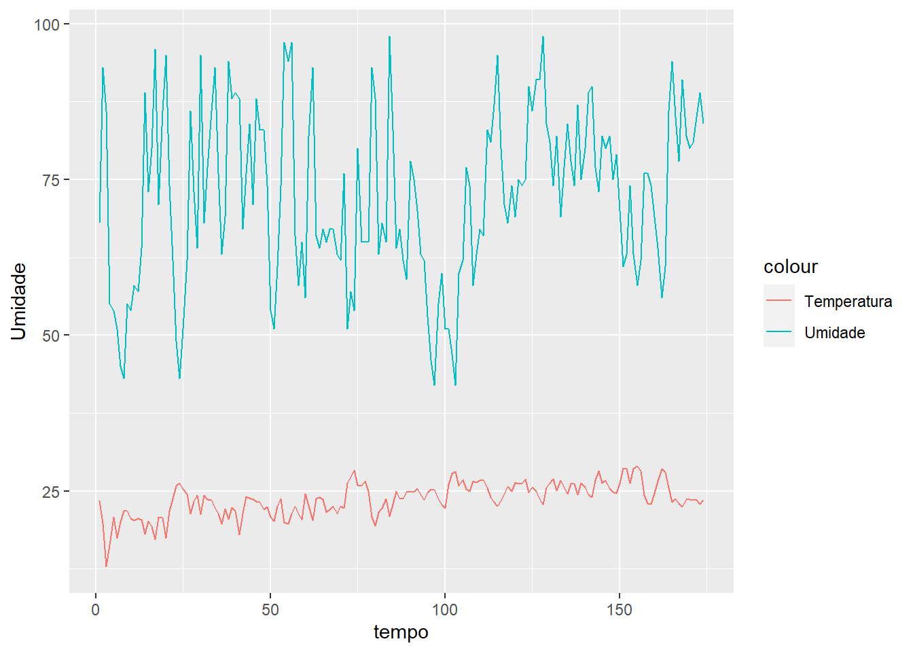

<br>

### Organizando a legenda


```r
(plots=plots+
   scale_colour_manual("", 
                       breaks = c("Umidade", "Temperatura"), 
                       values = c("red","blue")))
```


<br>

### Linha de grade e cor de fundo


```r
(plots=plots+theme_bw()+
   theme(panel.grid.major = element_blank(), 
         panel.grid.minor = element_blank()))
```

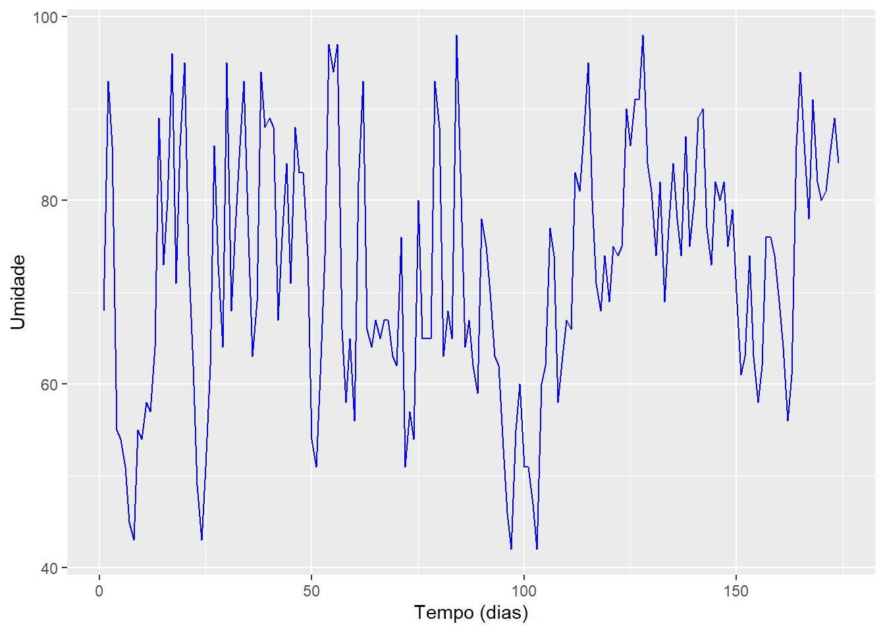

<br><br><br>

****

# Correlação

****

A Matriz de Correlação possibilita a análise simultânea da associação entre variáveis, através do coeficiente de Pearson.

Coeficiente de Pearson

$$\rho = \dfrac{\sum_{i=1}^{n}(x_i-\bar{x})(y_i-\bar{y})}{\sqrt{\sum_{i=1}^n(x_i-\bar{x})^2}\sqrt{\sum_{i=1}^{n}(y_i-\bar{y})^2}}$$


### Conjunto de dados

Variáveis:

- DPF:	Dias para florescimento
- APF:	Altura da planta no florescimento (cm)
- DPM:	Dias para maturação
- APM:	Altura da planta na maturação (cm)
- IPV:	Inserção primeira vagem (cm)
- ACA:	Acamamento 
- PRO:	Produtiviade de grãos em $Kg$ $ha^-1$
- MCG:	Massa de cem grãos (g)


```r
DPF=c(46.00,46.00,46.00,46.00,46.00,46.00,43.00,43.00,43.00,46.00,43.00,43.00,46.00,46.00,46.00,49.00,50.00,46.00,43.00,43.00,46.00,43.00,46.00,43.00,39.00,39.00,43.00,43.00,42.00,45.00,43.00,46.00,46.00,43.00,43.00,43.00,43.00,46.00,43.00,49.00,50.00,43.00,39.00,39.00,39.00)
APF=c(58.33,55.00,50.00,41.00,35.67,43.33,35.67,36.00,35.33,46.67,36.67,49.00,38.33,43.67,44.33,41.00,48.00,43.67,32.67,28.67,36.67,38.33,46.33,53.33,38.00,33.00,32.67,45.67,48.33,46.67,33.67,36.67,42.67,37.00,43.67,35.33,42.33,47.00,47.00,59.67,59.00,48.33,32.33,36.33,33.33)
DPM=c(105.00,105.00,102.00,110.00,110.00,112.00,110.00,110.00,105.00,112.00,112.00,110.00,110.00,112.00,112.00,112.00,112.00,112.00,110.00,105.00,105.00,110.00,102.00,102.00,110.00,105.00,110.00,110.00,110.00,104.00,105.00,105.00,104.00,104.00,104.00,102.00,104.00,105.00,102.00,110.00,112.00,112.00,102.00,102.00,102.00)
APM=c(100.00,90.33,97.00,91.33,97.67,77.33,90.00,93.00,91.33,98.00,84.67,91.33,92.33,101.67,102.33,102.33,98.33,93.00,78.67,72.33,72.33,97.67,104.33,96.00,99.00,97.00,94.33,104.67,115.00,117.67,81.33,82.33,83.00,104.33,107.33,103.00,89.33,90.33,82.33,123.33,115.00,133.33,60.00,59.00,65.67)
IPV=c(15.00,20.00,17.00,10.00,22.67,14.33,23.00,19.33,15.33,14.33,15.00,22.67,14.67,15.33,17.00,13.67,16.67,19.33,11.00,8.67,11.33,13.00,14.67,13.00,13.00,12.00,17.67,14.67,10.67,25.00,18.00,14.00,18.67,15.67,11.00,18.00,16.33,24.33,17.00,13.33,11.00,22.33,10.33,5.67,14.00)
ACA=c(2.00,1.90,2.20,1.50,1.20,1.00,2.00,1.50,1.20,3.00,1.40,1.60,1.80,2.50,2.50,2.00,1.70,1.80,1.50,2.00,1.50,1.80,2.00,1.80,1.30,1.20,2.00,3.00,2.00,3.00,1.50,1.80,2.20,1.80,1.80,2.00,1.80,3.50,3.50,1.50,2.50,2.00,1.20,1.00,1.20)
PRO=c(2444.44,2870.37,2314.81,2629.63,2444.44,2592.59,2962.96,3037.04,3037.04,2592.59,2296.30,2444.44,2370.37,3481.48,2555.56,1981.48,2611.11,1925.93,1870.37,2518.52,2370.37,2462.96,2351.85,2000.00,2703.70,2685.19,2166.67,2129.63,2222.22,1814.81,2537.04,2351.85,2333.33,3370.37,2462.96,3129.63,2666.67,2796.30,2055.56,2333.33,2240.74,2092.59,2703.70,2129.63,2740.74)
MCG=c(10.78,10.96,10.07,10.77,11.17,11.24,12.57,13.35,13.77,14.23,13.61,13.30,11.85,11.80,12.04,10.10,10.19,9.97,12.15,11.35,11.70,12.83,11.52,11.10,10.95,11.14,10.26,12.51,11.87,12.30,14.20,13.13,14.70,13.08,12.76,13.74,14.59,13.98,13.52,12.72,12.22,12.63,10.93,10.65,10.67)
dados=data.frame(DPF,APF,DPM,APM,IPV,ACA,PRO,MCG)
```

<br>

### Matriz de correlação


```r
M<-cor(dados)
head(round(M,2))
```

```
##      DPF  APF  DPM  APM  IPV  ACA   PRO   MCG
## DPF 1,00 0,56 0,39 0,39 0,21 0,33 -0,13 -0,04
## APF 0,56 1,00 0,12 0,57 0,17 0,41 -0,23 -0,03
## DPM 0,39 0,12 1,00 0,37 0,11 0,00 -0,08 -0,09
## APM 0,39 0,57 0,37 1,00 0,32 0,35 -0,09  0,09
## IPV 0,21 0,17 0,11 0,32 1,00 0,36  0,10  0,28
## ACA 0,33 0,41 0,00 0,35 0,36 1,00 -0,14  0,30
```

Instalar pacote corrplot

<br>

### Formato de Círculo


```r
library(corrplot)
corrplot(M, method="circle")
```

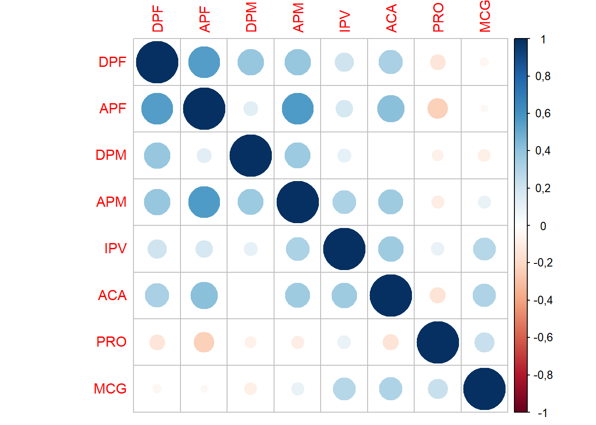

<br>

### Formato de quadrado preenchido


```r
corrplot(M, method="color")
```


<br>

### Formato Numérico


```r
corrplot(M, method="number")
```

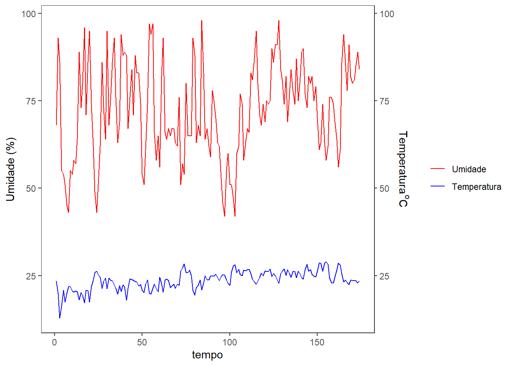

<br>

### Circulo - matriz superior


```r
corrplot(M, type="upper")
```

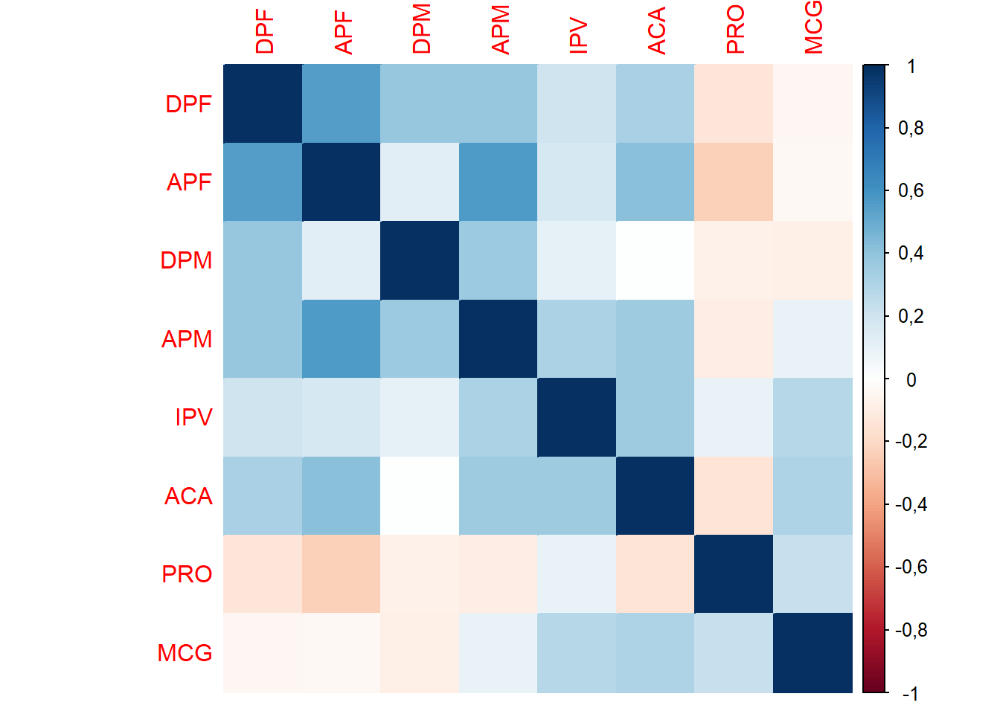

<br>

### Circulo - matriz inferior


```r
corrplot(M, type="lower")
```

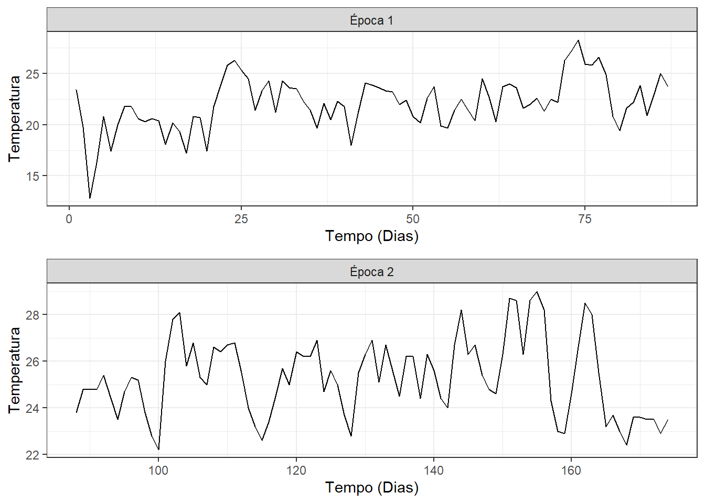

<br>

### Quadrado preenchido, número e sem a diagonal


```r
corrplot(M, method="color",  
         type="upper",
         addCoef.col = "black", insig = "blank", diag=FALSE )
```

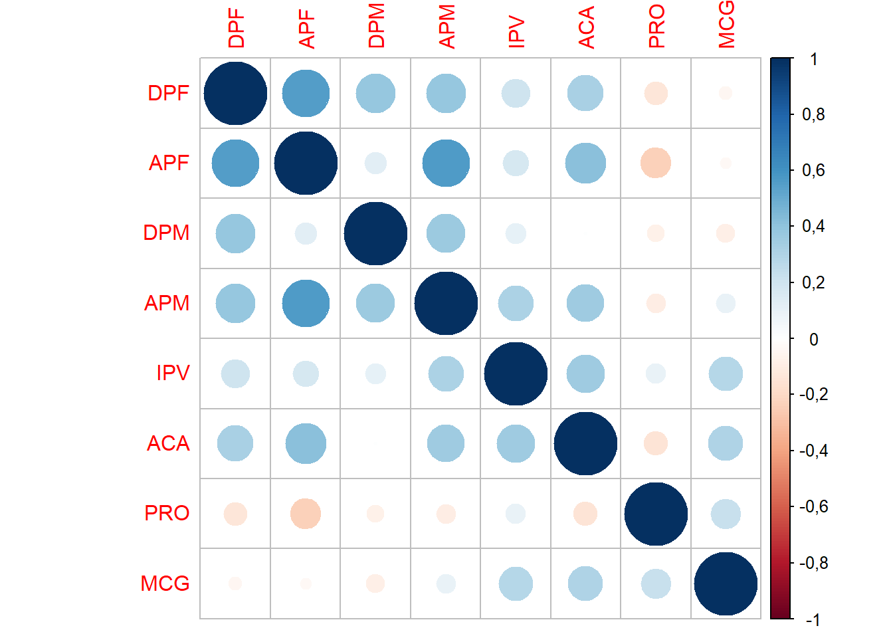

<br>

### Escala cinza


```r
corrplot(M, method="color",  
         type="upper", col=gray.colors(100)[100:1],
         addCoef.col = "black", insig = "blank", diag=FALSE)
```


<br>

### Cor da legenda


```r
corrplot(M, method="color", tl.col="black", 
         type="upper", col=gray.colors(100)[100:1],
         addCoef.col = "black", insig = "blank", diag=FALSE )
```

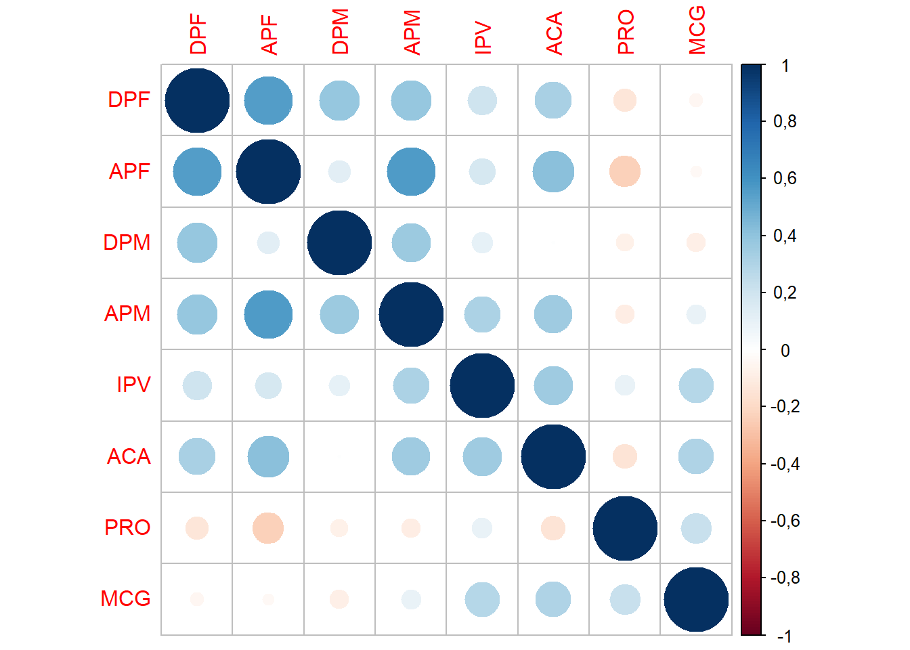

<br>

### Modificando a fonte


```r
par(family="serif")
corrplot(M, method="color", tl.col="black", 
         type="upper", col=gray.colors(100)[100:1],
         addCoef.col = "black", insig = "blank", diag=FALSE )
```

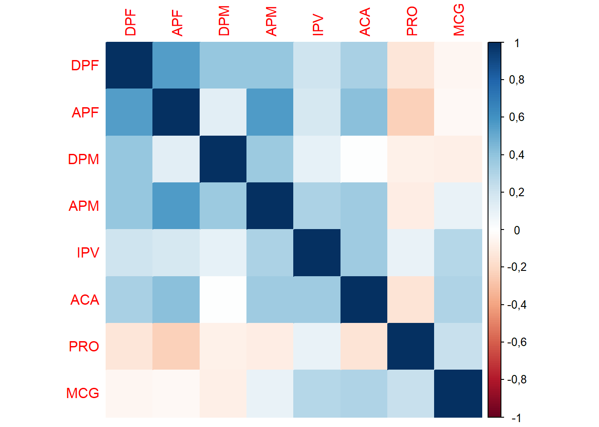

<br>

### Cor do valor da correlação


```r
par(family="serif")
corrplot(M, method="color", tl.col="black", 
         type="upper", col=gray.colors(100)[100:1],
         addCoef.col = "green", insig = "blank", diag=FALSE 
         )
```

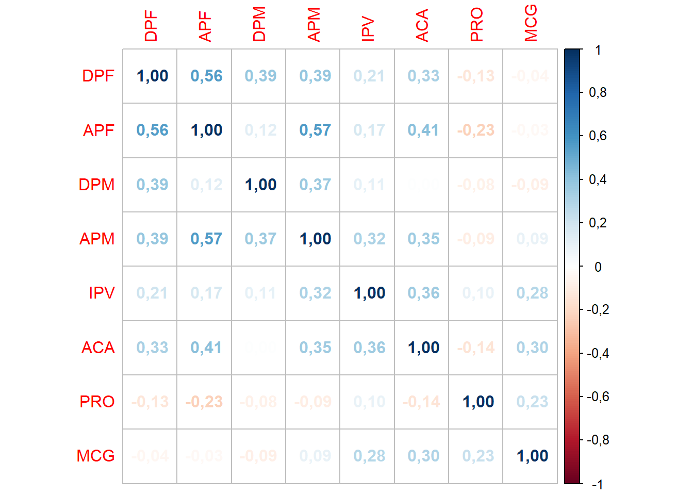

<br><br><br>

****

## Matriz de Correlação

****

<br>

### Conjunto de dados


```r
DPF=c(46.00,46.00,46.00,46.00,46.00,46.00,43.00,43.00,43.00,46.00,43.00,43.00,46.00,46.00,46.00,49.00,50.00,46.00,43.00,43.00,46.00,43.00,46.00,43.00,39.00,39.00,43.00,43.00,42.00,45.00,43.00,46.00,46.00,43.00,43.00,43.00,43.00,46.00,43.00,49.00,50.00,43.00,39.00,39.00,39.00)
APF=c(58.33,55.00,50.00,41.00,35.67,43.33,35.67,36.00,35.33,46.67,36.67,49.00,38.33,43.67,44.33,41.00,48.00,43.67,32.67,28.67,36.67,38.33,46.33,53.33,38.00,33.00,32.67,45.67,48.33,46.67,33.67,36.67,42.67,37.00,43.67,35.33,42.33,47.00,47.00,59.67,59.00,48.33,32.33,36.33,33.33)
DPM=c(105.00,105.00,102.00,110.00,110.00,112.00,110.00,110.00,105.00,112.00,112.00,110.00,110.00,112.00,112.00,112.00,112.00,112.00,110.00,105.00,105.00,110.00,
102.00,102.00,110.00,105.00,110.00,110.00,110.00,104.00,105.00,105.00,104.00,104.00,104.00,102.00,104.00,105.00,102.00,110.00,112.00,112.00,102.00,102.00,102.00)
APM=c(100.00,90.33,97.00,91.33,97.67,77.33,90.00,93.00,91.33,98.00,84.67,91.33,92.33,101.67,102.33,102.33,98.33,93.00,78.67,72.33,72.33,97.67,104.33,96.00,99.00,97.00,94.33,104.67,115.00,117.67,81.33,82.33,83.00,104.33,107.33,103.00,89.33,90.33,82.33,123.33,115.00,133.33,60.00,59.00,65.67)
IPV=c(15.00,20.00,17.00,10.00,22.67,14.33,23.00,19.33,15.33,14.33,15.00,22.67,14.67,15.33,17.00,13.67,16.67,19.33,11.00,8.67,11.33,13.00,14.67,13.00,13.00,12.00,17.67,14.67,10.67,25.00,18.00,14.00,18.67,15.67,11.00,18.00,16.33,24.33,17.00,13.33,11.00,22.33,10.33,5.67,14.00)
ACA=c(2.00,1.90,2.20,1.50,1.20,1.00,2.00,1.50,1.20,3.00,1.40,1.60,1.80,2.50,2.50,2.00,1.70,1.80,1.50,2.00,1.50,1.80,2.00,1.80,1.30,1.20,2.00,3.00,2.00,3.00,1.50,1.80,2.20,1.80,1.80,2.00,1.80,3.50,3.50,1.50,2.50,2.00,1.20,1.00,1.20)
PRO=c(2444.44,2870.37,2314.81,2629.63,2444.44,2592.59,2962.96,3037.04,3037.04,2592.59,2296.30,2444.44,2370.37,3481.48,2555.56,1981.48,2611.11,1925.93,1870.37,2518.52,2370.37,2462.96,2351.85,2000.00,2703.70,2685.19,2166.67,2129.63,2222.22,1814.81,2537.04,2351.85,2333.33,3370.37,2462.96,3129.63,2666.67,2796.30,2055.56,2333.33,2240.74,2092.59,2703.70,2129.63,2740.74)
MCG=c(10.78,10.96,10.07,10.77,11.17,11.24,12.57,13.35,13.77,14.23,13.61,13.30,11.85,11.80,12.04,10.10,10.19,9.97,12.15,11.35,11.70,12.83,11.52,11.10,10.95,11.14,10.26,12.51,11.87,12.30,14.20,13.13,14.70,13.08,12.76,13.74,14.59,13.98,13.52,12.72,12.22,12.63,10.93,10.65,10.67)
```

<br>

### Criando uma data.frame


```r
dados=data.frame(DPF,APF,DPM,APM,IPV,ACA,PRO,MCG)
```

<br>

### Matriz de correlação


```r
corre=cor(dados[c(1:8),c(1:8)])
```

<br>

### Construindo o Gráfico

Instalar pacote (PerformanceAnalytics)


```r
library(PerformanceAnalytics)
chart.Correlation(dados, pch=19)
```

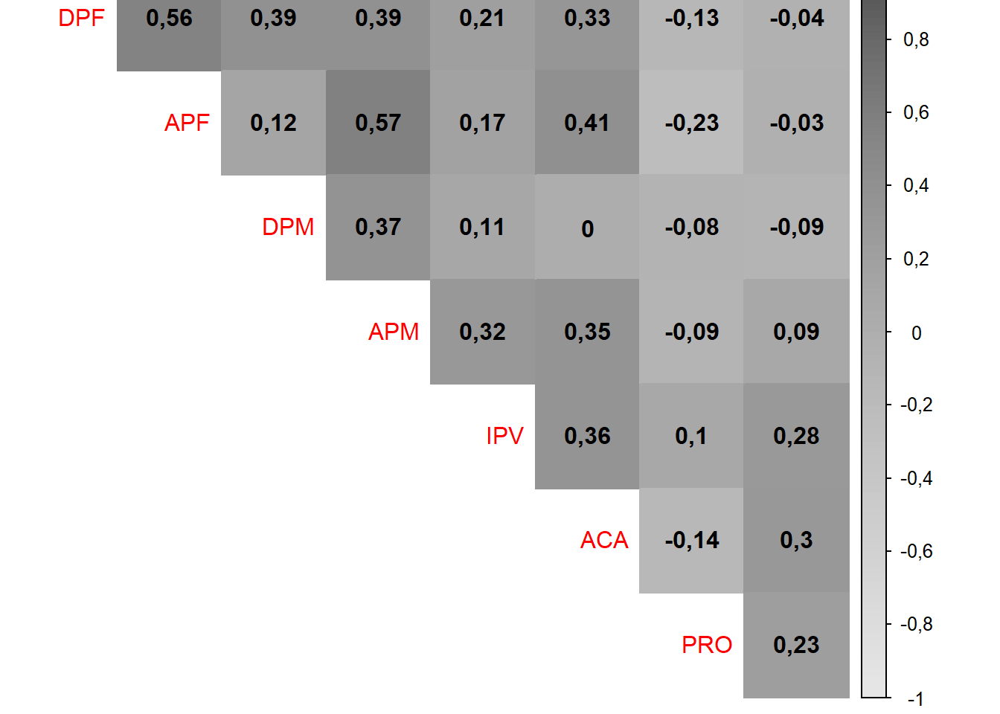

### Conjunto de dados


```r
ph=c(5.4,6.7,6.8,5.9,6.3,6.2,6.3,6,6.1,5.8,6.7,5.7,6.8,6.9,6.5,6.9,6.8,6.7,6.5,6.5,6.7,6.7,6.5,6.7,6.6,6.8,6.4,4.6,6.5,6.6,6.3,6.2,5.5,4.5,5.2,6.5,6.3,6.6,6.4,6.6,6.6,6.5,6.5,6.4,6.5,6.8,6.7,6.6,5.9,6.1,6.3,6.3,6.2,5.3,5.8,6.1,6.7,6.7,6.6,6.6,6.6,6.8,6.8,6.7,6.9,7,7.1,7.1,6.7,6.7,6.6,6.6,6.3,5.8,6.2,6.3,6,5,6.3,5.3,5.4,6.4,6.7,6.5,6.5,6.4,6.7,6.5,6.8,6.2,6.1,6.2,6.8,6.7,6.6,6.4,6.7,6.6,6.4,5.9,6.5,6.6,5.9,6.8,6.8,6.7,6.5,6.7,6.9,6.5,6.8,6.7,6.8,6.6,6.7,6.7,6.9,6.9,6.7,6.8)
HAL=c(4.6,2.7,2.7,3.9,3.4,3.6,3.4,3.9,3.6,3.9,2.5,4.2,2.5,2.5,3.1,2.5,2.5,2.9,3.1,3.1,2.7,2.9,2.9,2.9,3.1,2.7,3.4,8.3,2.9,2.9,3.6,3.1,4.9,8.3,5.3,3.1,2.7,2.7,2.7,2.7,3.1,3.1,2.7,3.1,2.5,2.5,2.9,2.9,3.9,3.9,3.6,3.4,3.9,5.3,3.9,3.9,2.9,2.7,2.9,3.1,2.7,2.1,2.3,2.3,2.3,2.1,2.0,2.1,2.5,2.3,2.5,2.5,3.1,3.6,2.9,2.9,3.4,4.9,2.5,4.6,4.2,2.5,2.3,2.5,2.7,2.5,2.1,2.5,2.1,2.9,2.9,2.9,2.1,2.3,2.5,2.7,2.5,2.5,2.7,3.6,2.7,2.5,3.4,2.0,2.3,2.3,2.7,2.3,2.1,2.5,2.1,2.3,2.3,2.5,2.5,2.3,2.1,2.3,2.3,2.1)
K=c(0.5,0.7,0.7,0.9,0.9,0.8,0.6,0.9,0.8,0.6,0.5,0.4,2.0,1.9,1.0,1.2,1.2,1.6,1.5,0.9,2.0,1.2,1.6,1.4,0.9,0.8,0.8,1.0,0.9,1.1,1.2,1.1,0.6,0.5,0.6,0.9,1.4,1.6,1.3,1.5,0.9,1.2,1.3,1.0,1.4,0.7,0.7,1.0,1.0,0.7,0.8,1.3,0.7,0.7,0.8,0.8,1.3,0.9,1.2,0.8,1.5,1.4,0.8,1.0,1.4,1.1,1.6,1.0,0.9,1.1,1.1,0.9,1.0,0.7,0.6,1.0,1.0,0.7,1.0,0.6,0.9,1.2,0.8,0.8,0.8,0.7,1.1,1.2,0.8,0.9,0.9,1.2,1.1,1.1,1.2,0.9,0.8,0.7,0.9,0.7,0.8,0.9,0.5,0.8,1.0,0.7,0.8,0.7,1.4,0.9,1.4,0.9,1.0,1.3,0.7,1.3,1.4,0.9,0.8,1.4)
P=c(13.7,14.5,65.7,20.5,20.7,19.3,16.2,14.6,15.8,8.7,8.9,7.7,20.0,18.4,9.4,14.8,17.5,11.7,11.2,11.1,51.4,20.4,27.3,14.1,20.1,18.1,23.5,36.4,16.9,18.6,29.0,20.9,16.8,16.8,8.6,11.3,17.5,17.0,30.9,17.2,10.7,17.2,10.9,14.5,26.6,42.1,10.5,13.5,16.4,13.3,34.7,20.0,12.8,15.1,15.8,14.1,26.9,33.2,25.4,25.1,14.1,17.7,12.6,12.9,27.5,18.6,16.9,15.5,16.2,17.6,17.5,14.5,12.6,10.5,10.6,10.5,14.7,10.1,10.7,9.6,17.9,23.9,22.4,22.0,14.2,15.8,12.8,17.8,16.0,10.5,9.6,13.8,17.5,17.7,10.0,10.1,29.0,16.8,18.6,31.7,17.2,40.2,9.8,14.5,28.8,13.0,13.1,18.6,22.0,36.0,19.5,25.2,14.2,15.8,11.9,16.7,20.0,14.7,11.7,17.9)
Ca=c(3.43,4.24,5.37,4.13,4.48,4.65,4.33,4.19,3.91,3.23,4.01,2.98,4.55,4.53,3.91,4.33,4.62,4.54,3.38,3.87,3.85,3.91,3.79,4.57,4.71,4.75,4.93,4.32,4.08,3.73,3.30,3.88,2.59,1.99,2.27,3.68,4.94,5.29,5.69,5.67,4.55,5.01,4.85,4.76,4.99,5.13,4.40,4.38,3.05,3.78,4.21,4.22,3.55,2.81,2.98,3.35,4.03,3.80,3.88,3.97,4.32,4.81,5.06,4.98,5.46,4.88,5.37,5.36,5.41,5.05,5.22,4.95,6.06,3.51,3.72,3.25,2.74,1.78,2.86,2.31,3.63,4.91,4.47,4.85,4.78,6.76,4.31,4.62,4.54,3.10,2.88,3.66,5.56,5.08,4.89,4.67,5.71,5.47,4.68,4.72,4.45,4.23,3.36,4.27,4.31,3.48,3.42,4.38,5.37,7.21,5.40,5.71,4.53,4.35,3.87,3.68,4.18,4.95,4.40,4.84)
Mg=c(2.24,3.22,3.20,2.46,2.51,2.65,2.84,2.80,2.56,2.56,3.45,2.43,3.17,3.25,2.89,3.30,3.34,3.28,2.91,3.00,3.29,2.83,2.89,2.86,2.82,3.15,2.49,2.65,2.95,3.20,2.88,3.10,2.28,1.92,2.05,3.18,3.19,3.13,3.35,3.44,3.27,3.18,3.35,3.24,3.29,3.37,3.21,3.19,2.50,2.01,2.61,2.74,2.42,2.05,2.29,2.36,3.33,3.30,3.03,2.90,2.99,3.34,3.33,3.35,3.30,3.10,3.47,3.30,3.30,3.23,3.25,3.23,3.49,2.40,2.70,2.83,2.78,1.98,2.89,2.30,2.35,3.20,3.45,2.74,2.97,4.56,3.28,2.80,3.03,2.79,2.68,2.95,3.43,3.38,3.30,3.13,3.25,3.06,2.99,2.49,2.84,2.81,2.22,3.48,3.08,2.80,2.62,2.79,3.30,3.39,3.23,3.14,3.31,2.94,3.03,3.17,2.98,3.38,3.13,3.21)
V=c(57.27,75.06,77.30,65.31,69.75,68.82,69.49,66.52,66.47,61.75,75.94,57.72,79.32,79.29,71.24,77.71,78.33,76.18,71.19,71.14,76.94,72.96,73.78,75.10,72.70,76.02,70.72,48.85,73.04,73.25,66.68,71.78,52.34,34.52,48.24,70.98,77.75,78.59,79.11,79.57,73.40,74.76,77.59,73.97,79.17,78.45,73.85,74.40,62.52,62.12,67.51,70.86,62.69,51.35,60.67,62.34,74.62,74.63,73.41,70.85,76.35,81.43,79.59,79.78,81.17,80.69,83.74,81.62,79.09,79.87,79.09,78.23,76.80,64.16,70.53,70.54,65.82,47.34,72.73,53.10,61.80,78.52,78.78,76.85,75.73,82.58,80.00,77.24,79.24,69.95,68.90,72.68,82.19,80.29,78.75,76.06,79.42,78.49,75.87,68.39,74.74,75.88,64.04,80.92,78.00,74.94,71.55,76.95,82.11,81.94,82.16,80.58,78.89,77.11,75.13,77.63,79.68,79.73,77.91,81.24)
dados=data.frame(ph,HAL,K,P,Ca,Mg,V)
```

<br>

### Usando o GGally


```r
library(GGally)
ggpairs(dados)
```

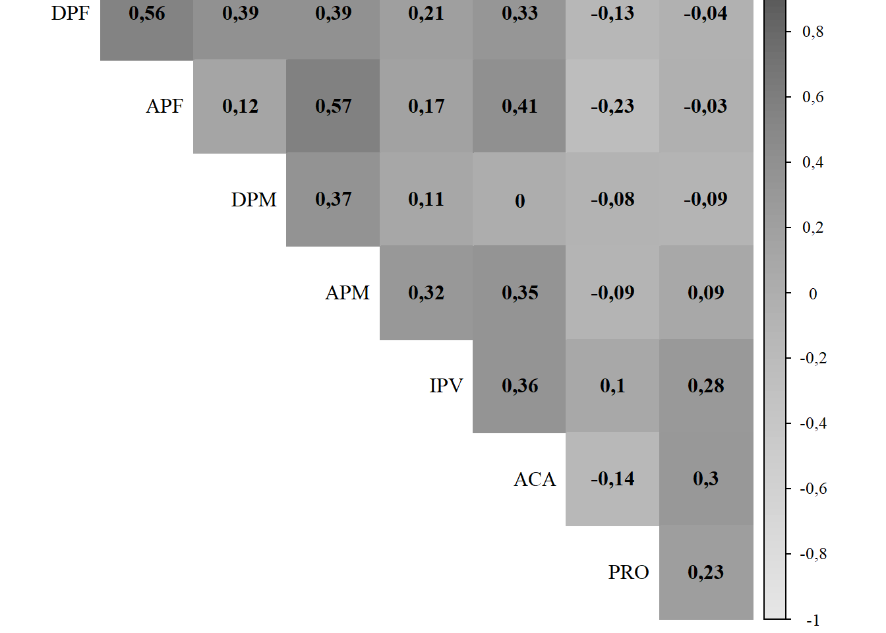

<br>

### Usando a package psych


```r
library(psych)
pairs.panels(dados)
```

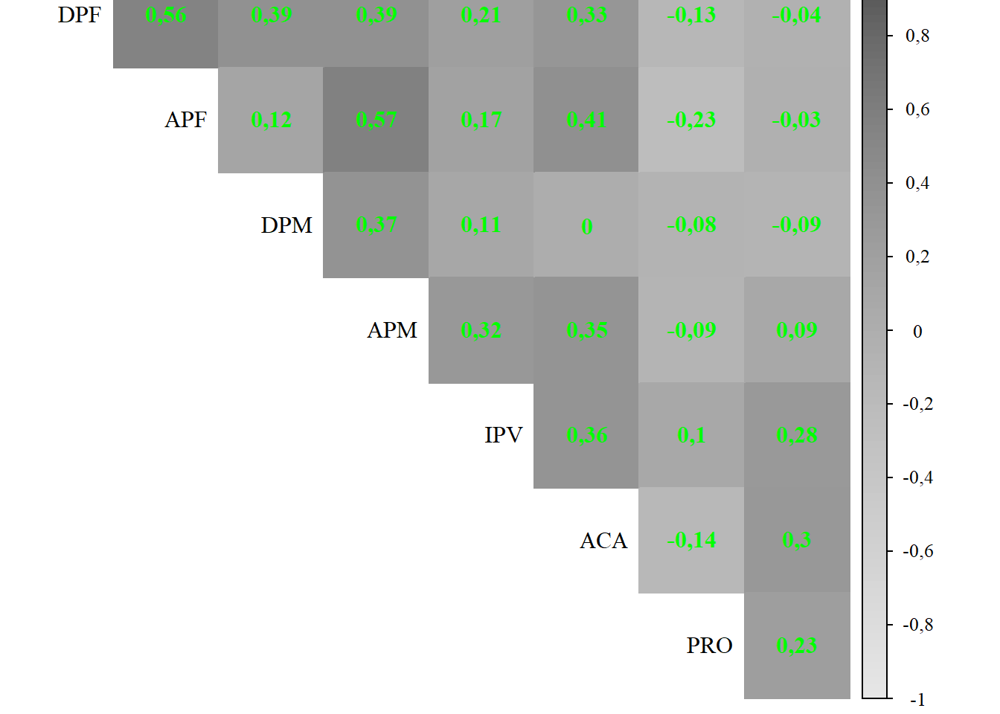

<br><br>

****

## Rede de correlação

****

### Conjunto de dados


```r
DPF=c(46.00,46.00,46.00,46.00,46.00,46.00,43.00,43.00,43.00,46.00,43.00,43.00,46.00,46.00,46.00,49.00,50.00,46.00,43.00,43.00,46.00,43.00,46.00,43.00,39.00,39.00,43.00,43.00,42.00,45.00,43.00,46.00,46.00,43.00,43.00,43.00,43.00,46.00,43.00,49.00,50.00,43.00,39.00,39.00,39.00)
APF=c(58.33,55.00,50.00,41.00,35.67,43.33,35.67,36.00,35.33,46.67,36.67,49.00,38.33,43.67,44.33,41.00,48.00,43.67,32.67,28.67,36.67,38.33,46.33,53.33,38.00,33.00,32.67,45.67,48.33,46.67,33.67,36.67,42.67,37.00,43.67,35.33,42.33,47.00,47.00,59.67,59.00,48.33,32.33,36.33,33.33)
DPM=c(105.00,105.00,102.00,110.00,110.00,112.00,110.00,110.00,105.00,112.00,112.00,110.00,110.00,112.00,112.00,112.00,112.00,112.00,110.00,105.00,105.00,110.00,102.00,102.00,110.00,105.00,110.00,110.00,110.00,104.00,105.00,105.00,104.00,104.00,104.00,102.00,104.00,105.00,102.00,110.00,112.00,112.00,102.00,102.00,102.00)
APM=c(100.00,90.33,97.00,91.33,97.67,77.33,90.00,93.00,91.33,98.00,84.67,91.33,92.33,101.67,102.33,102.33,98.33,93.00,78.67,72.33,72.33,97.67,104.33,96.00,99.00,97.00,94.33,104.67,115.00,117.67,81.33,82.33,83.00,104.33,107.33,103.00,89.33,90.33,82.33,123.33,115.00,133.33,60.00,59.00,65.67)
IPV=c(15.00,20.00,17.00,10.00,22.67,14.33,23.00,19.33,15.33,14.33,15.00,22.67,14.67,15.33,17.00,13.67,16.67,19.33,11.00,8.67,11.33,13.00,14.67,13.00,13.00,12.00,17.67,14.67,10.67,25.00,18.00,14.00,18.67,15.67,11.00,18.00,16.33,24.33,17.00,13.33,11.00,22.33,10.33,5.67,14.00)
ACA=c(2.00,1.90,2.20,1.50,1.20,1.00,2.00,1.50,1.20,3.00,1.40,1.60,1.80,2.50,2.50,2.00,1.70,1.80,1.50,2.00,1.50,1.80,2.00,1.80,1.30,1.20,2.00,3.00,2.00,3.00,1.50,1.80,2.20,1.80,1.80,2.00,1.80,3.50,3.50,1.50,2.50,2.00,1.20,1.00,1.20)
PRO=c(2444.44,2870.37,2314.81,2629.63,2444.44,2592.59,2962.96,3037.04,3037.04,2592.59,2296.30,2444.44,2370.37,3481.48,2555.56,1981.48,2611.11,1925.93,1870.37,2518.52,2370.37,2462.96,2351.85,2000.00,2703.70,2685.19,2166.67,2129.63,2222.22,1814.81,2537.04,2351.85,2333.33,3370.37,2462.96,3129.63,2666.67,2796.30,2055.56,2333.33,2240.74,2092.59,2703.70,2129.63,2740.74)
MCG=c(10.78,10.96,10.07,10.77,11.17,11.24,12.57,13.35,13.77,14.23,13.61,13.30,11.85,11.80,12.04,10.10,10.19,9.97,12.15,11.35,11.70,12.83,11.52,11.10,10.95,11.14,10.26,12.51,11.87,12.30,14.20,13.13,14.70,13.08,12.76,13.74,14.59,13.98,13.52,12.72,12.22,12.63,10.93,10.65,10.67)
```

<br>

### Criando uma data.frame


```r
dados=data.frame(DPF,APF,DPM,APM,IPV,ACA,PRO,MCG)
```

<br>

### Matriz de correlação (Pearson)


```r
corre=cor(dados[c(1:8),c(1:8)])
```

<br>

### Construindo o Gráfico

Instalar pacote (qgraph)


```r
library(qgraph)
```

```
## Error : invalid version specification '1,5'
```

```r
qgraph(corre, shape="circle", 
       posCol="darkgreen", 
       negCol="darkred", layout="groups", vsize=10)
```

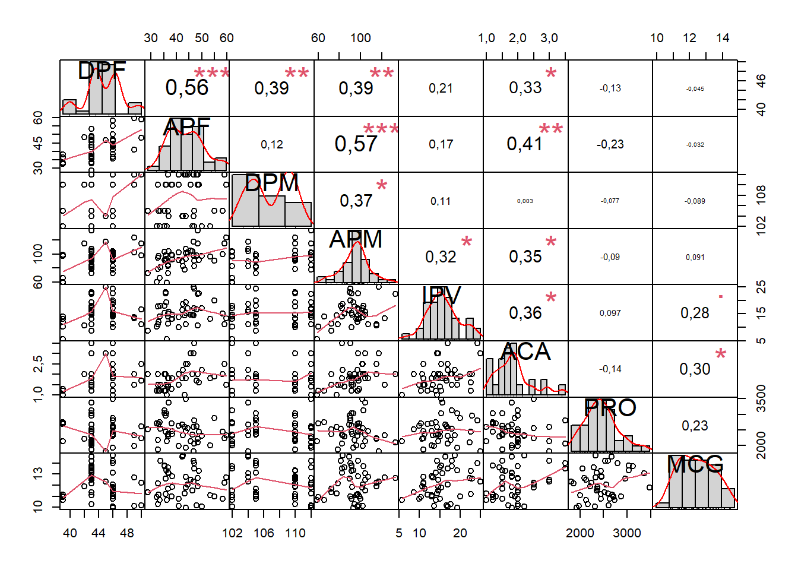

<br>

### Matriz de correlação (Kendall)


```r
corre=cor(dados[c(1:8),c(1:8)], method = "kendall")
```

<br>

### Construindo o Gráfico

Instalar pacote (qgraph)


```r
library(qgraph)
qgraph(corre, shape="circle", 
       posCol="darkgreen", 
       negCol="darkred", layout="groups", vsize=10)
```

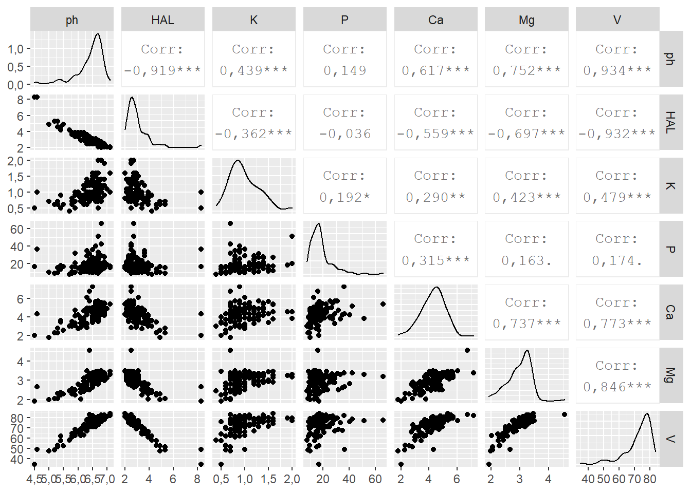

<br>

### Matriz de correlação (Spearman)


```r
corre=cor(dados[c(1:8),c(1:8)], method = "spearman")
```

<br>

### Construindo o Gráfico

Instalar pacote (qgraph)


```r
library(qgraph)
qgraph(corre, shape="circle", 
       posCol="darkgreen", 
       negCol="darkred", layout="groups", vsize=10)
```

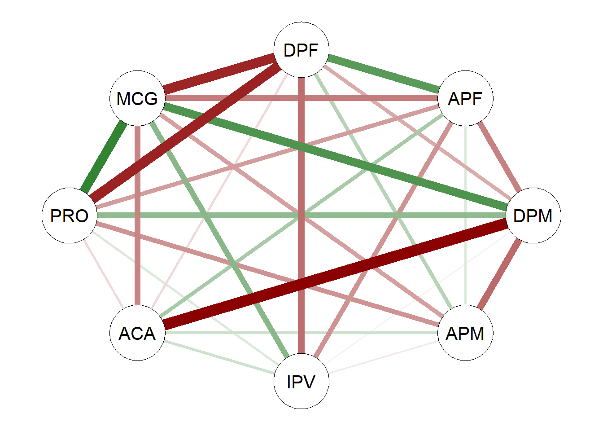

<br><br><br>

****

# Radar

****

<br>

Um gráfico de radar é um método gráfico de apresentar dados multivariáveis na forma de um gráfico bidimensional de três ou mais variáveis quantitativas representadas em eixos que partem do mesmo ponto. A posição relativa e o ãngulo dos eixos normalmente é pouco informativo.

O gráfico de radar é também conhecido como gráfico de teia, gráfico de aranha, gráfico de estrela, polígono irregular, gráfico polar, ou diagrama Kiviat.

<br>

### Conjunto de dados


```r
cor=c(6,6,6,7,7,7,3,4,3,3,3,3,6,6,7,6,6,7,6,7,5,6,5,3,3,5,5,5,3,3)
aroma=c(6,7,5,6,6,7,3,3,3,3,5,3,4,6,6,6,5,7,5,6,5,3,3,6,4,4,5,5,4,3)
sabor=c(5,6,6,6,5,6,3,4,3,4,2,2,3,6,7,6,7,7,6,6,5,4,5,3,6,6,5,5,4,6)
corpo=c(6,5,4,6,4,5,4,4,4,5,2,4,6,6,5,6,6,7,5,6,4,5,5,4,4,5,5,4,2,4)
global=c(5,6,6,7,5,6,3,4,3,3,2,3,4,6,6,6,6,7,6,6,5,6,5,5,4,5,5,4,3,5)
(Amostra=rep(c(paste("A", 1:5)), e=6))
```

```
##  [1] "A 1" "A 1" "A 1" "A 1" "A 1" "A 1" "A 2" "A 2" "A 2" "A 2" "A 2" "A 2"
## [13] "A 3" "A 3" "A 3" "A 3" "A 3" "A 3" "A 4" "A 4" "A 4" "A 4" "A 4" "A 4"
## [25] "A 5" "A 5" "A 5" "A 5" "A 5" "A 5"
```

```r
dados=data.frame(Amostra, cor, aroma, sabor, corpo, global)
```

**Tratamentos**:

- B100: 100% de B (Amostra A1)
- N100: 100% de N (Amostra A2)
- B75N25: 75% de B e 25% de N (Amostra A3)
- B50N50: 50% de B e 50% de N (Amostra A4)
- B25N75: 25% de B e 75% de N (Amostra A5)

### Média por variável


```r
mediacor=tapply(cor, Amostra, mean)
mediaaroma=tapply(aroma, Amostra, mean)
mediasabor=tapply(sabor, Amostra, mean)
mediacorpo=tapply(corpo, Amostra, mean)
mediaglobal=tapply(global, Amostra, mean)
medias=c(mediacor,mediaaroma, mediasabor,mediacorpo,mediaglobal)
```

<br>

### Pacote radarchart

<br>

### Lista com as médias

<br>


```r
labs=c("Cor","Aroma","Sabor","Corpo","Global")
scores=list("B100"=as.numeric(medias[c(1,6,11,16,21)]),
            "N100"=as.numeric(medias[c(2,7,12,17,22)]),
            "B75N25"=as.numeric(medias[c(3,8,13,18,23)]),  
            "B50N50"=as.numeric(medias[c(4,9,14,19,24)]),
            "B25N75"=as.numeric(medias[c(5,10,15,20,25)]))
```

Instalar pacote radarchart


```r
library(radarchart)
chartJSRadar(scores = scores,
             labs=labs, 
             plwd=4 , 
             plty=1,
             axistype=0, 
             maxmin=F,
             cglcol="grey", 
             cglty=1, 
             axislabcol="grey", 
             caxislabels=seq(0,20,5), 
             cglwd=0.8,
             vlcex=0.8)
```

<!--html_preserve--><canvas id="htmlwidget-b20dc2a931752ae4f30d" class="chartJSRadar html-widget" width="672" height="480"></canvas>
<script type="application/json" data-for="htmlwidget-b20dc2a931752ae4f30d">{"x":{"data":{"labels":["Cor","Aroma","Sabor","Corpo","Global"],"datasets":[{"label":"B100","data":[6.5,6.16666666666667,5.66666666666667,5,5.83333333333333],"backgroundColor":"rgba(255,0,0,0,2)","borderColor":"rgba(255,0,0,0,8)","pointBackgroundColor":"rgba(255,0,0,0,8)","pointBorderColor":"#fff","pointHoverBackgroundColor":"#fff","pointHoverBorderColor":"rgba(255,0,0,0,8)"},{"label":"N100","data":[3.16666666666667,3.33333333333333,3,3.83333333333333,3],"backgroundColor":"rgba(0,255,0,0,2)","borderColor":"rgba(0,255,0,0,8)","pointBackgroundColor":"rgba(0,255,0,0,8)","pointBorderColor":"#fff","pointHoverBackgroundColor":"#fff","pointHoverBorderColor":"rgba(0,255,0,0,8)"},{"label":"B75N25","data":[6.33333333333333,5.66666666666667,6,6,5.83333333333333],"backgroundColor":"rgba(0,0,255,0,2)","borderColor":"rgba(0,0,255,0,8)","pointBackgroundColor":"rgba(0,0,255,0,8)","pointBorderColor":"#fff","pointHoverBackgroundColor":"#fff","pointHoverBorderColor":"rgba(0,0,255,0,8)"},{"label":"B50N50","data":[5.33333333333333,4.66666666666667,4.83333333333333,4.83333333333333,5.5],"backgroundColor":"rgba(255,255,0,0,2)","borderColor":"rgba(255,255,0,0,8)","pointBackgroundColor":"rgba(255,255,0,0,8)","pointBorderColor":"#fff","pointHoverBackgroundColor":"#fff","pointHoverBorderColor":"rgba(255,255,0,0,8)"},{"label":"B25N75","data":[4,4.16666666666667,5.33333333333333,4,4.33333333333333],"backgroundColor":"rgba(255,0,255,0,2)","borderColor":"rgba(255,0,255,0,8)","pointBackgroundColor":"rgba(255,0,255,0,8)","pointBorderColor":"#fff","pointHoverBackgroundColor":"#fff","pointHoverBorderColor":"rgba(255,0,255,0,8)"}]},"options":{"responsive":true,"title":{"display":false,"text":null},"scale":{"ticks":{"min":0},"pointLabels":{"fontSize":18}},"tooltips":{"enabled":true,"mode":"label"},"legend":{"display":true},"plwd":4,"plty":1,"axistype":0,"maxmin":false,"cglcol":"grey","cglty":1,"axislabcol":"grey","caxislabels":[0,5,10,15,20],"cglwd":0.8,"vlcex":0.8}},"evals":[],"jsHooks":[]}</script><!--/html_preserve-->

<br>

### Pacote plotly

<br>

### Médias por tratamento


```r
B100=c(as.numeric(medias[c(1,6,11,16,21)]))
N100=c(as.numeric(medias[c(2,7,12,17,22)]))
B75N25=c(as.numeric(medias[c(3,8,13,18,23)]))  
B50N50=c(as.numeric(medias[c(4,9,14,19,24)]))
B25N75=c(as.numeric(medias[c(5,10,15,20,25)]))
```

<br>

### Pacote plotly

<center>


```r
library(plotly)
(p <- plot_ly(type = 'scatterpolar',fill = 'toself') %>%
  add_trace(r = B100,theta = c('Cor','Aroma','Sabor', 'Corpo', 'Global'),name = 'B100') %>%
  add_trace(r = N100,theta = c('Cor','Aroma','Sabor', 'Corpo', 'Global'),name = 'N100') %>%
  add_trace(r = B75N25,theta = c('Cor','Aroma','Sabor', 'Corpo', 'Global'),name = 'B75N25') %>%
  add_trace(r = B50N50,theta = c('Cor','Aroma','Sabor', 'Corpo', 'Global'),name = 'B50N50') %>%
  add_trace(r = B25N75,theta = c('Cor','Aroma','Sabor', 'Corpo', 'Global'),name = 'B25N75') %>% layout(polar = list(radialaxis = list(visible = T))))
```

<!--html_preserve--><div id="htmlwidget-7598595affc4f25ab85b" style="width:672px;height:480px;" class="plotly html-widget"></div>
<script type="application/json" data-for="htmlwidget-7598595affc4f25ab85b">{"x":{"visdat":{"12a413574898":["function () ","plotlyVisDat"]},"cur_data":"12a413574898","attrs":{"12a413574898":{"fill":"toself","alpha_stroke":1,"sizes":[10,100],"spans":[1,20],"type":"scatterpolar"},"12a413574898.1":{"fill":"toself","alpha_stroke":1,"sizes":[10,100],"spans":[1,20],"type":"scatterpolar","r":[6.5,6.16666666666667,5.66666666666667,5,5.83333333333333],"theta":["Cor","Aroma","Sabor","Corpo","Global"],"name":"B100","inherit":true},"12a413574898.2":{"fill":"toself","alpha_stroke":1,"sizes":[10,100],"spans":[1,20],"type":"scatterpolar","r":[3.16666666666667,3.33333333333333,3,3.83333333333333,3],"theta":["Cor","Aroma","Sabor","Corpo","Global"],"name":"N100","inherit":true},"12a413574898.3":{"fill":"toself","alpha_stroke":1,"sizes":[10,100],"spans":[1,20],"type":"scatterpolar","r":[6.33333333333333,5.66666666666667,6,6,5.83333333333333],"theta":["Cor","Aroma","Sabor","Corpo","Global"],"name":"B75N25","inherit":true},"12a413574898.4":{"fill":"toself","alpha_stroke":1,"sizes":[10,100],"spans":[1,20],"type":"scatterpolar","r":[5.33333333333333,4.66666666666667,4.83333333333333,4.83333333333333,5.5],"theta":["Cor","Aroma","Sabor","Corpo","Global"],"name":"B50N50","inherit":true},"12a413574898.5":{"fill":"toself","alpha_stroke":1,"sizes":[10,100],"spans":[1,20],"type":"scatterpolar","r":[4,4.16666666666667,5.33333333333333,4,4.33333333333333],"theta":["Cor","Aroma","Sabor","Corpo","Global"],"name":"B25N75","inherit":true}},"layout":{"margin":{"b":40,"l":60,"t":25,"r":10},"polar":{"radialaxis":{"visible":true}},"hovermode":"closest","showlegend":true},"source":"A","config":{"showSendToCloud":false},"data":[{"fillcolor":"rgba(31,119,180,0,5)","fill":"toself","type":"scatterpolar","mode":"markers","marker":{"color":"rgba(31,119,180,1)","line":{"color":"rgba(31,119,180,1)"}},"line":{"color":"rgba(31,119,180,1)"},"frame":null},{"fillcolor":"rgba(255,127,14,0,5)","fill":"toself","type":"scatterpolar","r":[6.5,6.16666666666667,5.66666666666667,5,5.83333333333333],"theta":["Cor","Aroma","Sabor","Corpo","Global"],"name":"B100","mode":"markers","marker":{"color":"rgba(255,127,14,1)","line":{"color":"rgba(255,127,14,1)"}},"line":{"color":"rgba(255,127,14,1)"},"frame":null},{"fillcolor":"rgba(44,160,44,0,5)","fill":"toself","type":"scatterpolar","r":[3.16666666666667,3.33333333333333,3,3.83333333333333,3],"theta":["Cor","Aroma","Sabor","Corpo","Global"],"name":"N100","mode":"markers","marker":{"color":"rgba(44,160,44,1)","line":{"color":"rgba(44,160,44,1)"}},"line":{"color":"rgba(44,160,44,1)"},"frame":null},{"fillcolor":"rgba(214,39,40,0,5)","fill":"toself","type":"scatterpolar","r":[6.33333333333333,5.66666666666667,6,6,5.83333333333333],"theta":["Cor","Aroma","Sabor","Corpo","Global"],"name":"B75N25","mode":"markers","marker":{"color":"rgba(214,39,40,1)","line":{"color":"rgba(214,39,40,1)"}},"line":{"color":"rgba(214,39,40,1)"},"frame":null},{"fillcolor":"rgba(148,103,189,0,5)","fill":"toself","type":"scatterpolar","r":[5.33333333333333,4.66666666666667,4.83333333333333,4.83333333333333,5.5],"theta":["Cor","Aroma","Sabor","Corpo","Global"],"name":"B50N50","mode":"markers","marker":{"color":"rgba(148,103,189,1)","line":{"color":"rgba(148,103,189,1)"}},"line":{"color":"rgba(148,103,189,1)"},"frame":null},{"fillcolor":"rgba(140,86,75,0,5)","fill":"toself","type":"scatterpolar","r":[4,4.16666666666667,5.33333333333333,4,4.33333333333333],"theta":["Cor","Aroma","Sabor","Corpo","Global"],"name":"B25N75","mode":"markers","marker":{"color":"rgba(140,86,75,1)","line":{"color":"rgba(140,86,75,1)"}},"line":{"color":"rgba(140,86,75,1)"},"frame":null}],"highlight":{"on":"plotly_click","persistent":false,"dynamic":false,"selectize":false,"opacityDim":0.2,"selected":{"opacity":1},"debounce":0},"shinyEvents":["plotly_hover","plotly_click","plotly_selected","plotly_relayout","plotly_brushed","plotly_brushing","plotly_clickannotation","plotly_doubleclick","plotly_deselect","plotly_afterplot","plotly_sunburstclick"],"base_url":"https://plot.ly"},"evals":[],"jsHooks":[]}</script><!--/html_preserve-->

</center>


```r
# library(fmsb)
# data=rbind(round(B100,1),
           # round(N100,1),
           # round(B75N25,1),
           # round(B50N50,1),
           # round(B25N75,1))
# rownames(data)=c("B100","N100","B75N25","B50N50","B25N75")
# colnames(data)=c('Cor','Aroma','Sabor', 'Corpo', 'Global')
# data=data.frame(data)
# radarchart(data,axistype = 2)
```

<br><br><br>

****

# Intervalo de confiança

****

<br>

### Conjunto de dados

Um experimento foi realizado com o intuito de avaliar a massa seca da raiz de soja no munícipio de Londrina-PR. O experimento foi instalado em delineamento inteiramente casualizado (DIC), 5 repetições, no esquema fatorial 4 x 2 (4 aplicações de dicloroisocianurato de sódio (DUP) e 2 inoculações de *Rhizobium*).


```r
msraiz=c(4.87, 4.64, 3.71, 3.04, 4.57, 4.13,  3.8, 1.17, 3.28, 1.73, 1.87, 2.85,  3.32, 2.19, 2.33, 4.09, 2.85, 1.86, 2.17, 2.12, 3.03, 3.52, 3.72, 3.09, 5.11,  3.6, 2.14, 2.25, 1.93, 3.35, 2.03, 4.72, 3.39, 3.05, 2.98, 2.53, 5.61, 3.74, 2.89, 4.8)
(Inoculação=rep(c("IN","NI"),e=20))
```

```
##  [1] "IN" "IN" "IN" "IN" "IN" "IN" "IN" "IN" "IN" "IN" "IN" "IN" "IN" "IN" "IN"
## [16] "IN" "IN" "IN" "IN" "IN" "NI" "NI" "NI" "NI" "NI" "NI" "NI" "NI" "NI" "NI"
## [31] "NI" "NI" "NI" "NI" "NI" "NI" "NI" "NI" "NI" "NI"
```

```r
(Época=rep(c("Plantio","V1+15","V3+15","R1+15"),e=5,2))
```

```
##  [1] "Plantio" "Plantio" "Plantio" "Plantio" "Plantio" "V1+15"   "V1+15"  
##  [8] "V1+15"   "V1+15"   "V1+15"   "V3+15"   "V3+15"   "V3+15"   "V3+15"  
## [15] "V3+15"   "R1+15"   "R1+15"   "R1+15"   "R1+15"   "R1+15"   "Plantio"
## [22] "Plantio" "Plantio" "Plantio" "Plantio" "V1+15"   "V1+15"   "V1+15"  
## [29] "V1+15"   "V1+15"   "V3+15"   "V3+15"   "V3+15"   "V3+15"   "V3+15"  
## [36] "R1+15"   "R1+15"   "R1+15"   "R1+15"   "R1+15"
```

```r
F1=as.factor(Inoculação)
F2=as.factor(Época)
Trat=paste(F1,F2)
dados=data.frame(Trat,resp=msraiz)
```

<br>

### Gráfico de linhas


```r
sciplot::lineplot.CI(Trat,msraiz,type="l",las=2,xlab="",ylim=c(0,5),
                     ylab="Massa seca da raiz (g)",
                     cex.lab=1.25,cex.names=1)
```


<br>

### Gráfico de pontos


```r
sciplot::lineplot.CI(Trat,msraiz,type="p",las=2,xlab="",ylim=c(0,5),
                     ylab="Massa seca da raiz (g)",
                     cex.lab=1.25,cex.names=1)
```


<br>

### Gráfico de linhas e pontos


```r
sciplot::lineplot.CI(Trat,msraiz,type="b",las=2,xlab="",ylim=c(0,5),
                     ylab="Massa seca da raiz (g)",
                     cex.lab=1.25,cex.names=1)
```


<br>

### Gráfico de barras e linhas


```r
sciplot::bargraph.CI(Trat,msraiz,las=2,xlab="",
                     ylab="Massa seca da raiz (g)",ylim=c(0,5),
                     cex.lab = 1.25,col = "black",
                     angle = 45, cex.names = 1,density = c(0,20))
abline(h=0)
```

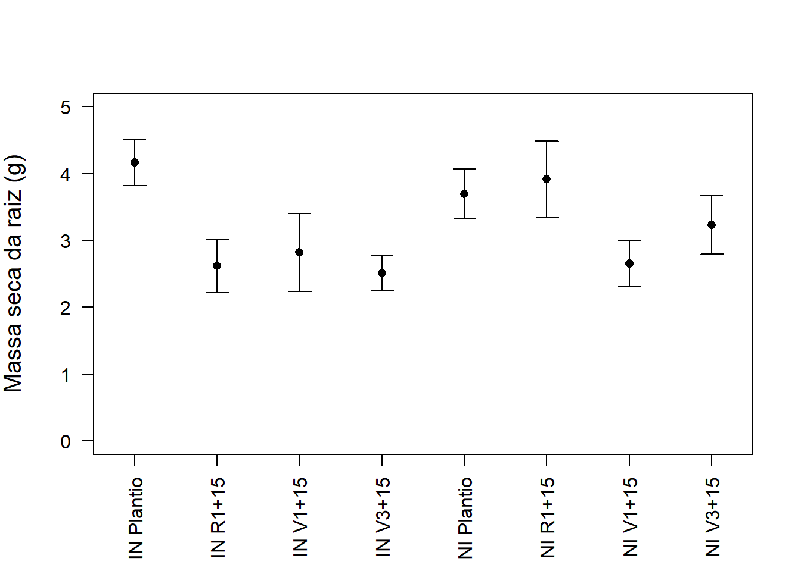

<br><br><br>

****

# Quantis Teóricos 

****

<br>

### Conjunto de dados

Um experimento foi realizado com o intuito de avaliar a massa seca da raiz de soja no munícipio de Londrina-PR. O experimento foi instalado em delineamento inteiramente casualizado (DIC), 5 repetições, no esquema fatorial 4 x 2 (4 aplicações de dicloroisocianurato de sódio (DUP) e 2 inoculações de *Rhizobium*).


```r
msraiz=c(4.87, 4.64, 3.71, 3.04, 4.57, 4.13,  3.8, 1.17, 3.28, 1.73, 1.87, 2.85, 3.32, 2.19, 2.33, 4.09, 2.85, 1.86, 2.17, 2.12, 3.03, 3.52, 3.72, 3.09,  5.11,  3.6, 2.14, 2.25, 1.93, 3.35, 2.03, 4.72, 3.39, 3.05, 2.98, 2.53, 5.61, 3.74, 2.89, 4.8)
(Inoculação=rep(c("IN","NI"),e=20))
```

```
##  [1] "IN" "IN" "IN" "IN" "IN" "IN" "IN" "IN" "IN" "IN" "IN" "IN" "IN" "IN" "IN"
## [16] "IN" "IN" "IN" "IN" "IN" "NI" "NI" "NI" "NI" "NI" "NI" "NI" "NI" "NI" "NI"
## [31] "NI" "NI" "NI" "NI" "NI" "NI" "NI" "NI" "NI" "NI"
```

```r
(Época=rep(c("Plantio","V1+15","V3+15","R1+15"),e=5,2))
```

```
##  [1] "Plantio" "Plantio" "Plantio" "Plantio" "Plantio" "V1+15"   "V1+15"  
##  [8] "V1+15"   "V1+15"   "V1+15"   "V3+15"   "V3+15"   "V3+15"   "V3+15"  
## [15] "V3+15"   "R1+15"   "R1+15"   "R1+15"   "R1+15"   "R1+15"   "Plantio"
## [22] "Plantio" "Plantio" "Plantio" "Plantio" "V1+15"   "V1+15"   "V1+15"  
## [29] "V1+15"   "V1+15"   "V3+15"   "V3+15"   "V3+15"   "V3+15"   "V3+15"  
## [36] "R1+15"   "R1+15"   "R1+15"   "R1+15"   "R1+15"
```

```r
F1=as.factor(Inoculação)
F2=as.factor(Época)
Trat=paste(F1,F2)
dados=data.frame(Trat,resp=msraiz)
```

<br>

### Análise de variância


```r
mod = with(dados, aov(msraiz~F1*F2))
anova(mod)
```

```
## Analysis of Variance Table
## 
## Response: msraiz
##           Df  Sum Sq Mean Sq F value  Pr(>F)  
## F1         1  1,1868 1,18680  1,2950 0,26358  
## F2         3  8,5762 2,85872  3,1193 0,03961 *
## F1:F2      3  4,9430 1,64766  1,7978 0,16744  
## Residuals 32 29,3268 0,91646                  
## ---
## Signif. codes:  0 '***' 0,001 '**' 0,01 '*' 0,05 '.' 0,1 ' ' 1
```

<br>

### Envelope simulado


```r
hnp::hnp(mod,
         las=1,
         seed=1,
         pch=16)
```

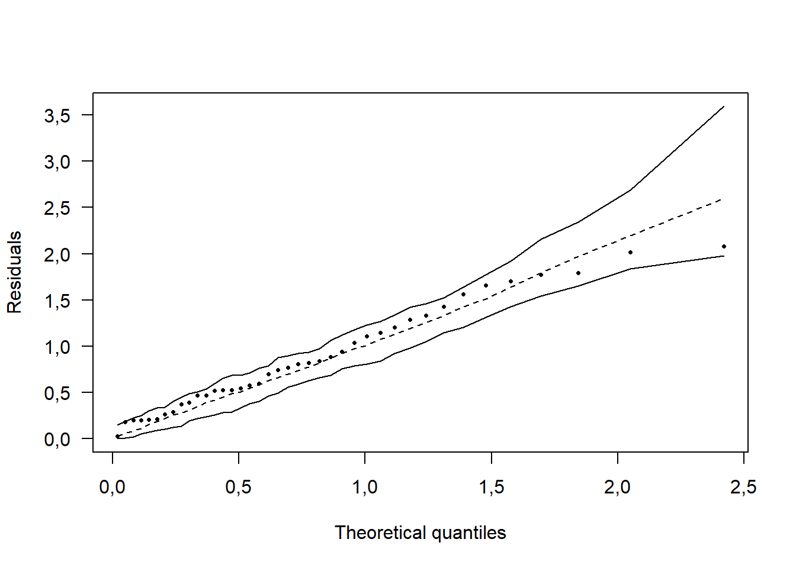

<br>

### Porcentagem de pontos fora


```r
hnp::hnp(mod,
         seed=1,
         las=1, 
         pch=16,
         print.on=T)
```

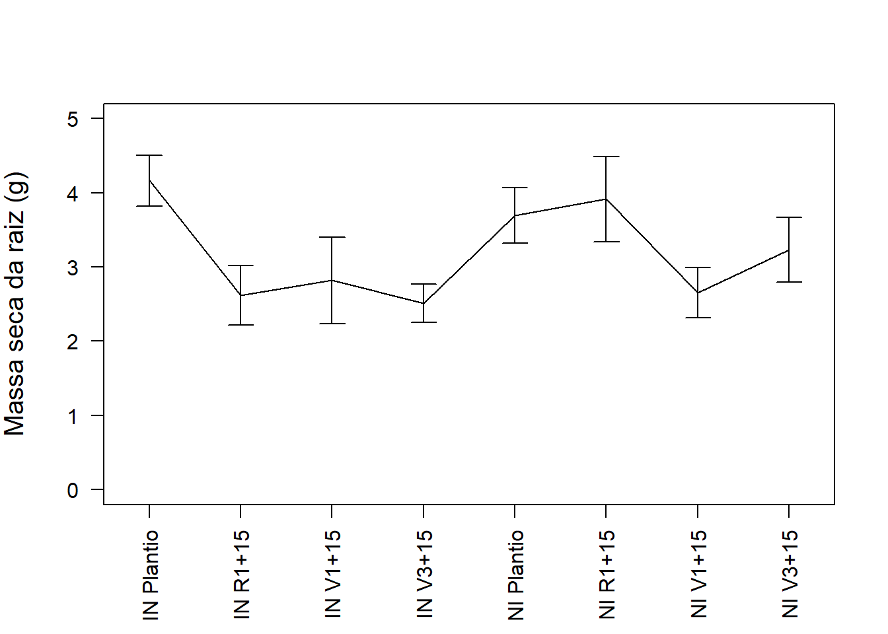

<br>

### Colorir pontos fora 


```r
hnp::hnp(mod, 
         seed=1,
         las=1, 
         pch=16,
         print.on=T,
         paint.out=T, 
         col.paint.out="red")
```

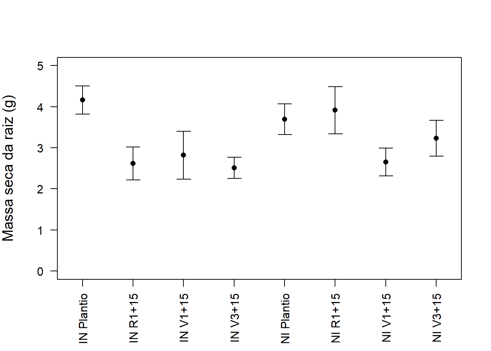

<br><br><br>

****

# Componentes principais

****

A análise de Componentes Principais é um método utilizado para reduzir a dimensão do problema em componentes não correlacionadas que são combinações lineares das variáveis originais. O número dessas componentes é menor ou igual a quantidade de variáveis originais. Esse método é útil quando o número de variáveis em estudo é muito grande.

<br>

****

## Pacote ggforfity

****

### Conjunto de dados


```r
dados <- iris[c(1, 2, 3, 4)]
```

<br>

### Calculando a PCA


```r
(pca=prcomp(dados,scale. = T))
```

```
## Standard deviations (1, .., p=4):
## [1] 1,7083611 0,9560494 0,3830886 0,1439265
## 
## Rotation (n x k) = (4 x 4):
##                     PC1         PC2        PC3        PC4
## Sepal.Length  0,5210659 -0,37741762  0,7195664  0,2612863
## Sepal.Width  -0,2693474 -0,92329566 -0,2443818 -0,1235096
## Petal.Length  0,5804131 -0,02449161 -0,1421264 -0,8014492
## Petal.Width   0,5648565 -0,06694199 -0,6342727  0,5235971
```

<br>

### Dispersão com os autovalores


```r
library(ggfortify)
autoplot(pca,data=iris)
```


<br>

### Agrupando por espécies

Obs. a coluna de "Species" está na dataset *iris*


```r
library(ggfortify)
autoplot(pca,data=iris,colour="Species")
```

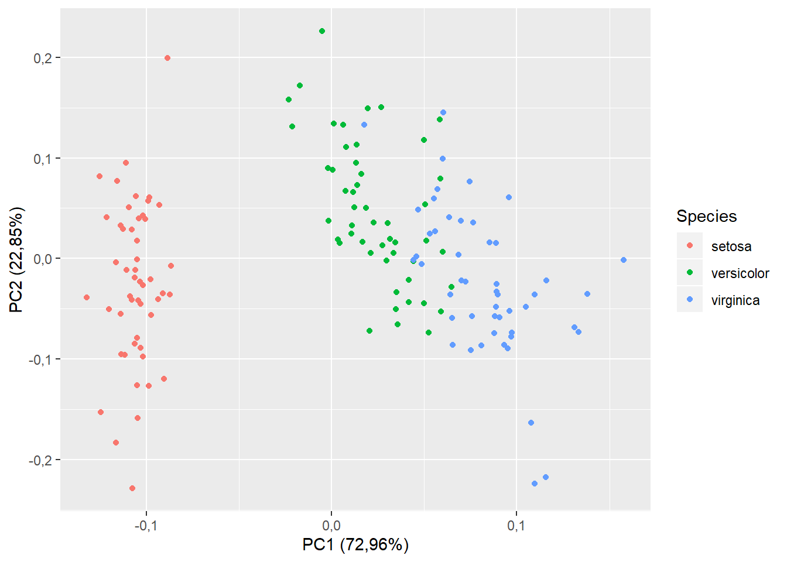

<br>

### Vetor das respostas


```r
library(ggfortify)
autoplot(pca,
         data=iris,
         colour="Species",
         loadings=T)
```


<br>

### Nome dos vetores


```r
library(ggfortify)
autoplot(pca,
         data=iris,
         colour="Species",
         loadings=T,
         loadings.label=T)
```

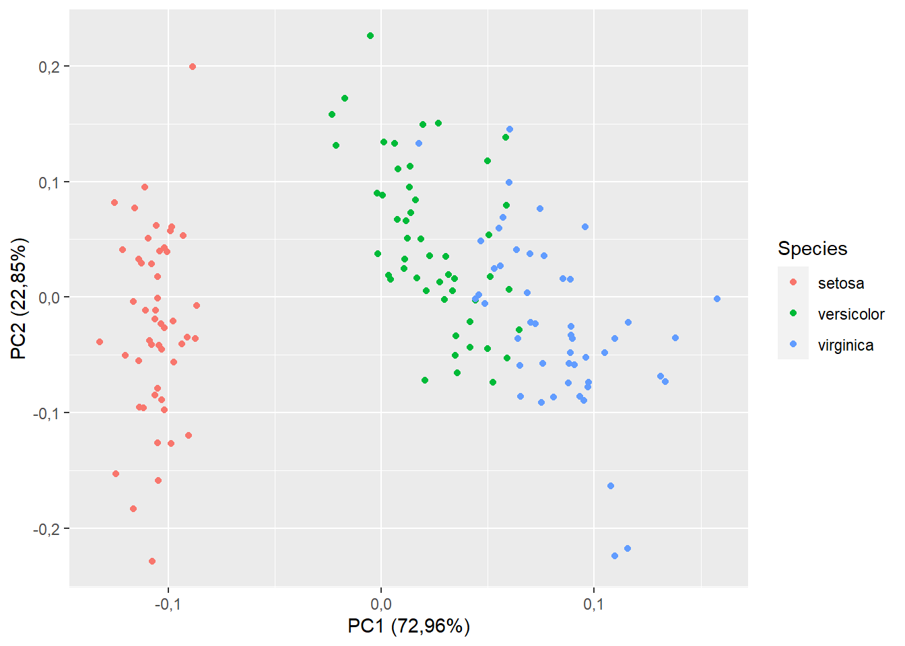

<br>


### Polígono de agrupamento


```r
library(ggfortify)
autoplot(pca,
         data=iris,
         colour="Species",
         loadings=T,
         loadings.label=T,
         frame=T)
```

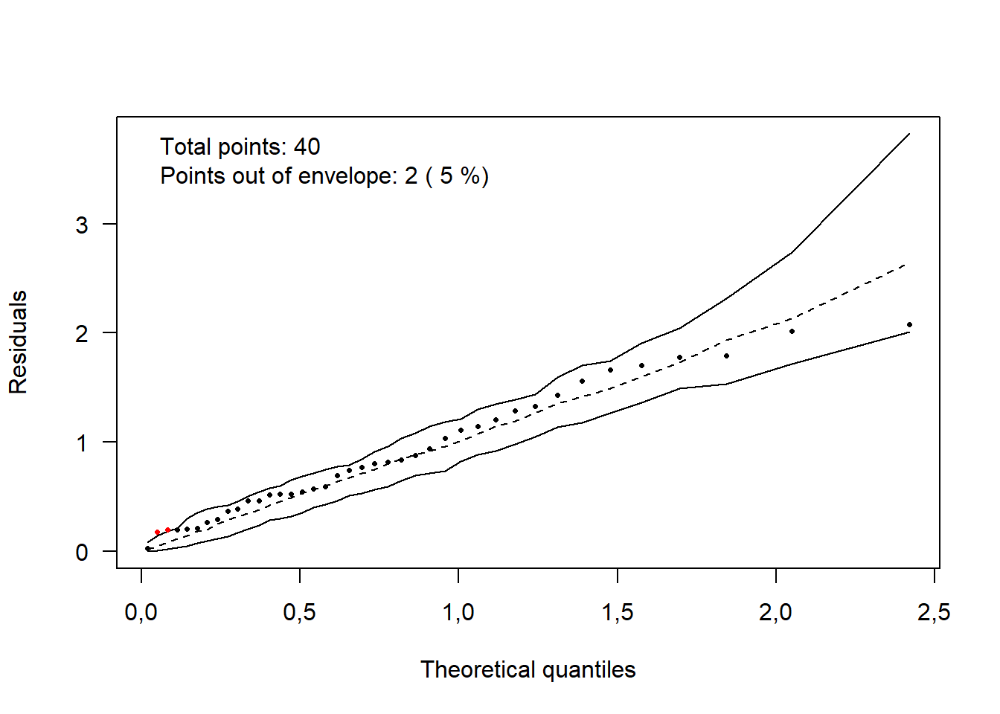

<br>


### Modificando para elipse


```r
library(ggfortify)
autoplot(pca,
         data=iris,
         colour="Species",
         loadings=T,
         loadings.label=T,
         frame=T, 
         frame.type="norm")
```

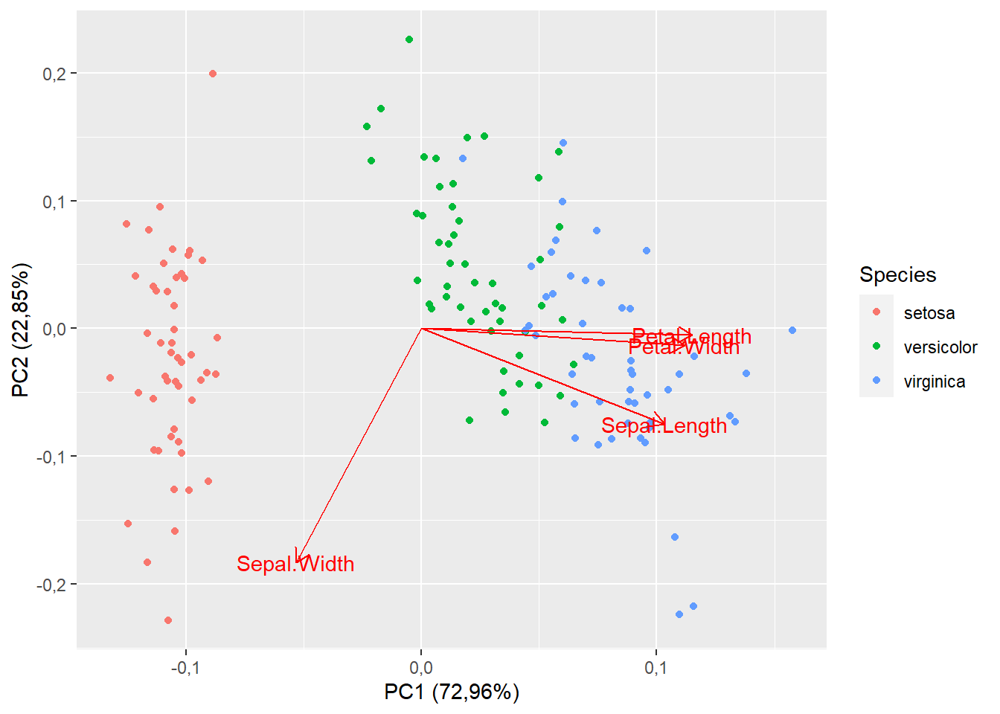

<br>


### Cor do vetor e do nome


```r
library(ggfortify)
autoplot(pca,
         data=iris,
         colour="Species",
         loadings=T,
         loadings.label=T,
         frame=T, 
         frame.type="norm",
         loadings.colour="black",
         loadings.label.colour="black")
```


<br>


### fonte; linha de grade e cor de fundo


```r
library(ggfortify)
autoplot(pca,
         data=iris,
         colour="Species",
         loadings=T,
         loadings.label=T,
         frame=T, 
         frame.type="norm",
         loadings.colour="black",
         loadings.label.colour="black",
         loadings.label.family="serif")+theme_bw()+
  theme(text = element_text(family="serif"))
```

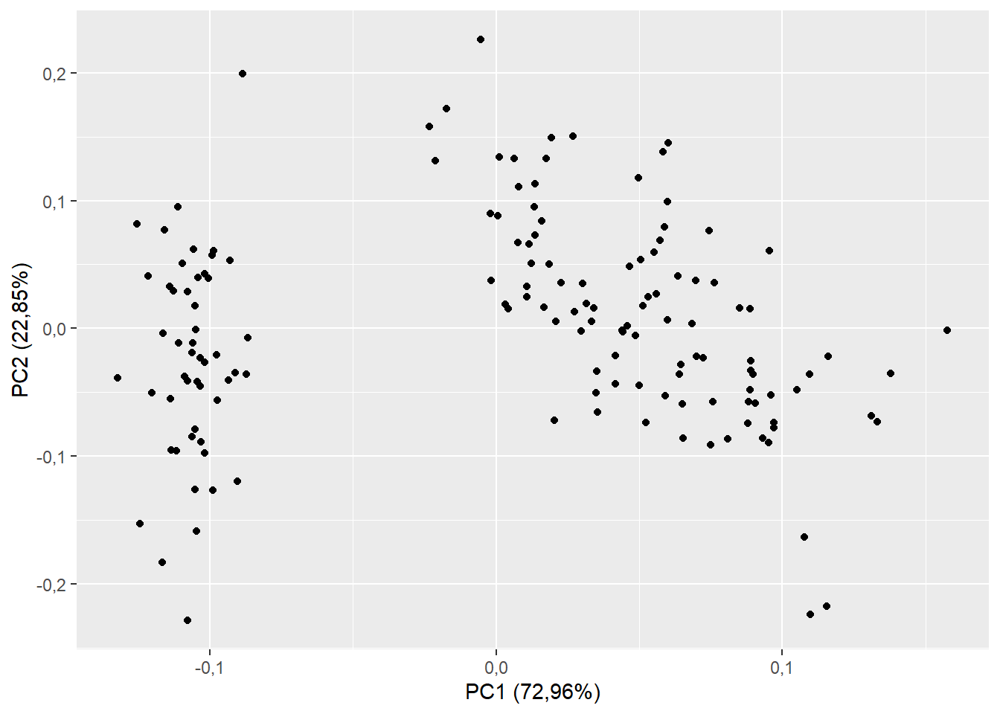

<br>

### Linha em Y=0 e X=0


```r
library(ggfortify)
autoplot(pca,
         data=iris,
         colour="Species",
         loadings=T,
         loadings.label=T,
         frame=T, 
         frame.type="norm",
         loadings.colour="black",
         loadings.label.colour="black",
         loadings.label.family="serif")+theme_bw()+
  theme(text = element_text(family="serif"))+
  geom_vline(,xintercept = 0,linetype=2)+
  geom_hline(,yintercept = 0,linetype=2)
```

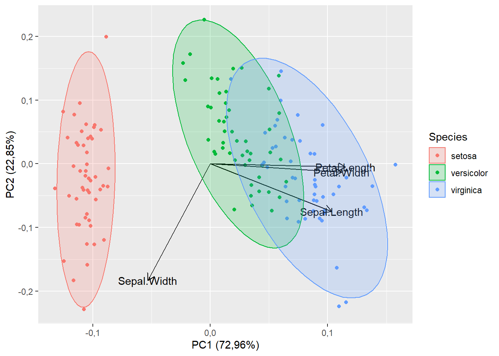

<br><br>

****

## factoextra e factomineR (Biplot)

****

<br>

```r
rm(list=ls())
DPF=c(46.00,46.00,46.00,46.00,46.00,46.00,43.00,43.00,43.00,46.00,43.00,43.00,46.00,46.00,46.00,49.00,50.00,46.00,43.00,43.00,46.00,43.00,46.00,43.00,39.00,39.00,43.00,43.00,42.00,45.00,43.00,46.00,46.00,43.00,43.00,43.00,43.00,46.00,43.00,49.00,50.00,43.00,39.00,39.00,39.00)
APF=c(58.33,55.00,50.00,41.00,35.67,43.33,35.67,36.00,35.33,46.67,36.67,49.00,38.33,43.67,44.33,41.00,48.00,43.67,32.67,28.67,36.67,38.33,46.33,53.33,38.00,33.00,32.67,45.67,48.33,46.67,33.67,36.67,42.67,37.00,43.67,35.33,42.33,47.00,47.00,59.67,59.00,48.33,32.33,36.33,33.33)
DPM=c(105.00,105.00,102.00,110.00,110.00,112.00,110.00,110.00,105.00,112.00,112.00,110.00,110.00,112.00,112.00,112.00,112.00,112.00,110.00,105.00,105.00,110.00,102.00,102.00,110.00,105.00,110.00,110.00,110.00,104.00,105.00,105.00,104.00,104.00,104.00,102.00,104.00,105.00,102.00,110.00,112.00,112.00,102.00,102.00,102.00)
APM=c(100.00,90.33,97.00,91.33,97.67,77.33,90.00,93.00,91.33,98.00,84.67,91.33,92.33,101.67,102.33,102.33,98.33,93.00,78.67,72.33,72.33,97.67,104.33,96.00,99.00,97.00,94.33,104.67,115.00,117.67,81.33,82.33,83.00,104.33,107.33,103.00,89.33,90.33,82.33,123.33,115.00,133.33,60.00,59.00,65.67)
IPV=c(15.00,20.00,17.00,10.00,22.67,14.33,23.00,19.33,15.33,14.33,15.00,22.67,14.67,15.33,17.00,13.67,16.67,19.33,11.00,8.67,11.33,13.00,14.67,13.00,13.00,12.00,17.67,14.67,10.67,25.00,18.00,14.00,18.67,15.67,11.00,18.00,16.33,24.33,17.00,13.33,11.00,22.33,10.33,5.67,14.00)
ACA=c(2.00,1.90,2.20,1.50,1.20,1.00,2.00,1.50,1.20,3.00,1.40,1.60,1.80,2.50,2.50,2.00,1.70,1.80,1.50,2.00,1.50,1.80,2.00,1.80,1.30,1.20,2.00,3.00,2.00,3.00,1.50,1.80,2.20,1.80,1.80,2.00,1.80,3.50,3.50,1.50,2.50,2.00,1.20,1.00,1.20)
PRO=c(2444.44,2870.37,2314.81,2629.63,2444.44,2592.59,2962.96,3037.04,3037.04,2592.59,2296.30,2444.44,2370.37,3481.48,2555.56,1981.48,2611.11,1925.93,1870.37,2518.52,2370.37,2462.96,2351.85,2000.00,2703.70,2685.19,2166.67,2129.63,2222.22,1814.81,2537.04,2351.85,2333.33,3370.37,2462.96,3129.63,2666.67,2796.30,2055.56,2333.33,2240.74,2092.59,2703.70,2129.63,2740.74)
MCG=c(10.78,10.96,10.07,10.77,11.17,11.24,12.57,13.35,13.77,14.23,13.61,13.30,11.85,11.80,12.04,10.10,10.19,9.97,12.15,11.35,11.70,12.83,11.52,11.10,10.95,11.14,10.26,12.51,11.87,12.30,14.20,13.13,14.70,13.08,12.76,13.74,14.59,13.98,13.52,12.72,12.22,12.63,10.93,10.65,10.67)
Tratamento=rep(c(paste("T",1:5)),9)
dados=data.frame(Tratamento,DPF,APF,DPM,APM,IPV,ACA,PRO,MCG)
```

<br>

### Valores dos CP


```r
require(FactoMineR)
pca=PCA(dados[c(2,3,4,5,6,7,9)],scale.unit=T,graph=F)
round(pca$eig,3)
```

```
##        eigenvalue percentage of variance cumulative percentage of variance
## comp 1      2,648                 37,821                            37,821
## comp 2      1,411                 20,152                            57,974
## comp 3      0,939                 13,418                            71,392
## comp 4      0,650                  9,282                            80,673
## comp 5      0,608                  8,692                            89,365
## comp 6      0,479                  6,842                            96,207
## comp 7      0,266                  3,793                           100,000
```

<br>

### Gráfico básico


```r
require(factoextra)
fviz_pca_biplot(pca,geom = c("point"))
```

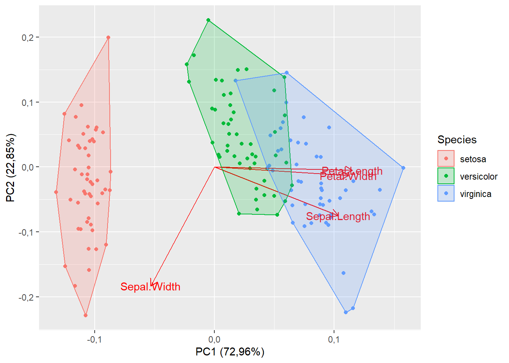

<br>

### Elipse geral


```r
require(factoextra)
fviz_pca_biplot(pca,geom = c("point"),
                addEllipses = T)
```

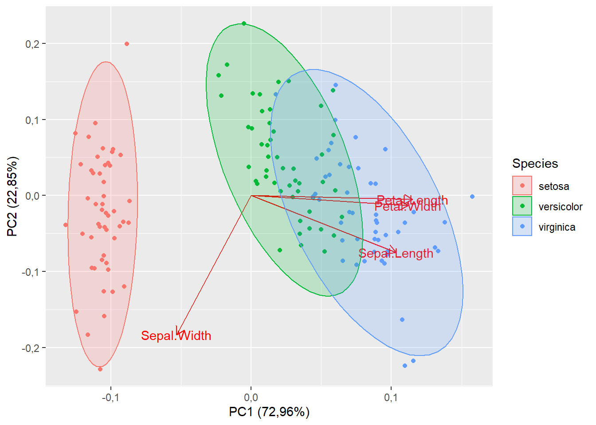

<br>

### Elipse por Tratamentos


```r
require(factoextra)
fviz_pca_biplot(pca,geom = c("point"),
                addEllipses = T, fill.ind = dados$Tratamento)
```


<br>

### Removendo título


```r
require(factoextra)
fviz_pca_biplot(pca,geom = c("point"),
                addEllipses = T, 
                fill.ind = dados$Tratamento,
                title = "")
```

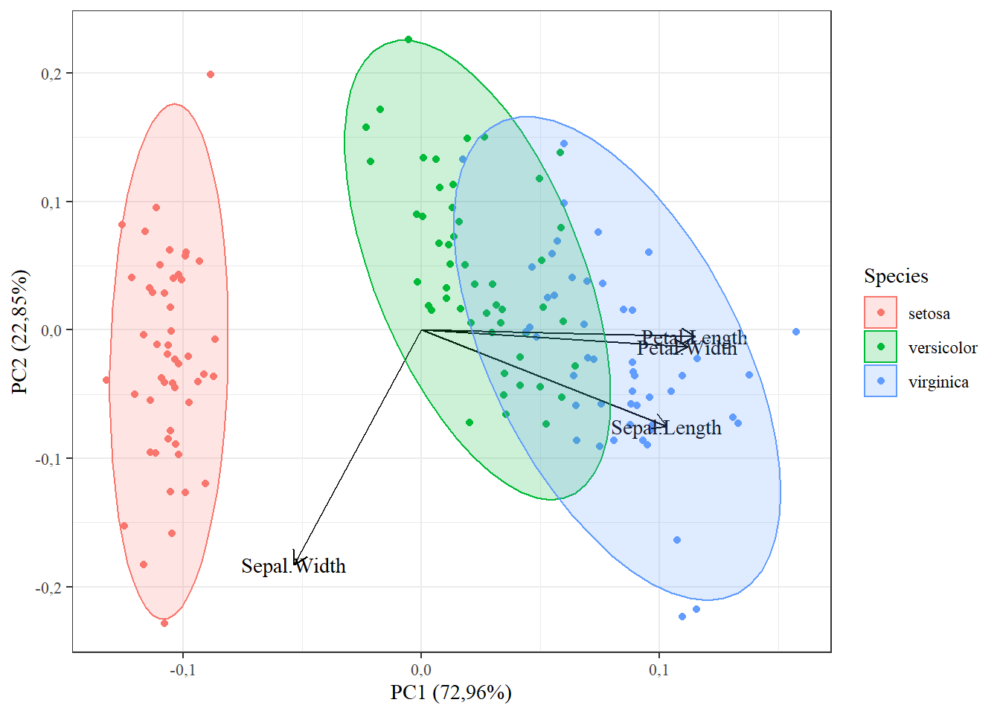

<br>

### Sobreposição de legendas


```r
require(factoextra)
fviz_pca_biplot(pca,geom = c("point"),
                addEllipses = T, ## adicionar elipse
                fill.ind = dados$Tratamento,
                title = "",
                repel=T)
```

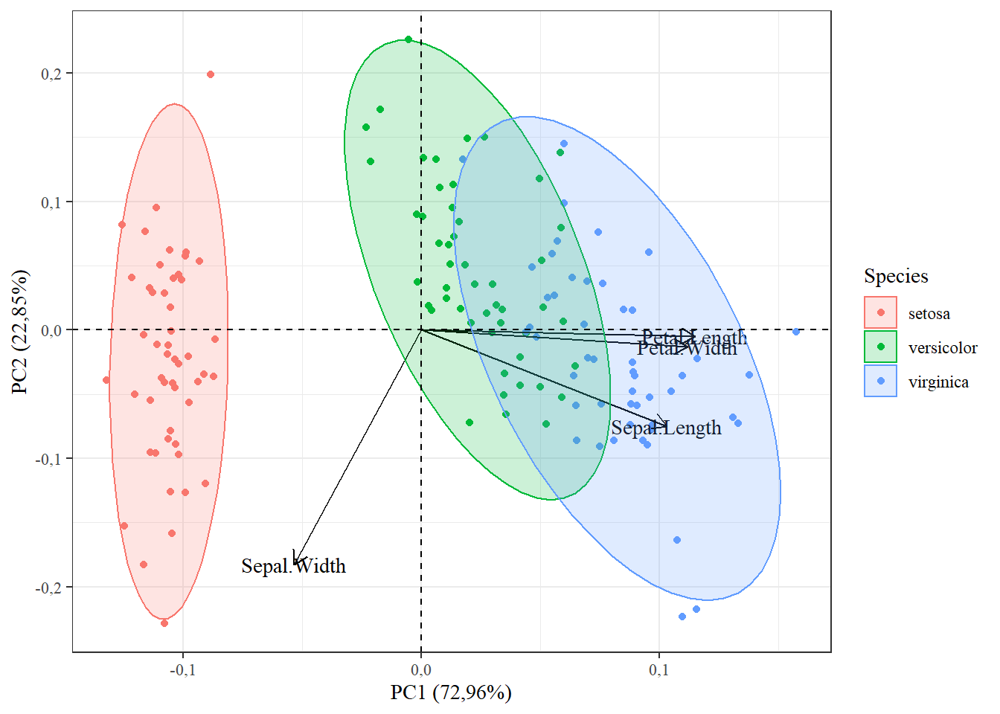

<br>

### Tamanho do ponto, letra e a cor


```r
require(factoextra)
fviz_pca_biplot(pca,geom = c("point"),
                addEllipses = T, 
                fill.ind = dados$Tratamento,
                title = "",
                repel=T, 
                pointshape=21,pointsize=2,textsize=0.5, col.var="black")
```

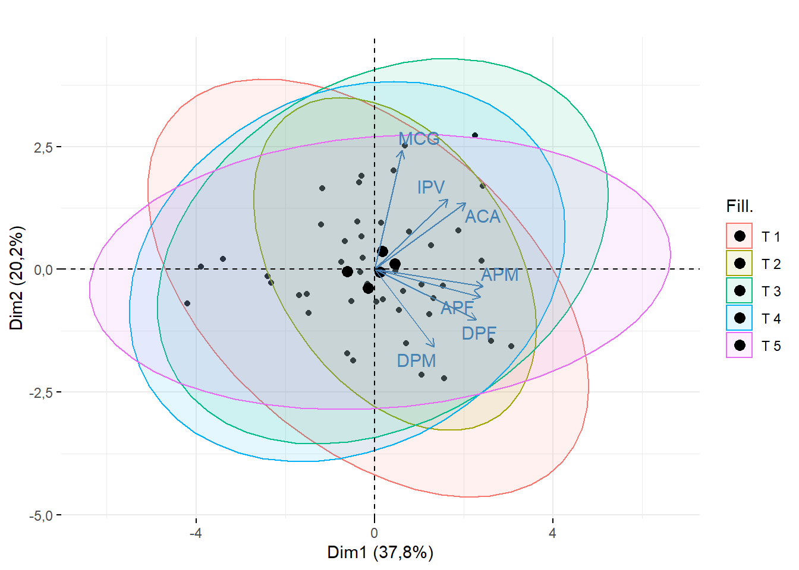

<br>

### Título das ellipses


```r
require(factoextra)
fviz_pca_biplot(pca,geom = c("point"),
                addEllipses = T, 
                fill.ind = dados$Tratamento,
                title = "",
                repel=T, 
                pointshape=21,pointsize=2,textsize=0.5, col.var="black",fill= "Cultivares")
```

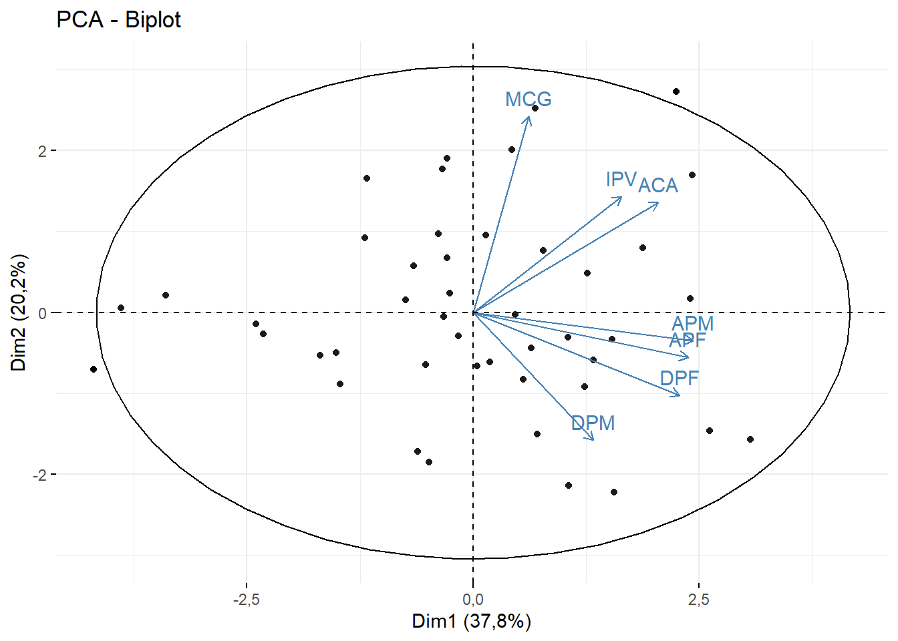

<br>

### Título do 1 e 2 CP


```r
require(factoextra)
fviz_pca_biplot(pca,geom = c("point"),
                addEllipses = T, 
                fill.ind = dados$Tratamento,
                title = "",
                repel=T, 
                pointshape=21,pointsize=2,textsize=0.5,
                col.var="black",fill= "Cultivares")+ylab("CP2(20,2%)")+xlab("CP1(37,8%)")
```

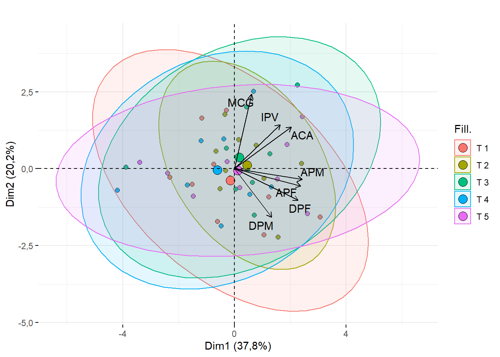

<br><br>

****

## factoextra (Gráficos separados)

****

<br>


### Conjunto de dados


```r
ph=c(5.4,6.7,6.8,5.9,6.3,6.2,6.3,6,6.1,5.8,6.7,5.7,6.8,6.9,6.5,6.9,6.8,6.7,6.5,6.5,6.7,6.7,6.5,6.7,6.6,6.8,6.4,4.6,6.5,6.6,6.3,6.2,5.5,4.5,5.2,6.5,6.3,6.6,6.4,6.6,6.6,6.5,6.5,6.4,6.5,6.8,6.7,6.6,5.9,6.1,6.3,6.3,6.2,5.3,5.8,6.1,6.7,6.7,6.6,6.6,6.6,6.8,6.8,6.7,6.9,7,7.1,7.1,6.7,6.7,6.6,6.6,6.3,5.8,6.2,6.3,6,5,6.3,5.3,5.4,6.4,6.7,6.5,6.5,6.4,6.7,6.5,6.8,6.2,6.1,6.2,6.8,6.7,6.6,6.4,6.7,6.6,6.4,5.9,6.5,6.6,5.9,6.8,6.8,6.7,6.5,6.7,6.9,6.5,6.8,6.7,6.8,6.6,6.7,6.7,6.9,6.9,6.7,6.8)
HAL=c(4.6,2.7,2.7,3.9,3.4,3.6,3.4,3.9,3.6,3.9,2.5,4.2,2.5,2.5,3.1,2.5,2.5,2.9,3.1,3.1,2.7,2.9,2.9,2.9,3.1,2.7,3.4,8.3,2.9,2.9,3.6,3.1,4.9,8.3,5.3,3.1,2.7,2.7,2.7,2.7,3.1,3.1,2.7,3.1,2.5,2.5,2.9,2.9,3.9,3.9,3.6,3.4,3.9,5.3,3.9,3.9,2.9,2.7,2.9,3.1,2.7,2.1,2.3,2.3,2.3,2.1,2.0,2.1,2.5,2.3,2.5,2.5,3.1,3.6,2.9,2.9,3.4,4.9,2.5,4.6,4.2,2.5,2.3,2.5,2.7,2.5,2.1,2.5,2.1,2.9,2.9,2.9,2.1,2.3,2.5,2.7,2.5,2.5,2.7,3.6,2.7,2.5,3.4,2.0,2.3,2.3,2.7,2.3,2.1,2.5,2.1,2.3,2.3,2.5,2.5,2.3,2.1,2.3,2.3,2.1)
K=c(0.5,0.7,0.7,0.9,0.9,0.8,0.6,0.9,0.8,0.6,0.5,0.4,2.0,1.9,1.0,1.2,1.2,1.6,1.5,0.9,2.0,1.2,1.6,1.4,0.9,0.8,0.8,1.0,0.9,1.1,1.2,1.1,0.6,0.5,0.6,0.9,1.4,1.6,1.3,1.5,0.9,1.2,1.3,1.0,1.4,0.7,0.7,1.0,1.0,0.7,0.8,1.3,0.7,0.7,0.8,0.8,1.3,0.9,1.2,0.8,1.5,1.4,0.8,1.0,1.4,1.1,1.6,1.0,0.9,1.1,1.1,0.9,1.0,0.7,0.6,1.0,1.0,0.7,1.0,0.6,0.9,1.2,0.8,0.8,0.8,0.7,1.1,1.2,0.8,0.9,0.9,1.2,1.1,1.1,1.2,0.9,0.8,0.7,0.9,0.7,0.8,0.9,0.5,0.8,1.0,0.7,0.8,0.7,1.4,0.9,1.4,0.9,1.0,1.3,0.7,1.3,1.4,0.9,0.8,1.4)
P=c(13.7,14.5,65.7,20.5,20.7,19.3,16.2,14.6,15.8,8.7,8.9,7.7,20.0,18.4,9.4,14.8,17.5,11.7,11.2,11.1,51.4,20.4,27.3,14.1,20.1,18.1,23.5,36.4,16.9,18.6,29.0,20.9,16.8,16.8,8.6,11.3,17.5,17.0,30.9,17.2,10.7,17.2,10.9,14.5,26.6,42.1,10.5,13.5,16.4,13.3,34.7,20.0,12.8,15.1,15.8,14.1,26.9,33.2,25.4,25.1,14.1,17.7,12.6,12.9,27.5,18.6,16.9,15.5,16.2,17.6,17.5,14.5,12.6,10.5,10.6,10.5,14.7,10.1,10.7,9.6,17.9,23.9,22.4,22.0,14.2,15.8,12.8,17.8,16.0,10.5,9.6,13.8,17.5,17.7,10.0,10.1,29.0,16.8,18.6,31.7,17.2,40.2,9.8,14.5,28.8,13.0,13.1,18.6,22.0,36.0,19.5,25.2,14.2,15.8,11.9,16.7,20.0,14.7,11.7,17.9)
Ca=c(3.43,4.24,5.37,4.13,4.48,4.65,4.33,4.19,3.91,3.23,4.01,2.98,4.55,4.53,3.91,4.33,4.62,4.54,3.38,3.87,3.85,3.91,3.79,4.57,4.71,4.75,4.93,4.32,4.08,3.73,3.30,3.88,2.59,1.99,2.27,3.68,4.94,5.29,5.69,5.67,4.55,5.01,4.85,4.76,4.99,5.13,4.40,4.38,3.05,3.78,4.21,4.22,3.55,2.81,2.98,3.35,4.03,3.80,3.88,3.97,4.32,4.81,5.06,4.98,5.46,4.88,5.37,5.36,5.41,5.05,5.22,4.95,6.06,3.51,3.72,3.25,2.74,1.78,2.86,2.31,3.63,4.91,4.47,4.85,4.78,6.76,4.31,4.62,4.54,3.10,2.88,3.66,5.56,5.08,4.89,4.67,5.71,5.47,4.68,4.72,4.45,4.23,3.36,4.27,4.31,3.48,3.42,4.38,5.37,7.21,5.40,5.71,4.53,4.35,3.87,3.68,4.18,4.95,4.40,4.84)
Mg=c(2.24,3.22,3.20,2.46,2.51,2.65,2.84,2.80,2.56,2.56,3.45,2.43,3.17,3.25,2.89,3.30,3.34,3.28,2.91,3.00,3.29,2.83,2.89,2.86,2.82,3.15,2.49,2.65,2.95,3.20,2.88,3.10,2.28,1.92,2.05,3.18,3.19,3.13,3.35,3.44,3.27,3.18,3.35,3.24,3.29,3.37,3.21,3.19,2.50,2.01,2.61,2.74,2.42,2.05,2.29,2.36,3.33,3.30,3.03,2.90,2.99,3.34,3.33,3.35,3.30,3.10,3.47,3.30,3.30,3.23,3.25,3.23,3.49,2.40,2.70,2.83,2.78,1.98,2.89,2.30,2.35,3.20,3.45,2.74,2.97,4.56,3.28,2.80,3.03,2.79,2.68,2.95,3.43,3.38,3.30,3.13,3.25,3.06,2.99,2.49,2.84,2.81, 2.22,3.48,3.08,2.80,2.62,2.79,3.30,3.39,3.23,3.14,3.31,2.94,3.03,3.17,2.98,3.38,3.13,3.21)
V=c(57.27,75.06,77.30,65.31,69.75,68.82,69.49,66.52,66.47,61.75,75.94,57.72,79.32,79.29,71.24,77.71,78.33,76.18,71.19,71.14,76.94,72.96,73.78,75.10,72.70,76.02,70.72,48.85,73.04,73.25,66.68,71.78,52.34,34.52,48.24,70.98,77.75,78.59,79.11,79.57,73.40,74.76,77.59,73.97,79.17,78.45,73.85,74.40,62.52,62.12,67.51,70.86,62.69,51.35,60.67,62.34,74.62,74.63,73.41,70.85,76.35,81.43,79.59,79.78,81.17,80.69,83.74,81.62,79.09,79.87,79.09,78.23,76.80,64.16,70.53,70.54,65.82,47.34,72.73,53.10,61.80,78.52,78.78,76.85,75.73,82.58,80.00,77.24,79.24,69.95,68.90,72.68,82.19,80.29,78.75,76.06,79.42,78.49,75.87,68.39,74.74,75.88,64.04,80.92,78.00,74.94,71.55,76.95,82.11,81.94,82.16,80.58,78.89,77.11,75.13,77.63,79.68,79.73,77.91,81.24)
Trat=rep(c(paste("T",1:10)), e=12)
dados=data.frame(Trat,ph,HAL,K,P,Ca,Mg,V)
```

### Calculando as médias


```r
mph=tapply(ph, Trat, mean)
mHAL=tapply(HAL, Trat, mean)
mK=tapply(K, Trat, mean)
mP=tapply(P, Trat, mean)
mCa=tapply(Ca, Trat, mean)
mMg=tapply(Mg, Trat, mean)
mV=tapply(V, Trat, mean)
dadosm=data.frame(mph,mHAL,mK,mP,mCa,mMg,mV)
```

<br>

### Dendograma (Definir Clusters)


```r
dend=as.dendrogram(hclust(dist(dadosm), method='average'), hang = -1)
plot(dend)
abline(h=8, lty=2, col="red")
```

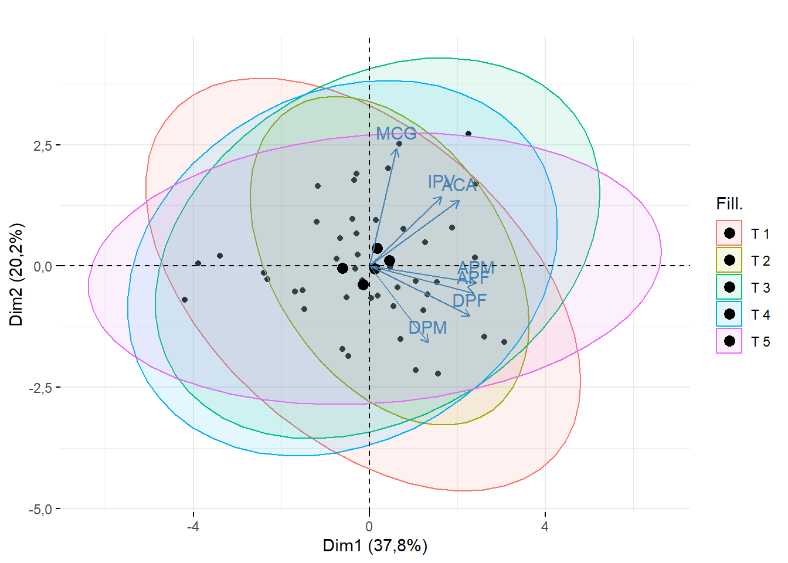

```r
## Cluster 1: T8, T10, T6,T9,T2,T4
## Cluster 2: T7, T3, T1, T5
```

<br>

### Valores dos CP


```r
require(FactoMineR)
pca=PCA(dadosm,scale.unit=T,graph=F)
round(pca$eig,3)
```

```
##        eigenvalue percentage of variance cumulative percentage of variance
## comp 1      5,057                 72,243                            72,243
## comp 2      1,037                 14,812                            87,055
## comp 3      0,639                  9,128                            96,183
## comp 4      0,237                  3,387                            99,571
## comp 5      0,022                  0,312                            99,883
## comp 6      0,008                  0,109                            99,992
## comp 7      0,001                  0,008                           100,000
```

<br>

### Gráfico com os vetores


```r
library(factoextra)
fviz_pca_var(pca)
```

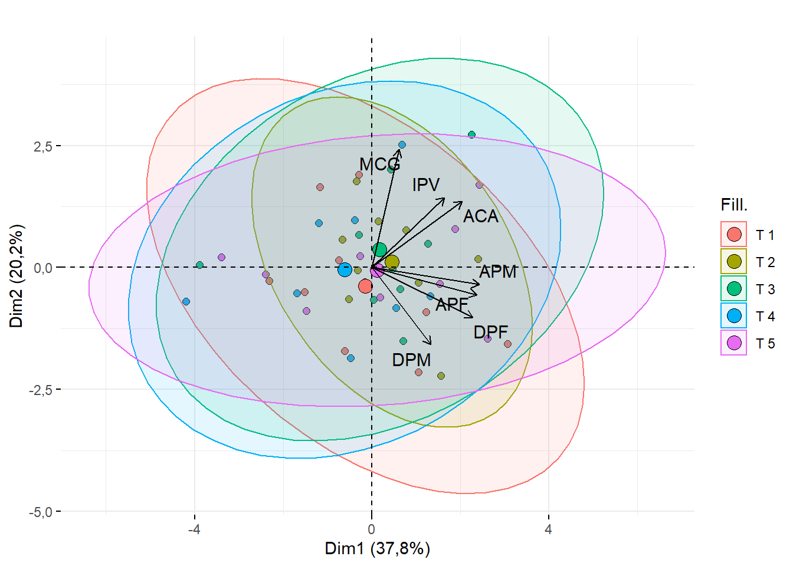

<br>

### Renomeando eixos


```r
fviz_pca_var(pca)+ylab("CP2 (14,9)")+xlab("CP1 (72,3%)")
```

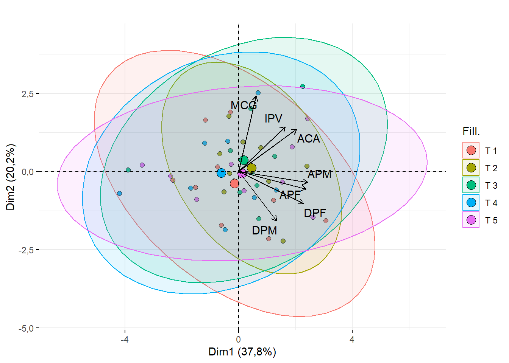

<br>

### Removendo título


```r
fviz_pca_var(pca, title="")+ylab("CP2 (14,9)")+xlab("CP1 (72,3%)")
```

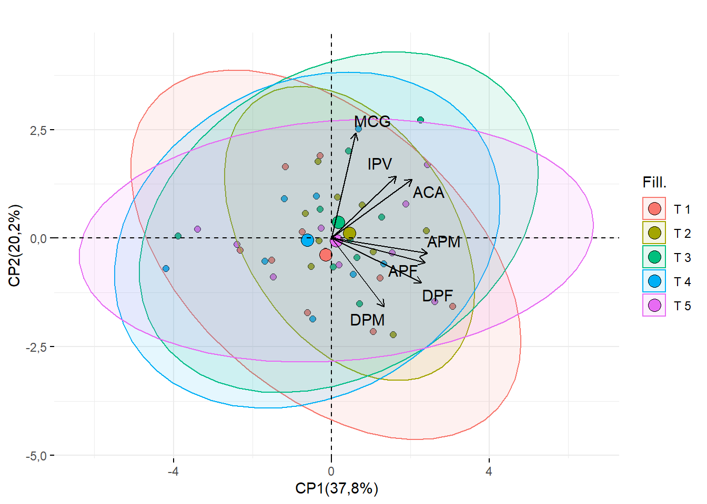

<br>

### Renomeando os vetores


```r
rownames(pca$var$coord)=c("pH","H+AL","K","P","Ca","Mg","V")
fviz_pca_var(pca, title="")+ylab("CP2 (14,9)")+xlab("CP1 (72,3%)")
```


<br>

### Sobreposição dos nomes


```r
rownames(pca$var$coord)=c("pH","H+AL","K","P","Ca","Mg","V")
fviz_pca_var(pca, 
             title="", 
             repel=T)+ylab("CP2 (14,9)")+xlab("CP1 (72,3%)")
```


<br>

### Removendo linhas de grade


```r
rownames(pca$var$coord)=c("pH","H+AL","K","P","Ca","Mg","V")
fviz_pca_var(pca, 
             title="", 
             repel=T)+
  ylab("CP2 (14,9)")+
  xlab("CP1 (72,3%)")+
  theme_classic()
```

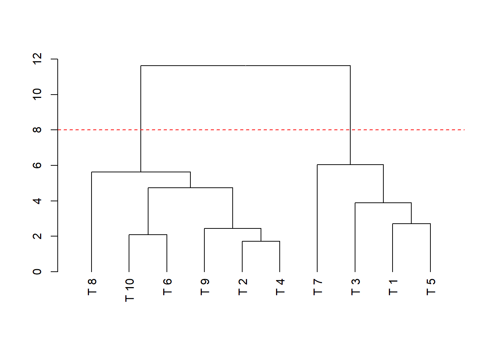

<br>

### Pontos dos scores


```r
fviz_pca_ind(pca)
```

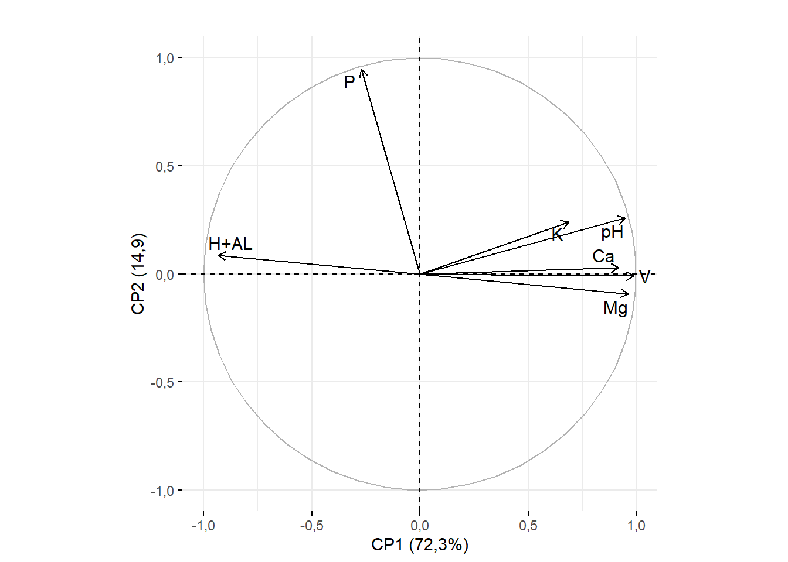

<br>

### Renomeando eixos e título


```r
fviz_pca_ind(pca, title="")+ylab("CP2 (14,9)")+xlab("CP1 (72,3%)")
```

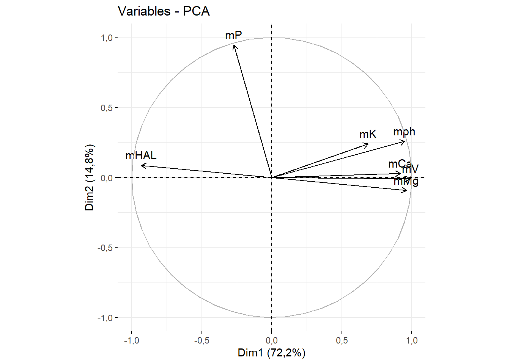

<br>

### Marcando os clusters (Por coloração)


```r
## Cluster 1: T8, T10, T6,T9,T2,T4
## Cluster 2: T7, T3, T1, T5
## Construir vetor com o cluster (Nesse caso vamos chamar de A e B)

cluster=c("B","A","B","A","B","A","B","A","A","A")
fviz_pca_ind(pca, 
             title="", 
             col.ind = as.factor(cluster))+
  ylab("CP2 (14,9)")+
  xlab("CP1 (72,3%)")
```

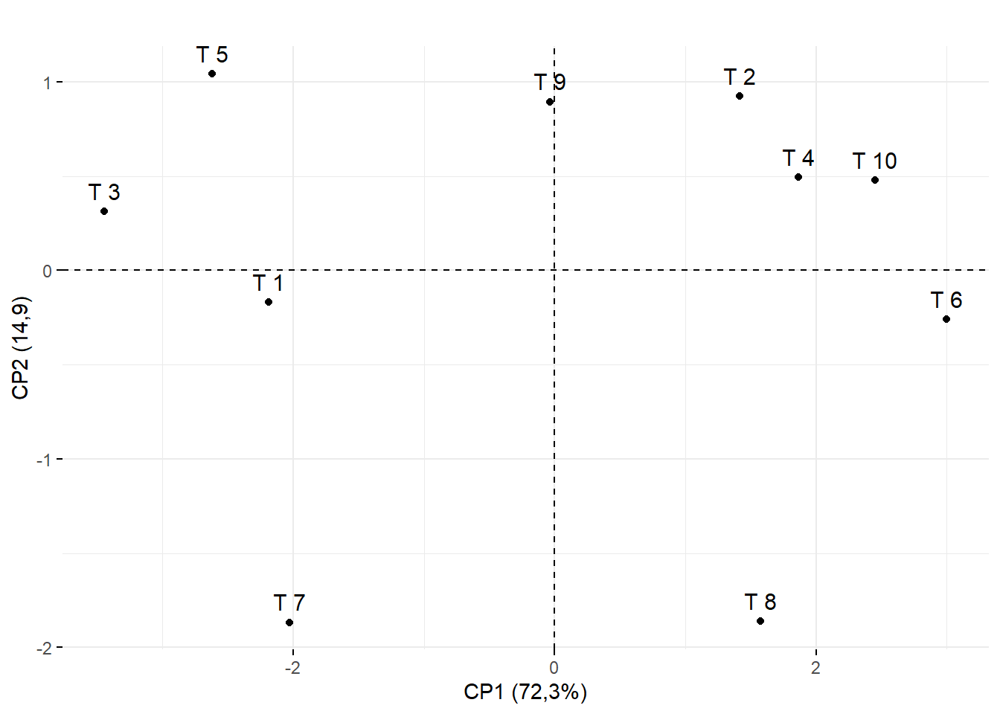

<br>

### Marcando os clusters (Por formato de ponto)


```r
## Cluster 1: T8, T10, T6,T9,T2,T4
## Cluster 2: T7, T3, T1, T5
## Construir vetor com o cluster (Nesse caso vamos chamar de A e B)

cluster=c("B","A","B","A","B","A","B","A","A","A")
fviz_pca_ind(pca, 
             title="", 
             pointshape = as.factor(cluster),
             pointsize=2)+
  ylab("CP2 (14,9)")+
  xlab("CP1 (72,3%)")
```

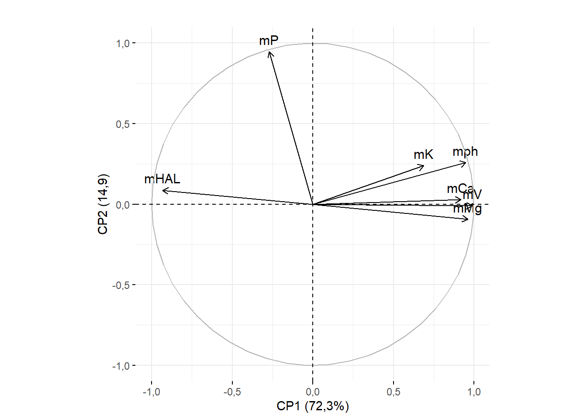

<br>

### Marcando os clusters (Por coloração e formato de ponto)


```r
## Cluster 1: T8, T10, T6,T9,T2,T4
## Cluster 2: T7, T3, T1, T5
## Construir vetor com o cluster (Nesse caso vamos chamar de A e B)
cluster=c("B","A","B","A","B","A","B","A","A","A")
fviz_pca_ind(pca, 
             title="", legend.title="Cluster",
             habillage = as.factor(cluster))+
  ylab("CP2 (14,9)")+
  xlab("CP1 (72,3%)")
```

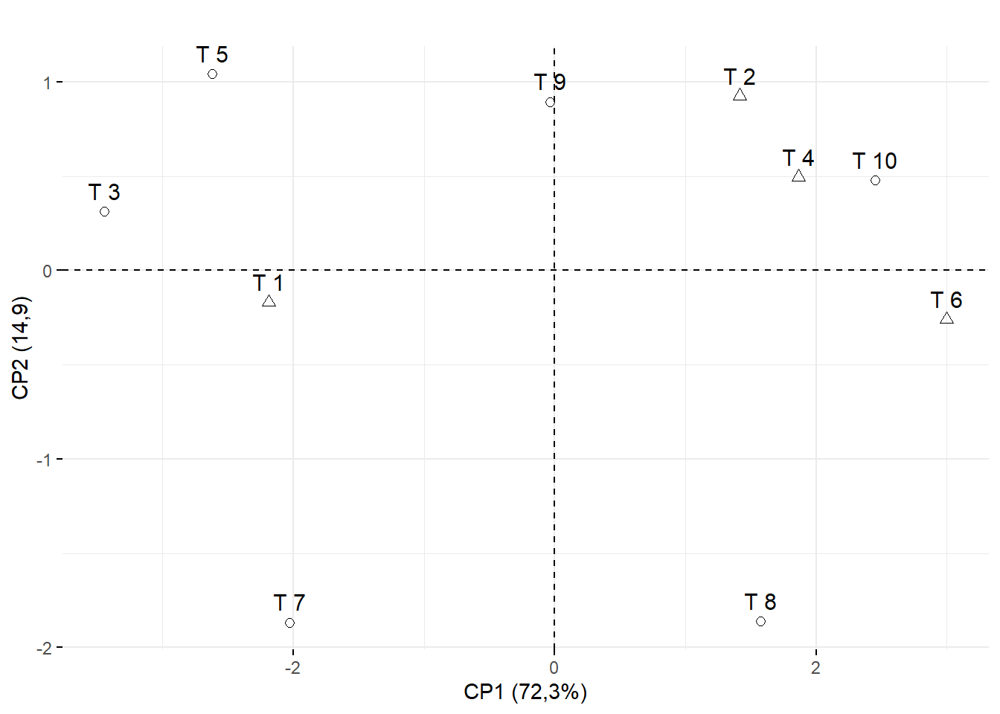

<br>

### Removendo linhas de grade


```r
## Cluster 1: T8, T10, T6,T9,T2,T4
## Cluster 2: T7, T3, T1, T5
## Construir vetor com o cluster (Nesse caso vamos chamar de A e B)
cluster=c("B","A","B","A","B","A","B","A","A","A")
fviz_pca_ind(pca, 
             title="", legend.title="Cluster",
             habillage = as.factor(cluster))+
  ylab("CP2 (14,9)")+
  xlab("CP1 (72,3%)")+theme_classic()
```

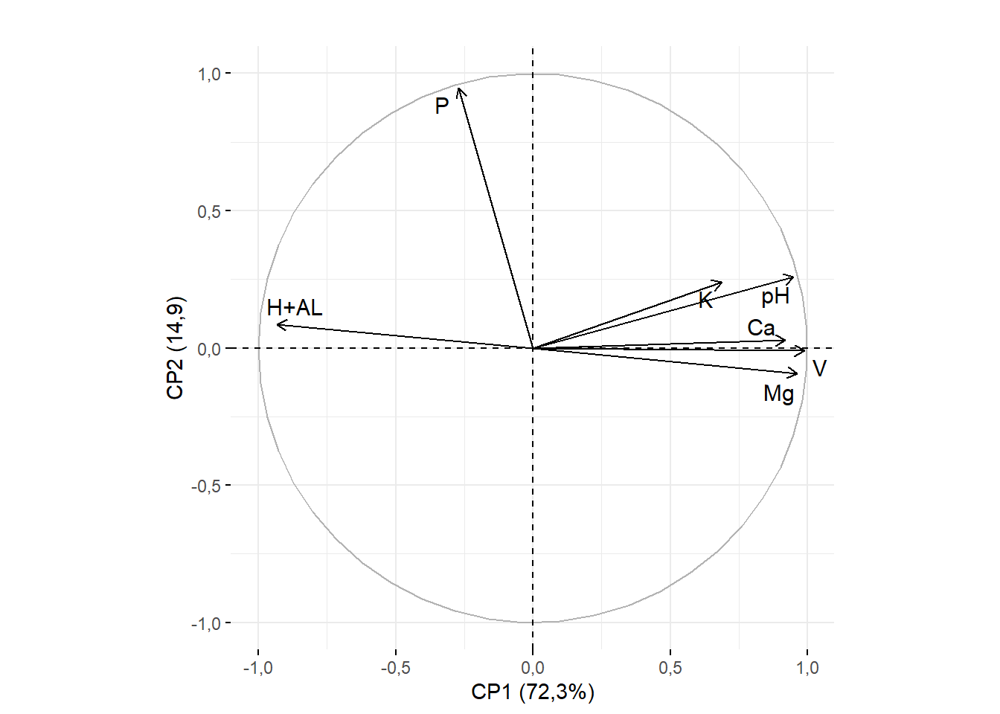


```r
a=fviz_pca_ind(pca, title="")+theme_classic()
b=fviz_pca_var(pca, title="")+theme_classic()
library(gridExtra)
grid.arrange(a,b, ncol=2)
```

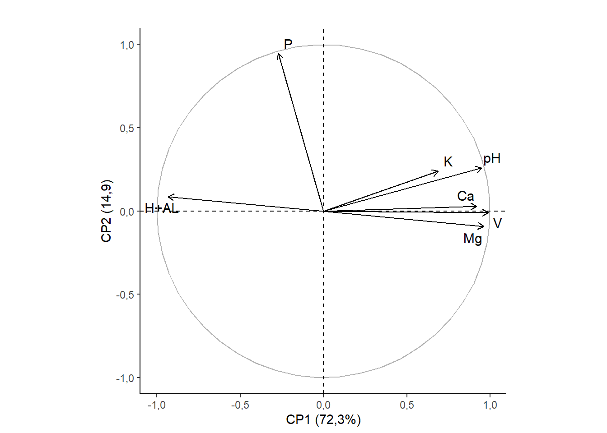

<br><br>

****

## Gráfico de CP (Manualmente)

****

<br>

### Calculando as médias


```r
mph=tapply(ph, Trat, mean)
mHAL=tapply(HAL, Trat, mean)
mK=tapply(K, Trat, mean)
mP=tapply(P, Trat, mean)
mCa=tapply(Ca, Trat, mean)
mMg=tapply(Mg, Trat, mean)
mV=tapply(V, Trat, mean)
dadosm=data.frame(mph,mHAL,mK,mP,mCa,mMg,mV)
```

<br>

### Dendograma (Definir Clusters)

Obs. Fica a critério do pesquisador o valor do corte (Neste caso optei pelo corte em 8, formando assim dois *clusters*)

Podemos fazer como neste exemplo abaixo:


```r
dend=as.dendrogram(hclust(dist(dadosm), method='average'), hang = -1)
plot(dend)
abline(h=8, lty=2, col="red")
```

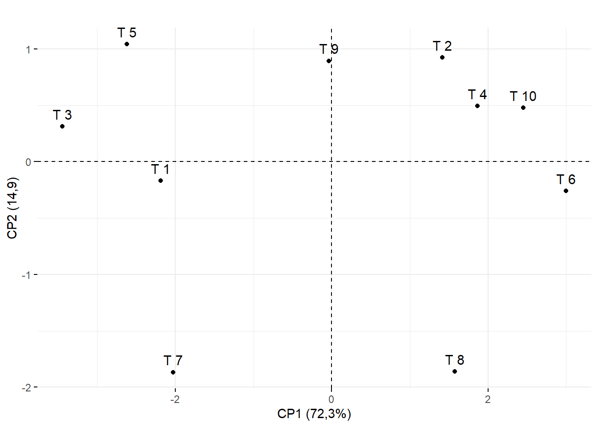

```r
## Cluster 1: T8, T10, T6,T9,T2,T4
## Cluster 2: T7, T3, T1, T5
```

ou,


```r
library(dendextend)
dend=as.dendrogram(hclust(dist(dadosm), method='average'))
dend=set(dend,"branches_k_color", value = c("red", "blue"), k = 2)
par(cex=0.7, mai=c(1.2,0.8,0.5,0.5))
plot(dend,las=1,ylab="Distância")
par(cex=0.8)
rect.dendrogram(dend, k=2,border = 8, lty = 5, lwd = 2)
```

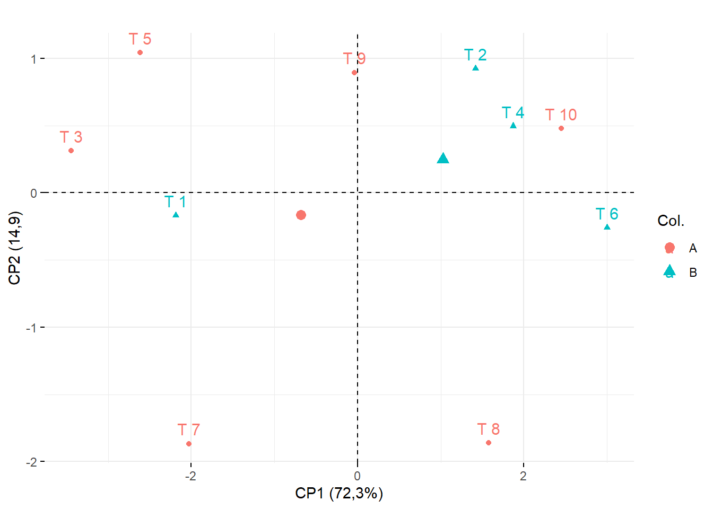

<br>

### Valores dos CP


```r
require(FactoMineR)
pca=PCA(dadosm,scale.unit=T,graph=F)
round(pca$eig,3)
```

```
##        eigenvalue percentage of variance cumulative percentage of variance
## comp 1      5,057                 72,243                            72,243
## comp 2      1,037                 14,812                            87,055
## comp 3      0,639                  9,128                            96,183
## comp 4      0,237                  3,387                            99,571
## comp 5      0,022                  0,312                            99,883
## comp 6      0,008                  0,109                            99,992
## comp 7      0,001                  0,008                           100,000
```

<br>

### Gráfico com os componentes


```r
plot(pca$eig[,2], type="b",ylab="Porcentagem de variância",xlab="CP")
```

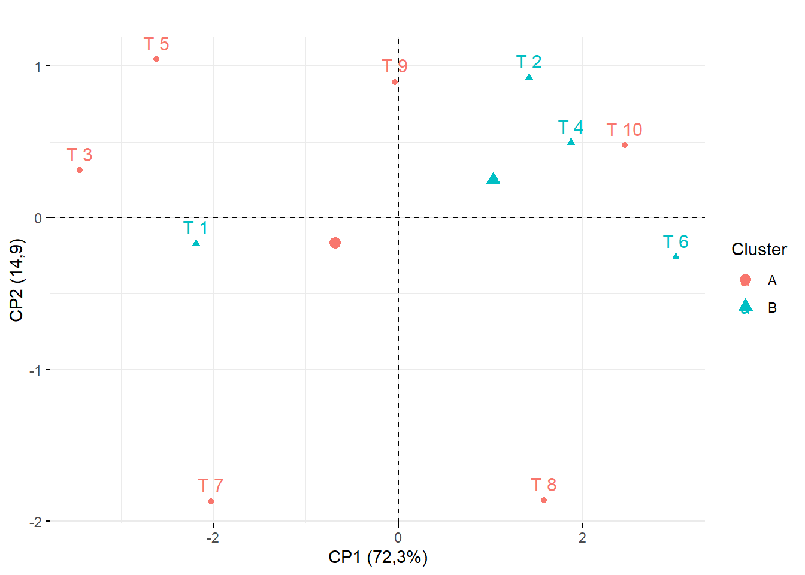

<br>

### Ponto dos scores


```r
plot(pca$ind$coord, # Extraindo da pca os valores das coordenadas em x e CP1 e y e CP2
     xlab="CP1 (72.2 %)", # renomeando eixo x
     ylab="CP2 (14.8 %)", # renomeando eixo y
     pch=16) # alterando formato de ponto ("Bolinha preenchida")
abline(h=0,v=0, lty=2) # traçando linha em x e y = 0; lty=2 é linha tracejada 
```

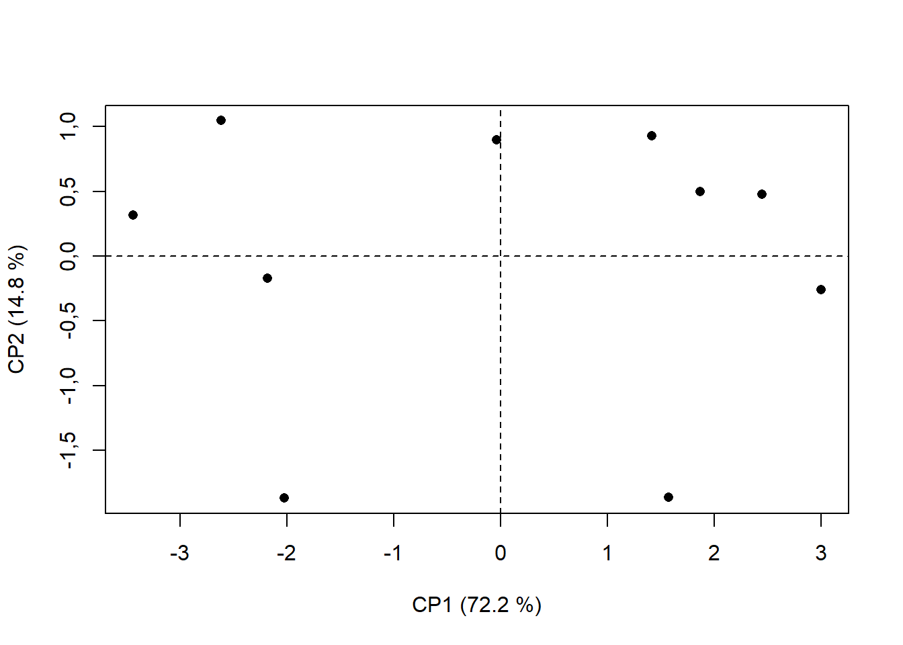

<br>

### Identificando pontos


```r
plot(pca$ind$coord, # Extraindo da pca os valores das coordenadas em x e CP1 e y e CP2
     xlab="CP1 (72.2 %)", # renomeando eixo x
     ylab="CP2 (14.8 %)", # renomeando eixo y
     pch=16) # alterando formato de ponto ("Bolinha preenchida")
abline(h=0,v=0, lty=2) # traçando linha em x e y = 0; lty=2 é linha tracejada 
text(pca$ind$coord[,1],
     pca$ind$coord[,2]-0.1, 
     rownames(pca$ind$coord))
```

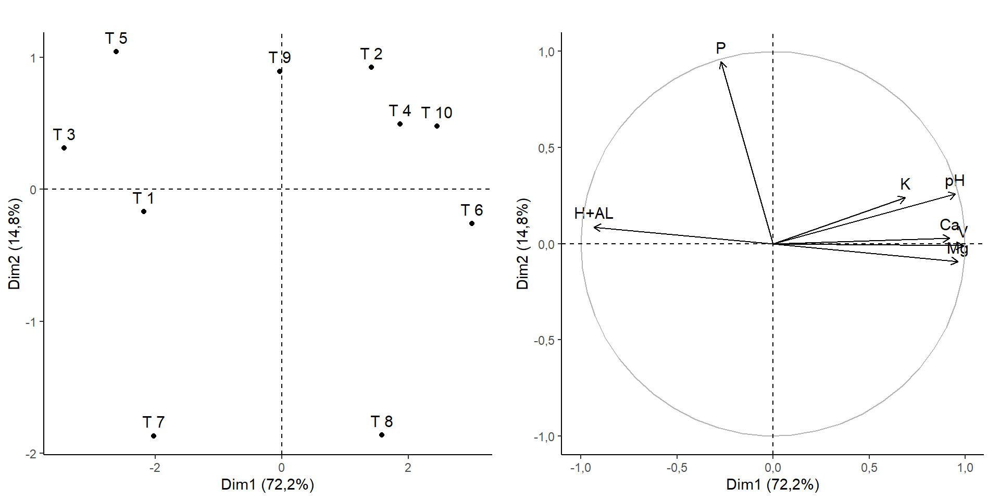

<br>

### Modificando nome dos pontos


```r
rownames(pca$ind$coord)=c("A","J","B","C","D","E","F","G","H","I")
plot(pca$ind$coord, # Extraindo da pca os valores das coordenadas em x e CP1 e y e CP2
     xlab="CP1 (72.2 %)", # renomeando eixo x
     ylab="CP2 (14.8 %)", # renomeando eixo y
     pch=16) # alterando formato de ponto ("Bolinha preenchida")
abline(h=0,v=0, lty=2) # traçando linha em x e y = 0; lty=2 é linha tracejada 
text(pca$ind$coord[,1],
     pca$ind$coord[,2]-0.1, 
     rownames(pca$ind$coord))
```

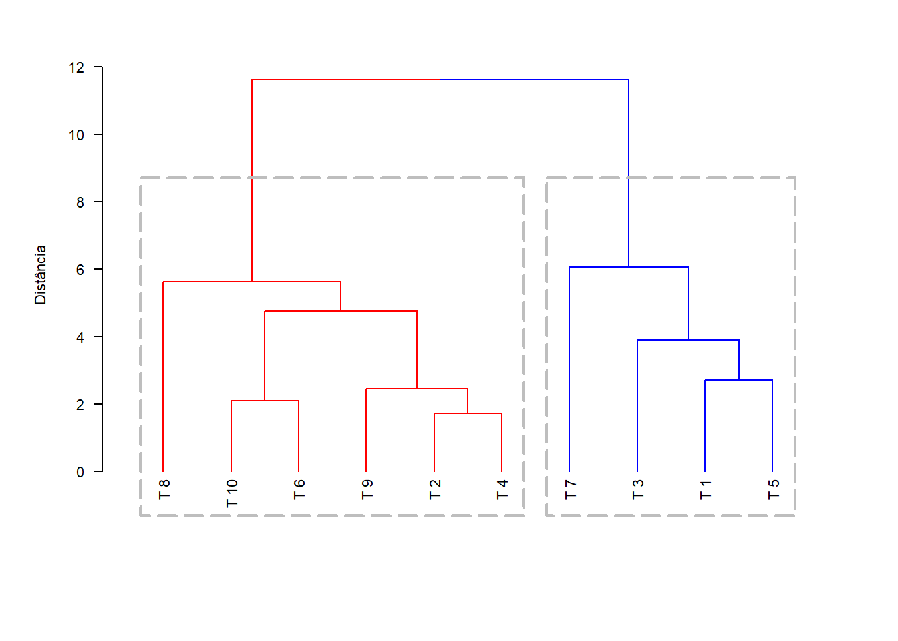

<br>

### Limite da seta dos vetores


```r
plot(pca$var$coord, # Extraindo da pca os valores da coordenadas em x e y dos vetores resposta
     xlab="CP1 (72.2 %)", # renomeando eixo x
     ylab="CP2 (14.8 %)", # renomeando eixo y
     pch=16, # alterando formato de ponto ("Bolinha preenchida")
     ylim=c(-1,1), # Alterando escala de Y para -1 até 1
     xlim=c(-1,1)) # Alterando escala de X para -1 até 1
abline(h=0,v=0, lty=2) # traçando linha em x e y = 0; lty=2 é linha tracejada 
```

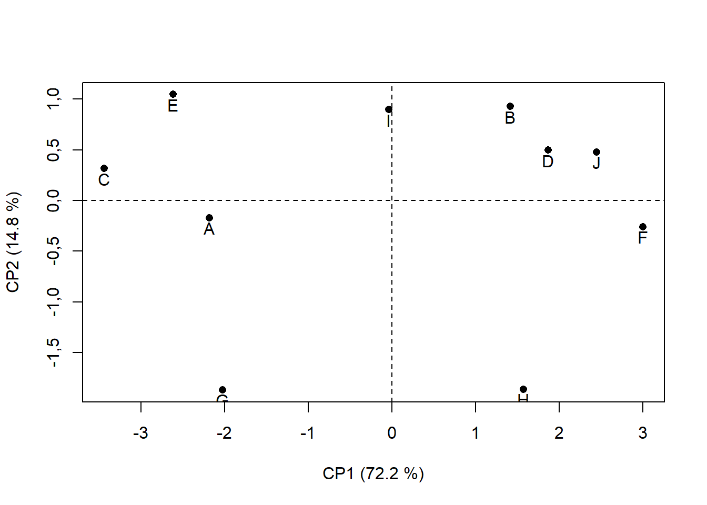

<br>

### Convertendo o ponto para seta

Neste caso, temos que criar setas individuais e plotar sobre o nosso gráfico.

Ex. 

 - `pca$var$coord[1,1]`: extraindo de `pca` o valor da coordenada X para o vetor 1, em que de `pca`, localiza-se na linha 1 e coluna 1
 - `pca$var$coord[1,2]`: extraindo de `pca` o valor da coordenada y para o vetor 1, em que de `pca`, localiza-se na linha 1 e coluna 2


```r
plot(pca$var$coord, 
     xlab="CP1 (72.2 %)",
     ylab="CP2 (14.8 %)",
     col="white", # Estou definindo como branco para apagar os pontos
     ylim=c(-1.5,1.5),
     xlim=c(-1.5,1.5))
abline(h=0,v=0, lty=2)
arrows(0,0,pca$var$coord[1,1],pca$var$coord[1,2], length = 0.1) # vetor 1 - pH
arrows(0,0,pca$var$coord[2,1],pca$var$coord[2,2], length = 0.1) # vetor 2 - HAL
arrows(0,0,pca$var$coord[3,1],pca$var$coord[3,2], length = 0.1) # vetor 3 - K
arrows(0,0,pca$var$coord[4,1],pca$var$coord[4,2], length = 0.1) # vetor 4 - P
arrows(0,0,pca$var$coord[5,1],pca$var$coord[5,2], length = 0.1) # vetor 5 - Ca
arrows(0,0,pca$var$coord[6,1],pca$var$coord[6,2], length = 0.1) # vetor 6 - Mg
arrows(0,0,pca$var$coord[7,1],pca$var$coord[7,2], length = 0.1) # vetor 7 - V
text(pca$var$coord-0.01,rownames(pca$var$coord)) # Estou colocando os nomes dos vetores (-0.01 significa abaixo da coordenada a 0.01)
```

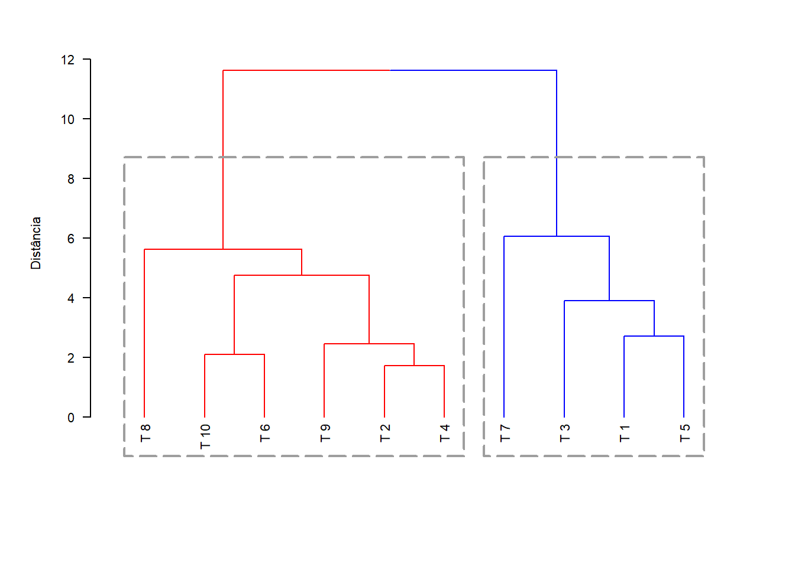

<br>

### Alterando posição do nome do vetores

Existem pesquisadores que preferem que o nome dos vetores quando x é positivo esteja a direita da extremidade da seta e quando x é negativo, o nome esteja a esquerda da seta. Neste caso, podemos utilizar a função `ifelse` dentro de `text()` 


```r
plot(pca$var$coord, 
     xlab="CP1 (72.2 %)",
     ylab="CP2 (14.8 %)",
     col="white",
     ylim=c(-0.5,1),
     xlim=c(-1.5,1.5))
abline(h=0,v=0, lty=2)
arrows(0,0,pca$var$coord[1,1],pca$var$coord[1,2], length = 0.1)
arrows(0,0,pca$var$coord[2,1],pca$var$coord[2,2], length = 0.1)
arrows(0,0,pca$var$coord[3,1],pca$var$coord[3,2], length = 0.1)
arrows(0,0,pca$var$coord[4,1],pca$var$coord[4,2], length = 0.1)
arrows(0,0,pca$var$coord[5,1],pca$var$coord[5,2], length = 0.1)
arrows(0,0,pca$var$coord[6,1],pca$var$coord[6,2], length = 0.1)
arrows(0,0,pca$var$coord[7,1],pca$var$coord[7,2], length = 0.1)
text(pca$var$coord[,1]+
       ifelse(pca$var$coord[,1]<0,-0.2,+0.2),  
     pca$var$coord[,2],rownames(pca$var$coord))
```

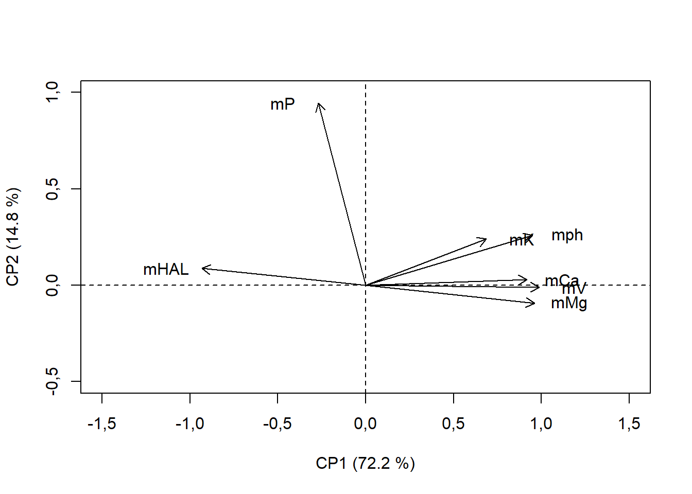

`ifelse(pca$var$coord[,1]<0,-0.2,+0.2)`: estamos definindo que se `pca$var$coord[,1]` for menor que 0, irá adicionar -0.2, do contrário irá somar 0.2

**Obs.** Nessa caso estamos alterando apenas em X, este princípio também pode ser aplicado em Y. Também é possível estabelecer manualmente a localização do texto (Criar um vetor com as coordenadas) 

<br>

### Adicionando círculo com raio do maior vetor resposta


```r
library(plotrix)
plot(pca$var$coord, 
     xlab="CP1 (72.2 %)",
     ylab="CP2 (14.8 %)",
     col="white",
     ylim=c(-1,1),
     xlim=c(-1.5,1.5))
abline(h=0,v=0, lty=2)
arrows(0,0,pca$var$coord[1,1],pca$var$coord[1,2], length = 0.1)
arrows(0,0,pca$var$coord[2,1],pca$var$coord[2,2], length = 0.1)
arrows(0,0,pca$var$coord[3,1],pca$var$coord[3,2], length = 0.1)
arrows(0,0,pca$var$coord[4,1],pca$var$coord[4,2], length = 0.1)
arrows(0,0,pca$var$coord[5,1],pca$var$coord[5,2], length = 0.1)
arrows(0,0,pca$var$coord[6,1],pca$var$coord[6,2], length = 0.1)
arrows(0,0,pca$var$coord[7,1],pca$var$coord[7,2], length = 0.1)
text(pca$var$coord[,1]+ifelse(pca$var$coord[,1]<0,-0.2,+0.2),
     pca$var$coord[,2],rownames(pca$var$coord))
draw.circle(0,0,max(ifelse(c(pca$var$coord[,1],pca$var$coord[,2])<0,
                           c(pca$var$coord[,1],pca$var$coord[,2])*-1,
                           c(pca$var$coord[,1],pca$var$coord[,2]))))
```

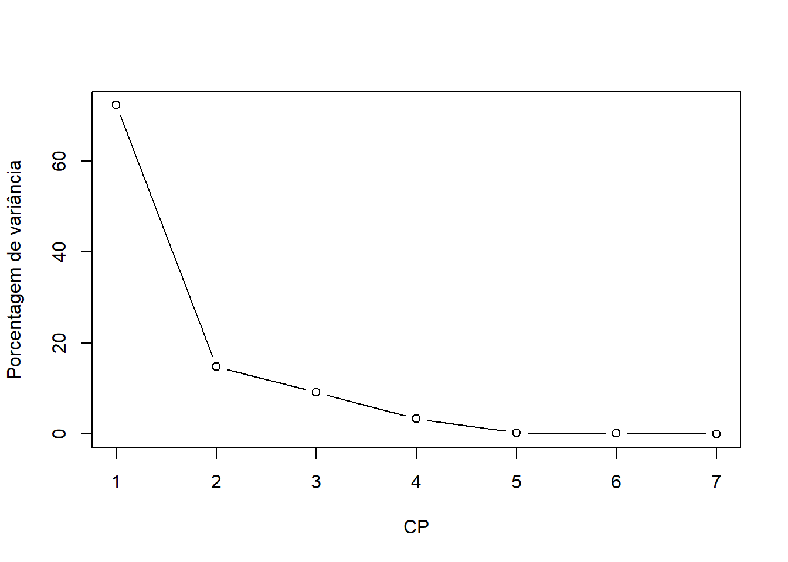

<br>

### Renomeando vetores


```r
rownames(pca$var$coord)=c("pH","H+AL","K","P","Ca","Mg","V%") # renomeando vetores
library(plotrix)
plot(pca$var$coord, 
     xlab="CP1 (72.2 %)",
     ylab="CP2 (14.8 %)",
     col="white",
     ylim=c(-1,1),
     xlim=c(-1.5,1.5))
abline(h=0,v=0, lty=2)
arrows(0,0,pca$var$coord[1,1],pca$var$coord[1,2], length = 0.1)
arrows(0,0,pca$var$coord[2,1],pca$var$coord[2,2], length = 0.1)
arrows(0,0,pca$var$coord[3,1],pca$var$coord[3,2], length = 0.1)
arrows(0,0,pca$var$coord[4,1],pca$var$coord[4,2], length = 0.1)
arrows(0,0,pca$var$coord[5,1],pca$var$coord[5,2], length = 0.1)
arrows(0,0,pca$var$coord[6,1],pca$var$coord[6,2], length = 0.1)
arrows(0,0,pca$var$coord[7,1],pca$var$coord[7,2], length = 0.1)
text(c(1.05,  -1.1, 0.8, -0.3, 1,  1.05,  1.1),
     c(0.3, 0.1, 0.3,  1, 0.06, -0.1, -0),
     rownames(pca$var$coord))
draw.circle(0,0,max(ifelse(c(pca$var$coord[,1],pca$var$coord[,2])<0,
                           c(pca$var$coord[,1],pca$var$coord[,2])*-1,
                           c(pca$var$coord[,1],pca$var$coord[,2]))))
```


<br><br>

****

## Screeplot

****

<br><br>

### Conjunto de dados


```r
Trat=rep(c(paste("T",1:10)), e=12)
dados=data.frame(Trat,ph,HAL,K,P,Ca,Mg,V)
```

<br>

### Calculando as médias


```r
mph=tapply(ph, Trat, mean)
mHAL=tapply(HAL, Trat, mean)
mK=tapply(K, Trat, mean)
mP=tapply(P, Trat, mean)
mCa=tapply(Ca, Trat, mean)
mMg=tapply(Mg, Trat, mean)
mV=tapply(V, Trat, mean)
dadosm=data.frame(mph,mHAL,mK,mP,mCa,mMg,mV)
```

<br>

### Pacote FactomineR


```r
library(FactoMineR)
pca=PCA(dadosm)
```

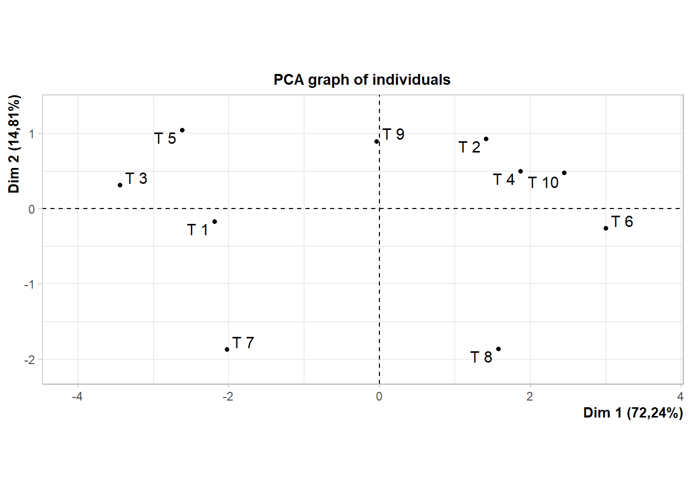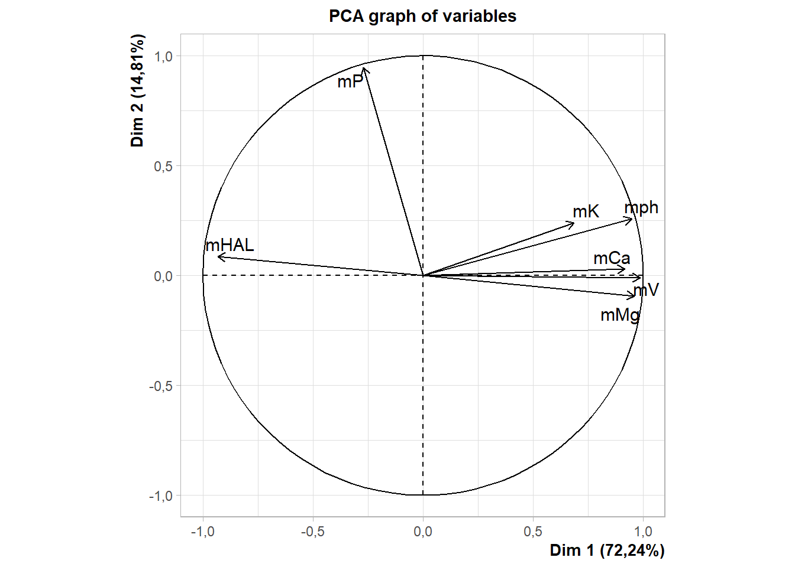

<br>

### Screeplot do factoextra


```r
library(factoextra)
fviz_screeplot(pca)
```

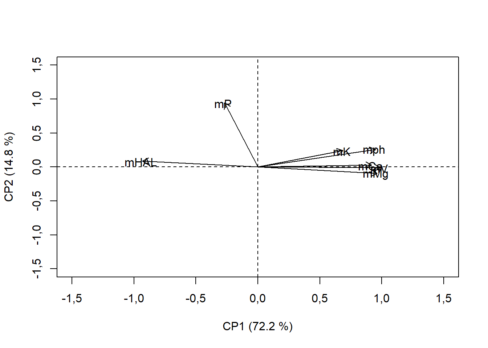


```r
fviz_screeplot(pca,
               title="", # removendo título
               font.family="serif", # fonte times new roman
               barcolor="black", # cor da borda preto
               addlabels=T,
               ggtheme=theme_classic())+
  xlab("Componente Principal")+ # nomeando eixo x
  ylab("Porcentagem de explicação da variância") # nomeando eixo y
```

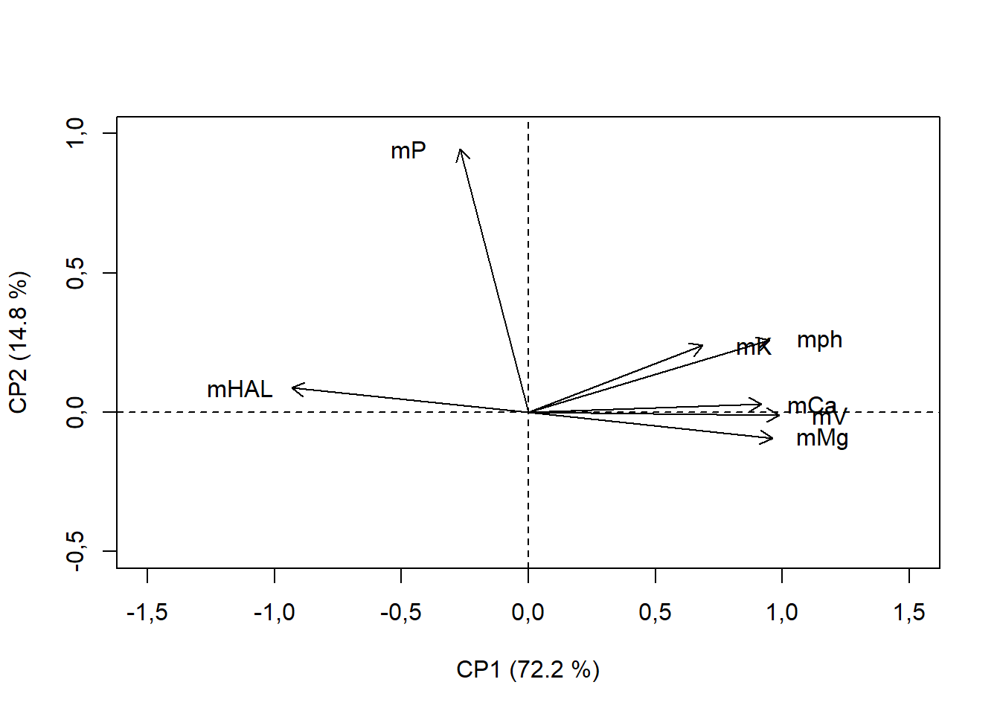

<br>

****

## Manualmente pelo stats

****

<br>

### Somente colunas


```r
par(family="serif") # fonte times new roman
bar=barplot(pca$eig[,2], 
        ylim=c(0,100))
```

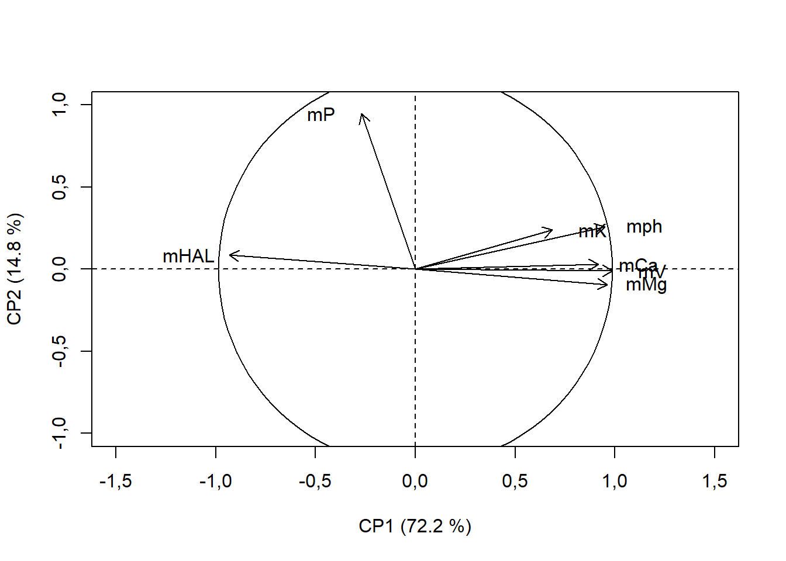

<br>

### Com colunas, pontos e linhas


```r
par(family="serif") # fonte times new roman
bar=barplot(pca$eig[,2], 
        ylim=c(0,100))
points(bar,
       pca$eig[,2], 
       type = "o")
```

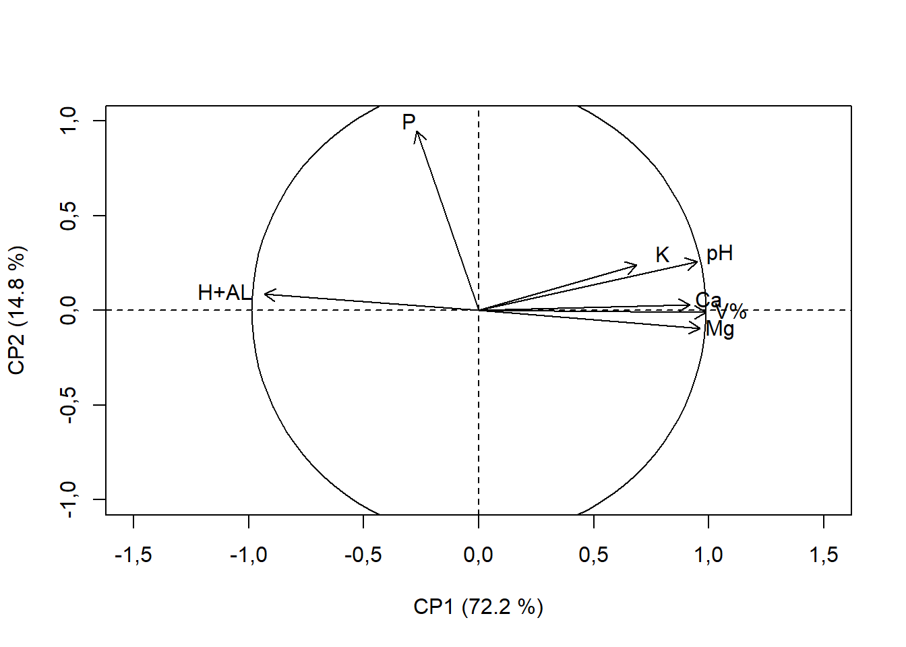

<br>

### Com colunas, pontos, linhas e legenda


```r
par(family="serif") # fonte times new roman
bar=barplot(pca$eig[,2], 
        ylim=c(0,100))
points(bar,
       pca$eig[,2], 
       type = "o")
text(bar,
     pca$eig[,2]+5,
     round(pca$eig[,2],2))
```


<br>

### Editando


```r
rownames(pca$eig)=c(paste("CP",1:length(pca$eig[,2])))
par(family="serif") # fonte times new roman
bar=barplot(pca$eig[,2], 
        ylim=c(0,100),
        las=1,
        col="darkblue",
        xlab="Componente principal",
        ylab="Porcentagem de explicação")
abline(h=0)
points(bar,
       pca$eig[,2], 
       type = "o")
text(bar,
     pca$eig[,2]+5,
     round(pca$eig[,2],2))
```

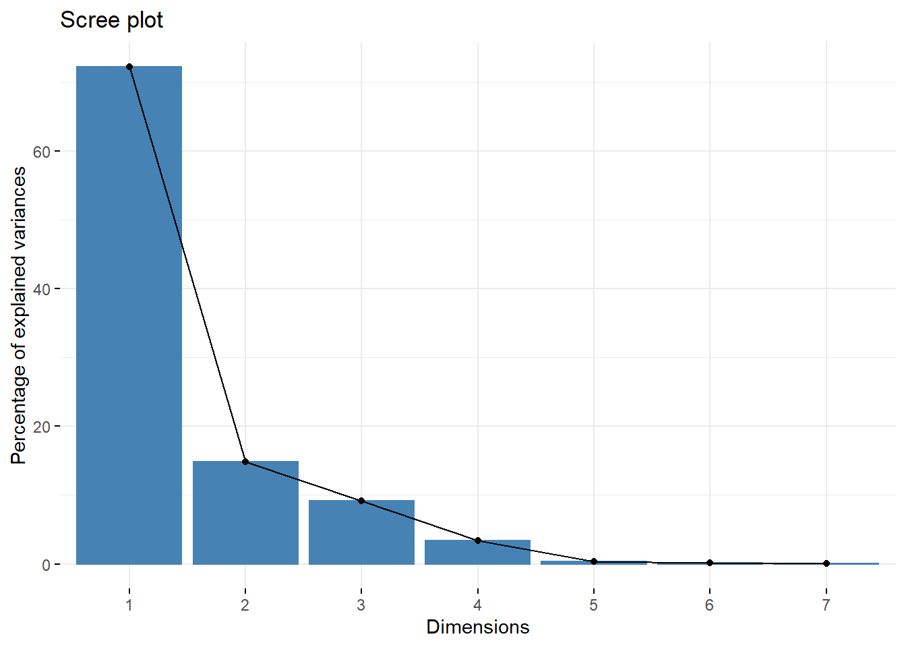

<br><br>

****

## Correlação com variável latente

****

<br><br>

### Calculando as médias


```r
mph=tapply(ph, Trat, mean)
mHAL=tapply(HAL, Trat, mean)
mK=tapply(K, Trat, mean)
mP=tapply(P, Trat, mean)
mCa=tapply(Ca, Trat, mean)
mMg=tapply(Mg, Trat, mean)
mV=tapply(V, Trat, mean)
dadosm=data.frame(mph,mHAL,mK,mP,mCa,mMg,mV)
```

<br>

## Pacote psych


```r
library(psych)
pca.solo <- principal(scale(dadosm), # scale é para padronizar dados
                      nfactors=5,  # Numero de componentes
                      n.obs=10, # possui 10 observações/ variável
                      rotate='none', 
                      scores=TRUE)
pca.solo
```

```
## Principal Components Analysis
## Call: principal(r = scale(dadosm), nfactors = 5, rotate = "none", n.obs = 10, 
##     scores = TRUE)
## Standardized loadings (pattern matrix) based upon correlation matrix
##        PC1   PC2   PC3   PC4   PC5 h2      u2 com
## mph   0,95  0,26 -0,02 -0,14  0,12  1 3,1e-04 1,2
## mHAL -0,93  0,09  0,20  0,28  0,06  1 5,4e-04 1,3
## mK    0,69  0,24  0,69 -0,01 -0,02  1 7,4e-04 2,2
## mP   -0,27  0,95 -0,17  0,03 -0,04  1 5,4e-05 1,2
## mCa   0,92  0,03 -0,28  0,28  0,02  1 2,9e-03 1,4
## mMg   0,96 -0,09  0,08  0,24 -0,04  1 2,9e-03 1,2
## mV    0,99 -0,01 -0,13 -0,08 -0,03  1 8,4e-04 1,1
## 
##                        PC1  PC2  PC3  PC4  PC5
## SS loadings           5,06 1,04 0,64 0,24 0,02
## Proportion Var        0,72 0,15 0,09 0,03 0,00
## Cumulative Var        0,72 0,87 0,96 1,00 1,00
## Proportion Explained  0,72 0,15 0,09 0,03 0,00
## Cumulative Proportion 0,72 0,87 0,96 1,00 1,00
## 
## Mean item complexity =  1,4
## Test of the hypothesis that 5 components are sufficient.
## 
## The root mean square of the residuals (RMSR) is  0 
##  with the empirical chi square  0  with prob <  NA 
## 
## Fit based upon off diagonal values = 1
```

<br>

### Extraindo correlações


```r
(load <- pca.solo$loadings)
```

```
## 
## Loadings:
##      PC1    PC2    PC3    PC4    PC5   
## mph   0,949  0,258        -0,137  0,116
## mHAL -0,933         0,201  0,278       
## mK    0,687  0,240  0,685              
## mP   -0,270  0,946 -0,171              
## mCa   0,918        -0,277  0,276       
## mMg   0,961                0,239       
## mV    0,987        -0,129              
## 
##                  PC1   PC2   PC3   PC4   PC5
## SS loadings    5,057 1,037 0,639 0,237 0,022
## Proportion Var 0,722 0,148 0,091 0,034 0,003
## Cumulative Var 0,722 0,871 0,962 0,996 0,999
```

<br>

### Correlação com a variável latente CP1


```r
library(lattice)
sorted.loadings1 <- load[order(load[,1]),1]
(load1 <- dotplot(sorted.loadings1,
                 cex=1.5,
                 xlab="Correlação com a variável latente",
                 col="black",
                 scales=list(fontfamily="serif",cex=1.2),
                 auto.key=list(cex=1.2),
                 pch=16))
```

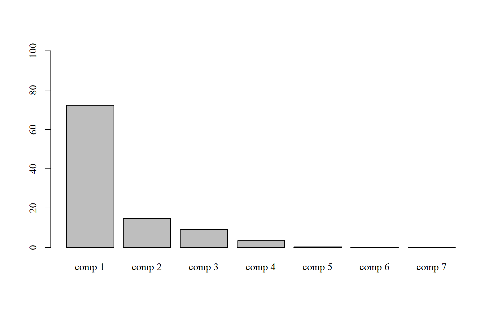

<br>

### Correlação com a variável latente CP2


```r
sorted.loadings2 <- load[order(load[,2]),2]
(load2 <- dotplot(sorted.loadings2,
                 cex=1.5,
                 xlab="Correlação com a variável latente",
                 col="black",
                 scales=list(fontfamily="serif",cex=1.2),
                 pch=16))
```

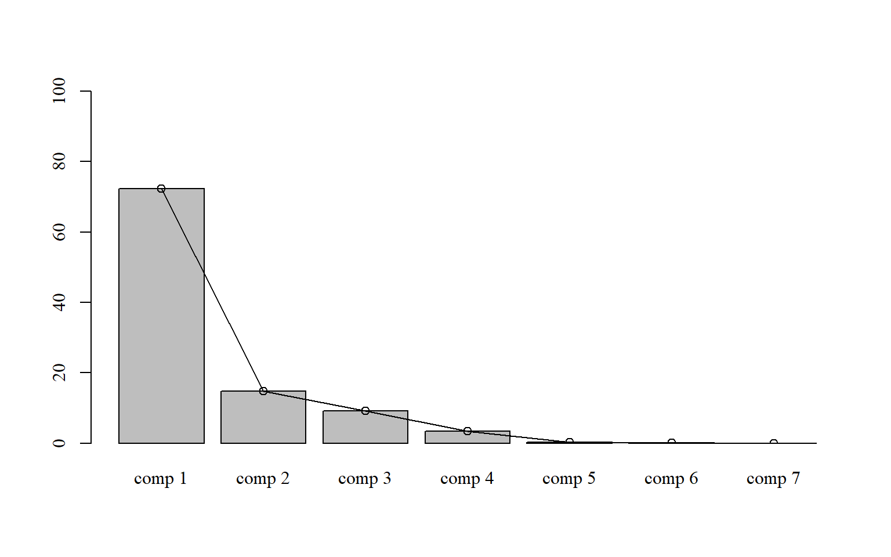

<br>

### Correlação com a variável latente CP3


```r
sorted.loadings3 <- load[order(load[,3]),3]
(load3 <- dotplot(sorted.loadings3,
                 cex=1.5,
                 xlab="Correlação com a variável latente",
                 col="black",
                 scales=list(fontfamily="serif",cex=1.2),
                 pch=16))
```

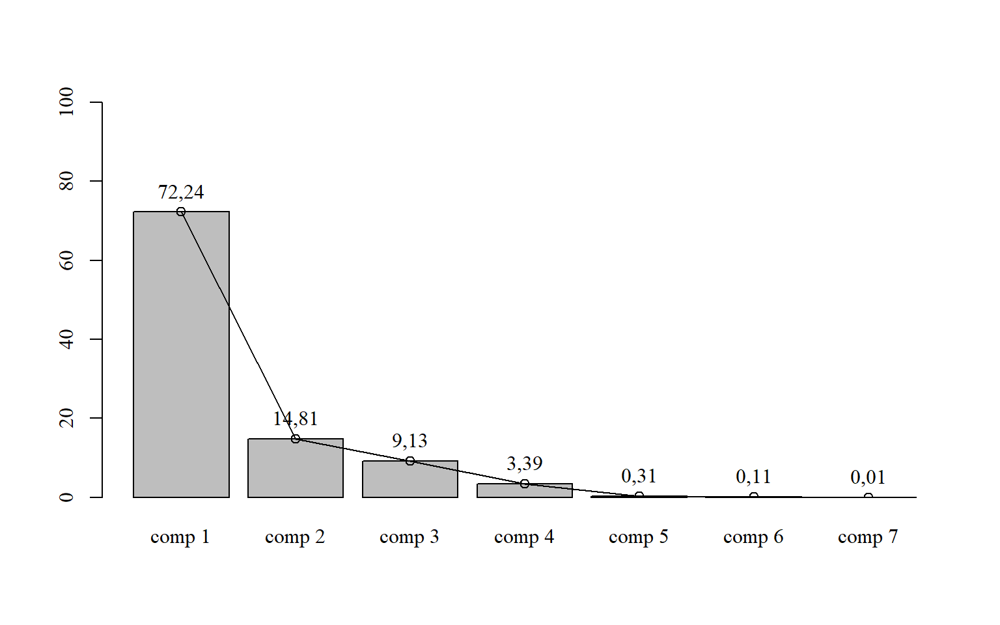

<br><br><br>

****

## Extraindo cluster de forma automática

****

### Conjunto de dados


```r
var1=c(rnorm(20,10,2),rnorm(20,20,2),rnorm(20,15,2))
var2=c(rnorm(20,20,2),rnorm(20,18,2),rnorm(20,15,2))
var3=c(rnorm(20,100,2),rnorm(20,60,2),rnorm(20,80,2))
var4=c(rnorm(20,150,2),rnorm(20,160,2),rnorm(20,140,2))
trat=paste("T",1:60)
dados=data.frame(trat,var1,var2,var3,var4)
```

### Construindo Dendrograma

Obs. método UPGMA - average


```r
dend=as.dendrogram(hclust(dist(scale(dados[,2:5])),method = "average"))
library(dendextend)
dend=set(dend,
         "branches_k_color", 
         value = 1:3, 
         k = 3)
```

### Extraindo cluster


```r
cluster=as.factor(as.vector(cutree(dend,k=3)))
```

### PCA

Obs. Não editado


```r
library(factoextra);library(FactoMineR)
data=dados[,2:5]
rownames(data)=dados$trat
fviz_pca_biplot(PCA(data),col.ind = cluster, addEllipses = T) # default e padronizado
```

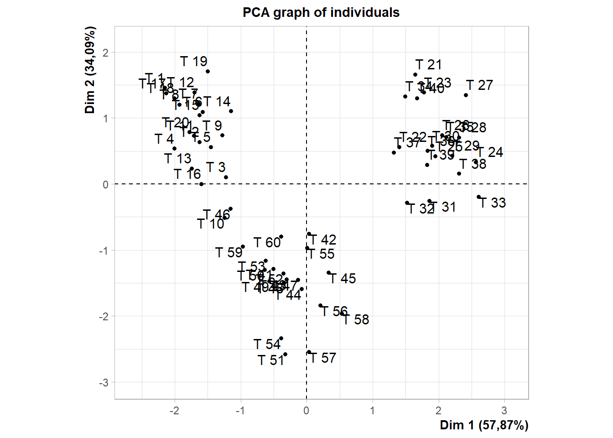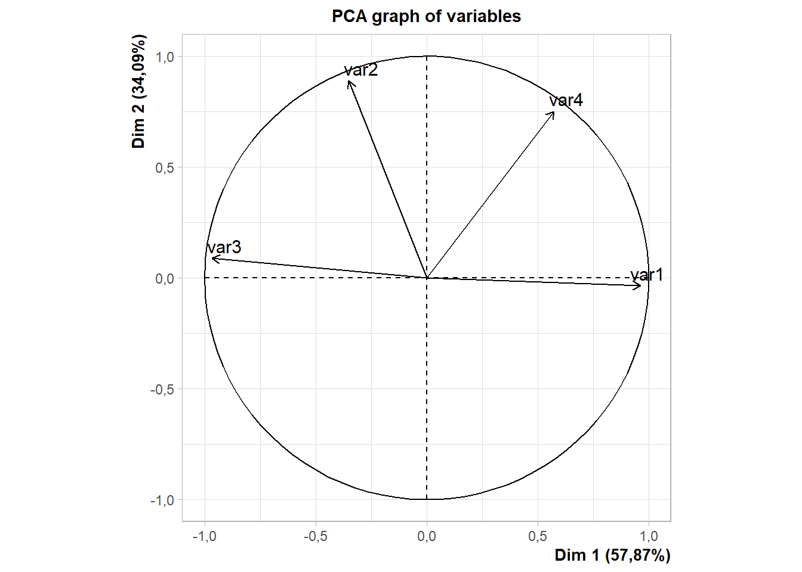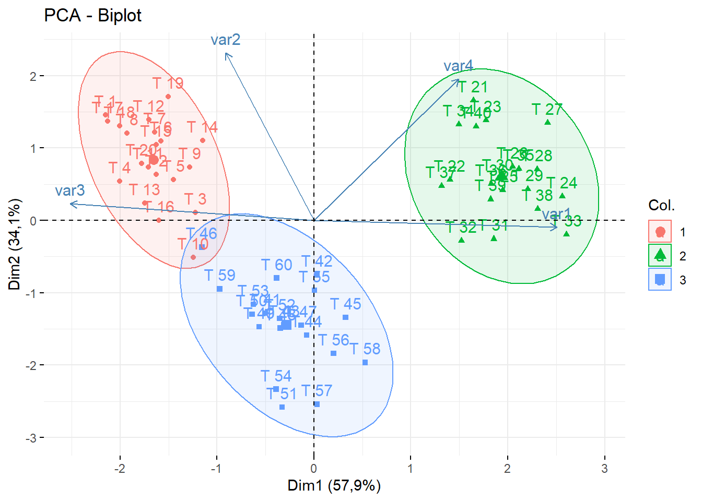

****

# Dendograma

****


### Conjunto de dados

Violent Crime Rates by US State

Description

This data set contains statistics, in arrests per 100,000 residents for assault, murder, and rape in each of the 50 US states in 1973. Also given is the percent of the population living in urban areas. 

McNeil, D. R. (1977) Interactive Data Analysis. New York: Wiley.


```r
data("USArrests")
USArrests
```

```
##                Murder Assault UrbanPop Rape
## Alabama          13,2     236       58 21,2
## Alaska           10,0     263       48 44,5
## Arizona           8,1     294       80 31,0
## Arkansas          8,8     190       50 19,5
## California        9,0     276       91 40,6
## Colorado          7,9     204       78 38,7
## Connecticut       3,3     110       77 11,1
## Delaware          5,9     238       72 15,8
## Florida          15,4     335       80 31,9
## Georgia          17,4     211       60 25,8
## Hawaii            5,3      46       83 20,2
## Idaho             2,6     120       54 14,2
## Illinois         10,4     249       83 24,0
## Indiana           7,2     113       65 21,0
## Iowa              2,2      56       57 11,3
## Kansas            6,0     115       66 18,0
## Kentucky          9,7     109       52 16,3
## Louisiana        15,4     249       66 22,2
## Maine             2,1      83       51  7,8
## Maryland         11,3     300       67 27,8
## Massachusetts     4,4     149       85 16,3
## Michigan         12,1     255       74 35,1
## Minnesota         2,7      72       66 14,9
## Mississippi      16,1     259       44 17,1
## Missouri          9,0     178       70 28,2
## Montana           6,0     109       53 16,4
## Nebraska          4,3     102       62 16,5
## Nevada           12,2     252       81 46,0
## New Hampshire     2,1      57       56  9,5
## New Jersey        7,4     159       89 18,8
## New Mexico       11,4     285       70 32,1
## New York         11,1     254       86 26,1
## North Carolina   13,0     337       45 16,1
## North Dakota      0,8      45       44  7,3
## Ohio              7,3     120       75 21,4
## Oklahoma          6,6     151       68 20,0
## Oregon            4,9     159       67 29,3
## Pennsylvania      6,3     106       72 14,9
## Rhode Island      3,4     174       87  8,3
## South Carolina   14,4     279       48 22,5
## South Dakota      3,8      86       45 12,8
## Tennessee        13,2     188       59 26,9
## Texas            12,7     201       80 25,5
## Utah              3,2     120       80 22,9
## Vermont           2,2      48       32 11,2
## Virginia          8,5     156       63 20,7
## Washington        4,0     145       73 26,2
## West Virginia     5,7      81       39  9,3
## Wisconsin         2,6      53       66 10,8
## Wyoming           6,8     161       60 15,6
```

<br>

### Calculando as distâncias


```r
d=dist(USArrests)
R=hclust(d)
```

<br>

### Dendograma


```r
plot(R)
```

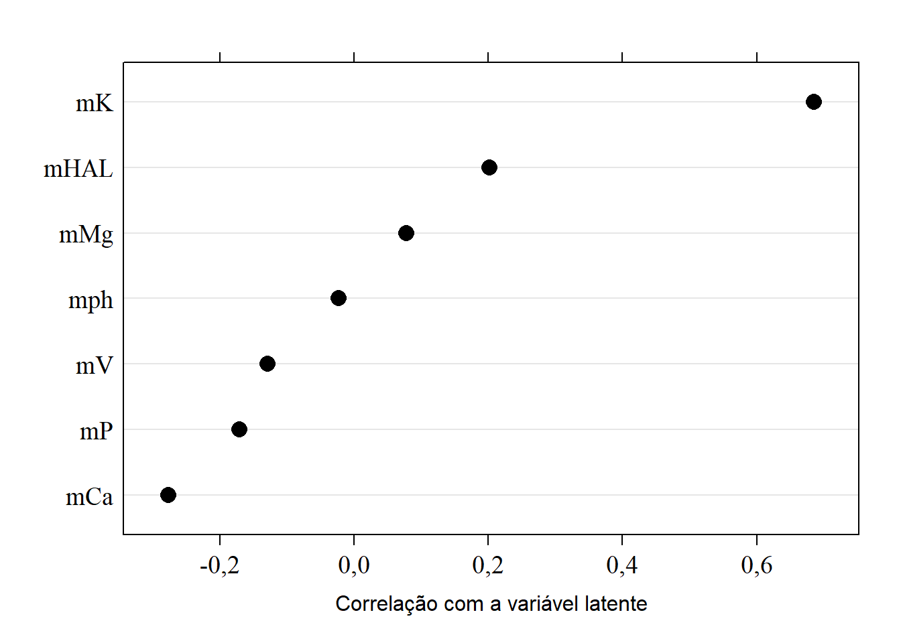

<br>

### Altura dos rótulos


```r
plot(R, hang=-1)
```

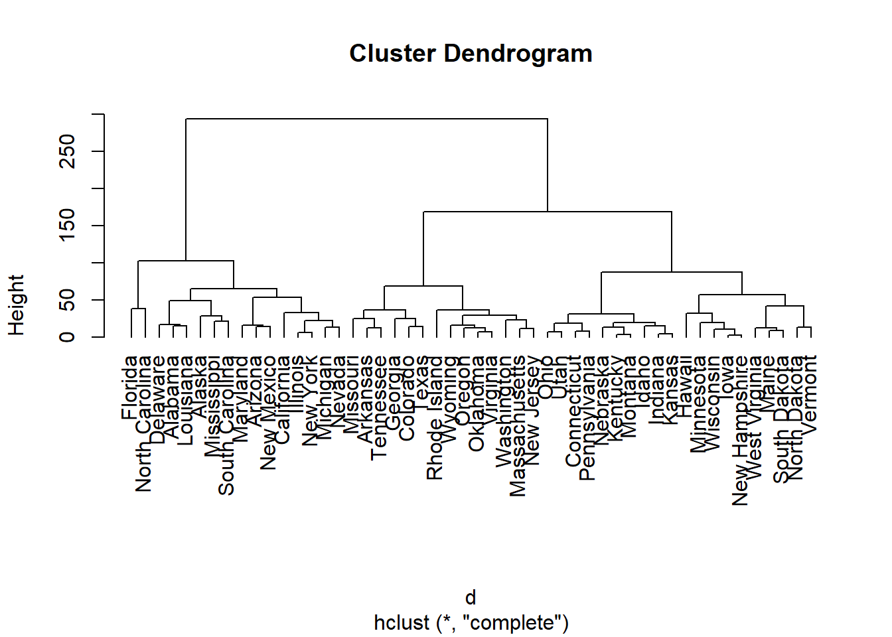

<br>

### Editando argumentos


```r
plot(R, 
     las=1, # Escala do eixo na horizontal
     hang=-1, # alinhas altura dos rótulos
     main="", # Título vazio
     ylab="Dist?ncia") # Título do eixo Y
```

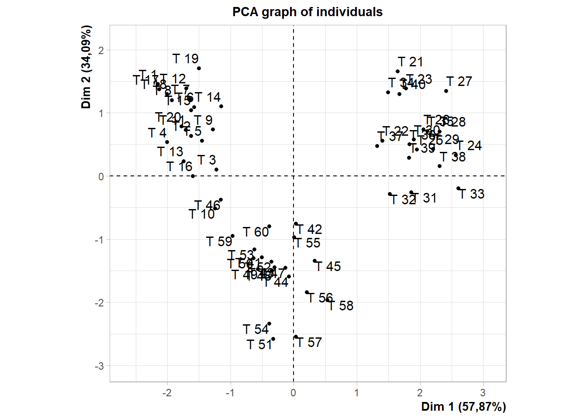

<br>

### Separando em grupos

Neste exemplo vamos considerar dois grupos


```r
# Chamando package dendextend
library(dendextend)

# Construindo o dendograma
dend=as.dendrogram(hclust(dist(USArrests), method='average'))

# Definindo cores e grupos para o dendograma
dend=set(dend,"branches_k_color", 
             value = c("red", "blue"), k = 2)

# Plotando o gráfico
par(cex=0.7)
plot(dend, 
     las=1, 
     ylab="Distância")
```


<br>

### Caixas separando grupos


```r
library(dendextend)
dend=as.dendrogram(hclust(dist(USArrests), 
                          method='average'))
dend=set(dend,
         "branches_k_color", 
             value = c("red", "blue"), 
         k = 2)
par(cex=0.7, mai=c(1.2,0.8,0,0))
plot(dend, 
     las=1,
     ylab="Distância")
par(cex=0.8)
# Construindo caixa de separação entre os grupos
rect.dendrogram(dend,
                k=2, # Dois grupos
                border = 8, # cor da borda (8: cinza)
                lty = 5, # formato da linha
                lwd = 2) # espessura da linha
```

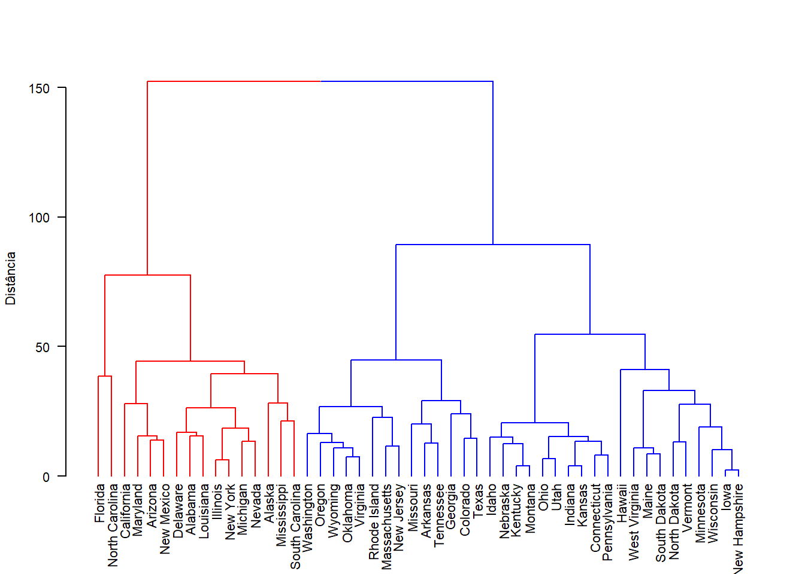

<br>

### Árvore filogenética (Em círculo)


```r
library(ape)
par(mar=c(0,0,1,0))
plot(as.phylo(R),
     cex=0.7, 
     hang=-1, 
     type="fan")
```


<br>

### Cor e separando por grupo


```r
par(mar=c(0,0,1,0))
clus=cutree(R,2)
colors=c("red","blue")
plot(as.phylo(R), 
     cex=0.7,
     hang=-1, 
     type="fan", 
     tip.color=colors[clus])
```


<br>

### Formato radial


```r
par(mar=c(0,0,1,0))
plot(as.phylo(R),
     cex=0.7, 
     hang=-1, 
     type="radial")
```


<br><br><br>

****

# Expression()

****

Durante a elaboração de gráficos no R, os títulos são inseridos conforme o nome da variável em que está analisando. Muitas vezes é necessário editar esses nomes no gráfico, entretanto, existem casos complexos em que é necessário inserir uma série de comandos para conseguir o desejado. Neste tutorial, iremos abordar a função `expression()` e alguns exemplos.

Não iremos trabalhar com um conjunto de dados neste exemplo, dessa forma, a linha respectiva ao `plot(1,1,axes=F, col="white", ylab="",xlab="")` serve apenas para utilizar a função legend() posteriormente. Lembrando que, a função `expression()` pode ser usada para todos os argumentos de renomeação (ylab, xlab, main, title, etc...)


<div style="column-count: 2;">

<br>


```r
plot(1,1,axes=F, col="white", ylab="",xlab="")
legend("center",
       legend="Resposta", 
       bty="n", 
       cex=2)
```

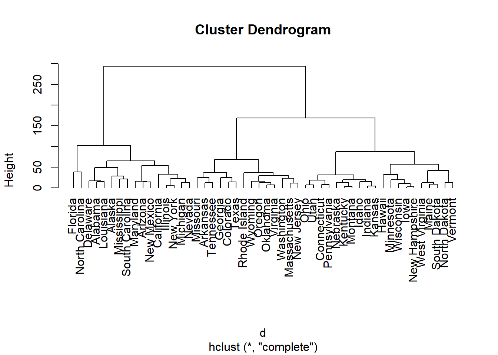


```r
plot(1,1,axes=F, col="white", ylab="",xlab="")
legend("center",
       legend=expression(sum()=="sum()"), 
       bty="n", 
       cex=2)
```

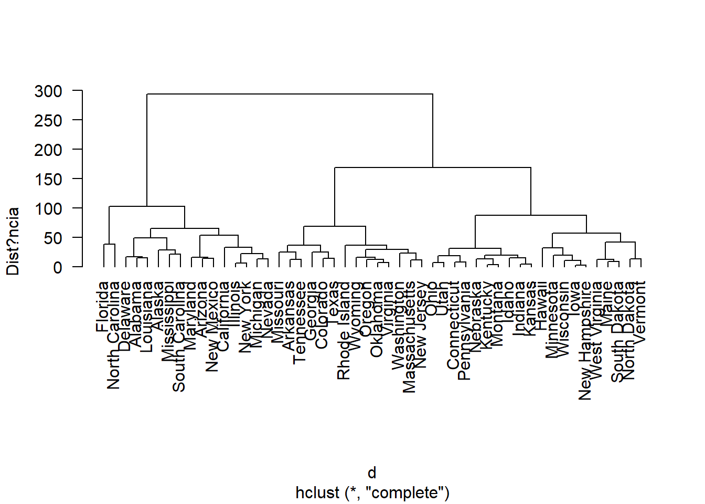


```r
plot(1,1,axes=F, col="white", ylab="",xlab="")
legend("center",
       legend=expression(delta == "delta"), 
       bty="n", 
       cex=2)
```

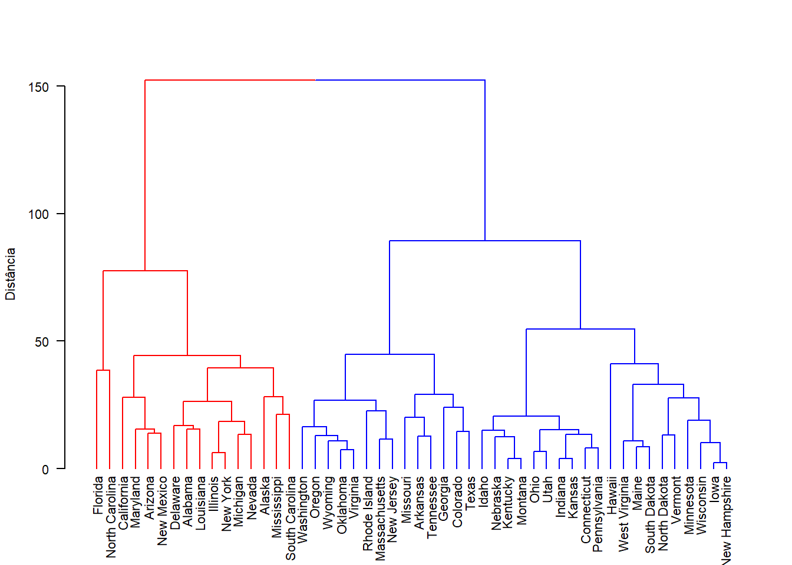


```r
plot(1,1,axes=F, col="white", ylab="",xlab="")
legend("center",
       legend=expression(alpha == "alpha"), 
       bty="n", 
       cex=2)
```

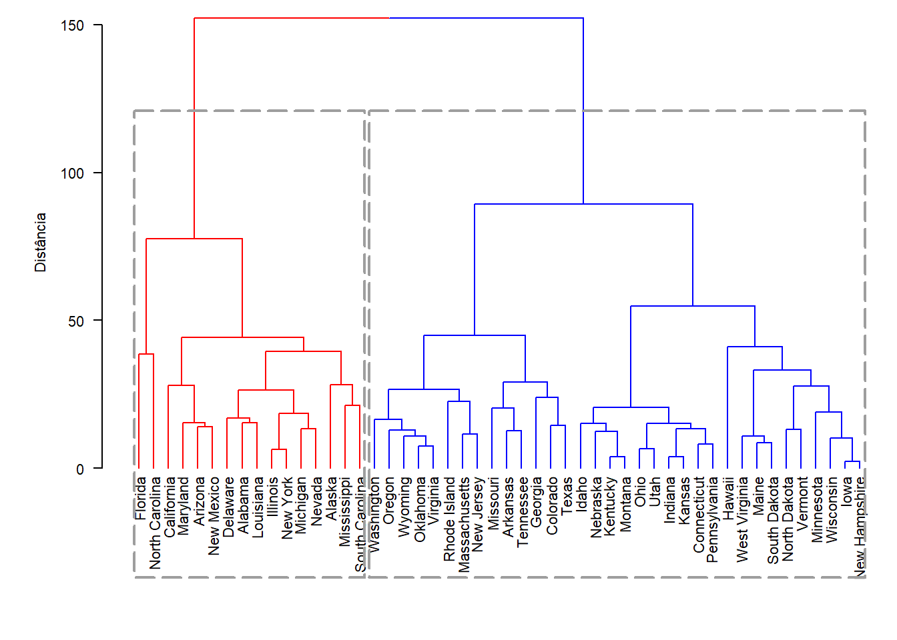


```r
plot(1,1,axes=F, col="white", ylab="",xlab="")
legend("center",
       legend=expression(beta =="beta"), 
       bty="n", 
       cex=2)
```


```r
plot(1,1,axes=F, col="white", ylab="",xlab="")
legend("center",
       legend=expression(gamma == "gamma"), 
       bty="n", 
       cex=2)
```


```r
plot(1,1,axes=F, col="white", ylab="",xlab="")
legend("center",
       legend=expression(mu == "mu"), 
       bty="n", 
       cex=2)
```


```r
plot(1,1,axes=F, col="white", ylab="",xlab="")
legend("center",
       legend=expression(sigma == "sigma"), 
       bty="n", 
       cex=2)
```


```r
plot(1,1,axes=F, col="white", ylab="",xlab="")
legend("center",
       legend=expression(pi == "pi"), 
       bty="n", 
       cex=2)
```

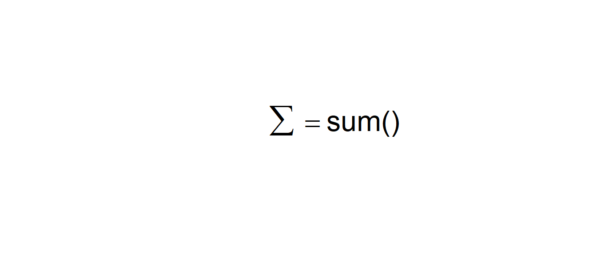


```r
plot(1,1,axes=F, col="white", ylab="",xlab="")
legend("center",
       legend=expression(epsilon == "epsilon"), 
       bty="n", 
       cex=2)
```


```r
plot(1,1,axes=F, col="white", ylab="",xlab="")
legend("center",
       legend=expression(lambda == "lambda"), 
       bty="n", 
       cex=2)
```


```r
plot(1,1,axes=F, col="white", ylab="",xlab="")
legend("center",
       legend=expression(italic(A) == "italic(A)"), 
       bty="n", 
       cex=2)
```


```r
plot(1,1,axes=F, col="white", ylab="",xlab="")
legend("center",legend=
      expression(bold(A) == "bold(A)"), 
       bty="n", 
       cex=2)
```


```r
plot(1,1,axes=F, col="white", ylab="",xlab="")
legend("center", 
       legend = expression(sigma^2==frac(sum((X[i]-mu)^2,i==1,n),N)), 
       bty="n", 
       cex=2)
```


<br>


```r
plot(1,1,axes=F, col="white", ylab="",xlab="")
legend("center",
       legend=expression(hat(Y) == "hat(y)"), 
       bty="n", 
       cex=2)
```


```r
plot(1,1,axes=F, col="white", ylab="",xlab="")
legend("center",
       legend=expression(bar(x) =="bar(x)"), 
       bty="n", 
       cex=2)
```


```r
plot(1,1,axes=F, col="white", ylab="",xlab="")
legend("center",
       legend=expression(sqrt(Y)=="sqrt(Y)"), 
       bty="n", 
       cex=2)
```

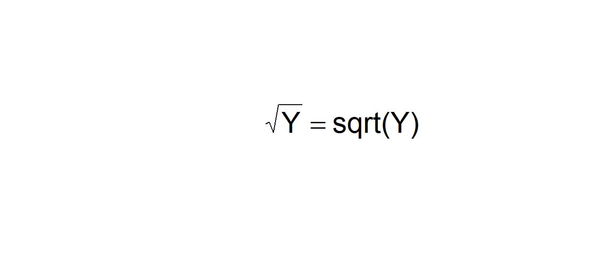


```r
plot(1,1,axes=F, col="white", ylab="",xlab="")
legend("center",
       legend=expression(x^2 == "x^2"), 
       bty="n", 
       cex=2)
```


```r
plot(1,1,axes=F, col="white", ylab="",xlab="")
legend("center",
       legend=expression(x[2] == "x[2]"), 
       bty="n", 
       cex=2)
```

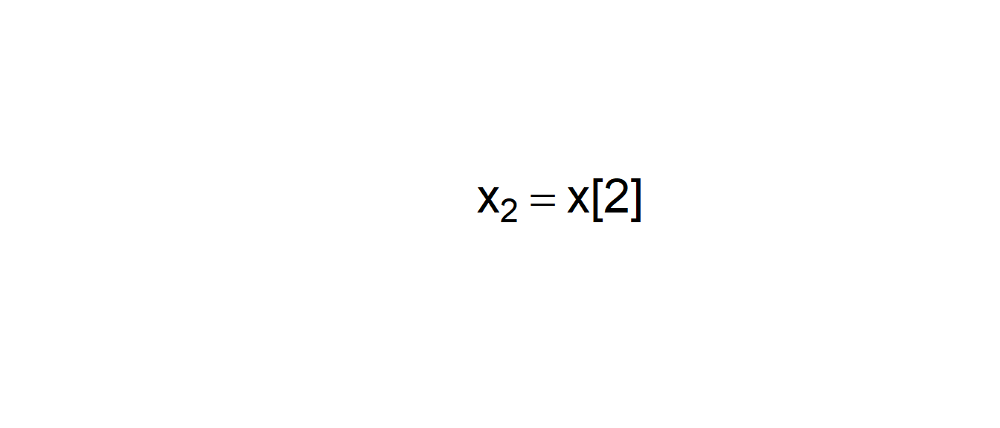


```r
plot(1,1,axes=F, col="white", ylab="",xlab="")
legend("center",legend=
expression("nome\nresposta"=="nome\\nresposta"), 
bty="n", 
cex=2)
```


```r
plot(1,1,axes=F, col="white", ylab="",xlab="")
legend("center",
legend=expression(hat(Y)==ax^2+bx+c,R^2==0.99), 
bty="n", 
cex=2)
```

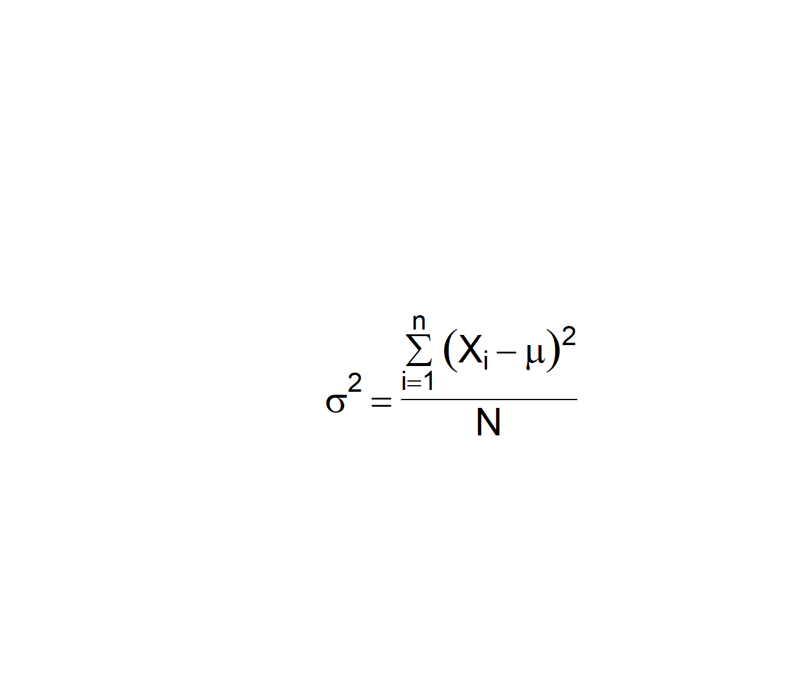


```r
plot(1,1,axes=F, col="white", ylab="",xlab="")
legend("center",
legend=expression(hat(Y)==ax^2+bx+c,R^2==0.99,italic(p-valor)==0.0001),
bty="n", cex=2)
```


```r
plot(1,1,axes=F, col="white", ylab="",xlab="")
legend("center",
legend=expression(Produtividade~(kg~ha^-1)), 
       bty="n", 
       cex=2)
```


```r
plot(1,1,axes=F, col="white", ylab="",xlab="")
legend("center",legend=
expression(H[2]*0[2]~(mu*"mol"~g^-1~MFPA)), 
       bty="n", 
       cex=2)
```

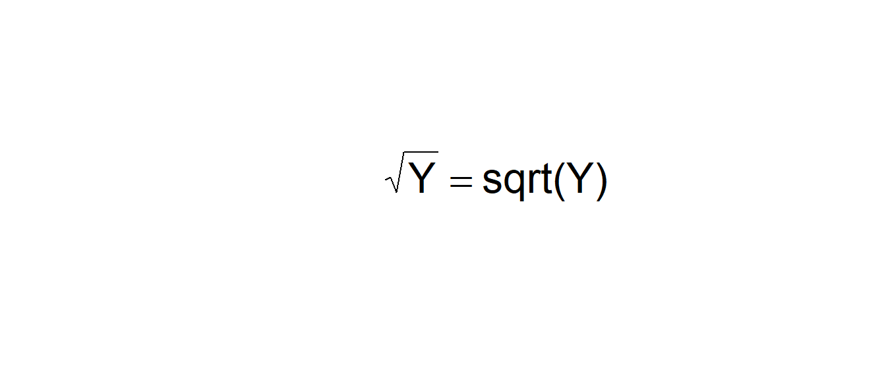


```r
plot(1,1,axes=F, col="white", ylab="",xlab="")
legend("center", 
legend=expression(MSPA~(g~kg^-1)), 
       bty="n", 
       cex=2)
```

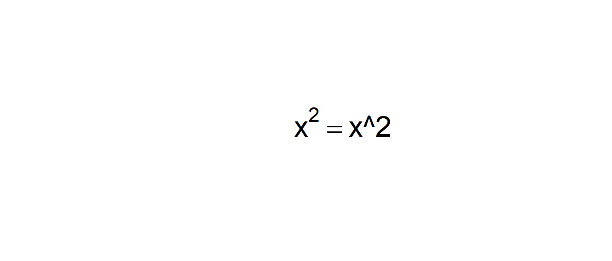


```r
plot(1,1,axes=F, col="white", ylab="",xlab="")
legend("center",legend=
expression(bold(italic(A)) == "bold(italic(A))"), 
       bty="n", 
       cex=2)
```

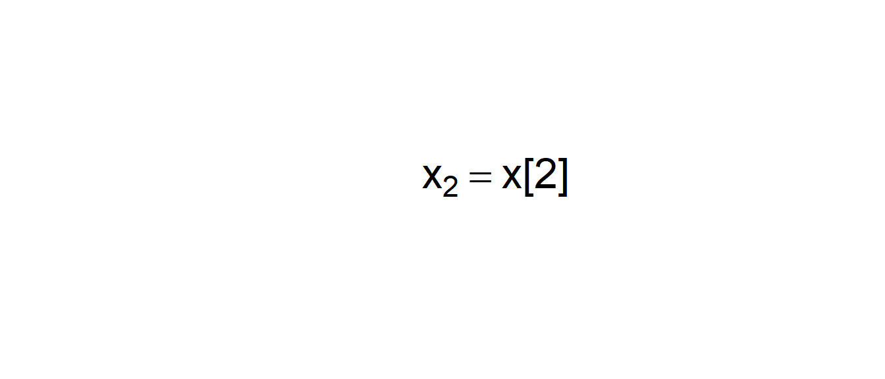


```r
plot(1,1,axes=F, col="white", ylab="",xlab="")
legend("center",
legend=expression(hat(Y)==ax^2+bx+c), 
       bty="n", 
       cex=2)
```


</div>

<br><br><br>

****

# layout (graphics)

****

<br>

### Como modificar o layout do R graphics

<br>

Durante a elaboração de gráficos no R, muitas vezes nos deparamos com problemas na margem (Títulos ou escalas ficam cortados) ou querem elaborar dois ou mais gráficos em uma única saída. Neste sentido, o presente tutorial irá abordar algumas funções para modificar o layout do gráfico base do R.

Não iremos trabalhar com um conjunto de dados neste exemplo, dessa forma, a linha respectiva ao `plot(1,1,axes=F, col="white", ylab="",xlab="")` serve apenas para demonstrar como alterar os parâmetros gráficos.

<br>

<div style="column-count: 1;">

****

### Gráfico Simples

****


```r
plot(1,1, ylab="Eixo Y",xlab="Eixo X")
```

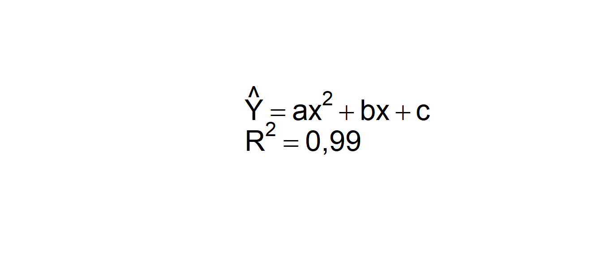

****

### Parâmetros de margem

****

<br>

O comando par(...) é utilizado para alterar os parâmetros gráficos e deve ser executando antes do gráfico. Entretanto, uma vez executado essa linha de comando, todos os outros gráficos irão apresentar o mesmo layout, exceto se fechar o Rstudio ou limpar todos os gráficos.

O comando mai representa o tamanho de margem e deve-se digitar um vetor numérico com quatro valores, sendo respectivamente em ordem, inferior, esquerda, superior e direita (`mai=c(bottom, left, top, right)`).

<br>


```r
par(mai=c(1,1,1,1))
plot(1,1, ylab="Eixo Y",xlab="Eixo X")
```

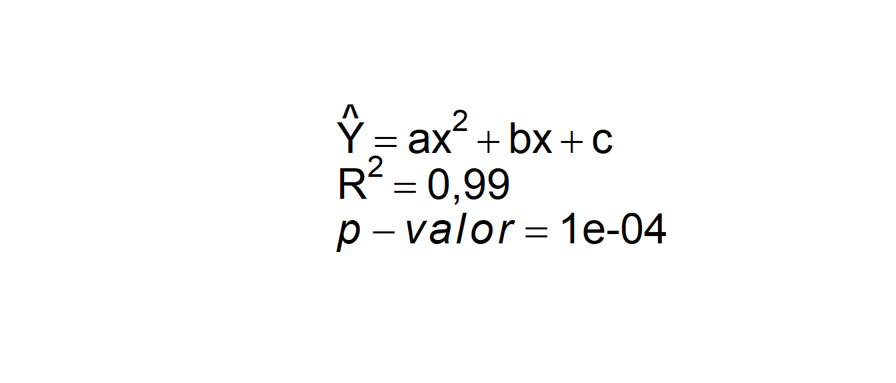

****

### Fonte do gráfico

****

O comando para alterar a fonte do gráfico também é realizada dentro de par(...). Os argumentos do comando é `family="fonte"`.

`par(family="serif")`: Times New Roman


```r
par(family="serif")
plot(1,1, ylab="Eixo Y",xlab="Eixo X")
```

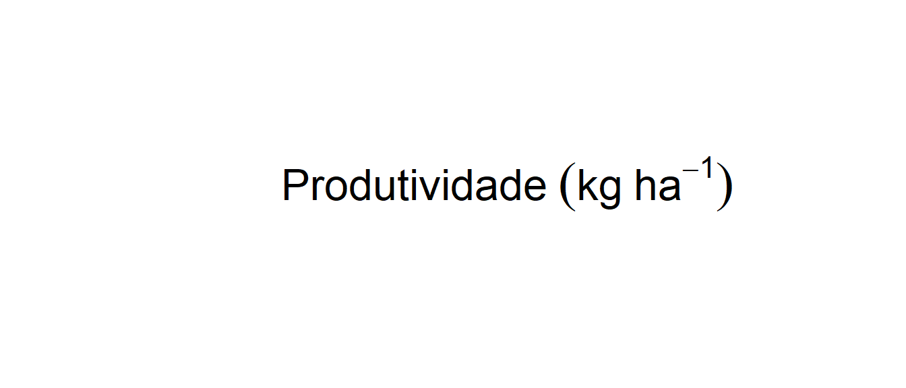

<br>

****

### Cor do gráfico

****

Especificando a cor do gráfico (Geral, exceto eixos)


```r
par(col="red")
plot(1,1, ylab="Eixo Y",xlab="Eixo X")
```


Especificando a cor da escala dos eixos do gráfico


```r
par(col.axis="red")
plot(1,1, ylab="",xlab="")
```

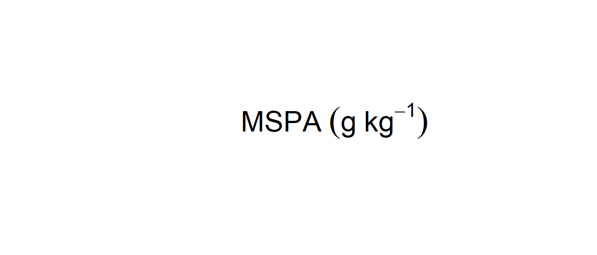

Especificando cor do nome dos eixos


```r
par(col.lab="red")
plot(1,1, ylab="Eixo Y",xlab="Eixo X")
```

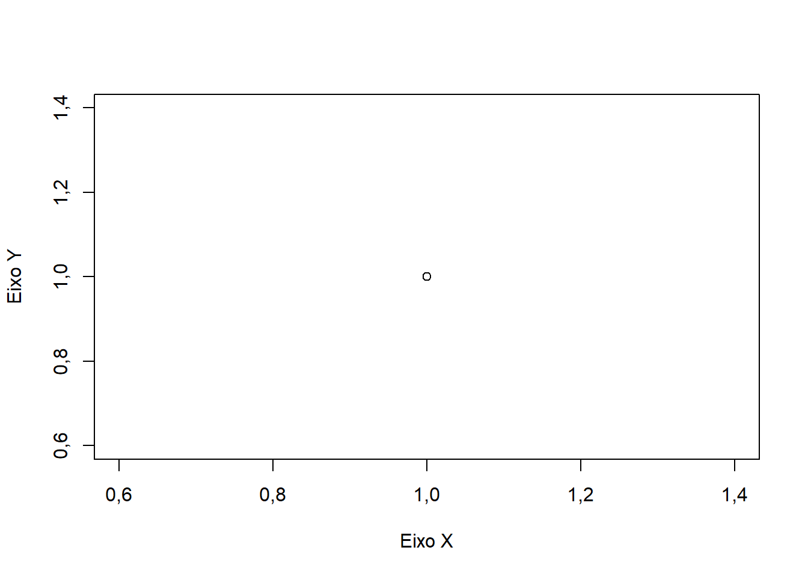

Especificando cor do título


```r
par(col.main="red")
plot(1,1, ylab="Eixo Y",xlab="Eixo X",main="title")
```

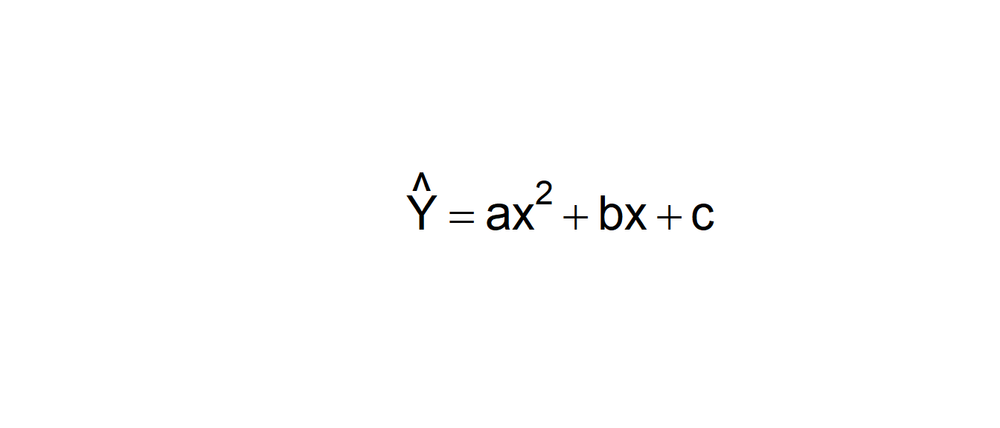

<br>

****

### Tamanho de letra

****


```r
par(cex=1.3)
plot(1,1, ylab="Eixo Y",xlab="Eixo X",main="title")
```

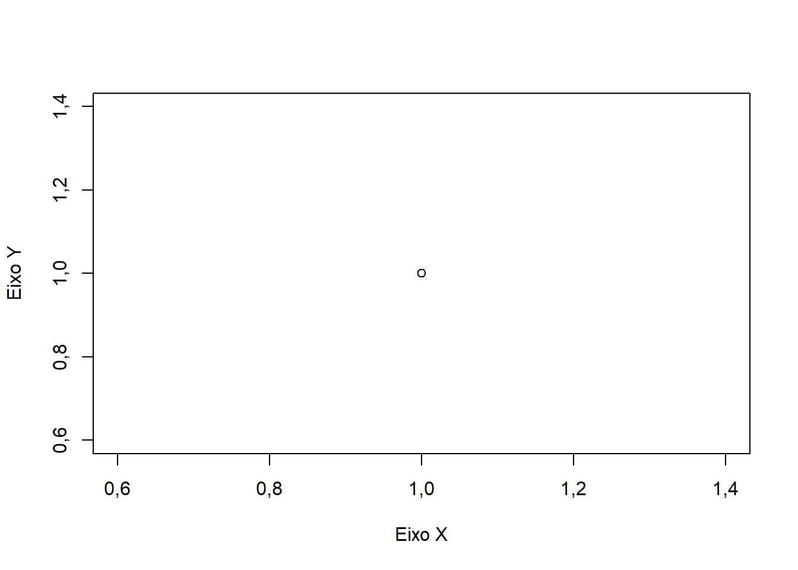

 - `cex.axis` : Tamanho da fonte das escalas de Y e X
 - `cex.lab` : Tamaho da fonte do nome dos eixos
 - `cex.main` : Tamanho da fonte do título

<br>

****

### Sobrepor gráficos

****


```r
plot(c(1,2,3,4,5,6), ylab="Eixo Y",xlab="Eixo X",main="title", type="o",col="red")
par(new=T)
plot(c(6,5,4,3,2,1), ylab="",xlab="",main="", type="o",col="blue")
```

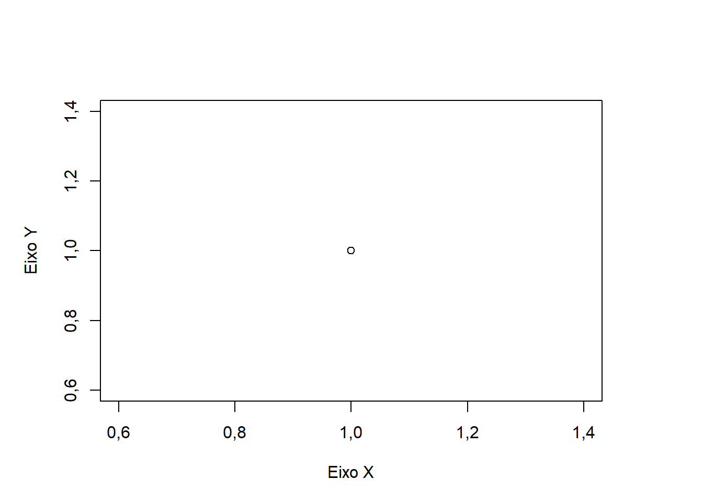

<br>

****

### Dois ou mais gráficos em uma saída

****

`mfrow=c(1,2)`: vetor de dados em que o primeiro representa o número de linhas e o segundo o número de colunas (Neste caso, uma linha e duas colunas)


```r
par(mfrow=c(1,2))
plot(c(1,2,3,4,5,6), ylab="Eixo Y",xlab="Eixo X",main="title", type="o",col="red")
plot(c(6,5,4,3,2,1), ylab="Eixo Y",xlab="Eixo X",main="title", type="o",col="blue")
```

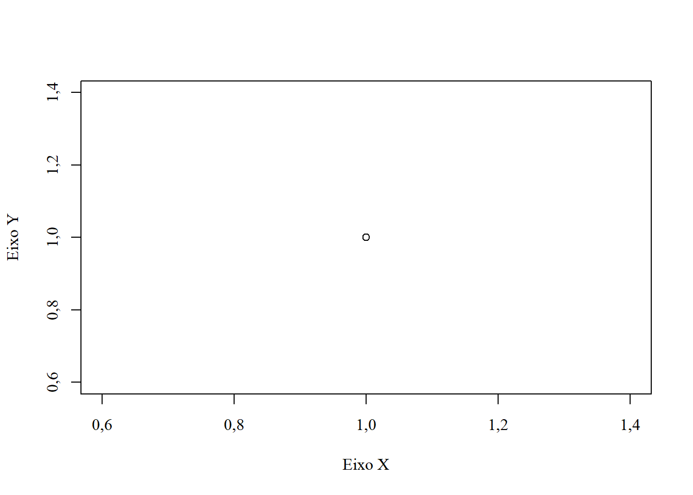

<br>

****

### Saída com dois gráficas na primeira linha e um gráfico na segunda linha

****

Saída com dois gráficas na primeira linha e um gráfico na segunda linha e necessário criar uma matriz com as posições.

Exemplo de matriz:

Matriz com quatro valores (`c(1,3,2,3)`) e duas colunas (`ncol=2`). Neste caso, a linha 1 apresenta os valores 1 e 2, que representam o primeiro e o segundo plot. A linha 2 apresenta os valores 3 e 3 que representa o terceiro plot.


```r
matrix(c(1,3,2,3), ncol=2)
```

```
##      [,1] [,2]
## [1,]    1    2
## [2,]    3    3
```


```r
layout(matrix(c(1,3,2,3), ncol=2))
plot(c(1,2,3,4,5,6), ylab="Eixo Y",xlab="Eixo X",main="title", type="o",col="red")
plot(c(6,5,4,3,2,1), ylab="Eixo Y",xlab="Eixo X",main="title", type="o",col="blue")
plot(c(1,6,1,6,1,6), ylab="Eixo Y",xlab="Eixo X",main="title", type="o",col="blue")
```

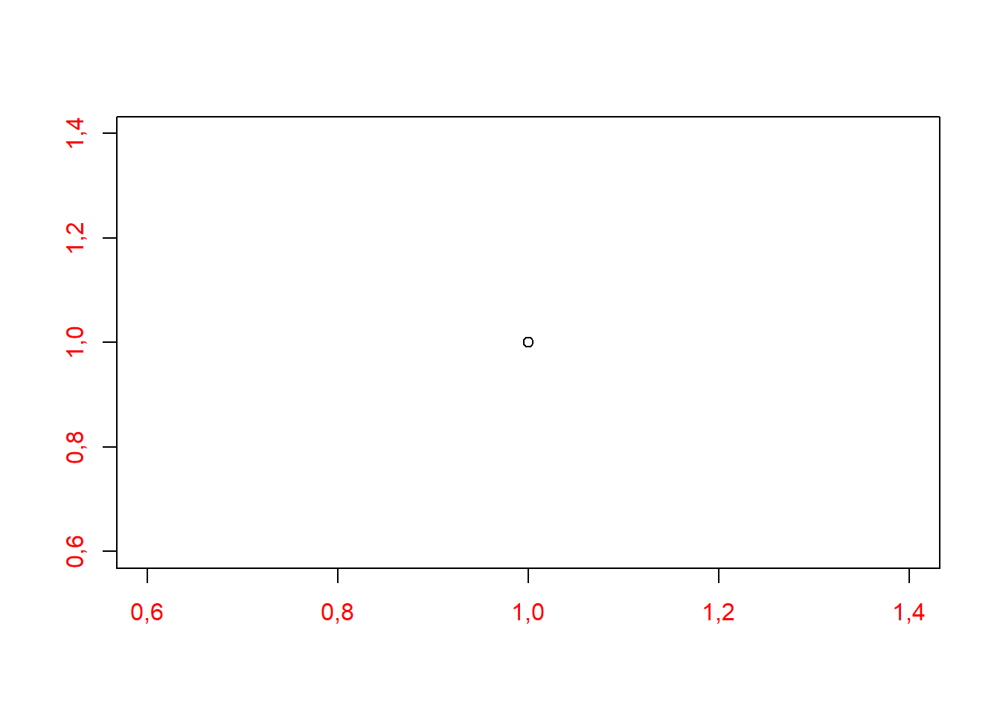

<br>

</div>

<br><br><br>

****

# ggplot2

****

*Em construção*

<br>

****

### Como juntar vários gráficos do ggplot2

****

No tutorial abaixo apresentamos uma das formas de juntar vários gráficos do ggplot2 em uma única figura. 

**Obs.**: Estamos usando o gráfico de colunas como exemplo, todavia, esses mesmos comandos funcionam para todos os gráficos do *ggplot2* e de outros pacotes que utilizam o *ggplot2*.

#### Conjunto de dados

Vamos trabalhar com três experimentos em DIC com quatro tratamentos e três repetições cada. 


```r
exp1=c(10,12,13,18,19,16,5,6,5,25,26,28)
exp2=c(9,12,11,18,20,16,7,6,9,25,28,28)
exp3=c(9,12,13,18,22,15,3,6,4,25,30,28)  
Trat=rep(c(paste("T",1:4)),e=3)
dados=data.frame(Trat,exp1,exp2,exp3)
dados$Trat=as.factor(Trat)
```

### Juntando três gráficos do ggplot2

*Obs* Para edição do gráfico ver tutorial sobre gráfico de colunas usando o ggplot2


```r
library(ggplot2)
m1=tapply(exp1, Trat, mean);d1=tapply(exp1, Trat, sd)
dados1=data.frame(Trat=rownames(m1),m1,d1)
a=ggplot(dados1, aes(x=Trat,y=m1))+geom_col()+theme_bw()+
  geom_errorbar(aes(ymax=m1+d1, ymin=m1-d1), width=0.25)
m2=tapply(exp2, Trat, mean);d2=tapply(exp2, Trat, sd)
dados2=data.frame(Trat=rownames(m2),m2,d2)
b=ggplot(dados2, aes(x=Trat,y=m2))+geom_col()+theme_bw()+
  geom_errorbar(aes(ymax=m2+d2,ymin=m2-d2), width=0.25)
m3=tapply(exp3, Trat, mean);d3=tapply(exp3, Trat, sd)
dados3=data.frame(Trat=rownames(m3),m3,d3)
c=ggplot(dados3, aes(x=Trat,y=m3))+geom_col()+theme_bw()+
  geom_errorbar(aes(ymax=m3+d3,ymin=m3-d3),width=0.25)
```

### Gráficos lado a lado


```r
library(gridExtra)
grid.arrange(a,b,c,ncol=3)
```

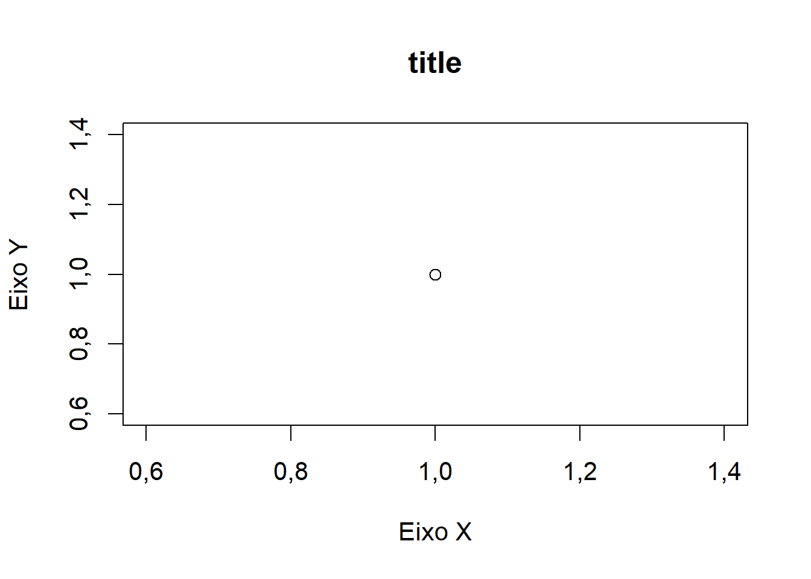

### Gráficos um abaixo do outro


```r
library(gridExtra)
grid.arrange(a,b,c,ncol=1)
```

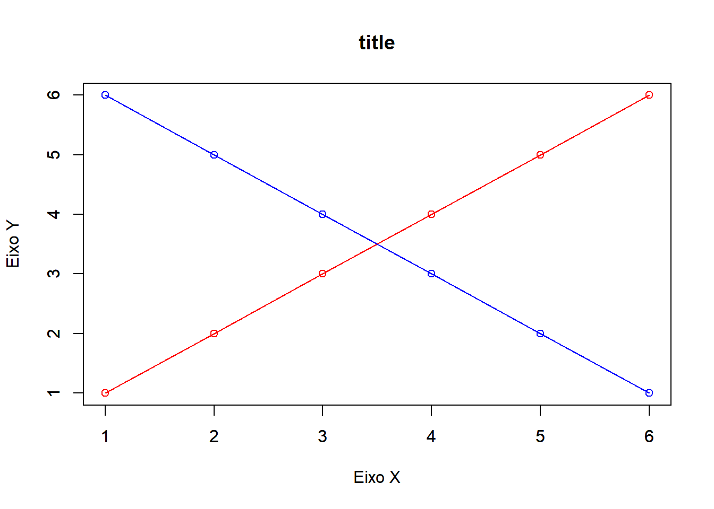

### Dois na primeira linha e uma no lado esquerdo da segunda linha


```r
library(gridExtra)
grid.arrange(a,b,c,ncol=2)
```

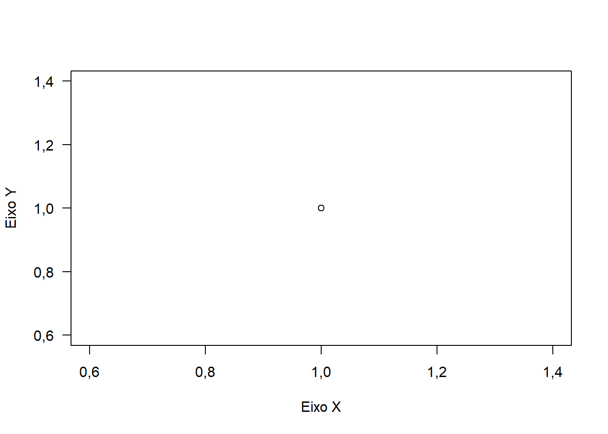

### Dois na primeira linha e uma centralizado na segunda linha


```r
library(gridExtra)
grid.arrange(a,b,c,
             layout_matrix = rbind(c(1,1,2,2), c(NA,3,3,NA)))
```


### Dois na primeira linha e uma a direita na segunda linha

<br>


```r
library(gridExtra)
grid.arrange(a,b,c,
             layout_matrix = rbind(c(1,1,2,2), c(NA,NA,3,3)))
```

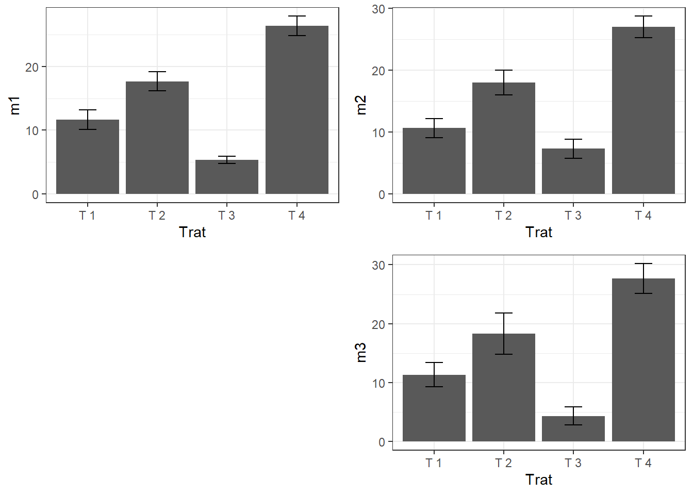

<br><br><br>


# Análise de regressão linear e não-linear

Nas mais diversas áreas da pesquisa, seja ela na área médica, biológica, industrial, química entre outras, é de grande interesse verificar se duas ou mais variáveis estão relacionadas de alguma forma. Para expressar esta relação é muito importante estabelecer um modelo matemático. Este tipo de modelagem é chamado de regressão, e ajuda a entender como determinadas variáveis influenciam outra variável, ou seja, verifica como o comportamento de uma ou mais variáveis podem mudar o comportamento de outra.

Na agronomia, a análise de regressão é muito utilizada por exemplo, para estabelecer doses de máxima resposta de produtos fitossanitários, adubos, populações de plantas, etc..; ou mesmo no estudo do desenvolvimento de uma planta, o que chamamos de curva de crescimento. 

Popularmente, é comum a utilização de curva do tipo polinomial, visto a facilidade de sua utilização e explicação. Todavia, muito dos dados não se comportam dessa forma, ainda que o ajuste seja significativo, podendo assim, levar a conclusões limitadas em função da análise inadequada. Logo, o presente tutorial apresenta diferentes ajustes de regressão linear e não-linear de um mesmo conjunto de dados. 

Neste tutorial, você irá reparar que em quase todos os modelos, o coeficientes serão significativos, demonstrando que quase todos os modelos são válidos para explicar o comportamento dos dados. A questão é, qual o melhor modelo?


**Obs. Este é um tutorial para demonstração dos modelos de regressão. Alguns casos ele não é significativo ou uma das pressuposições não é atendida. É um tutorial apenas para fins didáticos.**

<br><br>

****

## Conjunto de dados

****

O conjunto de dados é de um experimento cujo objetivo foi avaliar a perda de massa da casca de romã em estufa a $60^oC$. Foi utilizado oito repetições em oito avaliações (60, 210,390, 720, 930, 1410, 1890 e 2370 minutos)


```r
`PERDA DE MASSA CAA`=c(18.15810,17.99376,14.81450,15.39822,21.62234,20.45106,18.65319,20.96547,36.77274,39.92503,34.60874,35.70286,43.57189,42.19460,39.23367,43.36169,52.90384,52.64886,45.61431,47.81200,44.41734,47.40493,46.15373,47.12330,65.29474,67.78859,64.60738,66.24453,63.97464,66.77636,65.37446,65.11912,67.86385,70.68877,69.45271,70.33895,69.43583,71.56150,69.73480,69.97407,69.02813,71.28882,71.17485,71.22420,71.32344,72.46687,71.17063,72.07550,69.16576,71.44176,71.30762,71.34075,71.42775,72.59710,71.28255,72.19996,69.30339,71.59471,71.44040,71.45729,71.53206,72.72733,71.39446,72.32441)
TEMPO=rep(c(60,210,390,720,930,1410,1890,2370),e=8)
dados=data.frame(TEMPO,`PERDA DE MASSA CAA`)
y=c(`PERDA DE MASSA CAA`)
x=c(TEMPO)
data=data.frame(y,x)
```

<br><br>

### Média e desvio-padrão amostral


```r
(media=tapply(y,x, mean))
```

```
##       60      210      390      720      930     1410     1890     2370 
## 18,50708 39,42140 48,00979 65,64748 69,88131 71,21905 71,34541 71,47176
```

```r
(desvio=tapply(y,x, sd))
```

```
##       60      210      390      720      930     1410     1890     2370 
## 2,485224 3,479257 3,133973 1,229025 1,080134 1,007882 1,004939 1,002227
```

```r
(tempo=c(60,210,390,720,930,1410,1890,2370))
```

```
## [1]   60  210  390  720  930 1410 1890 2370
```

<br><br>

****

### Gráficos exploratórios

****

<br><br>

### Gráfico de caixas


```r
boxplot(y~x)
```


### Gráfico de dispersão


```r
plot(y~x)
```


### Gráfico de dispersão com médias


```r
plot(y~x)
points(media~tempo,pch=16,col="red")
```

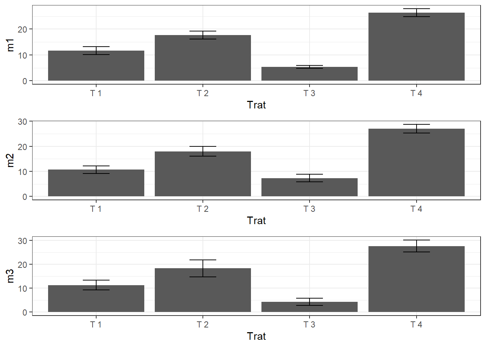

### Gráfico de linhas com as médias


```r
par(mfrow=c(1,2))
plot(media~tempo, type="b")
plot(media~tempo, type="l")
```

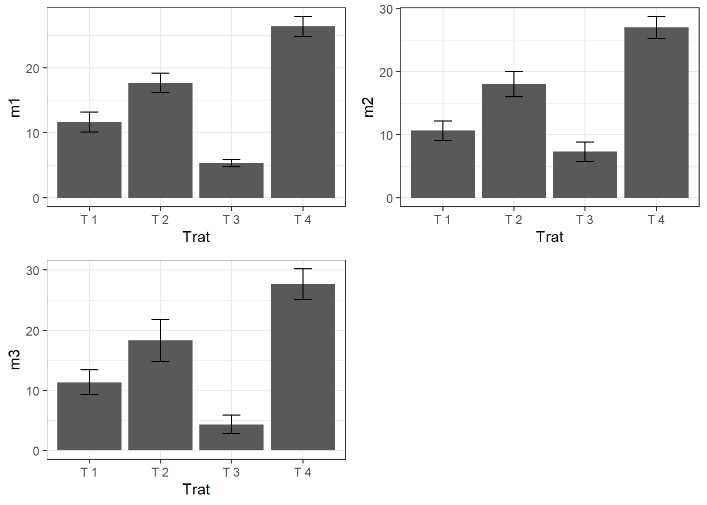

### Histograma


```r
hist(y)
```

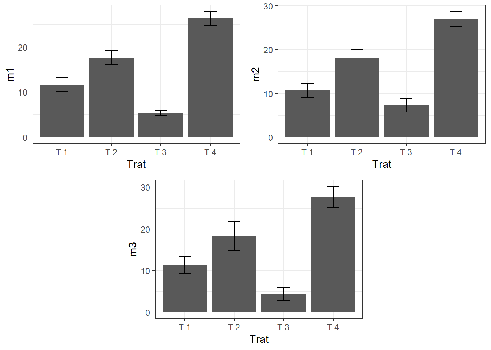

<br><br><br>

****

## Linear Simples

****

O modelo de regressão linear simples (MRLS) se define uma relação linear entre a variável dependente e uma variável independente.

$$Y=\beta_1x+\beta_0$$

### Criando o modelo de regressão


```r
modl=lm(y~x)
summary(modl)
```

```
## 
## Call:
## lm(formula = y ~ x)
## 
## Residuals:
##      Min       1Q   Median       3Q      Max 
## -24,4181  -8,1253   0,4191   8,8542  16,0914 
## 
## Coefficients:
##              Estimate Std. Error t value Pr(>|t|)    
## (Intercept) 38,099512   2,368998   16,08  < 2e-16 ***
## x            0,018886   0,001876   10,07 1,15e-14 ***
## ---
## Signif. codes:  0 '***' 0,001 '**' 0,01 '*' 0,05 '.' 0,1 ' ' 1
## 
## Residual standard error: 11,62 on 62 degrees of freedom
## Multiple R-squared:  0,6205,	Adjusted R-squared:  0,6144 
## F-statistic: 101,4 on 1 and 62 DF,  p-value: 1,147e-14
```

### Diagnóstico

### Normalidade dos erros


```r
hnp::hnp(modl)
```

```
## Gaussian model (lm object)
```

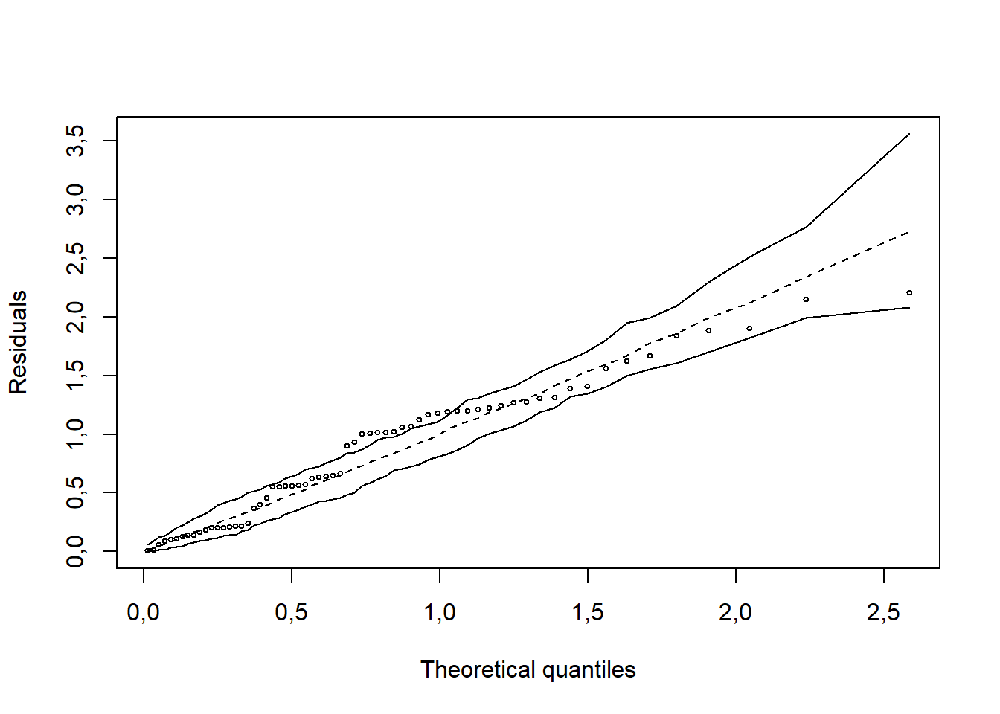

```r
shapiro.test(resid(modl)) # erros não normais
```

```
## 
## 	Shapiro-Wilk normality test
## 
## data:  resid(modl)
## W = 0,94067, p-value = 0,004079
```

### Falta de ajuste (Desvio da regressão)


```r
modq=aov(y~as.factor(x))
anova(modl,modq)
```

```
## Analysis of Variance Table
## 
## Model 1: y ~ x
## Model 2: y ~ as.factor(x)
##   Res.Df    RSS Df Sum of Sq      F    Pr(>F)    
## 1     62 8377,2                                  
## 2     56  236,7  6    8140,5 321,02 < 2,2e-16 ***
## ---
## Signif. codes:  0 '***' 0,001 '**' 0,01 '*' 0,05 '.' 0,1 ' ' 1
```

### Construindo gráfico


```r
par(family="serif")
plot(media~tempo, main="Linear Simples",
     las=1, cex=1.3,
     ylab="Weight loss (%)", xlim=c(0,2500),
     xlab="Time (Minutes)", 
     pch=16, ylim=c(0,80))
curve(coef(modl)[1]+coef(modl)[2]*x, add=TRUE, lty=2)
legend("topleft",
       cex=1,
       bty="n",
       legend = c(expression(hat(Y)==38.09951+0.01889*x)))
```

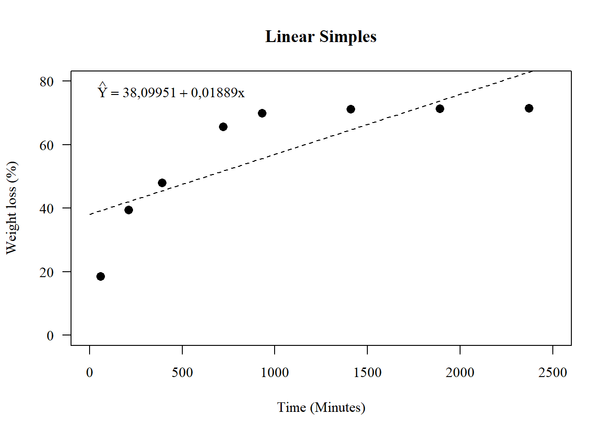

### ggplot2


```r
library(ggplot2)
da=data.frame(media,tempo)
ggplot(da,aes(y=media,x=tempo))+
  geom_point()+
  geom_smooth(method="lm",se = F,col="black",size=0.1,lty=2)+
  theme_classic()+
  ylab("Weight loss (%)")+
  xlab("Time (Minutes)") 
```

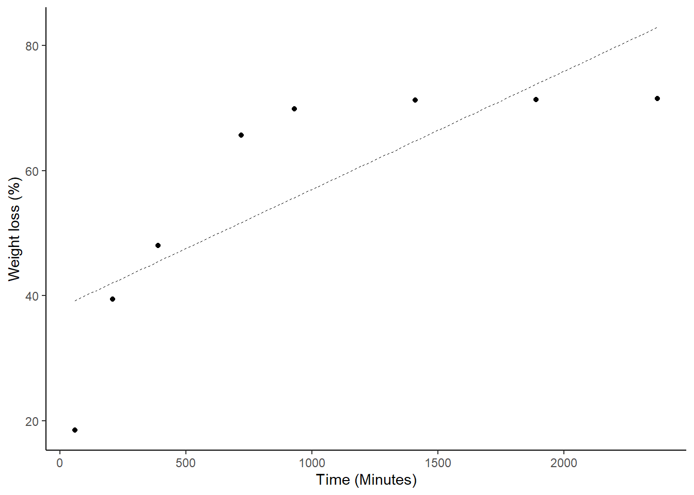

<br><br><br>

****

## Quadrático

****

$$Y=\beta_2x^2+\beta_1x+\beta_0$$

### Criando modelo de regressão


```r
mod1=lm(y~x+I(x^2))
summary(mod1)
```

```
## 
## Call:
## lm(formula = y ~ x + I(x^2))
## 
## Residuals:
##     Min      1Q  Median      3Q     Max 
## -11,428  -5,288   1,756   4,360   8,018 
## 
## Coefficients:
##               Estimate Std. Error t value Pr(>|t|)    
## (Intercept)  2,226e+01  1,528e+00   14,57   <2e-16 ***
## x            6,763e-02  3,367e-03   20,09   <2e-16 ***
## I(x^2)      -2,055e-05  1,371e-06  -14,99   <2e-16 ***
## ---
## Signif. codes:  0 '***' 0,001 '**' 0,01 '*' 0,05 '.' 0,1 ' ' 1
## 
## Residual standard error: 5,415 on 61 degrees of freedom
## Multiple R-squared:  0,919,	Adjusted R-squared:  0,9163 
## F-statistic: 345,9 on 2 and 61 DF,  p-value: < 2,2e-16
```

### Diagnóstico do modelo

### Normalidade dos erros


```r
hnp::hnp(mod1)
```

```
## Gaussian model (lm object)
```

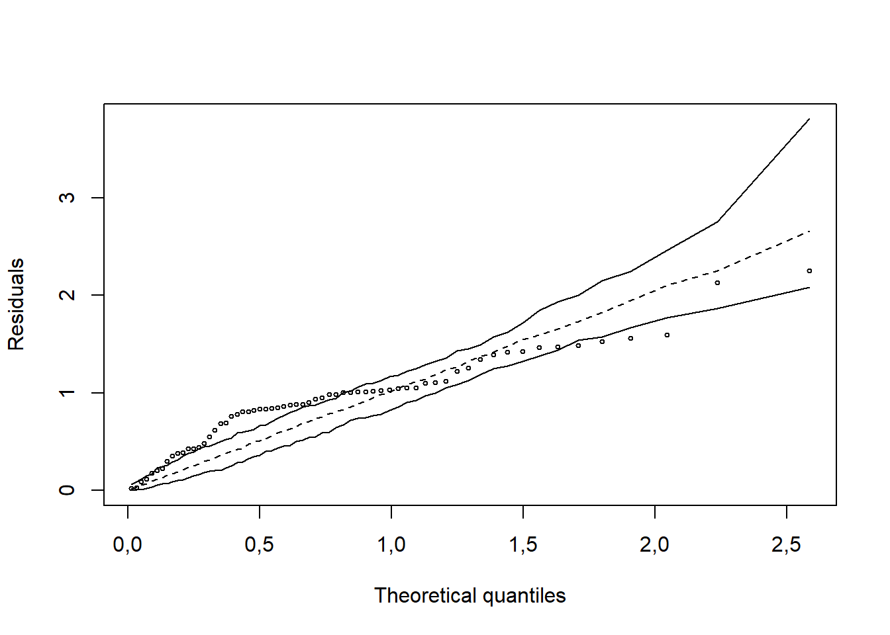

```r
shapiro.test(resid(mod1)) # erros nao normais
```

```
## 
## 	Shapiro-Wilk normality test
## 
## data:  resid(mod1)
## W = 0,92285, p-value = 0,000655
```

### Fator de inflação de variância (Multicolinearidade)


```r
car::vif(mod1) # problema de multicolinearidade
```

```
##        x   I(x^2) 
## 14,84834 14,84834
```

### Falta de ajuste (Desvio da regressão)


```r
modq=aov(y~as.factor(x))
anova(mod1,modq)
```

```
## Analysis of Variance Table
## 
## Model 1: y ~ x + I(x^2)
## Model 2: y ~ as.factor(x)
##   Res.Df     RSS Df Sum of Sq      F    Pr(>F)    
## 1     61 1788,55                                  
## 2     56  236,68  5    1551,9 73,438 < 2,2e-16 ***
## ---
## Signif. codes:  0 '***' 0,001 '**' 0,01 '*' 0,05 '.' 0,1 ' ' 1
```

### Construindo gráfico


```r
par(family="serif")
plot(media~tempo, main="Quadrático",
     las=1, cex=1.3,
     ylab="Weight loss (%)", xlim=c(0,2500),
     xlab="Time (Minutes)", 
     pch=16, ylim=c(0,80))
curve(coef(mod1)[1]+coef(mod1)[2]*x+coef(mod1)[3]*x^2, add=TRUE, lty=2)
legend("topleft",
       cex=1,
       bty="n",
       legend = c(expression(hat(Y)==22.26+0.006763*x-0.00002055*x^2)))
```

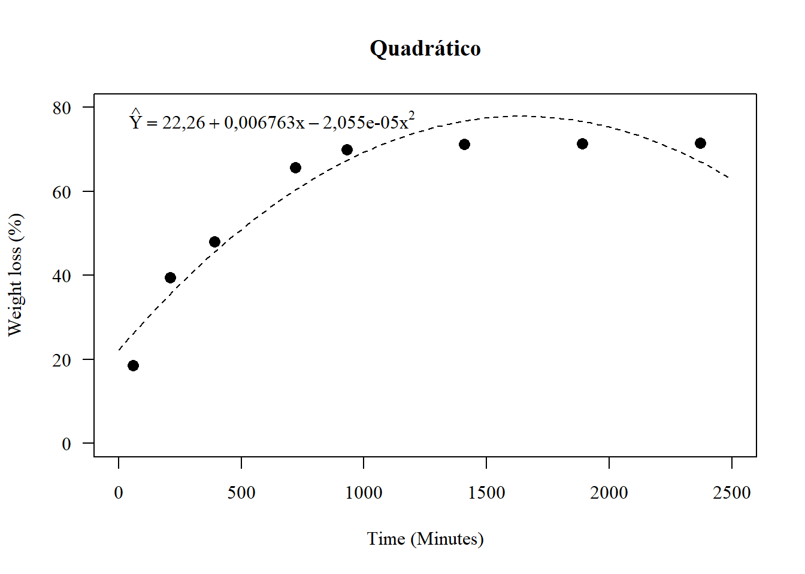

### Ponto de máximo (Ou mínimo)

O ponto de máximo ou mínimo podem ser encontrados de várias formas

### Manualmente


```r
(xmax=-coef(mod1)[2]/(2*coef(mod1)[3]))
```

```
##        x 
## 1645,317
```

```r
(ymax=coef(mod1)[1]+coef(mod1)[2]*xmax+coef(mod1)[3]*xmax^2)
```

```
## (Intercept) 
##    77,89475
```

### Usando o which.max ou which.min


```r
plot(y~x)
tend=curve(coef(mod1)[1]+coef(mod1)[2]*x+coef(mod1)[3]*x^2,add=T)
```

```r
tend$x[which.max(tend$y)]
```

```
## [1] 1653,9
```

```r
# tend$x[which.min(tend$y)] # no caso de mínimo
```

### ggplot2


```r
library(ggplot2)
da=data.frame(media,tempo)
ggplot(da,aes(y=media,x=tempo))+
  geom_point()+
  geom_smooth(method="lm",formula = y~poly(x,2), se = F,col="black",size=0.1,lty=2)+
  theme_classic()+
  ylab("Weight loss (%)")+
  xlab("Time (Minutes)") 
```

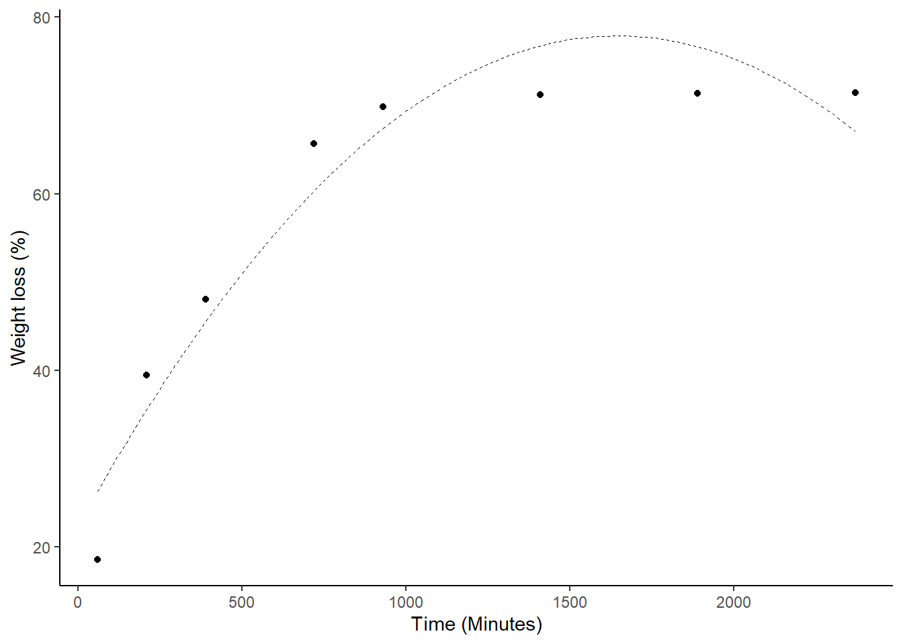

<br><br><br>

****

## Cúbico

****

$$Y=\beta_3x^3+\beta_2x^2+\beta_1x+\beta_0$$

### Construindo o modelo


```r
mod2=lm(y~x+I(x^2)+I(x^3))
summary(mod2)
```

```
## 
## Call:
## lm(formula = y ~ x + I(x^2) + I(x^3))
## 
## Residuals:
##     Min      1Q  Median      3Q     Max 
## -6,0186 -1,3299 -0,3928  1,3155  8,0377 
## 
## Coefficients:
##               Estimate Std. Error t value Pr(>|t|)    
## (Intercept)  1,406e+01  9,927e-01   14,16   <2e-16 ***
## x            1,174e-01  4,125e-03   28,47   <2e-16 ***
## I(x^2)      -7,536e-05  4,189e-06  -17,99   <2e-16 ***
## I(x^3)       1,524e-08  1,149e-09   13,27   <2e-16 ***
## ---
## Signif. codes:  0 '***' 0,001 '**' 0,01 '*' 0,05 '.' 0,1 ' ' 1
## 
## Residual standard error: 2,753 on 60 degrees of freedom
## Multiple R-squared:  0,9794,	Adjusted R-squared:  0,9784 
## F-statistic: 951,1 on 3 and 60 DF,  p-value: < 2,2e-16
```

### Diagnóstico do modelo

### Normalidade dos erros


```r
hnp::hnp(mod2)
```

```
## Gaussian model (lm object)
```

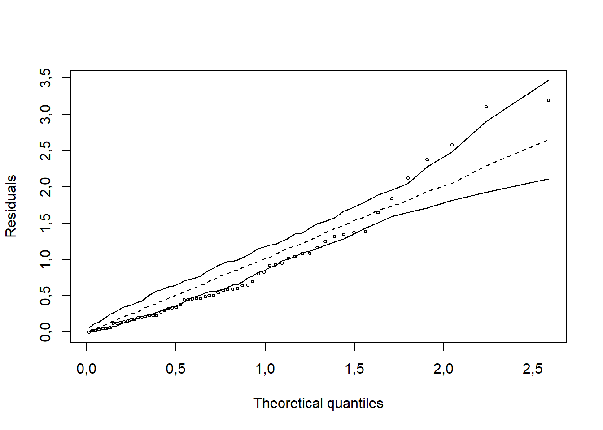

```r
shapiro.test(resid(mod2)) # Erros nao normais
```

```
## 
## 	Shapiro-Wilk normality test
## 
## data:  resid(mod2)
## W = 0,94796, p-value = 0,009093
```

### Fator de inflação de variância (Multicolinearidade) 


```r
car::vif(mod2) # alta multicolinearidade
```

```
##         x    I(x^2)    I(x^3) 
##  86,25922 536,46498 221,25164
```

### Falta de ajuste (Desvio da regressão)


```r
modq=aov(y~as.factor(x))
anova(mod2,modq)
```

```
## Analysis of Variance Table
## 
## Model 1: y ~ x + I(x^2) + I(x^3)
## Model 2: y ~ as.factor(x)
##   Res.Df    RSS Df Sum of Sq      F    Pr(>F)    
## 1     60 454,60                                  
## 2     56 236,68  4    217,93 12,891 1,666e-07 ***
## ---
## Signif. codes:  0 '***' 0,001 '**' 0,01 '*' 0,05 '.' 0,1 ' ' 1
```

### Construindo o gráfico


```r
par(family="serif")
plot(media~tempo, main="Cúbico",
     las=1, cex=1.3,
     ylab="Weight loss (%)", xlim=c(0,2500),
     xlab="Time (Minutes)", 
     pch=16, ylim=c(0,80))
curve(coef(mod2)[1]+coef(mod2)[2]*x+coef(mod2)[3]*x^2+coef(mod2)[4]*x^3, add=TRUE, lty=2)
legend("topleft",
       cex=1,
       bty="n",
       legend = c(expression(hat(Y)==14.06+0.01174*x-0.00007536*x^2+0.00000001524*x^3)))
```

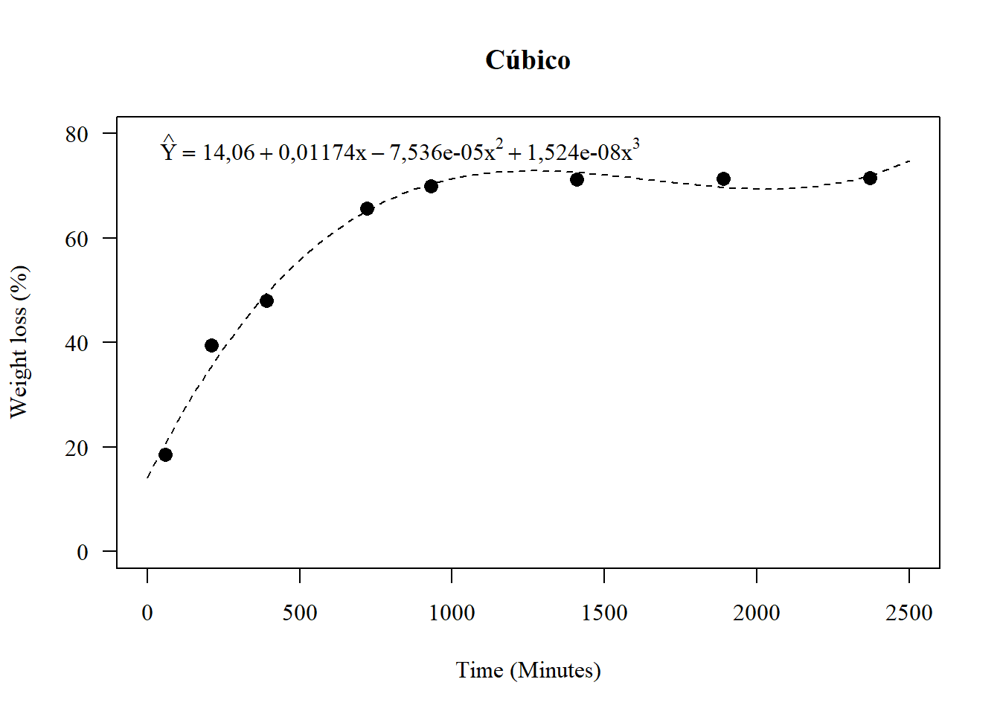

### ponto de máximo, mínimo e inflexão


```r
plot(media~tempo)
curva=curve(coef(mod2)[1]+coef(mod2)[2]*x+coef(mod2)[3]*x^2+coef(mod2)[4]*x^3, add=TRUE, lty=2)
```

```r
# ponto de inflexão
pi=-(2*coef(mod2)[3])/(3*2*coef(mod2)[4])

# ponto de máximo anterior ao ponto de inflexão
xmax=curva$x[which.max(curva$y[curva$x<pi])]

# ponto de mínimo posterior ao ponto de inflexão
xmin=curva$x[which.max(curva$y[curva$x<pi])+which.min(curva$y[curva$x>xmax])]
```


```r
plot(media~tempo)
curva=curve(coef(mod2)[1]+coef(mod2)[2]*x+coef(mod2)[3]*x^2+coef(mod2)[4]*x^3, add=TRUE, lty=1)
abline(v=c(xmax,xmin,pi),lty=2)
```


### ggplot2


```r
library(ggplot2)
da=data.frame(media,tempo)
ggplot(da,aes(y=media,x=tempo))+
  geom_point()+
  geom_smooth(method="lm",formula = y~poly(x,3), se = F,col="black",size=0.1,lty=2)+
  theme_classic()+
  ylab("Weight loss (%)")+
  xlab("Time (Minutes)") 
```


<br><br><br>

****

## Logarítmico

****

$$Y=\beta_{0}+\beta_{1}\log(x)$$

### Construindo modelo


```r
modelog=lm(y~log(x))
summary(modelog)
```

```
## 
## Call:
## lm(formula = y ~ log(x))
## 
## Residuals:
##     Min      1Q  Median      3Q     Max 
## -8,5359 -3,5194 -0,5506  3,6366  8,4348 
## 
## Coefficients:
##             Estimate Std. Error t value Pr(>|t|)    
## (Intercept) -42,7285     3,3261  -12,85   <2e-16 ***
## log(x)       15,5158     0,5096   30,45   <2e-16 ***
## ---
## Signif. codes:  0 '***' 0,001 '**' 0,01 '*' 0,05 '.' 0,1 ' ' 1
## 
## Residual standard error: 4,724 on 62 degrees of freedom
## Multiple R-squared:  0,9373,	Adjusted R-squared:  0,9363 
## F-statistic: 927,1 on 1 and 62 DF,  p-value: < 2,2e-16
```

### Diagnóstico do modelo


```r
hnp::hnp(modelog)
```

```
## Gaussian model (lm object)
```

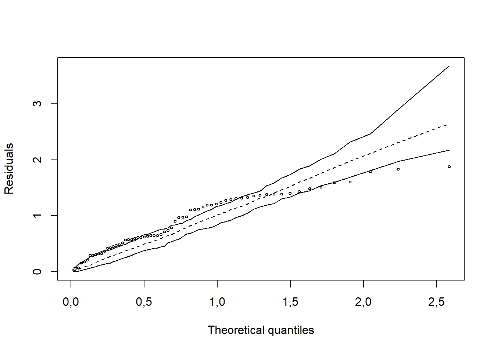

```r
shapiro.test(resid(modelog))
```

```
## 
## 	Shapiro-Wilk normality test
## 
## data:  resid(modelog)
## W = 0,94476, p-value = 0,006371
```

### Construindo gráfico


```r
plot(media~tempo, main="Log",
     las=1, cex=1.3,
     ylab="Weight loss (%)", xlim=c(0,2500),
     xlab="Time (Minutes)", 
     pch=16, ylim=c(0,80))
curve(-42.73+15.52*log(x),add=T,lty=2)
legend("topleft",
       cex=1,
       bty="n",
       legend = c(expression(hat(Y)==-42.73+15.52*log(x))))
```

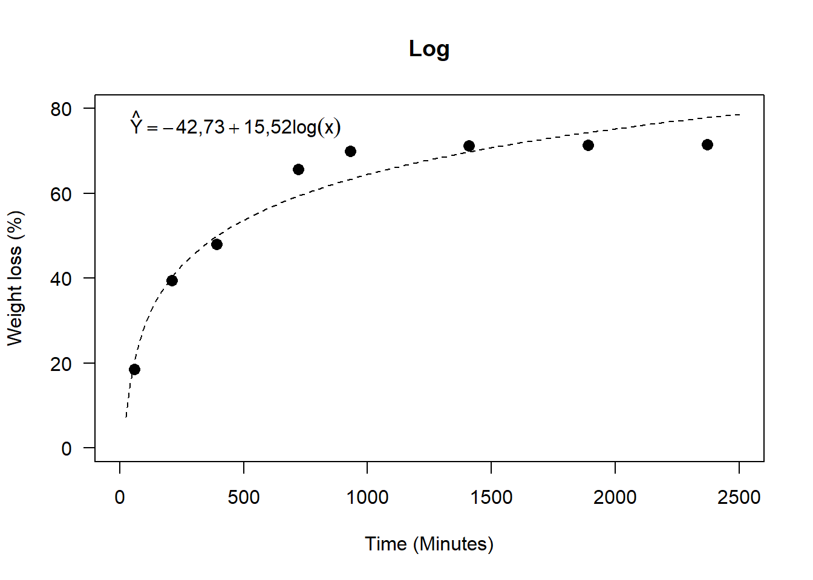

<br><br><br>

****

## Michaelis-Menten (MM)

****

$$Y=\frac{A\times x}{V+x}$$

### Construindo o modelo


```r
data=data.frame(y,x)
n0 <- nls(formula=y~A*x/(V+x), data=data,
          start=list(A=max(y), V=100), trace=TRUE)
```

```
## 2726,427 :   72,72733 100,00000
## 820,4424 :   78,84265 179,59765
## 691,338 :   80,90678 212,88993
## 690,8008 :   81,02471 215,24858
## 690,8006 :   81,02129 215,20409
## 690,8006 :   81,02137 215,20519
```

```r
summary(n0)
```

```
## 
## Formula: y ~ A * x/(V + x)
## 
## Parameters:
##   Estimate Std. Error t value Pr(>|t|)    
## A   81,021      1,004   80,67   <2e-16 ***
## V  215,205     11,711   18,38   <2e-16 ***
## ---
## Signif. codes:  0 '***' 0,001 '**' 0,01 '*' 0,05 '.' 0,1 ' ' 1
## 
## Residual standard error: 3,338 on 62 degrees of freedom
## 
## Number of iterations to convergence: 5 
## Achieved convergence tolerance: 3,035e-07
```

### Diagnóstico do modelo


```r
shapiro.test(resid(n0))
```

```
## 
## 	Shapiro-Wilk normality test
## 
## data:  resid(n0)
## W = 0,9717, p-value = 0,1482
```

### Construindo o gráfico


```r
A <- coef(n0)[1]; V <- coef(n0)[2]
par(family="serif")
plot(media~tempo, main="Michaelis Menten",
     las=1, cex=1.3,
     ylab="Weight loss (%)", xlim=c(0,2500),
     xlab="Time (Minutes)", 
     pch=16, ylim=c(0,80))
curve(A*x/(V+x), add=TRUE, lty=2)
legend("topleft",
       cex=1,
       bty="n",
       legend = c(expression(hat(Y)==frac(81.021*x,(215.205+x)))))
```

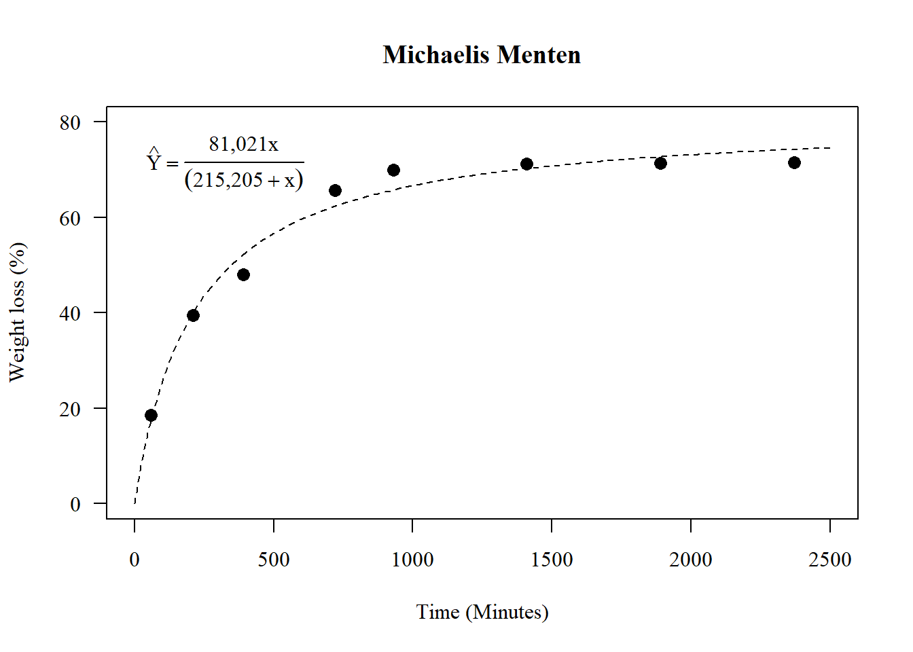

### Utilizando outro método


```r
m.m <- nls(y ~ SSmicmen(x, Vm, K), data = data)
m.m
```

```
## Nonlinear regression model
##   model: y ~ SSmicmen(x, Vm, K)
##    data: data
##     Vm      K 
##  81,02 215,20 
##  residual sum-of-squares: 690,8
## 
## Number of iterations to convergence: 0 
## Achieved convergence tolerance: 2,047e-06
```

```r
plot(media~tempo, main="Michaelis-Menten",
     las=1, cex=1.3,
     ylab="Weight loss (%)", xlim=c(0,2500),
     xlab="Time (Minutes)", 
     pch=16, ylim=c(0,80))
curve((81.02135*x)/(215.20499+x), add=T)
```

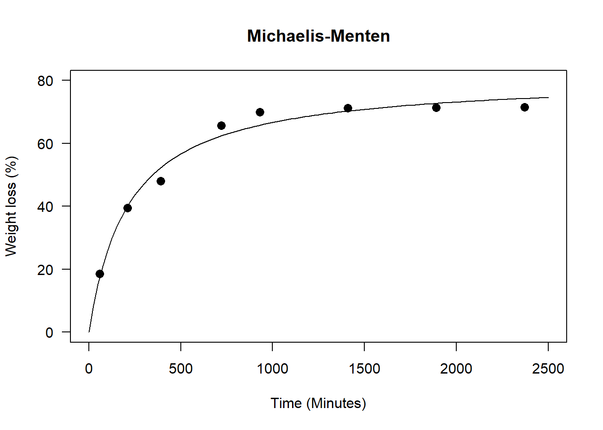

<br><br><br>

****

## MM Modificado

****

$$Y=\frac{A\times x}{V+x}+D\times x $$

### Construindo modelo


```r
data=data.frame(y,x)
n1 <- nls(formula=y~A*x/(V+x)+D*x, data=data,
          start=list(A=max(y), V=100,D=10), trace=TRUE)
```

```
## 10206286603 :   72,72733 100,00000  10,00000
## 802,0047 :   8,061554e+01  1,857416e+02 -9,194725e-04
## 545,3405 :   91,710079373 263,748404929  -0,004630648
## 521,8705 :   96,954052340 297,103221016  -0,006224234
## 521,0745 :   98,085315801 303,935203239  -0,006567869
## 521,0613 :   98,241471280 304,881731574  -0,006617559
## 521,0611 :   98,261118528 305,001695810  -0,006623916
## 521,0611 :   98,263575225 305,016711452  -0,006624713
```

```r
summary(n1)
```

```
## 
## Formula: y ~ A * x/(V + x) + D * x
## 
## Parameters:
##     Estimate Std. Error t value Pr(>|t|)    
## A  98,263575   4,439290  22,135  < 2e-16 ***
## V 305,016711  25,778649  11,832  < 2e-16 ***
## D  -0,006625   0,001563  -4,239 7,73e-05 ***
## ---
## Signif. codes:  0 '***' 0,001 '**' 0,01 '*' 0,05 '.' 0,1 ' ' 1
## 
## Residual standard error: 2,923 on 61 degrees of freedom
## 
## Number of iterations to convergence: 7 
## Achieved convergence tolerance: 9,342e-06
```

### Construindo gráfico


```r
A <- coef(n1)[1]; V <- coef(n1)[2]; D<-coef(n1)[3]
par(family="serif")
plot(media~tempo, main="Michaelis Menten (Corrigido)",
     las=1, cex=1.3,
     ylab="Weight loss (%)", xlim=c(0,2500),
     xlab="Time (Minutes)", 
     pch=16, ylim=c(0,80))
curve(A*x/(V+x)+D*x, add=TRUE, lty=2)
legend("topleft",
       cex=1,
       bty="n",
       legend = c(expression(hat(Y)==frac(98.263572*x,(305.016698+x))-0.006625*x)))
```

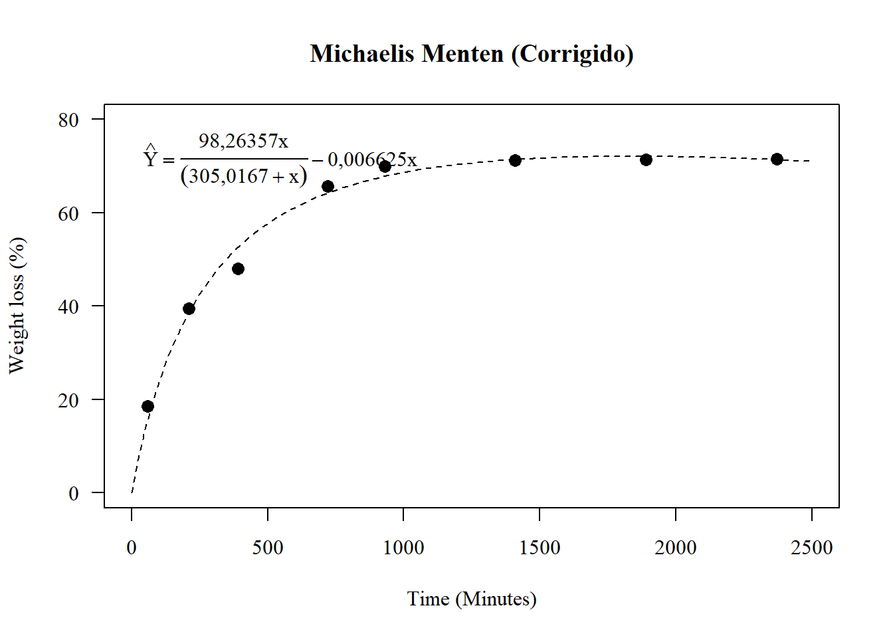

<br><br><br>

****

## Segmentada linear

****

$$Y=\beta_{1}X+\beta_{0} (if\leq X_1)$$

### Construindo o modelo linear 


```r
modelo_linear<- lm(y~x)
summary(modelo_linear)
```

```
## 
## Call:
## lm(formula = y ~ x)
## 
## Residuals:
##      Min       1Q   Median       3Q      Max 
## -24,4181  -8,1253   0,4191   8,8542  16,0914 
## 
## Coefficients:
##              Estimate Std. Error t value Pr(>|t|)    
## (Intercept) 38,099512   2,368998   16,08  < 2e-16 ***
## x            0,018886   0,001876   10,07 1,15e-14 ***
## ---
## Signif. codes:  0 '***' 0,001 '**' 0,01 '*' 0,05 '.' 0,1 ' ' 1
## 
## Residual standard error: 11,62 on 62 degrees of freedom
## Multiple R-squared:  0,6205,	Adjusted R-squared:  0,6144 
## F-statistic: 101,4 on 1 and 62 DF,  p-value: 1,147e-14
```

### Construindo o modelo segmentado


```r
library(segmented)
modelo_pieciwise<- segmented(modelo_linear, seg.Z = ~x, psi=1000)
modelo_pieciwise
```

```
## Call: segmented.lm(obj = modelo_linear, seg.Z = ~x, psi = 1000)
## 
## Meaningful coefficients of the linear terms:
## (Intercept)            x         U1.x  
##    19,83682      0,06684     -0,06582  
## 
## Estimated Break-Point(s):
## psi1.x  
##  751,4
```

```r
summary(modelo_pieciwise)
```

```
## 
## 	***Regression Model with Segmented Relationship(s)***
## 
## Call: 
## segmented.lm(obj = modelo_linear, seg.Z = ~x, psi = 1000)
## 
## Estimated Break-Point(s):
##            Est. St.Err
## psi1.x 751,438 26,797
## 
## Meaningful coefficients of the linear terms:
##              Estimate Std. Error t value Pr(>|t|)    
## (Intercept) 19,836818   1,106834   17,92   <2e-16 ***
## x            0,066839   0,002612   25,59   <2e-16 ***
## U1.x        -0,065819   0,002873  -22,91       NA    
## ---
## Signif. codes:  0 '***' 0,001 '**' 0,01 '*' 0,05 '.' 0,1 ' ' 1
## 
## Residual standard error: 3,635 on 60 degrees of freedom
## Multiple R-Squared: 0,9641,  Adjusted R-squared: 0,9623 
## 
## Convergence attained in 2 iter. (rel. change 0)
```

### Definindo limite com base no platô


```r
y1=y[x<=modelo_pieciwise$psi[2]]
x11=x[x<=modelo_pieciwise$psi[2]]
```

### Curva do primeiro segmento


```r
mod=lm(y1~x11)
summary(mod)
```

```
## 
## Call:
## lm(formula = y1 ~ x11)
## 
## Residuals:
##     Min      1Q  Median      3Q     Max 
## -9,0327 -2,9998 -0,7374  2,1557  9,6988 
## 
## Coefficients:
##              Estimate Std. Error t value Pr(>|t|)    
## (Intercept) 19,836818   1,532481   12,94 8,22e-14 ***
## x11          0,066839   0,003617   18,48  < 2e-16 ***
## ---
## Signif. codes:  0 '***' 0,001 '**' 0,01 '*' 0,05 '.' 0,1 ' ' 1
## 
## Residual standard error: 5,033 on 30 degrees of freedom
## Multiple R-squared:  0,9193,	Adjusted R-squared:  0,9166 
## F-statistic: 341,6 on 1 and 30 DF,  p-value: < 2,2e-16
```

### Construindo gráfico


```r
par(pch=16,las=1); par(family="serif")
plot(media~tempo, 
     las=1, cex=1.3, main="Segmentado Linear",
     ylab="Weight loss (%)", xlim=c(0,2500),
     xlab="Time (Minutes)", 
     pch=16, ylim=c(0,80))
a=curve(coef(mod)[1]+coef(mod)[2]*x, 
        to=modelo_pieciwise$psi[2], lty=2,add=T)
plato=a$y[round(a$x,3)==round(modelo_pieciwise$psi[2],3)]
lines(c(modelo_pieciwise$psi[2],max(x)),
      c(plato,plato),lty=2)
legend("topleft",
       cex=1,
       legend=expression(hat(Y)==19.836817+0.066839*x~("if"~x~"<"~751.4)), bty="n")
```

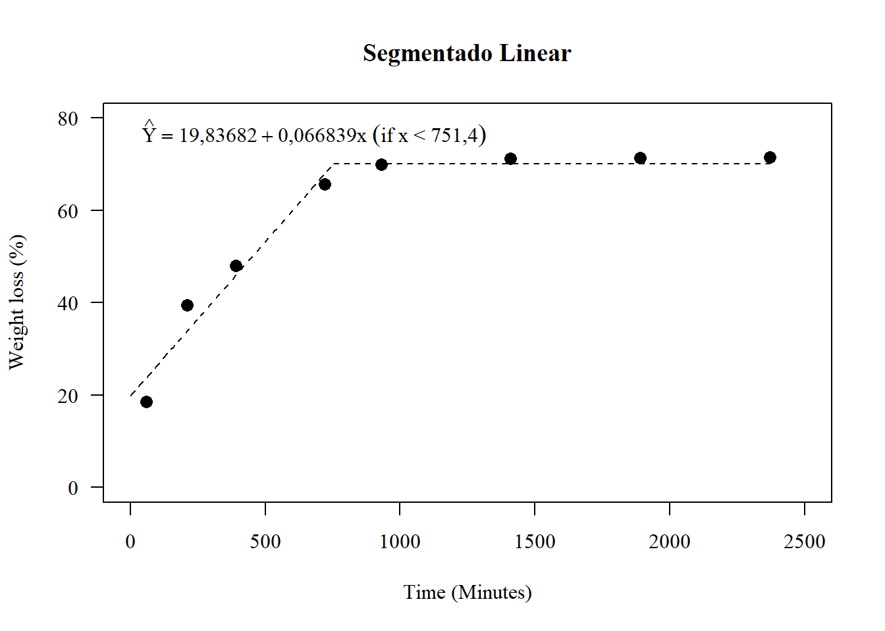

<br><br><br>

****

## Segmentada quadrático

****

$$Y=\beta_{2}X^2+\beta_{1}X+\beta_{0} (if\leq X_1)$$

### Construindo o modelo quadrático


```r
modelo_linear<- lm(y~x+I(x^2))
summary(modelo_linear)
```

```
## 
## Call:
## lm(formula = y ~ x + I(x^2))
## 
## Residuals:
##     Min      1Q  Median      3Q     Max 
## -11,428  -5,288   1,756   4,360   8,018 
## 
## Coefficients:
##               Estimate Std. Error t value Pr(>|t|)    
## (Intercept)  2,226e+01  1,528e+00   14,57   <2e-16 ***
## x            6,763e-02  3,367e-03   20,09   <2e-16 ***
## I(x^2)      -2,055e-05  1,371e-06  -14,99   <2e-16 ***
## ---
## Signif. codes:  0 '***' 0,001 '**' 0,01 '*' 0,05 '.' 0,1 ' ' 1
## 
## Residual standard error: 5,415 on 61 degrees of freedom
## Multiple R-squared:  0,919,	Adjusted R-squared:  0,9163 
## F-statistic: 345,9 on 2 and 61 DF,  p-value: < 2,2e-16
```

### Construindo o modelo segmentado


```r
library(segmented)
modelo_pieciwise1<- segmented(modelo_linear)
modelo_pieciwise1
```

```
## Call: segmented.lm(obj = modelo_linear)
## 
## Meaningful coefficients of the linear terms:
## (Intercept)            x       I(x^2)         U1.x  
##   1,580e+01    9,004e-02   -4,424e-06   -7,368e-02  
## 
## Estimated Break-Point(s):
## psi1.x  
##  560,2
```

```r
summary(modelo_pieciwise1)
```

```
## 
## 	***Regression Model with Segmented Relationship(s)***
## 
## Call: 
## segmented.lm(obj = modelo_linear)
## 
## Estimated Break-Point(s):
##            Est. St.Err
## psi1.x 560,234 28,392
## 
## Meaningful coefficients of the linear terms:
##               Estimate Std. Error t value Pr(>|t|)    
## (Intercept)  1,580e+01  1,201e+00  13,151   <2e-16 ***
## x            9,004e-02  4,718e-03  19,083   <2e-16 ***
## I(x^2)      -4,424e-06  1,764e-06  -2,508   0,0149 *  
## U1.x        -7,368e-02  6,596e-03 -11,171       NA    
## ---
## Signif. codes:  0 '***' 0,001 '**' 0,01 '*' 0,05 '.' 0,1 ' ' 1
## 
## Residual standard error: 3,073 on 59 degrees of freedom
## Multiple R-Squared: 0,9748,  Adjusted R-squared: 0,973 
## 
## Convergence attained in 2 iter. (rel. change 0)
```

### Valores para o primeiro segmento

Obs. No caso do linear simples, podemo usar apenas os pontos abaixo do platô, no caso do segmentado quadrático aconselho englobar o ponto acima do acusado no platô. No meu caso é o ponto 930.


```r
y1=y[x<=930]
x11=x[x<=930]
mod=lm(y1~x11+I(x11^2))
summary(mod)
```

```
## 
## Call:
## lm(formula = y1 ~ x11 + I(x11^2))
## 
## Residuals:
##     Min      1Q  Median      3Q     Max 
## -5,5773 -2,1731  0,0432  1,2608  8,0591 
## 
## Coefficients:
##               Estimate Std. Error t value Pr(>|t|)    
## (Intercept)  1,357e+01  1,379e+00   9,839 7,13e-12 ***
## x11          1,175e-01  7,321e-03  16,047  < 2e-16 ***
## I(x11^2)    -6,173e-05  7,151e-06  -8,632 2,15e-10 ***
## ---
## Signif. codes:  0 '***' 0,001 '**' 0,01 '*' 0,05 '.' 0,1 ' ' 1
## 
## Residual standard error: 3,293 on 37 degrees of freedom
## Multiple R-squared:  0,9715,	Adjusted R-squared:   0,97 
## F-statistic: 630,9 on 2 and 37 DF,  p-value: < 2,2e-16
```

### Construindo o gráfico


```r
par(pch=16,las=1); par(family="serif")
plot(media~tempo, main="Segmentado Quadrático",
     las=1, cex=1.3,
     ylab="Weight loss (%)", xlim=c(0,2500),
     xlab="Time (Minutes)", 
     pch=16, ylim=c(0,80))
maximo=-coef(mod)[2]/(2*coef(mod)[3])
a=curve(coef(mod)[1]+coef(mod)[2]*x+coef(mod)[3]*x^2, 
        to=maximo, lty=2,
        add=T)
plato=a$y[round(a$x,3)==round(maximo,3)]
lines(c(maximo,max(x)),
      c(plato,plato),lty=2)
legend("topleft",
       legend=expression(Y==13.57+0.1175*x-0.00006173*x^2~("if"~x~"<"~951.5095)), bty="n")
```

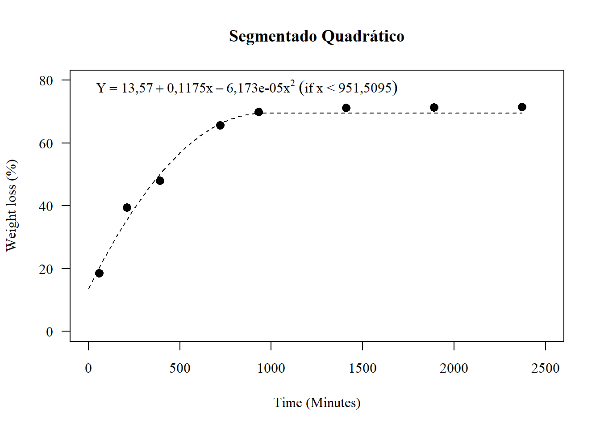

<br><br><br>

****

## Mitscherlich

****

$$Y=A \times(1-exp((B\times C)-(C \times X)$$


```r
modelo2=nls(y~A*(1-exp((B*C)-(C*x))),
           start = list(A=80,B=-10,C=0.01),data=data)
summary(modelo2)
```

```
## 
## Formula: y ~ A * (1 - exp((B * C) - (C * x)))
## 
## Parameters:
##     Estimate Std. Error t value Pr(>|t|)    
## A  7,232e+01  5,606e-01 129,004  < 2e-16 ***
## B -4,438e+01  8,610e+00  -5,155  2,9e-06 ***
## C  2,874e-03  1,302e-04  22,066  < 2e-16 ***
## ---
## Signif. codes:  0 '***' 0,001 '**' 0,01 '*' 0,05 '.' 0,1 ' ' 1
## 
## Residual standard error: 2,63 on 61 degrees of freedom
## 
## Number of iterations to convergence: 7 
## Achieved convergence tolerance: 8,634e-07
```

```r
par(pch=16,las=1); par(family="serif")
plot(media~tempo,main="Mitscherlich",
     las=1, cex=1.3,
     ylab="Weight loss (%)", xlim=c(0,2500),
     xlab="Time (Minutes)", 
     pch=16, ylim=c(0,80))
b=summary(modelo2)
A=b$coefficients[1,1]
B=b$coefficients[2,1]
C=b$coefficients[3,1]
a=curve(A*(1-exp((B*C)-(C*x))),lty=2,add=T)
legend("topleft",expression(Y==72.31912*(1-e^{(-44.382759*0.002873)-(0.002873*x)})),bty="n")
```

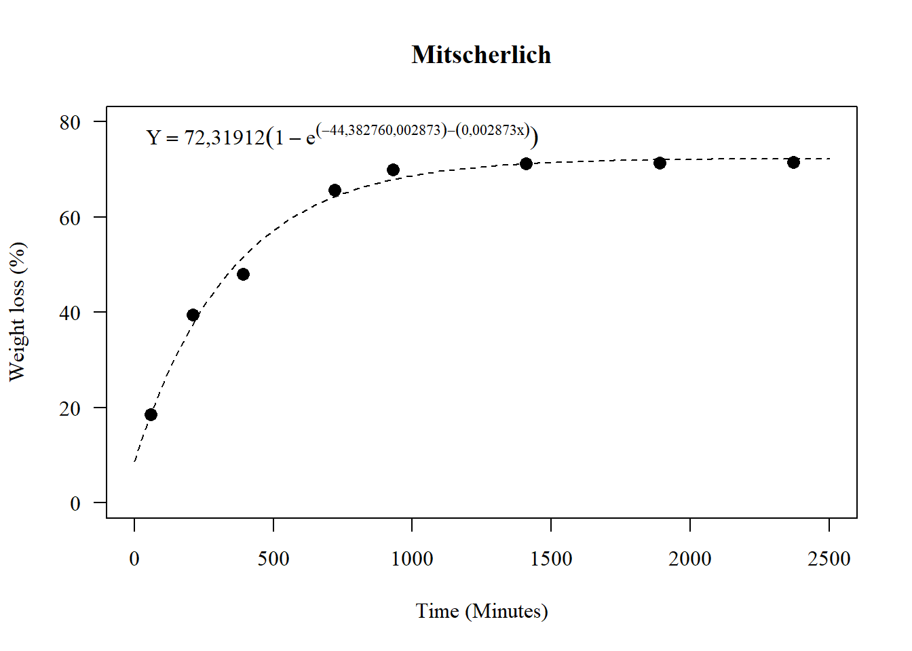

<br><br><br>

****

## Logística de 3 termos

****

$$Y = \frac{d}{1+exp(b(x-e))}$$


```r
library(drc)
model <- drm(y ~ x, fct = LL.3(), data = data)
summary(model)
```

```
## 
## Model fitted: Log-logistic (ED50 as parameter) with lower limit at 0 (3 parms)
## 
## Parameter estimates:
## 
##                 Estimate Std. Error t-value   p-value    
## b:(Intercept)  -1,058194   0,062275 -16,992 < 2,2e-16 ***
## d:(Intercept)  79,599836   1,684582  47,252 < 2,2e-16 ***
## e:(Intercept) 208,408451  12,445682  16,745 < 2,2e-16 ***
## ---
## Signif. codes:  0 '***' 0,001 '**' 0,01 '*' 0,05 '.' 0,1 ' ' 1
## 
## Residual standard error:
## 
##  3,340759 (61 degrees of freedom)
```

```r
par(family="serif")
plot(model,main="Logístico LL.3",
     las=1, cex=1.3,
     ylab="Weight loss (%)", 
     xlab="Time (Minutes)", 
     pch=16,lty=2)
legend("topleft",
       legend=expression(hat(Y)==frac(79.599836,
                                      1+exp(-1.058194(x-208.408455)))), bty="n")
```

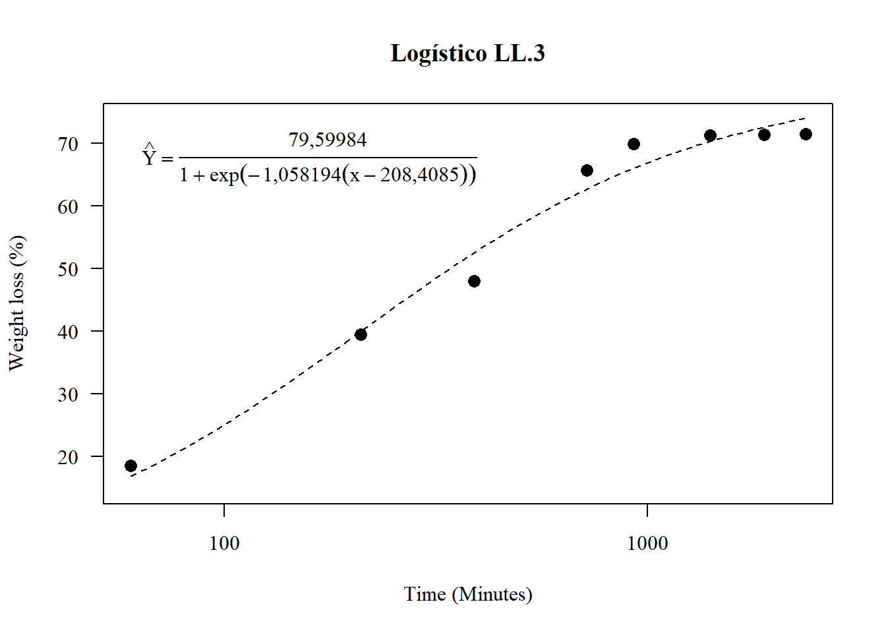

### ED, DL ou EC


```r
ED(model,10) ## Ed10
```

```
## 
## Estimated effective doses
## 
##        Estimate Std. Error
## e:1:10   26,131      2,755
```

```r
ED(model,50) ## ED50
```

```
## 
## Estimated effective doses
## 
##        Estimate Std. Error
## e:1:50  208,408     12,446
```

```r
ED(model,90) ## ED90
```

```
## 
## Estimated effective doses
## 
##        Estimate Std. Error
## e:1:90   1662,2      267,4
```

<br><br><br>

****

## Logística de 4 termos

****

$$Y = c-\frac{d-c}{1+exp(b(x-e))}$$


```r
model1 <- drm(y ~ x, fct = LL.4(), data = data)
summary(model1)
```

```
## 
## Model fitted: Log-logistic (ED50 as parameter) (4 parms)
## 
## Parameter estimates:
## 
##               Estimate Std. Error  t-value   p-value    
## b:(Intercept)  -1,6960     0,1552 -10,9279 6,668e-16 ***
## c:(Intercept)  15,1899     1,9728   7,6995 1,597e-10 ***
## d:(Intercept)  74,5348     1,0697  69,6796 < 2,2e-16 ***
## e:(Intercept) 289,3971    16,5292  17,5082 < 2,2e-16 ***
## ---
## Signif. codes:  0 '***' 0,001 '**' 0,01 '*' 0,05 '.' 0,1 ' ' 1
## 
## Residual standard error:
## 
##  2,950196 (60 degrees of freedom)
```

```r
par(family="serif")
plot(model,main="Logístico LL.4",
     las=1, cex=1.3,
     ylab="Weight loss (%)", 
     xlab="Time (Minutes)", 
     pch=16,lty=2)
legend("topleft",
       legend=expression(hat(Y)==15.1899+frac(74.59984-15.1899,
                                              1+exp(-1.6960(x-289.3971)))), bty="n")
```

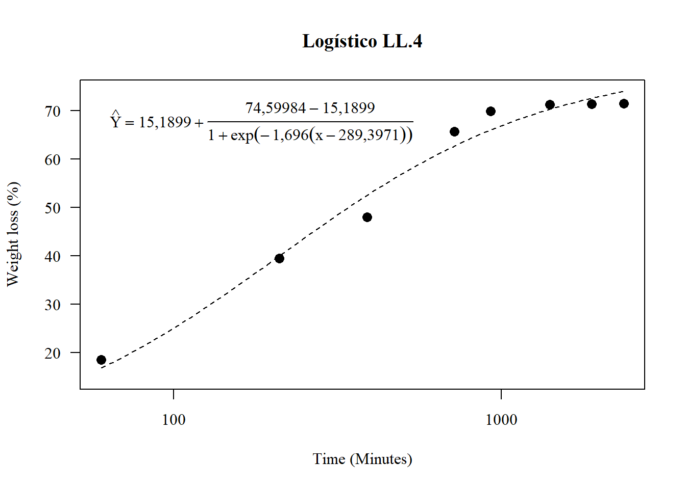

### ED, DL ou EC


```r
ED(model,10) ## Ed10
```

```
## 
## Estimated effective doses
## 
##        Estimate Std. Error
## e:1:10   26,131      2,755
```

```r
ED(model,50) ## ED50
```

```
## 
## Estimated effective doses
## 
##        Estimate Std. Error
## e:1:50  208,408     12,446
```

```r
ED(model,90) ## ED90
```

```
## 
## Estimated effective doses
## 
##        Estimate Std. Error
## e:1:90   1662,2      267,4
```

<br><br><br>

****

## Yield Loss

****

$$\hat{Y}=\frac{i\times x}{1+\frac{i\times x}{A}}$$


```r
#library(devtools)
#install_github("OnofriAndreaPG/aomisc")
par(family="serif")
library(aomisc)
model2 <- drm(y ~ x, fct = DRC.YL(), data = data)
summary(model2)
```

```
## 
## Model fitted: Yield-Loss function (Cousens, 1985) (2 parms)
## 
## Parameter estimates:
## 
##                Estimate Std. Error t-value   p-value    
## i:(Intercept)  0,376483   0,016637  22,629 < 2,2e-16 ***
## A:(Intercept) 81,021404   0,996137  81,336 < 2,2e-16 ***
## ---
## Signif. codes:  0 '***' 0,001 '**' 0,01 '*' 0,05 '.' 0,1 ' ' 1
## 
## Residual standard error:
## 
##  3,337955 (62 degrees of freedom)
```

```r
plot(model2,main="Yield Loss",
     las=1, cex=1.3,
     ylab="Weight loss (%)", 
     xlab="Time (Minutes)", 
     pch=16,lty=2)
legend("topleft",
       legend=expression(hat(YL)==frac(0.376483*x,
                                       1+frac(0.376483*x,81.021705))), bty="n")
```

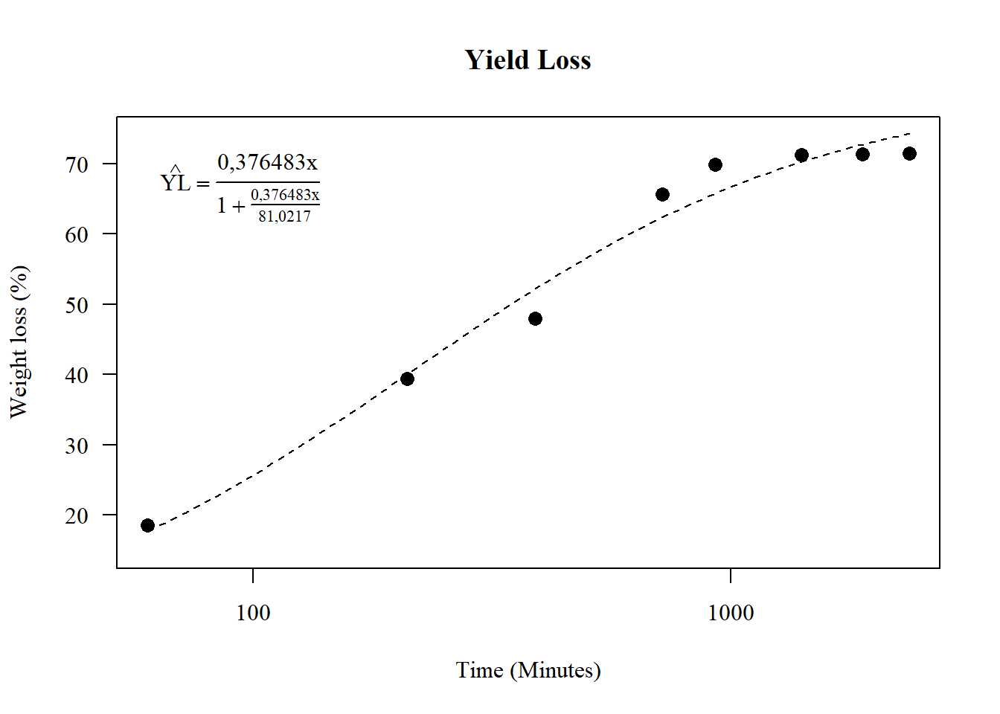

<br><br><br>

****

## Weibull 3

****

$$\hat{Y}=d\times e^{-e^{b\times log(x)-e}}$$

```r
par(family="serif")
model3 <- drm(y ~ x, fct = w3(), data = data)
summary(model3)
```

```
## 
## Model fitted: Weibull (type 1) with lower limit at 0 (3 parms)
## 
## Parameter estimates:
## 
##                 Estimate Std. Error t-value   p-value    
## b:(Intercept)  -0,621433   0,051944 -11,963 < 2,2e-16 ***
## d:(Intercept)  88,316665   3,466514  25,477 < 2,2e-16 ***
## e:(Intercept) 135,558602  10,937572  12,394 < 2,2e-16 ***
## ---
## Signif. codes:  0 '***' 0,001 '**' 0,01 '*' 0,05 '.' 0,1 ' ' 1
## 
## Residual standard error:
## 
##  3,702132 (61 degrees of freedom)
```

```r
plot(model3,main="Weibull 3",
     las=1, cex=1.3,
     ylab="Weight loss (%)", 
     xlab="Time (Minutes)", 
     pch=16,lty=2)
legend("topleft",
       legend=expression(hat(YL)==88.316665*e^(-e^{(-0.621433*(log(x)-135.558606))})), bty="n")
```

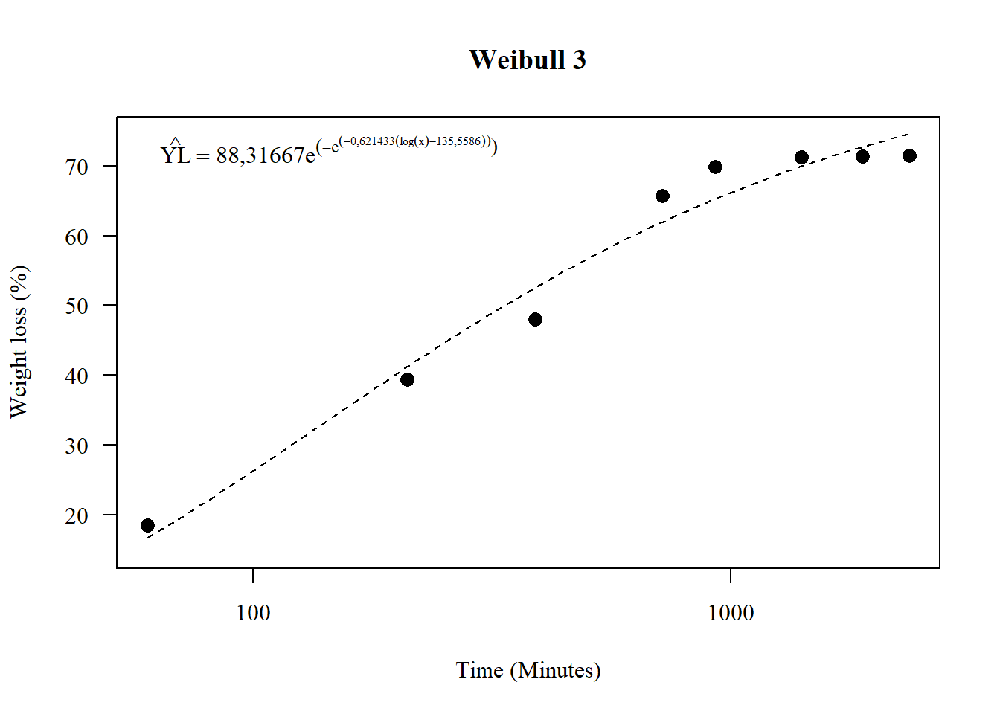

<br><br><br>

****

## Weibul 4 

****

$$\hat{Y} = c + (d − c)(1 − exp(− exp(b(log(x) − log(e)))))$$


```r
par(family="serif")
model4 <- drm(y ~ x, fct = w4(), data = data)
summary(model4)
```

```
## 
## Model fitted: Weibull (type 1) (4 parms)
## 
## Parameter estimates:
## 
##               Estimate Std. Error t-value   p-value    
## b:(Intercept)  -1,2171     0,1156 -10,528 2,911e-15 ***
## c:(Intercept)  18,4270     1,2668  14,546 < 2,2e-16 ***
## d:(Intercept)  76,5754     1,5142  50,571 < 2,2e-16 ***
## e:(Intercept) 230,4661    11,7439  19,624 < 2,2e-16 ***
## ---
## Signif. codes:  0 '***' 0,001 '**' 0,01 '*' 0,05 '.' 0,1 ' ' 1
## 
## Residual standard error:
## 
##  3,134519 (60 degrees of freedom)
```

```r
plot(model4,main="Weibull 4",
     las=1, cex=1.3,
     ylab="Weight loss (%)", 
     xlab="Time (Minutes)", 
     pch=16,lty=2)
legend("topleft",
       legend=expression(hat(YL)==18.4270+(76.5754-18.4270)(1-e^(-e^(-1.2171*(log(x)-log(230.4661)))))), bty="n")
```

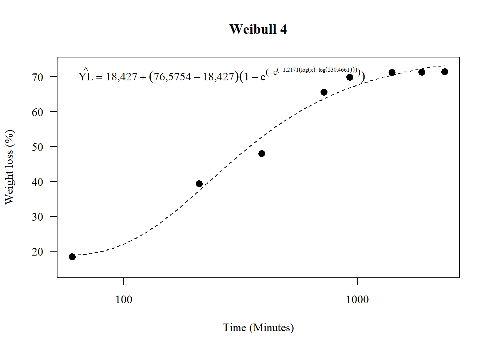

<br><br><br>

****

## Assintótica 2

****


```r
par(family="serif")
model5 <- drm(y ~ x, fct = drc::AR.2(), data = data)
summary(model5)
```

```
## 
## Model fitted: Asymptotic regression with lower limit at 0 (2 parms)
## 
## Parameter estimates:
## 
##                Estimate Std. Error t-value   p-value    
## d:(Intercept)  71,36776    0,64016 111,484 < 2,2e-16 ***
## e:(Intercept) 285,21787   10,77269  26,476 < 2,2e-16 ***
## ---
## Signif. codes:  0 '***' 0,001 '**' 0,01 '*' 0,05 '.' 0,1 ' ' 1
## 
## Residual standard error:
## 
##  3,364715 (62 degrees of freedom)
```

```r
plot(model5,main="Assintótica 2",
     las=1, cex=1.3,
     ylab="Weight loss (%)", 
     xlab="Time (Minutes)", 
     pch=16,lty=2)
```


<br><br><br>

****

## Assintótica 3

****


```r
par(family="serif")
model6 <- drm(y ~ x, fct = drc::AR.3(), data = data)
summary(model6)
```

```
## 
## Model fitted: Shifted asymptotic regression (3 parms)
## 
## Parameter estimates:
## 
##                Estimate Std. Error  t-value   p-value    
## c:(Intercept)   8,65955    1,29240   6,7003 7,565e-09 ***
## d:(Intercept)  72,31924    0,55231 130,9390 < 2,2e-16 ***
## e:(Intercept) 348,01446   15,20460  22,8888 < 2,2e-16 ***
## ---
## Signif. codes:  0 '***' 0,001 '**' 0,01 '*' 0,05 '.' 0,1 ' ' 1
## 
## Residual standard error:
## 
##  2,630211 (61 degrees of freedom)
```

```r
plot(model6,main="Assintótica 3",
     las=1, cex=1.3,
     ylab="Weight loss (%)", 
     xlab="Time (Minutes)", 
     pch=16,lty=2)
```


<br><br><br>

****

## Brain-Counsens 4

****


```r
model7 <- drm(y ~ x, fct = drc::BC.4(), data = data)
summary(model7)
```

```
## 
## Model fitted: Brain-Cousens (hormesis) with lower limit fixed at 0 (4 parms)
## 
## Parameter estimates:
## 
##                  Estimate  Std. Error  t-value   p-value    
## b:(Intercept)  -0,7419957   0,0628498 -11,8059 < 2,2e-16 ***
## d:(Intercept) 149,6381450  28,0543384   5,3339 1,539e-06 ***
## e:(Intercept) 842,5975169 384,1854662   2,1932  0,032179 *  
## f:(Intercept)  -0,0196017   0,0066143  -2,9635  0,004356 ** 
## ---
## Signif. codes:  0 '***' 0,001 '**' 0,01 '*' 0,05 '.' 0,1 ' ' 1
## 
## Residual standard error:
## 
##  2,642605 (60 degrees of freedom)
```

```r
par(family="serif")
plot(model,main="Brain-Counsens 4",
     las=1, cex=1.3,
     ylab="Weight loss (%)", 
     xlab="Time (Minutes)", 
     pch=16,lty=2)
```


<br><br><br>

****

## Brain-Counsens 5

****


```r
par(family="serif")
model8 <- drm(y ~ x, fct = drc::BC.5(), data = data)
summary(model8)
```

```
## 
## Model fitted: Brain-Cousens (hormesis) (5 parms)
## 
## Parameter estimates:
## 
##                  Estimate  Std. Error t-value   p-value    
## b:(Intercept)  -1,0445094   0,2286639 -4,5679 2,561e-05 ***
## c:(Intercept)   8,7627115   4,7730274  1,8359  0,071416 .  
## d:(Intercept) 109,0339449  20,0242731  5,4451 1,055e-06 ***
## e:(Intercept) 486,0685001 143,3483090  3,3908  0,001248 ** 
## f:(Intercept)  -0,0112154   0,0051383 -2,1827  0,033048 *  
## ---
## Signif. codes:  0 '***' 0,001 '**' 0,01 '*' 0,05 '.' 0,1 ' ' 1
## 
## Residual standard error:
## 
##  2,632805 (59 degrees of freedom)
```

```r
plot(model8,main="Brain-Cousens 5",
     las=1, cex=1.3,
     ylab="Weight loss (%)", 
     xlab="Time (Minutes)", 
     pch=16,lty=2)
```


<br><br><br>

****

## Cedergreen-Ritz-Streibig 3

****


```r
par(family="serif")
model9 <- drm(y ~ x, fct = drc::uml3a(), data = data)
summary(model9)
```

```
## 
## Model fitted: U-shaped Cedergreen-Ritz-Streibig (4 parms)
## 
## Parameter estimates:
## 
##                Estimate Std. Error t-value   p-value    
## b:(Intercept)   1,70356    0,15617 10,9084 6,917e-16 ***
## d:(Intercept)  74,51053    1,06473 69,9805 < 2,2e-16 ***
## e:(Intercept) 291,21663   16,71405 17,4235 < 2,2e-16 ***
## f:(Intercept) -15,54808    1,99553 -7,7915 1,112e-10 ***
## ---
## Signif. codes:  0 '***' 0,001 '**' 0,01 '*' 0,05 '.' 0,1 ' ' 1
## 
## Residual standard error:
## 
##  2,947189 (60 degrees of freedom)
```

```r
plot(model9,main="Cedergreen-Ritz-Streibig 3",
     las=1, cex=1.3,
     ylab="Weight loss (%)", 
     xlab="Time (Minutes)", 
     pch=16,lty=2)
```


<br><br><br>

****

## Cedergreen-Ritz-Streibig 4

****


```r
par(family="serif")
model10 <- drm(y ~ x, fct = drc::uml4a(), data = data)
summary(model10)
```

```
## 
## Model fitted: U-shaped Cedergreen-Ritz-Streibig (5 parms)
## 
## Parameter estimates:
## 
##                  Estimate  Std. Error  t-value   p-value    
## b:(Intercept)     4,64106     0,47568   9,7568 6,416e-14 ***
## c:(Intercept) -1701,15137    94,96264 -17,9139 < 2,2e-16 ***
## d:(Intercept)    71,53869     0,42799 167,1489 < 2,2e-16 ***
## e:(Intercept)   544,23492    21,39639  25,4358 < 2,2e-16 ***
## f:(Intercept) -1748,54548    96,09285 -18,1964 < 2,2e-16 ***
## ---
## Signif. codes:  0 '***' 0,001 '**' 0,01 '*' 0,05 '.' 0,1 ' ' 1
## 
## Residual standard error:
## 
##  2,008856 (59 degrees of freedom)
```

```r
plot(model,main="Cedergreen-Ritz-Streibig 4",
     las=1, cex=1.3,
     ylab="Weight loss (%)", 
     xlab="Time (Minutes)", 
     pch=16,lty=2)
```

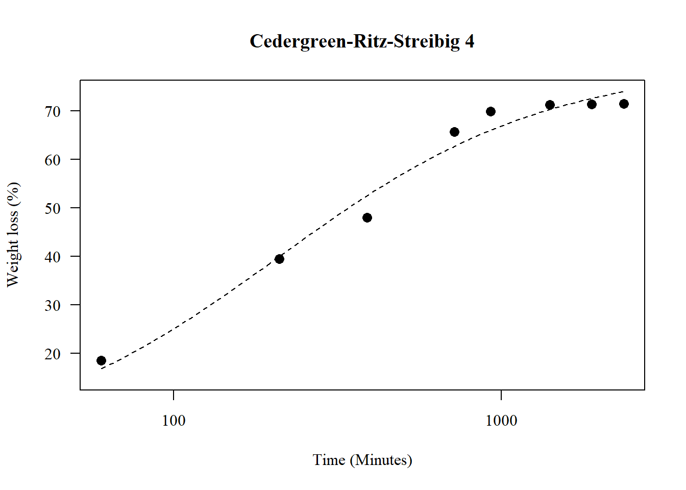

<br><br><br>

****

## Modelo exponencial

****


```r
modelexp=lm(log(y)~x);summary(modelexp)
```

```
## 
## Call:
## lm(formula = log(y) ~ x)
## 
## Residuals:
##     Min      1Q  Median      3Q     Max 
## -0,8722 -0,1354  0,1129  0,2682  0,3722 
## 
## Coefficients:
##              Estimate Std. Error t value Pr(>|t|)    
## (Intercept) 3,543e+00  6,534e-02  54,216  < 2e-16 ***
## x           4,188e-04  5,174e-05   8,095 2,71e-11 ***
## ---
## Signif. codes:  0 '***' 0,001 '**' 0,01 '*' 0,05 '.' 0,1 ' ' 1
## 
## Residual standard error: 0,3206 on 62 degrees of freedom
## Multiple R-squared:  0,5138,	Adjusted R-squared:  0,506 
## F-statistic: 65,52 on 1 and 62 DF,  p-value: 2,711e-11
```

```r
alpha=exp(modelexp$coefficients[1])
beta=modelexp$coefficients[2]
model11=nls(y~A*exp(x*B),start=list(A=alpha,B=beta))
summary(model11)
```

```
## 
## Formula: y ~ A * exp(x * B)
## 
## Parameters:
##    Estimate Std. Error t value Pr(>|t|)    
## A 4,237e+01  2,255e+00  18,790  < 2e-16 ***
## B 2,762e-04  3,386e-05   8,156 2,12e-11 ***
## ---
## Signif. codes:  0 '***' 0,001 '**' 0,01 '*' 0,05 '.' 0,1 ' ' 1
## 
## Residual standard error: 12,77 on 62 degrees of freedom
## 
## Number of iterations to convergence: 6 
## Achieved convergence tolerance: 5,434e-06
```

```r
plot(y~x)
lines(seq(min(x), max(x), length.out = 100), 
      predict(model11, newdata = data.frame(x = seq(min(x), 
                                                     max(x), 
                                                     length.out = 100))),
      col="red",lwd=2,lty=2)
```

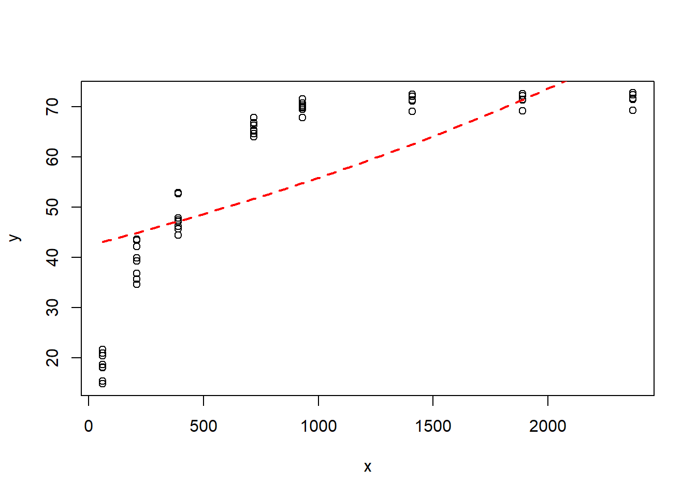

<br><br><br>

****

## Modelo loess

****


```r
model12=loess(y~x)
summary(model12)
```

```
## Call:
## loess(formula = y ~ x)
## 
## Number of Observations: 64 
## Equivalent Number of Parameters: 4,94 
## Residual Standard Error: 2,7 
## Trace of smoother matrix: 5,42  (exact)
## 
## Control settings:
##   span     :  0,75 
##   degree   :  2 
##   family   :  gaussian
##   surface  :  interpolate	  cell = 0,2
##   normalize:  TRUE
##  parametric:  FALSE
## drop.square:  FALSE
```

```r
par(pch=16,las=1); par(family="serif")
plot(media~tempo, main="Modelo Loess",
     las=1, cex=1.3,
     ylab="Weight loss (%)", xlim=c(0,2500),
     xlab="Time (Minutes)", 
     pch=16, ylim=c(0,80))
lines(x,predict(model12,x),lty=2)
```

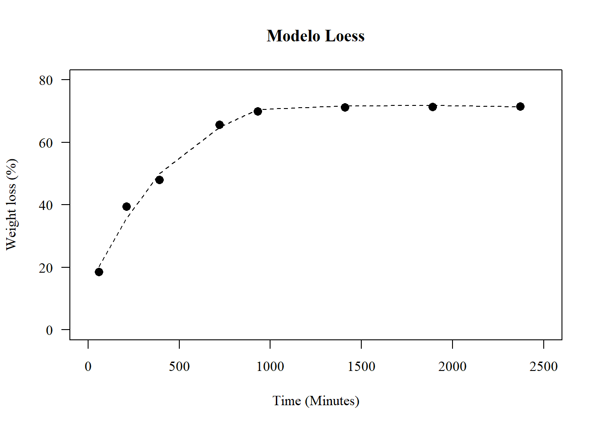

```r
## ou

par(pch=16,las=1); par(family="serif")
plot(media~tempo, main="modelo loess",
     las=1, cex=1.3,
     ylab="Weight loss (%)", xlim=c(0,2500),
     xlab="Time (Minutes)", 
     pch=16, ylim=c(0,80))
lines(seq(60,2370,5),predict(model12,seq(60,2370,5)),lty=2)
```

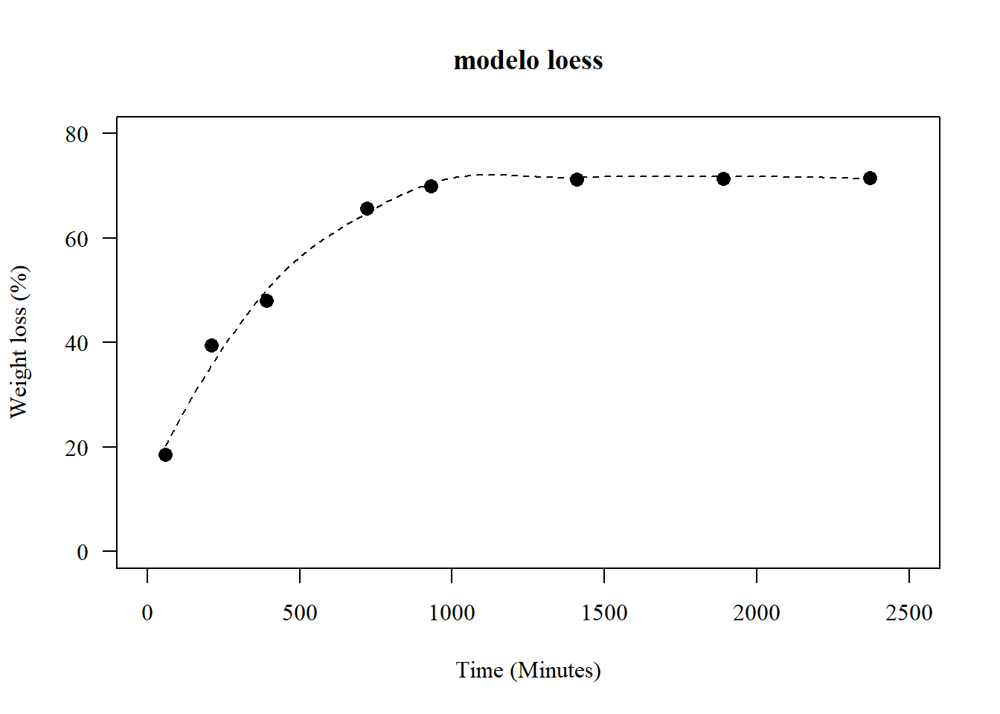

```r
## ou

library(ggplot2)
ggplot(data,aes(y=y,x=x))+
  geom_point()+
  geom_smooth()+
  theme_bw()+
  theme_classic()+
  xlab("Time (minutes)")+
  ylab("Weight loss (%)")
```

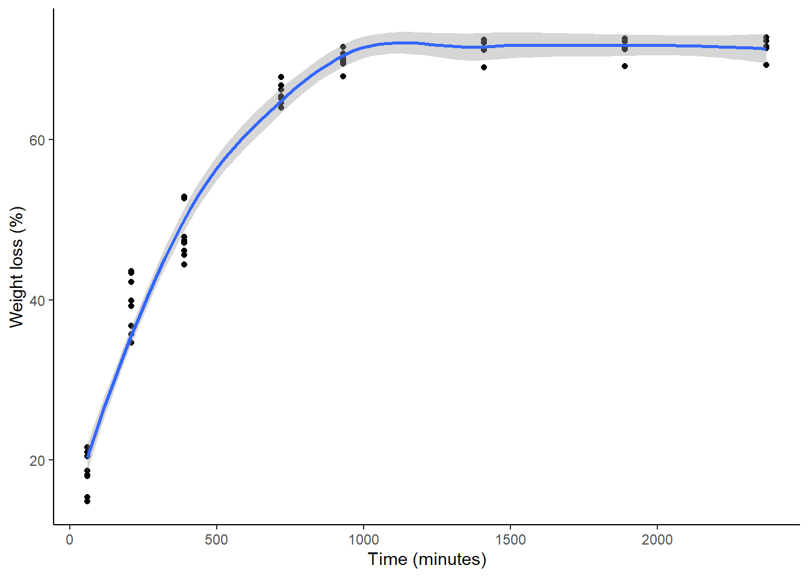

****

## Coef. de determinação ($R^2$)

****


```r
r2=c(1-var(residuals(modl))/var(residuals(lm(y~1))),
1-var(residuals(mod1))/var(residuals(lm(y~1))),
1-var(residuals(mod2))/var(residuals(lm(y~1))),
1-var(residuals(modelog))/var(residuals(lm(y~1))),
1-var(residuals(n0))/var(residuals(lm(y~1))),
1-var(residuals(n1))/var(residuals(lm(y~1))),
1-var(residuals(modelo_pieciwise))/var(residuals(lm(y~1))),
1-var(residuals(modelo_pieciwise1))/var(residuals(lm(y~1))),
1-var(residuals(modelo2))/var(residuals(lm(y~1))),
1-var(residuals(model))/var(residuals(lm(y~1))),
1-var(residuals(model1))/var(residuals(lm(y~1))),
1-var(residuals(model2))/var(residuals(lm(y~1))),
1-var(residuals(model3))/var(residuals(lm(y~1))),
1-var(residuals(model4))/var(residuals(lm(y~1))),
1-var(residuals(model5))/var(residuals(lm(y~1))),
1-var(residuals(model6))/var(residuals(lm(y~1))),
1-var(residuals(model7))/var(residuals(lm(y~1))),
1-var(residuals(model8))/var(residuals(lm(y~1))),
1-var(residuals(model9))/var(residuals(lm(y~1))),
1-var(residuals(model10))/var(residuals(lm(y~1))),
1-var(residuals(model11))/var(residuals(lm(y~1))))
```

<br><br><br>

****

## AIC

****


```r
aic=c(AIC(modl),
AIC(mod1),
AIC(mod2),
AIC(modelog),
AIC(n0),
AIC(n1),
AIC(modelo_pieciwise),
AIC(modelo_pieciwise1),
AIC(modelo2),
AIC(model),
AIC(model1),
AIC(model2),
AIC(model3),
AIC(model4),
AIC(model5),
AIC(model6),
AIC(model7),
AIC(model8),
AIC(model9),
AIC(model10),
AIC(model11))
```

<br><br><br>

****

## BIC

****


```r
bic=c(BIC(modl),
BIC(mod1),
BIC(mod2),
BIC(modelog),
BIC(n0),
BIC(n1),
BIC(modelo_pieciwise),
BIC(modelo_pieciwise1),
BIC(modelo2),
BIC(model),
BIC(model1),
BIC(model2),
BIC(model3),
BIC(model4),
BIC(model5),
BIC(model6),
BIC(model7),
BIC(model8),
BIC(model9),
BIC(model10),
BIC(model11))
analise=cbind(aic,bic,r2)
rownames(analise)=c("Linear","Quadrático","Cúbico","Log",
                    "Michaelis-Mente","Michaelis Menten (Corrigido)",
                    "Segmentada Linear","Segmentada Quadrática",
                    "Mitscherlich","Logístico LL.3","Logístico LL.4",
                    "Yield Loss", "Weibull 3","Weibull 4",
                    "Assintótica 2","Assintótica 3",
                    "Brain-Counsens 4","Brain-Counsens 5",
                    "Cedergreen-Ritz-Streibig 3",
                    "Cedergreen-Ritz-Streibig 4",
                    "Exponencial")
knitr::kable(analise)
```

                                     aic        bic          r2
-----------------------------  ---------  ---------  ----------
Linear                          499,5847   506,0614   0,6204884
Quadrático                      402,7620   411,3975   0,9189732
Cúbico                          317,0989   327,8933   0,9794051
Log                             384,3339   390,8105   0,9373170
Michaelis-Mente                 339,8781   346,3547   0,9687055
Michaelis Menten (Corrigido)    323,8311   332,4667   0,9765013
Segmentada Linear               352,6998   363,4943   0,9640795
Segmentada Quadrática           332,1142   345,0675   0,9747606
Mitscherlich                    310,3357   318,9713   0,9808822
Logístico LL.3                  340,9449   349,5804   0,9691758
Logístico LL.4                  325,9732   336,7677   0,9763419
Yield Loss                      339,8781   346,3547   0,9687055
Weibull 3                       354,0919   362,7274   0,9621318
Weibull 4                       333,7306   344,5250   0,9732933
Assintótica 2                   340,9002   347,3768   0,9688639
Assintótica 3                   310,3357   318,9713   0,9808822
Brain-Counsens 4                311,8796   322,6740   0,9810184
Brain-Counsens 5                312,3284   325,2817   0,9814725
Cedergreen-Ritz-Streibig 3      325,8427   336,6371   0,9763901
Cedergreen-Ritz-Streibig 4      277,7064   290,6597   0,9892136
Exponencial                     511,5978   518,0744   0,5422488


# Análise de sobrevivência

*****

<br><br>

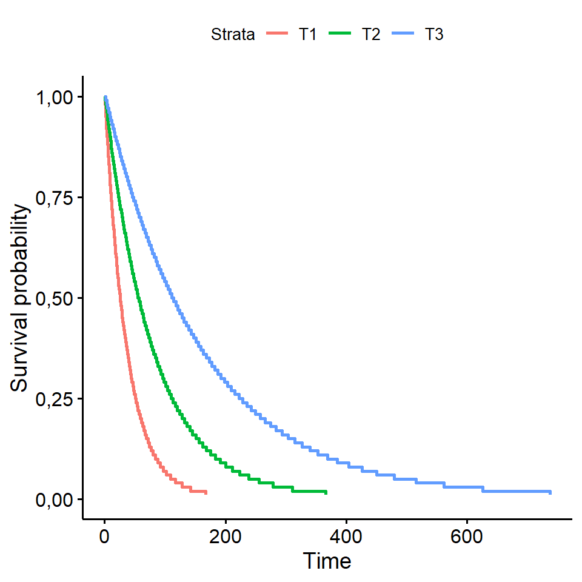

Análise de sobrevivência, também denominada análise de sobrevida, é um ramo da estatística que estuda o tempo de duração esperado até a ocorrência de um ou mais eventos, tais como morte em organismos biológicos ou falha em sistemas mecânicos. Na agronomia, tem sido bastante utilizada na avaliação residual de produtos fitossanitários em insetos, tempo até a morte em função de um doença, etc.

<br><br>

****

****

## Conjunto de dados

****

O conjunto de dados é de um experimento cujo objetivo é avaliar a mortalidade de insetos em função de alguns produtos comerciais. 


```r
tempo=c(10,10,10,10,10,10,10,24,24,24,24,48,10,10,10,10,10,10,10,10,10,10,10,10,24,24,48,48,72,72,72,72,72,72,72,72,10,10,24,24,72,72,72,72,72,72,96,96,10,10,10,48,96,96,144,144,168,168,168,168,10,10,24,24,72,72,72,96,96,120,168,168,10,10,10,10,10,10,10,24,24,24,24,48,10,10,10,24,24,120,120,144,144,144,144,144,10,10,144,144,168,168,168,168,168,168,168,168,24,72,96,96,120,144,168,168,168,168,168,168,24,72,96,120,144,168,168,168,168,168,168,168,10,10,10,10,10,10,24,72,96,168,168,168)
# criando vetor de status (Ocorreu ou nao o evento)
status=c(1,1,1,1,1,1,1,1,1,1,1,1,1,1,1,1,1,1,1,1,1,1,1,1,1,1,1,1,1,1,1,1,1,1,1,1,1,1,1,1,1,1,1,1,1,1,1,1,1,1,1,1,1,1,1,1,0,0,0,0,1,1,1,1,1,1,1,1,1,1,1,0,1,1,1,1,1,1,1,1,1,1,1,1,1,1,1,1,1,1,1,1,1,1,1,1,1,1,1,1,1,1,1,1,0,0,0,0,1,1,1,1,1,1,1,0,0,0,1,0,1,1,1,1,1,1,1,1,1,0,0,0,1,1,1,1,1,1,1,1,1,1,0,0)
trat=rep(c("T1","T2",'T3'),e=48)
dados=data.frame(trat,tempo,status)
```

<br><br>

## Histograma


```r
hist(tempo)
```

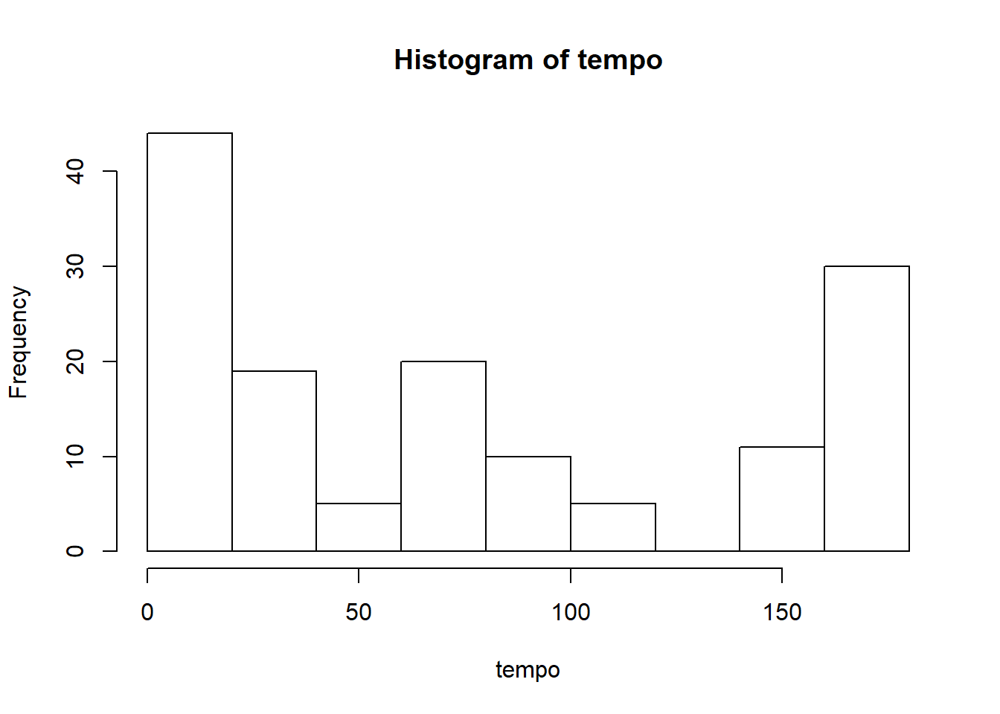

<br><br>

****

## Método não-paramétrico de Kaplan-meier

****

<br><br>

### Sem considerar tratamentos

Somente uma análise exploratória geral


```r
library(survival)
library(survminer)
KM <- survfit(Surv(tempo,status) ~ 1, type="kaplan-meier")
summary(KM)
```

```
## Call: survfit(formula = Surv(tempo, status) ~ 1, type = "kaplan-meier")
## 
##  time n.risk n.event survival std.err lower 95% CI upper 95% CI
##    10    144      44    0,694  0,0384       0,6231        0,774
##    24    100      19    0,562  0,0413       0,4870        0,650
##    48     81       5    0,528  0,0416       0,4522        0,616
##    72     76      20    0,389  0,0406       0,3169        0,477
##    96     56      10    0,319  0,0389       0,2517        0,405
##   120     46       5    0,285  0,0376       0,2198        0,369
##   144     41      11    0,208  0,0338       0,1515        0,286
##   168     30      12    0,125  0,0276       0,0811        0,193
```

```r
ggsurvplot(
  fit = survfit(Surv(tempo, status) ~ 1),data=dados, 
  xlab = "Time (hours)", 
  ylab = "Overall survival probability")
```


### Tempo médio de sobrevivência


```r
a=survival:::survmean(KM, rmean=48)
a$matrix[5]
```

```
##   *rmean 
## 33,22222
```

<br><br>

### Considerando tratamentos

### Conferindo diferenças par a par


```r
pvalor=pairwise_survdiff(Surv(tempo,status)~trat,data=dados, rho=0)
knitr::kable(pvalor$p.value)
```

             T1          T2
---  ----------  ----------
T2    0,0003111            
T3    0,0000000   0,0006521

Todos diferem entre si

### Grafico por tratamento usando o método de Kaplan-Meier


```r
KM1 <- survfit(Surv(tempo,status) ~ trat, type="kaplan-meier")
ggsurvplot(
  fit = survfit(Surv(tempo, status) ~ trat),data=dados, 
  xlab = "Time (hours)", 
  ylab = "Overall survival probability")
```


### Tempo médio de sobrevivência


```r
survival:::survmean(KM1, rmean=48)$matrix[,5]
```

```
##  trat=T1  trat=T2  trat=T3 
## 27,37500 32,12500 40,16667
```

<br><br>

****

## Modelo paramétrico

****

<br><br>

****

### Distribuição exponencial

****

<br><br>

### Sem considerar tratamentos


```r
KM <- survreg(Surv(tempo,status) ~ 1, dist="exponential")
summary(KM)
```

```
## 
## Call:
## survreg(formula = Surv(tempo, status) ~ 1, dist = "exponential")
##              Value Std. Error    z      p
## (Intercept) 4,4473     0,0891 49,9 <2e-16
## 
## Scale fixed at 1 
## 
## Exponential distribution
## Loglik(model)= -686,4   Loglik(intercept only)= -686,4
## Number of Newton-Raphson Iterations: 4 
## n= 144
```

```r
s <- seq(.01, .99, by = .01)
t_0 <- predict(KM, newdata = data.frame(trat=paste("T1","T2","T3")), 
                 type = "quantile", p = s)
smod <- data.frame(time = c(t_0), # acrescentar os tratamentos 
                   surv = rep(1 - s, times = 1), # mudar o times
                   upper = NA, lower = NA)
ggsurvplot(smod)  
```


### Considerando tratamentos


```r
library(survival)
library(survminer)
KM2 <- survreg(Surv(tempo,status) ~ trat, dist="exponential")
summary(KM)
```

```
## 
## Call:
## survreg(formula = Surv(tempo, status) ~ 1, dist = "exponential")
##              Value Std. Error    z      p
## (Intercept) 4,4473     0,0891 49,9 <2e-16
## 
## Scale fixed at 1 
## 
## Exponential distribution
## Loglik(model)= -686,4   Loglik(intercept only)= -686,4
## Number of Newton-Raphson Iterations: 4 
## n= 144
```

```r
anova(KM2)
```

```
##      Df Deviance Resid. Df    -2*LL     Pr(>Chi)
## NULL NA       NA       143 1372,722           NA
## trat  2 44,24522       141 1328,477 2,467593e-10
```

```r
s <- seq(.01, .99, by = .01)
t_0 <- predict(KM2, newdata = data.frame(trat = "T1"), type = "quantile", p = s)
t_1 <- predict(KM2, newdata = data.frame(trat = "T2"), type = "quantile", p = s)
t_2 <- predict(KM2, newdata = data.frame(trat = "T3"), type = "quantile", p = s)
smod <- data.frame(time = c(t_0, t_1, t_2), # acrescentar os tratamentos 
                   surv = rep(1 - s, times = 3), # mudar o times
                   strata = rep(c("T1", "T2", "T3"), each = length(s)),
                   upper = NA, lower = NA)
ggsurvplot(smod)  
```

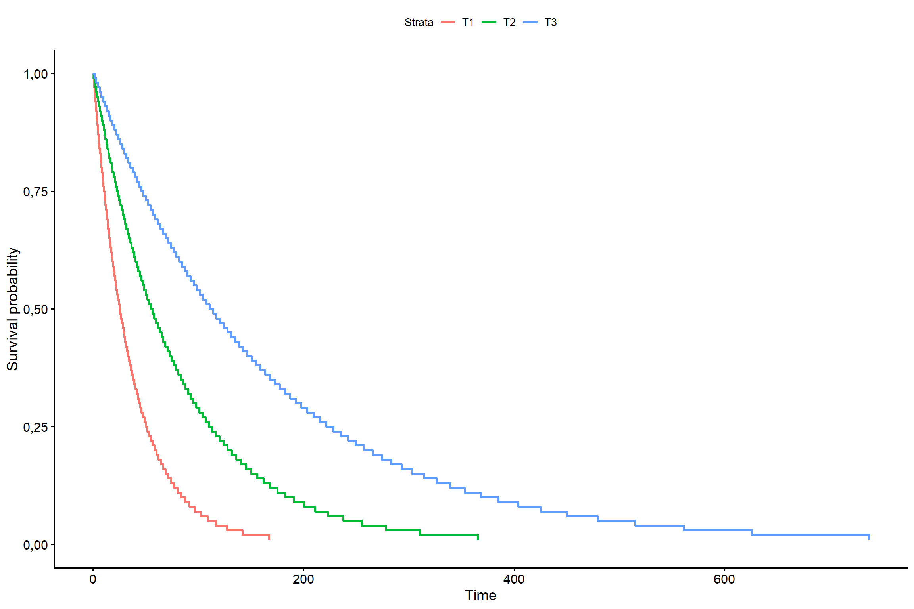

<br><br>

****

## Distribuição gaussiano

****

### Sem considerar tratamentos


```r
KM <- survreg(Surv(tempo,status) ~ 1, dist="gaussian")
summary(KM)
```

```
## 
## Call:
## survreg(formula = Surv(tempo, status) ~ 1, dist = "gaussian")
##               Value Std. Error    z      p
## (Intercept) 78,8982     5,9303 13,3 <2e-16
## Log(scale)   4,2519     0,0652 65,2 <2e-16
## 
## Scale= 70,2 
## 
## Gaussian distribution
## Loglik(model)= -735,6   Loglik(intercept only)= -735,6
## Number of Newton-Raphson Iterations: 5 
## n= 144
```

### Considerando tratamentos


```r
KM3 <- survreg(Surv(tempo,status) ~ trat, dist="gaussian")
summary(KM3)
```

```
## 
## Call:
## survreg(formula = Surv(tempo, status) ~ trat, dist = "gaussian")
##               Value Std. Error     z       p
## (Intercept) 36,3750     8,5829  4,24 2,3e-05
## tratT2      37,3906    12,1867  3,07  0,0022
## tratT3      89,7879    12,3737  7,26 4,0e-13
## Log(scale)   4,0854     0,0649 62,96 < 2e-16
## 
## Scale= 59,5 
## 
## Gaussian distribution
## Loglik(model)= -712,5   Loglik(intercept only)= -735,6
## 	Chisq= 46,23 on 2 degrees of freedom, p= 9,2e-11 
## Number of Newton-Raphson Iterations: 4 
## n= 144
```

```r
anova(KM3)
```

```
##      Df Deviance Resid. Df    -2*LL     Pr(>Chi)
## NULL NA       NA       142 1471,295           NA
## trat  2 46,22645       140 1425,069 9,163355e-11
```

```r
t_0 <- predict(KM3, newdata = data.frame(trat = "T1"), type = "lp")
t_1 <- predict(KM3, newdata = data.frame(trat = "T2"),type = "lp")
t_2 <- predict(KM3, newdata = data.frame(trat = "T3"),type = "lp")
x_grid <- 1:400
sur_curves <- sapply(t_0, function(x)survreg.distributions[[KM3$dist]]$density((x - x_grid)/KM3$scale)[, 1])
sur_curves1 <- sapply(t_1, function(x)survreg.distributions[[KM3$dist]]$density((x - x_grid)/KM3$scale)[, 1])
sur_curves2 <- sapply(t_2, function(x)survreg.distributions[[KM3$dist]]$density((x - x_grid)/KM3$scale)[, 1])
matplot(x_grid, sur_curves, type = "l", lty = 1,ylim=c(0,1))
lines(x_grid,sur_curves1,col="red")
lines(x_grid,sur_curves2,col="blue")
```

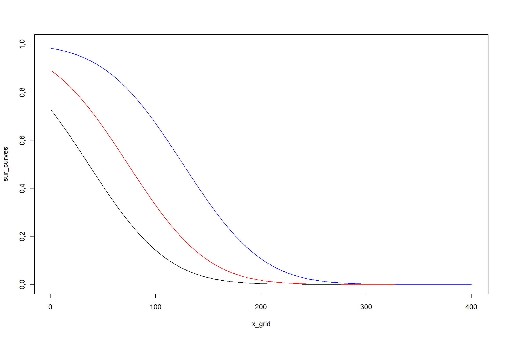

<br><br>

****

## Distribuição logistico

****

### Sem considerar tratamentos


```r
KM <- survreg(Surv(tempo,status) ~ 1, dist="logistic")
summary(KM)
```

```
## 
## Call:
## survreg(formula = Surv(tempo, status) ~ 1, dist = "logistic")
##               Value Std. Error    z      p
## (Intercept) 72,5020     6,3768 11,4 <2e-16
## Log(scale)   3,7594     0,0722 52,0 <2e-16
## 
## Scale= 42,9 
## 
## Logistic distribution
## Loglik(model)= -739,5   Loglik(intercept only)= -739,5
## Number of Newton-Raphson Iterations: 5 
## n= 144
```

### Considerando tratamentos


```r
KM4 <- survreg(Surv(tempo,status) ~ trat, dist="logistic")
summary(KM4)
```

```
## 
## Call:
## survreg(formula = Surv(tempo, status) ~ trat, dist = "logistic")
##               Value Std. Error     z       p
## (Intercept) 35,4968     7,7296  4,59 4,4e-06
## tratT2      31,3587    12,2695  2,56   0,011
## tratT3      98,9211    12,4589  7,94 2,0e-15
## Log(scale)   3,5544     0,0737 48,20 < 2e-16
## 
## Scale= 35 
## 
## Logistic distribution
## Loglik(model)= -714,3   Loglik(intercept only)= -739,5
## 	Chisq= 50,45 on 2 degrees of freedom, p= 1,1e-11 
## Number of Newton-Raphson Iterations: 4 
## n= 144
```

```r
anova(KM4)
```

```
##      Df Deviance Resid. Df    -2*LL     Pr(>Chi)
## NULL NA       NA       142 1479,091           NA
## trat  2 50,45218       140 1428,639 1,107765e-11
```

```r
t_0 <- predict(KM4, newdata = data.frame(trat = "T1"), type = "lp")
t_1 <- predict(KM4, newdata = data.frame(trat = "T2"),type = "lp")
t_2 <- predict(KM4, newdata = data.frame(trat = "T3"),type = "lp")
x_grid <- 1:400
sur_curves <- sapply(t_0, function(x)survreg.distributions[[KM4$dist]]$density((x - x_grid)/KM4$scale)[, 1])
sur_curves1 <- sapply(t_1, function(x)survreg.distributions[[KM4$dist]]$density((x - x_grid)/KM4$scale)[, 1])
sur_curves2 <- sapply(t_2, function(x)survreg.distributions[[KM4$dist]]$density((x - x_grid)/KM4$scale)[, 1])
matplot(x_grid, sur_curves, type = "l", lty = 1,ylim=c(0,1))
lines(x_grid,sur_curves1,col="red")
lines(x_grid,sur_curves2,col="blue")
```

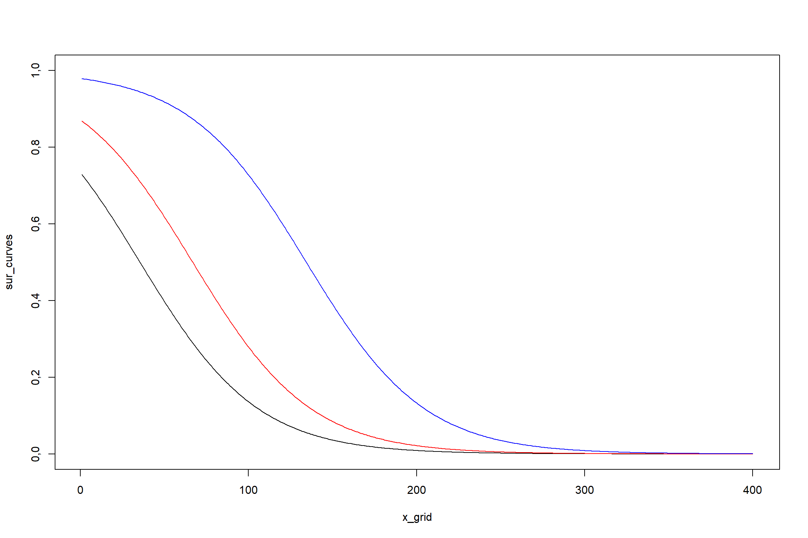

<br><br>

****

## Distribuição Log normal

****

### Sem considerar tratamentos


```r
KM <- survreg(Surv(tempo,status) ~ 1, dist="lognormal")
summary(KM)
```

```
## 
## Call:
## survreg(formula = Surv(tempo, status) ~ 1, dist = "lognormal")
##              Value Std. Error     z       p
## (Intercept) 3,8658     0,1080 35,80 < 2e-16
## Log(scale)  0,2438     0,0648  3,76 0,00017
## 
## Scale= 1,28 
## 
## Log Normal distribution
## Loglik(model)= -681,1   Loglik(intercept only)= -681,1
## Number of Newton-Raphson Iterations: 5 
## n= 144
```

### Considerando tratamentos


```r
KM5 <- survreg(Surv(tempo,status) ~ trat, dist="lognormal")
summary(KM5)
```

```
## 
## Call:
## survreg(formula = Surv(tempo, status) ~ trat, dist = "lognormal")
##              Value Std. Error     z      p
## (Intercept) 3,2165     0,1655 19,43 <2e-16
## tratT2      0,5650     0,2352  2,40  0,016
## tratT3      1,3925     0,2394  5,82  6e-09
## Log(scale)  0,1369     0,0644  2,12  0,034
## 
## Scale= 1,15 
## 
## Log Normal distribution
## Loglik(model)= -665,4   Loglik(intercept only)= -681,1
## 	Chisq= 31,54 on 2 degrees of freedom, p= 1,4e-07 
## Number of Newton-Raphson Iterations: 4 
## n= 144
```

```r
anova(KM5)
```

```
##      Df Deviance Resid. Df    -2*LL     Pr(>Chi)
## NULL NA       NA       142 1362,288           NA
## trat  2 31,54326       140 1330,744 1,414059e-07
```

```r
s <- seq(.01, .99, by = .01)
t_0 <- predict(KM5, newdata = data.frame(trat = "T1"), type = "quantile", p = s)
t_1 <- predict(KM5, newdata = data.frame(trat = "T2"), type = "quantile", p = s)
t_2 <- predict(KM5, newdata = data.frame(trat = "T3"), type = "quantile", p = s)
smod <- data.frame(time = c(t_0, t_1, t_2), # acrescentar os tratamentos 
                   surv = rep(1 - s, times = 3), # mudar o times
                   strata = rep(c("T1", "T2", "T3"), each = length(s)),
                   upper = NA, lower = NA)
ggsurvplot(smod)  
```

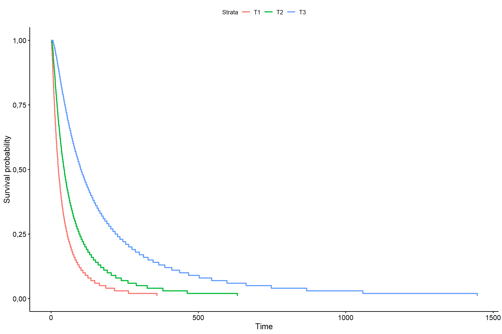

<br><br>

****

## Distribuição Log-Logístico

****

### Sem considerar tratamentos


```r
KM <- survreg(Surv(tempo,status) ~ 1, dist="loglogistic")
summary(KM)
```

```
## 
## Call:
## survreg(formula = Surv(tempo, status) ~ 1, dist = "loglogistic")
##               Value Std. Error     z      p
## (Intercept)  3,8717     0,1192 32,49 <2e-16
## Log(scale)  -0,2265     0,0711 -3,19 0,0014
## 
## Scale= 0,797 
## 
## Log logistic distribution
## Loglik(model)= -687   Loglik(intercept only)= -687
## Number of Newton-Raphson Iterations: 5 
## n= 144
```

### Considerando tratamentos


```r
KM6 <- survreg(Surv(tempo,status) ~ trat, dist="loglogistic")
summary(KM6)
```

```
## 
## Call:
## survreg(formula = Surv(tempo, status) ~ trat, dist = "loglogistic")
##               Value Std. Error     z       p
## (Intercept)  3,1947     0,1689 18,92 < 2e-16
## tratT2       0,5839     0,2530  2,31   0,021
## tratT3       1,5687     0,2441  6,43 1,3e-10
## Log(scale)  -0,3709     0,0725 -5,11 3,2e-07
## 
## Scale= 0,69 
## 
## Log logistic distribution
## Loglik(model)= -669,2   Loglik(intercept only)= -687
## 	Chisq= 35,64 on 2 degrees of freedom, p= 1,8e-08 
## Number of Newton-Raphson Iterations: 4 
## n= 144
```

```r
anova(KM6)
```

```
##      Df Deviance Resid. Df    -2*LL     Pr(>Chi)
## NULL NA       NA       142 1373,973           NA
## trat  2 35,64462       140 1338,328 1,819156e-08
```

```r
s <- seq(.01, .99, by = .01)
t_0 <- predict(KM6, newdata = data.frame(trat = "T1"), type = "quantile", p = s)
t_1 <- predict(KM6, newdata = data.frame(trat = "T2"), type = "quantile", p = s)
t_2 <- predict(KM6, newdata = data.frame(trat = "T3"), type = "quantile", p = s)
smod <- data.frame(time = c(t_0, t_1, t_2), # acrescentar os tratamentos 
                   surv = rep(1 - s, times = 3), # mudar o times
                   strata = rep(c("T1", "T2", "T3"), each = length(s)),
                   upper = NA, lower = NA)
ggsurvplot(smod)  
```


<br><br>

****

## Distribuição Weibull (default)

*****

### Sem considerar tratamentos


```r
KM <- survreg(Surv(tempo,status) ~ 1, dist="weibull")
summary(KM)
```

```
## 
## Call:
## survreg(formula = Surv(tempo, status) ~ 1, dist = "weibull")
##              Value Std. Error     z      p
## (Intercept) 4,4310     0,0969 45,72 <2e-16
## Log(scale)  0,0685     0,0740  0,93   0,35
## 
## Scale= 1,07 
## 
## Weibull distribution
## Loglik(model)= -685,9   Loglik(intercept only)= -685,9
## Number of Newton-Raphson Iterations: 6 
## n= 144
```

### Considerando tratamentos


```r
KM7 <- survreg(Surv(tempo,status) ~ trat, dist="weibull")
summary(KM7)
```

```
## 
## Call:
## survreg(formula = Surv(tempo, status) ~ trat, dist = "weibull")
##               Value Std. Error     z       p
## (Intercept)  3,6259     0,1334 27,18 < 2e-16
## tratT2       0,7769     0,1906  4,08 4,6e-05
## tratT3       1,4392     0,2043  7,05 1,8e-12
## Log(scale)  -0,0969     0,0744 -1,30    0,19
## 
## Scale= 0,908 
## 
## Weibull distribution
## Loglik(model)= -663,4   Loglik(intercept only)= -685,9
## 	Chisq= 45 on 2 degrees of freedom, p= 1,7e-10 
## Number of Newton-Raphson Iterations: 5 
## n= 144
```

```r
anova(KM7)
```

```
##      Df Deviance Resid. Df    -2*LL     Pr(>Chi)
## NULL NA       NA       142 1371,840           NA
## trat  2 44,99626       140 1326,844 1,695061e-10
```

```r
s <- seq(.01, .99, by = .01)
t_0 <- predict(KM7, newdata = data.frame(trat = "T1"), type = "quantile", p = s)
t_1 <- predict(KM7, newdata = data.frame(trat = "T2"), type = "quantile", p = s)
t_2 <- predict(KM7, newdata = data.frame(trat = "T3"), type = "quantile", p = s)
smod <- data.frame(time = c(t_0, t_1, t_2), # acrescentar os tratamentos 
                   surv = rep(1 - s, times = 3), # mudar o times
                   strata = rep(c("T1", "T2", "T3"), each = length(s)),
                   upper = NA, lower = NA)
ggsurvplot(smod)  
```

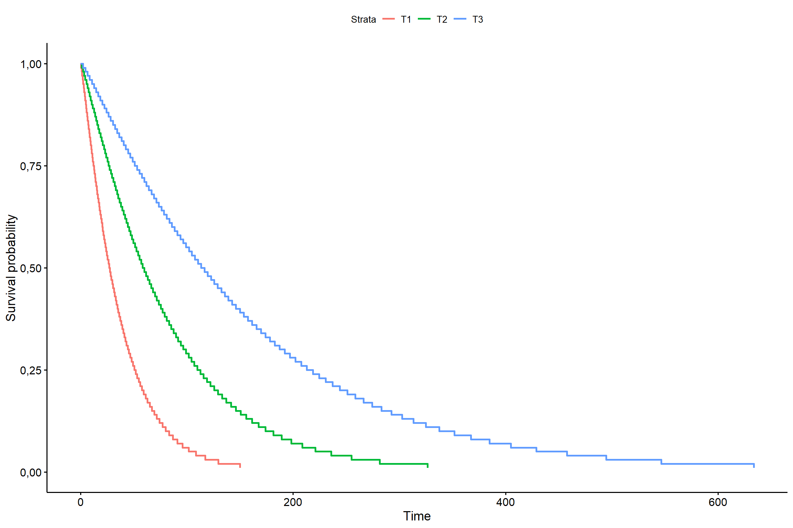


<br><br><br>

****

## Gompertz

****


```r
library(flexsurv)
KM9=flexsurvreg(Surv(tempo,status)~trat,dist="Gompertz")
summary(KM9)
```

```
## trat=T1 
##   time         est          lcl        ucl
## 1   10 0,786371074 7,187924e-01 0,83943849
## 2   24 0,549854904 4,434602e-01 0,64050367
## 3   48 0,279640531 1,821254e-01 0,38028131
## 4   72 0,130206542 6,490193e-02 0,21561018
## 5   96 0,054871360 2,040002e-02 0,11632022
## 6  120 0,020657887 5,043557e-03 0,05962935
## 7  144 0,006846406 8,958938e-04 0,02949505
## 8  168 0,001964497 9,034696e-05 0,01405177
## 
## trat=T2 
##   time        est        lcl       ucl
## 1   10 0,91229451 0,86901056 0,9399498
## 2   24 0,79577094 0,71198119 0,8550142
## 3   48 0,61465240 0,49517999 0,7074381
## 4   72 0,45902365 0,33621603 0,5697394
## 5   96 0,32998531 0,21742041 0,4412666
## 6  120 0,22722132 0,13619486 0,3353306
## 7  144 0,14902446 0,07688698 0,2459599
## 8  168 0,09250403 0,03719677 0,1774858
## 
## trat=T3 
##   time       est       lcl       ucl
## 1   10 0,9585577 0,9352449 0,9731776
## 2   24 0,9000225 0,8500392 0,9337660
## 3   48 0,7989822 0,7128341 0,8616093
## 4   72 0,6983485 0,5903741 0,7845301
## 5   96 0,5997606 0,4811075 0,7031812
## 6  120 0,5049620 0,3834571 0,6175876
## 7  144 0,4157087 0,2922862 0,5310012
## 8  168 0,3336543 0,2144865 0,4511787
```

```r
plot(KM9,col=c(1,2,3))
```

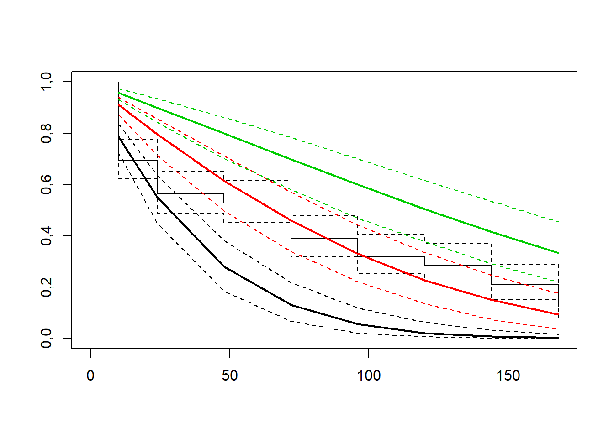

****

## Gamma

****


```r
library(flexsurv)
KM10=flexsurvreg(Surv(tempo,status)~trat,dist="gamma")
summary(KM10)
```

```
## trat=T1 
##   time         est         lcl        ucl
## 1   10 0,790201487 0,713854693 0,85515784
## 2   24 0,537681788 0,437350245 0,63595850
## 3   48 0,267748022 0,173305674 0,37248988
## 4   72 0,130741530 0,066402949 0,21734900
## 5   96 0,063206831 0,025496912 0,12516701
## 6  120 0,030369861 0,009439586 0,07224016
## 7  144 0,014531118 0,003421212 0,04126515
## 8  168 0,006931519 0,001233350 0,02393340
## 
## trat=T2 
##   time       est        lcl       ucl
## 1   10 0,9055576 0,85734495 0,9460262
## 2   24 0,7671054 0,68472256 0,8380858
## 3   48 0,5650288 0,46266594 0,6617095
## 4   72 0,4110387 0,29804997 0,5192618
## 5   96 0,2969771 0,18699031 0,4049966
## 6  120 0,2136179 0,11913912 0,3143148
## 7  144 0,1531754 0,07570230 0,2441103
## 8  168 0,1095770 0,04621822 0,1904136
## 
## trat=T3 
##   time       est       lcl       ucl
## 1   10 0,9552715 0,9241731 0,9760870
## 2   24 0,8838874 0,8273276 0,9278808
## 3   48 0,7645536 0,6810011 0,8355302
## 4   72 0,6563859 0,5540759 0,7455587
## 5   96 0,5610497 0,4464963 0,6624342
## 6  120 0,4781342 0,3573874 0,5871324
## 7  144 0,4065841 0,2851384 0,5189962
## 8  168 0,3451603 0,2266967 0,4603263
```

```r
plot(KM10,col=c(1,2,3))
```

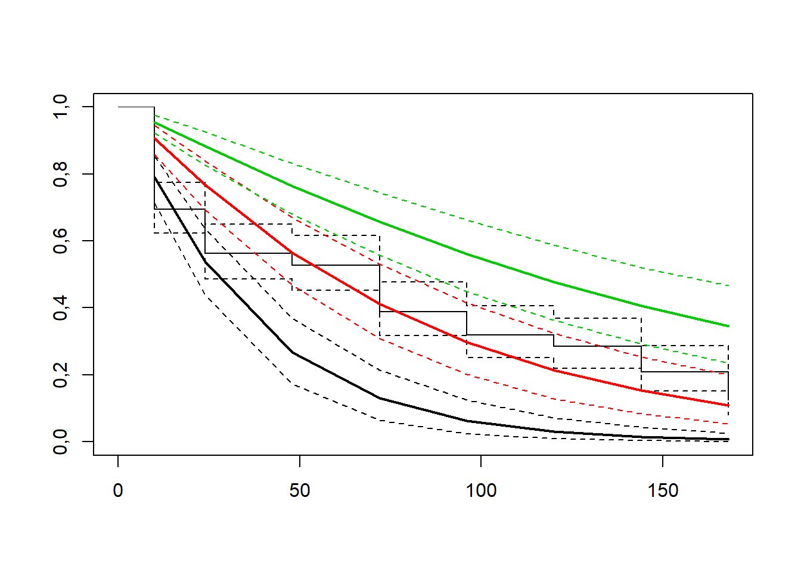

<br><br>

****

## Método semi-paramétrico de Cox

****

Serve para um modelo de regressão de riscos proporcionais de Cox. Variáveis dependentes do tempo, estratos dependentes do tempo, vários eventos por assunto e outras extensões são incorporadas usando a formulação do processo de contagem de Andersen e Gill.

**Reference**: Andersen, P. and Gill, R. (1982). Cox's regression model for counting processes, a large sample study. Annals of Statistics 10, 1100-1120.

### Sem considerar tratamentos


```r
KM <- coxph(Surv(tempo,status) ~ 1)
summary(KM)
```

```
## Call:  coxph(formula = Surv(tempo, status) ~ 1)
## 
## Null model
##   log likelihood= -538,6621 
##   n= 144
```

### Considerando tratamentos


```r
KM8 <- coxph(Surv(tempo,status) ~ strata(trat),data=dados)
summary(KM8)
```

```
## Call:  coxph(formula = Surv(tempo, status) ~ strata(trat), data = dados)
## 
## Null model
##   log likelihood= -394,6821 
##   n= 144
```

```r
library(ggfortify)
autoplot(survfit(KM8),conf.int = F)+theme_classic()
```


<br><br>

****

## Modelo de riscos proporcionais de COX

****

<br><br>

Mostra as taxas de risco (HR) derivadas do modelo para todas as covariáveis incluídas na fórmula coxph. Resumidamente, uma FC> 1 indica um risco aumentado de morte (de acordo com a definição de h(t)) se uma condição específica for atendida por um paciente. Uma FC <1, por outro lado, indica uma diminuição do risco.

<br><br>

### Considerando trat


```r
library(forestmodel)
colnames(dados)=c("Treatments","tempo","status")
fit.coxph <- coxph(Surv(tempo, status) ~ Treatments, data = dados)
#ggforest(fit.coxph, data = dados)
print(forest_model(fit.coxph, limits=log( c(0.05, 5))))
```

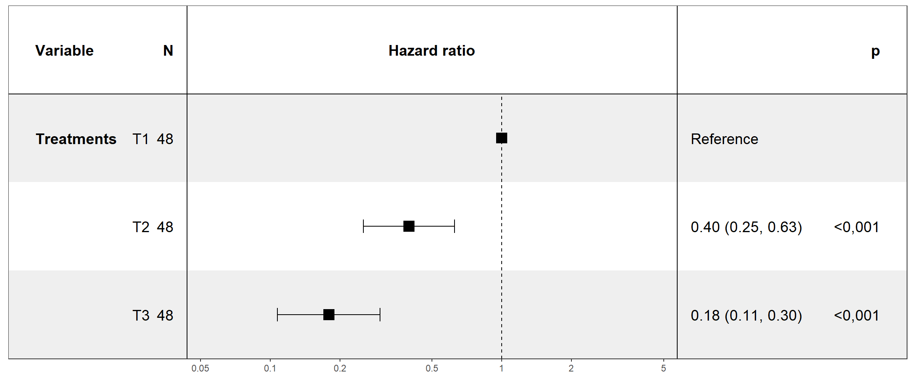

## Critério de inferência de Akaike


```r
library(car)
AIC(KM2) # exponencial
```

```
## [1] 1334,477
```

```r
AIC(KM3) # normal
```

```
## [1] 1433,069
```

```r
AIC(KM4) # logistico
```

```
## [1] 1436,639
```

```r
AIC(KM5) # lognormal
```

```
## [1] 1338,744
```

```r
AIC(KM6) # loglogistic
```

```
## [1] 1346,328
```

```r
AIC(KM7) # weibull
```

```
## [1] 1334,844
```

```r
AIC(KM8) # coxph
```

```
## [1] 789,3642
```

```r
AIC(KM9) # Gompertz
```

```
## [1] 1331,275
```

## Resíduo


```r
residuo2 <- residuals(KM2, type = "deviance")
g2=ggplot(data = dados, mapping = aes(x = tempo, y = residuo2)) +
    geom_point() + labs(title="Exponential")+
    geom_smooth() +
    theme_bw() + theme(legend.key = element_blank())
residuo3 <- residuals(KM3, type = "deviance")
g3=ggplot(data = dados, mapping = aes(x = tempo, y = residuo3)) +
    geom_point() + labs(title="Normal")+
    geom_smooth() +
    theme_bw() + theme(legend.key = element_blank())
residuo4 <- residuals(KM4, type = "deviance")
g4=ggplot(data = dados, mapping = aes(x = tempo, y = residuo4)) +
    geom_point() + labs(title="Logístico")+
    geom_smooth() +
    theme_bw() + theme(legend.key = element_blank())
residuo5 <- residuals(KM5, type = "deviance")
g5=ggplot(data = dados, mapping = aes(x = tempo, y = residuo5)) +
    geom_point() + labs(title="lognormal")+
    geom_smooth() +
    theme_bw() + theme(legend.key = element_blank())
residuo6 <- residuals(KM6, type = "deviance")
g6=ggplot(data = dados, mapping = aes(x = tempo, y = residuo6)) +
    geom_point() + labs(title="loglogistico")+
    geom_smooth() +
    theme_bw() + theme(legend.key = element_blank())
residuo7 <- residuals(KM7, type = "deviance")
g7=ggplot(data = dados, mapping = aes(x = tempo, y = residuo7)) +
    geom_point() + labs(title="weibull")+
    geom_smooth() +
    theme_bw() + theme(legend.key = element_blank())
residuo8 <- residuals(KM8, type = "deviance")
g8=ggplot(data = dados, mapping = aes(x = tempo, y = residuo8)) +
    geom_point() + labs(title="coxph")+
    geom_smooth() +
    theme_bw() + theme(legend.key = element_blank())
library(gridExtra)
grid.arrange(g2,g3,g4,g5,g6,g7,g8,ncol=4)
```


<br><br><br><br><br><br>

# Modelo linear generalizado

## Conjunto de dados

Considera um conjunto de dados simulados de germinação com oito repetições e quatro tratamento qualitativos. Conforme a regra de análise de sementes, em um teste de germinação é estabelecido a quantidade mínima de 50 sementes por rolo de papel. Logo, sabemos que a quantidade máxima de cada repetição e de 50 sementes.


```r
trat=rep(paste("T",1:4),e=8)
germ=c(33,35,34,30,38,30,37,30,36,38,34,38,38,38,35,35,30,15,31,17,25,24,24,18,27,20,28,35,30,30,30,29)
```

## Modelo linear generalizado

No R, podemos realizar a entrada dos dados de duas formas. Pela proporção ou por dados dicotomizados (Respostas do tipo 0 ou 1).

Nosso exemplo usaremos pela proporção.


```r
modelo=glm(cbind(germ,50-germ)~trat, family=binomial)
```

**Explicação**: `germ` é nossa resposta, ou seja, total de sementes germinadas (ou podemos chamar de total de sucessos na repetição). O valor `50` indica o total de observações na repetição (Deve ser conhecido). `trat` é nossa variável explicativa qualitativa, `binomial` é a distrbuição provável que estamos considerando.

## Análise de deviance


```r
summary(modelo)
```

```
## 
## Call:
## glm(formula = cbind(germ, 50 - germ) ~ trat, family = binomial)
## 
## Deviance Residuals: 
##     Min       1Q   Median       3Q      Max  
## -2,4488  -0,5500   0,2359   0,4838   2,2701  
## 
## Coefficients:
##             Estimate Std. Error z value Pr(>|z|)    
## (Intercept)   0,6969     0,1061   6,566 5,16e-11 ***
## tratT 2       0,2977     0,1548   1,924  0,05437 .  
## tratT 3      -0,8572     0,1460  -5,870 4,36e-09 ***
## tratT 4      -0,4048     0,1466  -2,762  0,00574 ** 
## ---
## Signif. codes:  0 '***' 0,001 '**' 0,01 '*' 0,05 '.' 0,1 ' ' 1
## 
## (Dispersion parameter for binomial family taken to be 1)
## 
##     Null deviance: 108,818  on 31  degrees of freedom
## Residual deviance:  38,676  on 28  degrees of freedom
## AIC: 182,75
## 
## Number of Fisher Scoring iterations: 3
```

```r
anova(modelo, test="Chisq")
```

```
## Analysis of Deviance Table
## 
## Model: binomial, link: logit
## 
## Response: cbind(germ, 50 - germ)
## 
## Terms added sequentially (first to last)
## 
## 
##      Df Deviance Resid. Df Resid. Dev  Pr(>Chi)    
## NULL                    31    108,818              
## trat  3   70,142        28     38,676 3,979e-15 ***
## ---
## Signif. codes:  0 '***' 0,001 '**' 0,01 '*' 0,05 '.' 0,1 ' ' 1
```

## Diagnóstico


```r
par(mfrow=c(2,2))
plot(modelo)
```

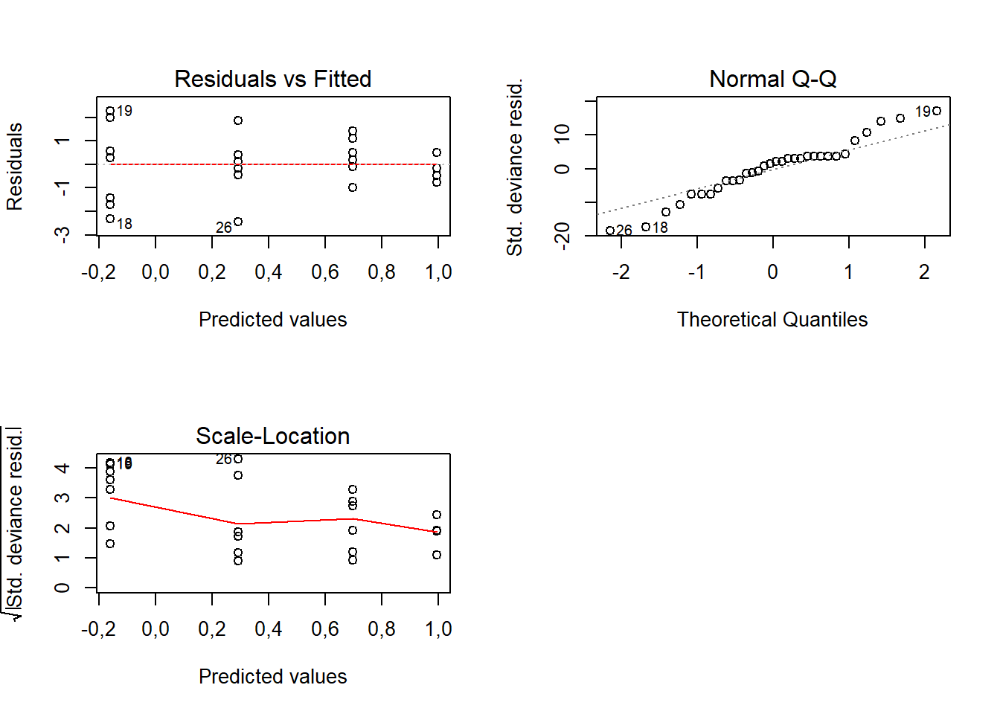

## Halfnormaplot


```r
hnp::hnp(modelo, print.on=T)
```

```
## Binomial model
```


## Constrastes


```r
library(emmeans)
media=emmeans(modelo,~trat)
```

## Retornando a função logistica


```r
medfin=regrid(media)
library(multcompView)
library(multcomp)
cld(medfin, alpha=0.05, Letters=letters, decreasing=FALSE, adjust="tukey")
```

```
##  trat  prob     SE  df asymp.LCL asymp.UCL .group
##  T 3  0,460 0,0249 Inf     0,398     0,522  a    
##  T 4  0,573 0,0247 Inf     0,511     0,634   b   
##  T 1  0,667 0,0236 Inf     0,609     0,726    c  
##  T 2  0,730 0,0222 Inf     0,675     0,785    c  
## 
## Confidence level used: 0,95 
## Conf-level adjustment: sidak method for 4 estimates 
## P value adjustment: tukey method for comparing a family of 4 estimates 
## significance level used: alpha = 0,05
```

## Supondo que não sabemos o total de cada repetição

Nesse caso, vamos optar pela distribuição poisson


```r
modelo=glm(germ~trat, family=poisson)
```

## Análise de deviance


```r
summary(modelo)
```

```
## 
## Call:
## glm(formula = germ ~ trat, family = poisson)
## 
## Deviance Residuals: 
##     Min       1Q   Median       3Q      Max  
## -1,7823  -0,3347   0,1574   0,2550   1,5832  
## 
## Coefficients:
##             Estimate Std. Error z value Pr(>|z|)    
## (Intercept)  3,50781    0,06120  57,318  < 2e-16 ***
## tratT 2      0,08951    0,08468   1,057 0,290496    
## tratT 3     -0,37231    0,09581  -3,886 0,000102 ***
## tratT 4     -0,15353    0,09007  -1,705 0,088274 .  
## ---
## Signif. codes:  0 '***' 0,001 '**' 0,01 '*' 0,05 '.' 0,1 ' ' 1
## 
## (Dispersion parameter for poisson family taken to be 1)
## 
##     Null deviance: 46,061  on 31  degrees of freedom
## Residual deviance: 18,017  on 28  degrees of freedom
## AIC: 193,41
## 
## Number of Fisher Scoring iterations: 4
```

```r
anova(modelo, test="Chisq")
```

```
## Analysis of Deviance Table
## 
## Model: poisson, link: log
## 
## Response: germ
## 
## Terms added sequentially (first to last)
## 
## 
##      Df Deviance Resid. Df Resid. Dev  Pr(>Chi)    
## NULL                    31     46,061              
## trat  3   28,045        28     18,017 3,555e-06 ***
## ---
## Signif. codes:  0 '***' 0,001 '**' 0,01 '*' 0,05 '.' 0,1 ' ' 1
```

## Diagnóstico


```r
par(mfrow=c(2,2))
plot(modelo)
```

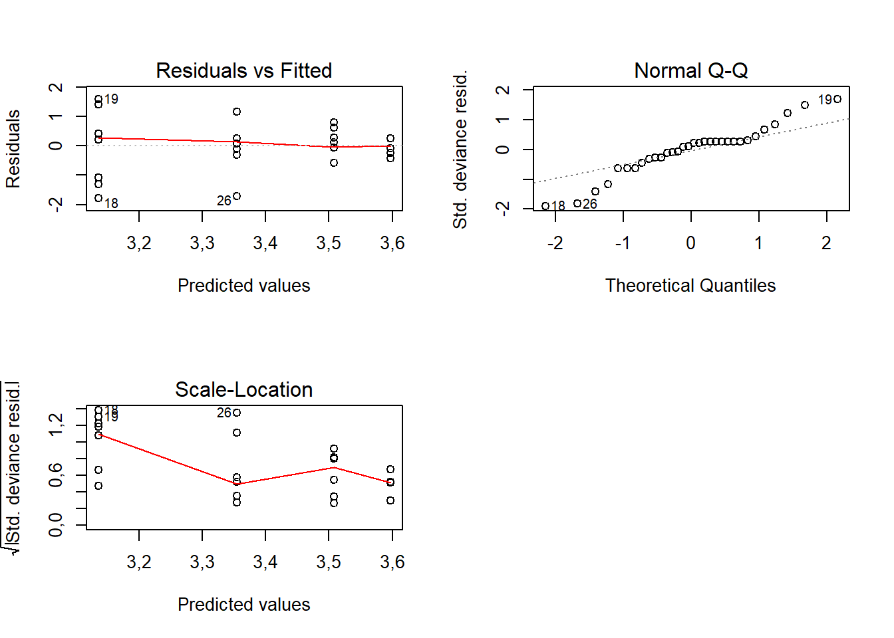

## Halfnormaplot


```r
hnp::hnp(modelo, print.on=T)
```

```
## Poisson model
```

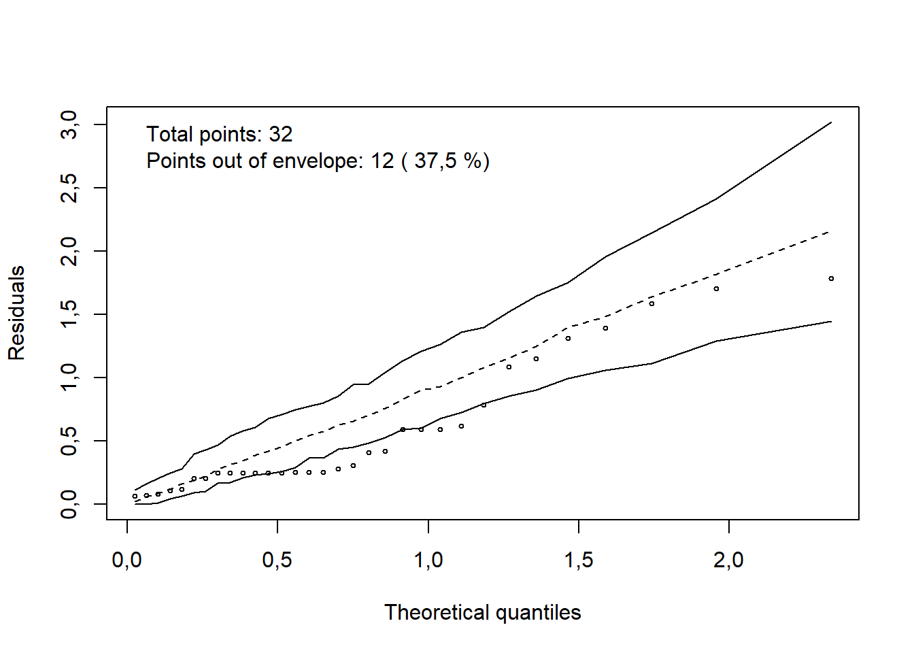

## Constrastes


```r
library(emmeans)
media=emmeans(modelo,~trat)
```

## Retornando a função logistica


```r
medfin=regrid(media)
library(multcompView)
library(multcomp)
cld(medfin, alpha=0.05, Letters=letters, decreasing=FALSE, adjust="tukey")
```

```
##  trat rate   SE  df asymp.LCL asymp.UCL .group
##  T 3  23,0 1,70 Inf      18,8      27,2  a    
##  T 4  28,6 1,89 Inf      23,9      33,3  ab   
##  T 1  33,4 2,04 Inf      28,3      38,5   bc  
##  T 2  36,5 2,14 Inf      31,2      41,8    c  
## 
## Confidence level used: 0,95 
## Conf-level adjustment: sidak method for 4 estimates 
## P value adjustment: tukey method for comparing a family of 4 estimates 
## significance level used: alpha = 0,05
```

## Analisando sobredispersão


```r
library(AER)
dispersiontest(modelo, trafo=1) 
```

```
## 
## 	Overdispersion test
## 
## data:  modelo
## z = -2,8129, p-value = 0,9975
## alternative hypothesis: true alpha is greater than 0
## sample estimates:
##      alpha 
## -0,4488216
```

```r
## se for menor que 0,01 há sbredispersão, nesse caso usar quasipoisson
```

Caso fosse menor que 0,01 ou 0,05, podemos testar a distribuição quasipoisson. 
Vamos treinar, ainda que não seja necessário.


```r
modelo=glm(germ~trat, family=quasipoisson)
```

## Análise de deviance


```r
summary(modelo)
```

```
## 
## Call:
## glm(formula = germ ~ trat, family = quasipoisson)
## 
## Deviance Residuals: 
##     Min       1Q   Median       3Q      Max  
## -1,7823  -0,3347   0,1574   0,2550   1,5832  
## 
## Coefficients:
##             Estimate Std. Error t value Pr(>|t|)    
## (Intercept)  3,50781    0,04857  72,219  < 2e-16 ***
## tratT 2      0,08951    0,06720   1,332   0,1937    
## tratT 3     -0,37231    0,07604  -4,896 3,69e-05 ***
## tratT 4     -0,15353    0,07148  -2,148   0,0405 *  
## ---
## Signif. codes:  0 '***' 0,001 '**' 0,01 '*' 0,05 '.' 0,1 ' ' 1
## 
## (Dispersion parameter for quasipoisson family taken to be 0,6299182)
## 
##     Null deviance: 46,061  on 31  degrees of freedom
## Residual deviance: 18,017  on 28  degrees of freedom
## AIC: NA
## 
## Number of Fisher Scoring iterations: 4
```

```r
anova(modelo, test="Chisq")
```

```
## Analysis of Deviance Table
## 
## Model: quasipoisson, link: log
## 
## Response: germ
## 
## Terms added sequentially (first to last)
## 
## 
##      Df Deviance Resid. Df Resid. Dev Pr(>Chi)    
## NULL                    31     46,061             
## trat  3   28,045        28     18,017 1,17e-09 ***
## ---
## Signif. codes:  0 '***' 0,001 '**' 0,01 '*' 0,05 '.' 0,1 ' ' 1
```

## Diagnóstico


```r
par(mfrow=c(2,2))
plot(modelo)
```


## Halfnormaplot


```r
hnp::hnp(modelo, print.on=T)
```

```
## Quasi-Poisson model
```

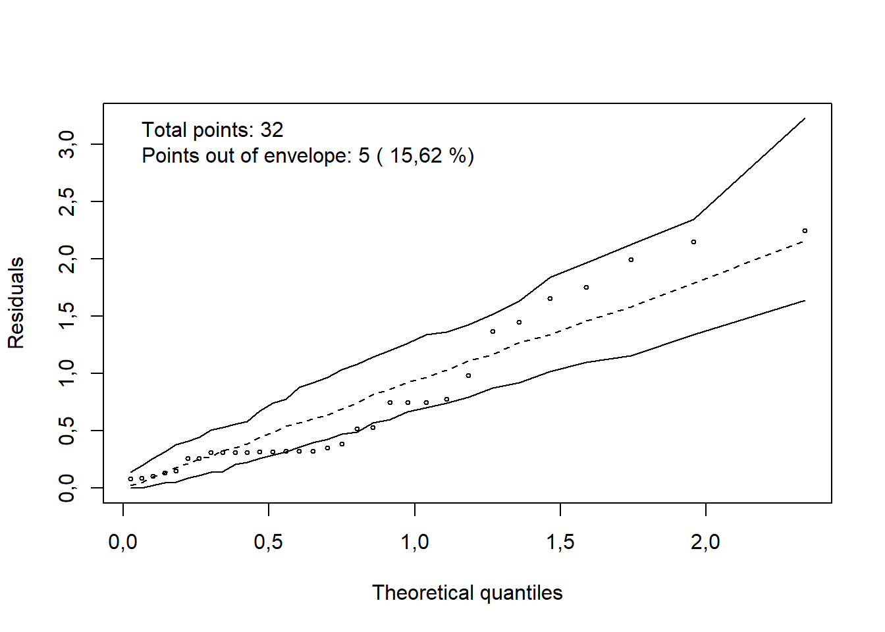

## Constrastes


```r
library(emmeans)
media=emmeans(modelo,~trat)
```

## Retornando a função logistica


```r
medfin=regrid(media)
library(multcompView)
library(multcomp)
cld(medfin, alpha=0.05, Letters=letters, decreasing=FALSE, adjust="tukey")
```

```
##  trat rate   SE  df asymp.LCL asymp.UCL .group
##  T 3  23,0 1,35 Inf      19,6      26,4  a    
##  T 4  28,6 1,50 Inf      24,9      32,4   b   
##  T 1  33,4 1,62 Inf      29,3      37,4   bc  
##  T 2  36,5 1,70 Inf      32,3      40,7    c  
## 
## Confidence level used: 0,95 
## Conf-level adjustment: sidak method for 4 estimates 
## P value adjustment: tukey method for comparing a family of 4 estimates 
## significance level used: alpha = 0,05
```

## Distribuição quasibinomial


```r
quasibin<-glm(cbind(germ,50-germ)~trat, family = quasibinomial)
```

## Análise de deviance


```r
summary(modelo)
```

```
## 
## Call:
## glm(formula = germ ~ trat, family = quasipoisson)
## 
## Deviance Residuals: 
##     Min       1Q   Median       3Q      Max  
## -1,7823  -0,3347   0,1574   0,2550   1,5832  
## 
## Coefficients:
##             Estimate Std. Error t value Pr(>|t|)    
## (Intercept)  3,50781    0,04857  72,219  < 2e-16 ***
## tratT 2      0,08951    0,06720   1,332   0,1937    
## tratT 3     -0,37231    0,07604  -4,896 3,69e-05 ***
## tratT 4     -0,15353    0,07148  -2,148   0,0405 *  
## ---
## Signif. codes:  0 '***' 0,001 '**' 0,01 '*' 0,05 '.' 0,1 ' ' 1
## 
## (Dispersion parameter for quasipoisson family taken to be 0,6299182)
## 
##     Null deviance: 46,061  on 31  degrees of freedom
## Residual deviance: 18,017  on 28  degrees of freedom
## AIC: NA
## 
## Number of Fisher Scoring iterations: 4
```

```r
anova(modelo, test="Chisq")
```

```
## Analysis of Deviance Table
## 
## Model: quasipoisson, link: log
## 
## Response: germ
## 
## Terms added sequentially (first to last)
## 
## 
##      Df Deviance Resid. Df Resid. Dev Pr(>Chi)    
## NULL                    31     46,061             
## trat  3   28,045        28     18,017 1,17e-09 ***
## ---
## Signif. codes:  0 '***' 0,001 '**' 0,01 '*' 0,05 '.' 0,1 ' ' 1
```

## Diagnóstico


```r
par(mfrow=c(2,2))
plot(modelo)
```


## Halfnormaplot


```r
hnp::hnp(modelo, print.on=T)
```

```
## Quasi-Poisson model
```

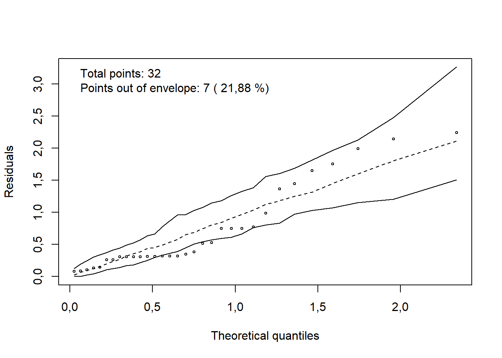

## Constrastes


```r
library(emmeans)
media=emmeans(modelo,~trat)
summary(pairs(media), type = "response")
```

```
##  contrast  ratio     SE  df z.ratio p.value
##  T 1 / T 2 0,914 0,0615 Inf -1,332  0,5425 
##  T 1 / T 3 1,451 0,1103 Inf  4,896  0,0000 
##  T 1 / T 4 1,166 0,0833 Inf  2,148  0,1382 
##  T 2 / T 3 1,587 0,1186 Inf  6,182  0,0000 
##  T 2 / T 4 1,275 0,0893 Inf  3,469  0,0029 
##  T 3 / T 4 0,803 0,0631 Inf -2,784  0,0275 
## 
## P value adjustment: tukey method for comparing a family of 4 estimates 
## Tests are performed on the log scale
```

## Retornando a função logistica


```r
medfin=regrid(media)
library(multcompView)
library(multcomp)
cld(medfin, alpha=0.05, Letters=letters, decreasing=FALSE, adjust="tukey")
```

```
##  trat rate   SE  df asymp.LCL asymp.UCL .group
##  T 3  23,0 1,35 Inf      19,6      26,4  a    
##  T 4  28,6 1,50 Inf      24,9      32,4   b   
##  T 1  33,4 1,62 Inf      29,3      37,4   bc  
##  T 2  36,5 1,70 Inf      32,3      40,7    c  
## 
## Confidence level used: 0,95 
## Conf-level adjustment: sidak method for 4 estimates 
## P value adjustment: tukey method for comparing a family of 4 estimates 
## significance level used: alpha = 0,05
```

## Fatorial qualitativo e quantitativo

Supondo um outro exemplo de um experimento em esquema fatorial 2 x 5, em que o primeiro fator e qualitativo e o segundo fator quantitativo com 5 doses (2, 4, 6, 8, 10) e três repetições cada. Total de semenetes e conhecido e o valor e 30.


```r
resp=c(0,0,0,3,3,2,6,6,5,17,18,14,25,26,23,
       0,1,0,1,1,2,15,14,15,15,16,16,20,20,19)
f1=rep(c("T1","T2"),e=15) ## fator qualitativo
d=rep(c(2,4,6,8,10),e=3,2) ## dose como numerico
D=factor(d) ## considerando dose como fator
```

## Modelo

Vamos considerar os dois fatores como qualitativos


```r
bin=glm(cbind(resp,30-resp)~f1*D, family = binomial)
```

## Deviance


```r
summary(bin)
```

```
## 
## Call:
## glm(formula = cbind(resp, 30 - resp) ~ f1 * D, family = binomial)
## 
## Deviance Residuals: 
##     Min       1Q   Median       3Q      Max  
## -0,8532  -0,2951   0,1217   0,1590   0,9375  
## 
## Coefficients:
##             Estimate Std. Error z value Pr(>|z|)
## (Intercept)   -23,14    6757,51  -0,003    0,997
## f1T2           18,65    6757,51   0,003    0,998
## D4             20,81    6757,51   0,003    0,998
## D6             21,68    6757,51   0,003    0,997
## D8             23,31    6757,51   0,003    0,997
## D10            24,67    6757,51   0,004    0,997
## f1T2:D4       -19,39    6757,51  -0,003    0,998
## f1T2:D6       -17,24    6757,51  -0,003    0,998
## f1T2:D8       -18,74    6757,51  -0,003    0,998
## f1T2:D10      -19,54    6757,51  -0,003    0,998
## 
## (Dispersion parameter for binomial family taken to be 1)
## 
##     Null deviance: 397,0255  on 29  degrees of freedom
## Residual deviance:   5,6398  on 20  degrees of freedom
## AIC: 108,6
## 
## Number of Fisher Scoring iterations: 19
```

```r
anova(bin, test="Chisq")
```

```
## Analysis of Deviance Table
## 
## Model: binomial, link: logit
## 
## Response: cbind(resp, 30 - resp)
## 
## Terms added sequentially (first to last)
## 
## 
##      Df Deviance Resid. Df Resid. Dev  Pr(>Chi)    
## NULL                    29     397,03              
## f1    1     0,24        28     396,78    0,6215    
## D     4   363,46        24      33,33 < 2,2e-16 ***
## f1:D  4    27,69        20       5,64 1,443e-05 ***
## ---
## Signif. codes:  0 '***' 0,001 '**' 0,01 '*' 0,05 '.' 0,1 ' ' 1
```

```r
referencia <- ref_grid(bin)
referencia ## Aqui deve aparecer os niveis dos fatores, se dose so aparecer 1, está errado
```

```
## 'emmGrid' object with variables:
##     f1 = T1, T2
##     D = 2, 4, 6, 8, 10
## Transformation: "logit"
```

## Teste de comparação 

Se não fosse um fator quantitativo, podemos fazer assim:


```r
media <- emmeans(bin, ~f1|D)
medfin<-regrid(media)
cld(medfin, alpha=0.05, Letters=letters, adjust="tukey")
```

```
## D = 2:
##  f1   prob       SE  df asymp.LCL asymp.UCL .group
##  T1 0,0000 6,00e-07 Inf -1,40e-06  1,40e-06  a    
##  T2 0,0111 1,10e-02 Inf -1,36e-02  3,58e-02  a    
## 
## D = 4:
##  f1   prob       SE  df asymp.LCL asymp.UCL .group
##  T2 0,0444 2,17e-02 Inf -4,14e-03  9,30e-02  a    
##  T1 0,0889 3,00e-02 Inf  2,18e-02  1,56e-01  a    
## 
## D = 6:
##  f1   prob       SE  df asymp.LCL asymp.UCL .group
##  T1 0,1889 4,13e-02 Inf  9,66e-02  2,81e-01  a    
##  T2 0,4889 5,27e-02 Inf  3,71e-01  6,07e-01   b   
## 
## D = 8:
##  f1   prob       SE  df asymp.LCL asymp.UCL .group
##  T2 0,5222 5,27e-02 Inf  4,04e-01  6,40e-01  a    
##  T1 0,5444 5,25e-02 Inf  4,27e-01  6,62e-01  a    
## 
## D = 10:
##  f1   prob       SE  df asymp.LCL asymp.UCL .group
##  T2 0,6556 5,01e-02 Inf  5,44e-01  7,68e-01  a    
##  T1 0,8222 4,03e-02 Inf  7,32e-01  9,12e-01   b   
## 
## Confidence level used: 0,95 
## Conf-level adjustment: sidak method for 2 estimates 
## significance level used: alpha = 0,05
```

```r
media <- emmeans(bin, ~D|f1)
medfin<-regrid(media)
cld(medfin, alpha=0.05, Letters=letters, adjust="tukey")
```

```
## f1 = T1:
##  D    prob       SE  df asymp.LCL asymp.UCL .group
##  2  0,0000 6,00e-07 Inf -1,60e-06  1,60e-06  a    
##  4  0,0889 3,00e-02 Inf  1,18e-02  1,66e-01   b   
##  6  0,1889 4,13e-02 Inf  8,29e-02  2,95e-01   b   
##  8  0,5444 5,25e-02 Inf  4,10e-01  6,79e-01    c  
##  10 0,8222 4,03e-02 Inf  7,19e-01  9,26e-01     d 
## 
## f1 = T2:
##  D    prob       SE  df asymp.LCL asymp.UCL .group
##  2  0,0111 1,10e-02 Inf -1,73e-02  3,95e-02  a    
##  4  0,0444 2,17e-02 Inf -1,14e-02  1,00e-01  a    
##  6  0,4889 5,27e-02 Inf  3,54e-01  6,24e-01   b   
##  8  0,5222 5,27e-02 Inf  3,87e-01  6,57e-01   b   
##  10 0,6556 5,01e-02 Inf  5,27e-01  7,84e-01   b   
## 
## Confidence level used: 0,95 
## Conf-level adjustment: sidak method for 5 estimates 
## P value adjustment: tukey method for comparing a family of 5 estimates 
## significance level used: alpha = 0,05
```

## Regressão

Como há interação entre os fatores, necessitamos construir duas curvas, vejamos: 

## Dividindo o conjunto de dados


```r
resp1=resp[1:15]  ## resposta de T1, nesse caso as observações de T1 estão na posição de  1 a 15
resp2=resp[16:30] ## resposta de T2, nesse caso as observações de T2 estão na posição de  16 a 30
d=d[1:15] ## cortando dose, nesse caso somente uma vez é necessário
```

## modelo para T1


```r
bin1=glm(cbind(resp1,30-resp1)~d, family = binomial)
summary(bin1)
```

```
## 
## Call:
## glm(formula = cbind(resp1, 30 - resp1) ~ d, family = binomial)
## 
## Deviance Residuals: 
##     Min       1Q   Median       3Q      Max  
## -0,9384  -0,7855  -0,1458   0,4803   0,8687  
## 
## Coefficients:
##             Estimate Std. Error z value Pr(>|z|)    
## (Intercept) -5,66100    0,51900  -10,91   <2e-16 ***
## d            0,72347    0,06751   10,72   <2e-16 ***
## ---
## Signif. codes:  0 '***' 0,001 '**' 0,01 '*' 0,05 '.' 0,1 ' ' 1
## 
## (Dispersion parameter for binomial family taken to be 1)
## 
##     Null deviance: 223,1818  on 14  degrees of freedom
## Residual deviance:   6,8923  on 13  degrees of freedom
## AIC: 50,895
## 
## Number of Fisher Scoring iterations: 4
```

## modelo para T2


```r
bin2=glm(cbind(resp2,30-resp2)~d, family = binomial)
summary(bin2)
```

```
## 
## Call:
## glm(formula = cbind(resp2, 30 - resp2) ~ d, family = binomial)
## 
## Deviance Residuals: 
##     Min       1Q   Median       3Q      Max  
## -1,8205  -1,5467  -0,9111   0,1884   2,4892  
## 
## Coefficients:
##             Estimate Std. Error z value Pr(>|z|)    
## (Intercept) -3,89248    0,37250 -10,449   <2e-16 ***
## d            0,49464    0,05016   9,862   <2e-16 ***
## ---
## Signif. codes:  0 '***' 0,001 '**' 0,01 '*' 0,05 '.' 0,1 ' ' 1
## 
## (Dispersion parameter for binomial family taken to be 1)
## 
##     Null deviance: 173,600  on 14  degrees of freedom
## Residual deviance:  34,827  on 13  degrees of freedom
## AIC: 81,781
## 
## Number of Fisher Scoring iterations: 5
```

## Gráfico

### Calculando vetores


```r
med1=tapply(resp1/30, d, mean)
med2=tapply(resp2/30, d, mean)
DOSE=c(2,4,6,8,10)
```

### Gráfico final


```r
plot(med1~DOSE,xlab="Dose(mg/L)",ylab="Probabilidade")
points(med2~DOSE,pch=16,col="darkblue")
curve(predict(bin1,data.frame(d=x),type="resp"),add=TRUE) ## curva de T1
##points(d,fitted(bin1),pch=20) 
curve(predict(bin2,data.frame(d=x),type="resp"),add=TRUE, lty=2,col="darkblue") ## Curva de T2
```

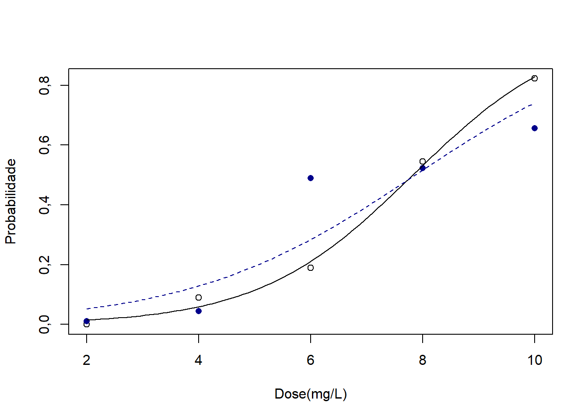
