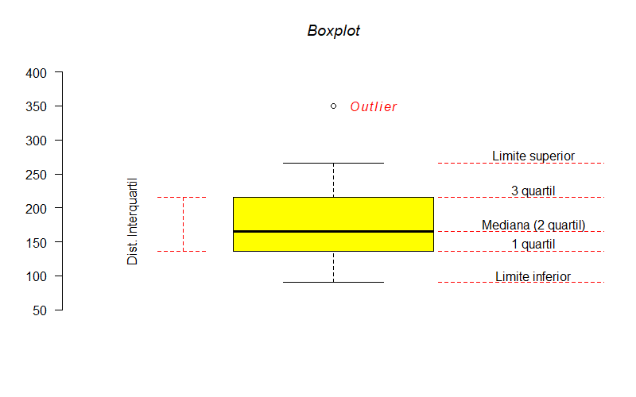

--- 
title: "Aplicações práticas do software R para Agronomia"
author: "Gabriel Danilo Shimizu"
date: "`r Sys.Date()`"
site: bookdown::bookdown_site
documentclass: book
bibliography: [book.bib, packages.bib]
biblio-style: apalike
link-citations: yes
description: "Este é um livro virtual desenvolvido com a finalidade de fornecer tutoriais práticos das principais análises estatísticas e apresentação de dados utilizando o software R"
---

```{r setup, include=FALSE}
knitr::opts_chunk$set(echo = TRUE, message = FALSE, warning = FALSE)
library(knitr)
options(OutDec = ".", knitr.kable.NA="")
```


# Gráficos em R

<br><br>

****

# Gráfico de Colunas 

****

O gráfico em colunas consiste em construir retângulos, em que uma das dimensões é proporcional à magnitude a ser representada ($n_i$ ou $f_i$), sendo a outra arbitrária, porém igual para todas as colunas. Essas colunas são dispostas paralelamente umas às outras de forma vertical.

<br>

Além do título e fonte de referências deve-se observar o seguinte:

- as colunas devem ter todas a mesma largura;
- a distância entre as colunas deve ser constante e de preferência menor que a largura das colunas.

<br><br>


## Conjunto de dados

<br>

```{r}
tratamentos=rep(c(paste("T",1:5)),e=4)
resposta=c(100,120,110,90,150,145,149,165,150,144,134,139,220,206,210,210,266,249,248,260)
## Média e Desvio-padrão (Por Tratamento)
media=tapply(resposta,tratamentos, mean)
desvio=tapply(resposta,tratamentos,sd)
```

<br>

```{r}
barplot(media)
```

<br>

## Adicionando melhorias

```{r}
barplot(media, 
        las=1,
        col="lightyellow",
        ylab="Resposta",
        xlab="Tratamentos",
        ylim=c(0,300))
abline(h=0)
```

**Comandos**:

las=1: deixar escala do eixo Y na vertical

col="cor": mudar cor das barras (Ex. "red","blue","green" ou gray.colors(quantidade de tonalidades) para escala cinza ou rainbow(quantidade de cores) para escala colorida. Também é possível específicar a cor de cada barra (col=c("red","green","yellow","gray","blue"))).

xlab e ylab: nomear eixo X e Y

xlim e ylim: escala do eixo X e Y

abline(h=0): linha na horizontal em Y=0 (No caso de vertical, abline(v=0)). É possível alterar a cor pela função "col="cor"" e o tracejado pelo "lty=número" (Ver o Help do comando)

<br>

## Barras de desvio-padrão

```{r}
bar=barplot(media, 
        las=1,
        col="lightyellow",
        ylab="Resposta",
        xlab="Tratamentos",
        ylim=c(0,300))
abline(h=0)
arrows(bar,media+desvio,bar,media-desvio,length = 0.1,angle=90,code=3)
```

<br>

## Unidade do eixo Y 

(Ex. $Kg\ ha^{-1}$)

```{r}
bar=barplot(media, 
        las=1,
        col="lightyellow",
        ylab=expression("Resposta"*" "*(kg*" "*ha^-1)),
        xlab="Tratamentos",
        ylim=c(0,300))
abline(h=0)
arrows(bar,media+desvio,bar,media-desvio,length = 0.1,angle=90,code=3)
```

<br>

## Média dos tratamentos

```{r}
bar=barplot(media, 
        las=1,
        col="lightyellow",
        ylab=expression("Resposta"*" "*(kg*" "*ha^-1)),
        xlab="Tratamentos",
        ylim=c(0,300))
abline(h=0)
text(bar,media+desvio+10,media)
arrows(bar,media+desvio,bar,media-desvio,length = 0.1,angle=90,code=3)

```

<br>

## Separação de casa decimal

```{r}
options(OutDec=",")
bar=barplot(media, 
        las=1,
        col="lightyellow",
        ylab=expression("Resposta"*" "*(kg*" "*ha^-1)),
        xlab="Tratamentos",
        ylim=c(0,300))
abline(h=0)
text(bar,media+desvio+10,media)
arrows(bar,media+desvio,bar,media-desvio,length = 0.1,angle=90,code=3)
```

```{r, echo=F,results='hide'}
options(OutDec = ".")
```

<br>

## Letras do teste de comparação

```{r}
tukey=c("d","c","c","b","a")
options(OutDec=",")
bar=barplot(media, 
        las=1,
        col="lightyellow",
        ylab=expression("Resposta"*" "*(kg*" "*ha^-1)),
        xlab="Tratamentos",
        ylim=c(0,300))
abline(h=0)
text(bar,media+desvio+10,paste(round(media,0),tukey))
arrows(bar,media+desvio,bar,media-desvio,length = 0.1,angle=90,code=3)
```

<br><br>

****

## Pacote Agricolae

****

<br>

### Conjunto de dados

```{r}
tratamentos=rep(c(paste("T",1:5)),e=4)
resposta=c(100,120,110,90,150,145,149,165,150,144,134,139,220,206,210,210,266,249,248,260)
```

<br>

### Modelo de Anova

```{r}
modelo=aov(resposta~tratamentos)
```

```{r}
library(agricolae)
a=HSD.test(modelo,"tratamentos", group = T)
```

<br>

### Gráfico com média 

```{r}
plot(a, las=1)
```

<br>

### Gráfico de barras

```{r}
bar.group(a$groups, col="lightblue",
          las=1, 
          ylim=c(0,300))
abline(h=0)
```

<br>

### Barras de desvio-padrão

```{r}
bar.err(a$means,
        variation="SD", col="lightblue",
        las=1,
        ylim=c(0,300))
abline(h=0)
```

<br>

### Barras de erro padrão

```{r}
bar.err(a$means,
        variation="SE", col="lightblue",
        las=1,
        ylim=c(0,300))
abline(h=0)
```

<br>

### Barras de máximo-mínimo

```{r}
bar.err(a$means,
        variation="range", col="lightblue",
        las=1,
        ylim=c(0,300))
abline(h=0)
```

<br>

### Barras da distância interquartil

```{r}
bar.err(a$means,
        variation="IQR", col="lightblue",
        las=1,
        ylim=c(0,300))
abline(h=0)
```

<br><br><br>

****

## Pacote ggplot2 e ggpubr

****

### Conjunto de dados

Vamos trabalhar com três experimentos em DIC com quatro tratamentos e três repetições cada. 

```{r}
exp1=c(10,12,13,18,19,16,5,6,5,25,26,28)
exp2=c(9,12,11,18,20,16,7,6,9,25,28,28)
exp3=c(9,12,13,18,22,15,3,6,4,25,30,28)  
Trat=rep(c(paste("T",1:4)),e=3)
dados=data.frame(Trat,exp1,exp2,exp3)
dados$Trat=as.factor(Trat)
```

Obs. Para facilitar, vamos realizar a análise direto pelo pacote ExpDes.pt (é necessário instalar o pacote)

<br>

### Análise de exp1

```{r}
ExpDes.pt::dic(Trat,exp1)
```

<br>

### Análise de exp2

```{r}
ExpDes.pt::dic(Trat,exp2)
```

<br>

### Análise de exp3

```{r}
ExpDes.pt::dic(Trat,exp3)
```

<br>

## Utilizando o *ggplot2*

```{r}
library(ggplot2)
library(gridExtra)
```

<br>

### Média e desvio-padrão

```{r}
media=tapply(exp1, Trat, mean)
desvio=tapply(exp1, Trat, sd)
## Construindo uma nova data.frame com a media e desvio
dados1=data.frame(Trat=rownames(media),media,desvio)
```

<br>

### Gráfico básico

```{r}
ggplot(dados1, 
       aes(x=Trat,y=media))+
  geom_col()
```

### Média no gráfico

```{r}
ggplot(dados1, 
       aes(x=Trat,y=media))+
  geom_col()+
  geom_text(label=round(media,1), vjust=-1) 
# Obs. Round é para arrendondar o valor, neste caso estamos pedindo até a primeira casa decimal
```

<br>

### Letras do teste de comparação

```{r}
ggplot(dados1, 
       aes(x=Trat,y=media))+
  geom_col()+
  geom_text(label=paste(round(media,1),c("c","b","d","a")), vjust=-1)
#Obs. a função paste serve para juntar palavras, nesse caso está juntando cada média com suas respectivas letras do teste de comparação de médias
```

<br>

### Escala do eixo Y

```{r}
ggplot(dados1, 
       aes(x=Trat,y=media))+
  geom_col()+
  geom_text(label=paste(round(media,1),c("c","b","d","a")), vjust=-1)+
  ylim(c(0,40))
```

<br>

### Cor das colunas

```{r}
ggplot(dados1, 
       aes(x=Trat,y=media))+
  geom_col(fill=c(1,2,3,4))+
  geom_text(label=paste(round(media,1),c("c","b","d","a")), vjust=-1)+
  ylim(c(0,40))
```

<br>

### Removendo cor de fundo

```{r}
ggplot(dados1, 
       aes(x=Trat,y=media))+
  geom_col(fill=c(1,2,3,4))+
  geom_text(label=paste(round(media,1),c("c","b","d","a")), vjust=-1)+
  ylim(c(0,40))+
  theme_bw()
```

<br>

### Removendo linhas de grade

```{r}
ggplot(dados1, 
       aes(x=Trat,y=media))+
  geom_col(fill=c(1,2,3,4))+
  geom_text(label=paste(round(media,1),c("c","b","d","a")), vjust=-1)+
  ylim(c(0,40))+
  theme_bw()+
  theme_classic()
```

<br>

### Nome dos eixos X e Y

**Obs**. A função `expression()` funciona nesses argumentos.

```{r}
ggplot(dados1, aes(x=Trat,y=media))+
  geom_col(fill=c(1,2,3,4))+
  geom_text(label=paste(round(media,1),c("c","b","d","a")), vjust=-1)+
  ylim(c(0,40))+
  theme_bw()+
  theme_classic()+
  ylab("Resposta")+
  xlab(" ")
```

<br>

### Cor do contorno das colunas

```{r}
ggplot(dados1, 
       aes(x=Trat,y=media))+
  geom_col(fill=c(1,2,3,4),col="black")+     # Modifiquei aqui
  geom_text(label=paste(round(media,1),c("c","b","d","a")), vjust=-1)+
  ylim(c(0,40))+
  theme_bw()+
  theme_classic()+
  ylab("Resposta")+
  xlab(" ")
```

<br>

### Barras de desvio-padrão

```{r}
ggplot(dados1, aes(x=Trat,y=media))+
  geom_col(fill=c(1,2,3,4),col="black")+
  geom_text(label=paste(round(media,1),c("c","b","d","a")), vjust=-2)+
  ylim(c(0,40))+
  theme_bw()+
  theme_classic()+
  ylab("Resposta")+
  xlab(" ")+
  geom_errorbar(aes(ymax=media+desvio,ymin=media-desvio), width=0.25) # Width é a largura da barra
```

<br>

### Juntando os gráficos

Obs. Vamos chamar todo o plot de cada uma das variáveis de `a,b,c`, respectivamente. 

<br>

### Variável exp1

```{r}
media=tapply(exp1, Trat, mean)
desvio=tapply(exp1, Trat, sd)
dados1=data.frame(Trat=rownames(media),media,desvio)
a=ggplot(dados1, aes(x=Trat,y=media))+
  geom_col(fill=c(1,2,3,4),col="black")+
  geom_text(label=paste(round(media,1),
                        c("c","b","d","a")), vjust=-3)+
  ylim(c(0,40))+theme_bw()+theme_classic()+ylab("Resposta")+xlab(" ")+
  geom_errorbar(aes(ymax=media+desvio,
                   ymin=media-desvio), width=0.25)
```

<br>

### Variável exp2

```{r}
media=tapply(exp2, Trat, mean)
desvio=tapply(exp2, Trat, sd)
dados2=data.frame(Trat=rownames(media),media,desvio)
b=ggplot(dados2, aes(x=Trat,y=media))+
  geom_col(fill=c(1,2,3,4),col="black")+
  geom_text(label=paste(round(media,1),
                        c("c","b","c","a")), vjust=-3)+
  ylim(c(0,40))+theme_bw()+theme_classic()+ylab("Resposta")+xlab(" ")+
  geom_errorbar(aes(ymax=media+desvio,
                   ymin=media-desvio), width=0.25)
```

<br>

### Variável exp3

```{r}
media=tapply(exp3, Trat, mean)
desvio=tapply(exp3, Trat, sd)
dados3=data.frame(Trat=rownames(media),media,desvio)
c=ggplot(dados3, aes(x=Trat,y=media))+
  geom_col(fill=c(1,2,3,4),col="black")+
  geom_text(label=paste(round(media,1),
                        c("c","b","d","a")), vjust=-4)+
  ylim(c(0,40))+theme_bw()+theme_classic()+ylab("Resposta")+xlab(" ")+
  geom_errorbar(aes(ymax=media+desvio,
                   ymin=media-desvio), width=0.25)
```

```{r, fig.width=10}
grid.arrange(a,b,c,ncol=3)
```

<br><br>

****

## Pacote ggpubr

****

**Obs.** Existem vários *packages* que utilizam o `ggplot2` e geram saídas similares, contudo, com argumentos dos comandos mais simples.

```{r}
exp1=c(10,12,13,18,19,16,5,6,5,25,26,28)
exp2=c(9,12,11,18,20,16,7,6,9,25,28,28)
exp3=c(9,12,13,18,22,15,3,6,4,25,30,28)  
Trat=rep(c(paste("T",1:4)),e=3)
dados=data.frame(Trat,exp1,exp2,exp3)
dados$Trat=as.factor(Trat)
```

```{r}
library(ggpubr)
library(gridExtra)
```

<br>

### Comando base 

```{r}
ggbarplot(dados, 
          x = "Trat", 
          y = "exp1",
          add="mean")
```

<br>

### Barras de desvio-padrão

```{r}
ggbarplot(dados, 
          x = "Trat", 
          y = "exp1",
          add = "mean_sd")
```

<br>

### Cor da coluna 

```{r}
ggbarplot(dados, 
          x = "Trat", 
          y = "exp1",
          add = "mean_sd", 
          fill = "Trat")
```

```{r}
ggbarplot(dados, 
          x = "Trat", 
          y = "exp1",
          add = "mean_sd", 
          fill = "Trat",
          palette = c(1,2,3,4))
```

<br>

### Letra do teste de comparação

```{r}
ggbarplot(dados, 
          x = "Trat", 
          y = "exp1",
          add = "mean_sd", 
          fill = "Trat",
          label = c("c","b","d","a"),
          lab.vjust=-2)
```

<br>

### Adicionando a média

```{r}
media=tapply(exp1,Trat,mean)
ggbarplot(dados, 
          x = "Trat", 
          y = "exp1",
          add = "mean_sd", 
          fill = "Trat",
          label = paste(round(media,1),c("c","b","c","a")),
          lab.vjust=-2)
```

<br>

### Escala do eixo Y

```{r}
ggbarplot(dados, 
          x = "Trat", 
          y = "exp1",
          add = "mean_sd", 
          fill = "Trat",
          label = paste(round(media,1),c("c","b","d","a")),
          lab.vjust=-2)+ylim(c(0,40))
```

<br>

### Removendo legenda

```{r}
ggbarplot(dados, 
          x = "Trat", 
          y = "exp1",
          add = "mean_sd", 
          fill = "Trat",
          label = paste(round(media,1),c("c","b","d","a")),
          lab.vjust=-2,
          legend="n")+ylim(c(0,40))
```

<br>

### Juntando os gráficos

<br>

### Variável exp1

```{r}
media=tapply(exp1,Trat,mean)
a=ggbarplot(dados, 
          x = "Trat", 
          y = "exp1",
          add = "mean_sd", 
          fill = "Trat",
          label = paste(round(media,1),c("c","b","d","a")),
          lab.vjust=-3,
          legend="n")+ylim(c(0,40))
```

<br>

### Variável exp2

```{r}
media=tapply(exp2,Trat,mean)
b=ggbarplot(dados, 
          x = "Trat", 
          y = "exp2",
          add = "mean_sd", 
          fill = "Trat",
          label = paste(round(media,1),c("c","b","d","a")),
          lab.vjust=-3,
          legend="n")+ylim(c(0,40))
```

<br>

### Variável exp3

```{r}
media=tapply(exp3,Trat,mean)
c=ggbarplot(dados, 
          x = "Trat", 
          y = "exp3",
          add = "mean_sd", 
          fill = "Trat",
          label = paste(round(media,1),c("c","b","d","a")),
          lab.vjust=-3,
          legend="n")+ylim(c(0,40))
```

```{r, fig.width=12}
grid.arrange(a,b,c,ncol=3)
```

<br>

**Como deixar apenas o gráfico a esquerda com a escala de Y?**

Existem casos em que uma mesma variável foi analisada em várias situações e dessa forma, geramos gráficos com a mesma unidade de medida. Nesse sentido, é frequente apresentar apenas uma escala de Y, geralmente o gráfico a esquerda. No pacote ggpubr, podemos efetuar da seguinte forma:

<br>

```{r}
media=tapply(exp1,Trat,mean)
a=ggbarplot(dados, 
          x = "Trat", 
          y = "exp1",
          add = "mean_sd", 
          fill = "Trat",
          ylab="Resposta",
          label = paste(round(media,1),c("c","b","d","a")),
          lab.vjust=-3,
          legend="n")+ylim(c(0,40))
```

<br>

```{r}
media=tapply(exp2,Trat,mean)
b=ggbarplot(dados, 
          x = "Trat", 
          y = "exp2",
          add = "mean_sd", 
          fill = "Trat",
          label = paste(round(media,1),c("c","b","c","a")),
          lab.vjust=-3,
          legend="n",
          yscale="n")+
  ylim(c(0,40))+
  theme(axis.text.y=element_blank())+ # Comando para remover os números da escala de Y
  ylab("") # Remover nome do eixo Y 
```

<br>

```{r}
media=tapply(exp3,Trat,mean)
c=ggbarplot(dados, 
          x = "Trat", 
          y = "exp3",
          add = "mean_sd", 
          fill = "Trat",
          label = paste(round(media,1),c("c","b","d","a")),
          lab.vjust=-4,
          legend="n")+
  ylim(c(0,40))+
  theme(axis.text.y=element_blank())+
  ylab("")
```

```{r, fig.width=12}
grid.arrange(a,b,c,ncol=3)
```

<br><br><br>

****

## Duas variáveis categóricas

****

<br>

### Conjunto de dados

```{r}
Fator1=factor(rep(c(paste("F",1:2)),e=20))
Fator2=factor(c(rep(c(paste("T",1:5)),e=4),rep(c(paste("T",1:5)),e=4)))
resposta=c(100,120,110,90,150,145,149,165,250,244,220,239,220,206,210,210,266,249,248,260,110,130,120,100,160,165,169,175,160,154,144,149,230,216,220,220,276,259,258,270)
dados=data.frame(Fator1,Fator2,resposta)
## Média e Desvio-padrão (Por Tratamento)
media=with(dados, tapply(dados$resposta,list(Fator1, Fator2), mean))
desvio=with(dados, tapply(resposta,list(Fator1, Fator2), sd))
```

<br>

### Gráfico simples

```{r}
barplot(media, beside = T)
```

O argumento beside=T é refente a um gráfico de barras em que as barras são posicionadas lado a lado. Do contrário, as barras serão empilhadas (*stacked*). 

<br>

### Melhorias

```{r}
barplot(media, beside = T,
        las=1, col=c("lawngreen","gold"),
        ylab="Resposta",
        xlab="Fator2",
        ylim=c(0,300))
abline(h=0)
```

**Comandos**:

**las=1**: deixar escala do eixo Y na vertical

**col="cor"**: mudar cor das barras (Ex. "red","blue","green" ou gray.colors(quantidade de tonalidades) para escala cinza ou rainbow(quantidade de cores) para escala colorida. Também é possível específicar a cor de cada barra (col=c("red","green","yellow","gray","blue"))).

**xlab** e **ylab**: nomear eixo X e Y

**xlim** e **ylim**: escala do eixo X e Y

**abline(h=0)**: linha na horizontal em Y=0 (No caso de vertical, abline(v=0)). É possível alterar a cor pela função "col="cor"" e o tracejado pelo "lty=número" (Ver o Help do comando)

<br>

### Cores

```{r}
barplot(1:21, col=c("red","white","black","lightyellow","green","blue","orange",
                        "yellow","gray","pink","brown","Gainsboro", "Lavender", 
                        "DeepSkyBlue","LawnGreen", "Gold","MediumOrchid",
                        "LightSalmon", "Sienna", "Tomato", "DeepPink1"))
```

<br>

### Barras de desvio-padrão

```{r}
bar=barplot(media,beside=T, 
        las=1,
        ylab="Resposta",
        xlab="Tratamentos",
        ylim=c(0,300))
abline(h=0)
arrows(bar,media+desvio,bar,media-desvio,length = 0.1,angle=90,code=3)
```

<br>

### Unidade do eixo Y 

(Ex. $Kg\ ha^{-1}$)

```{r}
bar=barplot(media, beside=T,
        las=1,
        ylab=expression("Resposta"*" "*(kg*" "*ha^-1)),
        xlab="Tratamentos",
        ylim=c(0,300))
abline(h=0)
arrows(bar,media+desvio,bar,media-desvio,length = 0.1,angle=90,code=3)
```

<br>

### Média acima das barras

```{r}
bar=barplot(media, beside=T,
        las=1,
        ylab=expression("Resposta"*" "*(kg*" "*ha^-1)),
        xlab="Tratamentos",
        ylim=c(0,300))
abline(h=0)
text(bar,media+desvio+10,media, cex=0.8)
arrows(bar,media+desvio,bar,media-desvio,length = 0.1,angle=90,code=3)
```

<br>

### Separação de casa decimal

```{r}
options(OutDec=",")
bar=barplot(media, beside=T,
        las=1,
        ylab=expression("Resposta"*" "*(kg*" "*ha^-1)),
        xlab="Tratamentos",
        ylim=c(0,300))
abline(h=0)
text(bar,media+desvio+10,media, cex=0.8)
arrows(bar,media+desvio,bar,media-desvio,length = 0.1,angle=90,code=3)
```

<br>

### Letras do teste de comparação

```{r}
tukey=c("dB","dA","cB","cA","cB","cA","bB","bA","aB","aA")
options(OutDec=",")
bar=barplot(media, beside=T,
        las=1,
        ylab=expression("Resposta"*" "*(kg*" "*ha^-1)),
        xlab="Tratamentos",
        ylim=c(0,300))
abline(h=0)
text(bar,media+desvio+10,paste(round(media,0),tukey), cex=0.8)
arrows(bar,media+desvio,bar,media-desvio,length = 0.1,angle=90,code=3)
```

<br>

### Adicionando legenda

**legend.text=rownames(media)**: adicionar a legenda (neste caso em relação ao Fator 2)

**args.legend**: argumentos da legenda (x="topleft": legenda será adicionada no parte superior esquerda, podemos adicionar superior direito ("topright"), inferior esquerdo ("bottomleft"), inferior direito ("bottomright"), centralizado ("center"))

```{r}
tukey=c("dB","dA","cB","cA","cB","cA","bB","bA","aB","aA")
options(OutDec=",")
bar=barplot(media, 
            beside=T,
            legend.text = rownames(media),
            args.legend = list(x="topleft", bty="n"),
        las=1,
        ylab=expression("Resposta"*" "*(kg*" "*ha^-1)),
        xlab="Tratamentos",
        ylim=c(0,300))
abline(h=0)
text(bar,media+desvio+10,paste(round(media,0),tukey), cex=0.8)
arrows(bar,media+desvio,bar,media-desvio,length = 0.1,angle=90,code=3)
```

<br><br><br>

****

## Colunas empilhadas

****

<br>

### Conjunto de dados

```{r}
Fator1=factor(rep(c(paste("F",1:2)),e=20))
Fator2=factor(c(rep(c(paste("T",1:5)),e=4),rep(c(paste("T",1:5)),e=4)))
resposta=c(100,120,110,90,150,145,149,165,250,244,220,239,220,206,210,
           210,266,249,248,260,110,130,120,100,160,165,169,175,160,154,
           144,149,230,216,220,220,276,259,258,270)
dados=data.frame(Fator1,Fator2,resposta)
## Média e Desvio-padrão (Por Tratamento)
media=with(dados, tapply(dados$resposta,list(Fator1, Fator2), mean))
desvio=with(dados, tapply(resposta,list(Fator1, Fator2), sd))
```

<br>

### Gráfico básico

```{r}
barplot(media, beside=F)
```

O argumento beside=F é refente a um gráfico de barras em que as barras são posicionadas lado a lado. Do contrário, as barras serão empilhadas (*stacked*). 

<br>

### Melhorias

```{r}
barplot(media, beside=F,
        las=1, col=c("lawngreen","gold"),
        ylab="Resposta",
        xlab="Fator2",
        ylim=c(0,600))
abline(h=0)
```

**Comandos**:

**las=1**: deixar escala do eixo Y na vertical

**col="cor"**: mudar cor das barras (Ex. "red","blue","green" ou gray.colors(quantidade de tonalidades) para escala cinza ou rainbow(quantidade de cores) para escala colorida. Também é possível específicar a cor de cada barra (col=c("red","green","yellow","gray","blue"))).

**xlab** e **ylab**: nomear eixo X e Y

**xlim** e **ylim**: escala do eixo X e Y

**abline(h=0)**: linha na horizontal em Y=0 (No caso de vertical, abline(v=0)). É possível alterar a cor pela função "col="cor"" e o tracejado pelo "lty=número" (Ver o Help do comando)

### Barras de desvio-padrão

```{r}
bar=barplot(media,beside=F, 
        las=1,col=c("lawngreen","gold"),
        ylab="Resposta",
        xlab="Tratamentos",
        ylim=c(0,600))
abline(h=0)
arrows(bar,media[1,]+desvio[1,],bar,media[1,]-desvio[1,],length = 0.1,angle=90,code=3)
arrows(bar,media[1,]+media[2,]+desvio[2,],bar,media[1,]+media[2,]-desvio[2,],length = 0.1,angle=90,code=3)
```

<br>

### Unidade do eixo Y 

(Ex. $Kg\ ha^{-1}$)

```{r}
bar=barplot(media, beside=F,
        las=1,col=c("lawngreen","gold"),
        ylab=expression(Resposta~~(kg~ha^-1)),
        xlab="Tratamentos",
        ylim=c(0,600))
abline(h=0)
arrows(bar,media[1,]+desvio[1,],bar,media[1,]-desvio[1,],length = 0.1,angle=90,code=3)
arrows(bar,media[1,]+media[2,]+desvio[2,],bar,media[1,]+media[2,]-desvio[2,],length = 0.1,angle=90,code=3)
```

### Média acima das barras

```{r}
bar=barplot(media, beside=F,
        las=1,col=c("lawngreen","gold"),
        ylab=expression(Resposta~~(kg~ha^-1)),
        xlab="Tratamentos",
        ylim=c(0,600))
abline(h=0)
text(bar,media[1,]+desvio[1,]+20,media[1,], cex=0.8)
text(bar,media[1,]+media[2,]+desvio[2,]+20,media[2,], cex=0.8)
arrows(bar,media[1,]+desvio[1,],bar,media[1,]-desvio[1,],length = 0.1,angle=90,code=3)
arrows(bar,media[1,]+media[2,]+desvio[2,],bar,media[1,]+media[2,]-desvio[2,],length = 0.1,angle=90,code=3)
```

<br>

### Separação de casa decimal

```{r}
options(OutDec=",")
bar=barplot(media, beside=F,
        las=1,col=c("lawngreen","gold"),
        ylab=expression(Resposta~~(kg~ha^-1)),
        xlab="Tratamentos",
        ylim=c(0,600))
abline(h=0)
text(bar,media[1,]+desvio[1,]+20,media[1,], cex=0.8)
text(bar,media[1,]+media[2,]+desvio[2,]+20,media[2,], cex=0.8)
arrows(bar,media[1,]+desvio[1,],bar,media[1,]-desvio[1,],length = 0.1,angle=90,code=3)
arrows(bar,media[1,]+media[2,]+desvio[2,],bar,media[1,]+media[2,]-desvio[2,],length = 0.1,angle=90,code=3)
```

<br>

### Letras do teste de comparação 

```{r}
tukey=c("dB","dA","cB","cA","cB","cA","bB","bA","aB","aA")
options(OutDec=",")
bar=barplot(media, beside=F,
        las=1,col=c("lawngreen","gold"),
        ylab=expression(Resposta~~(kg~ha^-1)),
        xlab="Tratamentos",
        ylim=c(0,600))
abline(h=0)
text(bar,media[1,]+desvio[1,]+20,paste(media[1,], tukey[c(1,3,6,7,9)]), cex=0.8)
text(bar,media[1,]+media[2,]+desvio[2,]+20,paste(media[2,], tukey[c(2,4,6,8,10)]), cex=0.8)
arrows(bar,media[1,]+desvio[1,],bar,media[1,]-desvio[1,],length = 0.1,angle=90,code=3)
arrows(bar,media[1,]+media[2,]+desvio[2,],bar,media[1,]+media[2,]-desvio[2,],length = 0.1,angle=90,code=3)
```

<br>

### Adicionando legenda

**legend.text=rownames(media)**: adicionar a legenda (neste caso em relação ao Fator 2)

**args.legend**: argumentos da legenda (x="topleft": legenda será adicionada no parte superior esquerda, podemos adicionar superior direito ("topright"), inferior esquerdo ("bottomleft"), inferior direito ("bottomright"), centralizado ("center"))

```{r}
tukey=c("dB","dA","cB","cA","cB","cA","bB","bA","aB","aA")
options(OutDec=",")
bar=barplot(media, 
            beside=F,
            legend.text = rownames(media),
            args.legend = list(x="topleft", bty="n"),
        las=1,col=c("lawngreen","gold"),
        ylab=expression(Resposta~(kg~ha^-1)),
        xlab="Tratamentos",
        ylim=c(0,600))
abline(h=0)
text(bar,media[1,]+desvio[1,]+20,paste(media[1,], tukey[c(1,3,6,7,9)]), cex=0.8)
text(bar,media[1,]+media[2,]+desvio[2,]+20,paste(media[2,], tukey[c(2,4,6,8,10)]), cex=0.8)
arrows(bar,media[1,]+desvio[1,],bar,media[1,]-desvio[1,],length = 0.1,angle=90,code=3)
arrows(bar,media[1,]+media[2,]+desvio[2,],bar,media[1,]+media[2,]-desvio[2,],length = 0.1,angle=90,code=3)
```

<br><br><br>

****

## Dois lados com escala positiva

****

<br>

### Conjunto de dados

```{r}
trat=rep(c("T1","T2","T3","T4","T5"),e=3)
mspa=c(8,10,12,18,20,22,28,30,32,38,40,42,48,50,52)
msr=c(14,15,16,19,20,21,24,25,26,29,30,31,34,35,36)
```

<br>

### Média e desvio-padrão

```{r}
m1=tapply(mspa, trat, mean)
m2=tapply(msr, trat, mean)
sd1=tapply(mspa, trat, sd)
sd2=tapply(msr, trat, sd)
```

```{r}
# alterando margem e configurando para dois plots um abaixo do outro
op <- list(mfrow = c(2,1),
          oma = c(5,4,0,0) + 0.1,
          mar = c(0,0,0,1))
```

<br>

### Somente colunas

**Obs.** Nesse caso em específico, estamos querendo que ambas as variáveis assumem respostas positivas. Todavia, queremo a coluna da variável MSPA acima e MSR abaixo. 

```{r}
par(op)
b1=barplot(m1, 
           axes=F, 
           col="blue",
           ylim=c(0,60),
           axisnames = F,
           las=1)
b2=barplot(m2, 
           axes=F,
           col="red",
           ylim=c(60,0),
           las=1)
```

<br>

### Escala do eixo Y

```{r}
par(op)
b1=barplot(m1, 
           axes=F, 
           col="blue",
           ylim=c(0,60),
           axisnames = F,
           las=1)
axis(2,seq(0,50,10),las=1)
b1=barplot(m2, 
           axes=F,
           col="red",
           ylim=c(60,0),
           axisnames = F,
           las=1)
axis(2,seq(0,50,10),las=1)
```

<br>

### Barras de desvio-padrão

```{r}
par(op)
b1=barplot(m1, 
           axes=F, 
           col="blue",
           ylim=c(0,60),
           axisnames = F,
           las=1)
axis(2,seq(0,50,10),las=1)
arrows(b1,m1+sd1,b1,m1-sd1,angle = 90,code=3, length = 0.05)
b2=barplot(m2, 
           axes=F,
           col="red",
           ylim=c(60,0),
           axisnames = F,
           las=1)
axis(2,seq(0,50,10),las=1)
arrows(b2,m2+sd2,b2,m2-sd2,angle = 90,code=3, length = 0.05)
```

<br>

### Linha em 0 e título de Y

```{r}
par(op)
b1=barplot(m1, 
           axes=F, 
           col="blue",
           ylim=c(0,60),
           axisnames = F,
           las=1)
axis(2,seq(0,50,10),las=1)
arrows(b1,m1+sd1,b1,m1-sd1,angle = 90,code=3, length = 0.05)
b2=barplot(m2, 
           axes=F,
           col="red",
           ylim=c(60,0),
           axisnames = F,
           las=1)
axis(2,seq(0,50,10),las=1)
title(ylab = "Resposta",outer=T, line = 3)
arrows(b2,m2+sd2,b2,m2-sd2,angle = 90,code=3, length = 0.05)
abline(h=0)
```

<br>

### Título para MS (g)

```{r}
par(op)
b1=barplot(m1, 
           axes=F, 
           col="blue",
           ylim=c(0,60),
           axisnames = F,
           las=1)
axis(2,seq(0,50,10),las=1)
arrows(b1,m1+sd1,b1,m1-sd1,angle = 90,code=3, length = 0.05)
b2=barplot(m2, 
           axes=F,
           col="red",
           ylim=c(60,0),
#           axisnames = F,
           las=1)
axis(2,seq(0,50,10),las=1)
title(ylab = expression(MS~(g)),outer=T, line = 3)
arrows(b2,m2+sd2,b2,m2-sd2,angle = 90,code=3, length = 0.05)
abline(h=0)
```

<br>

### Coluna hachurada

```{r}
par(op)
b1=barplot(m1, 
           axes=F, 
           col="blue",
           density = 40,
           ylim=c(0,60),
           axisnames = F,
           las=1)
axis(2,seq(0,50,10),las=1)
arrows(b1,m1+sd1,b1,m1-sd1,angle = 90,code=3, length = 0.05)
b2=barplot(m2, 
           axes=F,
           col="red",
           ylim=c(60,0),
           density = 20,
#           axisnames = F,
           las=1)
axis(2,seq(0,50,10),las=1)
title(ylab = expression(MS~(g)),outer=T, line = 3)
arrows(b2,m2+sd2,b2,m2-sd2,angle = 90,code=3, length = 0.05)
abline(h=0)
```

<br>

### Adicionando legenda

```{r}
par(op)
b1=barplot(m1, 
           axes=F, 
           col="blue",
           density = 40,
           ylim=c(0,60),
           axisnames = F,
           las=1)
axis(2,seq(0,50,10),las=1)
arrows(b1,m1+sd1,b1,m1-sd1,angle = 90,code=3, length = 0.05)
legend("topleft",
       fill=c("blue","red"),
       legend=c("MSPA","MSR"),
       density = c(40,20),
       bty="n")
b2=barplot(m2, 
           axes=F,
           col="red",
           ylim=c(60,0),
           density = 20,
#           axisnames = F,
           las=1)
axis(2,seq(0,50,10),las=1)
title(ylab = expression(MS~(g)),outer=T, line = 3)
arrows(b2,m2+sd2,b2,m2-sd2,angle = 90,code=3, length = 0.05)
abline(h=0)
```

<br>

### Teste de comparação

```{r}
par(op)
b1=barplot(m1, 
           axes=F, 
           col="blue",
           density = 40,
           ylim=c(0,60),
           axisnames = F,
           las=1)
axis(2,seq(0,50,10),las=1)
arrows(b1,m1+sd1,b1,m1-sd1,angle = 90,code=3, length = 0.05)
legend("topleft",
       fill=c("blue","red"),
       legend=c("MSPA","MSR"),
       density = c(40,20),
       bty="n")
text(b1,m1+sd1+5,c("e","d","c","b","a"))
b2=barplot(m2, 
           axes=F,
           col="red",
           ylim=c(60,0),
           density = 20,
#           axisnames = F,
           las=1)
axis(2,seq(0,50,10),las=1)
text(b2,m2+sd2+5,c("e","d","c","b","a"))
title(ylab = expression(MS~(g)),outer=T, line = 3)
arrows(b2,m2+sd2,b2,m2-sd2,angle = 90,code=3, length = 0.05)
abline(h=0)
```

<br>

### Mudando fonte 

```{r}
par(family="serif")
par(op)
b1=barplot(m1, 
           axes=F, 
           col="blue",
           density = 40,
           ylim=c(0,60),
           axisnames = F,
           las=1)
axis(2,seq(0,50,10),las=1)
arrows(b1,m1+sd1,b1,m1-sd1,angle = 90,code=3, length = 0.05)
legend("topleft",
       fill=c("blue","red"),
       legend=c("MSPA","MSR"),
       density = c(40,20),
       bty="n")
text(b1,m1+sd1+5,c("e","d","c","b","a"))
b2=barplot(m2, 
           axes=F,
           col="red",
           ylim=c(60,0),
           density = 20,
#           axisnames = F,
           las=1)
axis(2,seq(0,50,10),las=1)
text(b2,m2+sd2+5,c("e","d","c","b","a"))
title(ylab = expression(MS~(g)),outer=T, line = 3)
arrows(b2,m2+sd2,b2,m2-sd2,angle = 90,code=3, length = 0.05)
abline(h=0)
```

<br><br><br>

****

# Gráfico de Barras

****

<br>

O gráfico em barras consiste em construir retângulos, em que uma das dimensões é proporcional à magnitude a ser representada ($n_i$ ou $f_i$), sendo a outra arbitrária, porém igual para todas as barras. Essas colunas são dispostas paralelamente umas às outras de forma horizontal.

Além do título e fonte de referências deve-se observar o seguinte:

- as barras devem ter todas a mesma largura;
- a distância entre as barras deve ser constante e de preferência menor que a largura das barras.

<br>

### Conjunto de dados

```{r}
tratamentos=rep(c(paste("T",1:5)),e=4)
resposta=c(100,120,110,90,150,145,149,165,150,144,134,139,220,206,210,210,266,249,248,260)
## Média e Desvio-padrão (Por Tratamento)
media=tapply(resposta,tratamentos, mean)
desvio=tapply(resposta,tratamentos,sd)
```

<br>

### Gráfico básico

```{r}
barplot(media, horiz = T)
```

<br>

### Melhorias

```{r}
barplot(media, horiz = T, 
        las=1,
        col="lightyellow",
        ylab="Resposta",
        xlab="Tratamentos",
        xlim=c(0,300))
abline(v=0)
```

<br>

### Barras de desvio-padrão

```{r}
bar=barplot(media, 
        las=1,horiz = T,
        col="lightyellow",
        ylab="Resposta",
        xlab="Tratamentos",
        xlim=c(0,300))
abline(v=0)
arrows(media+desvio,bar,media-desvio,bar,length = 0.1,angle=90,code=3)
```

<br>

### Unidade do eixo Y 

(Ex. $Kg\ ha^{-1}$)

```{r}
bar=barplot(media, 
        las=1,horiz = T,
        col="lightyellow",
        ylab=expression("Resposta"*" "*(kg*" "*ha^-1)),
        xlab="Tratamentos",
        xlim=c(0,300))
abline(v=0)
arrows(media+desvio,bar,media-desvio,bar,length = 0.1,angle=90,code=3)
```

<br>

### Média acima das barras

```{r}
bar=barplot(media, 
        las=1,horiz = T,
        col="lightyellow",
        ylab=expression("Resposta"*" "*(kg*" "*ha^-1)),
        xlab="Tratamentos",
        xlim=c(0,300))
abline(v=0)
text(media+desvio+20,bar,media)
arrows(media+desvio,bar,media-desvio,bar,length = 0.1,angle=90,code=3)
```

<br>

### Separação de casa decimal

```{r}
options(OutDec=",")
bar=barplot(media, 
        las=1,horiz = T,
        col="lightyellow",
        ylab=expression("Resposta"*" "*(kg*" "*ha^-1)),
        xlab="Tratamentos",
        xlim=c(0,300))
abline(v=0)
text(media+desvio+20,bar,media)
arrows(media+desvio,bar,media-desvio,bar,length = 0.1,angle=90,code=3)
```

<br>

### Letras do teste de comparação 

```{r}
tukey=c("d","c","c","b","a")
options(OutDec=",")
bar=barplot(media, 
        las=1,horiz = T,
        col="lightyellow",
        ylab=expression("Resposta"*" "*(kg*" "*ha^-1)),
        xlab="Tratamentos",
        xlim=c(0,300))
abline(v=0)
text(media+desvio+20,bar,paste(round(media,0),tukey))
arrows(media+desvio,bar,media-desvio,bar,length = 0.1,angle=90,code=3)
```

<br><br><br>

****

# Caixas (Boxplot)

****

<br>

O *boxplot* (gráfico de caixa) é um gráfico utilizado para avaliar a distribuição empírica do dados. O *boxplot* é formado pelo primeiro e terceiro quartil e pela mediana. As hastes inferiores e superiores se estendem, respectivamente, do quartil inferior até o menor valor não inferior ao limite inferior e do quartil superior até o maior valor não superior ao limite superior. Os limites são calculados da forma abaixo

**Limite inferior**: $\max\{\min(\text{dados});Q_1-1,5(Q_3-Q_1)\}$.

**Limite superior**: $\min\{\max(\text{dados});Q_3+1,5(Q_3-Q_1)\}$.

Para este caso, os pontos fora destes limites são considerados valores discrepantes (*outliers*). A Figura  a seguir apresenta um exemplo do formato de um *boxplot*.

<center>



</center>


Existem várias formas de entrada ou leitura de dados no R. Para um conjunto de dados pequeno, pode-se entrar com as informações diretamente no console do programa. Considere um delineamento inteiramente ao acaso com 5 tratamentos e 4 repetições. A entrada dos dados, entre outras, poderia ser da forma:

<br>

```{r}
tratamentos=rep(c(paste("T", sep='', 1:5)), each=4)
resposta = c(100, 120, 110,  90, 150, 145, 149, 165, 150, 144, 134, 139, 220, 206, 210, 210, 266, 249, 248, 260)
## Médias e Desvioss-padrão (por Tratamento)
(Médias = tapply(resposta, tratamentos, mean))
(Desvios = tapply(resposta, tratamentos, sd))
```

<br>

```{r}
boxplot(resposta ~ tratamentos)
# Ou, pode-se usar o comando ``Boxplot`` do pacote ``car``
require(car)
Boxplot(resposta ~ tratamentos)
```

<br>

Uma vantagem do comando ``Boxplot`` é que se houver *outlier*, ele já identifica a pposição do elemento discrepante.

<br>

### Melhorias

```{r}
boxplot(resposta ~ tratamentos, 
        las=1,
        col="lightyellow",
        xlab="Tratamentos",
        ylab="Resposta",
        ylim=c(0,300))
```

<br>

**Comandos usados**:

* ``las=1``: mostrar a escala do eixo no sentido horizontal;

* ``col="cor"``: mudar a cor das colunas (Ex. "red", "blue", "green" ou ``gray.colors``(quantidade de tonalidades) para escala cinza ou ``rainbow``(quantidade de cores) para escala colorida. Também é possível especificar a cor de cada coluna (``col``=c("red", "green", "yellow", "gray", "blue")));

* ``xlab`` e ``ylab``: nomear os eixos $X$ e $Y$;

* ``xlim`` e ``xlim``: mudar as escalas dos eixox $X$ e $Y$;

<br>

### Plotando médias

```{r}
boxplot(resposta ~ tratamentos, 
        las=1,
        col="lightyellow",
        xlab="Tratamentos",
        ylab="Resposta",
        ylim=c(50,300))

points(Médias, pch='+', col="red")
```

<br>

### Unidade do eixo Y 

Caso a variável resposta seja Produção ($kg/ha$), inclui-se tal informação usando-se o comando ``expression``.

```{r}
boxplot(resposta ~ tratamentos,
        las=1,
        col="lightyellow",
        xlab="Tratamentos",
        ylab=expression(Produção~~(kg~ha^-1)),
        ylim=c(50,300))
points(Médias, pch='+', col="red")
```

<br>

### Limites superior e inferior

```{r}
limites = tapply(resposta, tratamentos, boxplot.stats)
superior=c(limites$`T1`$stats[5],
           limites$`T2`$stats[5],
           limites$`T3`$stats[5],
           limites$`T4`$stats[5],
           limites$`T5`$stats[5])
```

<br>

### Média acima das barras

```{r}
boxplot(resposta ~ tratamentos,
        las=1,
        col="lightyellow",
        xlab="Tratamentos",
        ylab=expression("Produção"~~(kg~ha^-1)),
        ylim=c(50,300))
points(Médias, pch='+', col="red")
text(c(1:5), superior + 10, Médias)
```

<br>

### Separação de casa decimal

```{r}
options(OutDec=",")
boxplot(resposta ~ tratamentos,
        las=1,
        col="lightyellow",
        xlab="Tratamentos",
        ylab=expression("Produção"~~(kg~ha^-1)),
        ylim=c(50,300))
points(Médias, pch='+', col="red")
text(c(1:5), superior + 20, Médias)
```

<br>

### Letras do teste de comparação

```{r}
tukey=c("d","c","c","b","a")
options(OutDec=",")
boxplot(resposta ~ tratamentos,
        las=1,
        col="lightyellow",
        xlab="Tratamentos",
        ylab=expression("Produção"~(kg~ha^-1)),
        ylim=c(50,300))
points(Médias, pch='+', col="red")
text(c(1:5), superior + 20, paste(round(Médias, 0), tukey))
```

<br><br>

## Pacote ggplot2

Vamos trabalhar com um experimento em DIC com quatro tratamentos e quatro repetições cada.

```{r}
exp1=c(17,22,13,14,18,19,16,21,9,16,15,8,25,26,23,40)
Trat=rep(c(paste("T",1:4)),e=4)
dados=data.frame(Trat,exp1)
dados$Trat=as.factor(Trat)
```

**Obs.** Para facilitar, vamos realizar a análise direto pelo pacote ExpDes.pt (é necessário instalar o pacote)

<br>

### Análise de variância

```{r}
ExpDes.pt::dic(Trat,exp1)
```

<br>

## Utilizando o *ggplot2*

```{r}
library(ggplot2)
```

<br>

### Gráfico básico

```{r}
ggplot(dados, 
       aes(x=Trat,y=exp1))+
  geom_boxplot()
```

<br>

### Modificando cores

```{r}
ggplot(dados, 
       aes(x=Trat,y=exp1))+
  geom_boxplot(fill="lightgreen",          # Cor da caixa
               colour="red",               # cor do contorno
               outlier.colour = "blue",    # Cor do contorno do outlier
               outlier.shape = 10,          # Formato do ponto do outlier
               outlier.size = 2)           # Tamanho do outlier
```

<br>

### Cor por tratamento

```{r}
ggplot(dados, 
       aes(x=Trat,y=exp1))+
  geom_boxplot(aes(fill=dados$Trat))
```

<br>

### Nome dos eixos

```{r}
ggplot(dados, 
       aes(x=Trat,y=exp1))+
  geom_boxplot(fill="lightgreen",          
               colour="red",               
               outlier.colour = "blue",    
               outlier.shape = 10,          
               outlier.size = 2)+      
  ylab("Resposta")+
  xlab("Tratamentos")
```

<br>

### linha de grade e cor de fundo

```{r}
ggplot(dados, 
       aes(x=Trat,y=exp1))+
  geom_boxplot(fill="lightgreen", 
               colour="black",    
               outlier.colour = "blue",
               outlier.shape = 10,     
               outlier.size = 2)+      
  ylab("Resposta")+
  xlab("Tratamentos")+
  theme_bw()+
  theme_classic()
```

<br>

### Letras do teste de Tukey

**Obs.** Neste exemplo vamos adicionar as letras abaixo das caixas e alinhado em y=1

```{r}
a=data.frame(Trat=levels(as.factor(Trat)),
             exp1=c(1,1,1,1),                # Deve ter o mesmo da variável
                                             # esse 1 é para Y=1
             letra=c("b","ab","b","a"))
ggplot(dados, 
       aes(x=Trat,y=exp1))+
  geom_boxplot(fill="lightgreen", 
               colour="black",    
               outlier.colour = "blue",
               outlier.shape = 10,     
               outlier.size = 2)+      
  ylab("Resposta")+
  xlab("Tratamentos")+
  theme_bw()+
  theme_classic()+
  geom_text(data = a, aes(label = letra))
```

<br>

## *Package* ggpubr

```{r}
library(ggpubr)
ggboxplot(dados,            # data.frame com os dados e tratamentos
          'Trat',           # Nome do tratamento entre aspas
          'exp1')           # Nome da resposta
```

<br>

### Cor da caixa

```{r}
ggboxplot(dados,
          'Trat',
          'exp1', 
          fill="red")
```

<br>

### Cor de contorno

```{r}
ggboxplot(dados,
          'Trat',
          'exp1', 
          fill="red",
          color = "blue")
```

<br>

### Inserindo título

```{r}
ggboxplot(dados,
          'Trat',
          'exp1', 
          fill="red",
          color = "blue",
          title="(A)")
```

<br>

### Nome dos eixos X e Y

```{r}
ggboxplot(dados,
          'Trat',
          'exp1', 
          fill="red",
          color = "black",
          title="(A)",
          xlab="Tratamentos",
          ylab="Resposta")
```

<br>

### Ponto da média

```{r}
ggboxplot(dados,
          'Trat',
          'exp1', 
          fill="red",
          color = "black",
          title="(A)",
          xlab="Tratamentos",
          ylab="Resposta",
          add="mean")
```

<br>

**Obs.** Podemos usar ao invés de `"mean"`, os seguintes argumentos:

- `mean_se`: Média e erro padrão
- `mean_sd`: Média e desvio-padrão
- `mean_ci`: Média e intervalo de confiança
- `median`: Mediana
- `point`: pontos referente às observações

Para mais informações consultar atráves de: `desc_stat`

<br>

### Letras do teste de Tukey

```{r}
a=data.frame(Trat=levels(as.factor(Trat)),
             exp1=c(1,1,1,1),                # Deve ter o mesmo da variável
                                             # esse 1 é para Y=1
             letra=c("b","ab","b","a"))
ggboxplot(dados,
          'Trat',
          'exp1', 
          fill="red",
          color = "black",
          title="(A)",
          xlab="Tratamentos",
          ylab="Resposta",
          add="mean",
          ylim=c(0,40))+
  geom_text(data = a, aes(label = letra))
```

<br><br><br>

****

# Regressão

****

O gráfico de regressão pode ser construído utilizando um gráfico de dispersão. Assim, uma análise gráfica preliminar é realizada construindo-se o gráfico de dispersão entre as variáveis em questão. Este gráfico é importante em qualquer análise de regressão já que por meio dele é possível ter uma noção do tipo de relação existente entre as variáveis (relação linear, quadrática). Esta relação na maioria das vezes não é perfeita, ou seja, os pontos não estão dispostos perfeitamente sobre a função que relaciona as duas variáveis mas deseja-se que estes pontos estejam próximos. A curva da regressão é construída sobre o gráfico de dispersão mediante às respectivas análises a serem consideradas para definir o melhor modelo.

<br>

### Conjunto de dados

```{r}
tratamentos=rep(c(0,2,4,8,16,32,64,128,256),e=4)
resposta=c(0,1,2,4,8,7,9,10,15,17,18,20,25,26,24,28,36,39,38,40,60,68,65,70,100,110,104,107,150,155,156,159,120,130,126,124)
## Média e Desvio-padrão (Por Tratamento)
Dose=c(0,2,4,8,16,32,64,128,256)
media=tapply(resposta,tratamentos, mean)
desvio=tapply(resposta,tratamentos,sd)
```

<br>

### Gráfico básico

```{r}
plot(media~Dose)
```

### Melhorias

```{r}
plot(media~Dose, 
        las=1,
        ylab="Resposta",
        xlab="Dose")
```

<br>

### Barras de desvio-padrão

```{r}
reg=plot(media~Dose, 
        las=1,
        ylab="Resposta",
        xlab="Dose")
arrows(Dose,media+desvio,Dose,media-desvio,length = 0.05,angle=90,code=3)
```

Adicionando barras de desvio-padrão de largura 0.05 (length=0.05), com angulo de 90 graus e tipo de flecha 3 (T ou T invertido)

<br>

### Unidade do eixo 

Y (Ex. $Kg\ ha^{-1}$) e X(Ex.$Kg\ ha^{-1}\ ano^{-1}$)

```{r}
reg=plot(media~Dose, 
        las=1,
        ylab=expression("Resposta"~~(kg~ha^-1)),
        xlab=expression("Dose"~(kg~ha^-1~ano^-1)))
arrows(Dose,media+desvio,Dose,media-desvio,length = 0.02,angle=90,code=3)
```

A função expression também pode ser usada para textos em gráficos (Função "text()" - veremos posteriormente).

<br>

### Separação de casa decimal

```{r}
options(OutDec=",")
reg=plot(media~Dose, 
        las=1,
        ylab=expression("Resposta"~~(kg~ha^-1)),
        xlab=expression("Dose"~~(kg~ha^-1~ano^-1)))
arrows(Dose,media+desvio,Dose,media-desvio,length = 0.02,angle=90,code=3)
```

A função "options(OutDec=",")" converte a casa decimal de todas as saídas posteriores ao comando para vírgula, entretanto a função não altera para gráficos do pacote ggplot2.

<br>

### Curva de Tendência

```{r}
modelo=lm(media~Dose+I(Dose^2))
summary(modelo)
plot(media~Dose, 
     las=1,
     ylim=c(0,200),
     col="red",
     pch=16,
     ylab=expression("Resposta"~~(kg~ha^-1)),
     xlab=expression("Dose"~~(kg~ha^-1~ano^-1)))
arrows(Dose,media+desvio,Dose,media-desvio,length = 0.02,angle=90,code=3)
curve(modelo$coefficients[1]+modelo$coefficients[2]*x+modelo$coefficients[3]*x^2, add=T,col="blue")
```

<br>

### Pontos de máximo/mínimo

```{r}
## Para encontrar o ponto de máximo ou mínimo em equação quadrática, fazer derivada primeira de Y=0

(x=-modelo$coefficients[2]/(2*modelo$coefficients[3]))

(y=modelo$coefficients[1]+modelo$coefficients[2]*x+modelo$coefficients[3]*x^2)
```

```{r}
plot(media~Dose, 
     las=1,
     ylim=c(0,200),
     col="red",
     pch=16,
     ylab=expression("Resposta"~~(kg~ha^-1)),
     xlab=expression("Dose"~~(kg~ha^-1~ano^-1)))
arrows(Dose,media+desvio,Dose,media-desvio,length = 0.02,angle=90,code=3)
curve(modelo$coefficients[1]+modelo$coefficients[2]*x+modelo$coefficients[3]*x^2, add=T,col="blue")
abline(h=y,col="red",lty=2)
abline(v=x,col="red",lty=2)
points(x,y,pch=8,col="black")
```

<br>

### Equação e R^2

```{r}
plot(media~Dose, 
     las=1,
     ylim=c(0,200),
     col="red",
     pch=16,
     ylab=expression("Resposta"~~(kg~ha^-1)),
     xlab=expression("Dose"~~(kg~ha^-1~ano^-1)))
arrows(Dose,media+desvio,Dose,media-desvio,length = 0.02,angle=90,code=3)
curve(modelo$coefficients[1]+modelo$coefficients[2]*x+modelo$coefficients[3]*x^2, add=T,col="blue")
abline(h=y,col="red",lty=2)
abline(v=x,col="red",lty=2)
points(x,y,pch=8,col="black")
text(100,50,expression(Y==7.76013+1.881102*x-0.005567102 *x^2),cex=0.8)
text(100,40,expression(R^2==1.00),cex=0.8)
```

<br><br>

****

## Usando o pacote ggplot2

****

<br>

### Gráfico básico

```{r}
library(ggplot2)
dados=data.frame(Dose,media)
ggplot(dados, aes(x=Dose, y=media)) + geom_point()
```

<br>

### Editando gráfico

```{r}
(grafico=ggplot(dados, 
                aes(x=Dose, y=media)) + 
   geom_point(colour="red", size=3, shape=1)+
   geom_smooth(method="lm", se = F, formula = y~poly(x,2), show.legend = T) +
   labs(title = "Exemplo de gráfico de regressão no ggplot2",
       y = expression(Produtividade~~(Kg~ha^-1)), x = "Dose",
       caption = "Fonte: O autor"))
```

geom_point(colour="red", size=3, shape=1): gráfico de dispersão, com pontos de cor vermelha, de tamanho 3 e formato 2 (Círculo sem preenchimento interno)

geom_smooth(method="lm", se = F, formula = y~poly(x,2)): Comando para plotar curva de tendência para regressão polinomial de grau 2 (Quadrático)

labs = nomear os eixos e títulos dos gráficos

<br>

### Plotando equação

```{r}
texto <- sprintf('y = %.2f + %.2fx %.2fx², r² = %.2f',modelo$coefficients[1],modelo$coefficients[2],modelo$coefficients[3],summary(modelo)$r.squared)
```

<br>

### Plotando o texto 

```{r}
(grafico=grafico+
   geom_text(aes(x=x, y=y, label=texto), hjust=1, vjust=16))
```

<br>

### Removendo cor de fundo

```{r}
(grafico=grafico+
   theme_bw())
```

<br>

### Removendo grade

```{r}
(grafico=grafico+
   theme_classic())
```

```{r}
(grafico=grafico+
   theme(axis.title = element_text(size = 12),
          axis.text = element_text(size = 12)))
```

<br>

### Ponto de máximo/mínimo

```{r}
(grafico=grafico+
   geom_vline(xintercept = x, colour="red", linetype="dotted", size=1.2)+
   geom_hline(yintercept =y,colour='red', linetype='dotted', size=1.3))
```

<br>

### Tipos de linhas

```{r}
d=data.frame(lt=c("blank", "solid", "dashed", "dotted", "dotdash", "longdash", "twodash", "1F", "F1", "4C88C488", "12345678"))
ggplot()+
  scale_x_continuous(name="",limits=c(0,1))+
  scale_y_discrete(name="linetype")+
  theme_bw()+
  theme_classic()+
  scale_linetype_identity()+
  geom_segment(data=d, mapping=aes(x=0, xend=1, y=d$lt, yend=d$lt, linetype=d$lt))
```


<br><br><br>

****

## Duas curvas

****

<br>

### Conjunto de dados

**Variável**:

- **resposta**: Resposta do tratamento A
- **resposta1**: Resposta do tratamento B

**Doses**: 0,2,4,8,16,32,64,128,256

```{r}
dose=rep(c(0,2,4,8,16,32,64,128,256),e=4)
resposta=c(0,1,2,4,8,7,9,10,15,17,18,20,25,26,24,28,36,39,38,40,60,68,65,70,100,110,104,107,150,155,156,159,120,130,126,124)
resposta1=c(20,21,22,24,28,27,29,26,35,37,38,40,45,46,44,48,56,59,58,60,80,88,85,90,120,130,124,127,160,165,166,169,140,150,146,144)
Dose=c(0,2,4,8,16,32,64,128,256)
```

<br>

### Média e Desvio-padrão

```{r}
media=tapply(resposta,dose, mean)
media1=tapply(resposta1,dose, mean)
desvio=tapply(resposta,dose,sd)
desvio1=tapply(resposta,dose,sd)
```

<br>

### Tratamento A

```{r}
modelo=lm(media~Dose+I(Dose^2))
summary(modelo)
plot(media~Dose, 
     main="TRATAMENTO A",
     ylim=c(0,200),
     col="red",
     ylab=expression(Resposta~(kg~ha^-1)),
     xlab=expression(Dose~(kg~ha^-1~ano^-1)))
curve(coef(modelo)[1]+coef(modelo)[2]*x+coef(modelo)[3]*x^2, add=T,col="red")
legend("topleft",expression(Y==7.76013+1.88110*x-0.00557 *x^2, R^2==1.00), bty="n")
```

<br>

### Tratamento B

```{r}
modelo1=lm(media1~Dose+I(Dose^2))
summary(modelo1)
plot(media1~Dose, 
     main="TRATAMENTO B",
     ylim=c(0,200),
     col="blue",
     ylab=expression(Resposta~(kg~ha^-1)),
     xlab=expression(Dose~(kg~ha^-1~ano^-1)))
curve(coef(modelo1)[1]+coef(modelo1)[2]*x+coef(modelo1)[3]*x^2, add=T,col="blue")
legend("topleft",expression(Y==28.70908+1.77830*x-0.00520*x^2, R^2==0.99), bty="n")
```

<br>

### Juntando os Gráficos

### Gráfico de dispersão

```{r}
plot(media~Dose, 
     ylim=c(0,250),
     col="red",
     ylab=expression(Resposta~(kg~ha^-1)),
     xlab=expression(Dose~(kg~ha^-1~ano^-1)))
curve(coef(modelo)[1]+coef(modelo)[2]*x+coef(modelo)[3]*x^2, add=T,col="red")
points(media1~Dose, col="blue")
curve(coef(modelo1)[1]+coef(modelo1)[2]*x+coef(modelo1)[3]*x^2, add=T,col="blue")
```

```{r}
plot(media~Dose, 
     ylim=c(0,250),
     col="red",
     ylab=expression(Resposta~(kg~ha^-1)),
     xlab=expression(Dose~(kg~ha^-1~ano^-1)))
curve(coef(modelo)[1]+coef(modelo)[2]*x+coef(modelo)[3]*x^2, add=T,col="red")
points(media1~Dose, col="blue")
curve(coef(modelo1)[1]+coef(modelo1)[2]*x+coef(modelo1)[3]*x^2, add=T,col="blue")
```

<br>

### Inserindo legenda

```{r}
plot(media~Dose, 
    ylim=c(0,250),
    col="red",
    ylab=expression(Resposta~(kg~ha^-1)),
    xlab=expression(Dose~(kg~ha^-1~ano^-1)))
points(media1~Dose,col="blue")
legend("topleft", 
       col=c("red","blue"), 
       bty="n", pch=1,
       c(expression(Y[A]==7.76013+1.88110*x-0.00557*x^2~~R^2*"=1,00"),
         expression(Y[B]==28.70908+1.77830*x-0.00519*x^2~~R^2*"=0,99")))
curve(coef(modelo)[1]+coef(modelo)[2]*x+coef(modelo)[3]*x^2, add=T,col="red")
curve(coef(modelo1)[1]+coef(modelo1)[2]*x+coef(modelo1)[3]*x^2, add=T,col="blue")
```

<br><br><br>

****

# Histograma

****

Histograma é uma representação gráfica (um gráfico de barras verticais ou barras horizontais) da distribuição de frequências de um conjunto de dados quantitativos contínuos. O histograma pode ser um gráfico por valores absolutos ou frequência relativa ou densidade. No caso de densidade, a frequência relativa do intervalo $i$, ($fr_i$), é representada pela área de um retângulo que é colocado acima do ponto médio da classe  i. Consequentemente, a área total do histograma (igual a soma das áreas de todos os retângulos) será igual a 1. Assim, ao construir o histograma, cada retângulo deverá ter área proporcional à frequência relativa (ou à frequência absoluta, o que é indiferente) correspondente. No caso em que os intervalos são de tamanhos (amplitudes) iguais, as alturas dos retângulos serão iguais às frequências relativas (ou iguais às frequências absolutas) dos intervalos correspondentes.

<br>

### Conjunto de dados

```{r}
tratamentos=rep(c(paste("T",1:5)),e=8)
resposta=c(100,170,160,90,150,145,179,165,180,144,184,139,220,206,187,210,166,235,220,190,100,120,110,190,140,145,149,165,150,144,134,139,188,206,190,140,166,224,148,160)
data=data.frame(tratamentos, resposta)
```

### Gráfico básico

```{r}
hist(resposta)
```

<br>

### Melhorias

```{r}
hist(resposta, 
        las=1,
        col="lightyellow",
        ylab="Frequência",
        xlab="Resposta",
        ylim=c(0,10),
        main="Histograma")
abline(h=0)
```

**Comandos**:

las=1: deixar escala do eixo Y na vertical

col="cor": mudar cor das barras (Ex. "red","blue","green" ou gray.colors(quantidade de tonalidades) para escala cinza ou rainbow(quantidade de cores) para escala colorida. Também é possível específicar a cor de cada barra (col=c("red","green","yellow","gray","blue"))).

xlab e ylab: nomear eixo X e Y

xlim e ylim: escala do eixo X e Y

main: Título

abline(h=0): linha na horizontal em Y=0 (No caso de vertical, abline(v=0)). É possível alterar a cor pela função "col="cor"" e o tracejado pelo "lty=número" (Ver o Help do comando)

<br>

### Plotando curva normal

```{r}
histograma=hist(resposta, 
        las=1,
        col="lightyellow",
        ylab="Frequência",
        xlab="Resposta",
        ylim=c(0,10),
        main="Histograma")
abline(h=0)

## Criando sequência de dados quantitativos discretos entre o mínimo e o máximo da resposta
xfit<-seq(min(resposta),max(resposta))

## dnorm (Função para encontrar os possíveis valores para Y e suas densidade de probabilidade)
yfit<-dnorm(xfit,mean=mean(resposta),sd=sd(resposta))

## diff é o comando para diferença e length para comprimento
yfit <- yfit*diff(histograma$mids[1:2])*length(resposta)

## Plotando linha da curva normal
lines(xfit, yfit, col="blue", lwd=2)
```

<br>

****

## Pacote ggplot2

****

<br>

instalar pacote ggplot2:

``install.packages("ggplot2")``

```{r, results='hide', message=FALSE}
# Carregar pacote
library(ggplot2)

# Obs. Não esquecer de criar uma data.frame (Ex. chamei de data no início do material)

# Criar histograma
mean=mean(resposta);sd= sd(resposta);n=length(resposta); largura=20
ggplot(data, aes(data$resposta))+
  geom_histogram(binwidth = 20, col="red", fill="green")+
  labs(title="Histograma")+
  labs(x="Resposta", y="Frequência")+
stat_function(fun = function(x) dnorm(x, mean = mean, sd = sd) * n * largura,
    color = "red", size = 1)
```

**binwidth** = largura de caixa

**col**= cor do contorno das caixas

**fill**= cor do interior das caixas

**Comando para plotar a curva normal:**

stat_function(fun = function(x) dnorm(x, mean = mean, sd = sd) \* n \* lagura,color = "red", size = 1)

<br><br>

****

## Distribuição normal padrão (Z)

****

### Simulando dados

```{r}
x=seq(-3,3,length=400)
y=dnorm(x,0,1)
```

<br>

### gráfico simples

```{r}
plot(x,
     y,
     type="l",
     xlab="",
     ylim=c(-0.1,0.5),
     ylab="")
```

<br>

### Removendo marca da escala

```{r}
plot(x,y,type="l",axes=F,xlab="",ylim=c(-0.1,0.5),
     ylab="")
```

<br>

### Preenchimento tracejado

```{r}
plot(x,y,type="l",axes=F,xlab="",ylim=c(-0.1,0.5),
     ylab="",col="white")
polygon(c(-3,x,3),c(0,y,0),density = 30)
```

<br>

### Valor crítico (90%)

```{r}
plot(x,y,type="l",axes=F,xlab="",ylim=c(-0.1,0.5),
     ylab="",col="white")
polygon(c(-3,x,3),c(0,y,0),density = 30)
x1=seq(-1.645,1.645,length=100) # 90
y1=dnorm(x1)
polygon(c(-1.645,x1,1.645),c(0,y1,0),col="white")
abline(h=0);
lines(x=c(0,0),y=c(0,max(y)),lty=2)
```

<br>

### Valor crítico (95%)

```{r}
plot(x,y,type="l",axes=F,xlab="",ylim=c(-0.1,0.5),
     ylab="",col="white")
polygon(c(-3,x,3),c(0,y,0),density = 30)
x1=seq(-1.96,1.96,length=100) # 95%
y1=dnorm(x1)
polygon(c(-1.96,x1,1.96),c(0,y1,0),col="white")
abline(h=0);
lines(x=c(0,0),y=c(0,max(y)),lty=2)
```

<br>

### Valor crítico (99%)

```{r}
plot(x,y,type="l",axes=F,xlab="",ylim=c(-0.1,0.5),
     ylab="",col="white")
polygon(c(-3,x,3),c(0,y,0),density = 30)
x1=seq(-2.575,2.575,length=100) # 99
y1=dnorm(x1)
polygon(c(-2.575,x1,2.575),c(0,y1,0),col="white")
abline(h=0);
lines(x=c(0,0),y=c(0,max(y)),lty=2)
```

<br>

### Adicionando legendas

```{r}
plot(x,y,type="l",axes=F,xlab="",ylim=c(-0.1,0.5),
     ylab="",col="white")
polygon(c(-3,x,3),c(0,y,0),density = 30)
x1=seq(-1.96,1.96,length=100)
y1=dnorm(x1)
polygon(c(-1.96,x1,1.96),c(0,y1,0),col="white")
abline(h=0);
lines(x=c(0,0),y=c(0,max(y)),lty=2)
text(-1.96,-.05,expression(frac(-Z,(alpha/2))))
text(+1.96,-.05,expression(frac(Z,(alpha/2))))
text(-2.5,0.1,expression(frac(alpha,2)))
text(+2.5,0.1,expression(frac(alpha,2)))
axis(1)
```

<br><br><br>

****

# Setores circulares 

****

O gráfico de Setores, também conhecido como gráfico de pizza ou gráfico circular é um diagrama circular onde os valores de cada categoria estatística representada são proporcionais às respectivas frequências. Este gráfico pode vir acompanhado de porcentagens. É utilizado para dados qualitativos nominais. Para construir um gráfico de setores é necessário determinar o ângulo dos setores circulares correspondentes à contribuição percentual de cada valor no total.

<br><br>

### Conjunto de dados

```{r}
variedade=c("Hass","Breda","Quintal","Geada","Margarida","Hass","Geada","Margarida","Hass","Margarida","Hass","Breda","Quintal","Breda","Quintal","Geada","Margarida","Breda","Quintal","Hass","Margarida","Hass","Breda","Hass","Margarida","Hass","Breda","Quintal","Breda","Quintal","Geada","Margarida","Breda","Quintal","Hass","Margarida","Hass","Breda","Geada","Margarida","Breda","Quintal","Hass","Margarida","Hass","Breda","Hass","Margarida","Hass","Breda","Quintal","Breda","Quintal","Geada","Margarida","Breda","Quintal","Hass","Margarida","Hass","Breda","Hass","Margarida","Hass","Breda","Quintal","Breda","Quintal","Geada","Margarida","Breda","Quintal","Quintal","Breda","Quintal")
```

<br>

### Frequências

```{r}
factor(variedade)
n=length(variedade)
table(variedade)
proporção = prop.table(table(variedade))
```

<br>

### Gráfico básico

```{r}
pie(proporção*100)
```

<br>

### Melhorias

```{r}
pie(proporção*100, 
    edges=400, 
    radius=1, 
    col=c("red","green","yellow","blue","orange"), 
    main="Variedades de abacate")
```

<br>

### Plotando valores

Obs. sem casa decimal

```{r}
pie(proporção*100, 
    edges=400, 
    radius=1, 
    labels=paste(names(proporção),"(",round(proporção*100,0),"%",")"), 
    col=c("red","green","yellow","blue","orange"), 
    main="Variedades de abacate")
```

<br><br>

<br>

****

## Gráfico de Setores Circulares 3D

****

<br><br>

### Descobrindo as frequências

```{r}
factor(variedade)
n=length(variedade)
table(variedade)
proporção = prop.table(table(variedade))
```

<br>

### Gráfico em 3D

```{r}
library(plotrix)
pie3D(proporção*100)
```

<br>

### Separando os setores

```{r}
pie3D(proporção*100, 
      explode=0.1, 
      main="Variedades de abacate")
```

<br>

### Adicionando nomes e frequências

```{r}
pie3D(proporção*100, 
      explode=0.1, 
      cex=0.8,
      labels=paste(names(proporção),
                   "(",round(proporção*100,0),"%",")"), 
      main="Variedades de abacate")
```

<br><br><br>

****

# Interação

****

O gráfico de interações é usado quando temos ao menos dois fatores. Tem como função identificar visualmente se os fatores apresentam efeito conjunto ou se são independentes

### Conjunto de dados

Um experimento foi realizado com o intuito de avaliar 5 manejos na entrelinha do pomar de laranja Natal e sua influência em relação a linha de plantio. O experimento foi instalado em Delineamento em blocos casualizados com 12 repetições por tratamento em esquema de parcelas subdividida (2 [linha e entrelinha] x 5[ *U. brizantha* (T1),*U. decumbens* (T2), *U. ruziziensis* (T3), *Glifosato* (T4), *Pousio* (T5). Foi analisado o carbono da biomassa microbiana (CBM).

```{r, include=T}
RESP=c(224.92, 180.32, 130.19, 110.31, 163.74,193.03, 211.49, 137.65, 127.15, 203.39,182.36, 124.75, 177.70, 231.01, 202.14,214.89, 198.42, 267.85, 207.67, 176.74,162.18, 124.59, 158.99, 209.12, 128.14,113.95, 215.53, 190.51, 174.58, 148.70,150.90, 209.03, 210.40, 199.03, 237.05,196.97, 176.06, 263.27, 240.19, 160.72,239.90, 188.07, 251.35, 215.45, 198.50,271.42, 226.56, 217.65, 213.69, 101.26,115.41, 140.10, 117.67, 106.45, 139.34,104.22, 206.13, 195.89, 147.11, 122.93,176.55, 173.63, 112.83, 184.82, 178.18,115.85, 183.89, 134.92, 086.49, 103.96,096.33, 091.64, 157.76, 107.45, 106.61,095.28, 152.37, 066.02, 125.75, 075.34,088.64, 104.00, 066.38, 084.74, 101.76,173.70, 101.24, 143.71, 119.88, 157.79,070.42, 152.75, 111.65, 153.08, 146.64,142.57, 098.96, 065.92, 065.62, 063.26,095.72, 084.14, 054.92, 090.49, 112.11,102.68, 144.77, 122.58, 125.14, 127.61,117.14, 147.87, 156.18, 154.82, 183.91,159.11, 155.41, 184.55, 121.39, 155.77)
FATOR1=rep(rep(c("L","EL"), e=12),5); FATOR1=factor(FATOR1)
FATOR2=rep(c(paste("T",1:5)),e=24); FATOR2=factor(FATOR2)
repe=rep(c(paste("R",1:12)),10); repe=factor(repe)
dados = data.frame(FATOR1,FATOR2,repe,RESP)
```

### Fator1 x Fator 2

```{r}
with(dados, interaction.plot(FATOR1, FATOR2, RESP))
```

### Editando o gráfico

```{r}
with(dados, interaction.plot(FATOR1, FATOR2, RESP, las=1, col=1:6, bty='l', 
                             ylab='CBM', trace.label="FATOR2"))
```

### Fator2 x Fator 1

```{r}
with(dados, interaction.plot(FATOR2, FATOR1, RESP))
```

### Editando o gráfico

```{r}
with(dados, interaction.plot(FATOR2,FATOR1, RESP, las=1, col=c("blue","red"), bty='l',xlab='', ylab='CBM', trace.label="repe"))
```

## Usando o interaction(s)

### Conjunto de dados

Este conjunto de dados pertence ao pacote ExpDes.pt (data6). Ao qual é composto de três fatores (fatorA, fatorB e fatorC), cuja resposta é nomeada como resp.

```{r}
x=scan(dec=",",text="
1       1      1      1   1 10,0
2       1      1      1   2 10,8
3       1      1      1   3  9,8
4       1      1      2   1 10,3
5       1      1      2   2 11,3
6       1      1      2   3 10,3
7       1      2      1   1  9,7
8       1      2      1   2 10,1
9       1      2      1   3 10,2
10      1      2      2   1  9,4
11      1      2      2   2 11,6
12      1      2      2   3  9,1
13      2      1      1   1  9,2
14      2      1      1   2  8,6
15      2      1      1   3 10,1
16      2      1      2   1  9,3
17      2      1      2   2 10,3
18      2      1      2   3  9,1
19      2      2      1   1 11,5
20      2      2      1   2  9,5
21      2      2      1   3 10,8
22      2      2      2   1 10,7
23      2      2      2   2 10,4
24      2      2      2   3  9,6
")
data=data.frame(t(matrix(x,6,24)))
colnames(data)=c("N","fatorA", "fatorB", "fatorC","rep","resp")
data
```

### Separado por Fator A

```{r}
par(mfrow=c(1,2))
interaction.plot(data$fatorB[data$fatorA=="1"],
                 data$fatorC[data$fatorA=="1"],
                 data$resp[data$fatorA=="1"])
interaction.plot(data$fatorB[data$fatorA=="2"],
                 data$fatorC[data$fatorA=="2"],
                 data$resp[data$fatorA=="2"])
```

### Alterando escala do eixo Y

```{r}
par(mfrow=c(1,2))
interaction.plot(data$fatorB[data$fatorA=="1"],
                 data$fatorC[data$fatorA=="1"],
                 data$resp[data$fatorA=="1"], 
                 las=1)
interaction.plot(data$fatorB[data$fatorA=="2"],
                 data$fatorC[data$fatorA=="2"],
                 data$resp[data$fatorA=="2"], 
                 las=1)
```

### Título do eixo x e y

```{r}
par(mfrow=c(1,2))
interaction.plot(data$fatorB[data$fatorA=="1"],
                 data$fatorC[data$fatorA=="1"],
                 data$resp[data$fatorA=="1"], 
                 las=1,
                 xlab="Fator B",
                 ylab="Resposta")
interaction.plot(data$fatorB[data$fatorA=="2"],
                 data$fatorC[data$fatorA=="2"],
                 data$resp[data$fatorA=="2"], 
                 las=1,
                 xlab="Fator B",
                 ylab="Resposta")
```

### Removendo linhas da caixa

```{r}
par(mfrow=c(1,2))
interaction.plot(data$fatorB[data$fatorA=="1"],
                 data$fatorC[data$fatorA=="1"],
                 data$resp[data$fatorA=="1"], 
                 las=1,
                 xlab="Fator B",
                 ylab="Resposta",
                 bty="l")
interaction.plot(data$fatorB[data$fatorA=="2"],
                 data$fatorC[data$fatorA=="2"],
                 data$resp[data$fatorA=="2"], 
                 las=1,
                 xlab="Fator B",
                 ylab="Resposta",
                 bty="l")
```

### Cor da linhas

```{r}
par(mfrow=c(1,2))
interaction.plot(data$fatorB[data$fatorA=="1"],
                 data$fatorC[data$fatorA=="1"],
                 data$resp[data$fatorA=="1"], 
                 las=1,
                 xlab="Fator B",
                 ylab="Resposta",
                 bty="l", 
                 col = c("red","blue"))
interaction.plot(data$fatorB[data$fatorA=="2"],
                 data$fatorC[data$fatorA=="2"],
                 data$resp[data$fatorA=="2"], 
                 las=1,
                 xlab="Fator B",
                 ylab="Resposta",
                 bty="l",
                 col = c("red","blue"))
```

### Título dos gráficos

```{r}
par(mfrow=c(1,2))
interaction.plot(data$fatorB[data$fatorA=="1"],
                 data$fatorC[data$fatorA=="1"],
                 data$resp[data$fatorA=="1"], 
                 las=1,
                 xlab="Fator B",
                 ylab="Resposta",
                 bty="l", 
                 col = c("red","blue"),
                 main="Fator A = 1")
interaction.plot(data$fatorB[data$fatorA=="2"],
                 data$fatorC[data$fatorA=="2"],
                 data$resp[data$fatorA=="2"], 
                 las=1,
                 xlab="Fator B",
                 ylab="Resposta",
                 bty="l",
                 col = c("red","blue"),
                 main="Fator A = 2")
```

### Título da legenda

```{r}
par(mfrow=c(1,2))
interaction.plot(data$fatorB[data$fatorA=="1"],
                 data$fatorC[data$fatorA=="1"],
                 data$resp[data$fatorA=="1"], 
                 las=1,
                 xlab="Fator B",
                 ylab="Resposta",
                 bty="l", 
                 col = c("red","blue"),
                 main="Fator A = 1",
                 trace.label = "Fator C")
interaction.plot(data$fatorB[data$fatorA=="2"],
                 data$fatorC[data$fatorA=="2"],
                 data$resp[data$fatorA=="2"], 
                 las=1,
                 xlab="Fator B",
                 ylab="Resposta",
                 bty="l",
                 col = c("red","blue"),
                 main="Fator A = 2",
                 trace.label = "Fator C")
```


### Pontos da média

Calculando as médias

```{r}
# Média para nível 1 do fator A
media=with(data, 
           tapply(resp[fatorA=="1"], 
                      list(fatorB[fatorA=="1"],
                           fatorC[fatorA=="1"]), 
                  mean))

# Média e desvio-padrão para nível 2 do fator A
media1=with(data, 
            tapply(resp[fatorA=="2"], 
                      list(fatorB[fatorA=="2"],
                           fatorC[fatorA=="2"]), 
                   mean))           
```


```{r}
par(mfrow=c(1,2))
interaction.plot(data$fatorB[data$fatorA=="1"],
                 data$fatorC[data$fatorA=="1"],
                 data$resp[data$fatorA=="1"], 
                 las=1,
                 xlab="Fator B",
                 ylab="Resposta",
                 bty="l", 
                 col = c("red","blue"),
                 main="Fator A = 1",
                 trace.label = "Fator C")
points(c(1,2,1,2),media, col="red", pch=16)

interaction.plot(data$fatorB[data$fatorA=="2"],
                 data$fatorC[data$fatorA=="2"],
                 data$resp[data$fatorA=="2"], 
                 las=1,
                 xlab="Fator B",
                 ylab="Resposta",
                 bty="l",
                 col = c("red","blue"),
                 main="Fator A = 2",
                 trace.label = "Fator C")
points(c(1,2,1,2),media1, col="red", pch=16)
```

### Barras de desvio-padrão

Calculando os desvios-padrões

```{r}
# Desvio-padrão para nível 1 do fator A
desvio=with(data, 
            tapply(resp[fatorA=="1"], 
                      list(fatorB[fatorA=="1"],
                           fatorC[fatorA=="1"]), 
                         sd))

# Desvio-padrão para nível 2 do fator A
desvio1=with(data, 
             tapply(resp[fatorA=="2"], 
                      list(fatorB[fatorA=="2"],
                           fatorC[fatorA=="2"]), 
                    sd))
```

```{r}
par(mfrow=c(1,2))
interaction.plot(data$fatorB[data$fatorA=="1"],
                 data$fatorC[data$fatorA=="1"],
                 data$resp[data$fatorA=="1"], 
                 las=1, args.legend=list(x="topleft"),
                 xlab="Fator B", ylim=c(8,13),
                 ylab="Resposta", 
                 bty="l", 
                 col = c("red","blue"),
                 main="Fator A = 1",
                 trace.label = "Fator C")
points(c(1,2,1,2),media, col="red", pch=16)
arrows(c(1,2,1,2), media+desvio,c(1,2,1,2),media-desvio, code=3,angle=90,length = 0.1, col=c("red","red","blue","blue"))

interaction.plot(data$fatorB[data$fatorA=="2"],
                 data$fatorC[data$fatorA=="2"],
                 data$resp[data$fatorA=="2"], 
                 las=1,
                 xlab="Fator B", ylim=c(8,13),
                 ylab="Resposta",
                 bty="l",
                 col = c("red","blue"),
                 main="Fator A = 2",
                 trace.label = "Fator C")
points(c(1,2,1,2),media1, col="red", pch=16)
arrows(c(1,2,1,2), media1+desvio1,c(1,2,1,2),media1-desvio1, code=3,angle=90,length = 0.1, col=c("red","red","blue","blue"))
```

## Pacote dae

### Conjunto de dados

```{r}
resp=c(4599.55,6203.50,4566.02,5616.38,4978.35,5126.15,4816.23,4251.00,4106.79,
       4600.58,4012.14,4623.41,4274.16,4683.50,4433.33,4326.16,4932.66,5066.67,
       4697.29,5011.38,5156.72,4744.21,4826.80,4663.26,4807.19,4377.19,4442.07,
       4685.58,5066.90,5317.66,5144.19,4580.18,4860.37,5204.21,5146.19,5015.67,
       5801.99,4668.05,5393.16,5282.27,5369.41,5494.43,4980.32,5715.76,4754.54,
       5000.83,4664.11,4969.41,5315.43,4872.29,5546.79,4765.79,4649.63,4899.31,
       4890.89,5117.10,4942.97,4548.97,4916.97,4225.38,4820.21,4150.44,4648.46,
       4271.57,5143.54,4808.97,5459.66,4928.35,5224.70,4900.90,4770.88,4977.68,
       5816.80,5107.11,5555.80,5767.65,5117.10,5573.08,5673.87,4859.00,4687.26,
       5055.22,5235.22,4961.72,4984.93,5425.67,4978.33,5172.60,5328.07,4973.87,
       5296.55,4928.01,4528.12,5337.93,5809.20,4914.70,5191.89,5261.24,5287.53,
       5680.55,5080.06,5425.53,4949.13,5300.57,4481.23,5039.54,5223.75,4581.65)
FATOR1=rep(rep(c("A1","A2","A3"), e=12),3)
FATOR2=rep(c("B1","B2","B3"), e=36)
FATOR3=rep(rep(c("C1","c2","c3"),e=4),9)
dados=data.frame(FATOR1,FATOR2,FATOR3,resp)
```

<br>

### Gráfico com a média

Para se construir esse gráfico é necessário instalar o pacote `dae`

```{r}
library(dae)
interaction.ABC.plot(resp,FATOR1,FATOR2,FATOR3,data=dados)
interaction.ABC.plot(resp,FATOR1,FATOR3,FATOR2,data=dados)
interaction.ABC.plot(resp,FATOR2,FATOR3,FATOR1,data=dados)
interaction.ABC.plot(resp,FATOR2,FATOR1,FATOR3,data=dados)
interaction.ABC.plot(resp,FATOR3,FATOR2,FATOR1,data=dados)
interaction.ABC.plot(resp,FATOR3,FATOR1,FATOR2,data=dados)
```

### Média e desvio-padrão

```{r}
media=tapply(resp, paste(FATOR1,FATOR2,FATOR3),mean)
desvio=tapply(resp, paste(FATOR1,FATOR2,FATOR3),sd)
```

```{r}
(F1=rep(c("A1","A2","A3"), e=9))
(F2=rep(rep(c("B1","B2","B3"), e=3),3)) 
(F3=rep(c("C1","c2","c3"),9))
paste(F1,F2,F3) # tratamentos
```

### Criando uma data.frame

```{r}
data=data.frame(F1,F2,F3,media,desvio)
```

### Construindo o gráfico

```{r}
interaction.ABC.plot(media,F1,F2,F3,data=data,
                     ggplotFunc=
                       list(geom_errorbar(data=data,
                                          aes(ymax=media+desvio, 
                                              ymin=media-desvio), 
                                                   width=0.2)))
```

<br><br><br>

****

# Perfil Individual

****

### Conjunto de dados

Um experimento foi realizado com o intuito de avaliar 5 manejos na entrelinha do pomar de laranja Natal e sua influência em relação a linha de plantio. O experimento foi instalado em Delineamento em blocos casualizados com 12 repetições por tratamento em esquema de parcelas subdividida (2 [linha e entrelinha] x 5[ *U. brizantha* (T1),*U. decumbens* (T2), *U. ruziziensis* (T3), *Glifosato* (T4), *Pousio* (T5). Foi analisado o carbono da biomassa microbiana (CBM).

```{r, include=T}
RESP=c(224.92, 180.32, 130.19, 110.31, 163.74,193.03, 211.49, 137.65, 127.15, 203.39,182.36, 124.75, 177.70, 231.01, 202.14,214.89, 198.42, 267.85, 207.67, 176.74,162.18, 124.59, 158.99, 209.12, 128.14,113.95, 215.53, 190.51, 174.58, 148.70,150.90, 209.03, 210.40, 199.03, 237.05,196.97, 176.06, 263.27, 240.19, 160.72,239.90, 188.07, 251.35, 215.45, 198.50,271.42, 226.56, 217.65, 213.69, 101.26,115.41, 140.10, 117.67, 106.45, 139.34,104.22, 206.13, 195.89, 147.11, 122.93,176.55, 173.63, 112.83, 184.82, 178.18,115.85, 183.89, 134.92, 086.49, 103.96,096.33, 091.64, 157.76, 107.45, 106.61,095.28, 152.37, 066.02, 125.75, 075.34,088.64, 104.00, 066.38, 084.74, 101.76,173.70, 101.24, 143.71, 119.88, 157.79,070.42, 152.75, 111.65, 153.08, 146.64,142.57, 098.96, 065.92, 065.62, 063.26,095.72, 084.14, 054.92, 090.49, 112.11,102.68, 144.77, 122.58, 125.14, 127.61,117.14, 147.87, 156.18, 154.82, 183.91,159.11, 155.41, 184.55, 121.39, 155.77)
FATOR1=rep(rep(c("L","EL"), e=12),5); FATOR1=factor(FATOR1)
FATOR2=rep(c(paste("T",1:5)),e=24); FATOR2=factor(FATOR2)
repe=rep(c(paste("R",1:12)),10); repe=factor(repe)
dados = data.frame(FATOR1,FATOR2,repe,RESP)
```

### Fator 2 x Fator 1

```{r}
library(lattice)
with(dados, xyplot(RESP ~ FATOR1|FATOR2, groups=repe))
```

```{r}
with(dados, xyplot(RESP ~ FATOR1|FATOR2, groups=repe, aspect="xy"))
```

```{r}
with(dados, xyplot(RESP ~ FATOR1|FATOR2, groups=repe, aspect="xy", type="o"))
```

```{r}
with(dados, xyplot(RESP ~ FATOR1|FATOR2, groups=repe, aspect="xy", type="o", ylab='CBM',strip=strip.custom(strip.names=TRUE, strip.levels=TRUE)))
```

### Fator 1 x Fator 2

```{r, fig.width=10}
with(dados, xyplot(RESP ~ FATOR2|FATOR1, groups=repe, type="o", ylab='CBM', strip=strip.custom(strip.names=TRUE,strip.levels=TRUE)))
```

<br><br><br>

****

# Linhas

****

Gráficos de linhas ou pontos são normalmente usados para controlar alterações ao longo do tempo e para facilitar a identificação de tendências ou de anomalias.


### Conjunto de dados

Esse conjunto de dados de Umidade relativa (UR) foi obtido no site do Instituto Agronômico do Paraná  (http://www.iapar.br/modules/conteudo/conteudo.php?conteudo=1828) no período de 01/09/2018 a 21/02/2019.

<br>

```{r}
UR=c(68,93,86,55,54,51,45,43,55,54,58,57,64,89,73,80,96,71,86,95,74,62,49,43,51,62,86,73,64,95,68,77,86,93,76,63,69,94,88,89,88,67,76,84,71,88,83,83,74,54,51,61,74,97,94,97,66,58,65,56,82,93,66,64,67,65,67,67,63,62,76,51,57,54,80,65,65,65,93,88,63,68,65,98,83,64,67,62,59,78,75,70,63,62,53,46,42,55,60,51,51,47,42,60,62,77,74,58,63,67,66,83,81,87,95,80,71,68,74,69,75,74,75,90,86,91,91,98,84,81,74,82,69,77,84,78,74,87,75,80,89,90,77,73,82,80,82,75,79,70,61,63,74,63,58,62,76,76,74,69,64,56,61,86,94,85,78,91,82,80,81,85,89,84)
TEMPO=c(1:174)
```

<br>

### Gráfico de dispersão

```{r}
plot(UR~TEMPO, 
     ylab="Umidade Relativa (%)", xlab="Tempo (Dias)",
     col="blue", las=1)
```

<br>

### Gráfico com as linhas

```{r}
plot(UR~TEMPO,
     ylab="Umidade Relativa (%)", xlab="Tempo (Dias)",
     type="lines", 
     col="blue", las=1)
```

<br>

### Gráfico com linhas e pontos 

```{r}
plot(UR~TEMPO,
     ylab="Umidade Relativa (%)", xlab="Tempo (Dias)",
     type="b", 
     col="blue", las=1)
```

```{r}
plot(UR~TEMPO,
     ylab="Umidade Relativa (%)", xlab="Tempo (Dias)",
     type="o", 
     col="blue", las=1)
```

<br>

### Linhas verticais

```{r}
plot(UR~TEMPO,
     ylab="Umidade Relativa (%)", xlab="Tempo (Dias)",
     type="h", 
     col="blue", las=1)
```

<br>

### Formato em escada

```{r}
plot(UR~TEMPO,
     ylab="Umidade Relativa (%)", xlab="Tempo (Dias)",
     type="s", 
     col="blue", las=1)
```

<br>

### Juntando os 6 gráficos

```{r, fig.width=9}
par(mfrow=c(2,3))
plot(UR~TEMPO,cex=0.5, 
     ylab="Umidade Relativa (%)", xlab="Tempo (Dias)",
     col="blue", las=1)
plot(UR~TEMPO,cex=0.5,
     ylab="Umidade Relativa (%)", xlab="Tempo (Dias)",
     type="lines", 
     col="blue", las=1)
plot(UR~TEMPO,cex=0.5,
     ylab="Umidade Relativa (%)", xlab="Tempo (Dias)",
     type="b", 
     col="blue", las=1)
plot(UR~TEMPO,cex=0.5,
     ylab="Umidade Relativa (%)", xlab="Tempo (Dias)",
     type="o", 
     col="blue", las=1)
plot(UR~TEMPO,cex=0.5,
     ylab="Umidade Relativa (%)", xlab="Tempo (Dias)",
     type="h", 
     col="blue", las=1)
plot(UR~TEMPO,cex=0.5,
     ylab="Umidade Relativa (%)", xlab="Tempo (Dias)",
     type="s", 
     col="blue", las=1)
```

<br>

****

## Eixo secundário

****

### Conjunto de dados

```{r}
TM=c(23.4,19.8,12.8,16.3,20.8,17.4,20.0,21.8,21.8,20.6,20.3,20.6,20.4,18.1,20.2,19.3,17.2,20.8,20.7,17.4,21.8,23.8,25.8,26.3,25.3,24.5,21.4,23.3,24.3,21.2,24.3,23.6,23.5,22.3,21.4,19.7,22.1,20.5,22.3,21.8,18.0,21.3,24.1,23.9,23.6,23.3,23.2,22.0,22.4,20.8,20.2,22.6,23.7,19.9,19.7,21.4,22.5,21.4,20.4,24.5,22.7,20.3,23.7,24.0,23.6,21.6,22.0,22.6,21.3,22.5,22.2,26.3,27.2,28.3,25.9,25.8,26.6,24.9,20.8,19.4,21.6,22.2,23.8,20.9,22.9,25.0,23.7,23.8,24.8,24.8)
UR=c(68,93,86,55,54,51,45,43,55,54,58,57,64,89,73,80,96,71,86,95,74,62,49,43,51,62,86,73,64,95,68,77,86,93,76,63,69,94,88,89,88,67,76,84,71,88,83,83,74,54,51,61,74,97,94,97,66,58,65,56,82,93,66,64,67,65,67,67,63,62,76,51,57,54,80,65,65,65,93,88,63,68,65,98,83,64,67,62,59,78)
TEMPO=c(1:90)
```

<br>

### Linhas individuais

```{r}
par(mfrow=c(1,2)) # mudando parâmetro gráfico para plotar dois graficos lado a lado
plot(TM~TEMPO, ylab="Temperatura")
plot(UR~TEMPO, ylab="Umidade relativa")
```

<br>

### Editando gráficos

```{r}
par(mfrow=c(1,2))
plot(TM~TEMPO, 
     ylim=c(0,50), # mudando escala de Y
     las=2, # deixando marcador de escala na vertical
     type="l", # mudando tipo de gráfico para linhas
     ylab='Temperatura', # modificando nome do eixo Y
     xlab="Tempo (minutos)") # modificando nome do eixo x
plot(UR~TEMPO, 
     ylim=c(0,100), 
     las=2, 
     type="l", 
     xlab="",
     ylab="",
     lty=4) # modificando formato de linha
```

<br>

### Sobrepor os gráficos

```{r}
par(mar=c(4,4,3,4)) # modificando a largura da margem (inferior, esquerda, superior, direita)
plot(TM~TEMPO, 
     ylim=c(0,50),
     las=2, 
     type="l",
     ylab='Temperatura', 
     xlab="Tempo (minutos)")
par(new=T) # comando para sobrepor gráficos
plot(UR~TEMPO, 
     ylim=c(0,100), 
     las=2, 
     type="l", 
     xlab="",
     ylab="",
     lty=4)
```

<br>

### Marca das escalas 

```{r}
par(mar=c(4,4,3,4))
plot(TM~TEMPO, 
     ylim=c(0,50),
     las=2, 
     type="l",
     axes=F, # argumento para remover as escalas 
     ylab='Temperatura', 
     xlab="Tempo (minutos)")
par(new=T)
plot(UR~TEMPO, 
     ylim=c(0,100), 
     las=2, 
     type="l", 
     axes=F, # argumento para remover as escalas
     xlab="",
     ylab="",
     lty=4)
```

```{r}
par(mar=c(4,4,3,4))
plot(TM~TEMPO, 
     ylim=c(0,50),
     las=2, 
     type="l",
     axes=F, 
     lty=1, 
     ylab='Temperatura', 
     xlab="Tempo (minutos)")
par(new=T)
plot(UR~TEMPO, 
     ylim=c(0,100), 
     las=2, 
     type="l", 
     axes=F, 
     xlab="",
     ylab="",
     lty=4)
axis(2,las=2, ylim=c(0,50)) # escala do eixo y primário
axis(4,las=2) # escala do eixo y secundário
axis(side=1,las=1, at=seq(0, 100, by=10)) # escala do eixo x 
## Obs. at=seq(0, 100, by=10) estou definindo um intervalo de 0 a 100 como marca a cada 10 unidades
```

<br>

### Nome do eixo Y secundário

```{r}
par(mar=c(4,4,3,4))
plot(TM~TEMPO, 
     ylim=c(0,50),
     las=2, 
     type="l",
     axes=F, 
     lty=1, 
     ylab='Temperatura', 
     xlab="Tempo (minutos)")
par(new=T)
plot(UR~TEMPO, 
     ylim=c(0,100), 
     las=2, 
     type="l", 
     axes=F, 
     xlab="",
     ylab="",
     lty=4)
axis(4,las=2)
axis(2,las=2)
axis(side=1,las=1, at=seq(0, 100, by=10))
text(par("usr")[2]*1.11,mean(par("usr")[3:4]), "UR (%)", srt = -90, xpd = TRUE, pos = 4)
```

<br>

### Adicionando legenda

```{r}
par(mar=c(4,4,3,4))
plot(TM~TEMPO, 
     ylim=c(0,50),
     las=2, 
     type="l",
     axes=F, 
     lty=1, 
     ylab='Temperatura', 
     xlab="Tempo (minutos)")
par(new=T)
plot(UR~TEMPO, 
     ylim=c(0,100), 
     las=2, 
     type="l", 
     axes=F, 
     xlab="",
     ylab="",
     lty=4)
axis(4,las=2)
axis(2,las=2)
axis(side=1,las=1, at=seq(0, 100, by=10))
text(par("usr")[2]*1.11,mean(par("usr")[3:4]), "UR (%)", srt = -90, xpd = TRUE, pos = 4)
legend("bottomleft", # posição da legenda
       lty=c(1,4), # formato do tracejado 
       legend=c(expression("Temperatura"^"o"*C),"Umidade Relativa (%)"), 
       bty="n") # caixa da legenda sem margem
```

<br>

### Conjunto de dados

Esse conjunto de dados de temperatura média (TM) e Umidade relativa (UR) foi obtido no site do Instituto Agronômico do Paraná  (http://www.iapar.br/modules/conteudo/conteudo.php?conteudo=1828) no período de 01/09/2018 a 21/02/2019.

```{r}
TM=c(23.4,19.8,12.8,16.3,20.8,17.4,20.0,21.8,21.8,20.6,20.3,20.6,20.4,18.1,20.2,19.3,17.2,20.8,20.7,17.4,21.8,23.8,25.8,26.3,25.3,24.5,21.4,23.3,24.3,21.2,24.3,23.6,23.5,22.3,21.4,19.7,22.1,20.5,22.3,21.8,18.0,21.3,24.1,23.9,23.6,23.3,23.2,22.0,22.4,20.8,20.2,22.6,23.7,19.9,19.7,21.4,22.5,21.4,20.4,24.5,22.7,20.3,23.7,24.0,23.6,21.6,22.0,22.6,21.3,22.5,22.2,26.3,27.2,28.3,25.9,25.8,26.6,24.9,20.8,19.4,21.6,22.2,23.8,20.9,22.9,25.0,23.7,23.8,24.8,24.8,24.8,25.4,24.4,23.5,24.7,25.3,25.2,23.8,22.8,22.2,26.0,27.8,28.1,25.8,26.8,25.3,25.0,26.6,26.4,26.7,26.8,25.5,24.0,23.2,22.6,23.4,24.5,25.7,25.0,26.4,26.2,26.2,26.9,24.7,25.6,25.0,23.7,22.8,25.5,26.3,26.9,25.1,26.7,25.6,24.5,26.2,26.2,24.4,26.3,25.6,24.4,24.0,26.7,28.2,26.3,26.7,25.4,24.8,24.6,26.3,28.7,28.6,26.3,28.6,29.0,28.2,24.3,23.0,22.9,24.6,26.6,28.5,28.0,25.5,23.2,23.7,23.0,22.4,23.6,23.6,23.5,23.5,22.9,23.5)
UR=c(68,93,86,55,54,51,45,43,55,54,58,57,64,89,73,80,96,71,86,95,74,62,49,43,51,62,86,73,64,95,68,77,86,93,76,63,69,94,88,89,88,67,76,84,71,88,83,83,74,54,51,61,74,97,94,97,66,58,65,56,82,93,66,64,67,65,67,67,63,62,76,51,57,54,80,65,65,65,93,88,63,68,65,98,83,64,67,62,59,78,75,70,63,62,53,46,42,55,60,51,51,47,42,60,62,77,74,58,63,67,66,83,81,87,95,80,71,68,74,69,75,74,75,90,86,91,91,98,84,81,74,82,69,77,84,78,74,87,75,80,89,90,77,73,82,80,82,75,79,70,61,63,74,63,58,62,76,76,74,69,64,56,61,86,94,85,78,91,82,80,81,85,89,84)
TEMPO=c(1:174)
```

<br>

### Linhas individuais

Utilizando o comando plot do próprio pacote *stats* do R podemos fazer um gráfico de linhas para cada uma das variáveis.

```{r}
plot(TM~TEMPO, 
     type="lines", 
     col="red", las=1)
```

```{r}
plot(UR~TEMPO, 
     type="lines", 
     col="blue", 
     las=1)
```

<br>

****

## Usando o pacote ggplot2 

****

Obs. Instalar pacote

### Criando a data.frame

```{r}
data=data.frame(tempo=TEMPO,Umidade=UR,Temperatura=TM)
attach(data)
library(ggplot2)
```

<br>

### Gráficos individuais

```{r}
ggplot(data, 
       aes(x = tempo))+
  geom_line(aes(y = Temperatura, 
                colour = "Temperatura"), 
            col="red")+
  xlab("Tempo (dias)")
```

```{r}
ggplot(data, aes(x = tempo))+geom_line(aes(y = Umidade, colour = "Umidade"), col="blue")+ xlab("Tempo (dias)")
```

<br>

### Juntandos os gráficos

```{r}
(plots=ggplot(data, aes(x = tempo)) +
  geom_line(aes(y = Umidade, 
                colour = "Umidade"))+  
  scale_x_continuous() + 
  geom_line(aes(y = Temperatura, 
                colour = "Temperatura")))
```

<br>

### Eixo Y secundário

```{r}
(plots=plots + 
  scale_y_continuous(sec.axis = sec_axis(~ . *1 ), 
    limits = c(0, 100)))
```

<br>

### Nomeando eixo Y 

```{r}
(plots=plots+ 
  scale_y_continuous(name = expression("Umidade (%)"), 
                     sec.axis = sec_axis(~ . *1 , 
                                         name = expression("Temperatura"^o*"C"))))
```

<br>

### Organizando a legenda

```{r}
(plots=plots+
   scale_colour_manual("", 
                       breaks = c("Umidade", "Temperatura"), 
                       values = c("red","blue")))
```

<br>

### Linha de grade e cor de fundo

```{r}
(plots=plots+theme_bw()+
   theme(panel.grid.major = element_blank(), 
         panel.grid.minor = element_blank()))
```

<br><br><br>

****

# Correlação

****

A Matriz de Correlação possibilita a análise simultânea da associação entre variáveis, através do coeficiente de Pearson.

Coeficiente de Pearson

$$\rho = \dfrac{\sum_{i=1}^{n}(x_i-\bar{x})(y_i-\bar{y})}{\sqrt{\sum_{i=1}^n(x_i-\bar{x})^2}\sqrt{\sum_{i=1}^{n}(y_i-\bar{y})^2}}$$


### Conjunto de dados

Variáveis:

- DPF:	Dias para florescimento
- APF:	Altura da planta no florescimento (cm)
- DPM:	Dias para maturação
- APM:	Altura da planta na maturação (cm)
- IPV:	Inserção primeira vagem (cm)
- ACA:	Acamamento 
- PRO:	Produtiviade de grãos em $Kg$ $ha^-1$
- MCG:	Massa de cem grãos (g)

```{r}
DPF=c(46.00,46.00,46.00,46.00,46.00,46.00,43.00,43.00,43.00,46.00,43.00,43.00,46.00,46.00,46.00,49.00,50.00,46.00,43.00,43.00,46.00,43.00,46.00,43.00,39.00,39.00,43.00,43.00,42.00,45.00,43.00,46.00,46.00,43.00,43.00,43.00,43.00,46.00,43.00,49.00,50.00,43.00,39.00,39.00,39.00)
APF=c(58.33,55.00,50.00,41.00,35.67,43.33,35.67,36.00,35.33,46.67,36.67,49.00,38.33,43.67,44.33,41.00,48.00,43.67,32.67,28.67,36.67,38.33,46.33,53.33,38.00,33.00,32.67,45.67,48.33,46.67,33.67,36.67,42.67,37.00,43.67,35.33,42.33,47.00,47.00,59.67,59.00,48.33,32.33,36.33,33.33)
DPM=c(105.00,105.00,102.00,110.00,110.00,112.00,110.00,110.00,105.00,112.00,112.00,110.00,110.00,112.00,112.00,112.00,112.00,112.00,110.00,105.00,105.00,110.00,102.00,102.00,110.00,105.00,110.00,110.00,110.00,104.00,105.00,105.00,104.00,104.00,104.00,102.00,104.00,105.00,102.00,110.00,112.00,112.00,102.00,102.00,102.00)
APM=c(100.00,90.33,97.00,91.33,97.67,77.33,90.00,93.00,91.33,98.00,84.67,91.33,92.33,101.67,102.33,102.33,98.33,93.00,78.67,72.33,72.33,97.67,104.33,96.00,99.00,97.00,94.33,104.67,115.00,117.67,81.33,82.33,83.00,104.33,107.33,103.00,89.33,90.33,82.33,123.33,115.00,133.33,60.00,59.00,65.67)
IPV=c(15.00,20.00,17.00,10.00,22.67,14.33,23.00,19.33,15.33,14.33,15.00,22.67,14.67,15.33,17.00,13.67,16.67,19.33,11.00,8.67,11.33,13.00,14.67,13.00,13.00,12.00,17.67,14.67,10.67,25.00,18.00,14.00,18.67,15.67,11.00,18.00,16.33,24.33,17.00,13.33,11.00,22.33,10.33,5.67,14.00)
ACA=c(2.00,1.90,2.20,1.50,1.20,1.00,2.00,1.50,1.20,3.00,1.40,1.60,1.80,2.50,2.50,2.00,1.70,1.80,1.50,2.00,1.50,1.80,2.00,1.80,1.30,1.20,2.00,3.00,2.00,3.00,1.50,1.80,2.20,1.80,1.80,2.00,1.80,3.50,3.50,1.50,2.50,2.00,1.20,1.00,1.20)
PRO=c(2444.44,2870.37,2314.81,2629.63,2444.44,2592.59,2962.96,3037.04,3037.04,2592.59,2296.30,2444.44,2370.37,3481.48,2555.56,1981.48,2611.11,1925.93,1870.37,2518.52,2370.37,2462.96,2351.85,2000.00,2703.70,2685.19,2166.67,2129.63,2222.22,1814.81,2537.04,2351.85,2333.33,3370.37,2462.96,3129.63,2666.67,2796.30,2055.56,2333.33,2240.74,2092.59,2703.70,2129.63,2740.74)
MCG=c(10.78,10.96,10.07,10.77,11.17,11.24,12.57,13.35,13.77,14.23,13.61,13.30,11.85,11.80,12.04,10.10,10.19,9.97,12.15,11.35,11.70,12.83,11.52,11.10,10.95,11.14,10.26,12.51,11.87,12.30,14.20,13.13,14.70,13.08,12.76,13.74,14.59,13.98,13.52,12.72,12.22,12.63,10.93,10.65,10.67)
dados=data.frame(DPF,APF,DPM,APM,IPV,ACA,PRO,MCG)
```

<br>

### Matriz de correlação

```{r}
M<-cor(dados)
head(round(M,2))
```

Instalar pacote corrplot

<br>

### Formato de Círculo

```{r}
library(corrplot)
corrplot(M, method="circle")
```

<br>

### Formato de quadrado preenchido

```{r}
corrplot(M, method="color")
```

<br>

### Formato Numérico

```{r}
corrplot(M, method="number")
```

<br>

### Circulo - matriz superior

```{r}
corrplot(M, type="upper")
```

<br>

### Circulo - matriz inferior

```{r}
corrplot(M, type="lower")
```

<br>

### Quadrado preenchido, número e sem a diagonal

```{r}
corrplot(M, method="color",  
         type="upper",
         addCoef.col = "black", insig = "blank", diag=FALSE )
```

<br>

### Escala cinza

```{r}
corrplot(M, method="color",  
         type="upper", col=gray.colors(100)[100:1],
         addCoef.col = "black", insig = "blank", diag=FALSE)
```

<br>

### Cor da legenda

```{r}
corrplot(M, method="color", tl.col="black", 
         type="upper", col=gray.colors(100)[100:1],
         addCoef.col = "black", insig = "blank", diag=FALSE )
```

<br>

### Modificando a fonte

```{r}
par(family="serif")
corrplot(M, method="color", tl.col="black", 
         type="upper", col=gray.colors(100)[100:1],
         addCoef.col = "black", insig = "blank", diag=FALSE )
```

<br>

### Cor do valor da correlação

```{r}
par(family="serif")
corrplot(M, method="color", tl.col="black", 
         type="upper", col=gray.colors(100)[100:1],
         addCoef.col = "green", insig = "blank", diag=FALSE 
         )
```

<br><br><br>

****

## Matriz de Correlação

****

<br>

### Conjunto de dados

```{r}
DPF=c(46.00,46.00,46.00,46.00,46.00,46.00,43.00,43.00,43.00,46.00,43.00,43.00,46.00,46.00,46.00,49.00,50.00,46.00,43.00,43.00,46.00,43.00,46.00,43.00,39.00,39.00,43.00,43.00,42.00,45.00,43.00,46.00,46.00,43.00,43.00,43.00,43.00,46.00,43.00,49.00,50.00,43.00,39.00,39.00,39.00)
APF=c(58.33,55.00,50.00,41.00,35.67,43.33,35.67,36.00,35.33,46.67,36.67,49.00,38.33,43.67,44.33,41.00,48.00,43.67,32.67,28.67,36.67,38.33,46.33,53.33,38.00,33.00,32.67,45.67,48.33,46.67,33.67,36.67,42.67,37.00,43.67,35.33,42.33,47.00,47.00,59.67,59.00,48.33,32.33,36.33,33.33)
DPM=c(105.00,105.00,102.00,110.00,110.00,112.00,110.00,110.00,105.00,112.00,112.00,110.00,110.00,112.00,112.00,112.00,112.00,112.00,110.00,105.00,105.00,110.00,
102.00,102.00,110.00,105.00,110.00,110.00,110.00,104.00,105.00,105.00,104.00,104.00,104.00,102.00,104.00,105.00,102.00,110.00,112.00,112.00,102.00,102.00,102.00)
APM=c(100.00,90.33,97.00,91.33,97.67,77.33,90.00,93.00,91.33,98.00,84.67,91.33,92.33,101.67,102.33,102.33,98.33,93.00,78.67,72.33,72.33,97.67,104.33,96.00,99.00,97.00,94.33,104.67,115.00,117.67,81.33,82.33,83.00,104.33,107.33,103.00,89.33,90.33,82.33,123.33,115.00,133.33,60.00,59.00,65.67)
IPV=c(15.00,20.00,17.00,10.00,22.67,14.33,23.00,19.33,15.33,14.33,15.00,22.67,14.67,15.33,17.00,13.67,16.67,19.33,11.00,8.67,11.33,13.00,14.67,13.00,13.00,12.00,17.67,14.67,10.67,25.00,18.00,14.00,18.67,15.67,11.00,18.00,16.33,24.33,17.00,13.33,11.00,22.33,10.33,5.67,14.00)
ACA=c(2.00,1.90,2.20,1.50,1.20,1.00,2.00,1.50,1.20,3.00,1.40,1.60,1.80,2.50,2.50,2.00,1.70,1.80,1.50,2.00,1.50,1.80,2.00,1.80,1.30,1.20,2.00,3.00,2.00,3.00,1.50,1.80,2.20,1.80,1.80,2.00,1.80,3.50,3.50,1.50,2.50,2.00,1.20,1.00,1.20)
PRO=c(2444.44,2870.37,2314.81,2629.63,2444.44,2592.59,2962.96,3037.04,3037.04,2592.59,2296.30,2444.44,2370.37,3481.48,2555.56,1981.48,2611.11,1925.93,1870.37,2518.52,2370.37,2462.96,2351.85,2000.00,2703.70,2685.19,2166.67,2129.63,2222.22,1814.81,2537.04,2351.85,2333.33,3370.37,2462.96,3129.63,2666.67,2796.30,2055.56,2333.33,2240.74,2092.59,2703.70,2129.63,2740.74)
MCG=c(10.78,10.96,10.07,10.77,11.17,11.24,12.57,13.35,13.77,14.23,13.61,13.30,11.85,11.80,12.04,10.10,10.19,9.97,12.15,11.35,11.70,12.83,11.52,11.10,10.95,11.14,10.26,12.51,11.87,12.30,14.20,13.13,14.70,13.08,12.76,13.74,14.59,13.98,13.52,12.72,12.22,12.63,10.93,10.65,10.67)
```

<br>

### Criando uma data.frame

```{r}
dados=data.frame(DPF,APF,DPM,APM,IPV,ACA,PRO,MCG)
```

<br>

### Matriz de correlação

```{r}
corre=cor(dados[c(1:8),c(1:8)])
```

<br>

### Construindo o Gráfico

Instalar pacote (PerformanceAnalytics)

```{r}
library(PerformanceAnalytics)
chart.Correlation(dados, pch=19)
```

### Conjunto de dados

```{r}
ph=c(5.4,6.7,6.8,5.9,6.3,6.2,6.3,6,6.1,5.8,6.7,5.7,6.8,6.9,6.5,6.9,6.8,6.7,6.5,6.5,6.7,6.7,6.5,6.7,6.6,6.8,6.4,4.6,6.5,6.6,6.3,6.2,5.5,4.5,5.2,6.5,6.3,6.6,6.4,6.6,6.6,6.5,6.5,6.4,6.5,6.8,6.7,6.6,5.9,6.1,6.3,6.3,6.2,5.3,5.8,6.1,6.7,6.7,6.6,6.6,6.6,6.8,6.8,6.7,6.9,7,7.1,7.1,6.7,6.7,6.6,6.6,6.3,5.8,6.2,6.3,6,5,6.3,5.3,5.4,6.4,6.7,6.5,6.5,6.4,6.7,6.5,6.8,6.2,6.1,6.2,6.8,6.7,6.6,6.4,6.7,6.6,6.4,5.9,6.5,6.6,5.9,6.8,6.8,6.7,6.5,6.7,6.9,6.5,6.8,6.7,6.8,6.6,6.7,6.7,6.9,6.9,6.7,6.8)
HAL=c(4.6,2.7,2.7,3.9,3.4,3.6,3.4,3.9,3.6,3.9,2.5,4.2,2.5,2.5,3.1,2.5,2.5,2.9,3.1,3.1,2.7,2.9,2.9,2.9,3.1,2.7,3.4,8.3,2.9,2.9,3.6,3.1,4.9,8.3,5.3,3.1,2.7,2.7,2.7,2.7,3.1,3.1,2.7,3.1,2.5,2.5,2.9,2.9,3.9,3.9,3.6,3.4,3.9,5.3,3.9,3.9,2.9,2.7,2.9,3.1,2.7,2.1,2.3,2.3,2.3,2.1,2.0,2.1,2.5,2.3,2.5,2.5,3.1,3.6,2.9,2.9,3.4,4.9,2.5,4.6,4.2,2.5,2.3,2.5,2.7,2.5,2.1,2.5,2.1,2.9,2.9,2.9,2.1,2.3,2.5,2.7,2.5,2.5,2.7,3.6,2.7,2.5,3.4,2.0,2.3,2.3,2.7,2.3,2.1,2.5,2.1,2.3,2.3,2.5,2.5,2.3,2.1,2.3,2.3,2.1)
K=c(0.5,0.7,0.7,0.9,0.9,0.8,0.6,0.9,0.8,0.6,0.5,0.4,2.0,1.9,1.0,1.2,1.2,1.6,1.5,0.9,2.0,1.2,1.6,1.4,0.9,0.8,0.8,1.0,0.9,1.1,1.2,1.1,0.6,0.5,0.6,0.9,1.4,1.6,1.3,1.5,0.9,1.2,1.3,1.0,1.4,0.7,0.7,1.0,1.0,0.7,0.8,1.3,0.7,0.7,0.8,0.8,1.3,0.9,1.2,0.8,1.5,1.4,0.8,1.0,1.4,1.1,1.6,1.0,0.9,1.1,1.1,0.9,1.0,0.7,0.6,1.0,1.0,0.7,1.0,0.6,0.9,1.2,0.8,0.8,0.8,0.7,1.1,1.2,0.8,0.9,0.9,1.2,1.1,1.1,1.2,0.9,0.8,0.7,0.9,0.7,0.8,0.9,0.5,0.8,1.0,0.7,0.8,0.7,1.4,0.9,1.4,0.9,1.0,1.3,0.7,1.3,1.4,0.9,0.8,1.4)
P=c(13.7,14.5,65.7,20.5,20.7,19.3,16.2,14.6,15.8,8.7,8.9,7.7,20.0,18.4,9.4,14.8,17.5,11.7,11.2,11.1,51.4,20.4,27.3,14.1,20.1,18.1,23.5,36.4,16.9,18.6,29.0,20.9,16.8,16.8,8.6,11.3,17.5,17.0,30.9,17.2,10.7,17.2,10.9,14.5,26.6,42.1,10.5,13.5,16.4,13.3,34.7,20.0,12.8,15.1,15.8,14.1,26.9,33.2,25.4,25.1,14.1,17.7,12.6,12.9,27.5,18.6,16.9,15.5,16.2,17.6,17.5,14.5,12.6,10.5,10.6,10.5,14.7,10.1,10.7,9.6,17.9,23.9,22.4,22.0,14.2,15.8,12.8,17.8,16.0,10.5,9.6,13.8,17.5,17.7,10.0,10.1,29.0,16.8,18.6,31.7,17.2,40.2,9.8,14.5,28.8,13.0,13.1,18.6,22.0,36.0,19.5,25.2,14.2,15.8,11.9,16.7,20.0,14.7,11.7,17.9)
Ca=c(3.43,4.24,5.37,4.13,4.48,4.65,4.33,4.19,3.91,3.23,4.01,2.98,4.55,4.53,3.91,4.33,4.62,4.54,3.38,3.87,3.85,3.91,3.79,4.57,4.71,4.75,4.93,4.32,4.08,3.73,3.30,3.88,2.59,1.99,2.27,3.68,4.94,5.29,5.69,5.67,4.55,5.01,4.85,4.76,4.99,5.13,4.40,4.38,3.05,3.78,4.21,4.22,3.55,2.81,2.98,3.35,4.03,3.80,3.88,3.97,4.32,4.81,5.06,4.98,5.46,4.88,5.37,5.36,5.41,5.05,5.22,4.95,6.06,3.51,3.72,3.25,2.74,1.78,2.86,2.31,3.63,4.91,4.47,4.85,4.78,6.76,4.31,4.62,4.54,3.10,2.88,3.66,5.56,5.08,4.89,4.67,5.71,5.47,4.68,4.72,4.45,4.23,3.36,4.27,4.31,3.48,3.42,4.38,5.37,7.21,5.40,5.71,4.53,4.35,3.87,3.68,4.18,4.95,4.40,4.84)
Mg=c(2.24,3.22,3.20,2.46,2.51,2.65,2.84,2.80,2.56,2.56,3.45,2.43,3.17,3.25,2.89,3.30,3.34,3.28,2.91,3.00,3.29,2.83,2.89,2.86,2.82,3.15,2.49,2.65,2.95,3.20,2.88,3.10,2.28,1.92,2.05,3.18,3.19,3.13,3.35,3.44,3.27,3.18,3.35,3.24,3.29,3.37,3.21,3.19,2.50,2.01,2.61,2.74,2.42,2.05,2.29,2.36,3.33,3.30,3.03,2.90,2.99,3.34,3.33,3.35,3.30,3.10,3.47,3.30,3.30,3.23,3.25,3.23,3.49,2.40,2.70,2.83,2.78,1.98,2.89,2.30,2.35,3.20,3.45,2.74,2.97,4.56,3.28,2.80,3.03,2.79,2.68,2.95,3.43,3.38,3.30,3.13,3.25,3.06,2.99,2.49,2.84,2.81,2.22,3.48,3.08,2.80,2.62,2.79,3.30,3.39,3.23,3.14,3.31,2.94,3.03,3.17,2.98,3.38,3.13,3.21)
V=c(57.27,75.06,77.30,65.31,69.75,68.82,69.49,66.52,66.47,61.75,75.94,57.72,79.32,79.29,71.24,77.71,78.33,76.18,71.19,71.14,76.94,72.96,73.78,75.10,72.70,76.02,70.72,48.85,73.04,73.25,66.68,71.78,52.34,34.52,48.24,70.98,77.75,78.59,79.11,79.57,73.40,74.76,77.59,73.97,79.17,78.45,73.85,74.40,62.52,62.12,67.51,70.86,62.69,51.35,60.67,62.34,74.62,74.63,73.41,70.85,76.35,81.43,79.59,79.78,81.17,80.69,83.74,81.62,79.09,79.87,79.09,78.23,76.80,64.16,70.53,70.54,65.82,47.34,72.73,53.10,61.80,78.52,78.78,76.85,75.73,82.58,80.00,77.24,79.24,69.95,68.90,72.68,82.19,80.29,78.75,76.06,79.42,78.49,75.87,68.39,74.74,75.88,64.04,80.92,78.00,74.94,71.55,76.95,82.11,81.94,82.16,80.58,78.89,77.11,75.13,77.63,79.68,79.73,77.91,81.24)
dados=data.frame(ph,HAL,K,P,Ca,Mg,V)
```

<br>

### Usando o GGally

```{r}
library(GGally)
ggpairs(dados)
```

<br>

### Usando a package psych

```{r}
library(psych)
pairs.panels(dados)
```

<br><br>

****

## Rede de correlação

****

### Conjunto de dados

```{r}
DPF=c(46.00,46.00,46.00,46.00,46.00,46.00,43.00,43.00,43.00,46.00,43.00,43.00,46.00,46.00,46.00,49.00,50.00,46.00,43.00,43.00,46.00,43.00,46.00,43.00,39.00,39.00,43.00,43.00,42.00,45.00,43.00,46.00,46.00,43.00,43.00,43.00,43.00,46.00,43.00,49.00,50.00,43.00,39.00,39.00,39.00)
APF=c(58.33,55.00,50.00,41.00,35.67,43.33,35.67,36.00,35.33,46.67,36.67,49.00,38.33,43.67,44.33,41.00,48.00,43.67,32.67,28.67,36.67,38.33,46.33,53.33,38.00,33.00,32.67,45.67,48.33,46.67,33.67,36.67,42.67,37.00,43.67,35.33,42.33,47.00,47.00,59.67,59.00,48.33,32.33,36.33,33.33)
DPM=c(105.00,105.00,102.00,110.00,110.00,112.00,110.00,110.00,105.00,112.00,112.00,110.00,110.00,112.00,112.00,112.00,112.00,112.00,110.00,105.00,105.00,110.00,102.00,102.00,110.00,105.00,110.00,110.00,110.00,104.00,105.00,105.00,104.00,104.00,104.00,102.00,104.00,105.00,102.00,110.00,112.00,112.00,102.00,102.00,102.00)
APM=c(100.00,90.33,97.00,91.33,97.67,77.33,90.00,93.00,91.33,98.00,84.67,91.33,92.33,101.67,102.33,102.33,98.33,93.00,78.67,72.33,72.33,97.67,104.33,96.00,99.00,97.00,94.33,104.67,115.00,117.67,81.33,82.33,83.00,104.33,107.33,103.00,89.33,90.33,82.33,123.33,115.00,133.33,60.00,59.00,65.67)
IPV=c(15.00,20.00,17.00,10.00,22.67,14.33,23.00,19.33,15.33,14.33,15.00,22.67,14.67,15.33,17.00,13.67,16.67,19.33,11.00,8.67,11.33,13.00,14.67,13.00,13.00,12.00,17.67,14.67,10.67,25.00,18.00,14.00,18.67,15.67,11.00,18.00,16.33,24.33,17.00,13.33,11.00,22.33,10.33,5.67,14.00)
ACA=c(2.00,1.90,2.20,1.50,1.20,1.00,2.00,1.50,1.20,3.00,1.40,1.60,1.80,2.50,2.50,2.00,1.70,1.80,1.50,2.00,1.50,1.80,2.00,1.80,1.30,1.20,2.00,3.00,2.00,3.00,1.50,1.80,2.20,1.80,1.80,2.00,1.80,3.50,3.50,1.50,2.50,2.00,1.20,1.00,1.20)
PRO=c(2444.44,2870.37,2314.81,2629.63,2444.44,2592.59,2962.96,3037.04,3037.04,2592.59,2296.30,2444.44,2370.37,3481.48,2555.56,1981.48,2611.11,1925.93,1870.37,2518.52,2370.37,2462.96,2351.85,2000.00,2703.70,2685.19,2166.67,2129.63,2222.22,1814.81,2537.04,2351.85,2333.33,3370.37,2462.96,3129.63,2666.67,2796.30,2055.56,2333.33,2240.74,2092.59,2703.70,2129.63,2740.74)
MCG=c(10.78,10.96,10.07,10.77,11.17,11.24,12.57,13.35,13.77,14.23,13.61,13.30,11.85,11.80,12.04,10.10,10.19,9.97,12.15,11.35,11.70,12.83,11.52,11.10,10.95,11.14,10.26,12.51,11.87,12.30,14.20,13.13,14.70,13.08,12.76,13.74,14.59,13.98,13.52,12.72,12.22,12.63,10.93,10.65,10.67)
```

<br>

### Criando uma data.frame

```{r}
dados=data.frame(DPF,APF,DPM,APM,IPV,ACA,PRO,MCG)
```

<br>

### Matriz de correlação (Pearson)

```{r}
corre=cor(dados[c(1:8),c(1:8)])
```

<br>

### Construindo o Gráfico

Instalar pacote (qgraph)

```{r}
library(qgraph)
qgraph(corre, shape="circle", 
       posCol="darkgreen", 
       negCol="darkred", layout="groups", vsize=10)
```

<br>

### Matriz de correlação (Kendall)

```{r}
corre=cor(dados[c(1:8),c(1:8)], method = "kendall")
```

<br>

### Construindo o Gráfico

Instalar pacote (qgraph)

```{r}
library(qgraph)
qgraph(corre, shape="circle", 
       posCol="darkgreen", 
       negCol="darkred", layout="groups", vsize=10)
```

<br>

### Matriz de correlação (Spearman)

```{r}
corre=cor(dados[c(1:8),c(1:8)], method = "spearman")
```

<br>

### Construindo o Gráfico

Instalar pacote (qgraph)

```{r}
library(qgraph)
qgraph(corre, shape="circle", 
       posCol="darkgreen", 
       negCol="darkred", layout="groups", vsize=10)
```

<br><br><br>

****

# Radar

****

<br>

Um gráfico de radar é um método gráfico de apresentar dados multivariáveis na forma de um gráfico bidimensional de três ou mais variáveis quantitativas representadas em eixos que partem do mesmo ponto. A posição relativa e o ãngulo dos eixos normalmente é pouco informativo.

O gráfico de radar é também conhecido como gráfico de teia, gráfico de aranha, gráfico de estrela, polígono irregular, gráfico polar, ou diagrama Kiviat.

<br>

### Conjunto de dados

```{r}
cor=c(6,6,6,7,7,7,3,4,3,3,3,3,6,6,7,6,6,7,6,7,5,6,5,3,3,5,5,5,3,3)
aroma=c(6,7,5,6,6,7,3,3,3,3,5,3,4,6,6,6,5,7,5,6,5,3,3,6,4,4,5,5,4,3)
sabor=c(5,6,6,6,5,6,3,4,3,4,2,2,3,6,7,6,7,7,6,6,5,4,5,3,6,6,5,5,4,6)
corpo=c(6,5,4,6,4,5,4,4,4,5,2,4,6,6,5,6,6,7,5,6,4,5,5,4,4,5,5,4,2,4)
global=c(5,6,6,7,5,6,3,4,3,3,2,3,4,6,6,6,6,7,6,6,5,6,5,5,4,5,5,4,3,5)
(Amostra=rep(c(paste("A", 1:5)), e=6))
dados=data.frame(Amostra, cor, aroma, sabor, corpo, global)
```

**Tratamentos**:

- B100: 100% de B (Amostra A1)
- N100: 100% de N (Amostra A2)
- B75N25: 75% de B e 25% de N (Amostra A3)
- B50N50: 50% de B e 50% de N (Amostra A4)
- B25N75: 25% de B e 75% de N (Amostra A5)

### Média por variável

```{r}
mediacor=tapply(cor, Amostra, mean)
mediaaroma=tapply(aroma, Amostra, mean)
mediasabor=tapply(sabor, Amostra, mean)
mediacorpo=tapply(corpo, Amostra, mean)
mediaglobal=tapply(global, Amostra, mean)
medias=c(mediacor,mediaaroma, mediasabor,mediacorpo,mediaglobal)
```

<br>

### Pacote radarchart

<br>

### Lista com as médias

<br>

```{r}
labs=c("Cor","Aroma","Sabor","Corpo","Global")
scores=list("B100"=as.numeric(medias[c(1,6,11,16,21)]),
            "N100"=as.numeric(medias[c(2,7,12,17,22)]),
            "B75N25"=as.numeric(medias[c(3,8,13,18,23)]),  
            "B50N50"=as.numeric(medias[c(4,9,14,19,24)]),
            "B25N75"=as.numeric(medias[c(5,10,15,20,25)]))
```

Instalar pacote radarchart

```{r}
library(radarchart)
chartJSRadar(scores = scores,
             labs=labs, 
             plwd=4 , 
             plty=1,
             axistype=0, 
             maxmin=F,
             cglcol="grey", 
             cglty=1, 
             axislabcol="grey", 
             caxislabels=seq(0,20,5), 
             cglwd=0.8,
             vlcex=0.8)
```

<br>

### Pacote plotly

<br>

### Médias por tratamento

```{r}
B100=c(as.numeric(medias[c(1,6,11,16,21)]))
N100=c(as.numeric(medias[c(2,7,12,17,22)]))
B75N25=c(as.numeric(medias[c(3,8,13,18,23)]))  
B50N50=c(as.numeric(medias[c(4,9,14,19,24)]))
B25N75=c(as.numeric(medias[c(5,10,15,20,25)]))
```

<br>

### Pacote plotly

<center>

```{r}
library(plotly)
(p <- plot_ly(type = 'scatterpolar',fill = 'toself') %>%
  add_trace(r = B100,theta = c('Cor','Aroma','Sabor', 'Corpo', 'Global'),name = 'B100') %>%
  add_trace(r = N100,theta = c('Cor','Aroma','Sabor', 'Corpo', 'Global'),name = 'N100') %>%
  add_trace(r = B75N25,theta = c('Cor','Aroma','Sabor', 'Corpo', 'Global'),name = 'B75N25') %>%
  add_trace(r = B50N50,theta = c('Cor','Aroma','Sabor', 'Corpo', 'Global'),name = 'B50N50') %>%
  add_trace(r = B25N75,theta = c('Cor','Aroma','Sabor', 'Corpo', 'Global'),name = 'B25N75') %>% layout(polar = list(radialaxis = list(visible = T))))
```

</center>


```{r}
# library(fmsb)
# data=rbind(round(B100,1),
           # round(N100,1),
           # round(B75N25,1),
           # round(B50N50,1),
           # round(B25N75,1))
# rownames(data)=c("B100","N100","B75N25","B50N50","B25N75")
# colnames(data)=c('Cor','Aroma','Sabor', 'Corpo', 'Global')
# data=data.frame(data)
# radarchart(data,axistype = 2)
```

<br><br><br>

****

# Intervalo de confiança

****

<br>

### Conjunto de dados

Um experimento foi realizado com o intuito de avaliar a massa seca da raiz de soja no munícipio de Londrina-PR. O experimento foi instalado em delineamento inteiramente casualizado (DIC), 5 repetições, no esquema fatorial 4 x 2 (4 aplicações de dicloroisocianurato de sódio (DUP) e 2 inoculações de *Rhizobium*).

```{r}
msraiz=c(4.87, 4.64, 3.71, 3.04, 4.57, 4.13,  3.8, 1.17, 3.28, 1.73, 1.87, 2.85,  3.32, 2.19, 2.33, 4.09, 2.85, 1.86, 2.17, 2.12, 3.03, 3.52, 3.72, 3.09, 5.11,  3.6, 2.14, 2.25, 1.93, 3.35, 2.03, 4.72, 3.39, 3.05, 2.98, 2.53, 5.61, 3.74, 2.89, 4.8)
(Inoculação=rep(c("IN","NI"),e=20))
(Época=rep(c("Plantio","V1+15","V3+15","R1+15"),e=5,2))
F1=as.factor(Inoculação)
F2=as.factor(Época)
Trat=paste(F1,F2)
dados=data.frame(Trat,resp=msraiz)
```

<br>

### Gráfico de linhas

```{r,fig.align='center'}
sciplot::lineplot.CI(Trat,msraiz,type="l",las=2,xlab="",ylim=c(0,5),
                     ylab="Massa seca da raiz (g)",
                     cex.lab=1.25,cex.names=1)
```

<br>

### Gráfico de pontos

```{r,fig.align='center'}
sciplot::lineplot.CI(Trat,msraiz,type="p",las=2,xlab="",ylim=c(0,5),
                     ylab="Massa seca da raiz (g)",
                     cex.lab=1.25,cex.names=1)
```

<br>

### Gráfico de linhas e pontos

```{r,fig.align='center'}
sciplot::lineplot.CI(Trat,msraiz,type="b",las=2,xlab="",ylim=c(0,5),
                     ylab="Massa seca da raiz (g)",
                     cex.lab=1.25,cex.names=1)
```

<br>

### Gráfico de barras e linhas

```{r,fig.align='center'}
sciplot::bargraph.CI(Trat,msraiz,las=2,xlab="",
                     ylab="Massa seca da raiz (g)",ylim=c(0,5),
                     cex.lab = 1.25,col = "black",
                     angle = 45, cex.names = 1,density = c(0,20))
abline(h=0)
```

<br><br><br>

****

# Quantis Teóricos 

****

<br>

### Conjunto de dados

Um experimento foi realizado com o intuito de avaliar a massa seca da raiz de soja no munícipio de Londrina-PR. O experimento foi instalado em delineamento inteiramente casualizado (DIC), 5 repetições, no esquema fatorial 4 x 2 (4 aplicações de dicloroisocianurato de sódio (DUP) e 2 inoculações de *Rhizobium*).

```{r}
msraiz=c(4.87, 4.64, 3.71, 3.04, 4.57, 4.13,  3.8, 1.17, 3.28, 1.73, 1.87, 2.85, 3.32, 2.19, 2.33, 4.09, 2.85, 1.86, 2.17, 2.12, 3.03, 3.52, 3.72, 3.09,  5.11,  3.6, 2.14, 2.25, 1.93, 3.35, 2.03, 4.72, 3.39, 3.05, 2.98, 2.53, 5.61, 3.74, 2.89, 4.8)
(Inoculação=rep(c("IN","NI"),e=20))
(Época=rep(c("Plantio","V1+15","V3+15","R1+15"),e=5,2))
F1=as.factor(Inoculação)
F2=as.factor(Época)
Trat=paste(F1,F2)
dados=data.frame(Trat,resp=msraiz)
```

<br>

### Análise de variância

```{r}
mod = with(dados, aov(msraiz~F1*F2))
anova(mod)
```

<br>

### Envelope simulado

```{r,fig.align='center',results='hide'}
hnp::hnp(mod,
         las=1,
         seed=1,
         pch=16)
```

<br>

### Porcentagem de pontos fora

```{r,fig.align='center',results='hide'}
hnp::hnp(mod,
         seed=1,
         las=1, 
         pch=16,
         print.on=T)
```

<br>

### Colorir pontos fora 

```{r,fig.align='center',results='hide'}
hnp::hnp(mod, 
         seed=1,
         las=1, 
         pch=16,
         print.on=T,
         paint.out=T, 
         col.paint.out="red")
```

<br><br><br>

****

# Componentes principais

****

A análise de Componentes Principais é um método utilizado para reduzir a dimensão do problema em componentes não correlacionadas que são combinações lineares das variáveis originais. O número dessas componentes é menor ou igual a quantidade de variáveis originais. Esse método é útil quando o número de variáveis em estudo é muito grande.

<br>

****

## Pacote ggforfity

****

### Conjunto de dados

```{r}
dados <- iris[c(1, 2, 3, 4)]
```

<br>

### Calculando a PCA

```{r}
(pca=prcomp(dados,scale. = T))
```

<br>

### Dispersão com os autovalores

```{r}
library(ggfortify)
autoplot(pca,data=iris)
```

<br>

### Agrupando por espécies

Obs. a coluna de "Species" está na dataset *iris*

```{r}
library(ggfortify)
autoplot(pca,data=iris,colour="Species")
```

<br>

### Vetor das respostas

```{r}
library(ggfortify)
autoplot(pca,
         data=iris,
         colour="Species",
         loadings=T)
```

<br>

### Nome dos vetores

```{r}
library(ggfortify)
autoplot(pca,
         data=iris,
         colour="Species",
         loadings=T,
         loadings.label=T)
```

<br>


### Polígono de agrupamento

```{r}
library(ggfortify)
autoplot(pca,
         data=iris,
         colour="Species",
         loadings=T,
         loadings.label=T,
         frame=T)
```

<br>


### Modificando para elipse

```{r}
library(ggfortify)
autoplot(pca,
         data=iris,
         colour="Species",
         loadings=T,
         loadings.label=T,
         frame=T, 
         frame.type="norm")
```

<br>


### Cor do vetor e do nome

```{r}
library(ggfortify)
autoplot(pca,
         data=iris,
         colour="Species",
         loadings=T,
         loadings.label=T,
         frame=T, 
         frame.type="norm",
         loadings.colour="black",
         loadings.label.colour="black")
```

<br>


### fonte; linha de grade e cor de fundo

```{r}
library(ggfortify)
autoplot(pca,
         data=iris,
         colour="Species",
         loadings=T,
         loadings.label=T,
         frame=T, 
         frame.type="norm",
         loadings.colour="black",
         loadings.label.colour="black",
         loadings.label.family="serif")+theme_bw()+
  theme(text = element_text(family="serif"))
```

<br>

### Linha em Y=0 e X=0

```{r}
library(ggfortify)
autoplot(pca,
         data=iris,
         colour="Species",
         loadings=T,
         loadings.label=T,
         frame=T, 
         frame.type="norm",
         loadings.colour="black",
         loadings.label.colour="black",
         loadings.label.family="serif")+theme_bw()+
  theme(text = element_text(family="serif"))+
  geom_vline(,xintercept = 0,linetype=2)+
  geom_hline(,yintercept = 0,linetype=2)
```

<br><br>

****

## factoextra e factomineR (Biplot)

****

<br>
```{r}
rm(list=ls())
DPF=c(46.00,46.00,46.00,46.00,46.00,46.00,43.00,43.00,43.00,46.00,43.00,43.00,46.00,46.00,46.00,49.00,50.00,46.00,43.00,43.00,46.00,43.00,46.00,43.00,39.00,39.00,43.00,43.00,42.00,45.00,43.00,46.00,46.00,43.00,43.00,43.00,43.00,46.00,43.00,49.00,50.00,43.00,39.00,39.00,39.00)
APF=c(58.33,55.00,50.00,41.00,35.67,43.33,35.67,36.00,35.33,46.67,36.67,49.00,38.33,43.67,44.33,41.00,48.00,43.67,32.67,28.67,36.67,38.33,46.33,53.33,38.00,33.00,32.67,45.67,48.33,46.67,33.67,36.67,42.67,37.00,43.67,35.33,42.33,47.00,47.00,59.67,59.00,48.33,32.33,36.33,33.33)
DPM=c(105.00,105.00,102.00,110.00,110.00,112.00,110.00,110.00,105.00,112.00,112.00,110.00,110.00,112.00,112.00,112.00,112.00,112.00,110.00,105.00,105.00,110.00,102.00,102.00,110.00,105.00,110.00,110.00,110.00,104.00,105.00,105.00,104.00,104.00,104.00,102.00,104.00,105.00,102.00,110.00,112.00,112.00,102.00,102.00,102.00)
APM=c(100.00,90.33,97.00,91.33,97.67,77.33,90.00,93.00,91.33,98.00,84.67,91.33,92.33,101.67,102.33,102.33,98.33,93.00,78.67,72.33,72.33,97.67,104.33,96.00,99.00,97.00,94.33,104.67,115.00,117.67,81.33,82.33,83.00,104.33,107.33,103.00,89.33,90.33,82.33,123.33,115.00,133.33,60.00,59.00,65.67)
IPV=c(15.00,20.00,17.00,10.00,22.67,14.33,23.00,19.33,15.33,14.33,15.00,22.67,14.67,15.33,17.00,13.67,16.67,19.33,11.00,8.67,11.33,13.00,14.67,13.00,13.00,12.00,17.67,14.67,10.67,25.00,18.00,14.00,18.67,15.67,11.00,18.00,16.33,24.33,17.00,13.33,11.00,22.33,10.33,5.67,14.00)
ACA=c(2.00,1.90,2.20,1.50,1.20,1.00,2.00,1.50,1.20,3.00,1.40,1.60,1.80,2.50,2.50,2.00,1.70,1.80,1.50,2.00,1.50,1.80,2.00,1.80,1.30,1.20,2.00,3.00,2.00,3.00,1.50,1.80,2.20,1.80,1.80,2.00,1.80,3.50,3.50,1.50,2.50,2.00,1.20,1.00,1.20)
PRO=c(2444.44,2870.37,2314.81,2629.63,2444.44,2592.59,2962.96,3037.04,3037.04,2592.59,2296.30,2444.44,2370.37,3481.48,2555.56,1981.48,2611.11,1925.93,1870.37,2518.52,2370.37,2462.96,2351.85,2000.00,2703.70,2685.19,2166.67,2129.63,2222.22,1814.81,2537.04,2351.85,2333.33,3370.37,2462.96,3129.63,2666.67,2796.30,2055.56,2333.33,2240.74,2092.59,2703.70,2129.63,2740.74)
MCG=c(10.78,10.96,10.07,10.77,11.17,11.24,12.57,13.35,13.77,14.23,13.61,13.30,11.85,11.80,12.04,10.10,10.19,9.97,12.15,11.35,11.70,12.83,11.52,11.10,10.95,11.14,10.26,12.51,11.87,12.30,14.20,13.13,14.70,13.08,12.76,13.74,14.59,13.98,13.52,12.72,12.22,12.63,10.93,10.65,10.67)
Tratamento=rep(c(paste("T",1:5)),9)
dados=data.frame(Tratamento,DPF,APF,DPM,APM,IPV,ACA,PRO,MCG)
```

<br>

### Valores dos CP

```{r}
require(FactoMineR)
pca=PCA(dados[c(2,3,4,5,6,7,9)],scale.unit=T,graph=F)
round(pca$eig,3)
```

<br>

### Gráfico básico

```{r}
require(factoextra)
fviz_pca_biplot(pca,geom = c("point"))
```

<br>

### Elipse geral

```{r}
require(factoextra)
fviz_pca_biplot(pca,geom = c("point"),
                addEllipses = T)
```

<br>

### Elipse por Tratamentos

```{r}
require(factoextra)
fviz_pca_biplot(pca,geom = c("point"),
                addEllipses = T, fill.ind = dados$Tratamento)
```

<br>

### Removendo título

```{r}
require(factoextra)
fviz_pca_biplot(pca,geom = c("point"),
                addEllipses = T, 
                fill.ind = dados$Tratamento,
                title = "")
```

<br>

### Sobreposição de legendas

```{r}
require(factoextra)
fviz_pca_biplot(pca,geom = c("point"),
                addEllipses = T, ## adicionar elipse
                fill.ind = dados$Tratamento,
                title = "",
                repel=T)
```

<br>

### Tamanho do ponto, letra e a cor

```{r}
require(factoextra)
fviz_pca_biplot(pca,geom = c("point"),
                addEllipses = T, 
                fill.ind = dados$Tratamento,
                title = "",
                repel=T, 
                pointshape=21,pointsize=2,textsize=0.5, col.var="black")
```

<br>

### Título das ellipses

```{r}
require(factoextra)
fviz_pca_biplot(pca,geom = c("point"),
                addEllipses = T, 
                fill.ind = dados$Tratamento,
                title = "",
                repel=T, 
                pointshape=21,pointsize=2,textsize=0.5, col.var="black",fill= "Cultivares")
```

<br>

### Título do 1 e 2 CP

```{r}
require(factoextra)
fviz_pca_biplot(pca,geom = c("point"),
                addEllipses = T, 
                fill.ind = dados$Tratamento,
                title = "",
                repel=T, 
                pointshape=21,pointsize=2,textsize=0.5,
                col.var="black",fill= "Cultivares")+ylab("CP2(20,2%)")+xlab("CP1(37,8%)")
```

<br><br>

****

## factoextra (Gráficos separados)

****

<br>


### Conjunto de dados

```{r}
ph=c(5.4,6.7,6.8,5.9,6.3,6.2,6.3,6,6.1,5.8,6.7,5.7,6.8,6.9,6.5,6.9,6.8,6.7,6.5,6.5,6.7,6.7,6.5,6.7,6.6,6.8,6.4,4.6,6.5,6.6,6.3,6.2,5.5,4.5,5.2,6.5,6.3,6.6,6.4,6.6,6.6,6.5,6.5,6.4,6.5,6.8,6.7,6.6,5.9,6.1,6.3,6.3,6.2,5.3,5.8,6.1,6.7,6.7,6.6,6.6,6.6,6.8,6.8,6.7,6.9,7,7.1,7.1,6.7,6.7,6.6,6.6,6.3,5.8,6.2,6.3,6,5,6.3,5.3,5.4,6.4,6.7,6.5,6.5,6.4,6.7,6.5,6.8,6.2,6.1,6.2,6.8,6.7,6.6,6.4,6.7,6.6,6.4,5.9,6.5,6.6,5.9,6.8,6.8,6.7,6.5,6.7,6.9,6.5,6.8,6.7,6.8,6.6,6.7,6.7,6.9,6.9,6.7,6.8)
HAL=c(4.6,2.7,2.7,3.9,3.4,3.6,3.4,3.9,3.6,3.9,2.5,4.2,2.5,2.5,3.1,2.5,2.5,2.9,3.1,3.1,2.7,2.9,2.9,2.9,3.1,2.7,3.4,8.3,2.9,2.9,3.6,3.1,4.9,8.3,5.3,3.1,2.7,2.7,2.7,2.7,3.1,3.1,2.7,3.1,2.5,2.5,2.9,2.9,3.9,3.9,3.6,3.4,3.9,5.3,3.9,3.9,2.9,2.7,2.9,3.1,2.7,2.1,2.3,2.3,2.3,2.1,2.0,2.1,2.5,2.3,2.5,2.5,3.1,3.6,2.9,2.9,3.4,4.9,2.5,4.6,4.2,2.5,2.3,2.5,2.7,2.5,2.1,2.5,2.1,2.9,2.9,2.9,2.1,2.3,2.5,2.7,2.5,2.5,2.7,3.6,2.7,2.5,3.4,2.0,2.3,2.3,2.7,2.3,2.1,2.5,2.1,2.3,2.3,2.5,2.5,2.3,2.1,2.3,2.3,2.1)
K=c(0.5,0.7,0.7,0.9,0.9,0.8,0.6,0.9,0.8,0.6,0.5,0.4,2.0,1.9,1.0,1.2,1.2,1.6,1.5,0.9,2.0,1.2,1.6,1.4,0.9,0.8,0.8,1.0,0.9,1.1,1.2,1.1,0.6,0.5,0.6,0.9,1.4,1.6,1.3,1.5,0.9,1.2,1.3,1.0,1.4,0.7,0.7,1.0,1.0,0.7,0.8,1.3,0.7,0.7,0.8,0.8,1.3,0.9,1.2,0.8,1.5,1.4,0.8,1.0,1.4,1.1,1.6,1.0,0.9,1.1,1.1,0.9,1.0,0.7,0.6,1.0,1.0,0.7,1.0,0.6,0.9,1.2,0.8,0.8,0.8,0.7,1.1,1.2,0.8,0.9,0.9,1.2,1.1,1.1,1.2,0.9,0.8,0.7,0.9,0.7,0.8,0.9,0.5,0.8,1.0,0.7,0.8,0.7,1.4,0.9,1.4,0.9,1.0,1.3,0.7,1.3,1.4,0.9,0.8,1.4)
P=c(13.7,14.5,65.7,20.5,20.7,19.3,16.2,14.6,15.8,8.7,8.9,7.7,20.0,18.4,9.4,14.8,17.5,11.7,11.2,11.1,51.4,20.4,27.3,14.1,20.1,18.1,23.5,36.4,16.9,18.6,29.0,20.9,16.8,16.8,8.6,11.3,17.5,17.0,30.9,17.2,10.7,17.2,10.9,14.5,26.6,42.1,10.5,13.5,16.4,13.3,34.7,20.0,12.8,15.1,15.8,14.1,26.9,33.2,25.4,25.1,14.1,17.7,12.6,12.9,27.5,18.6,16.9,15.5,16.2,17.6,17.5,14.5,12.6,10.5,10.6,10.5,14.7,10.1,10.7,9.6,17.9,23.9,22.4,22.0,14.2,15.8,12.8,17.8,16.0,10.5,9.6,13.8,17.5,17.7,10.0,10.1,29.0,16.8,18.6,31.7,17.2,40.2,9.8,14.5,28.8,13.0,13.1,18.6,22.0,36.0,19.5,25.2,14.2,15.8,11.9,16.7,20.0,14.7,11.7,17.9)
Ca=c(3.43,4.24,5.37,4.13,4.48,4.65,4.33,4.19,3.91,3.23,4.01,2.98,4.55,4.53,3.91,4.33,4.62,4.54,3.38,3.87,3.85,3.91,3.79,4.57,4.71,4.75,4.93,4.32,4.08,3.73,3.30,3.88,2.59,1.99,2.27,3.68,4.94,5.29,5.69,5.67,4.55,5.01,4.85,4.76,4.99,5.13,4.40,4.38,3.05,3.78,4.21,4.22,3.55,2.81,2.98,3.35,4.03,3.80,3.88,3.97,4.32,4.81,5.06,4.98,5.46,4.88,5.37,5.36,5.41,5.05,5.22,4.95,6.06,3.51,3.72,3.25,2.74,1.78,2.86,2.31,3.63,4.91,4.47,4.85,4.78,6.76,4.31,4.62,4.54,3.10,2.88,3.66,5.56,5.08,4.89,4.67,5.71,5.47,4.68,4.72,4.45,4.23,3.36,4.27,4.31,3.48,3.42,4.38,5.37,7.21,5.40,5.71,4.53,4.35,3.87,3.68,4.18,4.95,4.40,4.84)
Mg=c(2.24,3.22,3.20,2.46,2.51,2.65,2.84,2.80,2.56,2.56,3.45,2.43,3.17,3.25,2.89,3.30,3.34,3.28,2.91,3.00,3.29,2.83,2.89,2.86,2.82,3.15,2.49,2.65,2.95,3.20,2.88,3.10,2.28,1.92,2.05,3.18,3.19,3.13,3.35,3.44,3.27,3.18,3.35,3.24,3.29,3.37,3.21,3.19,2.50,2.01,2.61,2.74,2.42,2.05,2.29,2.36,3.33,3.30,3.03,2.90,2.99,3.34,3.33,3.35,3.30,3.10,3.47,3.30,3.30,3.23,3.25,3.23,3.49,2.40,2.70,2.83,2.78,1.98,2.89,2.30,2.35,3.20,3.45,2.74,2.97,4.56,3.28,2.80,3.03,2.79,2.68,2.95,3.43,3.38,3.30,3.13,3.25,3.06,2.99,2.49,2.84,2.81, 2.22,3.48,3.08,2.80,2.62,2.79,3.30,3.39,3.23,3.14,3.31,2.94,3.03,3.17,2.98,3.38,3.13,3.21)
V=c(57.27,75.06,77.30,65.31,69.75,68.82,69.49,66.52,66.47,61.75,75.94,57.72,79.32,79.29,71.24,77.71,78.33,76.18,71.19,71.14,76.94,72.96,73.78,75.10,72.70,76.02,70.72,48.85,73.04,73.25,66.68,71.78,52.34,34.52,48.24,70.98,77.75,78.59,79.11,79.57,73.40,74.76,77.59,73.97,79.17,78.45,73.85,74.40,62.52,62.12,67.51,70.86,62.69,51.35,60.67,62.34,74.62,74.63,73.41,70.85,76.35,81.43,79.59,79.78,81.17,80.69,83.74,81.62,79.09,79.87,79.09,78.23,76.80,64.16,70.53,70.54,65.82,47.34,72.73,53.10,61.80,78.52,78.78,76.85,75.73,82.58,80.00,77.24,79.24,69.95,68.90,72.68,82.19,80.29,78.75,76.06,79.42,78.49,75.87,68.39,74.74,75.88,64.04,80.92,78.00,74.94,71.55,76.95,82.11,81.94,82.16,80.58,78.89,77.11,75.13,77.63,79.68,79.73,77.91,81.24)
Trat=rep(c(paste("T",1:10)), e=12)
dados=data.frame(Trat,ph,HAL,K,P,Ca,Mg,V)
```

### Calculando as médias

```{r}
mph=tapply(ph, Trat, mean)
mHAL=tapply(HAL, Trat, mean)
mK=tapply(K, Trat, mean)
mP=tapply(P, Trat, mean)
mCa=tapply(Ca, Trat, mean)
mMg=tapply(Mg, Trat, mean)
mV=tapply(V, Trat, mean)
dadosm=data.frame(mph,mHAL,mK,mP,mCa,mMg,mV)
```

<br>

### Dendograma (Definir Clusters)

```{r}
dend=as.dendrogram(hclust(dist(dadosm), method='average'), hang = -1)
plot(dend)
abline(h=8, lty=2, col="red")
## Cluster 1: T8, T10, T6,T9,T2,T4
## Cluster 2: T7, T3, T1, T5
```

<br>

### Valores dos CP

```{r}
require(FactoMineR)
pca=PCA(dadosm,scale.unit=T,graph=F)
round(pca$eig,3)
```

<br>

### Gráfico com os vetores

```{r}
library(factoextra)
fviz_pca_var(pca)
```

<br>

### Renomeando eixos

```{r}
fviz_pca_var(pca)+ylab("CP2 (14,9)")+xlab("CP1 (72,3%)")
```

<br>

### Removendo título

```{r}
fviz_pca_var(pca, title="")+ylab("CP2 (14,9)")+xlab("CP1 (72,3%)")
```

<br>

### Renomeando os vetores

```{r}
rownames(pca$var$coord)=c("pH","H+AL","K","P","Ca","Mg","V")
fviz_pca_var(pca, title="")+ylab("CP2 (14,9)")+xlab("CP1 (72,3%)")
```

<br>

### Sobreposição dos nomes

```{r}
rownames(pca$var$coord)=c("pH","H+AL","K","P","Ca","Mg","V")
fviz_pca_var(pca, 
             title="", 
             repel=T)+ylab("CP2 (14,9)")+xlab("CP1 (72,3%)")
```

<br>

### Removendo linhas de grade

```{r}
rownames(pca$var$coord)=c("pH","H+AL","K","P","Ca","Mg","V")
fviz_pca_var(pca, 
             title="", 
             repel=T)+
  ylab("CP2 (14,9)")+
  xlab("CP1 (72,3%)")+
  theme_classic()
```

<br>

### Pontos dos scores

```{r}
fviz_pca_ind(pca)
```

<br>

### Renomeando eixos e título

```{r}
fviz_pca_ind(pca, title="")+ylab("CP2 (14,9)")+xlab("CP1 (72,3%)")
```

<br>

### Marcando os clusters (Por coloração)

```{r}
## Cluster 1: T8, T10, T6,T9,T2,T4
## Cluster 2: T7, T3, T1, T5
## Construir vetor com o cluster (Nesse caso vamos chamar de A e B)

cluster=c("B","A","B","A","B","A","B","A","A","A")
fviz_pca_ind(pca, 
             title="", 
             col.ind = as.factor(cluster))+
  ylab("CP2 (14,9)")+
  xlab("CP1 (72,3%)")
```

<br>

### Marcando os clusters (Por formato de ponto)

```{r}
## Cluster 1: T8, T10, T6,T9,T2,T4
## Cluster 2: T7, T3, T1, T5
## Construir vetor com o cluster (Nesse caso vamos chamar de A e B)

cluster=c("B","A","B","A","B","A","B","A","A","A")
fviz_pca_ind(pca, 
             title="", 
             pointshape = as.factor(cluster),
             pointsize=2)+
  ylab("CP2 (14,9)")+
  xlab("CP1 (72,3%)")
```

<br>

### Marcando os clusters (Por coloração e formato de ponto)

```{r}
## Cluster 1: T8, T10, T6,T9,T2,T4
## Cluster 2: T7, T3, T1, T5
## Construir vetor com o cluster (Nesse caso vamos chamar de A e B)
cluster=c("B","A","B","A","B","A","B","A","A","A")
fviz_pca_ind(pca, 
             title="", legend.title="Cluster",
             habillage = as.factor(cluster))+
  ylab("CP2 (14,9)")+
  xlab("CP1 (72,3%)")
```

<br>

### Removendo linhas de grade

```{r}
## Cluster 1: T8, T10, T6,T9,T2,T4
## Cluster 2: T7, T3, T1, T5
## Construir vetor com o cluster (Nesse caso vamos chamar de A e B)
cluster=c("B","A","B","A","B","A","B","A","A","A")
fviz_pca_ind(pca, 
             title="", legend.title="Cluster",
             habillage = as.factor(cluster))+
  ylab("CP2 (14,9)")+
  xlab("CP1 (72,3%)")+theme_classic()
```

```{r, fig.width=10}
a=fviz_pca_ind(pca, title="")+theme_classic()
b=fviz_pca_var(pca, title="")+theme_classic()
library(gridExtra)
grid.arrange(a,b, ncol=2)
```

<br><br>

****

## Gráfico de CP (Manualmente)

****

<br>

### Calculando as médias

```{r}
mph=tapply(ph, Trat, mean)
mHAL=tapply(HAL, Trat, mean)
mK=tapply(K, Trat, mean)
mP=tapply(P, Trat, mean)
mCa=tapply(Ca, Trat, mean)
mMg=tapply(Mg, Trat, mean)
mV=tapply(V, Trat, mean)
dadosm=data.frame(mph,mHAL,mK,mP,mCa,mMg,mV)
```

<br>

### Dendograma (Definir Clusters)

Obs. Fica a critério do pesquisador o valor do corte (Neste caso optei pelo corte em 8, formando assim dois *clusters*)

Podemos fazer como neste exemplo abaixo:

```{r}
dend=as.dendrogram(hclust(dist(dadosm), method='average'), hang = -1)
plot(dend)
abline(h=8, lty=2, col="red")
## Cluster 1: T8, T10, T6,T9,T2,T4
## Cluster 2: T7, T3, T1, T5
```

ou,

```{r}
library(dendextend)
dend=as.dendrogram(hclust(dist(dadosm), method='average'))
dend=set(dend,"branches_k_color", value = c("red", "blue"), k = 2)
par(cex=0.7, mai=c(1.2,0.8,0.5,0.5))
plot(dend,las=1,ylab="Distância")
par(cex=0.8)
rect.dendrogram(dend, k=2,border = 8, lty = 5, lwd = 2)
```

<br>

### Valores dos CP

```{r}
require(FactoMineR)
pca=PCA(dadosm,scale.unit=T,graph=F)
round(pca$eig,3)
```

<br>

### Gráfico com os componentes

```{r}
plot(pca$eig[,2], type="b",ylab="Porcentagem de variância",xlab="CP")
```

<br>

### Ponto dos scores

```{r}
plot(pca$ind$coord, # Extraindo da pca os valores das coordenadas em x e CP1 e y e CP2
     xlab="CP1 (72.2 %)", # renomeando eixo x
     ylab="CP2 (14.8 %)", # renomeando eixo y
     pch=16) # alterando formato de ponto ("Bolinha preenchida")
abline(h=0,v=0, lty=2) # traçando linha em x e y = 0; lty=2 é linha tracejada 
```

<br>

### Identificando pontos

```{r}
plot(pca$ind$coord, # Extraindo da pca os valores das coordenadas em x e CP1 e y e CP2
     xlab="CP1 (72.2 %)", # renomeando eixo x
     ylab="CP2 (14.8 %)", # renomeando eixo y
     pch=16) # alterando formato de ponto ("Bolinha preenchida")
abline(h=0,v=0, lty=2) # traçando linha em x e y = 0; lty=2 é linha tracejada 
text(pca$ind$coord[,1],
     pca$ind$coord[,2]-0.1, 
     rownames(pca$ind$coord))
```

<br>

### Modificando nome dos pontos

```{r}
rownames(pca$ind$coord)=c("A","J","B","C","D","E","F","G","H","I")
plot(pca$ind$coord, # Extraindo da pca os valores das coordenadas em x e CP1 e y e CP2
     xlab="CP1 (72.2 %)", # renomeando eixo x
     ylab="CP2 (14.8 %)", # renomeando eixo y
     pch=16) # alterando formato de ponto ("Bolinha preenchida")
abline(h=0,v=0, lty=2) # traçando linha em x e y = 0; lty=2 é linha tracejada 
text(pca$ind$coord[,1],
     pca$ind$coord[,2]-0.1, 
     rownames(pca$ind$coord))
```

<br>

### Limite da seta dos vetores

```{r}
plot(pca$var$coord, # Extraindo da pca os valores da coordenadas em x e y dos vetores resposta
     xlab="CP1 (72.2 %)", # renomeando eixo x
     ylab="CP2 (14.8 %)", # renomeando eixo y
     pch=16, # alterando formato de ponto ("Bolinha preenchida")
     ylim=c(-1,1), # Alterando escala de Y para -1 até 1
     xlim=c(-1,1)) # Alterando escala de X para -1 até 1
abline(h=0,v=0, lty=2) # traçando linha em x e y = 0; lty=2 é linha tracejada 
```

<br>

### Convertendo o ponto para seta

Neste caso, temos que criar setas individuais e plotar sobre o nosso gráfico.

Ex. 

 - `pca$var$coord[1,1]`: extraindo de `pca` o valor da coordenada X para o vetor 1, em que de `pca`, localiza-se na linha 1 e coluna 1
 - `pca$var$coord[1,2]`: extraindo de `pca` o valor da coordenada y para o vetor 1, em que de `pca`, localiza-se na linha 1 e coluna 2

```{r}
plot(pca$var$coord, 
     xlab="CP1 (72.2 %)",
     ylab="CP2 (14.8 %)",
     col="white", # Estou definindo como branco para apagar os pontos
     ylim=c(-1.5,1.5),
     xlim=c(-1.5,1.5))
abline(h=0,v=0, lty=2)
arrows(0,0,pca$var$coord[1,1],pca$var$coord[1,2], length = 0.1) # vetor 1 - pH
arrows(0,0,pca$var$coord[2,1],pca$var$coord[2,2], length = 0.1) # vetor 2 - HAL
arrows(0,0,pca$var$coord[3,1],pca$var$coord[3,2], length = 0.1) # vetor 3 - K
arrows(0,0,pca$var$coord[4,1],pca$var$coord[4,2], length = 0.1) # vetor 4 - P
arrows(0,0,pca$var$coord[5,1],pca$var$coord[5,2], length = 0.1) # vetor 5 - Ca
arrows(0,0,pca$var$coord[6,1],pca$var$coord[6,2], length = 0.1) # vetor 6 - Mg
arrows(0,0,pca$var$coord[7,1],pca$var$coord[7,2], length = 0.1) # vetor 7 - V
text(pca$var$coord-0.01,rownames(pca$var$coord)) # Estou colocando os nomes dos vetores (-0.01 significa abaixo da coordenada a 0.01)
```

<br>

### Alterando posição do nome do vetores

Existem pesquisadores que preferem que o nome dos vetores quando x é positivo esteja a direita da extremidade da seta e quando x é negativo, o nome esteja a esquerda da seta. Neste caso, podemos utilizar a função `ifelse` dentro de `text()` 

```{r}
plot(pca$var$coord, 
     xlab="CP1 (72.2 %)",
     ylab="CP2 (14.8 %)",
     col="white",
     ylim=c(-0.5,1),
     xlim=c(-1.5,1.5))
abline(h=0,v=0, lty=2)
arrows(0,0,pca$var$coord[1,1],pca$var$coord[1,2], length = 0.1)
arrows(0,0,pca$var$coord[2,1],pca$var$coord[2,2], length = 0.1)
arrows(0,0,pca$var$coord[3,1],pca$var$coord[3,2], length = 0.1)
arrows(0,0,pca$var$coord[4,1],pca$var$coord[4,2], length = 0.1)
arrows(0,0,pca$var$coord[5,1],pca$var$coord[5,2], length = 0.1)
arrows(0,0,pca$var$coord[6,1],pca$var$coord[6,2], length = 0.1)
arrows(0,0,pca$var$coord[7,1],pca$var$coord[7,2], length = 0.1)
text(pca$var$coord[,1]+
       ifelse(pca$var$coord[,1]<0,-0.2,+0.2),  
     pca$var$coord[,2],rownames(pca$var$coord))
```

`ifelse(pca$var$coord[,1]<0,-0.2,+0.2)`: estamos definindo que se `pca$var$coord[,1]` for menor que 0, irá adicionar -0.2, do contrário irá somar 0.2

**Obs.** Nessa caso estamos alterando apenas em X, este princípio também pode ser aplicado em Y. Também é possível estabelecer manualmente a localização do texto (Criar um vetor com as coordenadas) 

<br>

### Adicionando círculo com raio do maior vetor resposta

```{r}
library(plotrix)
plot(pca$var$coord, 
     xlab="CP1 (72.2 %)",
     ylab="CP2 (14.8 %)",
     col="white",
     ylim=c(-1,1),
     xlim=c(-1.5,1.5))
abline(h=0,v=0, lty=2)
arrows(0,0,pca$var$coord[1,1],pca$var$coord[1,2], length = 0.1)
arrows(0,0,pca$var$coord[2,1],pca$var$coord[2,2], length = 0.1)
arrows(0,0,pca$var$coord[3,1],pca$var$coord[3,2], length = 0.1)
arrows(0,0,pca$var$coord[4,1],pca$var$coord[4,2], length = 0.1)
arrows(0,0,pca$var$coord[5,1],pca$var$coord[5,2], length = 0.1)
arrows(0,0,pca$var$coord[6,1],pca$var$coord[6,2], length = 0.1)
arrows(0,0,pca$var$coord[7,1],pca$var$coord[7,2], length = 0.1)
text(pca$var$coord[,1]+ifelse(pca$var$coord[,1]<0,-0.2,+0.2),
     pca$var$coord[,2],rownames(pca$var$coord))
draw.circle(0,0,max(ifelse(c(pca$var$coord[,1],pca$var$coord[,2])<0,
                           c(pca$var$coord[,1],pca$var$coord[,2])*-1,
                           c(pca$var$coord[,1],pca$var$coord[,2]))))
```

<br>

### Renomeando vetores

```{r}
rownames(pca$var$coord)=c("pH","H+AL","K","P","Ca","Mg","V%") # renomeando vetores
library(plotrix)
plot(pca$var$coord, 
     xlab="CP1 (72.2 %)",
     ylab="CP2 (14.8 %)",
     col="white",
     ylim=c(-1,1),
     xlim=c(-1.5,1.5))
abline(h=0,v=0, lty=2)
arrows(0,0,pca$var$coord[1,1],pca$var$coord[1,2], length = 0.1)
arrows(0,0,pca$var$coord[2,1],pca$var$coord[2,2], length = 0.1)
arrows(0,0,pca$var$coord[3,1],pca$var$coord[3,2], length = 0.1)
arrows(0,0,pca$var$coord[4,1],pca$var$coord[4,2], length = 0.1)
arrows(0,0,pca$var$coord[5,1],pca$var$coord[5,2], length = 0.1)
arrows(0,0,pca$var$coord[6,1],pca$var$coord[6,2], length = 0.1)
arrows(0,0,pca$var$coord[7,1],pca$var$coord[7,2], length = 0.1)
text(c(1.05,  -1.1, 0.8, -0.3, 1,  1.05,  1.1),
     c(0.3, 0.1, 0.3,  1, 0.06, -0.1, -0),
     rownames(pca$var$coord))
draw.circle(0,0,max(ifelse(c(pca$var$coord[,1],pca$var$coord[,2])<0,
                           c(pca$var$coord[,1],pca$var$coord[,2])*-1,
                           c(pca$var$coord[,1],pca$var$coord[,2]))))
```

<br><br>

****

## Screeplot

****

<br><br>

### Conjunto de dados

```{r}
Trat=rep(c(paste("T",1:10)), e=12)
dados=data.frame(Trat,ph,HAL,K,P,Ca,Mg,V)
```

<br>

### Calculando as médias

```{r}
mph=tapply(ph, Trat, mean)
mHAL=tapply(HAL, Trat, mean)
mK=tapply(K, Trat, mean)
mP=tapply(P, Trat, mean)
mCa=tapply(Ca, Trat, mean)
mMg=tapply(Mg, Trat, mean)
mV=tapply(V, Trat, mean)
dadosm=data.frame(mph,mHAL,mK,mP,mCa,mMg,mV)
```

<br>

### Pacote FactomineR

```{r}
library(FactoMineR)
pca=PCA(dadosm)
```

<br>

### Screeplot do factoextra

```{r}
library(factoextra)
fviz_screeplot(pca)
```

```{r}
fviz_screeplot(pca,
               title="", # removendo título
               font.family="serif", # fonte times new roman
               barcolor="black", # cor da borda preto
               addlabels=T,
               ggtheme=theme_classic())+
  xlab("Componente Principal")+ # nomeando eixo x
  ylab("Porcentagem de explicação da variância") # nomeando eixo y
```

<br>

****

## Manualmente pelo stats

****

<br>

### Somente colunas

```{r, fig.width=8}
par(family="serif") # fonte times new roman
bar=barplot(pca$eig[,2], 
        ylim=c(0,100))
```

<br>

### Com colunas, pontos e linhas

```{r, fig.width=8}
par(family="serif") # fonte times new roman
bar=barplot(pca$eig[,2], 
        ylim=c(0,100))
points(bar,
       pca$eig[,2], 
       type = "o")
```

<br>

### Com colunas, pontos, linhas e legenda

```{r, fig.width=8}
par(family="serif") # fonte times new roman
bar=barplot(pca$eig[,2], 
        ylim=c(0,100))
points(bar,
       pca$eig[,2], 
       type = "o")
text(bar,
     pca$eig[,2]+5,
     round(pca$eig[,2],2))
```

<br>

### Editando

```{r, fig.width=8}
rownames(pca$eig)=c(paste("CP",1:length(pca$eig[,2])))
par(family="serif") # fonte times new roman
bar=barplot(pca$eig[,2], 
        ylim=c(0,100),
        las=1,
        col="darkblue",
        xlab="Componente principal",
        ylab="Porcentagem de explicação")
abline(h=0)
points(bar,
       pca$eig[,2], 
       type = "o")
text(bar,
     pca$eig[,2]+5,
     round(pca$eig[,2],2))
```

<br><br>

****

## Correlação com variável latente

****

<br><br>

### Calculando as médias

```{r}
mph=tapply(ph, Trat, mean)
mHAL=tapply(HAL, Trat, mean)
mK=tapply(K, Trat, mean)
mP=tapply(P, Trat, mean)
mCa=tapply(Ca, Trat, mean)
mMg=tapply(Mg, Trat, mean)
mV=tapply(V, Trat, mean)
dadosm=data.frame(mph,mHAL,mK,mP,mCa,mMg,mV)
```

<br>

## Pacote psych

```{r}
library(psych)
pca.solo <- principal(scale(dadosm), # scale é para padronizar dados
                      nfactors=5,  # Numero de componentes
                      n.obs=10, # possui 10 observações/ variável
                      rotate='none', 
                      scores=TRUE)
pca.solo
```

<br>

### Extraindo correlações

```{r}
(load <- pca.solo$loadings)
```

<br>

### Correlação com a variável latente CP1

```{r}
library(lattice)
sorted.loadings1 <- load[order(load[,1]),1]
(load1 <- dotplot(sorted.loadings1,
                 cex=1.5,
                 xlab="Correlação com a variável latente",
                 col="black",
                 scales=list(fontfamily="serif",cex=1.2),
                 auto.key=list(cex=1.2),
                 pch=16))
```

<br>

### Correlação com a variável latente CP2

```{r}
sorted.loadings2 <- load[order(load[,2]),2]
(load2 <- dotplot(sorted.loadings2,
                 cex=1.5,
                 xlab="Correlação com a variável latente",
                 col="black",
                 scales=list(fontfamily="serif",cex=1.2),
                 pch=16))
```

<br>

### Correlação com a variável latente CP3

```{r}
sorted.loadings3 <- load[order(load[,3]),3]
(load3 <- dotplot(sorted.loadings3,
                 cex=1.5,
                 xlab="Correlação com a variável latente",
                 col="black",
                 scales=list(fontfamily="serif",cex=1.2),
                 pch=16))
```

<br><br><br>

****

## Extraindo cluster de forma automática

****

### Conjunto de dados

```{r}
var1=c(rnorm(20,10,2),rnorm(20,20,2),rnorm(20,15,2))
var2=c(rnorm(20,20,2),rnorm(20,18,2),rnorm(20,15,2))
var3=c(rnorm(20,100,2),rnorm(20,60,2),rnorm(20,80,2))
var4=c(rnorm(20,150,2),rnorm(20,160,2),rnorm(20,140,2))
trat=paste("T",1:60)
dados=data.frame(trat,var1,var2,var3,var4)
```

### Construindo Dendrograma

Obs. método UPGMA - average

```{r}
dend=as.dendrogram(hclust(dist(scale(dados[,2:5])),method = "average"))
library(dendextend)
dend=set(dend,
         "branches_k_color", 
         value = 1:3, 
         k = 3)
```

### Extraindo cluster

```{r}
cluster=as.factor(as.vector(cutree(dend,k=3)))
```

### PCA

Obs. Não editado

```{r}
library(factoextra);library(FactoMineR)
data=dados[,2:5]
rownames(data)=dados$trat
fviz_pca_biplot(PCA(data),col.ind = cluster, addEllipses = T) # default e padronizado
```

****

# Dendograma

****


### Conjunto de dados

Violent Crime Rates by US State

Description

This data set contains statistics, in arrests per 100,000 residents for assault, murder, and rape in each of the 50 US states in 1973. Also given is the percent of the population living in urban areas. 

McNeil, D. R. (1977) Interactive Data Analysis. New York: Wiley.

```{r}
data("USArrests")
USArrests
```

<br>

### Calculando as distâncias

```{r}
d=dist(USArrests)
R=hclust(d)
```

<br>

### Dendograma

```{r}
plot(R)
```

<br>

### Altura dos rótulos

```{r}
plot(R, hang=-1)
```

<br>

### Editando argumentos

```{r}
plot(R, 
     las=1, # Escala do eixo na horizontal
     hang=-1, # alinhas altura dos rótulos
     main="", # Título vazio
     ylab="Dist?ncia") # Título do eixo Y
```  

<br>

### Separando em grupos

Neste exemplo vamos considerar dois grupos

```{r}
# Chamando package dendextend
library(dendextend)

# Construindo o dendograma
dend=as.dendrogram(hclust(dist(USArrests), method='average'))

# Definindo cores e grupos para o dendograma
dend=set(dend,"branches_k_color", 
             value = c("red", "blue"), k = 2)

# Plotando o gráfico
par(cex=0.7)
plot(dend, 
     las=1, 
     ylab="Distância")
```

<br>

### Caixas separando grupos

```{r}
library(dendextend)
dend=as.dendrogram(hclust(dist(USArrests), 
                          method='average'))
dend=set(dend,
         "branches_k_color", 
             value = c("red", "blue"), 
         k = 2)
par(cex=0.7, mai=c(1.2,0.8,0,0))
plot(dend, 
     las=1,
     ylab="Distância")
par(cex=0.8)
# Construindo caixa de separação entre os grupos
rect.dendrogram(dend,
                k=2, # Dois grupos
                border = 8, # cor da borda (8: cinza)
                lty = 5, # formato da linha
                lwd = 2) # espessura da linha
```

<br>

### Árvore filogenética (Em círculo)

```{r}
library(ape)
par(mar=c(0,0,1,0))
plot(as.phylo(R),
     cex=0.7, 
     hang=-1, 
     type="fan")
```

<br>

### Cor e separando por grupo

```{r}
par(mar=c(0,0,1,0))
clus=cutree(R,2)
colors=c("red","blue")
plot(as.phylo(R), 
     cex=0.7,
     hang=-1, 
     type="fan", 
     tip.color=colors[clus])
```

<br>

### Formato radial

```{r}
par(mar=c(0,0,1,0))
plot(as.phylo(R),
     cex=0.7, 
     hang=-1, 
     type="radial")
```

<br><br><br>

****

# Expression()

****

Durante a elaboração de gráficos no R, os títulos são inseridos conforme o nome da variável em que está analisando. Muitas vezes é necessário editar esses nomes no gráfico, entretanto, existem casos complexos em que é necessário inserir uma série de comandos para conseguir o desejado. Neste tutorial, iremos abordar a função `expression()` e alguns exemplos.

Não iremos trabalhar com um conjunto de dados neste exemplo, dessa forma, a linha respectiva ao `plot(1,1,axes=F, col="white", ylab="",xlab="")` serve apenas para utilizar a função legend() posteriormente. Lembrando que, a função `expression()` pode ser usada para todos os argumentos de renomeação (ylab, xlab, main, title, etc...)


<div style="column-count: 2;">

<br>

```{r,fig.height=3, fig.align='center'}
plot(1,1,axes=F, col="white", ylab="",xlab="")
legend("center",
       legend="Resposta", 
       bty="n", 
       cex=2)
```

```{r,fig.height=3, fig.align='center'}
plot(1,1,axes=F, col="white", ylab="",xlab="")
legend("center",
       legend=expression(sum()=="sum()"), 
       bty="n", 
       cex=2)
```

```{r,fig.height=3, fig.align='center'}
plot(1,1,axes=F, col="white", ylab="",xlab="")
legend("center",
       legend=expression(delta == "delta"), 
       bty="n", 
       cex=2)
```

```{r,fig.height=3, fig.align='center'}
plot(1,1,axes=F, col="white", ylab="",xlab="")
legend("center",
       legend=expression(alpha == "alpha"), 
       bty="n", 
       cex=2)
```

```{r,fig.height=3, fig.align='center'}
plot(1,1,axes=F, col="white", ylab="",xlab="")
legend("center",
       legend=expression(beta =="beta"), 
       bty="n", 
       cex=2)
```

```{r,fig.height=3, fig.align='center'}
plot(1,1,axes=F, col="white", ylab="",xlab="")
legend("center",
       legend=expression(gamma == "gamma"), 
       bty="n", 
       cex=2)
```

```{r,fig.height=3, fig.align='center'}
plot(1,1,axes=F, col="white", ylab="",xlab="")
legend("center",
       legend=expression(mu == "mu"), 
       bty="n", 
       cex=2)
```

```{r,fig.height=3,  fig.align='center'}
plot(1,1,axes=F, col="white", ylab="",xlab="")
legend("center",
       legend=expression(sigma == "sigma"), 
       bty="n", 
       cex=2)
```

```{r, fig.height=3, fig.align='center'}
plot(1,1,axes=F, col="white", ylab="",xlab="")
legend("center",
       legend=expression(pi == "pi"), 
       bty="n", 
       cex=2)
```

```{r, fig.height=3, fig.align='center'}
plot(1,1,axes=F, col="white", ylab="",xlab="")
legend("center",
       legend=expression(epsilon == "epsilon"), 
       bty="n", 
       cex=2)
```

```{r, fig.height=3, fig.align='center'}
plot(1,1,axes=F, col="white", ylab="",xlab="")
legend("center",
       legend=expression(lambda == "lambda"), 
       bty="n", 
       cex=2)
```

```{r, fig.height=3, fig.align='center'}
plot(1,1,axes=F, col="white", ylab="",xlab="")
legend("center",
       legend=expression(italic(A) == "italic(A)"), 
       bty="n", 
       cex=2)
```

```{r, fig.height=3, fig.align='center'}
plot(1,1,axes=F, col="white", ylab="",xlab="")
legend("center",legend=
      expression(bold(A) == "bold(A)"), 
       bty="n", 
       cex=2)
```

```{r, fig.height=6, fig.align='top'}
plot(1,1,axes=F, col="white", ylab="",xlab="")
legend("center", 
       legend = expression(sigma^2==frac(sum((X[i]-mu)^2,i==1,n),N)), 
       bty="n", 
       cex=2)
```

<br>

```{r, fig.height=3, fig.align='center'}
plot(1,1,axes=F, col="white", ylab="",xlab="")
legend("center",
       legend=expression(hat(Y) == "hat(y)"), 
       bty="n", 
       cex=2)
```

```{r, fig.height=3, fig.align='center'}
plot(1,1,axes=F, col="white", ylab="",xlab="")
legend("center",
       legend=expression(bar(x) =="bar(x)"), 
       bty="n", 
       cex=2)
```

```{r, fig.height=3, fig.align='center'}
plot(1,1,axes=F, col="white", ylab="",xlab="")
legend("center",
       legend=expression(sqrt(Y)=="sqrt(Y)"), 
       bty="n", 
       cex=2)
```

```{r, fig.height=3, fig.align='center'}
plot(1,1,axes=F, col="white", ylab="",xlab="")
legend("center",
       legend=expression(x^2 == "x^2"), 
       bty="n", 
       cex=2)
```

```{r, fig.height=3, fig.align='center'}
plot(1,1,axes=F, col="white", ylab="",xlab="")
legend("center",
       legend=expression(x[2] == "x[2]"), 
       bty="n", 
       cex=2)
```

```{r, fig.height=3, fig.align='center'}
plot(1,1,axes=F, col="white", ylab="",xlab="")
legend("center",legend=
expression("nome\nresposta"=="nome\\nresposta"), 
bty="n", 
cex=2)
```

```{r, fig.height=3, fig.align='center'}
plot(1,1,axes=F, col="white", ylab="",xlab="")
legend("center",
legend=expression(hat(Y)==ax^2+bx+c,R^2==0.99), 
bty="n", 
cex=2)
```

```{r, fig.height=3, fig.align='center'}
plot(1,1,axes=F, col="white", ylab="",xlab="")
legend("center",
legend=expression(hat(Y)==ax^2+bx+c,R^2==0.99,italic(p-valor)==0.0001),
bty="n", cex=2)
```

```{r, fig.height=3, fig.align='center'}
plot(1,1,axes=F, col="white", ylab="",xlab="")
legend("center",
legend=expression(Produtividade~(kg~ha^-1)), 
       bty="n", 
       cex=2)
```

```{r, fig.height=3, fig.align='center'}
plot(1,1,axes=F, col="white", ylab="",xlab="")
legend("center",legend=
expression(H[2]*0[2]~(mu*"mol"~g^-1~MFPA)), 
       bty="n", 
       cex=2)
```

```{r, fig.height=3, fig.align='center'}
plot(1,1,axes=F, col="white", ylab="",xlab="")
legend("center", 
legend=expression(MSPA~(g~kg^-1)), 
       bty="n", 
       cex=2)
```


```{r, fig.height=3, fig.align='center'}
plot(1,1,axes=F, col="white", ylab="",xlab="")
legend("center",legend=
expression(bold(italic(A)) == "bold(italic(A))"), 
       bty="n", 
       cex=2)
```

```{r, fig.height=3, fig.align='center'}
plot(1,1,axes=F, col="white", ylab="",xlab="")
legend("center",
legend=expression(hat(Y)==ax^2+bx+c), 
       bty="n", 
       cex=2)
```

</div>

<br><br><br>

****

# layout (graphics)

****

<br>

### Como modificar o layout do R graphics

<br>

Durante a elaboração de gráficos no R, muitas vezes nos deparamos com problemas na margem (Títulos ou escalas ficam cortados) ou querem elaborar dois ou mais gráficos em uma única saída. Neste sentido, o presente tutorial irá abordar algumas funções para modificar o layout do gráfico base do R.

Não iremos trabalhar com um conjunto de dados neste exemplo, dessa forma, a linha respectiva ao `plot(1,1,axes=F, col="white", ylab="",xlab="")` serve apenas para demonstrar como alterar os parâmetros gráficos.

<br>

<div style="column-count: 1;">

****

### Gráfico Simples

****

```{r}
plot(1,1, ylab="Eixo Y",xlab="Eixo X")
```

****

### Parâmetros de margem

****

<br>

O comando par(...) é utilizado para alterar os parâmetros gráficos e deve ser executando antes do gráfico. Entretanto, uma vez executado essa linha de comando, todos os outros gráficos irão apresentar o mesmo layout, exceto se fechar o Rstudio ou limpar todos os gráficos.

O comando mai representa o tamanho de margem e deve-se digitar um vetor numérico com quatro valores, sendo respectivamente em ordem, inferior, esquerda, superior e direita (`mai=c(bottom, left, top, right)`).

<br>

```{r}
par(mai=c(1,1,1,1))
plot(1,1, ylab="Eixo Y",xlab="Eixo X")
```

****

### Fonte do gráfico

****

O comando para alterar a fonte do gráfico também é realizada dentro de par(...). Os argumentos do comando é `family="fonte"`.

`par(family="serif")`: Times New Roman

```{r}
par(family="serif")
plot(1,1, ylab="Eixo Y",xlab="Eixo X")
```

<br>

****

### Cor do gráfico

****

Especificando a cor do gráfico (Geral, exceto eixos)

```{r}
par(col="red")
plot(1,1, ylab="Eixo Y",xlab="Eixo X")
```

Especificando a cor da escala dos eixos do gráfico

```{r}
par(col.axis="red")
plot(1,1, ylab="",xlab="")
```

Especificando cor do nome dos eixos

```{r}
par(col.lab="red")
plot(1,1, ylab="Eixo Y",xlab="Eixo X")
```

Especificando cor do título

```{r}
par(col.main="red")
plot(1,1, ylab="Eixo Y",xlab="Eixo X",main="title")
```

<br>

****

### Tamanho de letra

****

```{r}
par(cex=1.3)
plot(1,1, ylab="Eixo Y",xlab="Eixo X",main="title")
```

 - `cex.axis` : Tamanho da fonte das escalas de Y e X
 - `cex.lab` : Tamaho da fonte do nome dos eixos
 - `cex.main` : Tamanho da fonte do título

<br>

****

### Sobrepor gráficos

****

```{r}
plot(c(1,2,3,4,5,6), ylab="Eixo Y",xlab="Eixo X",main="title", type="o",col="red")
par(new=T)
plot(c(6,5,4,3,2,1), ylab="",xlab="",main="", type="o",col="blue")
```

<br>

****

### Dois ou mais gráficos em uma saída

****

`mfrow=c(1,2)`: vetor de dados em que o primeiro representa o número de linhas e o segundo o número de colunas (Neste caso, uma linha e duas colunas)

```{r}
par(mfrow=c(1,2))
plot(c(1,2,3,4,5,6), ylab="Eixo Y",xlab="Eixo X",main="title", type="o",col="red")
plot(c(6,5,4,3,2,1), ylab="Eixo Y",xlab="Eixo X",main="title", type="o",col="blue")
```

<br>

****

### Saída com dois gráficas na primeira linha e um gráfico na segunda linha

****

Saída com dois gráficas na primeira linha e um gráfico na segunda linha e necessário criar uma matriz com as posições.

Exemplo de matriz:

Matriz com quatro valores (`c(1,3,2,3)`) e duas colunas (`ncol=2`). Neste caso, a linha 1 apresenta os valores 1 e 2, que representam o primeiro e o segundo plot. A linha 2 apresenta os valores 3 e 3 que representa o terceiro plot.

```{r}
matrix(c(1,3,2,3), ncol=2)
```

```{r, fig.height=6}
layout(matrix(c(1,3,2,3), ncol=2))
plot(c(1,2,3,4,5,6), ylab="Eixo Y",xlab="Eixo X",main="title", type="o",col="red")
plot(c(6,5,4,3,2,1), ylab="Eixo Y",xlab="Eixo X",main="title", type="o",col="blue")
plot(c(1,6,1,6,1,6), ylab="Eixo Y",xlab="Eixo X",main="title", type="o",col="blue")
```

<br>

</div>

<br><br><br>

****

# ggplot2

****

*Em construção*

<br>

****

### Como juntar vários gráficos do ggplot2

****

No tutorial abaixo apresentamos uma das formas de juntar vários gráficos do ggplot2 em uma única figura. 

**Obs.**: Estamos usando o gráfico de colunas como exemplo, todavia, esses mesmos comandos funcionam para todos os gráficos do *ggplot2* e de outros pacotes que utilizam o *ggplot2*.

#### Conjunto de dados

Vamos trabalhar com três experimentos em DIC com quatro tratamentos e três repetições cada. 

```{r}
exp1=c(10,12,13,18,19,16,5,6,5,25,26,28)
exp2=c(9,12,11,18,20,16,7,6,9,25,28,28)
exp3=c(9,12,13,18,22,15,3,6,4,25,30,28)  
Trat=rep(c(paste("T",1:4)),e=3)
dados=data.frame(Trat,exp1,exp2,exp3)
dados$Trat=as.factor(Trat)
```

### Juntando três gráficos do ggplot2

*Obs* Para edição do gráfico ver tutorial sobre gráfico de colunas usando o ggplot2

```{r}
library(ggplot2)
m1=tapply(exp1, Trat, mean);d1=tapply(exp1, Trat, sd)
dados1=data.frame(Trat=rownames(m1),m1,d1)
a=ggplot(dados1, aes(x=Trat,y=m1))+geom_col()+theme_bw()+
  geom_errorbar(aes(ymax=m1+d1, ymin=m1-d1), width=0.25)
m2=tapply(exp2, Trat, mean);d2=tapply(exp2, Trat, sd)
dados2=data.frame(Trat=rownames(m2),m2,d2)
b=ggplot(dados2, aes(x=Trat,y=m2))+geom_col()+theme_bw()+
  geom_errorbar(aes(ymax=m2+d2,ymin=m2-d2), width=0.25)
m3=tapply(exp3, Trat, mean);d3=tapply(exp3, Trat, sd)
dados3=data.frame(Trat=rownames(m3),m3,d3)
c=ggplot(dados3, aes(x=Trat,y=m3))+geom_col()+theme_bw()+
  geom_errorbar(aes(ymax=m3+d3,ymin=m3-d3),width=0.25)
```

### Gráficos lado a lado

```{r}
library(gridExtra)
grid.arrange(a,b,c,ncol=3)
```

### Gráficos um abaixo do outro

```{r}
library(gridExtra)
grid.arrange(a,b,c,ncol=1)
```

### Dois na primeira linha e uma no lado esquerdo da segunda linha

```{r}
library(gridExtra)
grid.arrange(a,b,c,ncol=2)
```

### Dois na primeira linha e uma centralizado na segunda linha

```{r}
library(gridExtra)
grid.arrange(a,b,c,
             layout_matrix = rbind(c(1,1,2,2), c(NA,3,3,NA)))
```

### Dois na primeira linha e uma a direita na segunda linha

<br>

```{r}
library(gridExtra)
grid.arrange(a,b,c,
             layout_matrix = rbind(c(1,1,2,2), c(NA,NA,3,3)))
```

